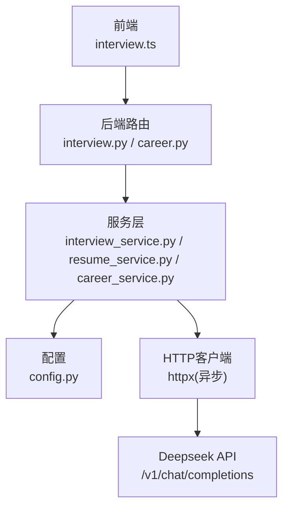
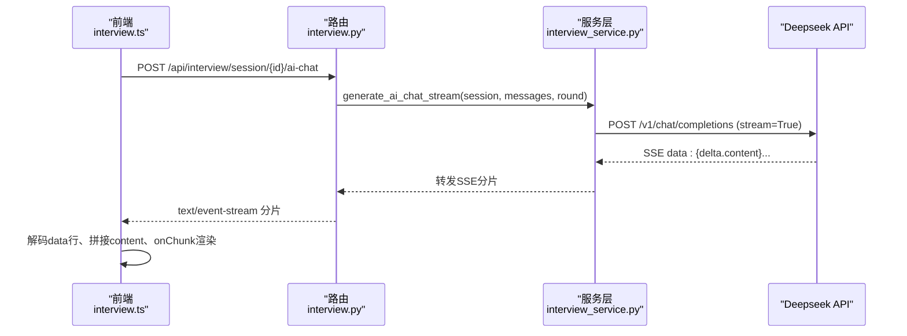
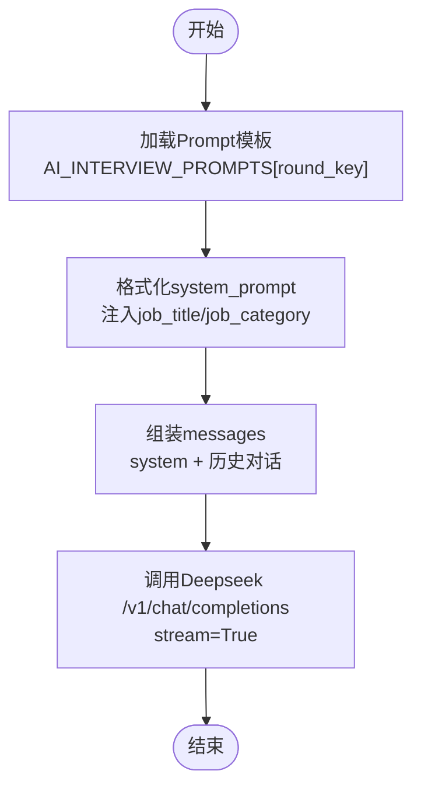
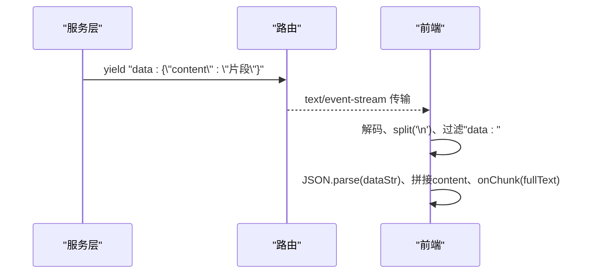
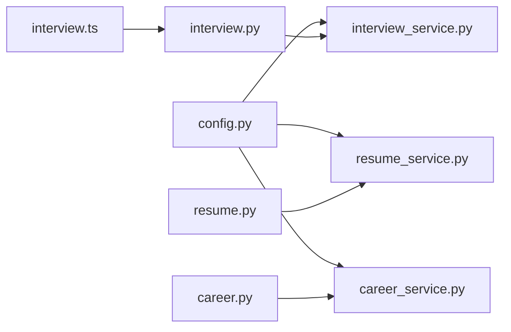

# AI模型集成

<cite>
**本文引用的文件**
- [config.py](file://backEnd/app/config.py)
- [interview_service.py](file://backEnd/app/services/interview_service.py)
- [interview.py](file://backEnd/app/routers/interview.py)
- [resume_service.py](file://backEnd/app/services/resume_service.py)
- [career_service.py](file://backEnd/app/services/career_service.py)
- [career.py](file://backEnd/app/routers/career.py)
- [interview.ts](file://frontEnd/src/stores/interview.ts)
</cite>

## 目录
1. [简介](#简介)
2. [项目结构](#项目结构)
3. [核心组件](#核心组件)
4. [架构总览](#架构总览)
5. [详细组件分析](#详细组件分析)
6. [依赖关系分析](#依赖关系分析)
7. [性能考虑](#性能考虑)
8. [故障排查指南](#故障排查指南)
9. [结论](#结论)
10. [附录](#附录)

## 简介
本技术文档面向HR XF的AI模型集成系统，聚焦Deepseek大模型的集成方案与工程实践。内容覆盖：
- API调用封装、请求参数构建、响应处理（含流式SSE）
- Prompt工程的设计模式（不同面试类型的提示词模板、上下文管理、对话历史维护）
- 流式响应的处理机制（SSE连接管理、实时数据接收、前端渲染优化）
- 错误处理与重试策略（网络异常、API限流、超时等场景）
- AI模型配置管理与切换机制
- 性能优化建议（缓存、并发控制、资源管理等）

## 项目结构
后端采用FastAPI路由+服务层分层设计，AI能力集中在服务层；前端通过Pinia Store发起HTTP请求并处理SSE流。

图表来源
- [interview.py:161-189](file://backEnd/app/routers/interview.py#L161-L189)
- [interview_service.py:797-845](file://backEnd/app/services/interview_service.py#L797-L845)
- [resume_service.py:186-285](file://backEnd/app/services/resume_service.py#L186-L285)
- [career_service.py:590-668](file://backEnd/app/services/career_service.py#L590-L668)
- [config.py:34-37](file://backEnd/app/config.py#L34-L37)

章节来源
- [interview.py:1-317](file://backEnd/app/routers/interview.py#L1-L317)
- [interview_service.py:1-1202](file://backEnd/app/services/interview_service.py#L1-L1202)
- [resume_service.py:140-285](file://backEnd/app/services/resume_service.py#L140-L285)
- [career_service.py:590-668](file://backEnd/app/services/career_service.py#L590-L668)
- [config.py:1-71](file://backEnd/app/config.py#L1-L71)
- [interview.ts:209-253](file://frontEnd/src/stores/interview.ts#L209-L253)

## 核心组件
- 配置中心：集中管理Deepseek API Key、URL、模型名，支持环境变量加载。
- 路由层：暴露REST接口，鉴权校验，转发至服务层，返回普通JSON或SSE流。
- 服务层：封装Deepseek API调用、Prompt组装、流式解析、评分与报告生成。
- 前端Store：统一发起请求、处理SSE分片、拼接完整文本并驱动UI增量渲染。

章节来源
- [config.py:34-37](file://backEnd/app/config.py#L34-L37)
- [interview.py:161-189](file://backEnd/app/routers/interview.py#L161-L189)
- [interview_service.py:797-845](file://backEnd/app/services/interview_service.py#L797-L845)
- [interview.ts:209-253](file://frontEnd/src/stores/interview.ts#L209-L253)

## 架构总览
整体流程：前端发起请求 → FastAPI路由鉴权与参数校验 → 服务层构造Prompt并调用Deepseek → 流式返回SSE → 前端逐块渲染。

图表来源
- [interview.py:161-189](file://backEnd/app/routers/interview.py#L161-L189)
- [interview_service.py:797-845](file://backEnd/app/services/interview_service.py#L797-L845)
- [interview.ts:209-253](file://frontEnd/src/stores/interview.ts#L209-L253)

## 详细组件分析

### Deepseek API调用封装与请求参数构建
- 配置项：API Key、API URL、模型名称在配置中集中定义，便于环境切换与灰度发布。
- 非流式调用：用于评分与建议生成，设置temperature与max_tokens，解析choices[0].message.content。
- 流式调用：使用httpx异步流式读取SSE，按行解析“data: ”前缀，跳过[DONE]，提取delta.content并透传。

章节来源
- [config.py:34-37](file://backEnd/app/config.py#L34-L37)
- [interview_service.py:743-791](file://backEnd/app/services/interview_service.py#L743-L791)
- [interview_service.py:797-845](file://backEnd/app/services/interview_service.py#L797-L845)
- [resume_service.py:140-172](file://backEnd/app/services/resume_service.py#L140-L172)
- [resume_service.py:186-285](file://backEnd/app/services/resume_service.py#L186-L285)
- [career_service.py:590-668](file://backEnd/app/services/career_service.py#L590-L668)

### Prompt工程设计与上下文管理
- 多轮面试Prompt模板：针对“三面·AI面试”和“四面·综合面试”分别定义system指令与首轮问题，包含岗位信息注入与交互规则约束。
- 上下文拼装：将system prompt与用户消息列表合并为messages数组，保持角色(role)与内容(content)。
- 对话历史维护：前端传递messages数组，后端直接追加到API请求，实现多轮上下文延续。

图表来源
- [interview_service.py:415-456](file://backEnd/app/services/interview_service.py#L415-L456)
- [interview_service.py:606-620](file://backEnd/app/services/interview_service.py#L606-L620)
- [interview_service.py:802-825](file://backEnd/app/services/interview_service.py#L802-L825)

章节来源
- [interview_service.py:415-456](file://backEnd/app/services/interview_service.py#L415-L456)
- [interview_service.py:606-620](file://backEnd/app/services/interview_service.py#L606-L620)
- [interview_service.py:802-825](file://backEnd/app/services/interview_service.py#L802-L825)

### 流式响应处理机制（SSE）
- 后端：以StreamingResponse返回text/event-stream，设置no-cache与keep-alive，逐条yield“data: ...”。
- 前端：使用ReadableStream读取二进制块，TextDecoder解码后按换行分割，过滤“data: ”行，解析JSON并累积content，回调onChunk进行增量渲染。

图表来源
- [interview.py:175-189](file://backEnd/app/routers/interview.py#L175-L189)
- [interview_service.py:827-845](file://backEnd/app/services/interview_service.py#L827-L845)
- [interview.ts:228-253](file://frontEnd/src/stores/interview.ts#L228-L253)

章节来源
- [interview.py:175-189](file://backEnd/app/routers/interview.py#L175-L189)
- [interview_service.py:827-845](file://backEnd/app/services/interview_service.py#L827-L845)
- [interview.ts:228-253](file://frontEnd/src/stores/interview.ts#L228-L253)

### 错误处理与重试策略
- 超时处理：httpx.AsyncClient设置timeout，避免长时间阻塞。
- 状态码检查：resp.raise_for_status()抛出HTTP异常，路由层可捕获并返回HTTPException。
- 容错降级：LLM评分与分析失败时返回默认分数与兜底文案，保证业务可用性。
- 重试策略：当前代码未实现显式重试逻辑，建议在网关或服务层引入指数退避重试（如httpx.Retry），对429/5xx进行有限次重试。

章节来源
- [interview_service.py:776-791](file://backEnd/app/services/interview_service.py#L776-L791)
- [interview_service.py:1084-1106](file://backEnd/app/services/interview_service.py#L1084-L1106)
- [interview_service.py:1154-1167](file://backEnd/app/services/interview_service.py#L1154-L1167)
- [resume_service.py:161-172](file://backEnd/app/services/resume_service.py#L161-L172)
- [resume_service.py:207-285](file://backEnd/app/services/resume_service.py#L207-L285)
- [career_service.py:590-668](file://backEnd/app/services/career_service.py#L590-L668)

### AI模型配置管理与切换机制
- 配置来源：从.env加载deepseek_api_key、deepseek_api_url、deepseek_model。
- 运行时获取：get_settings()提供单例化Settings实例，服务层通过全局变量引用。
- 切换建议：可通过环境变量或配置中心动态更新模型名与URL，结合Feature Flag实现A/B测试与灰度发布。

章节来源
- [config.py:7-11](file://backEnd/app/config.py#L7-L11)
- [config.py:34-37](file://backEnd/app/config.py#L34-L37)
- [config.py:68-71](file://backEnd/app/config.py#L68-L71)
- [interview_service.py:29](file://backEnd/app/services/interview_service.py#L29)

### 其他AI功能模块（简历优化与职业推荐）
- 简历优化：支持同步与流式两种模式，流式输出结构化item对象，前端按需渲染。
- 职业推荐：基于评估结果生成岗位推荐与准备建议，流式推送job条目与最终统计。

章节来源
- [resume_service.py:186-285](file://backEnd/app/services/resume_service.py#L186-L285)
- [career_service.py:590-668](file://backEnd/app/services/career_service.py#L590-L668)
- [career.py:140-157](file://backEnd/app/routers/career.py#L140-L157)

## 依赖关系分析
- 路由层依赖服务层，服务层依赖配置与httpx客户端。
- 前端依赖后端REST/SSE接口，不直接访问外部AI服务。
- 关键耦合点：
  - 配置变更影响所有AI调用路径。
  - SSE协议一致性决定前后端兼容性。

图表来源
- [config.py:34-37](file://backEnd/app/config.py#L34-L37)
- [interview.py:161-189](file://backEnd/app/routers/interview.py#L161-L189)
- [interview_service.py:797-845](file://backEnd/app/services/interview_service.py#L797-L845)
- [resume_service.py:186-285](file://backEnd/app/services/resume_service.py#L186-L285)
- [career_service.py:590-668](file://backEnd/app/services/career_service.py#L590-L668)
- [career.py:140-157](file://backEnd/app/routers/career.py#L140-L157)
- [interview.ts:209-253](file://frontEnd/src/stores/interview.ts#L209-L253)

章节来源
- [interview.py:161-189](file://backEnd/app/routers/interview.py#L161-L189)
- [interview_service.py:797-845](file://backEnd/app/services/interview_service.py#L797-L845)
- [resume_service.py:186-285](file://backEnd/app/services/resume_service.py#L186-L285)
- [career_service.py:590-668](file://backEnd/app/services/career_service.py#L590-L668)
- [career.py:140-157](file://backEnd/app/routers/career.py#L140-L157)
- [interview.ts:209-253](file://frontEnd/src/stores/interview.ts#L209-L253)

## 性能考虑
- 流式渲染：SSE分片传输减少首屏延迟，前端增量拼接提升用户体验。
- 并发控制：httpx.AsyncClient复用连接，注意并发上限与后端队列容量。
- 超时与缓冲：合理设置timeout，避免长尾请求占用资源；路由层禁用代理缓冲确保实时性。
- 缓存策略：对静态Prompt模板与岗位分类数据进行内存缓存；对报告与推荐结果落库缓存，避免重复计算。
- 资源管理：及时关闭流式响应与数据库会话，避免连接泄漏。

[本节为通用指导，无需具体文件来源]

## 故障排查指南
- 常见错误
  - 401/403：认证失败或权限不足，检查Authorization头与会话状态。
  - 404：会话不存在或已结束，确认session_id与状态。
  - 429：API限流，需在前端或服务层增加退避重试。
  - 5xx：服务端异常，查看日志与下游AI服务状态。
- 定位步骤
  - 检查后端日志中的HTTP状态与异常堆栈。
  - 验证.env中API Key与URL是否正确。
  - 观察SSE是否持续收到“data: ”行，确认前端解码逻辑。
- 恢复措施
  - 启用重试与熔断，限制最大重试次数与间隔。
  - 降级策略：当AI不可用时返回默认评分与文案，保障基本体验。

章节来源
- [interview.py:167-189](file://backEnd/app/routers/interview.py#L167-L189)
- [interview_service.py:776-791](file://backEnd/app/services/interview_service.py#L776-L791)
- [interview_service.py:1084-1106](file://backEnd/app/services/interview_service.py#L1084-L1106)
- [interview_service.py:1154-1167](file://backEnd/app/services/interview_service.py#L1154-L1167)
- [resume_service.py:161-172](file://backEnd/app/services/resume_service.py#L161-L172)
- [resume_service.py:207-285](file://backEnd/app/services/resume_service.py#L207-L285)
- [career_service.py:590-668](file://backEnd/app/services/career_service.py#L590-L668)

## 结论
本集成方案通过配置集中化、服务层封装、SSE流式传输与前端增量渲染，实现了高效、可扩展的AI模型接入。Prompt工程采用模板化与上下文拼装，适配多种面试类型。当前错误处理具备基础容错，建议补充重试与熔断机制以提升鲁棒性。通过缓存与并发控制优化，可在高并发场景下保持稳定性能。

[本节为总结，无需具体文件来源]

## 附录
- 关键接口
  - POST /api/interview/session/{session_id}/ai-chat：AI多轮对话（SSE）
  - POST /api/interview/session/{session_id}/answer：提交答案并评分
  - GET /api/interview/session/{session_id}/report：获取评分报告
  - POST /api/career/recommend/stream：职业推荐（SSE）
- 前端渲染要点
  - 使用ReadableStream与TextDecoder解码
  - 过滤“data: ”行，解析JSON，累积content并通过onChunk驱动UI
  - 遇到[DONE]终止循环

章节来源
- [interview.py:161-189](file://backEnd/app/routers/interview.py#L161-L189)
- [interview.ts:209-253](file://frontEnd/src/stores/interview.ts#L209-L253)
- [career.py:140-157](file://backEnd/app/routers/career.py#L140-L157)