# AI面试模拟系统

<cite>
**本文引用的文件列表**
- [backEnd/app/main.py](file://backEnd/app/main.py)
- [backEnd/app/routers/interview.py](file://backEnd/app/routers/interview.py)
- [backEnd/app/services/interview_service.py](file://backEnd/app/services/interview_service.py)
- [backEnd/app/models/interview.py](file://backEnd/app/models/interview.py)
- [backEnd/app/schemas/interview.py](file://backEnd/app/schemas/interview.py)
- [backEnd/app/routers/tts.py](file://backEnd/app/routers/tts.py)
- [frontEnd/src/views/InterviewSessionView.vue](file://frontEnd/src/views/InterviewSessionView.vue)
- [frontEnd/src/components/interview/AIVoiceRound.vue](file://frontEnd/src/components/interview/AIVoiceRound.vue)
- [frontEnd/src/components/interview/AssessmentRound.vue](file://frontEnd/src/components/interview/AssessmentRound.vue)
- [frontEnd/src/components/interview/TechRound.vue](file://frontEnd/src/components/interview/TechRound.vue)
- [frontEnd/src/components/interview/BusinessRound.vue](file://frontEnd/src/components/interview/BusinessRound.vue)
- [frontEnd/src/stores/interview.ts](file://frontEnd/src/stores/interview.ts)
- [frontEnd/src/utils/tts.ts](file://frontEnd/src/utils/tts.ts)
</cite>

## 目录
1. [简介](#简介)
2. [项目结构](#项目结构)
3. [核心组件](#核心组件)
4. [架构总览](#架构总览)
5. [详细组件分析](#详细组件分析)
6. [依赖关系分析](#依赖关系分析)
7. [性能与扩展性](#性能与扩展性)
8. [故障排查指南](#故障排查指南)
9. [结论](#结论)
10. [附录：新增面试类型开发指南](#附录新增面试类型开发指南)

## 简介
本技术文档面向HR XF的AI面试模拟系统，系统性阐述多轮次智能面试的架构设计与实现原理，覆盖以下关键主题：
- 多轮面试流程控制、状态管理与错误处理策略
- AI大模型集成方案（Prompt工程、流式响应、对话状态管理）
- 不同面试环节的实现细节（综合素质测评、技术能力面试、业务能力面试、AI语音面试）
- 实时评分算法与面试报告生成机制
- 语音交互功能（TTS集成、音频播放控制、实时语音转文字）
- 性能优化建议与调试方法
- 扩展新面试类型的指导

## 项目结构
后端采用FastAPI构建REST API，提供面试会话、题目获取、答案提交、AI对话流、TTS等接口；前端基于Vue 3 + Pinia，按“轮次”组织组件，通过Store统一调用后端API并维护会话状态。

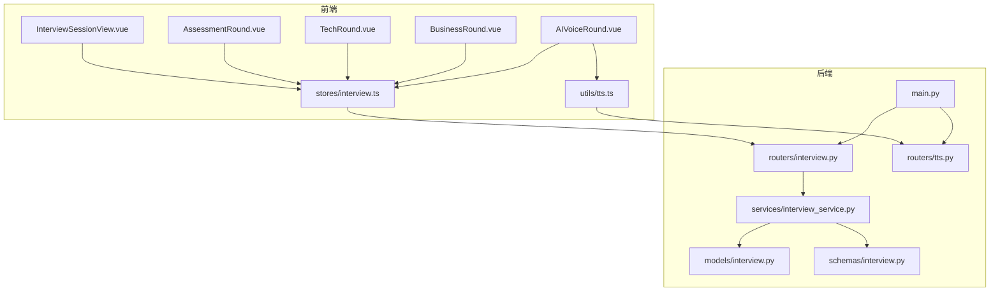

图表来源
- [backEnd/app/main.py:44-68](file://backEnd/app/main.py#L44-L68)
- [backEnd/app/routers/interview.py:26-26](file://backEnd/app/routers/interview.py#L26-L26)
- [backEnd/app/services/interview_service.py:35-41](file://backEnd/app/services/interview_service.py#L35-L41)
- [backEnd/app/models/interview.py:19-57](file://backEnd/app/models/interview.py#L19-L57)
- [backEnd/app/schemas/interview.py:27-46](file://backEnd/app/schemas/interview.py#L27-L46)
- [backEnd/app/routers/tts.py:10-10](file://backEnd/app/routers/tts.py#L10-L10)
- [frontEnd/src/views/InterviewSessionView.vue:292-300](file://frontEnd/src/views/InterviewSessionView.vue#L292-L300)
- [frontEnd/src/stores/interview.ts:128-136](file://frontEnd/src/stores/interview.ts#L128-L136)
- [frontEnd/src/utils/tts.ts:151-167](file://frontEnd/src/utils/tts.ts#L151-L167)

章节来源
- [backEnd/app/main.py:44-68](file://backEnd/app/main.py#L44-L68)
- [backEnd/app/routers/interview.py:26-26](file://backEnd/app/routers/interview.py#L26-L26)
- [backEnd/app/services/interview_service.py:35-41](file://backEnd/app/services/interview_service.py#L35-L41)
- [backEnd/app/models/interview.py:19-57](file://backEnd/app/models/interview.py#L19-L57)
- [backEnd/app/schemas/interview.py:27-46](file://backEnd/app/schemas/interview.py#L27-L46)
- [backEnd/app/routers/tts.py:10-10](file://backEnd/app/routers/tts.py#L10-L10)
- [frontEnd/src/views/InterviewSessionView.vue:292-300](file://frontEnd/src/views/InterviewSessionView.vue#L292-L300)
- [frontEnd/src/stores/interview.ts:128-136](file://frontEnd/src/stores/interview.ts#L128-L136)
- [frontEnd/src/utils/tts.ts:151-167](file://frontEnd/src/utils/tts.ts#L151-L167)

## 核心组件
- 面试会话与会题模型：定义面试会话、题目、答案的数据结构与持久化字段，支撑全流程与单轮模式。
- 面试服务层：封装题库种子数据、CRUD、AI面试官对话、评分与报告生成等核心业务逻辑。
- 路由层：暴露REST接口，包括开始面试、获取题目、提交答案、AI对话SSE流、切屏上报、中止面试、报告查询、历史记录等。
- TTS服务：提供文本转语音MP3流与中文语音列表查询。
- 前端视图与组件：按轮次拆分组件，统一管理会话状态、题目渲染、计时器、答题与结果展示。
- Store：集中封装API请求、SSE流式解析、错误处理与状态同步。
- TTS工具：优先Edge TTS后端，失败降级到Web Speech API，支持停止与声线选择。

章节来源
- [backEnd/app/models/interview.py:19-114](file://backEnd/app/models/interview.py#L19-L114)
- [backEnd/app/services/interview_service.py:489-530](file://backEnd/app/services/interview_service.py#L489-L530)
- [backEnd/app/routers/interview.py:36-189](file://backEnd/app/routers/interview.py#L36-L189)
- [backEnd/app/routers/tts.py:27-50](file://backEnd/app/routers/tts.py#L27-L50)
- [frontEnd/src/views/InterviewSessionView.vue:252-286](file://frontEnd/src/views/InterviewSessionView.vue#L252-L286)
- [frontEnd/src/stores/interview.ts:185-253](file://frontEnd/src/stores/interview.ts#L185-L253)
- [frontEnd/src/utils/tts.ts:151-175](file://frontEnd/src/utils/tts.ts#L151-L175)

## 架构总览
系统采用前后端分离架构，前端通过Pinia Store聚合API调用，后端以FastAPI路由分发至服务层，服务层负责数据库操作、外部LLM调用与报告生成。AI对话使用SSE流式传输，TTS通过独立路由提供高质量语音合成。

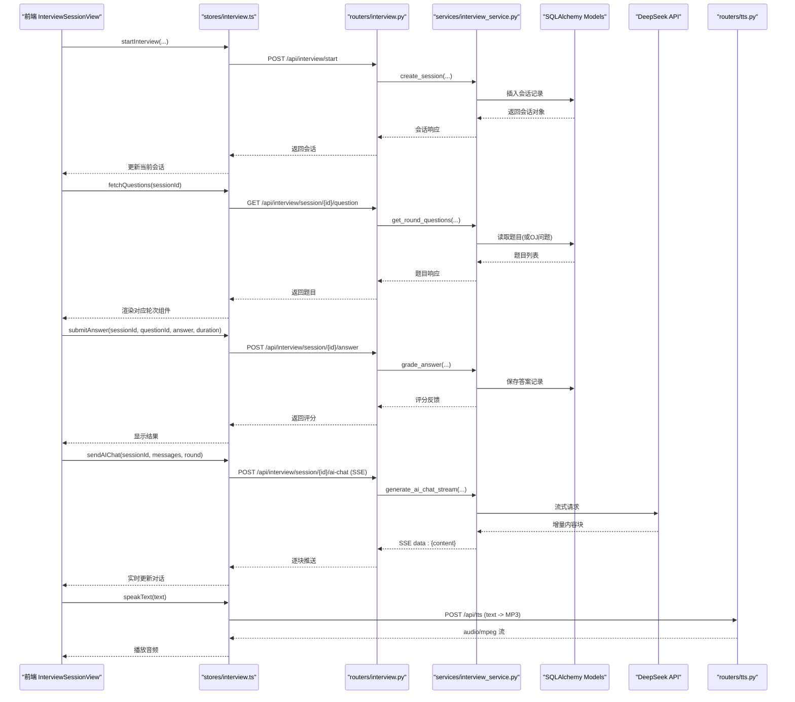

图表来源
- [backEnd/app/routers/interview.py:36-189](file://backEnd/app/routers/interview.py#L36-L189)
- [backEnd/app/services/interview_service.py:489-530](file://backEnd/app/services/interview_service.py#L489-L530)
- [backEnd/app/services/interview_service.py:797-845](file://backEnd/app/services/interview_service.py#L797-L845)
- [backEnd/app/routers/tts.py:27-50](file://backEnd/app/routers/tts.py#L27-L50)
- [frontEnd/src/stores/interview.ts:149-253](file://frontEnd/src/stores/interview.ts#L149-L253)
- [frontEnd/src/utils/tts.ts:151-167](file://frontEnd/src/utils/tts.ts#L151-L167)

## 详细组件分析

### 面试会话与轮次管理
- 会话模型包含岗位信息、当前轮次、状态、作弊计数、面试模式（全流程/单轮）、目标轮次、总分与报告JSON等字段。
- 轮次定义包括：综合素质测评、技术面、业务面、AI三面、AI四面。
- 推进逻辑支持单轮模式直接结束，全流程模式顺序推进至完成。

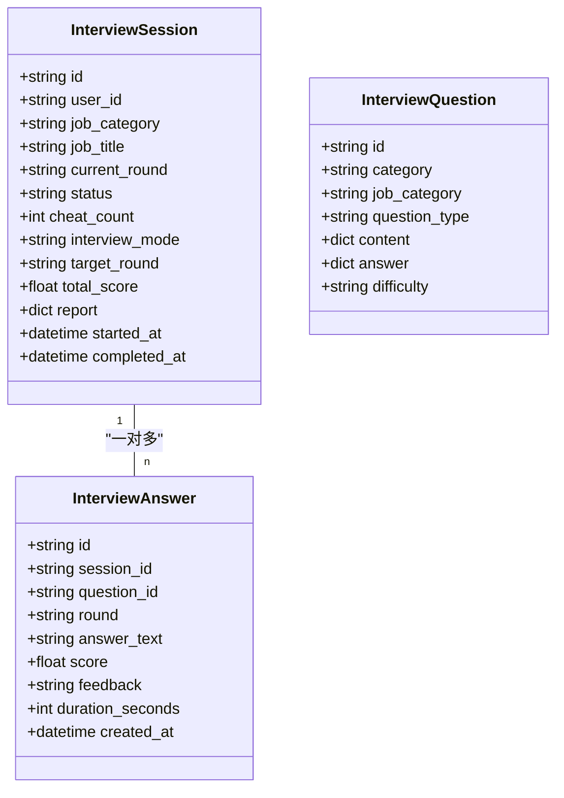

图表来源
- [backEnd/app/models/interview.py:19-114](file://backEnd/app/models/interview.py#L19-L114)

章节来源
- [backEnd/app/models/interview.py:19-114](file://backEnd/app/models/interview.py#L19-L114)
- [backEnd/app/services/interview_service.py:851-872](file://backEnd/app/services/interview_service.py#L851-L872)

### 综合素质测评（选择题）
- 前端组件渲染题目与选项，设置30秒倒计时，提交后即时评分并展示正确答案与解析。
- 后端从题库中随机抽取10道测评题，匹配标准答案进行评分，记录时长与反馈。

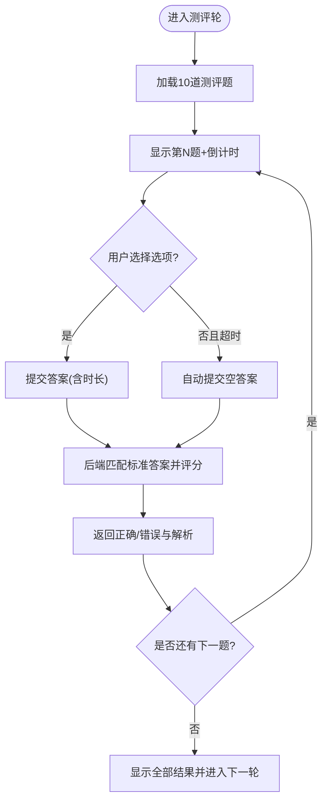

图表来源
- [frontEnd/src/components/interview/AssessmentRound.vue:140-227](file://frontEnd/src/components/interview/AssessmentRound.vue#L140-L227)
- [backEnd/app/services/interview_service.py:536-557](file://backEnd/app/services/interview_service.py#L536-L557)
- [backEnd/app/services/interview_service.py:628-670](file://backEnd/app/services/interview_service.py#L628-L670)

章节来源
- [frontEnd/src/components/interview/AssessmentRound.vue:140-227](file://frontEnd/src/components/interview/AssessmentRound.vue#L140-L227)
- [backEnd/app/services/interview_service.py:536-557](file://backEnd/app/services/interview_service.py#L536-L557)
- [backEnd/app/services/interview_service.py:628-670](file://backEnd/app/services/interview_service.py#L628-L670)

### 技术能力面试（编程题）
- 前端呈现题目描述、输入输出格式、样例与限制，提供代码编辑器与调试运行，支持多种语言。
- 后端复用OJ判题服务，根据提交结果判定分数与反馈，记录时长。

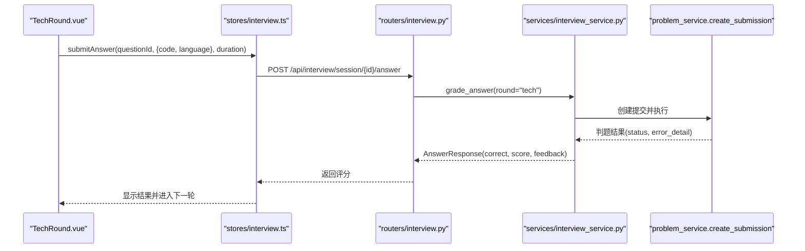

图表来源
- [frontEnd/src/components/interview/TechRound.vue:381-408](file://frontEnd/src/components/interview/TechRound.vue#L381-L408)
- [backEnd/app/services/interview_service.py:671-714](file://backEnd/app/services/interview_service.py#L671-L714)

章节来源
- [frontEnd/src/components/interview/TechRound.vue:381-408](file://frontEnd/src/components/interview/TechRound.vue#L381-L408)
- [backEnd/app/services/interview_service.py:671-714](file://backEnd/app/services/interview_service.py#L671-L714)

### 业务能力面试（判断+选择）
- 前端支持判断题与选择题，每题60秒倒计时，提交后即时评分并展示解析。
- 后端按岗位类别优先抽取题目，匹配标准答案评分。

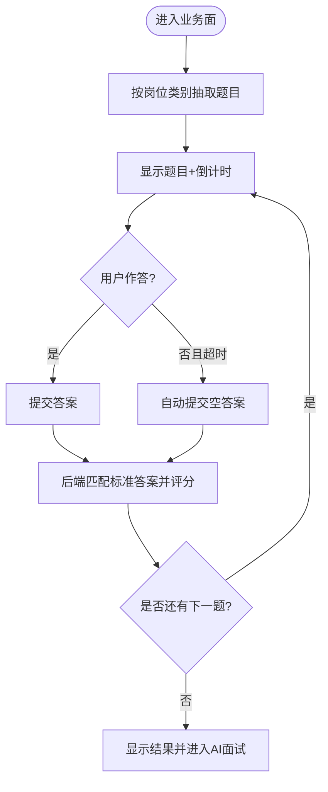

图表来源
- [frontEnd/src/components/interview/BusinessRound.vue:169-258](file://frontEnd/src/components/interview/BusinessRound.vue#L169-L258)
- [backEnd/app/services/interview_service.py:586-604](file://backEnd/app/services/interview_service.py#L586-L604)
- [backEnd/app/services/interview_service.py:628-670](file://backEnd/app/services/interview_service.py#L628-L670)

章节来源
- [frontEnd/src/components/interview/BusinessRound.vue:169-258](file://frontEnd/src/components/interview/BusinessRound.vue#L169-L258)
- [backEnd/app/services/interview_service.py:586-604](file://backEnd/app/services/interview_service.py#L586-L604)
- [backEnd/app/services/interview_service.py:628-670](file://backEnd/app/services/interview_service.py#L628-L670)

### AI语音面试（三面/四面）
- 前端组件包含数字人面试官、对话区、语音录制与TTS控制，支持切换VRM模型。
- 后端使用SSE流式调用大模型，按轮次Prompt模板生成追问，维持对话上下文。
- 回答由LLM评分，记录分数与反馈。

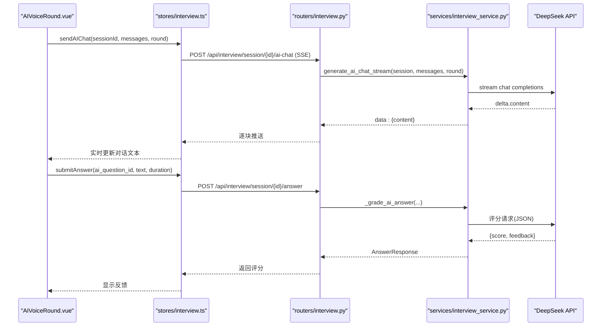

图表来源
- [frontEnd/src/components/interview/AIVoiceRound.vue:312-358](file://frontEnd/src/components/interview/AIVoiceRound.vue#L312-L358)
- [backEnd/app/routers/interview.py:161-189](file://backEnd/app/routers/interview.py#L161-L189)
- [backEnd/app/services/interview_service.py:797-845](file://backEnd/app/services/interview_service.py#L797-L845)
- [backEnd/app/services/interview_service.py:743-791](file://backEnd/app/services/interview_service.py#L743-L791)

章节来源
- [frontEnd/src/components/interview/AIVoiceRound.vue:312-358](file://frontEnd/src/components/interview/AIVoiceRound.vue#L312-L358)
- [backEnd/app/routers/interview.py:161-189](file://backEnd/app/routers/interview.py#L161-L189)
- [backEnd/app/services/interview_service.py:797-845](file://backEnd/app/services/interview_service.py#L797-L845)
- [backEnd/app/services/interview_service.py:743-791](file://backEnd/app/services/interview_service.py#L743-L791)

### 实时评分算法与报告生成
- 各轮次得分映射到雷达维度：技术面与业务面映射专业能力，测评映射逻辑思维，AI面试映射沟通表达，整体百分比映射岗位匹配度。
- 等级划分：≥85为A，≥70为B，≥55为C，否则D。
- 报告包含总分、满分、等级、雷达图、各轮详情、改进建议与综合分析，必要时调用LLM生成建议与分析。

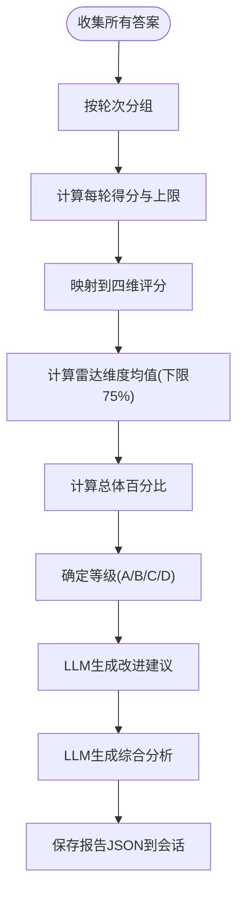

图表来源
- [backEnd/app/services/interview_service.py:893-1019](file://backEnd/app/services/interview_service.py#L893-L1019)
- [backEnd/app/services/interview_service.py:1034-1106](file://backEnd/app/services/interview_service.py#L1034-L1106)
- [backEnd/app/services/interview_service.py:1108-1167](file://backEnd/app/services/interview_service.py#L1108-L1167)

章节来源
- [backEnd/app/services/interview_service.py:893-1019](file://backEnd/app/services/interview_service.py#L893-L1019)
- [backEnd/app/services/interview_service.py:1034-1106](file://backEnd/app/services/interview_service.py#L1034-L1106)
- [backEnd/app/services/interview_service.py:1108-1167](file://backEnd/app/services/interview_service.py#L1108-L1167)

### 语音交互功能（TTS与ASR）
- TTS：后端使用edge-tts将文本转换为MP3流，前端优先调用后端TTS，失败时降级到浏览器Web Speech API。
- ASR：前端使用Web Speech API进行实时语音转文字，支持连续识别与中间结果。

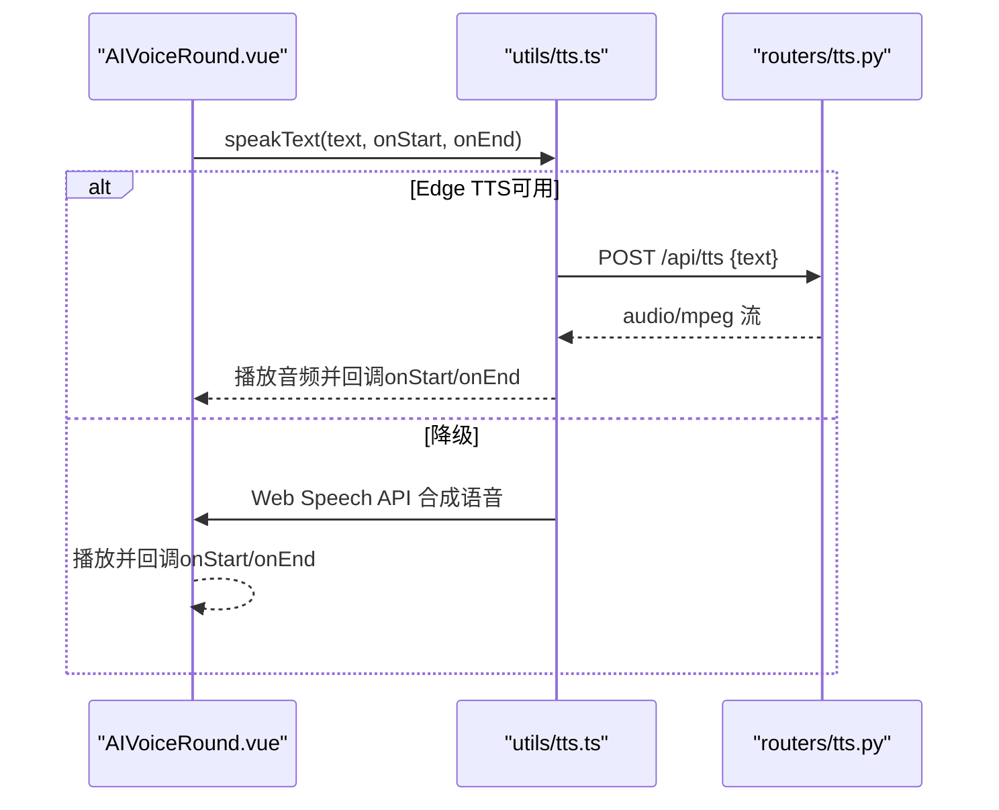

图表来源
- [frontEnd/src/utils/tts.ts:151-167](file://frontEnd/src/utils/tts.ts#L151-L167)
- [backEnd/app/routers/tts.py:27-50](file://backEnd/app/routers/tts.py#L27-L50)
- [frontEnd/src/components/interview/AIVoiceRound.vue:205-219](file://frontEnd/src/components/interview/AIVoiceRound.vue#L205-L219)

章节来源
- [frontEnd/src/utils/tts.ts:151-167](file://frontEnd/src/utils/tts.ts#L151-L167)
- [backEnd/app/routers/tts.py:27-50](file://backEnd/app/routers/tts.py#L27-L50)
- [frontEnd/src/components/interview/AIVoiceRound.vue:205-219](file://frontEnd/src/components/interview/AIVoiceRound.vue#L205-L219)

### 面试流程的状态管理与错误处理
- 状态机：in_progress → completed/aborted，单轮模式完成后直接结束。
- 防作弊：检测页面可见性变化与全屏退出，累计切屏次数≥5自动中止。
- 错误处理：自定义验证异常处理器避免二进制内容导致解码错误；前端统一错误提示与弹窗。

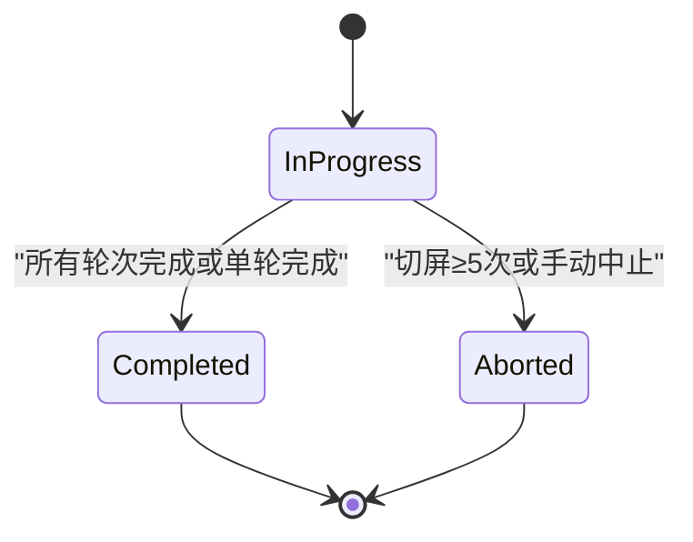

图表来源
- [backEnd/app/services/interview_service.py:851-872](file://backEnd/app/services/interview_service.py#L851-L872)
- [backEnd/app/services/interview_service.py:879-886](file://backEnd/app/services/interview_service.py#L879-L886)
- [backEnd/app/main.py:76-84](file://backEnd/app/main.py#L76-L84)
- [frontEnd/src/views/InterviewSessionView.vue:380-471](file://frontEnd/src/views/InterviewSessionView.vue#L380-L471)

章节来源
- [backEnd/app/services/interview_service.py:851-872](file://backEnd/app/services/interview_service.py#L851-L872)
- [backEnd/app/services/interview_service.py:879-886](file://backEnd/app/services/interview_service.py#L879-L886)
- [backEnd/app/main.py:76-84](file://backEnd/app/main.py#L76-L84)
- [frontEnd/src/views/InterviewSessionView.vue:380-471](file://frontEnd/src/views/InterviewSessionView.vue#L380-L471)

## 依赖关系分析
- 路由与服务耦合清晰：路由仅做参数校验与响应组装，核心逻辑集中在服务层。
- 模型与Schema解耦：Pydantic Schema用于API契约，SQLAlchemy Model用于持久化。
- 前端Store作为唯一API入口，降低组件间耦合。
- 外部依赖：httpx用于异步HTTP请求，edge-tts用于TTS，Web Speech API用于ASR与降级TTS。

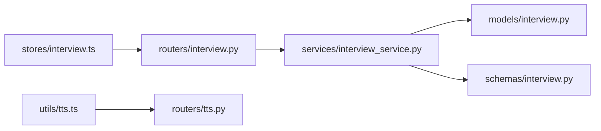

图表来源
- [backEnd/app/routers/interview.py:26-26](file://backEnd/app/routers/interview.py#L26-L26)
- [backEnd/app/services/interview_service.py:15-27](file://backEnd/app/services/interview_service.py#L15-L27)
- [backEnd/app/models/interview.py:19-114](file://backEnd/app/models/interview.py#L19-L114)
- [backEnd/app/schemas/interview.py:27-46](file://backEnd/app/schemas/interview.py#L27-L46)
- [frontEnd/src/stores/interview.ts:128-136](file://frontEnd/src/stores/interview.ts#L128-L136)
- [frontEnd/src/utils/tts.ts:151-167](file://frontEnd/src/utils/tts.ts#L151-L167)
- [backEnd/app/routers/tts.py:10-10](file://backEnd/app/routers/tts.py#L10-L10)

章节来源
- [backEnd/app/routers/interview.py:26-26](file://backEnd/app/routers/interview.py#L26-L26)
- [backEnd/app/services/interview_service.py:15-27](file://backEnd/app/services/interview_service.py#L15-L27)
- [backEnd/app/models/interview.py:19-114](file://backEnd/app/models/interview.py#L19-L114)
- [backEnd/app/schemas/interview.py:27-46](file://backEnd/app/schemas/interview.py#L27-L46)
- [frontEnd/src/stores/interview.ts:128-136](file://frontEnd/src/stores/interview.ts#L128-L136)
- [frontEnd/src/utils/tts.ts:151-167](file://frontEnd/src/utils/tts.ts#L151-L167)
- [backEnd/app/routers/tts.py:10-10](file://backEnd/app/routers/tts.py#L10-L10)

## 性能与扩展性
- SSE流式响应：后端使用httpx.stream与aiter_lines，减少首字节延迟，提升用户体验。
- 并发与超时：LLM请求设置合理超时，避免长时间阻塞；前端SSE读取循环健壮处理异常。
- 缓存与降级：TTS优先高质量后端，失败自动降级到浏览器内置语音，保证可用性。
- 数据库索引：会话与答案表对user_id、session_id建立索引，提高查询效率。
- 扩展点：新增轮次只需在ROUNDS配置中添加key与label，并在get_round_questions与评分逻辑中补充分支。

[本节为通用性能讨论，不直接分析具体文件]

## 故障排查指南
- 验证错误处理：自定义RequestValidationError处理器避免二进制内容导致的UnicodeDecodeError。
- SSE解析异常：前端SSE读取时对非data行与JSON解析异常进行跳过，确保稳定。
- TTS不可用：检查后端TTS服务可达性与网络，确认edge-tts安装与环境变量；前端降级路径会启用Web Speech API。
- 摄像头权限：启动摄像头失败时弹出提示，引导用户授权。
- 切屏与全屏保护：若浏览器不支持Keyboard Lock或拒绝全屏，需关闭保护开关以避免误拦截。

章节来源
- [backEnd/app/main.py:76-84](file://backEnd/app/main.py#L76-L84)
- [frontEnd/src/stores/interview.ts:228-253](file://frontEnd/src/stores/interview.ts#L228-L253)
- [frontEnd/src/utils/tts.ts:151-167](file://frontEnd/src/utils/tts.ts#L151-L167)
- [frontEnd/src/views/InterviewSessionView.vue:626-675](file://frontEnd/src/views/InterviewSessionView.vue#L626-L675)
- [frontEnd/src/views/InterviewSessionView.vue:392-471](file://frontEnd/src/views/InterviewSessionView.vue#L392-L471)

## 结论
本系统通过清晰的模块化设计、稳健的错误处理与流式AI对话，实现了多轮次智能面试的全流程体验。评测、技术、业务与AI语音四类面试环节各有侧重，评分与报告生成机制完善，语音交互具备高可用降级策略。未来可在题库规模、LLM Prompt优化、性能监控与可观测性方面持续演进。

[本节为总结，不直接分析具体文件]

## 附录：新增面试类型开发指南
- 后端步骤
  - 在ROUNDS配置中新增轮次key与label。
  - 在get_round_questions中增加分支，定义题目来源与时间限制。
  - 在grade_answer中增加评分逻辑（如LLM评分或规则评分）。
  - 在generate_report中映射雷达维度与最大分上限。
  - 如需AI对话，添加对应的Prompt模板与first_question。
- 前端步骤
  - 新增轮次组件，遵循现有组件模式（计时器、提交答案、结果展示）。
  - 在InterviewSessionView中注册该轮次组件的条件渲染。
  - 在Store中无需改动，已有submitAnswer与nextRound通用接口。
- 示例参考
  - 轮次定义与进度构建：[backEnd/app/services/interview_service.py:35-66](file://backEnd/app/services/interview_service.py#L35-L66)
  - 题目获取分支：[backEnd/app/services/interview_service.py:536-621](file://backEnd/app/services/interview_service.py#L536-L621)
  - 评分分支：[backEnd/app/services/interview_service.py:628-740](file://backEnd/app/services/interview_service.py#L628-L740)
  - 报告维度映射：[backEnd/app/services/interview_service.py:956-981](file://backEnd/app/services/interview_service.py#L956-L981)
  - 前端轮次组件参考：[frontEnd/src/components/interview/AssessmentRound.vue](file://frontEnd/src/components/interview/AssessmentRound.vue)、[frontEnd/src/components/interview/TechRound.vue](file://frontEnd/src/components/interview/TechRound.vue)、[frontEnd/src/components/interview/BusinessRound.vue](file://frontEnd/src/components/interview/BusinessRound.vue)、[frontEnd/src/components/interview/AIVoiceRound.vue](file://frontEnd/src/components/interview/AIVoiceRound.vue)

章节来源
- [backEnd/app/services/interview_service.py:35-66](file://backEnd/app/services/interview_service.py#L35-L66)
- [backEnd/app/services/interview_service.py:536-621](file://backEnd/app/services/interview_service.py#L536-L621)
- [backEnd/app/services/interview_service.py:628-740](file://backEnd/app/services/interview_service.py#L628-L740)
- [backEnd/app/services/interview_service.py:956-981](file://backEnd/app/services/interview_service.py#L956-L981)
- [frontEnd/src/components/interview/AssessmentRound.vue](file://frontEnd/src/components/interview/AssessmentRound.vue)
- [frontEnd/src/components/interview/TechRound.vue](file://frontEnd/src/components/interview/TechRound.vue)
- [frontEnd/src/components/interview/BusinessRound.vue](file://frontEnd/src/components/interview/BusinessRound.vue)
- [frontEnd/src/components/interview/AIVoiceRound.vue](file://frontEnd/src/components/interview/AIVoiceRound.vue)