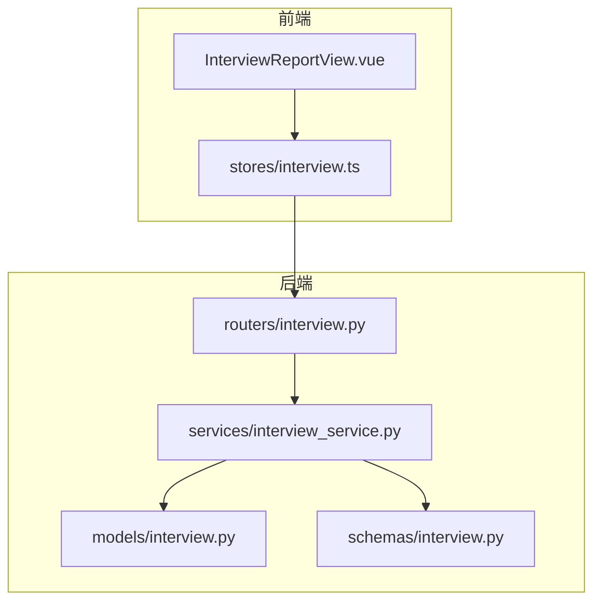
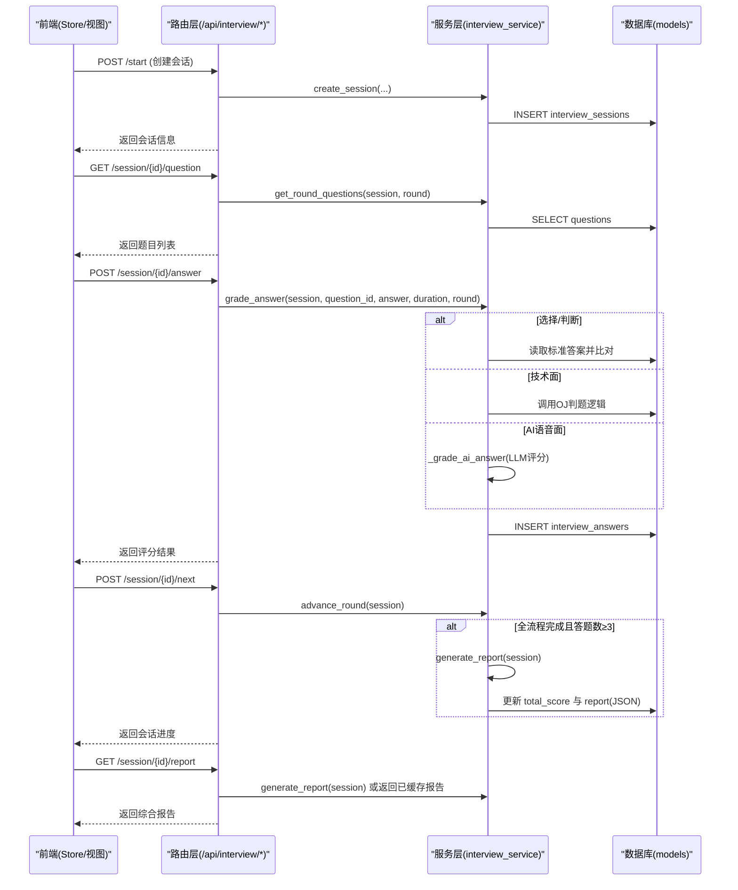
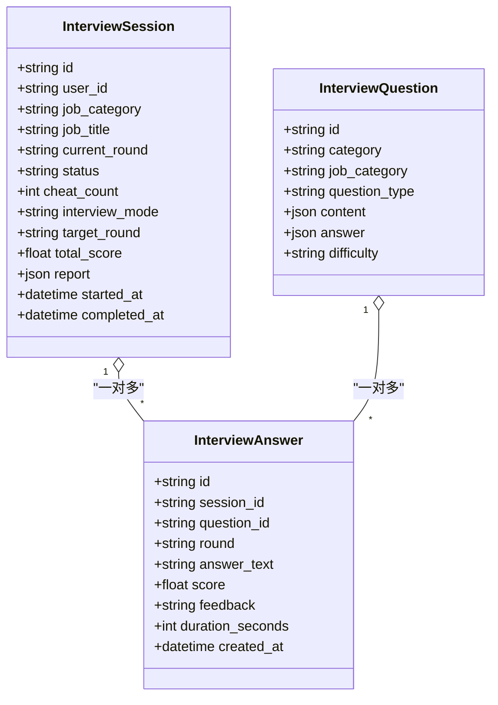
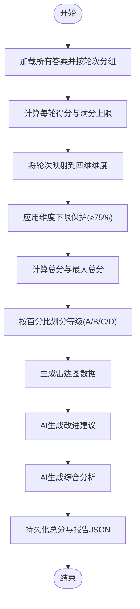
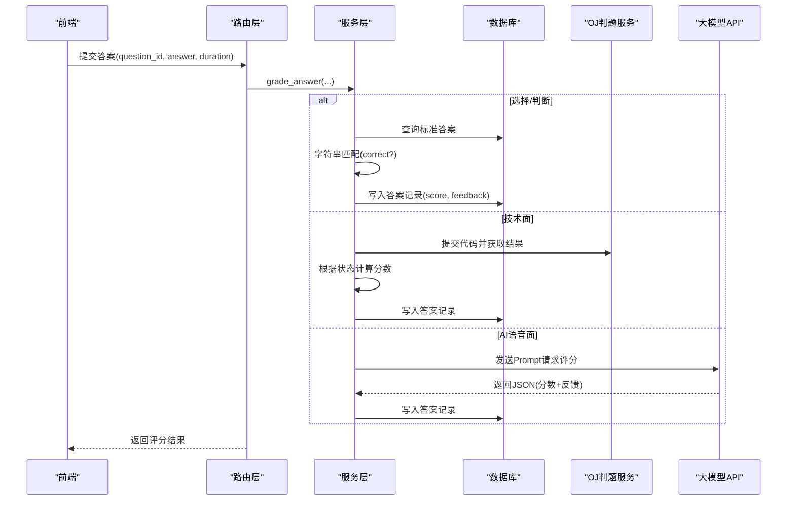
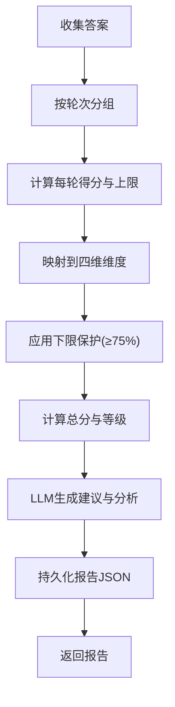
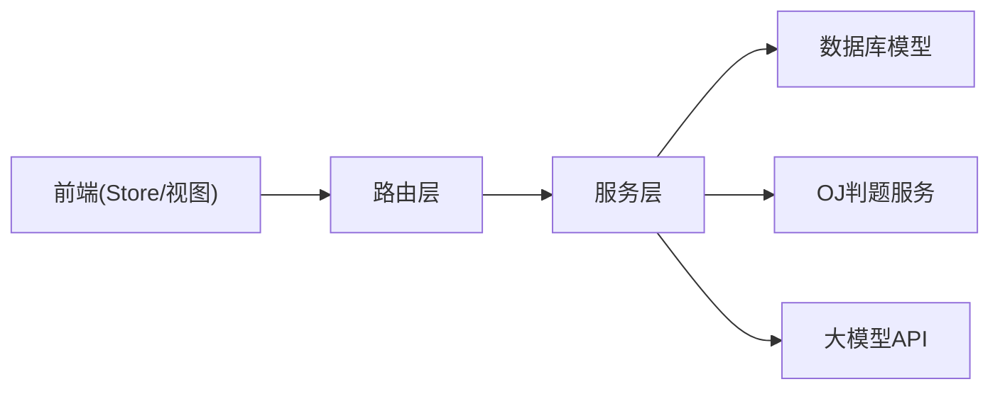

# 评分算法实现

<cite>
**本文引用的文件**   
- [interview.py](file://backEnd/app/models/interview.py)
- [interview_service.py](file://backEnd/app/services/interview_service.py)
- [interview.py](file://backEnd/app/routers/interview.py)
- [interview.py](file://backEnd/app/schemas/interview.py)
- [InterviewReportView.vue](file://frontEnd/src/views/InterviewReportView.vue)
- [interview.ts](file://frontEnd/src/stores/interview.ts)
</cite>

## 目录
1. [引言](#引言)
2. [项目结构](#项目结构)
3. [核心组件](#核心组件)
4. [架构总览](#架构总览)
5. [详细组件分析](#详细组件分析)
6. [依赖关系分析](#依赖关系分析)
7. [性能与可扩展性](#性能与可扩展性)
8. [故障排查指南](#故障排查指南)
9. [结论](#结论)
10. [附录：数据模型与字段说明](#附录数据模型与字段说明)

## 引言
本技术文档围绕 HR XF 的“模拟面试”模块中的评分算法系统，系统性阐述多维度评分设计、自动评分机制、人工评分介入点、数据存储结构、综合报告生成算法以及可配置化扩展能力。文档同时给出前后端交互流程、关键数据结构与可视化呈现方式，帮助读者快速理解并在此基础上进行二次开发与优化。

## 项目结构
后端采用 FastAPI + SQLAlchemy 异步 ORM，前端使用 Vue 3 + Pinia + ECharts。评分相关代码主要分布在以下位置：
- 数据模型：面试会话、题目、答案等实体定义
- 服务层：题库种子、答题评分、AI 对话、轮次推进、报告生成
- 路由层：REST API 暴露（开始面试、提交答案、获取报告等）
- 前端视图与状态：报告展示、雷达图渲染、与后端交互

图表来源
- [interview.py:1-317](file://backEnd/app/routers/interview.py#L1-L317)
- [interview_service.py:1-1202](file://backEnd/app/services/interview_service.py#L1-L1202)
- [interview.py:1-114](file://backEnd/app/models/interview.py#L1-L114)
- [interview.py:1-152](file://backEnd/app/schemas/interview.py#L1-L152)
- [InterviewReportView.vue:1-252](file://frontEnd/src/views/InterviewReportView.vue#L1-L252)
- [interview.ts:1-313](file://frontEnd/src/stores/interview.ts#L1-L313)

章节来源
- [interview.py:1-317](file://backEnd/app/routers/interview.py#L1-L317)
- [interview_service.py:1-1202](file://backEnd/app/services/interview_service.py#L1-L1202)
- [interview.py:1-114](file://backEnd/app/models/interview.py#L1-L114)
- [interview.py:1-152](file://backEnd/app/schemas/interview.py#L1-L152)
- [InterviewReportView.vue:1-252](file://frontEnd/src/views/InterviewReportView.vue#L1-L252)
- [interview.ts:1-313](file://frontEnd/src/stores/interview.ts#L1-L313)

## 核心组件
- 数据模型
  - InterviewSession：面试会话，记录岗位信息、轮次、模式、作弊次数、总分、多维报告 JSON、时间戳等
  - InterviewQuestion：题目库，包含类别、题型、内容、标准答案、难度等
  - InterviewAnswer：答案记录，关联会话与题目，保存用户回答、分数、反馈、用时等
- 服务层
  - 题库种子初始化（综合素质测评、业务面）
  - 按轮次取题（assessment/tech/business/AI语音面）
  - 答题评分（选择题/判断题匹配、OJ判题、LLM评分）
  - AI 多轮对话（SSE流式）
  - 轮次推进与中止
  - 综合报告生成（维度聚合、等级判定、建议与分析）
- 路由层
  - 提供 REST API：开始面试、获取题目、提交答案、下一轮、AI聊天、上报切屏、中止、获取报告、历史列表
- 前端
  - 报告页：总分、等级、雷达图、维度得分、改进建议、AI综合分析
  - Store：封装 API 调用、管理会话与报告状态

章节来源
- [interview.py:19-114](file://backEnd/app/models/interview.py#L19-L114)
- [interview_service.py:35-41](file://backEnd/app/services/interview_service.py#L35-L41)
- [interview_service.py:463-483](file://backEnd/app/services/interview_service.py#L463-L483)
- [interview_service.py:536-622](file://backEnd/app/services/interview_service.py#L536-L622)
- [interview_service.py:628-741](file://backEnd/app/services/interview_service.py#L628-L741)
- [interview_service.py:851-872](file://backEnd/app/services/interview_service.py#L851-L872)
- [interview_service.py:893-1019](file://backEnd/app/services/interview_service.py#L893-L1019)
- [interview.py:36-317](file://backEnd/app/routers/interview.py#L36-L317)
- [InterviewReportView.vue:1-252](file://frontEnd/src/views/InterviewReportView.vue#L1-L252)
- [interview.ts:128-313](file://frontEnd/src/stores/interview.ts#L128-L313)

## 架构总览
整体流程：前端发起请求 → 路由校验与会话加载 → 服务层执行评分或生成报告 → 持久化到数据库 → 返回结构化响应 → 前端渲染报告与雷达图。

图表来源
- [interview.py:36-317](file://backEnd/app/routers/interview.py#L36-L317)
- [interview_service.py:489-511](file://backEnd/app/services/interview_service.py#L489-L511)
- [interview_service.py:536-622](file://backEnd/app/services/interview_service.py#L536-L622)
- [interview_service.py:628-741](file://backEnd/app/services/interview_service.py#L628-L741)
- [interview_service.py:851-872](file://backEnd/app/services/interview_service.py#L851-L872)
- [interview_service.py:893-1019](file://backEnd/app/services/interview_service.py#L893-L1019)

## 详细组件分析

### 数据模型与存储结构
- InterviewSession
  - 关键字段：岗位类别/标题、当前轮次、状态、作弊次数、面试模式、目标轮次、总分、多维报告JSON、开始/完成时间
  - 作用：承载一次完整面试的生命周期与最终汇总结果
- InterviewQuestion
  - 关键字段：类别、岗位类别、题型、内容JSON、标准答案JSON、难度
  - 作用：支撑不同轮次的题目抽取与评分依据
- InterviewAnswer
  - 关键字段：会话ID、题目ID、轮次、回答文本、分数、反馈、用时、创建时间
  - 作用：记录每次作答详情，作为报告生成的基础数据

图表来源
- [interview.py:19-114](file://backEnd/app/models/interview.py#L19-L114)

章节来源
- [interview.py:19-114](file://backEnd/app/models/interview.py#L19-L114)

### 多维度评分算法设计
- 维度划分
  - 专业能力：技术面、业务面表现映射
  - 逻辑思维：综合素质测评表现映射
  - 沟通表达：AI语音面（第三/四面）表现映射
  - 岗位匹配度：基于总分百分比计算
- 评分规则
  - 综合素质测评：每题满分固定，答对得满分，错误得零分；满分上限为固定值
  - 技术面：复用OJ判题，通过得高分，编译错误得零分，其他状态中等分
  - 业务面：同综合素质测评，按题数与满分上限计算
  - AI语音面：由大模型按维度打分，每轮最高分固定，最多轮次限制
- 维度下限保护
  - 各维度得分设置下限阈值（不低于满分的75%），避免极端低分影响雷达图与等级判定
- 等级判定
  - 根据总分占比区间划分为 A/B/C/D 四个等级

图表来源
- [interview_service.py:893-1019](file://backEnd/app/services/interview_service.py#L893-L1019)
- [interview_service.py:1022-1031](file://backEnd/app/services/interview_service.py#L1022-L1031)
- [interview_service.py:1034-1105](file://backEnd/app/services/interview_service.py#L1034-L1105)
- [interview_service.py:1108-1167](file://backEnd/app/services/interview_service.py#L1108-L1167)

章节来源
- [interview_service.py:893-1019](file://backEnd/app/services/interview_service.py#L893-L1019)
- [interview_service.py:1022-1031](file://backEnd/app/services/interview_service.py#L1022-L1031)
- [interview_service.py:1034-1105](file://backEnd/app/services/interview_service.py#L1034-L1105)
- [interview_service.py:1108-1167](file://backEnd/app/services/interview_service.py#L1108-L1167)

### 自动评分实现机制
- 选择题/判断题
  - 从题目库读取标准答案，与用户答案进行大小写无关的字符串匹配
  - 正确得满分，错误得零分，并附带解析反馈
- 技术面（代码题）
  - 复用 OJ 判题服务，根据提交状态判定是否通过
  - 通过得高分，编译错误得零分，其他状态得中等分
- AI语音面
  - 构造评分 Prompt，要求 LLM 以 JSON 格式返回分数与反馈
  - 解析返回内容，异常时回退默认分数与提示
- 关键词匹配与语义理解
  - 当前实现以精确匹配为主；AI语音面通过 LLM 进行语义理解与评分
  - 未来可在选择题/判断题引入关键词权重与语义相似度增强

图表来源
- [interview_service.py:628-741](file://backEnd/app/services/interview_service.py#L628-L741)
- [interview_service.py:743-791](file://backEnd/app/services/interview_service.py#L743-L791)

章节来源
- [interview_service.py:628-741](file://backEnd/app/services/interview_service.py#L628-L741)
- [interview_service.py:743-791](file://backEnd/app/services/interview_service.py#L743-L791)

### 人工评分介入机制
- 当前实现未提供显式的人工评分修正接口
- 可通过以下方式间接支持：
  - 在 InterviewAnswer 中保留原始 answer_text 与 feedback，便于人工复核与标注
  - 在 InterviewSession.report JSON 中追加人工审核标记与修正后的维度分数
  - 后续可扩展：增加人工评分 API（覆盖自动评分）、权重调整参数、审核流程状态机

章节来源
- [interview.py:84-114](file://backEnd/app/models/interview.py#L84-L114)
- [interview.py:48-50](file://backEnd/app/models/interview.py#L48-L50)

### 综合报告生成算法
- 输入：会话内所有答案记录
- 处理步骤：
  - 按轮次分组，计算每轮得分与满分上限
  - 将轮次映射至四维维度（专业、逻辑、沟通、匹配）
  - 应用维度下限保护（≥75%）
  - 计算总分与等级（A/B/C/D）
  - 调用 LLM 生成改进建议与综合分析
  - 持久化总分与报告 JSON 到会话记录
- 输出：结构化报告（总分、等级、雷达图、轮次明细、建议、分析）

图表来源
- [interview_service.py:893-1019](file://backEnd/app/services/interview_service.py#L893-L1019)
- [interview_service.py:1034-1105](file://backEnd/app/services/interview_service.py#L1034-L1105)
- [interview_service.py:1108-1167](file://backEnd/app/services/interview_service.py#L1108-L1167)

章节来源
- [interview_service.py:893-1019](file://backEnd/app/services/interview_service.py#L893-L1019)
- [interview_service.py:1034-1105](file://backEnd/app/services/interview_service.py#L1034-L1105)
- [interview_service.py:1108-1167](file://backEnd/app/services/interview_service.py#L1108-L1167)

### 前端展示与交互
- 报告页面
  - 显示总分、等级、百分比进度条
  - 雷达图展示四维能力得分
  - 列出改进建议与AI综合分析
- 状态管理
  - Store 封装 API 调用，维护会话、题目、答案、报告等状态
  - 支持 SSE 流式接收 AI 对话内容

章节来源
- [InterviewReportView.vue:1-252](file://frontEnd/src/views/InterviewReportView.vue#L1-L252)
- [interview.ts:128-313](file://frontEnd/src/stores/interview.ts#L128-L313)

## 依赖关系分析
- 路由层依赖服务层，服务层依赖数据模型与外部服务（OJ、LLM）
- 前端依赖后端 REST API，并通过 SSE 接收流式数据
- 报告生成依赖答案记录与 LLM 生成能力

图表来源
- [interview.py:1-317](file://backEnd/app/routers/interview.py#L1-L317)
- [interview_service.py:1-1202](file://backEnd/app/services/interview_service.py#L1-L1202)
- [interview.py:1-114](file://backEnd/app/models/interview.py#L1-L114)

章节来源
- [interview.py:1-317](file://backEnd/app/routers/interview.py#L1-L317)
- [interview_service.py:1-1202](file://backEnd/app/services/interview_service.py#L1-L1202)
- [interview.py:1-114](file://backEnd/app/models/interview.py#L1-L114)

## 性能与可扩展性
- 性能特性
  - 异步 IO：数据库与 HTTP 客户端均使用异步，提升并发处理能力
  - 流式输出：AI 对话使用 SSE 流式传输，降低首字节延迟
  - 报告缓存：会话中持久化报告 JSON，避免重复计算
- 可扩展性
  - 轮次与维度映射可配置化：新增轮次只需扩展 ROUNDS 与映射逻辑
  - 评分规则可配置化：满分上限、等级阈值、维度下限均可抽离为配置项
  - 人工评分接入：在 Answer 与 Report 中扩展审核字段与覆盖逻辑
  - 语义增强：在选择题/判断题引入关键词权重与语义相似度评分

[本节为通用指导，不直接分析具体文件]

## 故障排查指南
- 常见错误
  - 题目不存在：返回“题目不存在”，检查题目 ID 与题库初始化
  - 用户不存在：技术面判题前需加载用户对象，若缺失则报错
  - 评分系统异常：LLM 调用失败时回退默认分数与提示
  - 答题数量不足：少于3题无法生成报告，需继续答题
- 定位方法
  - 查看路由层日志与异常抛出
  - 检查服务层对外部服务的调用结果与超时配置
  - 确认数据库中答案记录是否完整（score、feedback、duration_seconds）

章节来源
- [interview_service.py:628-741](file://backEnd/app/services/interview_service.py#L628-L741)
- [interview_service.py:743-791](file://backEnd/app/services/interview_service.py#L743-L791)
- [interview.py:259-303](file://backEnd/app/routers/interview.py#L259-L303)

## 结论
HR XF 的评分算法系统以模块化设计与清晰的职责边界为基础，实现了多维度评分、自动评分与综合报告生成。通过维度下限保护与等级判定，保证了报告的稳定性与可读性。结合 LLM 的能力，系统在 AI 语音面与报告建议方面具备较强的语义理解与个性化输出能力。未来可在人工评分介入、评分规则可配置化与语义增强等方面进一步扩展，以提升准确性与公平性。

[本节为总结性内容，不直接分析具体文件]

## 附录：数据模型与字段说明
- InterviewSession
  - total_score：总分（浮点数）
  - report：多维报告 JSON（包含雷达图、轮次明细、建议、分析等）
  - interview_mode：面试模式（full/single）
  - target_round：单轮练习的目标轮次 key
- InterviewQuestion
  - content：题目内容 JSON（text/options/description 等）
  - answer：标准答案 JSON（correct/explanation）
- InterviewAnswer
  - answer_text：用户回答文本或代码
  - score：该题得分（浮点数）
  - feedback：反馈信息（字符串）
  - duration_seconds：答题用时（秒）
- 报告结构（InterviewReport）
  - total_score/max_total：总分与满分
  - grade：等级（A/B/C/D）
  - radar：四维能力得分（professional/logic/communication/match）
  - round_details：每轮明细（label/score/max_score/answers）
  - suggestions：改进建议数组
  - ai_analysis：AI综合分析段落

章节来源
- [interview.py:19-114](file://backEnd/app/models/interview.py#L19-L114)
- [interview.py:98-152](file://backEnd/app/schemas/interview.py#L98-L152)