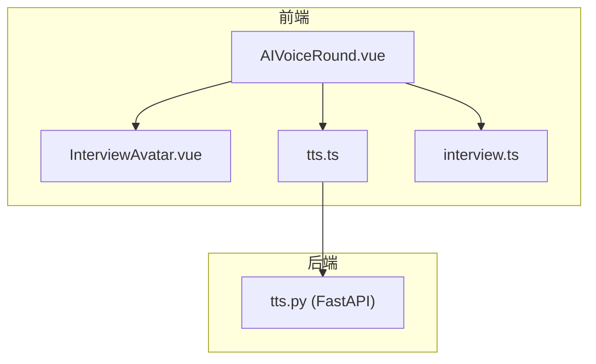
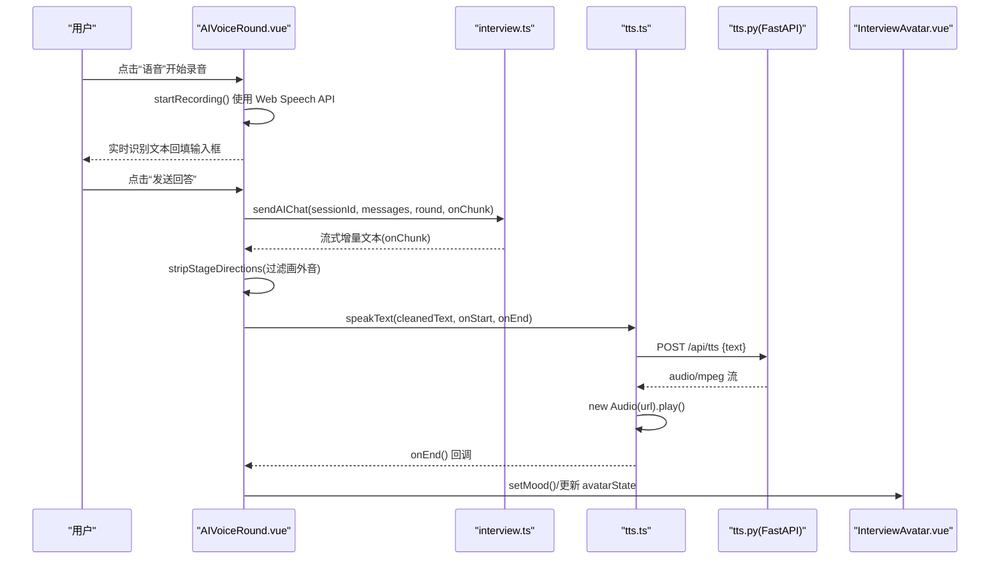
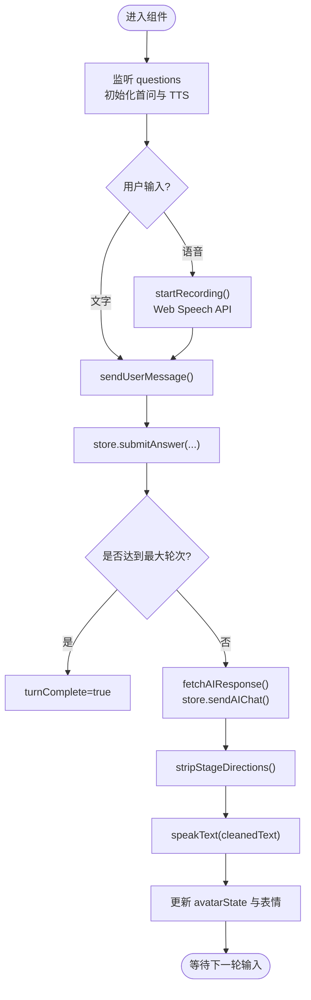
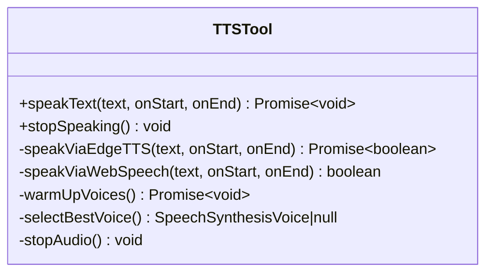
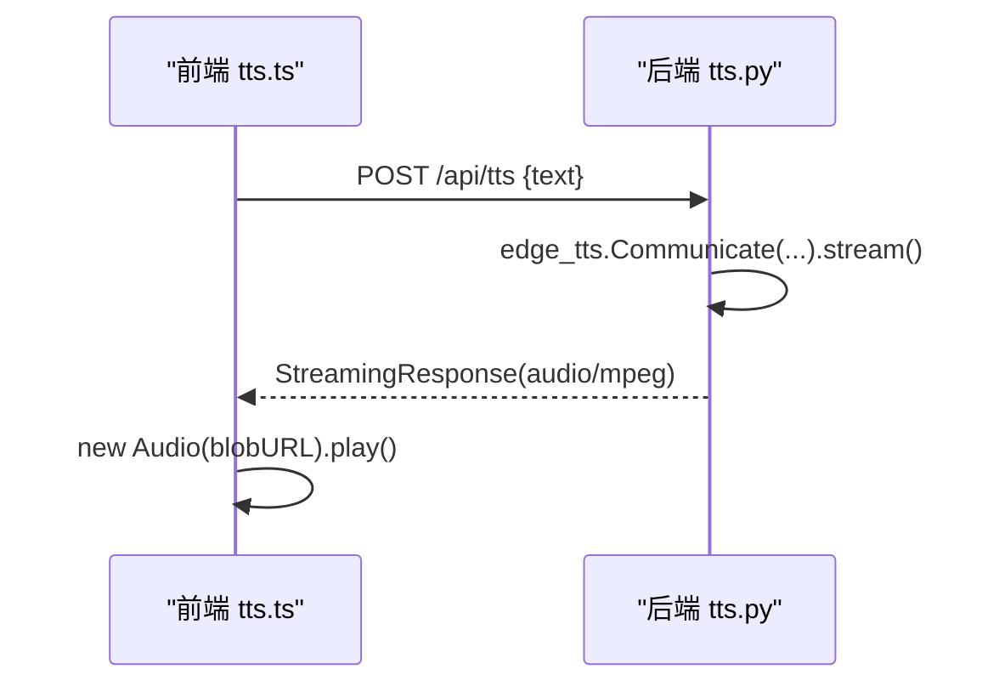
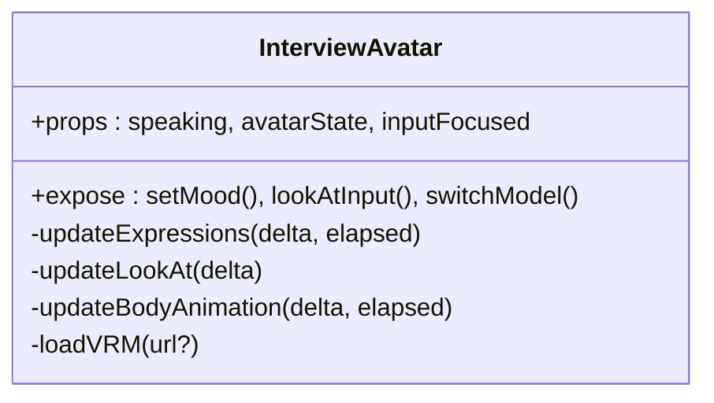
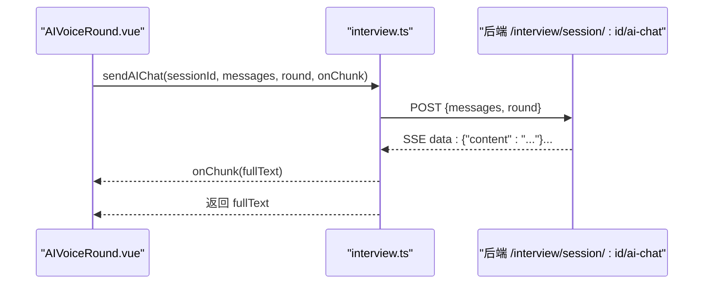
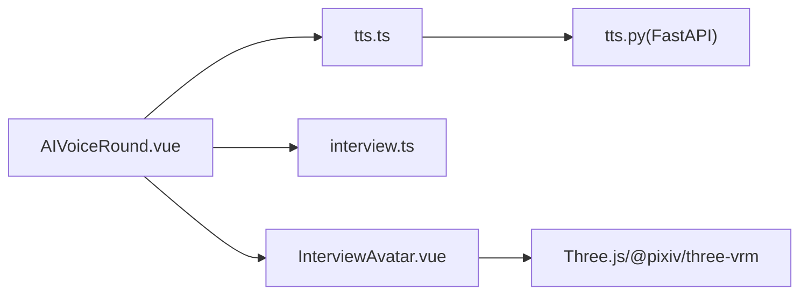

# 语音交互实现

<cite>
**本文引用的文件**
- [AIVoiceRound.vue](file://frontEnd/src/components/interview/AIVoiceRound.vue)
- [tts.ts](file://frontEnd/src/utils/tts.ts)
- [tts.py](file://backEnd/app/routers/tts.py)
- [interview.ts](file://frontEnd/src/stores/interview.ts)
- [InterviewAvatar.vue](file://frontEnd/src/components/interview/InterviewAvatar.vue)
</cite>

## 目录
1. [简介](#简介)
2. [项目结构](#项目结构)
3. [核心组件](#核心组件)
4. [架构总览](#架构总览)
5. [详细组件分析](#详细组件分析)
6. [依赖关系分析](#依赖关系分析)
7. [性能与资源管理](#性能与资源管理)
8. [错误处理与兼容性](#错误处理与兼容性)
9. [结论](#结论)

## 简介
本技术文档围绕 HR XF 的语音交互能力，系统化梳理 TTS（文本转语音）服务集成方案、实时语音交互流程、语音组件设计与接口规范、音频格式与播放控制、以及跨浏览器兼容与移动端适配策略。重点覆盖：
- Edge TTS 后端集成与降级到 Web Speech API 的策略
- 麦克风权限获取、语音识别、文本输入与发送
- AIVoiceRound 组件的 props、事件、状态管理与生命周期
- 音频流式播放与对象 URL 清理
- 错误处理与兼容性方案

## 项目结构
与语音交互相关的核心文件分布如下：
- 前端组件层
  - frontEnd/src/components/interview/AIVoiceRound.vue：面试对话主界面，集成 ASR/TTS、消息流与数字人动画
  - frontEnd/src/components/interview/InterviewAvatar.vue：VRM 数字人渲染与表情/视线/口型动画
- 工具与状态层
  - frontEnd/src/utils/tts.ts：TTS 统一入口，Edge TTS 优先 + Web Speech API 降级
  - frontEnd/src/stores/interview.ts：面试会话、AI 对话流式响应、答案提交等
- 后端服务层
  - backEnd/app/routers/tts.py：FastAPI 路由，基于 edge-tts 生成 MP3 音频流

图表来源
- [AIVoiceRound.vue:1-385](file://frontEnd/src/components/interview/AIVoiceRound.vue#L1-L385)
- [InterviewAvatar.vue:1-694](file://frontEnd/src/components/interview/InterviewAvatar.vue#L1-L694)
- [tts.ts:1-175](file://frontEnd/src/utils/tts.ts#L1-L175)
- [interview.ts:1-313](file://frontEnd/src/stores/interview.ts#L1-L313)
- [tts.py:1-63](file://backEnd/app/routers/tts.py#L1-L63)

章节来源
- [AIVoiceRound.vue:1-385](file://frontEnd/src/components/interview/AIVoiceRound.vue#L1-L385)
- [tts.ts:1-175](file://frontEnd/src/utils/tts.ts#L1-L175)
- [tts.py:1-63](file://backEnd/app/routers/tts.py#L1-L63)
- [interview.ts:1-313](file://frontEnd/src/stores/interview.ts#L1-L313)
- [InterviewAvatar.vue:1-694](file://frontEnd/src/components/interview/InterviewAvatar.vue#L1-L694)

## 核心组件
- AIVoiceRound 组件
  - 职责：组织对话 UI、ASR 录音、TTS 播放、AI 对话流式输出、数字人状态联动、轮次控制
  - 关键状态：isRecording、recognitionText、aiTyping、aiTypingText、isSpeaking、lastAIResponse、turnCount、maxTurns、turnComplete、avatarState、isInputFocused、isEku
  - 关键方法：toggleRecording/startRecording/stopRecording、sendUserMessage、fetchAIResponse、speakText、toggleModel
- tts.ts 工具模块
  - 职责：统一 TTS 入口，优先 Edge TTS 后端，失败自动降级 Web Speech API；提供 speakText 与 stopSpeaking
  - 关键逻辑：warmUpVoices、selectBestVoice、speakViaEdgeTTS、speakViaWebSpeech、stopAudio
- interview.ts Store
  - 职责：面试会话管理、AI 对话流式读取（SSE）、答案提交、报告获取等
  - 关键方法：sendAIChat、submitAnswer、nextRound、fetchReport 等
- InterviewAvatar 组件
  - 职责：VRM 模型加载、表情/视线/口型动画、状态驱动（idle/thinking/satisfied/probing）
  - 暴露方法：setMood、lookAtInput、switchModel

章节来源
- [AIVoiceRound.vue:143-385](file://frontEnd/src/components/interview/AIVoiceRound.vue#L143-L385)
- [tts.ts:1-175](file://frontEnd/src/utils/tts.ts#L1-L175)
- [interview.ts:101-313](file://frontEnd/src/stores/interview.ts#L101-L313)
- [InterviewAvatar.vue:30-210](file://frontEnd/src/components/interview/InterviewAvatar.vue#L30-L210)

## 架构总览
整体数据与控制流如下：
- 用户输入：支持文字输入与语音识别（Web Speech API），识别结果回写到输入框
- AI 对话：通过 store.sendAIChat 发起 SSE 请求，逐块拼接完整回复并显示
- TTS 播放：调用 ttsSpeak，优先 Edge TTS 后端返回 MP3 Blob，使用 HTMLAudioElement 播放；失败则降级到 Web Speech API
- 数字人联动：根据 isSpeaking、avatarState 驱动 VRM 表情与口型动画

图表来源
- [AIVoiceRound.vue:275-358](file://frontEnd/src/components/interview/AIVoiceRound.vue#L275-L358)
- [interview.ts:209-253](file://frontEnd/src/stores/interview.ts#L209-L253)
- [tts.ts:151-167](file://frontEnd/src/utils/tts.ts#L151-L167)
- [tts.py:27-50](file://backEnd/app/routers/tts.py#L27-L50)
- [InterviewAvatar.vue:100-120](file://frontEnd/src/components/interview/InterviewAvatar.vue#L100-L120)

## 详细组件分析

### AIVoiceRound 组件
- Props
  - questions: QuestionItem[]（每轮问题列表）
  - sessionId: string（当前面试会话 ID）
  - round: string（轮次标识，如 ai_voice_3）
- Emits
  - roundComplete：当达到最大轮次或完成全部轮次时触发
- 状态与行为
  - 录音控制：toggleRecording/startRecording/stopRecording，基于 Web Speech API 的 SpeechRecognition
  - 消息发送：sendUserMessage 将用户回答提交至后端，并推进轮次计数
  - AI 回复：fetchAIResponse 调用 store.sendAIChat 获取流式文本，完成后进行文本清洗并触发 TTS
  - TTS 播放：speakText 调用 ttsSpeak，并在结束后恢复 idle 状态
  - 数字人联动：根据用户发送与 AI 回复设置 avatarState 与情绪表情
  - 模型切换：toggleModel 切换 VRM 模型路径（默认与 Eku）
- 初始化与销毁
  - watch questions 初始化首问与首次 TTS
  - onUnmounted 停止录音与 TTS

图表来源
- [AIVoiceRound.vue:362-378](file://frontEnd/src/components/interview/AIVoiceRound.vue#L362-L378)
- [AIVoiceRound.vue:275-310](file://frontEnd/src/components/interview/AIVoiceRound.vue#L275-L310)
- [AIVoiceRound.vue:312-358](file://frontEnd/src/components/interview/AIVoiceRound.vue#L312-L358)
- [AIVoiceRound.vue:205-219](file://frontEnd/src/components/interview/AIVoiceRound.vue#L205-L219)

章节来源
- [AIVoiceRound.vue:143-385](file://frontEnd/src/components/interview/AIVoiceRound.vue#L143-L385)

### TTS 工具模块（tts.ts）
- 设计要点
  - 优先级：Edge TTS 后端 > Web Speech API 降级
  - 音频格式：后端返回 audio/mpeg（MP3），前端以 Blob + Object URL 方式播放
  - 资源管理：onended/onerror 时释放 URL 与 Audio 实例，避免内存泄漏
  - 声线预热：warmUpVoices 提前加载 voiceschanged，确保降级可用
  - 中文声线选择：按优先级匹配 Xiaoxiao/Yaoyao/Huihui/Kangkang
- 公共接口
  - speakText(text, onStart, onEnd)：异步尝试 Edge TTS，失败后同步走 Web Speech API
  - stopSpeaking()：停止 Edge TTS 音频与 Web Speech 合成

图表来源
- [tts.ts:151-175](file://frontEnd/src/utils/tts.ts#L151-L175)
- [tts.ts:13-64](file://frontEnd/src/utils/tts.ts#L13-L64)
- [tts.ts:72-147](file://frontEnd/src/utils/tts.ts#L72-L147)

章节来源
- [tts.ts:1-175](file://frontEnd/src/utils/tts.ts#L1-L175)

### 后端 TTS 路由（tts.py）
- 功能
  - POST /api/tts：接收 text 与可选 voice/rate/pitch/volume，使用 edge-tts 生成 MP3 流
  - GET /api/tts/voices：列出可用的中文语音
- 默认配置
  - 默认语音：zh-CN-XiaoxiaoNeural
  - 语速/音调/音量：略慢、略高、标准音量
- 返回类型
  - media_type: audio/mpeg
  - Content-Disposition: inline; filename=tts.mp3

图表来源
- [tts.py:27-50](file://backEnd/app/routers/tts.py#L27-L50)
- [tts.ts:22-56](file://frontEnd/src/utils/tts.ts#L22-L56)

章节来源
- [tts.py:1-63](file://backEnd/app/routers/tts.py#L1-L63)

### 数字人组件（InterviewAvatar.vue）
- 职责
  - VRM 模型加载与渲染（Three.js + @pixiv/three-vrm）
  - 表情系统（happy/angry/sad/relaxed/surprised）平滑过渡
  - 视线系统（camera/mouse/input）与输入框聚焦联动
  - 口型动画随 isSpeaking 变化
  - 状态动画（idle/thinking/satisfied/probing）
- 对外接口
  - setMood(mood, duration)：设置情绪并自动回归 neutral
  - lookAtInput()：短暂看向输入区域
  - switchModel(url)：动态切换 VRM 模型

图表来源
- [InterviewAvatar.vue:147-210](file://frontEnd/src/components/interview/InterviewAvatar.vue#L147-L210)
- [InterviewAvatar.vue:448-510](file://frontEnd/src/components/interview/InterviewAvatar.vue#L448-L510)
- [InterviewAvatar.vue:404-446](file://frontEnd/src/components/interview/InterviewAvatar.vue#L404-L446)
- [InterviewAvatar.vue:305-369](file://frontEnd/src/components/interview/InterviewAvatar.vue#L305-L369)

章节来源
- [InterviewAvatar.vue:1-694](file://frontEnd/src/components/interview/InterviewAvatar.vue#L1-L694)

### 面试 Store（interview.ts）
- 关键方法
  - sendAIChat(sessionId, messages, round, onChunk)：POST 到 /api/interview/session/{id}/ai-chat，解析 SSE data: JSON 行，累积 fullText 并通过 onChunk 推送增量
  - submitAnswer(sessionId, questionId, answer, durationSeconds)：提交答案与用时
  - nextRound/abortInterview/fetchReport 等：会话与报告管理

图表来源
- [interview.ts:209-253](file://frontEnd/src/stores/interview.ts#L209-L253)
- [AIVoiceRound.vue:312-358](file://frontEnd/src/components/interview/AIVoiceRound.vue#L312-L358)

章节来源
- [interview.ts:101-313](file://frontEnd/src/stores/interview.ts#L101-L313)

## 依赖关系分析
- 组件耦合
  - AIVoiceRound 依赖 tts.ts 与 interview.ts，同时通过 ref 调用 InterviewAvatar 的 expose 方法
  - tts.ts 依赖后端 /api/tts 与浏览器 Web Speech API
  - InterviewAvatar 依赖 Three.js 与 @pixiv/three-vrm
- 外部依赖
  - 后端依赖 edge-tts 库生成高质量中文语音
  - 前端依赖浏览器原生能力：SpeechRecognition/SpeechSynthesis、HTMLAudioElement、Fetch/SSE

图表来源
- [AIVoiceRound.vue:143-385](file://frontEnd/src/components/interview/AIVoiceRound.vue#L143-L385)
- [tts.ts:1-175](file://frontEnd/src/utils/tts.ts#L1-L175)
- [tts.py:1-63](file://backEnd/app/routers/tts.py#L1-L63)
- [InterviewAvatar.vue:1-694](file://frontEnd/src/components/interview/InterviewAvatar.vue#L1-L694)

章节来源
- [AIVoiceRound.vue:143-385](file://frontEnd/src/components/interview/AIVoiceRound.vue#L143-L385)
- [tts.ts:1-175](file://frontEnd/src/utils/tts.ts#L1-L175)
- [tts.py:1-63](file://backEnd/app/routers/tts.py#L1-L63)
- [InterviewAvatar.vue:1-694](file://frontEnd/src/components/interview/InterviewAvatar.vue#L1-L694)

## 性能与资源管理
- 音频播放与内存
  - 每次 Edge TTS 播放前停止上一段音频，避免重叠
  - onended/onerror 时立即 revokeObjectURL 并置空 currentAudio，防止内存泄漏
- 声线预热
  - warmUpVoices 在首次 speakText 前预加载 voiceschanged，降低降级方案的启动延迟
- VRM 资源
  - 模型加载后进行几何体与材质 dispose，切换模型时清理旧资源
  - ResizeObserver 自适应容器尺寸，避免重复计算
- 网络与流式
  - AI 对话采用 SSE 流式传输，减少首屏等待时间
  - TTS 后端一次性收集音频流后返回，适合短文本场景；若需更低延迟可考虑服务端流式播放

[本节为通用指导，不直接分析具体文件]

## 错误处理与兼容性
- 语音识别（ASR）
  - 浏览器不支持：检测 SpeechRecognition/webkitSpeechRecognition 缺失时提示使用文字输入
  - 权限拒绝/设备不支持：onerror 回调中记录错误并停止录音
  - 建议增强：捕获 error 码（如 not-allowed/no-speech/audio-capture），给出明确引导
- TTS 播放
  - Edge TTS 不可用：自动降级到 Web Speech API，并输出警告日志
  - 播放失败：onerror/catch 分支释放资源并返回失败状态
- 网络异常
  - fetch 失败：抛出包含状态码的错误信息，UI 层捕获并提示
  - SSE 中断：read 循环结束即退出，已累积的 fullText 作为最终结果
- 数字人加载
  - VRM 模型未找到或加载失败：显示错误提示，引导放置正确模型文件
- 跨浏览器与移动端
  - Web Speech API 支持度差异：Chrome/Edge 支持较好，Safari 部分版本有限制；建议在入口处检测并提供文字输入兜底
  - 移动端自动播放限制：需在用户手势后触发 play()，当前实现已在用户点击“重新朗读”或 AI 回复完成后调用，符合策略
  - 全屏与切屏保护：面试页面具备全屏模式与切屏记录机制，提升考试公平性

章节来源
- [AIVoiceRound.vue:231-271](file://frontEnd/src/components/interview/AIVoiceRound.vue#L231-L271)
- [tts.ts:151-175](file://frontEnd/src/utils/tts.ts#L151-L175)
- [interview.ts:209-253](file://frontEnd/src/stores/interview.ts#L209-L253)
- [InterviewAvatar.vue:305-369](file://frontEnd/src/components/interview/InterviewAvatar.vue#L305-L369)

## 结论
HR XF 的语音交互方案以“高质量 TTS + 灵活降级 + 流式 AI 对话 + 数字人表现”为核心，兼顾用户体验与稳定性：
- TTS 优先 Edge TTS 后端，失败自动降级 Web Speech API，保证可用性
- ASR 基于 Web Speech API，结合文字输入兜底，提升兼容性
- 流式 AI 对话与即时 TTS 播放形成闭环，配合数字人表情与口型动画增强沉浸感
- 完善的资源清理与错误处理保障性能与健壮性

[本节为总结性内容，不直接分析具体文件]