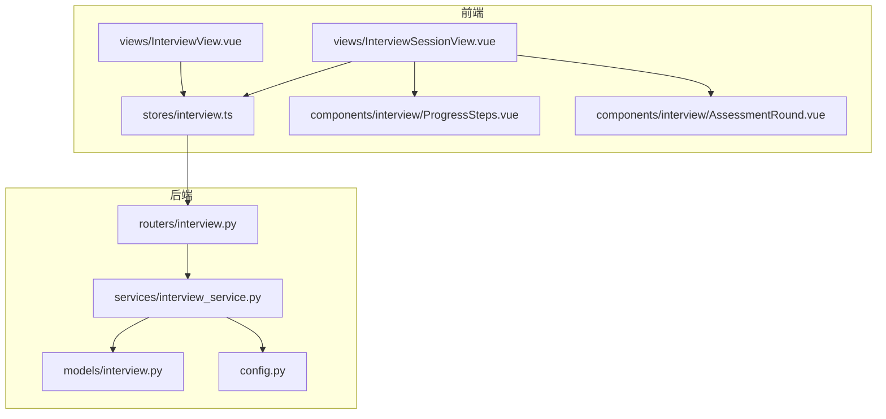
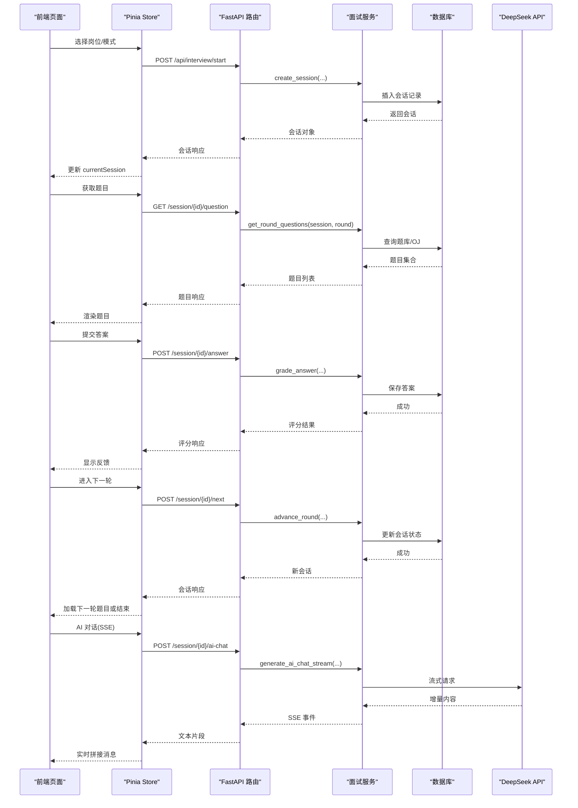
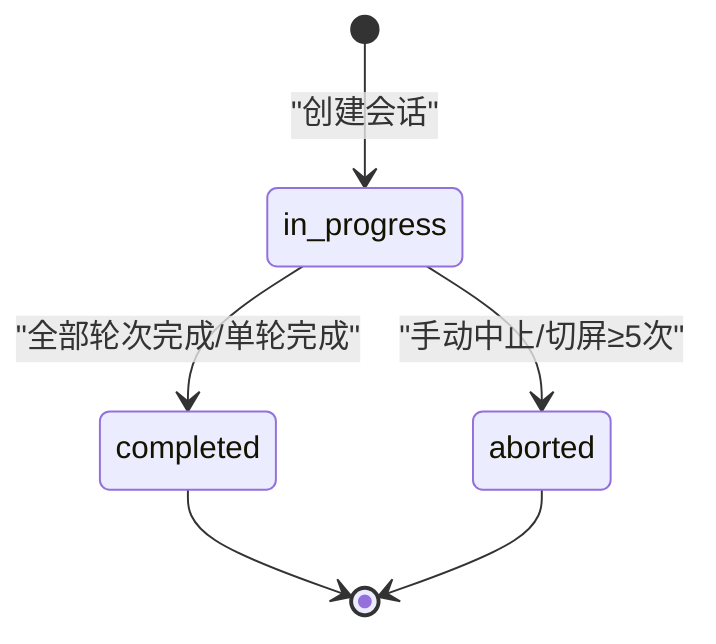
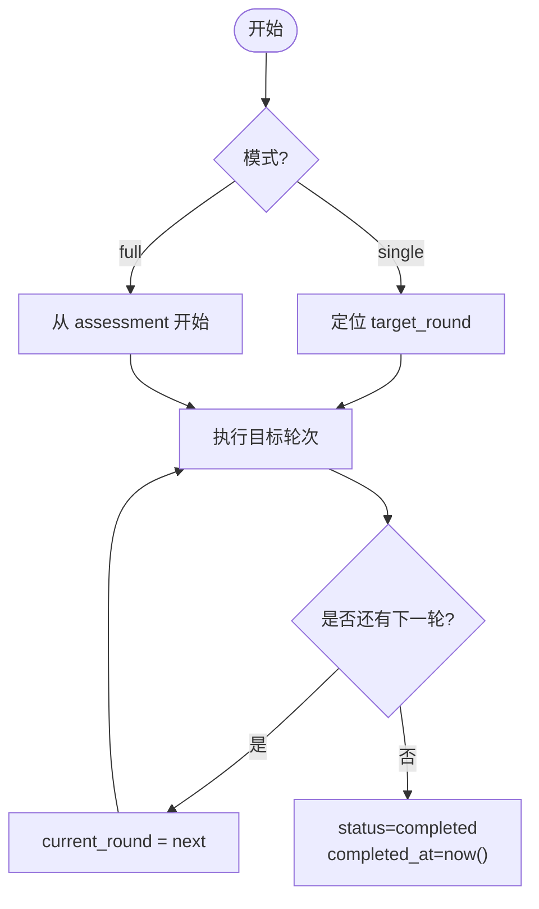
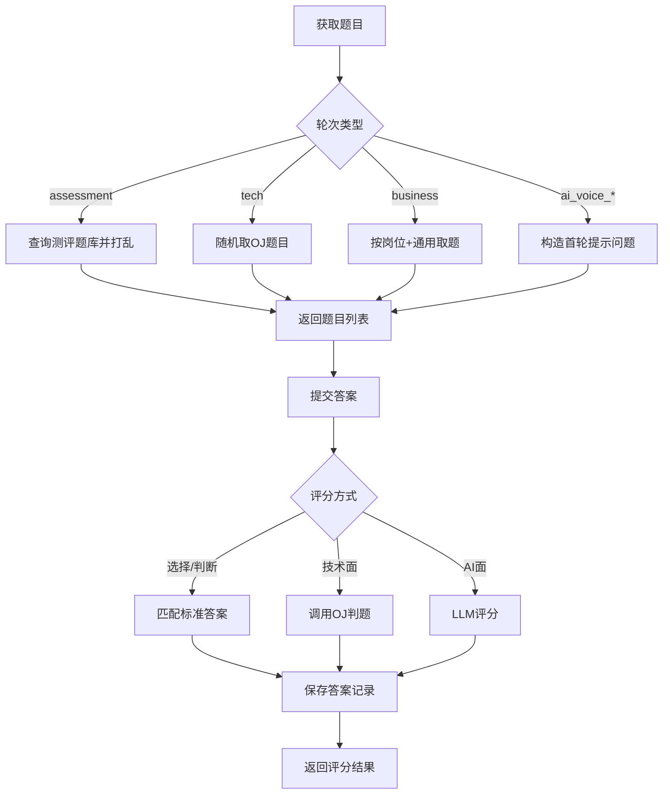
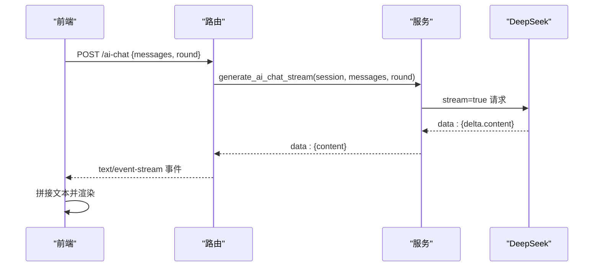
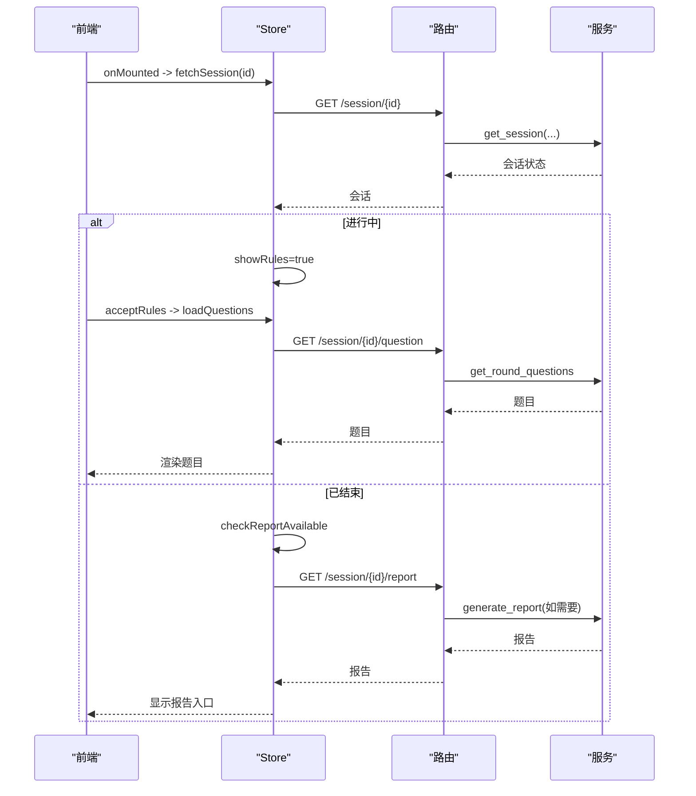
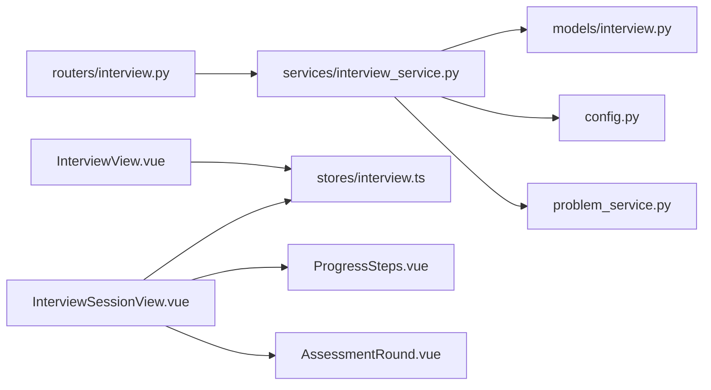

# 面试流程设计

<cite>
**本文引用的文件列表**
- [interview.py](file://backEnd/app/models/interview.py)
- [interview.py](file://backEnd/app/schemas/interview.py)
- [interview.py](file://backEnd/app/routers/interview.py)
- [interview_service.py](file://backEnd/app/services/interview_service.py)
- [config.py](file://backEnd/app/config.py)
- [InterviewSessionView.vue](file://frontEnd/src/views/InterviewSessionView.vue)
- [InterviewView.vue](file://frontEnd/src/views/InterviewView.vue)
- [ProgressSteps.vue](file://frontEnd/src/components/interview/ProgressSteps.vue)
- [AssessmentRound.vue](file://frontEnd/src/components/interview/AssessmentRound.vue)
- [interview.ts](file://frontEnd/src/stores/interview.ts)
</cite>

## 目录
1. [简介](#简介)
2. [项目结构](#项目结构)
3. [核心组件](#核心组件)
4. [架构总览](#架构总览)
5. [详细组件分析](#详细组件分析)
6. [依赖关系分析](#依赖关系分析)
7. [性能与扩展性](#性能与扩展性)
8. [故障排查指南](#故障排查指南)
9. [结论](#结论)
10. [附录：开发扩展指南](#附录开发扩展指南)

## 简介
本技术文档围绕 HR XF 的“模拟面试”系统，系统化阐述多轮次面试的状态管理机制、会话生命周期、轮次控制（assessment/tech/business/ai_voice_3/ai_voice_4）、全流程与单轮练习两种模式的差异、进度跟踪与中断恢复策略、高级配置（模式与目标轮次），以及面向开发者的扩展方法。目标是帮助产品、前端、后端开发者快速理解并安全扩展该模块。

## 项目结构
后端采用 FastAPI + SQLAlchemy 异步 ORM，模型定义在 models，接口路由在 routers，业务逻辑集中在 services；前端使用 Vue 3 + Pinia，状态管理集中于 stores，页面与组件按功能拆分。

图表来源
- [interview.py:1-317](file://backEnd/app/routers/interview.py#L1-L317)
- [interview_service.py:1-1202](file://backEnd/app/services/interview_service.py#L1-L1202)
- [interview.py:1-114](file://backEnd/app/models/interview.py#L1-L114)
- [config.py:1-71](file://backEnd/app/config.py#L1-L71)
- [InterviewView.vue:1-171](file://frontEnd/src/views/InterviewView.vue#L1-L171)
- [InterviewSessionView.vue:1-729](file://frontEnd/src/views/InterviewSessionView.vue#L1-L729)
- [ProgressSteps.vue:1-44](file://frontEnd/src/components/interview/ProgressSteps.vue#L1-L44)
- [AssessmentRound.vue:1-227](file://frontEnd/src/components/interview/AssessmentRound.vue#L1-L227)
- [interview.ts:1-313](file://frontEnd/src/stores/interview.ts#L1-L313)

章节来源
- [interview.py:1-317](file://backEnd/app/routers/interview.py#L1-L317)
- [interview_service.py:1-1202](file://backEnd/app/services/interview_service.py#L1-L1202)
- [interview.py:1-114](file://backEnd/app/models/interview.py#L1-L114)
- [config.py:1-71](file://backEnd/app/config.py#L1-L71)
- [InterviewView.vue:1-171](file://frontEnd/src/views/InterviewView.vue#L1-L171)
- [InterviewSessionView.vue:1-729](file://frontEnd/src/views/InterviewSessionView.vue#L1-L729)
- [ProgressSteps.vue:1-44](file://frontEnd/src/components/interview/ProgressSteps.vue#L1-L44)
- [AssessmentRound.vue:1-227](file://frontEnd/src/components/interview/AssessmentRound.vue#L1-L227)
- [interview.ts:1-313](file://frontEnd/src/stores/interview.ts#L1-L313)

## 核心组件
- InterviewSession 模型：承载一次面试会话的核心信息，包括岗位、当前轮次、状态、模式、目标轮次、作弊次数、评分与报告等。
- 轮次定义与推进：ROUNDS 常量定义五类轮次；advance_round 实现轮次推进与结束判定。
- 题目获取与评分：get_round_questions 按轮次返回不同题型；grade_answer 支持选择题/判断题、代码题（复用OJ判题）、AI对话评分。
- AI 对话与流式输出：generate_ai_chat_stream 通过 SSE 向客户端推送 LLM 回复。
- 报告生成：generate_report 汇总各轮得分、雷达图维度、等级与建议，并持久化到 session.report。
- 前端状态与交互：stores 封装 API 调用，页面负责轮次渲染、防作弊、摄像头录制、SSE 接收等。

章节来源
- [interview.py:19-57](file://backEnd/app/models/interview.py#L19-L57)
- [interview_service.py:35-66](file://backEnd/app/services/interview_service.py#L35-L66)
- [interview_service.py:851-872](file://backEnd/app/services/interview_service.py#L851-L872)
- [interview_service.py:536-621](file://backEnd/app/services/interview_service.py#L536-L621)
- [interview_service.py:628-741](file://backEnd/app/services/interview_service.py#L628-L741)
- [interview_service.py:797-845](file://backEnd/app/services/interview_service.py#L797-L845)
- [interview_service.py:893-1019](file://backEnd/app/services/interview_service.py#L893-L1019)
- [interview.ts:128-313](file://frontEnd/src/stores/interview.ts#L128-L313)
- [InterviewSessionView.vue:292-729](file://frontEnd/src/views/InterviewSessionView.vue#L292-L729)

## 架构总览
整体为前后端分离架构：前端通过 REST/SSE 与后端交互；后端以服务层聚合业务逻辑，数据持久化至 MySQL。

图表来源
- [interview.py:36-158](file://backEnd/app/routers/interview.py#L36-L158)
- [interview_service.py:489-511](file://backEnd/app/services/interview_service.py#L489-L511)
- [interview_service.py:536-621](file://backEnd/app/services/interview_service.py#L536-L621)
- [interview_service.py:628-741](file://backEnd/app/services/interview_service.py#L628-L741)
- [interview_service.py:851-872](file://backEnd/app/services/interview_service.py#L851-L872)
- [interview_service.py:797-845](file://backEnd/app/services/interview_service.py#L797-L845)

## 详细组件分析

### 1) 会话模型与状态机
- 字段要点
  - current_round：当前轮次 key，默认 assessment。
  - status：in_progress/completed/aborted。
  - interview_mode：full/single。
  - target_round：仅 single 模式有效，指定练习轮次。
  - cheat_count：切屏计数，≥5 自动中止。
  - report：JSON 存储评分报告。
- 状态流转
  - in_progress → completed：当所有轮次完成或单轮模式完成后设置。
  - in_progress → aborted：手动中止或切屏≥5次触发。
  - completed/aborted 均会记录 completed_at。

图表来源
- [interview.py:19-57](file://backEnd/app/models/interview.py#L19-L57)
- [interview_service.py:851-872](file://backEnd/app/services/interview_service.py#L851-L872)
- [interview_service.py:879-886](file://backEnd/app/services/interview_service.py#L879-L886)

章节来源
- [interview.py:19-57](file://backEnd/app/models/interview.py#L19-L57)
- [interview_service.py:851-872](file://backEnd/app/services/interview_service.py#L851-L872)
- [interview_service.py:879-886](file://backEnd/app/services/interview_service.py#L879-L886)

### 2) 轮次控制与进度展示
- 轮次定义：assessment → tech → business → ai_voice_3 → ai_voice_4。
- 全流程模式：按顺序推进，直到最后一个轮次结束后标记 completed。
- 单轮模式：仅显示并执行 target_round，完成后直接结束。
- 进度构建：_build_rounds_progress 根据 current_round 与模式计算 pending/active/completed。

图表来源
- [interview_service.py:35-44](file://backEnd/app/services/interview_service.py#L35-L44)
- [interview_service.py:46-66](file://backEnd/app/services/interview_service.py#L46-L66)
- [interview_service.py:851-872](file://backEnd/app/services/interview_service.py#L851-L872)

章节来源
- [interview_service.py:35-66](file://backEnd/app/services/interview_service.py#L35-L66)
- [interview_service.py:851-872](file://backEnd/app/services/interview_service.py#L851-L872)

### 3) 题目获取与评分机制
- 题目来源
  - assessment：固定题库随机抽取若干题。
  - tech：从 OJ 题库随机抽取一道编程题。
  - business：按岗位类别优先匹配，不足则补充通用题。
  - ai_voice_3/ai_voice_4：返回首轮提示问题，后续通过 AI 对话推进。
- 评分规则
  - 选择/判断：与标准答案比对，正确得满分，错误得0分，附带解释。
  - 技术面：复用 OJ 判题，accepted 得高分，编译错误得0分，其他视情况给分。
  - AI 面：调用 LLM 对回答进行结构化评分与反馈。
- 答案持久化：每道题作答后写入 InterviewAnswer，包含轮次、分数、反馈、耗时等。

图表来源
- [interview_service.py:536-621](file://backEnd/app/services/interview_service.py#L536-L621)
- [interview_service.py:628-741](file://backEnd/app/services/interview_service.py#L628-L741)

章节来源
- [interview_service.py:536-621](file://backEnd/app/services/interview_service.py#L536-L621)
- [interview_service.py:628-741](file://backEnd/app/services/interview_service.py#L628-L741)

### 4) AI 对话与流式输出
- 服务端通过 SSE 将 LLM 增量内容推送给前端。
- 前端使用 ReadableStream 解析 data: 行，拼接 content 并实时更新 UI。
- 对话轮次由 Prompt 模板控制，限制最大轮数与风格。

图表来源
- [interview.py:161-189](file://backEnd/app/routers/interview.py#L161-L189)
- [interview_service.py:797-845](file://backEnd/app/services/interview_service.py#L797-L845)
- [interview.ts:209-253](file://frontEnd/src/stores/interview.ts#L209-L253)

章节来源
- [interview.py:161-189](file://backEnd/app/routers/interview.py#L161-L189)
- [interview_service.py:797-845](file://backEnd/app/services/interview_service.py#L797-L845)
- [interview.ts:209-253](file://frontEnd/src/stores/interview.ts#L209-L253)

### 5) 全流程 vs 单轮练习
- 全流程（full）
  - 从 assessment 开始，依次经过 tech、business、ai_voice_3、ai_voice_4。
  - 全部完成后生成综合报告。
- 单轮练习（single）
  - 通过 target_round 指定练习轮次，完成后立即结束。
  - 报告仅针对目标轮次生成。
- 进度条渲染
  - full：显示全部轮次，已完成的标绿，当前轮高亮，未达到的置灰。
  - single：仅显示目标轮次，完成后标绿。

章节来源
- [interview_service.py:46-66](file://backEnd/app/services/interview_service.py#L46-L66)
- [interview_service.py:851-872](file://backEnd/app/services/interview_service.py#L851-L872)
- [ProgressSteps.vue:1-44](file://frontEnd/src/components/interview/ProgressSteps.vue#L1-L44)

### 6) 面试会话生命周期与中断恢复
- 生命周期
  - 创建：start_interview 创建会话，初始化 current_round 与 status=in_progress。
  - 进行中：获取题目、提交答案、AI 对话、上报切屏。
  - 结束：next_round 推进或完成；abort 中止；cheat≥5 自动中止。
  - 报告：答题数≥3 时自动生成或按需生成。
- 中断恢复
  - 前端在进入页面时 fetchSession 恢复状态；若已结束则检查报告可用性。
  - 轮次变化监听自动加载对应题目。
  - 防作弊：visibilitychange/fullscreenchange/键盘拦截等，达到阈值自动中止。

图表来源
- [InterviewSessionView.vue:687-729](file://frontEnd/src/views/InterviewSessionView.vue#L687-L729)
- [interview.ts:173-183](file://frontEnd/src/stores/interview.ts#L173-L183)
- [interview.py:61-82](file://backEnd/app/routers/interview.py#L61-L82)
- [interview_service.py:514-519](file://backEnd/app/services/interview_service.py#L514-L519)
- [interview_service.py:893-1019](file://backEnd/app/services/interview_service.py#L893-L1019)

章节来源
- [InterviewSessionView.vue:687-729](file://frontEnd/src/views/InterviewSessionView.vue#L687-L729)
- [interview.ts:173-183](file://frontEnd/src/stores/interview.ts#L173-L183)
- [interview.py:61-82](file://backEnd/app/routers/interview.py#L61-L82)
- [interview_service.py:514-519](file://backEnd/app/services/interview_service.py#L514-L519)
- [interview_service.py:893-1019](file://backEnd/app/services/interview_service.py#L893-L1019)

### 7) 面试进度跟踪与报告生成
- 进度跟踪
  - rounds_progress 由 _build_rounds_progress 动态计算，前端 ProgressSteps 可视化。
- 报告生成
  - 按轮次分组答案，计算总分与满分上限，映射到四维雷达（专业/逻辑/沟通/匹配）。
  - 等级划分：A/B/C/D 基于百分比阈值。
  - 建议与分析：调用 LLM 生成个性化建议与综合分析段落。
  - 报告持久化：写入 session.report JSON 字段，避免重复计算。

章节来源
- [interview_service.py:46-66](file://backEnd/app/services/interview_service.py#L46-L66)
- [interview_service.py:893-1019](file://backEnd/app/services/interview_service.py#L893-L1019)
- [ProgressSteps.vue:1-44](file://frontEnd/src/components/interview/ProgressSteps.vue#L1-L44)

### 8) 前端关键交互与组件
- 岗位选择与确认：InterviewView 提供分类与岗位网格，确认后创建会话并跳转。
- 面试主视图：InterviewSessionView 统一处理入场须知、防作弊、摄像头录制、轮次切换、报告查看。
- 测评轮次：AssessmentRound 实现倒计时、选项选择、即时提交与历史回顾。
- 进度步骤：ProgressSteps 根据 rounds_progress 渲染步骤状态。

章节来源
- [InterviewView.vue:1-171](file://frontEnd/src/views/InterviewView.vue#L1-L171)
- [InterviewSessionView.vue:1-729](file://frontEnd/src/views/InterviewSessionView.vue#L1-L729)
- [AssessmentRound.vue:1-227](file://frontEnd/src/components/interview/AssessmentRound.vue#L1-L227)
- [ProgressSteps.vue:1-44](file://frontEnd/src/components/interview/ProgressSteps.vue#L1-L44)

## 依赖关系分析
- 后端
  - routers 依赖 schemas 做入参出参校验，依赖 services 执行业务。
  - services 依赖 models 读写数据，依赖 config 读取 DeepSeek 配置。
  - 技术面评分依赖 problem_service（OJ 判题）。
- 前端
  - views 依赖 stores 发起 API 请求与状态管理。
  - components 消费 store 提供的数据与事件回调。

图表来源
- [interview.py:1-317](file://backEnd/app/routers/interview.py#L1-L317)
- [interview_service.py:1-1202](file://backEnd/app/services/interview_service.py#L1-L1202)
- [interview.py:1-114](file://backEnd/app/models/interview.py#L1-L114)
- [config.py:1-71](file://backEnd/app/config.py#L1-L71)
- [InterviewView.vue:1-171](file://frontEnd/src/views/InterviewView.vue#L1-L171)
- [InterviewSessionView.vue:1-729](file://frontEnd/src/views/InterviewSessionView.vue#L1-L729)
- [ProgressSteps.vue:1-44](file://frontEnd/src/components/interview/ProgressSteps.vue#L1-L44)
- [AssessmentRound.vue:1-227](file://frontEnd/src/components/interview/AssessmentRound.vue#L1-L227)
- [interview.ts:1-313](file://frontEnd/src/stores/interview.ts#L1-L313)

章节来源
- [interview.py:1-317](file://backEnd/app/routers/interview.py#L1-L317)
- [interview_service.py:1-1202](file://backEnd/app/services/interview_service.py#L1-L1202)
- [interview.py:1-114](file://backEnd/app/models/interview.py#L1-L114)
- [config.py:1-71](file://backEnd/app/config.py#L1-L71)
- [InterviewView.vue:1-171](file://frontEnd/src/views/InterviewView.vue#L1-L171)
- [InterviewSessionView.vue:1-729](file://frontEnd/src/views/InterviewSessionView.vue#L1-L729)
- [ProgressSteps.vue:1-44](file://frontEnd/src/components/interview/ProgressSteps.vue#L1-L44)
- [AssessmentRound.vue:1-227](file://frontEnd/src/components/interview/AssessmentRound.vue#L1-L227)
- [interview.ts:1-313](file://frontEnd/src/stores/interview.ts#L1-L313)

## 性能与扩展性
- 性能考虑
  - 题目获取：assessment/business 使用随机与分页切片，避免全量加载。
  - 技术面：单次随机取题，减少数据库压力。
  - AI 对话：SSE 流式传输，降低首字节延迟，提升用户体验。
  - 报告生成：仅在答题数≥3时生成，且结果缓存于 session.report。
- 扩展性建议
  - 新增轮次：在 ROUNDS 中追加轮次 key 与 label，并在 get_round_questions 与 _get_round_max_score 中补齐逻辑。
  - 新增题型：在 grade_answer 分支中添加对应评分策略。
  - 调整评分权重：修改 _get_round_max_score 与雷达维度映射逻辑。
  - 配置项：通过 config.py 的 Settings 注入外部服务参数（如 DeepSeek 模型与 URL）。

[本节为通用指导，不直接分析具体文件]

## 故障排查指南
- 常见问题
  - 无法获取题目：检查当前会话状态是否为 in_progress，确认轮次 key 是否存在。
  - 提交答案失败：确认 question_id 存在且属于当前轮次；技术面需确保 OJ 判题可用。
  - AI 对话无响应：检查 DeepSeek API Key/URL/Model 配置；关注网络超时与 SSE 解析异常。
  - 报告不可用：答题数量不足3题；可等待继续作答或重试。
  - 自动中止：切屏次数≥5次导致 aborted；检查前端 visibilitychange 与全屏保护开关。
- 调试建议
  - 后端：打印会话状态与答案计数；检查 report JSON 结构完整性。
  - 前端：观察 SSE 事件流是否正确拼接；确认轮次监听 watch 触发时机。

章节来源
- [interview.py:85-158](file://backEnd/app/routers/interview.py#L85-L158)
- [interview_service.py:628-741](file://backEnd/app/services/interview_service.py#L628-L741)
- [interview_service.py:797-845](file://backEnd/app/services/interview_service.py#L797-L845)
- [interview_service.py:893-1019](file://backEnd/app/services/interview_service.py#L893-L1019)
- [InterviewSessionView.vue:380-471](file://frontEnd/src/views/InterviewSessionView.vue#L380-L471)

## 结论
本系统通过清晰的模型与状态机、灵活的轮次控制、完善的评分与报告机制，实现了全流程与单轮练习两种模式的高效落地。借助 SSE 流式 AI 对话与前端防作弊能力，提供了接近真实面试的体验。未来可在轮次与题型上持续扩展，并通过配置化增强对外部服务的适配能力。

[本节为总结，不直接分析具体文件]

## 附录：开发扩展指南
- 添加新轮次
  - 在 ROUNDS 中增加 key 与 label。
  - 在 get_round_questions 中实现该轮次的题目获取逻辑。
  - 在 _get_round_max_score 中定义满分上限。
  - 如需影响雷达维度，在 generate_report 的维度映射处补充。
- 添加新题型
  - 在 grade_answer 中新增分支，实现评分与答案持久化。
  - 在前端对应轮次组件中支持该题型的交互与提交。
- 配置外部服务
  - 在 config.py 的 Settings 中新增环境变量，并在 services 中通过 get_settings() 读取。
- 前端集成
  - 在 stores 中新增 API 方法与类型定义。
  - 在页面与组件中接入新的轮次渲染与交互逻辑。

章节来源
- [interview_service.py:35-66](file://backEnd/app/services/interview_service.py#L35-L66)
- [interview_service.py:536-621](file://backEnd/app/services/interview_service.py#L536-L621)
- [interview_service.py:628-741](file://backEnd/app/services/interview_service.py#L628-L741)
- [interview_service.py:893-1019](file://backEnd/app/services/interview_service.py#L893-L1019)
- [config.py:1-71](file://backEnd/app/config.py#L1-L71)
- [interview.ts:1-313](file://frontEnd/src/stores/interview.ts#L1-L313)
- [InterviewSessionView.vue:1-729](file://frontEnd/src/views/InterviewSessionView.vue#L1-L729)