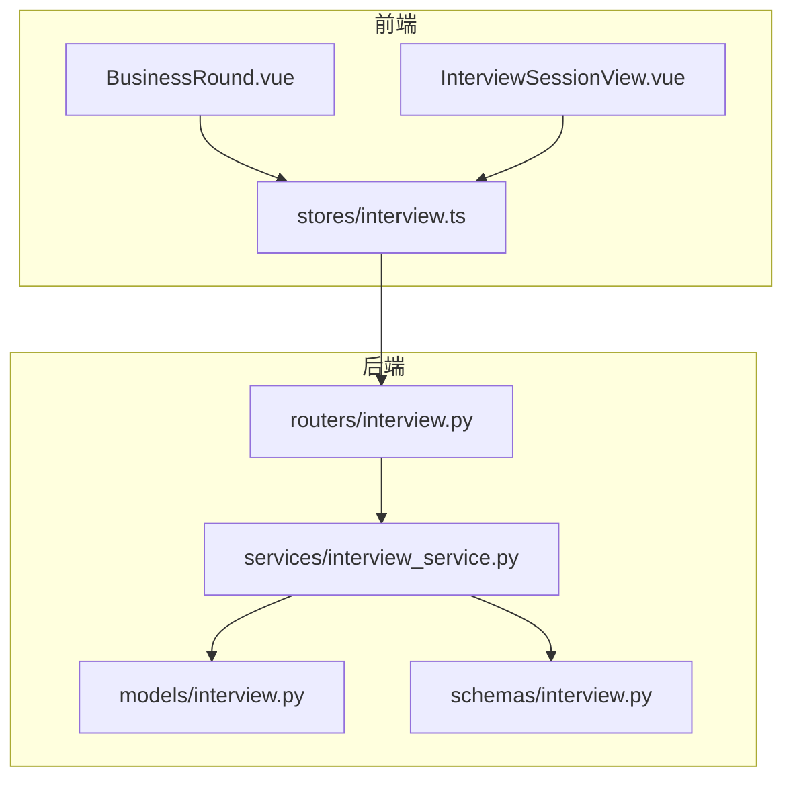
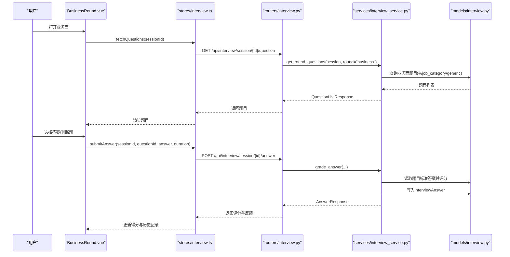
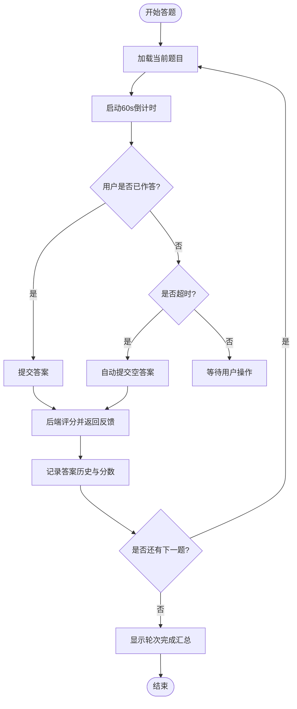
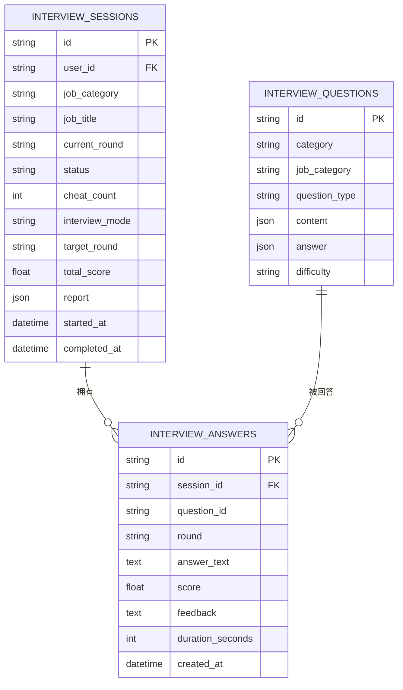
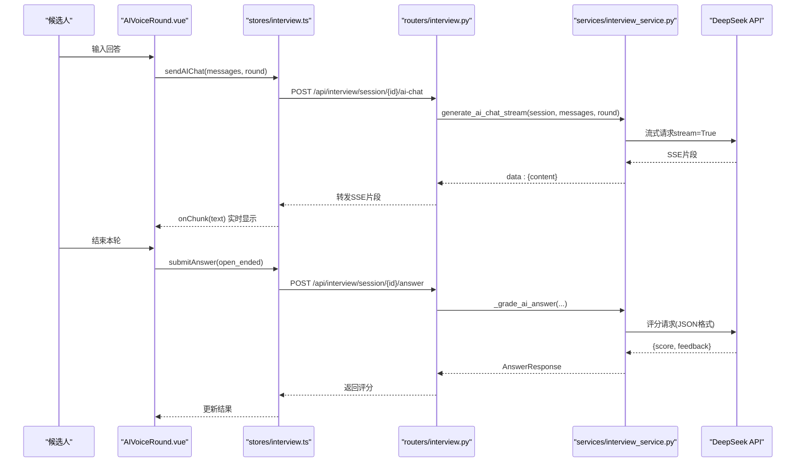
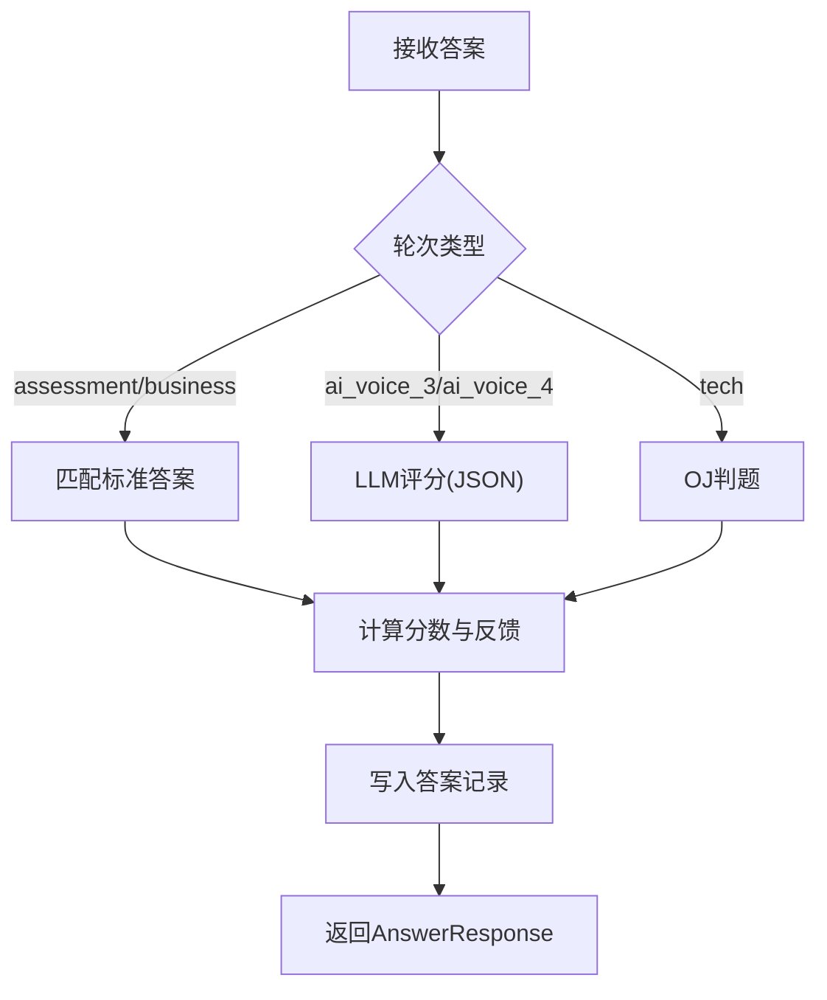
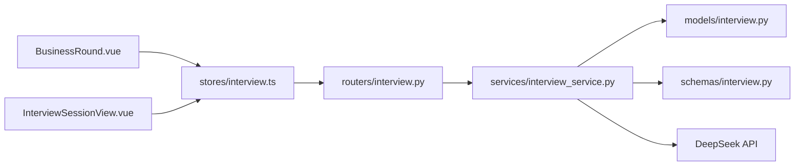

# 业务能力面试环节

<cite>
**本文引用的文件列表**   
- [BusinessRound.vue](file://frontEnd/src/components/interview/BusinessRound.vue)
- [InterviewSessionView.vue](file://frontEnd/src/views/InterviewSessionView.vue)
- [interview.ts](file://frontEnd/src/stores/interview.ts)
- [interview.py（路由）](file://backEnd/app/routers/interview.py)
- [interview_service.py（服务）](file://backEnd/app/services/interview_service.py)
- [interview.py（模型）](file://backEnd/app/models/interview.py)
- [interview.py（模式定义）](file://backEnd/app/schemas/interview.py)
</cite>

## 目录
1. [简介](#简介)
2. [项目结构](#项目结构)
3. [核心组件](#核心组件)
4. [架构总览](#架构总览)
5. [详细组件分析](#详细组件分析)
6. [依赖关系分析](#依赖关系分析)
7. [性能与体验优化](#性能与体验优化)
8. [故障排查指南](#故障排查指南)
9. [结论](#结论)

## 简介
本技术文档聚焦于“二面·业务面”（BusinessRound）在HR XF系统中的实现，覆盖题型支持、数据结构设计、界面交互、评分机制以及用户体验优化等关键方面。系统采用前后端分离架构：前端以Vue 3 + TypeScript构建，后端基于FastAPI提供REST接口，数据库使用MySQL并通过SQLAlchemy ORM建模。业务面主要包含判断题与选择题两种题型，每题限时作答并即时评分，最终汇总生成轮次结果与整体报告。

## 项目结构
围绕业务能力面试的关键代码分布如下：
- 前端
  - 业务面组件：BusinessRound.vue
  - 面试会话视图：InterviewSessionView.vue（负责轮次切换、防作弊、摄像头录制等）
  - 状态管理：stores/interview.ts（封装API调用、数据流）
- 后端
  - 路由层：routers/interview.py（HTTP API）
  - 服务层：services/interview_service.py（题库加载、评分、报告生成、AI对话）
  - 数据模型：models/interview.py（会话、题目、答案）
  - 模式定义：schemas/interview.py（请求/响应结构）

图表来源
- [BusinessRound.vue:1-258](file://frontEnd/src/components/interview/BusinessRound.vue#L1-L258)
- [InterviewSessionView.vue:1-729](file://frontEnd/src/views/InterviewSessionView.vue#L1-L729)
- [interview.ts:1-313](file://frontEnd/src/stores/interview.ts#L1-L313)
- [interview.py（路由）:1-317](file://backEnd/app/routers/interview.py#L1-L317)
- [interview_service.py（服务）:1-1202](file://backEnd/app/services/interview_service.py#L1-L1202)
- [interview.py（模型）:1-114](file://backEnd/app/models/interview.py#L1-L114)
- [interview.py（模式定义）:1-152](file://backEnd/app/schemas/interview.py#L1-L152)

章节来源
- [BusinessRound.vue:1-258](file://frontEnd/src/components/interview/BusinessRound.vue#L1-L258)
- [InterviewSessionView.vue:1-729](file://frontEnd/src/views/InterviewSessionView.vue#L1-L729)
- [interview.ts:1-313](file://frontEnd/src/stores/interview.ts#L1-L313)
- [interview.py（路由）:1-317](file://backEnd/app/routers/interview.py#L1-L317)
- [interview_service.py（服务）:1-1202](file://backEnd/app/services/interview_service.py#L1-L1202)
- [interview.py（模型）:1-114](file://backEnd/app/models/interview.py#L1-L114)
- [interview.py（模式定义）:1-152](file://backEnd/app/schemas/interview.py#L1-L152)

## 核心组件
- BusinessRound.vue：业务面答题界面，支持判断题与选择题，内置倒计时、选项选择、提交与反馈展示、轮次完成汇总。
- InterviewSessionView.vue：统一面试入口，负责轮次调度、字体大小调节、防作弊（切屏检测）、摄像头悬浮窗与录制、轮次完成后的下一轮推进与报告可用性检查。
- stores/interview.ts：集中管理面试会话、题目、答案提交、AI对话、历史与报告等API调用。
- 后端路由与服务：提供获取岗位、创建会话、获取题目、提交答案、进入下一轮、中止面试、AI对话SSE、上报切屏、生成报告等能力。
- 数据模型与模式：定义面试会话、题目、答案的持久化结构与API契约。

章节来源
- [BusinessRound.vue:1-258](file://frontEnd/src/components/interview/BusinessRound.vue#L1-L258)
- [InterviewSessionView.vue:1-729](file://frontEnd/src/views/InterviewSessionView.vue#L1-L729)
- [interview.ts:1-313](file://frontEnd/src/stores/interview.ts#L1-L313)
- [interview.py（路由）:1-317](file://backEnd/app/routers/interview.py#L1-L317)
- [interview_service.py（服务）:1-1202](file://backEnd/app/services/interview_service.py#L1-L1202)
- [interview.py（模型）:1-114](file://backEnd/app/models/interview.py#L1-L114)
- [interview.py（模式定义）:1-152](file://backEnd/app/schemas/interview.py#L1-L152)

## 架构总览
业务面的端到端流程如下：
- 前端通过stores发起请求，后端路由校验与会话状态，服务层根据当前轮次从题库中抽取题目（业务面优先按岗位类别匹配，其次通用）。
- 用户在前端进行判断或选择，计时器驱动自动提交；提交后后端比对标准答案并返回评分与反馈，同时记录答案。
- 轮次完成后，前端触发下一轮推进，若全部结束且答题数满足条件则生成综合报告。

图表来源
- [BusinessRound.vue:1-258](file://frontEnd/src/components/interview/BusinessRound.vue#L1-L258)
- [interview.ts:1-313](file://frontEnd/src/stores/interview.ts#L1-L313)
- [interview.py（路由）:85-119](file://backEnd/app/routers/interview.py#L85-L119)
- [interview_service.py（服务）:536-741](file://backEnd/app/services/interview_service.py#L536-L741)
- [interview.py（模型）:84-114](file://backEnd/app/models/interview.py#L84-L114)

## 详细组件分析

### BusinessRound.vue 组件分析
- 题型支持
  - 判断题：两个按钮（正确/错误），选中后立即提交。
  - 选择题：动态渲染选项，按A/B/C/D字母标识，选中后提交。
- 计时与自动提交
  - 每题60秒倒计时，剩余时间小于阈值时高亮提示；超时未答将自动提交空答案。
- 提交与反馈
  - 提交后计算用时，调用store.submitAnswer，累计总分，并将每题的用户答案、正确答案、反馈与是否答对记录到本地历史数组。
- 轮次完成
  - 当所有题目答完，显示汇总面板，包括总分、每题结果与反馈，并提供进入下一轮的按钮。
- 可访问性与适配
  - 通过注入fontSize，动态调整题干与选项字号，便于不同屏幕尺寸与阅读偏好。

图表来源
- [BusinessRound.vue:1-258](file://frontEnd/src/components/interview/BusinessRound.vue#L1-L258)

章节来源
- [BusinessRound.vue:1-258](file://frontEnd/src/components/interview/BusinessRound.vue#L1-L258)

### 业务题目的数据结构设计
- 题目存储
  - 表：interview_questions
  - 关键字段：category（assessment/tech/business/ai_voice_3/ai_voice_4）、job_category（岗位类别，general表示通用）、question_type（choice/judgment/code/open_ended）、content（JSON，含text、options等）、answer（JSON，含correct、explanation等）、difficulty。
- 业务面内容结构
  - content.text：题干文本（长文本，适合案例背景或问题描述）。
  - content.options：选择题选项数组（判断题无此字段）。
  - answer.correct：标准答案（判断题为true/false字符串，选择题为选项字母）。
  - answer.explanation：解释说明，用于反馈展示。
- 答案记录
  - 表：interview_answers
  - 关键字段：session_id、question_id、round（轮次key）、answer_text、score、feedback、duration_seconds。

图表来源
- [interview.py（模型）:19-114](file://backEnd/app/models/interview.py#L19-L114)

章节来源
- [interview.py（模型）:19-114](file://backEnd/app/models/interview.py#L19-L114)
- [interview_service.py（服务）:236-408](file://backEnd/app/services/interview_service.py#L236-L408)

### 案例分析界面的实现要点
- 长文本展示
  - 题干通过content.text直接渲染，组件内支持动态字号，提升可读性。
- 图表嵌入与附件查看
  - 当前业务面题目以纯文本为主，如需图表或附件，可在content中扩展字段（如images、attachments），由前端解析并渲染对应媒体元素。该扩展点未在现有种子数据中使用，但可通过JSON结构灵活支持。
- 交互与反馈
  - 每道题提交后即时反馈，包含是否正确、正确答案与解释说明，帮助候选人理解知识点。

章节来源
- [BusinessRound.vue:1-258](file://frontEnd/src/components/interview/BusinessRound.vue#L1-L258)
- [interview_service.py（服务）:236-408](file://backEnd/app/services/interview_service.py#L236-L408)

### 情景模拟的交互设计（概念性说明）
- 角色扮演对话
  - 通过AI语音面试轮次（ai_voice_3/ai_voice_4）实现多轮对话，后端使用SSE流式返回LLM回复，前端逐字拼接显示。
- 决策分支
  - 可根据候选人的回答动态调整后续问题，形成分支路径，增强真实感。
- 结果评估
  - AI面试官回答后，后端调用LLM进行评分，返回分数与建议，并记录到答案表中。

图表来源
- [interview.py（路由）:161-189](file://backEnd/app/routers/interview.py#L161-L189)
- [interview_service.py（服务）:797-845](file://backEnd/app/services/interview_service.py#L797-L845)
- [interview_service.py（服务）:743-791](file://backEnd/app/services/interview_service.py#L743-L791)
- [interview.ts:209-253](file://frontEnd/src/stores/interview.ts#L209-L253)

章节来源
- [interview.py（路由）:161-189](file://backEnd/app/routers/interview.py#L161-L189)
- [interview_service.py（服务）:743-845](file://backEnd/app/services/interview_service.py#L743-L845)
- [interview.ts:209-253](file://frontEnd/src/stores/interview.ts#L209-L253)

### 专业问答的评分机制
- 选择题/判断题
  - 后端读取题目标准答案，比较用户答案（忽略大小写与空白差异），正确得满分（业务面每题10分），错误得0分，并附带解释说明作为反馈。
- 开放题（AI面试）
  - 使用LLM进行评分，要求返回JSON格式的分数与建议，后端解析并保存。
- 技术面（参考）
  - 复用OJ判题逻辑，根据提交结果判定是否通过，给出相应分数与反馈。

图表来源
- [interview_service.py（服务）:628-741](file://backEnd/app/services/interview_service.py#L628-L741)

章节来源
- [interview_service.py（服务）:628-741](file://backEnd/app/services/interview_service.py#L628-L741)

### 业务领域知识的集成方式（概念性说明）
- 行业术语库
  - 可在content.answer.explanation中引用术语解释，或在题库中增加术语映射字段，便于前端展示与检索。
- 最佳实践案例
  - 通过content扩展字段（如cases、references）承载案例链接或摘要，结合富文本渲染呈现。
- 专家建议
  - 在报告生成阶段，结合LLM输出个性化建议，或引入外部知识库API进行补充。

[本节为概念性说明，不直接分析具体文件]

### 用户体验优化
- 富文本编辑与多媒体支持
  - 当前业务面以纯文本为主，如需富文本与多媒体，可在content中新增字段并由前端解析渲染。
- 移动端适配
  - 组件采用响应式布局与动态字号，配合全屏保护与摄像头悬浮窗，提升移动端体验。
- 字体大小调节
  - 在选择题轮次（assessment/business）顶部提供A-/A+按钮，通过provide/inject向子组件传递fontSize。

章节来源
- [InterviewSessionView.vue:1-729](file://frontEnd/src/views/InterviewSessionView.vue#L1-L729)
- [BusinessRound.vue:1-258](file://frontEnd/src/components/interview/BusinessRound.vue#L1-L258)

## 依赖关系分析
- 前端依赖
  - BusinessRound.vue依赖stores/interview.ts提供的submitAnswer、fetchQuestions等方法。
  - InterviewSessionView.vue负责轮次切换与全局状态，调用stores方法推进下一轮与中止面试。
- 后端依赖
  - routers/interview.py依赖services/interview_service.py的业务逻辑。
  - services/interview_service.py依赖models/interview.py的数据模型与schemas/interview.py的模式定义。
- 外部依赖
  - DeepSeek API用于AI对话与评分，通过httpx异步客户端调用。

图表来源
- [BusinessRound.vue:1-258](file://frontEnd/src/components/interview/BusinessRound.vue#L1-L258)
- [InterviewSessionView.vue:1-729](file://frontEnd/src/views/InterviewSessionView.vue#L1-L729)
- [interview.ts:1-313](file://frontEnd/src/stores/interview.ts#L1-L313)
- [interview.py（路由）:1-317](file://backEnd/app/routers/interview.py#L1-L317)
- [interview_service.py（服务）:1-1202](file://backEnd/app/services/interview_service.py#L1-L1202)
- [interview.py（模型）:1-114](file://backEnd/app/models/interview.py#L1-L114)
- [interview.py（模式定义）:1-152](file://backEnd/app/schemas/interview.py#L1-L152)

章节来源
- [interview.py（路由）:1-317](file://backEnd/app/routers/interview.py#L1-L317)
- [interview_service.py（服务）:1-1202](file://backEnd/app/services/interview_service.py#L1-L1202)
- [interview.py（模型）:1-114](file://backEnd/app/models/interview.py#L1-L114)
- [interview.py（模式定义）:1-152](file://backEnd/app/schemas/interview.py#L1-L152)
- [interview.ts:1-313](file://frontEnd/src/stores/interview.ts#L1-L313)
- [BusinessRound.vue:1-258](file://frontEnd/src/components/interview/BusinessRound.vue#L1-L258)
- [InterviewSessionView.vue:1-729](file://frontEnd/src/views/InterviewSessionView.vue#L1-L729)

## 性能与体验优化
- 前端
  - 使用computed与watch减少不必要的重渲染；计时器在组件卸载时清理，避免内存泄漏。
  - 动态字号与响应式布局提升可读性与跨设备适配。
- 后端
  - 题目抽取使用随机打乱与限制数量，降低单次负载；评分逻辑简单高效，AI评分设置合理超时与容错。
  - SSE流式返回提升AI对话体验，减少首字节延迟。
- 数据库
  - JSON字段灵活承载题目内容与答案，便于扩展；索引字段（user_id、status、category、job_category）提升查询效率。

[本节提供一般性指导，不直接分析具体文件]

## 故障排查指南
- 题目加载失败
  - 检查路由GET /api/interview/session/{id}/question是否正常返回QuestionListResponse。
  - 确认服务层get_round_questions能按job_category/generic匹配到题目。
- 答案提交异常
  - 检查POST /api/interview/session/{id}/answer参数是否正确（question_id、answer、duration_seconds）。
  - 确认服务层grade_answer能读取题目标准答案并写入InterviewAnswer。
- AI对话中断
  - 检查SSE流式返回是否包含data:前缀与JSON片段；确认DeepSeek API可用与鉴权配置正确。
- 报告不可用
  - 若答题数不足3题，后端会拒绝生成报告；需确保至少完成3题后再尝试获取报告。

章节来源
- [interview.py（路由）:85-119](file://backEnd/app/routers/interview.py#L85-L119)
- [interview_service.py（服务）:536-741](file://backEnd/app/services/interview_service.py#L536-L741)
- [interview.py（路由）:161-189](file://backEnd/app/routers/interview.py#L161-L189)
- [interview_service.py（服务）:797-845](file://backEnd/app/services/interview_service.py#L797-L845)

## 结论
BusinessRound组件实现了业务面判断题与选择题的完整答题流程，结合后端题库与评分机制，提供即时反馈与汇总结果。系统通过灵活的JSON数据结构支持业务相关字段，具备良好的扩展性。AI面试轮次进一步增强了情景模拟与智能评分能力。整体架构清晰、职责分明，兼顾性能与用户体验，为HR XF的业务能力面试提供了稳定可靠的技术支撑。