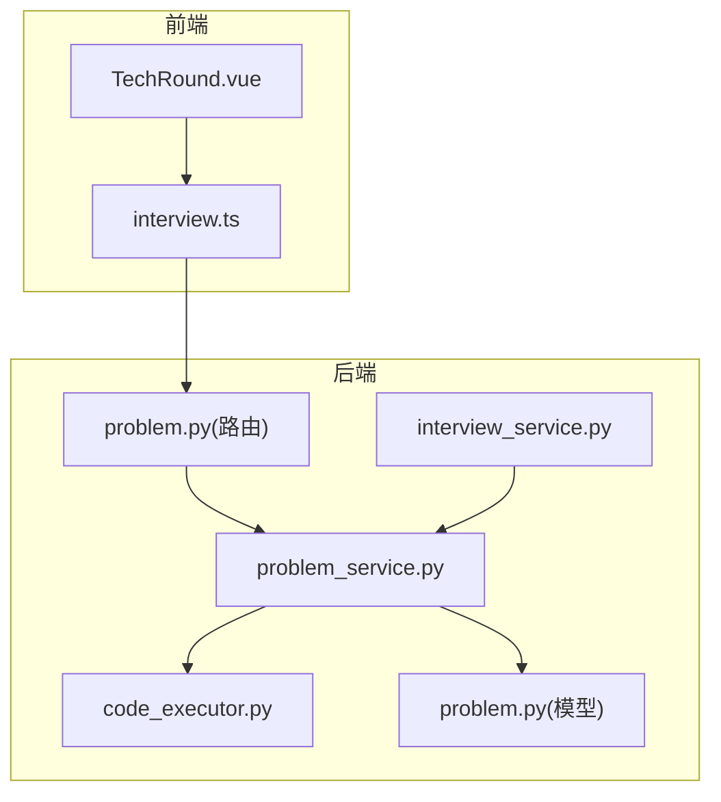
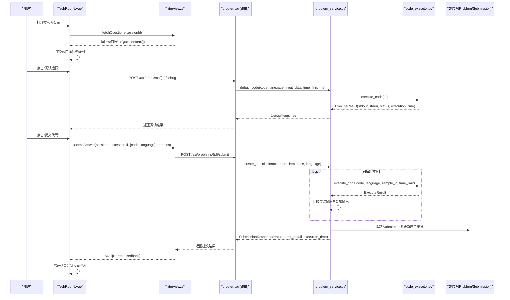
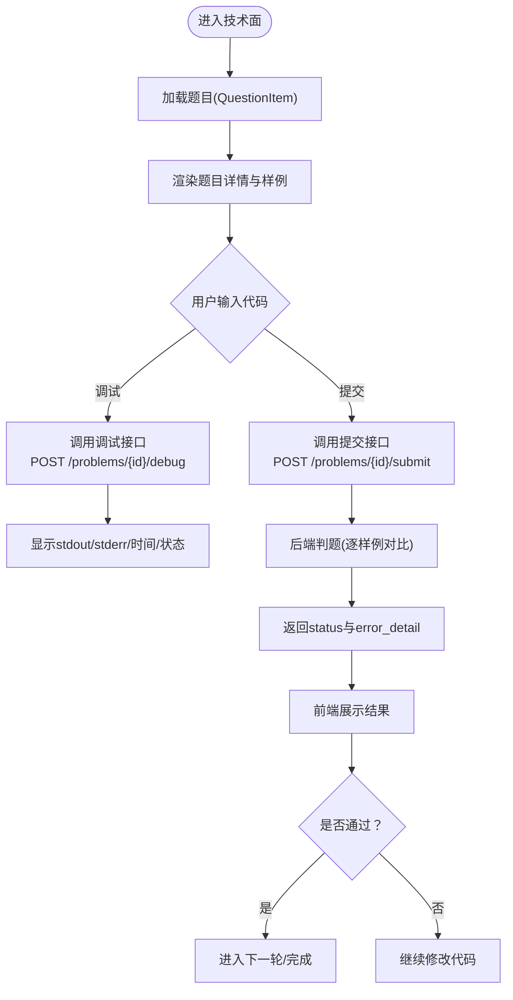
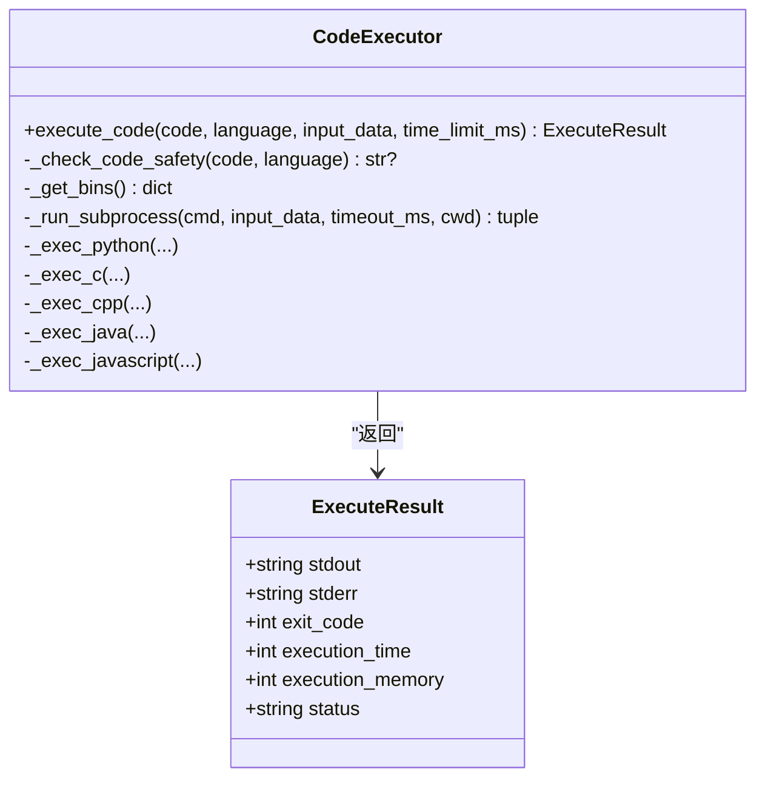
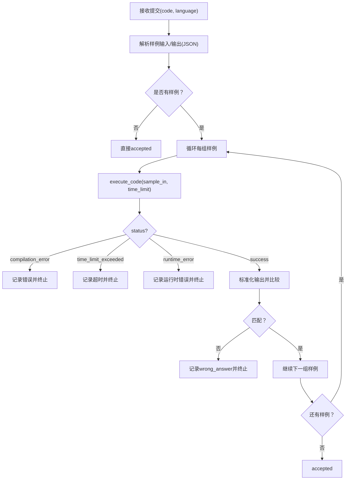
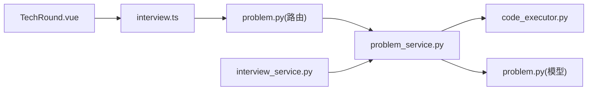

# 技术能力面试环节

<cite>
**本文引用的文件列表**
- [TechRound.vue](file://frontEnd/src/components/interview/TechRound.vue)
- [interview.ts](file://frontEnd/src/stores/interview.ts)
- [problem.py（模型）](file://backEnd/app/models/problem.py)
- [problem.py（路由）](file://backEnd/app/routers/problem.py)
- [problem_service.py](file://backEnd/app/services/problem_service.py)
- [code_executor.py](file://backEnd/app/services/code_executor.py)
- [interview_service.py](file://backEnd/app/services/interview_service.py)
</cite>

## 目录
1. [简介](#简介)
2. [项目结构](#项目结构)
3. [核心组件](#核心组件)
4. [架构总览](#架构总览)
5. [详细组件分析](#详细组件分析)
6. [依赖关系分析](#依赖关系分析)
7. [性能与安全考量](#性能与安全考量)
8. [调试与排错指南](#调试与排错指南)
9. [结论](#结论)
10. [附录：数据结构与接口约定](#附录数据结构与接口约定)

## 简介
本文件面向HR XF“技术能力面试”环节的技术文档，聚焦于TechRound组件的实现与后端判题、执行沙箱的对接。内容覆盖：
- 编程题展示界面与交互流程
- 代码编辑器集成方案（当前为textarea，可扩展至专业编辑器）
- 多语言代码执行支持（Python3/C/C++/Java/JavaScript）
- 题目特殊数据结构设计（描述、输入输出格式、样例、限制等）
- 代码提交、执行环境隔离、结果返回处理等安全机制
- 不同编程语言配置（编译器选择、环境变量、资源限制）
- 调试与排错工具使用指导（执行日志、时间/状态反馈）
- 用户体验优化建议（格式化、快捷键、响应式布局）

## 项目结构
围绕技术面相关的前后端关键文件如下：
- 前端：
  - TechRound.vue：技术面主界面，包含题目展示、代码编辑、调试运行、提交与结果展示
  - interview.ts：面试会话与答题API封装，含submitAnswer方法用于技术面提交
- 后端：
  - problem.py（模型）：题目与提交记录的数据模型
  - problem.py（路由）：OJ类接口（获取题目、提交、调试）
  - problem_service.py：题目查询、判题逻辑、调试执行封装
  - code_executor.py：代码执行器（子进程执行、安全策略、多语言编译/运行）
  - interview_service.py：面试服务，技术轮次从OJ题库抽取题目并复用判题

图表来源
- [TechRound.vue:1-427](file://frontEnd/src/components/interview/TechRound.vue#L1-L427)
- [interview.ts:1-313](file://frontEnd/src/stores/interview.ts#L1-L313)
- [problem.py（路由）:1-175](file://backEnd/app/routers/problem.py#L1-L175)
- [problem_service.py:1-914](file://backEnd/app/services/problem_service.py#L1-L914)
- [code_executor.py:1-444](file://backEnd/app/services/code_executor.py#L1-L444)
- [problem.py（模型）:1-88](file://backEnd/app/models/problem.py#L1-L88)
- [interview_service.py:536-714](file://backEnd/app/services/interview_service.py#L536-L714)

章节来源
- [TechRound.vue:1-427](file://frontEnd/src/components/interview/TechRound.vue#L1-L427)
- [interview.ts:1-313](file://frontEnd/src/stores/interview.ts#L1-L313)
- [problem.py（路由）:1-175](file://backEnd/app/routers/problem.py#L1-L175)
- [problem_service.py:1-914](file://backEnd/app/services/problem_service.py#L1-L914)
- [code_executor.py:1-444](file://backEnd/app/services/code_executor.py#L1-L444)
- [problem.py（模型）:1-88](file://backEnd/app/models/problem.py#L1-L88)
- [interview_service.py:536-714](file://backEnd/app/services/interview_service.py#L536-L714)

## 核心组件
- TechRound.vue
  - 左侧展示题目信息（描述、输入/输出格式、数据范围、样例、提示、判题限制）
  - 右侧提供代码编辑区（textarea）、语言选择、提交按钮、调试运行区域
  - 计时器倒计时，超时自动提交
  - 调用store.submitAnswer进行提交，显示判题结果
  - 通过OJ调试接口进行本地样例调试
- interview.ts
  - 封装了面试会话、题目获取、答案提交等API调用
  - submitAnswer将sessionId、questionId、answer（含code/language）和durationSeconds发送到后端
- problem_service.py
  - 实现create_submission：解析样例输入输出，逐组执行代码并比较输出
  - 实现debug_code：执行并返回stdout/stderr/execution_time/status
- code_executor.py
  - 基于subprocess执行用户代码，支持多语言
  - 安全策略：关键词黑名单拦截危险操作
  - 临时目录隔离，线程池异步包装，超时控制
- interview_service.py
  - 技术轮次从OJ题库随机抽取一道题，构造QuestionItem
  - 技术面评分复用OJ判题结果

章节来源
- [TechRound.vue:1-427](file://frontEnd/src/components/interview/TechRound.vue#L1-L427)
- [interview.ts:185-199](file://frontEnd/src/stores/interview.ts#L185-L199)
- [problem_service.py:95-202](file://backEnd/app/services/problem_service.py#L95-L202)
- [code_executor.py:270-444](file://backEnd/app/services/code_executor.py#L270-L444)
- [interview_service.py:559-714](file://backEnd/app/services/interview_service.py#L559-L714)

## 架构总览
技术面整体流程：
- 前端TechRound加载一轮题目（来自interview_service），渲染题目详情与示例
- 用户在编辑器编写代码，可先点击“调试运行”调用OJ调试接口，查看输出与状态
- 点击“提交代码”，前端调用store.submitAnswer，后端进入判题流程
- 判题流程：读取题目样例输入/输出，逐组执行代码，比较输出，生成提交记录与结果
- 前端根据结果展示是否通过，并在完成后进入下一轮或结束

图表来源
- [TechRound.vue:333-408](file://frontEnd/src/components/interview/TechRound.vue#L333-L408)
- [interview.ts:185-199](file://frontEnd/src/stores/interview.ts#L185-L199)
- [problem.py（路由）:121-175](file://backEnd/app/routers/problem.py#L121-L175)
- [problem_service.py:95-202](file://backEnd/app/services/problem_service.py#L95-L202)
- [code_executor.py:270-444](file://backEnd/app/services/code_executor.py#L270-L444)

## 详细组件分析

### TechRound.vue 组件分析
- 界面布局
  - 左侧：题目描述、输入/输出格式、数据范围、样例数据、样例解释、判题限制（时间/内存）
  - 右侧：代码编辑器（textarea）、语言下拉框、提交与清空按钮、调试运行区域、提交结果展示
- 交互逻辑
  - 计时器：按题目time_limit倒计时，超时自动提交
  - 调试运行：取第一组样例输入，调用OJ调试接口，显示stdout/stderr/execution_time/status
  - 提交代码：调用store.submitAnswer，传入sessionId、questionId、{code, language}、durationSeconds
  - 结果展示：根据feedback判断Accepted/Wrong Answer/Compilation Error/Runtime Error/Time Limit Exceeded
- 用户体验
  - 复制样例：一键复制样例输入+输出
  - 语言模板：根据所选语言提供默认代码占位符
  - 响应式网格：左右分栏，适配移动端

图表来源
- [TechRound.vue:1-427](file://frontEnd/src/components/interview/TechRound.vue#L1-L427)

章节来源
- [TechRound.vue:1-427](file://frontEnd/src/components/interview/TechRound.vue#L1-L427)

### 代码执行器（code_executor.py）分析
- 安全策略
  - 关键词黑名单：跨语言通用规则 + 各语言特定规则（如Python的os/subprocess/eval/exec，C/C++的system/popen，Java的Runtime.exec，JS的require('fs')等）
  - 匹配到危险片段即拒绝执行，返回错误信息
- 执行流程
  - 创建临时目录，写入用户代码文件
  - 根据语言选择编译器/解释器路径（优先.env配置，否则PATH检测）
  - 编译（C/C++/Java）后运行，或直接运行（Python/Node.js）
  - 使用线程池异步包装subprocess.run，设置超时，捕获stdout/stderr/退出码/耗时
  - 清理临时目录
- 多语言支持
  - Python3：直接执行main.py
  - C/C++：gcc/g++编译为exe后运行
  - Java：javac编译Main.java，java -cp运行
  - JavaScript：node执行main.js
- 资源限制
  - 时间限制：通过subprocess.timeout控制
  - 内存限制：当前未做进程级内存限制，可在部署层（容器/系统cgroup）补充

图表来源
- [code_executor.py:270-444](file://backEnd/app/services/code_executor.py#L270-L444)

章节来源
- [code_executor.py:1-444](file://backEnd/app/services/code_executor.py#L1-L444)

### 题目数据结构与判题逻辑（problem_service.py）
- 题目字段（Problem模型）
  - 描述性字段：title、description、input_format、output_format、constraints、hint
  - 样例字段：sample_input、sample_output（JSON字符串数组）
  - 限制字段：time_limit（ms）、memory_limit（MB）
  - 统计字段：total_submissions、accepted_submissions
- 判题流程（create_submission）
  - 解析sample_input/sample_output为数组
  - 对每组样例调用execute_code，得到ExecuteResult
  - 若compilation_error/time_limit_exceeded/runtime_error则终止并记录
  - 否则标准化输出（统一换行、去除空白、逐行比较）
  - 全部通过则accepted，否则wrong_answer
  - 写入Submission记录，更新题目统计
- 调试接口（debug_code）
  - 直接执行并返回stdout/stderr/exit_code/execution_time/status

图表来源
- [problem_service.py:95-202](file://backEnd/app/services/problem_service.py#L95-L202)

章节来源
- [problem.py（模型）:17-54](file://backEnd/app/models/problem.py#L17-L54)
- [problem_service.py:95-202](file://backEnd/app/services/problem_service.py#L95-L202)

### 面试服务与技术轮次（interview_service.py）
- 技术轮次题目抽取
  - 从OJ题库随机抽取一道Problem，构造QuestionItem，包含完整题目信息与time_limit=900秒
- 技术面评分
  - 复用OJ判题：调用create_submission，根据status计算分数与反馈
  - 保存InterviewAnswer记录，便于报告生成

章节来源
- [interview_service.py:559-714](file://backEnd/app/services/interview_service.py#L559-L714)

## 依赖关系分析
- 前端依赖
  - TechRound.vue依赖interview.ts的submitAnswer与fetchQuestions
- 后端依赖
  - problem路由依赖problem_service
  - problem_service依赖code_executor与数据库模型
  - interview_service在技术轮次中复用problem_service的判题能力

图表来源
- [TechRound.vue:1-427](file://frontEnd/src/components/interview/TechRound.vue#L1-L427)
- [interview.ts:1-313](file://frontEnd/src/stores/interview.ts#L1-L313)
- [problem.py（路由）:1-175](file://backEnd/app/routers/problem.py#L1-L175)
- [problem_service.py:1-914](file://backEnd/app/services/problem_service.py#L1-L914)
- [code_executor.py:1-444](file://backEnd/app/services/code_executor.py#L1-L444)
- [problem.py（模型）:1-88](file://backEnd/app/models/problem.py#L1-L88)
- [interview_service.py:536-714](file://backEnd/app/services/interview_service.py#L536-L714)

章节来源
- [TechRound.vue:1-427](file://frontEnd/src/components/interview/TechRound.vue#L1-L427)
- [interview.ts:1-313](file://frontEnd/src/stores/interview.ts#L1-L313)
- [problem.py（路由）:1-175](file://backEnd/app/routers/problem.py#L1-L175)
- [problem_service.py:1-914](file://backEnd/app/services/problem_service.py#L1-L914)
- [code_executor.py:1-444](file://backEnd/app/services/code_executor.py#L1-L444)
- [problem.py（模型）:1-88](file://backEnd/app/models/problem.py#L1-L88)
- [interview_service.py:536-714](file://backEnd/app/services/interview_service.py#L536-L714)

## 性能与安全考量
- 性能
  - 执行器使用线程池并发执行子进程，避免阻塞事件循环
  - 超时控制防止长时间占用资源
  - 输出标准化比较减少误判
- 安全
  - 关键词黑名单拦截危险操作（系统命令、文件系统破坏、网络访问、动态执行等）
  - 临时目录隔离，执行后清理
  - 建议在部署层启用容器化与cgroup限制CPU/内存/IO
- 扩展点
  - 可增加更严格的沙箱（如gVisor/firejail）
  - 增加内存监控与回收策略
  - 增加白名单库导入（Python）与受限标准库

[本节为通用指导，不直接分析具体文件]

## 调试与排错指南
- 前端调试
  - 使用“调试运行”按钮，查看stdout/stderr/execution_time/status
  - 检查浏览器控制台的网络请求与响应体
- 后端调试
  - 查看problem路由的调试接口返回
  - 查看problem_service的判题日志与错误详情
  - 查看code_executor的执行日志（关键词匹配、编译器路径、子进程异常）
- 常见问题
  - 编译器未安装或PATH不可用：检查.env配置或系统PATH
  - 编码问题（Java注释中文）：确保UTF-8编码参数
  - 超时：调整time_limit或优化算法复杂度
  - 输出格式不一致：注意换行符与空白字符处理

章节来源
- [TechRound.vue:333-379](file://frontEnd/src/components/interview/TechRound.vue#L333-L379)
- [problem.py（路由）:154-175](file://backEnd/app/routers/problem.py#L154-L175)
- [problem_service.py:182-202](file://backEnd/app/services/problem_service.py#L182-L202)
- [code_executor.py:173-197](file://backEnd/app/services/code_executor.py#L173-L197)

## 结论
TechRound组件实现了技术面编程题的完整闭环：题目展示、代码编辑、调试运行、提交判题与结果反馈。后端通过problem_service与code_executor构建了安全的代码执行沙箱，支持多语言并具备完善的判题与调试能力。面试服务将OJ题库与面试流程融合，形成统一的技术面体验。后续可在编辑器功能、沙箱强化与性能监控方面持续优化。

[本节为总结，不直接分析具体文件]

## 附录：数据结构与接口约定

### 题目数据结构（Problem模型关键字段）
- 标识与元信息：id、display_id、title、difficulty、tags、created_at、updated_at
- 题目内容：description、input_format、output_format、constraints、hint
- 样例数据：sample_input（JSON字符串数组）、sample_output（JSON字符串数组）
- 限制与统计：time_limit（ms）、memory_limit（MB）、total_submissions、accepted_submissions

章节来源
- [problem.py（模型）:17-54](file://backEnd/app/models/problem.py#L17-L54)

### 提交与调试接口（problem路由）
- GET /api/problems/{problem_id}：获取题目详情
- POST /api/problems/{problem_id}/submit：提交代码（认证必需）
- POST /api/problems/{problem_id}/debug：调试代码（可选认证）

章节来源
- [problem.py（路由）:102-175](file://backEnd/app/routers/problem.py#L102-L175)

### 前端提交流程（interview.ts）
- submitAnswer(sessionId, questionId, answer, durationSeconds)
  - answer为对象：{code, language}
  - 返回AnswerResponse：{correct, score, feedback, correct_answer}

章节来源
- [interview.ts:185-199](file://frontEnd/src/stores/interview.ts#L185-L199)

### 多语言支持与配置（code_executor.py）
- 支持语言：python3、c、cpp、java、javascript
- 编译器/解释器路径：优先.env配置，其次PATH检测
- 安全策略：关键词黑名单（跨语言与各语言特定规则）
- 执行隔离：临时目录、线程池、超时控制

章节来源
- [code_executor.py:199-207](file://backEnd/app/services/code_executor.py#L199-L207)
- [code_executor.py:173-197](file://backEnd/app/services/code_executor.py#L173-L197)
- [code_executor.py:270-444](file://backEnd/app/services/code_executor.py#L270-L444)