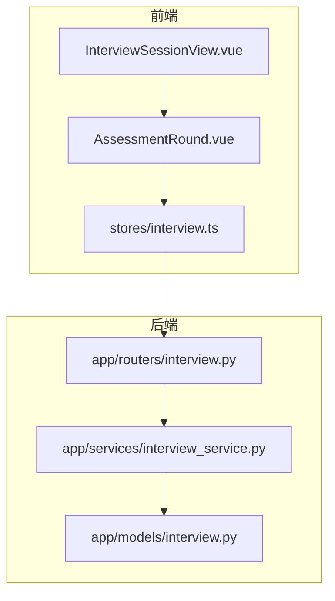
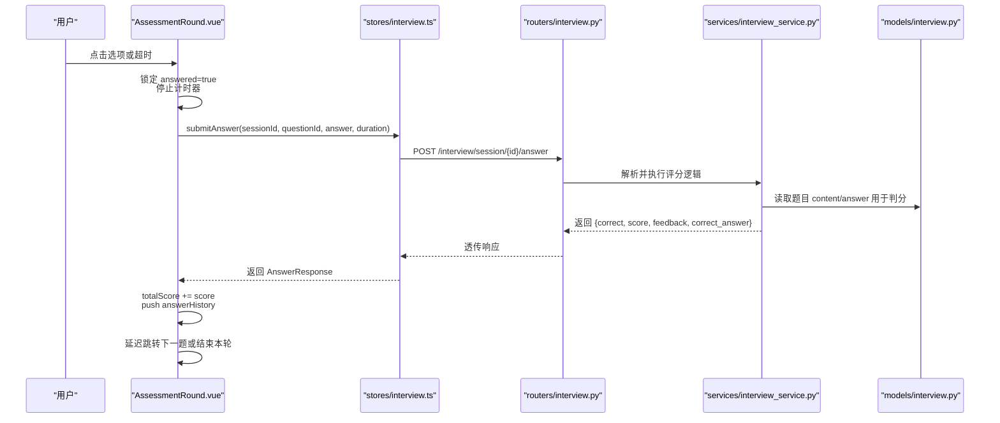
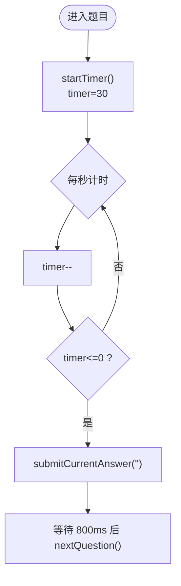
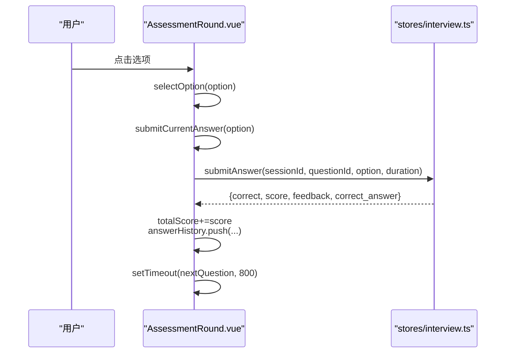
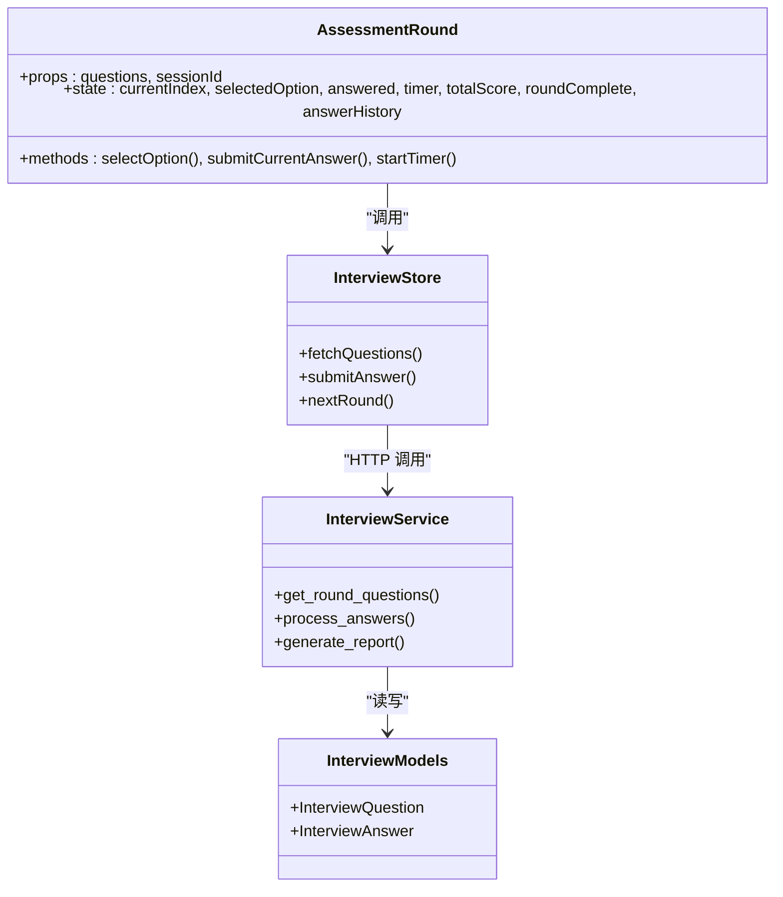

# 综合素质测评环节

<cite>
**本文引用的文件**
- [AssessmentRound.vue](file://frontEnd/src/components/interview/AssessmentRound.vue)
- [interview.ts](file://frontEnd/src/stores/interview.ts)
- [interview_service.py](file://backEnd/app/services/interview_service.py)
- [interview.py（模型）](file://backEnd/app/models/interview.py)
- [interview.py（路由）](file://backEnd/app/routers/interview.py)
- [InterviewSessionView.vue](file://frontEnd/src/views/InterviewSessionView.vue)
</cite>

## 目录
1. [简介](#简介)
2. [项目结构](#项目结构)
3. [核心组件与数据流](#核心组件与数据流)
4. [架构总览](#架构总览)
5. [详细组件分析](#详细组件分析)
6. [依赖关系分析](#依赖关系分析)
7. [性能与体验优化](#性能与体验优化)
8. [故障排查指南](#故障排查指南)
9. [结论](#结论)

## 简介
本技术文档聚焦于“HR XF”面试系统中的“综合素质测评”环节，围绕 AssessmentRound 组件的实现进行系统化说明。内容涵盖：
- 题型设计与数据结构 QuestionItem 的定义与使用
- 30 秒倒计时机制、选项选择与答案提交流程
- 评分算法与反馈信息生成逻辑
- 答题历史 answerHistory 的数据结构与展示方式
- 组件生命周期管理（定时器启停、卸载清理、响应式更新）
- 用户体验优化（字体自适应、动画过渡、无障碍支持）
- 错误处理与异常场景处理

## 项目结构
该环节涉及前端组件、状态存储与后端服务三部分：
- 前端组件层：AssessmentRound.vue 负责选择题交互、计时、结果汇总与展示
- 状态与网络层：stores/interview.ts 提供题目获取、答案提交等 API 封装
- 后端服务层：services/interview_service.py 负责按轮次抽取题目、判分与报告生成；models/interview.py 定义题库与答案表结构；routers/interview.py 暴露接口并控制报告生成条件

图表来源
- [AssessmentRound.vue:1-227](file://frontEnd/src/components/interview/AssessmentRound.vue#L1-L227)
- [interview.ts:177-199](file://frontEnd/src/stores/interview.ts#L177-L199)
- [interview_service.py:535-557](file://backEnd/app/services/interview_service.py#L535-L557)
- [interview.py（模型）:59-82](file://backEnd/app/models/interview.py#L59-L82)
- [interview.py（路由）:269-301](file://backEnd/app/routers/interview.py#L269-L301)

章节来源
- [AssessmentRound.vue:1-227](file://frontEnd/src/components/interview/AssessmentRound.vue#L1-L227)
- [interview.ts:177-199](file://frontEnd/src/stores/interview.ts#L177-L199)
- [interview_service.py:535-557](file://backEnd/app/services/interview_service.py#L535-L557)
- [interview.py（模型）:59-82](file://backEnd/app/models/interview.py#L59-L82)
- [interview.py（路由）:269-301](file://backEnd/app/routers/interview.py#L269-L301)

## 核心组件与数据流
- 组件职责
  - AssessmentRound.vue：渲染当前题目、倒计时、选项交互、提交答案、记录历史、完成汇总
  - stores/interview.ts：封装 /interview/session/{id}/question 与 /answer 接口，返回统一类型 AnswerResponse
  - interview_service.py：按 round_key="assessment" 随机抽取 10 题，设置 time_limit=30；提交后计算得分与反馈
  - models/interview.py：定义 InterviewQuestion.content JSON 字段包含 text 与 options 等属性
  - routers/interview.py：在报告生成前校验答题数量，不足则拒绝

- 关键数据流
  - 父视图通过 props.questions 传入 QuestionItem[]
  - 组件内部维护 currentIndex、selectedOption、answered、timer、totalScore、roundComplete、answerHistory
  - 用户点击选项或超时触发 submitCurrentAnswer，调用 store.submitAnswer 提交
  - 后端返回 {correct, score, feedback, correct_answer}，组件累加总分并追加历史记录
  - 全部答完后显示总结页，包含每题正确性、用户答案、标准答案与反馈

章节来源
- [AssessmentRound.vue:101-134](file://frontEnd/src/components/interview/AssessmentRound.vue#L101-L134)
- [interview.ts:177-199](file://frontEnd/src/stores/interview.ts#L177-L199)
- [interview_service.py:535-557](file://backEnd/app/services/interview_service.py#L535-L557)
- [interview.py（模型）:76-80](file://backEnd/app/models/interview.py#L76-L80)
- [interview.py（路由）:293-301](file://backEnd/app/routers/interview.py#L293-L301)

## 架构总览
本节以时序图展示一次完整的答案提交流程，包括前端交互、状态存储、后端服务与数据库模型。

图表来源
- [AssessmentRound.vue:153-196](file://frontEnd/src/components/interview/AssessmentRound.vue#L153-L196)
- [interview.ts:185-199](file://frontEnd/src/stores/interview.ts#L185-L199)
- [interview_service.py:535-557](file://backEnd/app/services/interview_service.py#L535-L557)
- [interview.py（模型）:76-80](file://backEnd/app/models/interview.py#L76-L80)

## 详细组件分析

### 题型设计与 QuestionItem 数据结构
- QuestionItem 定义
  - id：题目唯一标识
  - question_type：题型枚举（choice/judgment/code/open_ended），测评环节为 choice
  - content：JSON 对象，测评题包含 text 与 options 数组
  - time_limit：秒数，测评题固定为 30
- 使用方式
  - AssessmentRound.vue 通过 props.questions 接收 QuestionItem[]
  - 模板中读取 (currentQuestion.content as any).text 与 .options 渲染题目与选项
  - 选项字母由 optionLetter(idx) 生成（A/B/C/D...）

章节来源
- [interview.ts:37-42](file://frontEnd/src/stores/interview.ts#L37-L42)
- [interview_service.py:535-557](file://backEnd/app/services/interview_service.py#L535-L557)
- [interview.py（模型）:76-80](file://backEnd/app/models/interview.py#L76-L80)
- [AssessmentRound.vue:34-55](file://frontEnd/src/components/interview/AssessmentRound.vue#L34-L55)

### 30 秒倒计时机制
- 启动与重置
  - startTimer() 初始化 timer=30，清除旧定时器并创建 setInterval
  - 每秒递减，当 timer<=0 且未作答时自动提交空答案
- 生命周期管理
  - 每次切换题目或监听 questions 变化时重新初始化计时器
  - onUnmounted 确保组件卸载时清理定时器，避免内存泄漏

图表来源
- [AssessmentRound.vue:140-151](file://frontEnd/src/components/interview/AssessmentRound.vue#L140-L151)
- [AssessmentRound.vue:210-221](file://frontEnd/src/components/interview/AssessmentRound.vue#L210-L221)
- [AssessmentRound.vue:223-225](file://frontEnd/src/components/interview/AssessmentRound.vue#L223-L225)

章节来源
- [AssessmentRound.vue:140-151](file://frontEnd/src/components/interview/AssessmentRound.vue#L140-L151)
- [AssessmentRound.vue:210-221](file://frontEnd/src/components/interview/AssessmentRound.vue#L210-L221)
- [AssessmentRound.vue:223-225](file://frontEnd/src/components/interview/AssessmentRound.vue#L223-L225)

### 选项选择与答案提交逻辑
- 选择选项
  - selectOption(option) 将 selectedOption 设为所选字母，并立即提交
- 提交答案
  - submitCurrentAnswer(answer) 标记 answered=true，停止计时器
  - 计算答题耗时 durationSeconds，调用 store.submitAnswer 提交
  - 成功后累加 totalScore，并将本次答题记录推入 answerHistory
  - 失败时在 catch 分支记录错误反馈，score=0
  - 延迟 800ms 后进入下一题或结束本轮

图表来源
- [AssessmentRound.vue:153-196](file://frontEnd/src/components/interview/AssessmentRound.vue#L153-L196)
- [interview.ts:185-199](file://frontEnd/src/stores/interview.ts#L185-L199)

章节来源
- [AssessmentRound.vue:153-196](file://frontEnd/src/components/interview/AssessmentRound.vue#L153-L196)
- [interview.ts:185-199](file://frontEnd/src/stores/interview.ts#L185-L199)

### 评分算法与反馈信息
- 轮次最大分与下限保护
  - assessment 轮次满分 100（10 题 × 10 分）
  - 单轮得分存在下限保护：至少达到满分的 75%
- 维度映射
  - assessment 轮次分数映射到雷达图的“逻辑”维度
- 等级划分
  - 基于总得分百分比划分等级（A/B/C/D）
- 反馈信息
  - 后端返回的 feedback 字段直接用于展示个性化反馈
  - 若提交失败，前端在 catch 分支构造错误反馈

章节来源
- [interview_service.py:912-977](file://backEnd/app/services/interview_service.py#L912-L977)
- [interview_service.py:1022-1031](file://backEnd/app/services/interview_service.py#L1022-L1031)
- [interview_service.py:984-992](file://backEnd/app/services/interview_service.py#L984-L992)
- [AssessmentRound.vue:182-191](file://frontEnd/src/components/interview/AssessmentRound.vue#L182-L191)

### 答题历史 answerHistory 的数据结构与展示
- 数据结构
  - questionText：题目文本
  - userAnswer：用户答案（未作答时为“未作答”，提交失败时为“提交失败”）
  - correctAnswer：标准答案（来自后端返回）
  - correct：是否正确的布尔值
  - feedback：反馈信息
  - score：本题得分
- 展示方式
  - 每道题一个卡片，根据 correct 显示绿色或红色背景
  - 显示题号、正确/错误标签、题目文本、用户答案与正确答案对比、反馈信息
  - 列表区域可滚动，高度限制为视口一半

章节来源
- [AssessmentRound.vue:124-132](file://frontEnd/src/components/interview/AssessmentRound.vue#L124-L132)
- [AssessmentRound.vue:67-85](file://frontEnd/src/components/interview/AssessmentRound.vue#L67-L85)

### 组件生命周期管理与响应式更新
- 监听 questions 变化
  - watch(() => props.questions, ...) 在题目加载后立即重置索引、选择、已答状态、总分、完成标志、历史记录，并重启计时器
- 组件卸载清理
  - onUnmounted 中清理定时器，防止后台继续运行
- 响应式数据
  - 使用 Vue ref/computed 驱动 UI 更新，如 qFontSize/optFontSize 基于注入的 fontSize 动态计算

章节来源
- [AssessmentRound.vue:210-221](file://frontEnd/src/components/interview/AssessmentRound.vue#L210-L221)
- [AssessmentRound.vue:223-225](file://frontEnd/src/components/interview/AssessmentRound.vue#L223-L225)
- [AssessmentRound.vue:110-112](file://frontEnd/src/components/interview/AssessmentRound.vue#L110-L112)

### 用户体验优化细节
- 字体大小自适应
  - 通过 inject('fontSize') 注入全局字号，题目与选项分别计算 qFontSize 与 optFontSize
  - 父视图 InterviewSessionView.vue 提供 A+/A- 按钮调节字号，仅在选择类轮次显示
- 动画过渡效果
  - 进度条宽度 transition-all duration-300
  - 选项 hover 阴影与位移 transition-all duration-200
  - 完成页按钮 hover 阴影与位移
- 无障碍访问支持
  - 选项使用 button 元素，具备原生键盘可达性与焦点管理
  - 颜色对比度与文字可读性良好，但建议补充 aria-label 与 role 以提升屏幕阅读器体验

章节来源
- [AssessmentRound.vue:110-112](file://frontEnd/src/components/interview/AssessmentRound.vue#L110-L112)
- [InterviewSessionView.vue:11-16](file://frontEnd/src/views/InterviewSessionView.vue#L11-L16)
- [AssessmentRound.vue:15-20](file://frontEnd/src/components/interview/AssessmentRound.vue#L15-L20)
- [AssessmentRound.vue:43-54](file://frontEnd/src/components/interview/AssessmentRound.vue#L43-L54)
- [AssessmentRound.vue:87-92](file://frontEnd/src/components/interview/AssessmentRound.vue#L87-L92)

### 错误处理与异常情况
- 网络请求失败
  - stores/interview.ts 的 apiRequest 对非 2xx 响应抛出错误，消息取自 body.detail 或状态码
- 提交异常捕获
  - AssessmentRound.vue 在 try/catch 中捕获异常，记录错误反馈并置零分，保证流程不中断
- 报告生成前置校验
  - routers/interview.py 要求至少 3 题才能生成报告，否则返回 400 错误

章节来源
- [interview.ts:113-124](file://frontEnd/src/stores/interview.ts#L113-L124)
- [AssessmentRound.vue:182-191](file://frontEnd/src/components/interview/AssessmentRound.vue#L182-L191)
- [interview.py（路由）:293-301](file://backEnd/app/routers/interview.py#L293-L301)

## 依赖关系分析
- 组件依赖
  - AssessmentRound.vue 依赖 stores/interview.ts 的 useInterviewStore 与 QuestionItem 类型
- 服务依赖
  - services/interview_service.py 依赖 models/interview.py 的 InterviewQuestion 与 InterviewAnswer 模型
- 路由依赖
  - routers/interview.py 调用 services 层并返回统一响应结构

图表来源
- [AssessmentRound.vue:97-134](file://frontEnd/src/components/interview/AssessmentRound.vue#L97-L134)
- [interview.ts:177-199](file://frontEnd/src/stores/interview.ts#L177-L199)
- [interview_service.py:535-557](file://backEnd/app/services/interview_service.py#L535-L557)
- [interview.py（模型）:59-82](file://backEnd/app/models/interview.py#L59-L82)

章节来源
- [AssessmentRound.vue:97-134](file://frontEnd/src/components/interview/AssessmentRound.vue#L97-L134)
- [interview.ts:177-199](file://frontEnd/src/stores/interview.ts#L177-L199)
- [interview_service.py:535-557](file://backEnd/app/services/interview_service.py#L535-L557)
- [interview.py（模型）:59-82](file://backEnd/app/models/interview.py#L59-L82)

## 性能与体验优化
- 计时器优化
  - 使用 clearInterval 在每次 startTimer 与提交时清理旧定时器，避免重复计时
- 渲染优化
  - 使用 computed 计算字体大小，减少不必要的重算
  - 选项按钮禁用态与选中态样式切换，降低 DOM 操作复杂度
- 网络优化
  - 单次提交只传输必要字段（question_id、answer、duration_seconds），减少负载
- 可扩展性
  - QuestionItem.content 采用 JSON 结构，便于扩展更多题型字段

[本节为通用指导，无需特定文件引用]

## 故障排查指南
- 问题：计时器不停止或重复触发
  - 检查 startTimer 是否在每次切换题目时清理旧定时器
  - 确认 onUnmounted 中是否清理了定时器
- 问题：提交失败导致流程中断
  - 查看 apiRequest 的错误处理逻辑，确认后端返回 detail 字段
  - 检查 AssessmentRound.vue 的 catch 分支是否正确记录错误反馈
- 问题：无法生成报告
  - 确认答题数量是否达到至少 3 题
  - 检查路由层的 400 错误提示

章节来源
- [AssessmentRound.vue:140-151](file://frontEnd/src/components/interview/AssessmentRound.vue#L140-L151)
- [AssessmentRound.vue:223-225](file://frontEnd/src/components/interview/AssessmentRound.vue#L223-L225)
- [interview.ts:113-124](file://frontEnd/src/stores/interview.ts#L113-L124)
- [interview.py（路由）:293-301](file://backEnd/app/routers/interview.py#L293-L301)

## 结论
AssessmentRound 组件实现了完整的综合素质测评流程：从题目渲染、倒计时、选项选择、答案提交到结果汇总与展示。配合 stores/interview.ts 与后端服务，形成前后端协同的闭环。系统具备良好的生命周期管理与错误处理能力，并通过字体自适应与动画过渡提升用户体验。建议在无障碍方面进一步补充 aria 属性，以增强屏幕阅读器支持。