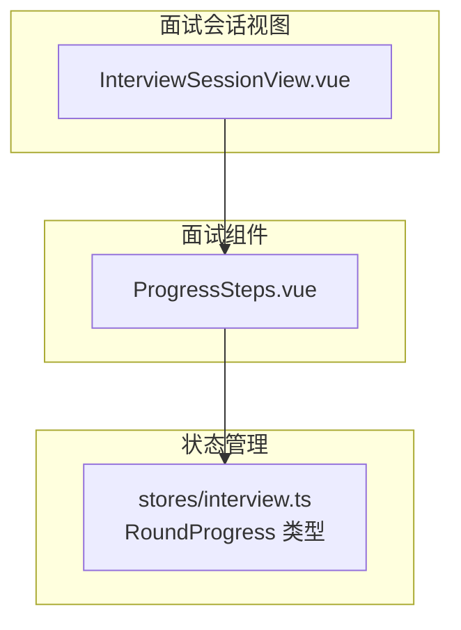
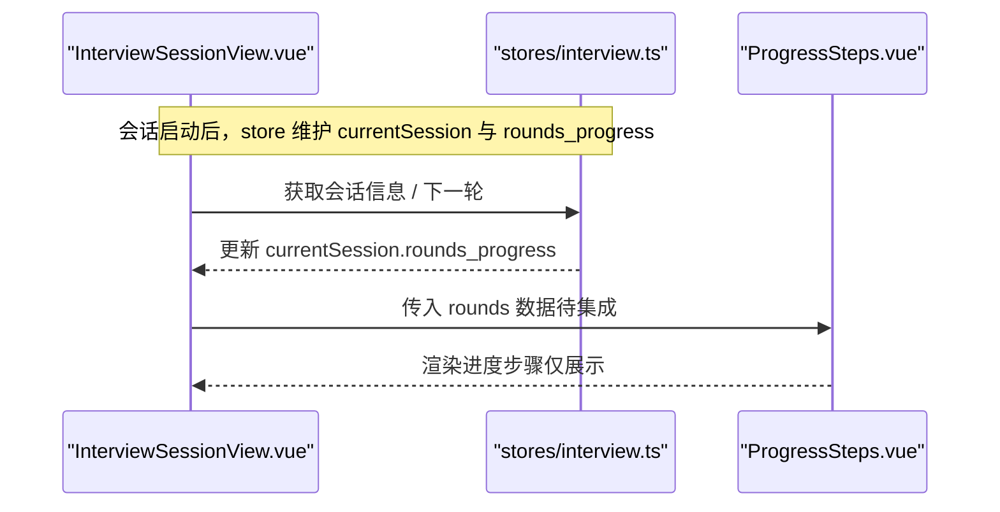
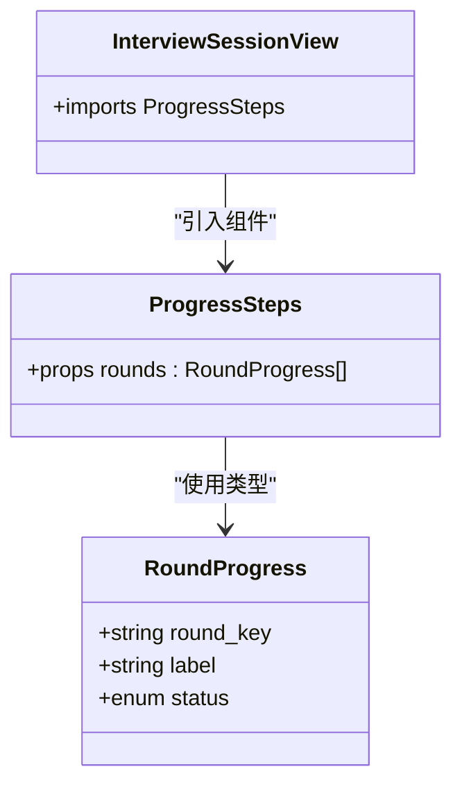

# 进度步骤组件

<cite>
**本文引用的文件**   
- [ProgressSteps.vue](file://frontEnd/src/components/interview/ProgressSteps.vue)
- [interview.ts](file://frontEnd/src/stores/interview.ts)
- [InterviewSessionView.vue](file://frontEnd/src/views/InterviewSessionView.vue)
</cite>

## 目录
1. [简介](#简介)
2. [项目结构](#项目结构)
3. [核心组件](#核心组件)
4. [架构总览](#架构总览)
5. [详细组件分析](#详细组件分析)
6. [依赖关系分析](#依赖关系分析)
7. [性能与可访问性](#性能与可访问性)
8. [故障排查指南](#故障排查指南)
9. [结论](#结论)
10. [附录：接口与扩展建议](#附录接口与扩展建议)

## 简介
本技术文档聚焦于 HR XF 前端中的“进度步骤”组件 ProgressSteps，用于在多轮面试流程中可视化展示当前进度、状态与完成度。该组件通过接收一轮或多轮面试的进度数据，渲染步骤指示器与连接线，并以颜色与动画区分不同状态（未开始、进行中、已完成）。同时提供响应式布局与可扩展的样式定制能力，便于在面试会话页面中统一复用。

## 项目结构
ProgressSteps 位于面试相关组件目录下，由面试会话视图引入并使用。其数据结构来源于 Pinia store 的类型定义，确保前后端数据契约一致。

图表来源
- [InterviewSessionView.vue:292-301](file://frontEnd/src/views/InterviewSessionView.vue#L292-L301)
- [ProgressSteps.vue:37-43](file://frontEnd/src/components/interview/ProgressSteps.vue#L37-L43)
- [interview.ts:17-22](file://frontEnd/src/stores/interview.ts#L17-L22)

章节来源
- [InterviewSessionView.vue:292-301](file://frontEnd/src/views/InterviewSessionView.vue#L292-L301)
- [ProgressSteps.vue:1-44](file://frontEnd/src/components/interview/ProgressSteps.vue#L1-L44)
- [interview.ts:17-22](file://frontEnd/src/stores/interview.ts#L17-L22)

## 核心组件
- 组件名称：ProgressSteps
- 职责：根据传入的 rounds 数组渲染多轮面试进度条，显示每轮的序号/标签、连接线与状态样式。
- 输入属性：
  - rounds: RoundProgress[]（来自 stores/interview.ts）
- 输出事件：无（当前为纯展示型组件）
- 插槽：无（当前为纯展示型组件）

章节来源
- [ProgressSteps.vue:37-43](file://frontEnd/src/components/interview/ProgressSteps.vue#L37-L43)
- [interview.ts:17-22](file://frontEnd/src/stores/interview.ts#L17-L22)

## 架构总览
ProgressSteps 作为子组件被 InterviewSessionView 引入，但当前会话视图中并未实际使用该组件进行渲染；其数据模型 RoundProgress 已在 store 中定义，具备良好复用基础。

图表来源
- [InterviewSessionView.vue:292-301](file://frontEnd/src/views/InterviewSessionView.vue#L292-L301)
- [interview.ts:17-22](file://frontEnd/src/stores/interview.ts#L17-L22)
- [ProgressSteps.vue:37-43](file://frontEnd/src/components/interview/ProgressSteps.vue#L37-L43)

## 详细组件分析

### 组件设计与实现
- 模板结构
  - 外层容器：带边框、阴影与内边距的卡片容器，保证视觉一致性。
  - 横向滚动区域：使用 flex 布局与 overflow-x-auto 支持小屏横向滚动。
  - 步骤项：每个 step 包含序号/图标与可选文本标签（在小屏隐藏文本，保留序号）。
  - 连接线：仅在非末尾步骤渲染，长度固定，颜色随前一步状态变化。
- 脚本逻辑
  - 仅声明 props：rounds: RoundProgress[]，类型为 store 中定义的联合类型。
  - 无内部状态与事件，属于受控展示组件。

章节来源
- [ProgressSteps.vue:1-35](file://frontEnd/src/components/interview/ProgressSteps.vue#L1-L35)
- [ProgressSteps.vue:37-43](file://frontEnd/src/components/interview/ProgressSteps.vue#L37-L43)

### Props 接口设计
- rounds: RoundProgress[]
  - round_key: string（唯一标识某轮）
  - label: string（步骤显示名）
  - status: 'pending' | 'active' | 'completed'（状态枚举）

说明：
- 当前组件对 pending 状态以默认样式呈现（白底灰字），active 高亮并带脉冲动画，completed 显示绿色背景与对勾。
- 若需要“跳过”状态，可在 RoundProgress.status 中扩展枚举值并在组件中增加对应样式分支。

章节来源
- [interview.ts:17-22](file://frontEnd/src/stores/interview.ts#L17-L22)
- [ProgressSteps.vue:10-23](file://frontEnd/src/components/interview/ProgressSteps.vue#L10-L23)

### 状态显示逻辑
- 未开始（pending）
  - 样式：白底、灰色文字、细边框。
  - 图标：显示序号（idx + 1）。
- 进行中（active）
  - 样式：主题色背景、白色文字、脉冲动画。
  - 图标：显示序号（idx + 1）。
- 已完成（completed）
  - 样式：绿色背景、白色文字。
  - 图标：显示对勾符号。
- 连接线
  - 当且仅当前一步为 completed 时，连接线为绿色；否则为浅灰色。

章节来源
- [ProgressSteps.vue:10-31](file://frontEnd/src/components/interview/ProgressSteps.vue#L10-L31)

### 样式与主题定制
- 颜色主题
  - active：使用主题粉色背景与白色文字。
  - completed：使用绿色背景与白色文字。
  - pending：白底灰字。
- 动画效果
  - active 状态启用脉冲动画，增强“进行中”感知。
- 响应式布局
  - 小屏隐藏步骤文本，仅显示序号；大屏显示完整 label。
  - 横向滚动容器适配长列表。
- 自定义建议
  - 可通过覆盖 Tailwind 类或注入 CSS 变量调整颜色、圆角、阴影等。
  - 如需更灵活的主题化，可考虑将颜色与动画从 props 传入或使用 CSS 变量。

章节来源
- [ProgressSteps.vue:2-33](file://frontEnd/src/components/interview/ProgressSteps.vue#L2-L33)

### 交互与事件机制
- 当前版本为纯展示组件，不处理点击跳转或状态变更通知。
- 未来可扩展：
  - 暴露 click 事件，传递 step 索引或 round_key，供父组件导航到对应轮次。
  - 暴露 onStatusChange 回调，监听外部状态变化后的副作用。

章节来源
- [ProgressSteps.vue:37-43](file://frontEnd/src/components/interview/ProgressSteps.vue#L37-L43)

### 可复用性与扩展点
- 插槽扩展
  - 当前未定义插槽。可考虑添加默认插槽以允许自定义步骤内容（如头像、评分徽章等）。
- 主题配置
  - 建议通过 props 传入主题色、是否启用动画、是否显示文本等开关。
- 国际化支持
  - 当前 label 直接渲染字符串。可结合 i18n 库在父层准备本地化后的 label 列表。

章节来源
- [ProgressSteps.vue:1-44](file://frontEnd/src/components/interview/ProgressSteps.vue#L1-L44)

### 无障碍访问支持
- 键盘导航
  - 当前步骤项为 div，不可聚焦。建议为每个步骤添加 tabindex="0" 与 role="listitem"，并为 active 步骤设置 aria-current="step"。
- 屏幕阅读器兼容
  - 为容器添加 role="list"，为每个步骤添加 aria-label 描述（例如“第 X 轮：技术面，进行中”）。
- 焦点管理
  - 当状态变化时，可将焦点移动到 active 步骤，提升可访问体验。

章节来源
- [ProgressSteps.vue:3-33](file://frontEnd/src/components/interview/ProgressSteps.vue#L3-L33)

## 依赖关系分析
- 组件依赖
  - ProgressSteps 依赖 stores/interview.ts 中的 RoundProgress 类型，确保传入数据结构正确。
- 视图集成
  - InterviewSessionView 引入了 ProgressSteps，但当前模板中未实际渲染该组件。建议在合适位置（如顶部状态栏下方）插入组件，并传入 store.currentSession?.rounds_progress。

图表来源
- [interview.ts:17-22](file://frontEnd/src/stores/interview.ts#L17-L22)
- [ProgressSteps.vue:37-43](file://frontEnd/src/components/interview/ProgressSteps.vue#L37-L43)
- [InterviewSessionView.vue:292-301](file://frontEnd/src/views/InterviewSessionView.vue#L292-L301)

章节来源
- [interview.ts:17-22](file://frontEnd/src/stores/interview.ts#L17-L22)
- [ProgressSteps.vue:37-43](file://frontEnd/src/components/interview/ProgressSteps.vue#L37-L43)
- [InterviewSessionView.vue:292-301](file://frontEnd/src/views/InterviewSessionView.vue#L292-L301)

## 性能与可访问性
- 性能
  - 组件为轻量级展示，无复杂计算与副作用，渲染开销极低。
  - 横向滚动容器避免换行，减少重排。
- 可访问性
  - 建议补充 ARIA 属性与键盘可达性，以提升屏幕阅读器与键盘用户的体验。
  - 为 active 步骤提供 aria-current 与焦点提示。

[本节为通用指导，无需具体文件引用]

## 故障排查指南
- 问题：组件未显示
  - 检查父组件是否正确引入并渲染 ProgressSteps。
  - 确认传入的 rounds 数组是否为空或未定义。
- 问题：状态不正确
  - 核对后端返回的 rounds_progress 中 status 字段是否符合 'pending' | 'active' | 'completed'。
  - 若需新增“跳过”状态，需在 RoundProgress 类型与组件样式分支同步扩展。
- 问题：小屏文本不可见
  - 这是预期行为，小屏仅显示序号；如需始终显示文本，可移除响应式隐藏类。

章节来源
- [ProgressSteps.vue:10-23](file://frontEnd/src/components/interview/ProgressSteps.vue#L10-L23)
- [interview.ts:17-22](file://frontEnd/src/stores/interview.ts#L17-L22)

## 结论
ProgressSteps 是一个简洁、可复用的进度步骤展示组件，基于明确的类型定义与 Tailwind 样式实现，能够清晰表达多轮面试的当前状态与完成度。当前版本为纯展示组件，后续可按需扩展交互、主题与无障碍特性，以满足更丰富的业务场景。

[本节为总结性内容，无需具体文件引用]

## 附录：接口与扩展建议

### 数据类型定义（RoundProgress）
- round_key: string
- label: string
- status: 'pending' | 'active' | 'completed'

章节来源
- [interview.ts:17-22](file://frontEnd/src/stores/interview.ts#L17-L22)

### 组件 Props 定义
- rounds: RoundProgress[]

章节来源
- [ProgressSteps.vue:37-43](file://frontEnd/src/components/interview/ProgressSteps.vue#L37-L43)

### 状态映射与样式规则
- pending → 白底灰字，显示序号
- active → 主题色背景、白色文字、脉冲动画，显示序号
- completed → 绿色背景、白色文字，显示对勾
- 连接线 → 前一步 completed 时为绿色，否则为浅灰

章节来源
- [ProgressSteps.vue:10-31](file://frontEnd/src/components/interview/ProgressSteps.vue#L10-L31)

### 集成建议
- 在 InterviewSessionView 的合适位置插入 <ProgressSteps :rounds="currentSession.rounds_progress" />。
- 若需要点击跳转到指定轮次，可为组件添加 click 事件与路由跳转逻辑。
- 若需要“跳过”状态，扩展 RoundProgress.status 并在组件中增加对应样式分支。

章节来源
- [InterviewSessionView.vue:292-301](file://frontEnd/src/views/InterviewSessionView.vue#L292-L301)
- [ProgressSteps.vue:10-31](file://frontEnd/src/components/interview/ProgressSteps.vue#L10-L31)
- [interview.ts:17-22](file://frontEnd/src/stores/interview.ts#L17-L22)