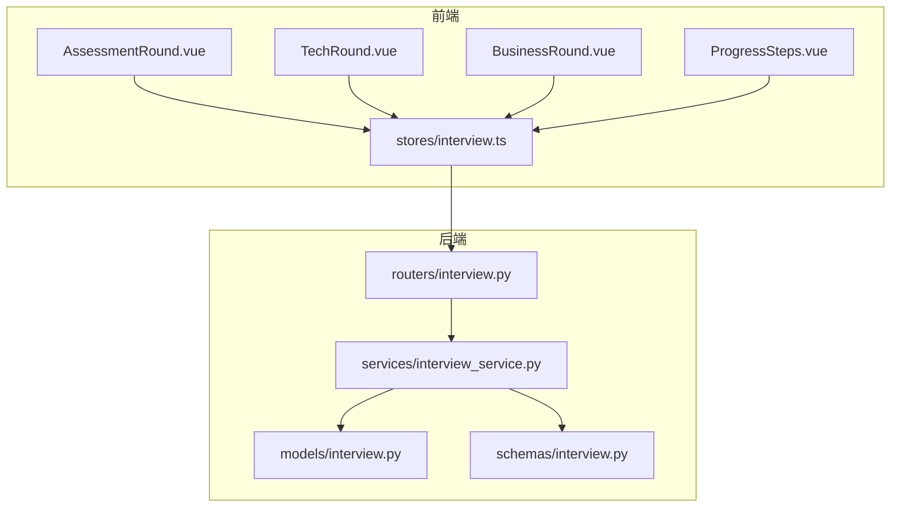
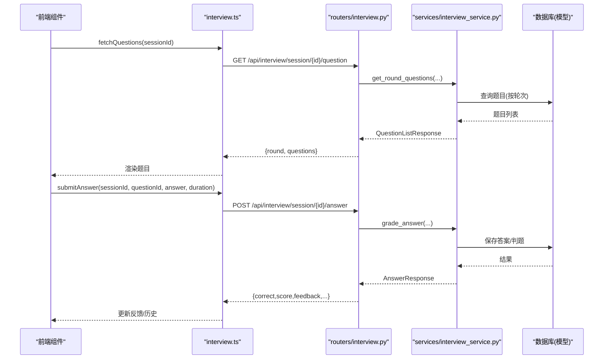
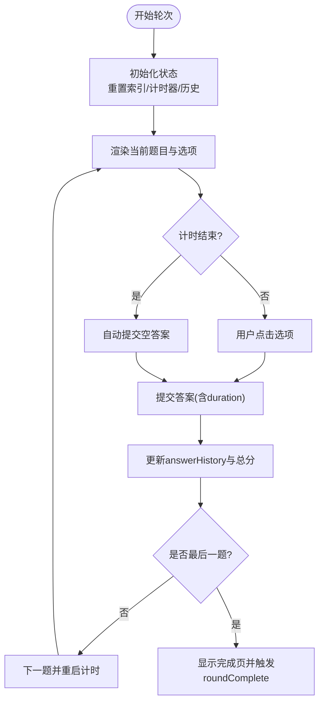
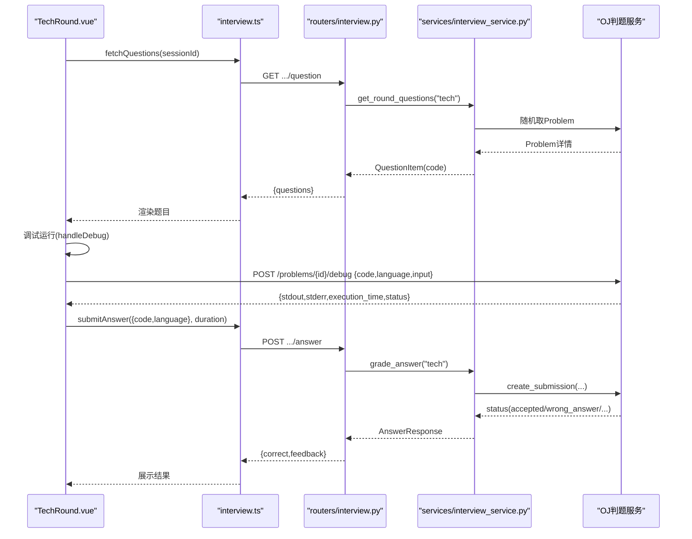
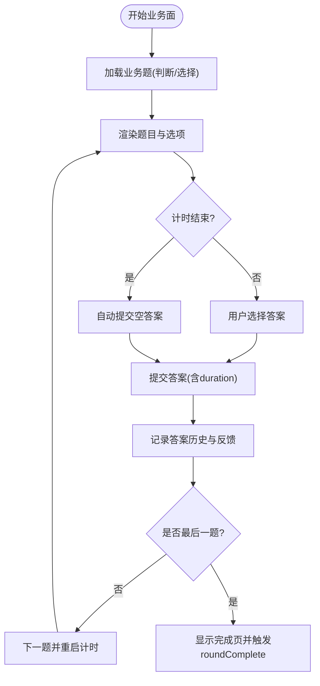
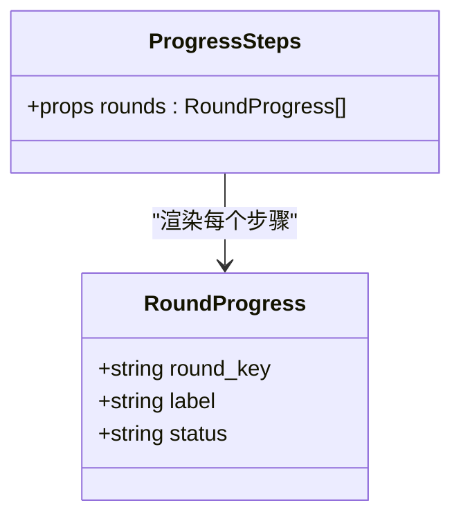
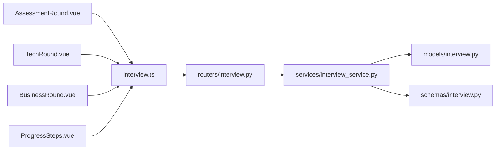

# 面试环节实现

<cite>
**本文引用的文件**   
- [AssessmentRound.vue](file://frontEnd/src/components/interview/AssessmentRound.vue)
- [TechRound.vue](file://frontEnd/src/components/interview/TechRound.vue)
- [BusinessRound.vue](file://frontEnd/src/components/interview/BusinessRound.vue)
- [ProgressSteps.vue](file://frontEnd/src/components/interview/ProgressSteps.vue)
- [interview.ts](file://frontEnd/src/stores/interview.ts)
- [interview.py](file://backEnd/app/routers/interview.py)
- [interview_service.py](file://backEnd/app/services/interview_service.py)
- [interview.py（模型）](file://backEnd/app/models/interview.py)
- [interview.py（Schema）](file://backEnd/app/schemas/interview.py)
</cite>

## 目录
1. [简介](#简介)
2. [项目结构](#项目结构)
3. [核心组件](#核心组件)
4. [架构总览](#架构总览)
5. [详细组件分析](#详细组件分析)
6. [依赖关系分析](#依赖关系分析)
7. [性能与体验优化](#性能与体验优化)
8. [故障排查指南](#故障排查指南)
9. [结论](#结论)
10. [附录：新面试环节开发指南](#附录新面试环节开发指南)

## 简介
本技术文档围绕 HR XF 的“面试环节”实现，覆盖以下目标：
- 综合素质测评环节：题型设计、交互流程、评分反馈。
- 技术能力面试环节：编程题展示、代码编辑与调试、判题对接。
- 业务能力面试环节：判断题/选择题处理、业务场景题目呈现。
- 通用组件：进度条、题目展示、答案输入等可复用模块。
- 数据结构与交互差异：不同轮次的数据模型与调用链。
- 新环节开发指导：组件、API、样式定制步骤。
- 用户体验与无障碍访问支持建议。

## 项目结构
前端采用 Vue 3 + TypeScript + Pinia；后端采用 FastAPI + SQLAlchemy + MySQL。面试相关的前端组件集中在 interview 目录，后端路由与服务逻辑集中在 app/routers/interview.py 与 app/services/interview_service.py。

图表来源
- [AssessmentRound.vue:1-227](file://frontEnd/src/components/interview/AssessmentRound.vue#L1-L227)
- [TechRound.vue:1-427](file://frontEnd/src/components/interview/TechRound.vue#L1-L427)
- [BusinessRound.vue:1-258](file://frontEnd/src/components/interview/BusinessRound.vue#L1-L258)
- [ProgressSteps.vue:1-44](file://frontEnd/src/components/interview/ProgressSteps.vue#L1-L44)
- [interview.ts:1-313](file://frontEnd/src/stores/interview.ts#L1-L313)
- [interview.py（路由）:1-317](file://backEnd/app/routers/interview.py#L1-L317)
- [interview_service.py:1-1202](file://backEnd/app/services/interview_service.py#L1-L1202)
- [interview.py（模型）:1-114](file://backEnd/app/models/interview.py#L1-L114)
- [interview.py（Schema）:1-152](file://backEnd/app/schemas/interview.py#L1-L152)

章节来源
- [AssessmentRound.vue:1-227](file://frontEnd/src/components/interview/AssessmentRound.vue#L1-L227)
- [TechRound.vue:1-427](file://frontEnd/src/components/interview/TechRound.vue#L1-L427)
- [BusinessRound.vue:1-258](file://frontEnd/src/components/interview/BusinessRound.vue#L1-L258)
- [ProgressSteps.vue:1-44](file://frontEnd/src/components/interview/ProgressSteps.vue#L1-L44)
- [interview.ts:1-313](file://frontEnd/src/stores/interview.ts#L1-L313)
- [interview.py（路由）:1-317](file://backEnd/app/routers/interview.py#L1-L317)
- [interview_service.py:1-1202](file://backEnd/app/services/interview_service.py#L1-L1202)
- [interview.py（模型）:1-114](file://backEnd/app/models/interview.py#L1-L114)
- [interview.py（Schema）:1-152](file://backEnd/app/schemas/interview.py#L1-L152)

## 核心组件
- AssessmentRound.vue：综合素质测评轮次，单选计时答题，提交后即时反馈并记录历史。
- TechRound.vue：技术面轮次，OJ风格题目展示、多语言代码编辑器、调试运行与提交判题。
- BusinessRound.vue：业务面轮次，判断题/选择题混合，每题限时作答。
- ProgressSteps.vue：通用进度条，显示全流程或单轮练习的轮次状态。
- stores/interview.ts：统一 API 客户端、会话管理、题目获取、答案提交、AI 对话流式接收、报告与历史记录。

章节来源
- [AssessmentRound.vue:1-227](file://frontEnd/src/components/interview/AssessmentRound.vue#L1-L227)
- [TechRound.vue:1-427](file://frontEnd/src/components/interview/TechRound.vue#L1-L427)
- [BusinessRound.vue:1-258](file://frontEnd/src/components/interview/BusinessRound.vue#L1-L258)
- [ProgressSteps.vue:1-44](file://frontEnd/src/components/interview/ProgressSteps.vue#L1-L44)
- [interview.ts:1-313](file://frontEnd/src/stores/interview.ts#L1-L313)

## 架构总览
前后端通过 RESTful API 交互，服务层负责题库加载、评分、AI 对话与报告生成。

图表来源
- [interview.ts:177-199](file://frontEnd/src/stores/interview.ts#L177-L199)
- [interview.py（路由）:85-119](file://backEnd/app/routers/interview.py#L85-L119)
- [interview_service.py:536-741](file://backEnd/app/services/interview_service.py#L536-L741)
- [interview.py（模型）:84-114](file://backEnd/app/models/interview.py#L84-L114)

## 详细组件分析

### 综合素质测评（AssessmentRound）
- 题型与交互
  - 单选题，每题固定时长倒计时，自动提交未作答。
  - 选项以字母标识，选择后立即提交并进入下一题。
  - 完成后展示每题结果、得分与反馈摘要。
- 数据与状态
  - 使用 store 的 submitAnswer 提交答案，返回 correct、score、feedback、correct_answer。
  - 本地维护 currentIndex、selectedOption、answered、timer、answerHistory。
- 关键流程
  - 初始化：监听 questions 变化重置状态并开始计时。
  - 提交：计算用时，调用 store.submitAnswer，追加 answerHistory，延迟跳转下一题。
  - 完成：当索引到达末尾时触发 roundComplete 事件。

图表来源
- [AssessmentRound.vue:134-227](file://frontEnd/src/components/interview/AssessmentRound.vue#L134-L227)
- [interview.ts:185-199](file://frontEnd/src/stores/interview.ts#L185-L199)
- [interview_service.py:628-670](file://backEnd/app/services/interview_service.py#L628-L670)

章节来源
- [AssessmentRound.vue:1-227](file://frontEnd/src/components/interview/AssessmentRound.vue#L1-L227)
- [interview.ts:185-199](file://frontEnd/src/stores/interview.ts#L185-L199)
- [interview_service.py:536-557](file://backEnd/app/services/interview_service.py#L536-L557)
- [interview_service.py:628-670](file://backEnd/app/services/interview_service.py#L628-L670)

### 技术能力面试（TechRound）
- 功能要点
  - OJ 风格布局：左侧题目描述、输入输出格式、样例数据与限制；右侧代码编辑器与调试区。
  - 多语言支持：Python3/C/C++/Java/JavaScript，提供默认模板占位符。
  - 调试运行：调用 OJ 的 debug 接口，使用第一组样例输入进行本地验证。
  - 提交判题：通过 store.submitAnswer 将 code+language 提交至后端，后端复用 OJ 判题服务。
- 数据结构
  - 题目内容来自 OJ Problem 表，包含 description、input_format、output_format、constraints、sample_input/output、hint、time_limit、memory_limit 等。
  - 提交参数为 {code, language}，后端解析并创建 Submission 执行判题。
- 交互流程
  - 加载题目：从后端随机抽取一道题，设置 time_limit=900s。
  - 调试：POST /api/problems/{id}/debug，返回 stdout/stderr/execution_time/status。
  - 提交：POST /api/interview/session/{id}/answer，后端调用 problem_service.create_submission 判题并返回结果。

图表来源
- [TechRound.vue:264-427](file://frontEnd/src/components/interview/TechRound.vue#L264-L427)
- [interview.ts:177-199](file://frontEnd/src/stores/interview.ts#L177-L199)
- [interview.py（路由）:85-119](file://backEnd/app/routers/interview.py#L85-L119)
- [interview_service.py:559-714](file://backEnd/app/services/interview_service.py#L559-L714)

章节来源
- [TechRound.vue:1-427](file://frontEnd/src/components/interview/TechRound.vue#L1-L427)
- [interview.ts:177-199](file://frontEnd/src/stores/interview.ts#L177-L199)
- [interview_service.py:559-714](file://backEnd/app/services/interview_service.py#L559-L714)

### 业务能力面试（BusinessRound）
- 题型与交互
  - 判断题与选择题混合，每题限时 60 秒，超时自动提交。
  - 判断题选项为“正确/错误”，选择题选项以字母标识。
  - 完成后汇总每题结果与反馈。
- 数据与评分
  - 后端根据 question_type 区分处理，匹配标准答案并给出解释。
  - 每道题满分 10 分，累计总分用于报告维度映射。

图表来源
- [BusinessRound.vue:163-258](file://frontEnd/src/components/interview/BusinessRound.vue#L163-L258)
- [interview.ts:185-199](file://frontEnd/src/stores/interview.ts#L185-L199)
- [interview_service.py:586-604](file://backEnd/app/services/interview_service.py#L586-L604)
- [interview_service.py:628-670](file://backEnd/app/services/interview_service.py#L628-L670)

章节来源
- [BusinessRound.vue:1-258](file://frontEnd/src/components/interview/BusinessRound.vue#L1-L258)
- [interview.ts:185-199](file://frontEnd/src/stores/interview.ts#L185-L199)
- [interview_service.py:586-604](file://backEnd/app/services/interview_service.py#L586-L604)
- [interview_service.py:628-670](file://backEnd/app/services/interview_service.py#L628-L670)

### 通用组件：ProgressSteps
- 职责
  - 根据 rounds_progress 数组渲染步骤指示器与连接线。
  - 支持单轮模式与全流程模式的差异化显示。
- 数据来源
  - 由后端 _build_rounds_progress 生成，包含 round_key、label、status（pending/active/completed）。

图表来源
- [ProgressSteps.vue:1-44](file://frontEnd/src/components/interview/ProgressSteps.vue#L1-L44)
- [interview_service.py:46-66](file://backEnd/app/services/interview_service.py#L46-L66)
- [interview.py（Schema）:21-26](file://backEnd/app/schemas/interview.py#L21-L26)

章节来源
- [ProgressSteps.vue:1-44](file://frontEnd/src/components/interview/ProgressSteps.vue#L1-L44)
- [interview_service.py:46-66](file://backEnd/app/services/interview_service.py#L46-L66)
- [interview.py（Schema）:21-26](file://backEnd/app/schemas/interview.py#L21-L26)

## 依赖关系分析
- 前端依赖
  - 各轮次组件依赖 stores/interview.ts 提供的 API 封装方法（fetchQuestions、submitAnswer、nextRound、sendAIChat 等）。
  - 进度条组件依赖 RoundProgress 类型定义。
- 后端依赖
  - 路由层依赖服务层进行业务编排与数据持久化。
  - 服务层依赖模型层（InterviewSession、InterviewQuestion、InterviewAnswer）与外部 OJ 判题服务。
  - Schema 层定义请求/响应结构，保证前后端契约一致。

图表来源
- [AssessmentRound.vue:1-227](file://frontEnd/src/components/interview/AssessmentRound.vue#L1-L227)
- [TechRound.vue:1-427](file://frontEnd/src/components/interview/TechRound.vue#L1-L427)
- [BusinessRound.vue:1-258](file://frontEnd/src/components/interview/BusinessRound.vue#L1-L258)
- [ProgressSteps.vue:1-44](file://frontEnd/src/components/interview/ProgressSteps.vue#L1-L44)
- [interview.ts:1-313](file://frontEnd/src/stores/interview.ts#L1-L313)
- [interview.py（路由）:1-317](file://backEnd/app/routers/interview.py#L1-L317)
- [interview_service.py:1-1202](file://backEnd/app/services/interview_service.py#L1-L1202)
- [interview.py（模型）:1-114](file://backEnd/app/models/interview.py#L1-L114)
- [interview.py（Schema）:1-152](file://backEnd/app/schemas/interview.py#L1-L152)

章节来源
- [interview.ts:1-313](file://frontEnd/src/stores/interview.ts#L1-L313)
- [interview.py（路由）:1-317](file://backEnd/app/routers/interview.py#L1-L317)
- [interview_service.py:1-1202](file://backEnd/app/services/interview_service.py#L1-L1202)
- [interview.py（模型）:1-114](file://backEnd/app/models/interview.py#L1-L114)
- [interview.py（Schema）:1-152](file://backEnd/app/schemas/interview.py#L1-L152)

## 性能与体验优化
- 前端
  - 计时器清理：在组件卸载时清除 setInterval，避免内存泄漏。
  - 大文本渲染：题目与样例数据使用预格式化标签减少重排。
  - 防抖/节流：提交按钮禁用态防止重复提交。
- 后端
  - 随机抽题：assessment/business 使用 shuffle 并切片，降低每次负载。
  - 判题异步：OJ 判题通过 service 层封装，避免阻塞主线程。
  - SSE 流式：AI 对话使用 StreamingResponse，提升首字响应速度。
- 网络与缓存
  - 统一鉴权头封装，减少重复逻辑。
  - 报告生成后可缓存，避免重复计算。

[本节为通用建议，不直接分析具体文件]

## 故障排查指南
- 常见错误
  - 题目不存在：后端返回 feedback 提示，前端需友好展示。
  - 判题失败：检查 OJ 接口连通性与 token 权限。
  - AI 对话异常：SSE 读取失败时回退到默认提示。
- 定位步骤
  - 查看浏览器控制台与 Network 面板，确认请求路径与响应体。
  - 在后端日志中检索对应 session_id 与 question_id 的记录。
  - 对调试运行结果中的 stderr 与 execution_time 进行分析。

章节来源
- [TechRound.vue:334-379](file://frontEnd/src/components/interview/TechRound.vue#L334-L379)
- [interview_service.py:743-791](file://backEnd/app/services/interview_service.py#L743-L791)
- [interview_service.py:797-845](file://backEnd/app/services/interview_service.py#L797-L845)

## 结论
HR XF 的面试环节实现了从测评、技术到业务的完整链路，并通过通用组件与统一 store 提升了可维护性。后端服务层清晰划分了题库、评分、AI 对话与报告生成职责，结合 OJ 判题与 SSE 流式响应，提供了良好的用户体验与扩展性。

[本节为总结，不直接分析具体文件]

## 附录：新面试环节开发指南
- 组件开发
  - 新建轮次组件（如 NewRound.vue），遵循 props.questions、sessionId 与 emit('roundComplete') 约定。
  - 复用 ProgressSteps 与 stores/interview.ts 的 API 方法。
- 数据结构
  - 在 services/interview_service.py 的 get_round_questions 中添加新轮次 key 的题目加载逻辑。
  - 在 grade_answer 中新增对应评分策略（选择题/开放题/代码题等）。
- API 对接
  - 若需要额外接口（如自定义判题或素材下载），在 routers/interview.py 中新增路由并在 store 中封装。
- 样式定制
  - 沿用现有 Tailwind 类名风格，保持边框、阴影与字体层级一致性。
- 用户体验与无障碍
  - 为所有按钮添加 aria-label，确保键盘可达。
  - 为倒计时与错误信息提供高对比度与动画提示。
  - 对长文本提供滚动区域与复制功能。

章节来源
- [interview_service.py:536-622](file://backEnd/app/services/interview_service.py#L536-L622)
- [interview_service.py:628-741](file://backEnd/app/services/interview_service.py#L628-L741)
- [interview.py（路由）:85-119](file://backEnd/app/routers/interview.py#L85-L119)
- [interview.ts:177-199](file://frontEnd/src/stores/interview.ts#L177-L199)