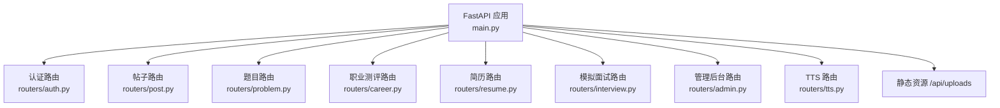
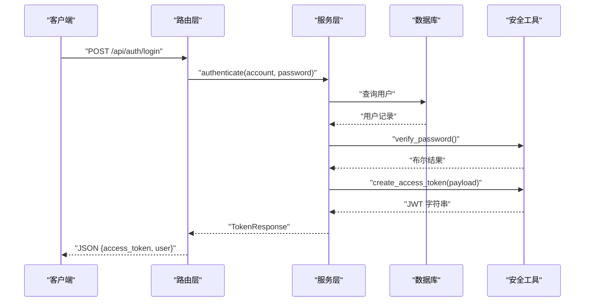
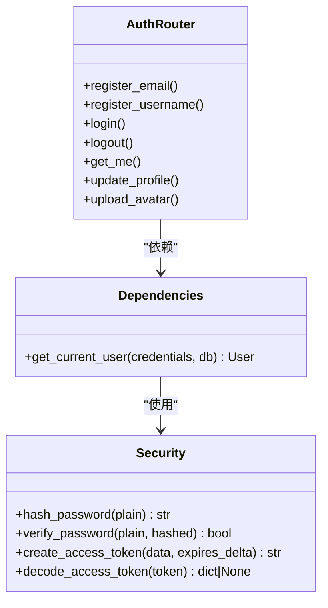

# API接口文档

<cite>
**本文引用的文件**   
- [main.py](file://backEnd/app/main.py)
- [auth.py](file://backEnd/app/routers/auth.py)
- [security.py](file://backEnd/app/utils/security.py)
- [dependencies.py](file://backEnd/app/dependencies.py)
- [admin.py](file://backEnd/app/routers/admin.py)
- [post.py](file://backEnd/app/routers/post.py)
- [problem.py](file://backEnd/app/routers/problem.py)
- [career.py](file://backEnd/app/routers/career.py)
- [resume.py](file://backEnd/app/routers/resume.py)
- [interview.py](file://backEnd/app/routers/interview.py)
- [tts.py](file://backEnd/app/routers/tts.py)
- [auth.py（schemas）](file://backEnd/app/schemas/auth.py)
- [admin.py（schemas）](file://backEnd/app/schemas/admin.py)
- [post.py（schemas）](file://backEnd/app/schemas/post.py)
- [problem.py（schemas）](file://backEnd/app/schemas/problem.py)
- [career.py（schemas）](file://backEnd/app/schemas/career.py)
</cite>

## 目录
1. [简介](#简介)
2. [项目结构](#项目结构)
3. [核心组件](#核心组件)
4. [架构总览](#架构总览)
5. [详细组件分析](#详细组件分析)
6. [依赖关系分析](#依赖关系分析)
7. [性能与速率限制](#性能与速率限制)
8. [故障排查指南](#故障排查指南)
9. [结论](#结论)
10. [附录：前端集成最佳实践](#附录前端集成最佳实践)

## 简介
本文件为 HR XF 系统后端 RESTful API 的完整接口文档，覆盖认证、论坛帖子、OJ 刷题、职业测评、简历处理、模拟面试、TTS 语音合成与管理后台等模块。文档包含：
- 所有端点的 HTTP 方法、URL 模式、请求参数、响应格式与状态码
- JWT 认证机制的使用说明
- Pydantic 模型字段定义与验证规则
- 错误处理机制与通用错误格式
- 流式接口（SSE）使用方式
- 安全与速率限制建议
- 前端集成示例与测试方法

注意：本项目未实现 WebSocket 接口；如需实时通信，建议使用 SSE 或轮询方案。

## 项目结构
后端采用 FastAPI 模块化路由组织，按功能域划分 routers、schemas、services、models、utils 等目录。应用启动时自动创建数据库表并初始化种子数据，挂载静态资源目录用于头像与简历上传。

图表来源
- [main.py:44-73](file://backEnd/app/main.py#L44-L73)

章节来源
- [main.py:27-41](file://backEnd/app/main.py#L27-L41)
- [main.py:51-73](file://backEnd/app/main.py#L51-L73)

## 核心组件
- 认证与安全
  - JWT 令牌签发与校验、密码哈希与校验
  - 全局依赖 get_current_user 进行 Bearer Token 鉴权
- 路由层
  - 各业务模块路由统一以 /api/* 前缀注册
  - 支持可选认证（如帖子列表、题目列表）与强制认证（如发帖、提交代码）
- 数据模型
  - 使用 Pydantic 定义请求/响应模型，内置字段校验与类型转换
- 静态资源
  - /api/uploads 提供上传文件的访问路径

章节来源
- [dependencies.py:10-41](file://backEnd/app/dependencies.py#L10-L41)
- [security.py:18-47](file://backEnd/app/utils/security.py#L18-L47)
- [auth.py:25-38](file://backEnd/app/routers/auth.py#L25-L38)

## 架构总览
整体采用“路由 -> 服务 -> 数据库”的分层架构，结合 Pydantic 做输入输出校验，JWT 做无状态认证，SSE 提供流式响应能力。

图表来源
- [auth.py:69-80](file://backEnd/app/routers/auth.py#L69-L80)
- [security.py:26-47](file://backEnd/app/utils/security.py#L26-L47)

## 详细组件分析

### 认证与账户设置（/api/auth）
- 注册
  - POST /api/auth/register/email
    - 请求体：EmailRegisterRequest
      - email: 邮箱
      - password: 长度≥6
    - 响应：TokenResponse
    - 状态码：201
  - POST /api/auth/register/username
    - 请求体：UsernameRegisterRequest
      - username: 3-50字符，仅字母、数字、下划线、中文
      - password: 长度≥6
    - 响应：TokenResponse
    - 状态码：201
- 登录/登出
  - POST /api/auth/login
    - 请求体：LoginRequest
      - account: 账号（用户名或邮箱）
      - password: 密码
    - 响应：TokenResponse
    - 状态码：200
  - POST /api/auth/logout
    - 无需请求体
    - 响应：MessageResponse
    - 状态码：200
- 个人信息
  - GET /api/auth/me
    - 响应：UserResponse
    - 需要认证
  - GET /api/auth/profile
    - 响应：UserResponse
    - 需要认证
  - PUT /api/auth/profile
    - 请求体：ProfileUpdateRequest
      - nickname/avatar_color/bio/phone/gender/birth_date 均为可选
      - gender 限定 male/female/other/空
    - 响应：UserResponse
    - 需要认证
  - PUT /api/auth/username
    - 请求体：UpdateUsernameRequest
    - 响应：TokenResponse（返回新令牌）
    - 需要认证
  - PUT /api/auth/email
    - 请求体：UpdateEmailRequest
    - 响应：TokenResponse（返回新令牌）
    - 需要认证
  - PUT /api/auth/password
    - 请求体：ChangePasswordRequest
      - old_password/new_password
      - new_password 长度≥6
    - 响应：MessageResponse
    - 需要认证
  - DELETE /api/auth/account
    - 请求体：DeleteAccountRequest
      - password
    - 响应：MessageResponse
    - 需要认证
- 头像上传
  - POST /api/auth/avatar
    - 表单字段：file（图片），允许类型 image/jpeg/png/webp/gif，最大 5MB
    - 响应：UserResponse（含 avatar 相对路径）
    - 需要认证

认证说明
- 使用 Bearer Token 进行鉴权，Header 中携带 Authorization: Bearer <token>
- 部分接口支持可选认证（如帖子列表、题目列表），通过解析 token 获取当前用户上下文

章节来源
- [auth.py:41-86](file://backEnd/app/routers/auth.py#L41-L86)
- [auth.py:97-176](file://backEnd/app/routers/auth.py#L97-L176)
- [auth.py:182-216](file://backEnd/app/routers/auth.py#L182-L216)
- [auth.py（schemas）:9-36](file://backEnd/app/schemas/auth.py#L9-L36)
- [auth.py（schemas）:40-68](file://backEnd/app/schemas/auth.py#L40-L68)
- [auth.py（schemas）:72-119](file://backEnd/app/schemas/auth.py#L72-L119)
- [dependencies.py:13-41](file://backEnd/app/dependencies.py#L13-L41)
- [security.py:18-47](file://backEnd/app/utils/security.py#L18-L47)

### 面经论坛（/api/posts）
- 发布帖子
  - POST /api/posts
    - 请求体：PostCreate
      - title/content/company/position/year/status/is_anonymous/tag_names
      - year 范围 2020-2030
      - status 枚举：offer/waitlist/rejected/in_progress
    - 响应：PostResponse
    - 状态码：201
    - 需要认证
- 帖子列表
  - GET /api/posts
    - 查询参数：company/position/year/status/interview_type/tags/keyword/sort_by/page/size
      - sort_by 枚举：latest/hottest
      - tags 逗号分隔标签名
      - page/size 分页
    - 响应：PostListResponse
    - 可选认证（若带 token，会返回 is_liked 标记）
- 标签统计
  - GET /api/posts/tags/stats
    - 查询参数：limit（1-100）
    - 响应：list[TagStatResponse]
- 筛选器选项
  - GET /api/posts/filters/options
    - 响应：{companies, positions, statuses, interview_types, years}
- 帖子详情
  - GET /api/posts/{post_id}
    - 响应：PostResponse
    - 可选认证
- 删除帖子
  - DELETE /api/posts/{post_id}
    - 需要认证，仅作者可删
    - 状态码：204
- 点赞
  - POST /api/posts/{post_id}/like
    - 需要认证
    - 响应：{liked: bool, message: string}
- 评论
  - POST /api/posts/{post_id}/comments
    - 请求体：CommentCreate
      - content（1-2000）、is_anonymous
    - 响应：CommentResponse
    - 状态码：201
    - 需要认证
  - GET /api/posts/{post_id}/comments
    - 查询参数：page/size
    - 响应：CommentListResponse
  - DELETE /api/posts/comments/{comment_id}
    - 需要认证，仅作者可删
    - 状态码：204
- 分享链接
  - POST /api/posts/{post_id}/share
    - 响应：ShareResponse

章节来源
- [post.py:52-105](file://backEnd/app/routers/post.py#L52-L105)
- [post.py:108-128](file://backEnd/app/routers/post.py#L108-L128)
- [post.py:131-144](file://backEnd/app/routers/post.py#L131-L144)
- [post.py:147-160](file://backEnd/app/routers/post.py#L147-L160)
- [post.py:165-176](file://backEnd/app/routers/post.py#L165-L176)
- [post.py:182-215](file://backEnd/app/routers/post.py#L182-L215)
- [post.py:218-230](file://backEnd/app/routers/post.py#L218-L230)
- [post.py:236-240](file://backEnd/app/routers/post.py#L236-L240)
- [post.py（schemas）:11-56](file://backEnd/app/schemas/post.py#L11-L56)
- [post.py（schemas）:64-91](file://backEnd/app/schemas/post.py#L64-L91)

### OJ 刷题（/api/problems）
- 题目列表
  - GET /api/problems
    - 查询参数：difficulty/tag/keyword/page/size
      - difficulty 枚举：easy/medium/hard
    - 响应：ProblemListResponse
    - 可选认证（返回 user_solved 标记）
- 标签选项
  - GET /api/problems/tags/options
    - 响应：{tags: list<string>}
- 用户进度
  - GET /api/problems/progress
    - 需要认证
    - 响应：UserProgressResponse
- 题目详情
  - GET /api/problems/{problem_id}
    - 响应：ProblemDetail
    - 可选认证
- 提交代码
  - POST /api/problems/{problem_id}/submit
    - 请求体：SubmissionCreate
      - code/language（python3/python/c/cpp/java/javascript）
    - 响应：SubmissionResponse
    - 状态码：201
    - 需要认证
- 调试代码
  - POST /api/problems/{problem_id}/debug
    - 请求体：DebugRequest
      - code/language/input_data
    - 响应：DebugResponse
    - 需要认证

章节来源
- [problem.py:47-90](file://backEnd/app/routers/problem.py#L47-L90)
- [problem.py:93-118](file://backEnd/app/routers/problem.py#L93-L118)
- [problem.py:121-174](file://backEnd/app/routers/problem.py#L121-L174)
- [problem.py（schemas）:10-53](file://backEnd/app/schemas/problem.py#L10-L53)
- [problem.py（schemas）:59-103](file://backEnd/app/schemas/problem.py#L59-L103)
- [problem.py（schemas）:122-130](file://backEnd/app/schemas/problem.py#L122-L130)

### 职业测评（/api/career）
- 获取测评题目
  - GET /api/career/questions/{assessment_type}
    - assessment_type 枚举：holland/mbti/career_values
    - 响应：AssessmentQuestionsResponse
    - 无需认证
- 提交答案
  - POST /api/career/submit
    - 请求体：AssessmentSubmitRequest
      - type/answers（每个答案包含 question_id/score 1-5）
    - 响应：AssessmentResponse
    - 状态码：201
    - 需要认证
- 历史列表
  - GET /api/career/history
    - 响应：AssessmentListResponse
    - 需要认证
- 单个结果
  - GET /api/career/result/{assessment_id}
    - 响应：AssessmentResponse
    - 需要认证
- AI 岗位匹配推荐（SSE 流式）
  - POST /api/career/recommend/stream
    - 请求体：CareerRecommendRequest
      - assessment_id
    - 响应：text/event-stream
      - 事件类型：job/done
      - job 事件包含 index 与 data（岗位信息）
      - done 事件包含 prep_tips 与 total_jobs
    - 需要认证

章节来源
- [career.py:20-52](file://backEnd/app/routers/career.py#L20-L52)
- [career.py:55-93](file://backEnd/app/routers/career.py#L55-L93)
- [career.py:96-157](file://backEnd/app/routers/career.py#L96-L157)
- [career.py（schemas）:16-59](file://backEnd/app/schemas/career.py#L16-L59)

### 简历处理（/api/resume）
- 配置检查
  - GET /api/resume/config
    - 响应：{has_api_key: boolean}
    - 需要认证
- 获取简历
  - GET /api/resume/
    - 响应：ResumeResponse
    - 需要认证
- 上传简历
  - POST /api/resume/upload
    - 表单字段：file（PDF）、raw_text（文本）
    - 若已配置 API Key 且提供 raw_text，将自动结构化提取并保存
    - 响应：ResumeResponse
    - 状态码：201
    - 需要认证
- 手动触发结构化分析
  - POST /api/resume/analyze
    - 需要认证
- AI 措辞优化（同步）
  - POST /api/resume/optimize
    - 需要认证
    - 命中缓存直接返回
- AI 措辞优化（SSE 流式）
  - POST /api/resume/optimize/stream
    - 需要认证
    - 事件类型：start/item/done
    - item 包含 original/optimized
- PDF 文本提取
  - POST /api/resume/extract-text
    - 表单字段：file（仅 PDF）
    - 响应：{raw_text: string}
    - 需要认证

章节来源
- [resume.py:25-77](file://backEnd/app/routers/resume.py#L25-L77)
- [resume.py:80-98](file://backEnd/app/routers/resume.py#L80-L98)
- [resume.py:100-137](file://backEnd/app/routers/resume.py#L100-L137)
- [resume.py:140-192](file://backEnd/app/routers/resume.py#L140-L192)
- [resume.py:195-214](file://backEnd/app/routers/resume.py#L195-L214)

### 模拟面试（/api/interview）
- 岗位分类
  - GET /api/interview/jobs
    - 响应：list（分类对象）
    - 需要认证
- 开始面试
  - POST /api/interview/start
    - 请求体：InterviewSessionCreate
      - job_category/job_title/interview_mode/target_round
    - 响应：InterviewSessionResponse
    - 状态码：201
    - 需要认证
- 会话状态
  - GET /api/interview/session/{session_id}
    - 响应：InterviewSessionResponse
    - 需要认证
- 获取本轮题目
  - GET /api/interview/session/{session_id}/question
    - 响应：QuestionListResponse
    - 需要认证
- 提交答案
  - POST /api/interview/session/{session_id}/answer
    - 请求体：AnswerSubmit
      - question_id/answer/duration_seconds
    - 响应：AnswerResponse
    - 需要认证
- 下一轮
  - POST /api/interview/session/{session_id}/next
    - 响应：InterviewSessionResponse
    - 需要认证
- AI 多轮对话（SSE 流式）
  - POST /api/interview/session/{session_id}/ai-chat
    - 请求体：AIChatRequest
      - messages/round
    - 响应：text/event-stream
    - 需要认证
- 上报切屏
  - POST /api/interview/session/{session_id}/cheat
    - 请求体：CheatReport
      - cheat_count
    - 响应：InterviewSessionResponse
    - 需要认证
- 中止面试
  - POST /api/interview/session/{session_id}/abort
    - 响应：InterviewSessionResponse
    - 需要认证
- 评分报告
  - GET /api/interview/session/{session_id}/report
    - 响应：InterviewReport
    - 需要认证
- 历史记录
  - GET /api/interview/history
    - 响应：InterviewHistoryResponse
    - 需要认证

章节来源
- [interview.py:29-58](file://backEnd/app/routers/interview.py#L29-L58)
- [interview.py:61-99](file://backEnd/app/routers/interview.py#L61-L99)
- [interview.py:102-158](file://backEnd/app/routers/interview.py#L102-L158)
- [interview.py:161-189](file://backEnd/app/routers/interview.py#L161-L189)
- [interview.py:192-256](file://backEnd/app/routers/interview.py#L192-L256)
- [interview.py:259-316](file://backEnd/app/routers/interview.py#L259-L316)

### 管理后台（/api/admin）
- 仪表盘统计
  - GET /api/admin/stats
    - 响应：DashboardStats
    - 需要管理员权限
- 用户管理
  - GET /api/admin/users
    - 查询参数：keyword/page/size
    - 响应：AdminUserListResponse
    - 需要管理员权限
  - PUT /api/admin/users/{user_id}
    - 请求体：AdminUserUpdateRequest
      - is_active/nickname
    - 响应：AdminUserItem
    - 需要管理员权限
  - DELETE /api/admin/users/{user_id}
    - 需要管理员权限
- 题目管理
  - GET /api/admin/problems
    - 查询参数：keyword/difficulty/page/size
    - 响应：AdminProblemListResponse
    - 需要管理员权限
  - POST /api/admin/problems
    - 请求体：AdminProblemCreate
    - 响应：AdminProblemItem
    - 状态码：201
    - 需要管理员权限
  - PUT /api/admin/problems/{problem_id}
    - 请求体：AdminProblemUpdate
    - 响应：AdminProblemItem
    - 需要管理员权限
  - DELETE /api/admin/problems/{problem_id}
    - 需要管理员权限
- 帖子管理
  - GET /api/admin/posts
    - 查询参数：keyword/page/size
    - 响应：AdminPostListResponse
    - 需要管理员权限
  - DELETE /api/admin/posts/{post_id}
    - 需要管理员权限

管理员判定
- 简易策略：email 或 username 包含 “admin” 即视为管理员

章节来源
- [admin.py:24-45](file://backEnd/app/routers/admin.py#L24-L45)
- [admin.py:50-99](file://backEnd/app/routers/admin.py#L50-L99)
- [admin.py:104-162](file://backEnd/app/routers/admin.py#L104-L162)
- [admin.py:167-197](file://backEnd/app/routers/admin.py#L167-L197)
- [admin.py（schemas）:7-17](file://backEnd/app/schemas/admin.py#L7-L17)
- [admin.py（schemas）:21-43](file://backEnd/app/schemas/admin.py#L21-L43)
- [admin.py（schemas）:47-97](file://backEnd/app/schemas/admin.py#L47-L97)
- [admin.py（schemas）:102-122](file://backEnd/app/schemas/admin.py#L102-L122)

### TTS 语音合成（/api/tts）
- 文本转语音
  - POST /api/tts
    - 请求体：TTSRequest
      - text/voice/rate/pitch/volume
    - 响应：audio/mpeg 流
- 列出可用中文语音
  - GET /api/tts/voices
    - 响应：{voices: list<{name, gender, locale}>}

章节来源
- [tts.py:19-50](file://backEnd/app/routers/tts.py#L19-L50)
- [tts.py:53-62](file://backEnd/app/routers/tts.py#L53-L62)

## 依赖关系分析
- 认证依赖
  - get_current_user 从 Authorization Header 解析 Bearer Token，调用 decode_access_token 校验载荷，再根据 sub 查询用户并检查是否激活
- 可选认证
  - 在帖子与题目路由中实现 _optional_user，当存在有效 token 时返回当前用户，否则返回 None
- 安全工具
  - hash_password/verify_password 使用 bcrypt
  - create_access_token/decode_access_token 使用 jose 库进行 JWT 编解码

图表来源
- [dependencies.py:13-41](file://backEnd/app/dependencies.py#L13-L41)
- [security.py:18-47](file://backEnd/app/utils/security.py#L18-L47)
- [auth.py:41-86](file://backEnd/app/routers/auth.py#L41-L86)

章节来源
- [dependencies.py:13-41](file://backEnd/app/dependencies.py#L13-L41)
- [security.py:18-47](file://backEnd/app/utils/security.py#L18-L47)
- [post.py:26-46](file://backEnd/app/routers/post.py#L26-L46)
- [problem.py:24-44](file://backEnd/app/routers/problem.py#L24-L44)

## 性能与速率限制
- 流式接口
  - 职业测评推荐、简历优化、面试 AI 对话均使用 SSE（text/event-stream），适合长耗时任务的前端渐进渲染
- 静态资源
  - 上传文件通过 /api/uploads 提供访问，避免重复生成与存储开销
- 速率限制与安全建议
  - 当前未实现服务端速率限制，建议在网关层（Nginx/反向代理）或中间件层添加限流策略
  - 对敏感操作（修改密码、注销账号、上传头像）建议增加验证码或二次确认
  - 对大文件上传（头像、简历）应限制大小与类型，并在网关层启用超时与缓冲控制
  - 生产环境建议开启 HTTPS、严格 CORS 白名单、最小化暴露的管理接口

[本节为通用指导，不直接分析具体文件]

## 故障排查指南
- 认证失败
  - 401 无效凭据：检查 Authorization Header 是否正确携带 Bearer Token
  - 401 用户不存在或禁用：确认用户状态与 ID 对应
- 参数校验错误
  - 422 自定义错误：Pydantic 校验失败，detail 中包含字段级错误信息
- 资源不存在
  - 404：帖子、题目、会话、测评记录等不存在
- 权限不足
  - 403：非作者删除、非管理员访问管理接口
- 外部依赖缺失
  - 400：Deepseek API Key 未配置导致 AI 相关功能不可用

章节来源
- [main.py:76-84](file://backEnd/app/main.py#L76-L84)
- [dependencies.py:13-41](file://backEnd/app/dependencies.py#L13-L41)
- [career.py:103-104](file://backEnd/app/routers/career.py#L103-L104)
- [resume.py:89-97](file://backEnd/app/routers/resume.py#L89-L97)

## 结论
HR XF 后端基于 FastAPI 提供了完整的 RESTful API，涵盖认证、社区、刷题、测评、简历、面试与 TTS 等功能。通过 Pydantic 保证数据一致性，JWT 实现无状态鉴权，SSE 提升用户体验。生产部署建议补充网关层限流、HTTPS、CORS 白名单与更严格的权限控制。

[本节为总结性内容，不直接分析具体文件]

## 附录：前端集成最佳实践
- 认证流程
  - 登录后保存 access_token，后续请求在 Header 中附加 Authorization: Bearer <token>
  - 对于可选认证的接口，仅在用户已登录时附带 token
- 流式接口
  - 使用 EventSource 或 fetch 读取 text/event-stream，逐条处理 data 事件
  - 对 SSE 连接设置合理的超时与重连策略
- 文件上传
  - 使用 multipart/form-data 上传头像与简历，确保类型与大小符合限制
- 错误处理
  - 统一捕获 401/403/404/422 等状态码，给出友好提示
  - 对 5xx 错误进行重试与降级处理
- 测试方法
  - 使用 curl 或 Postman 构造请求，验证各端点行为
  - 针对 SSE 接口，可使用浏览器开发者工具或专用 SSE 客户端进行测试

[本节为通用指导，不直接分析具体文件]