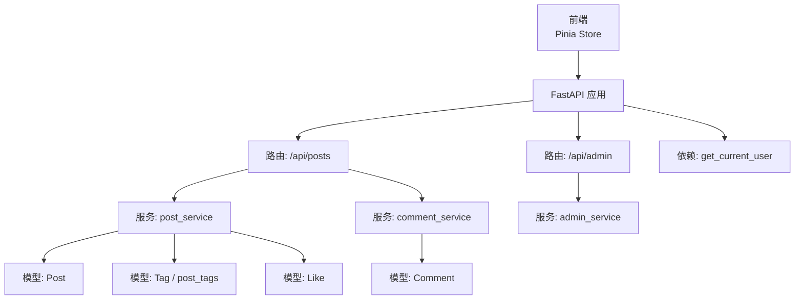
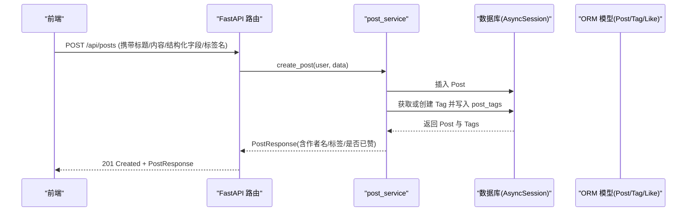
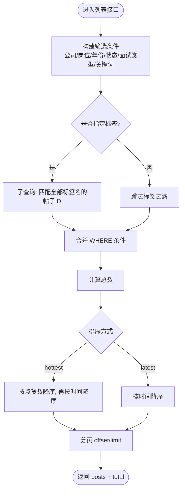
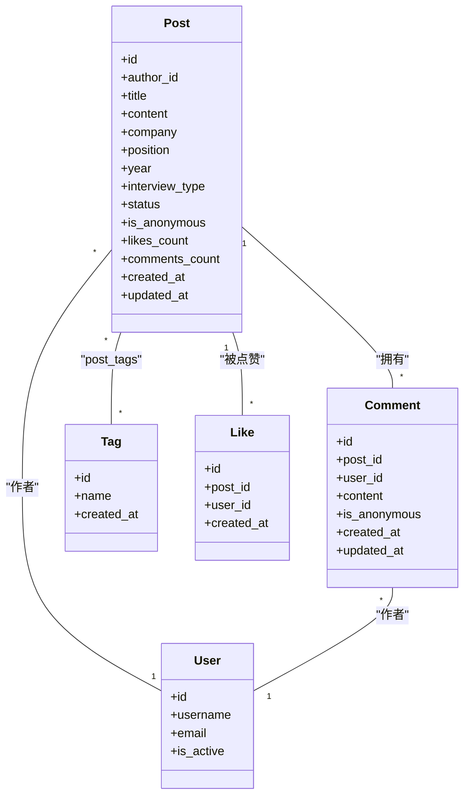

# 社区论坛接口

<cite>
**本文引用的文件**
- [backEnd/app/main.py](file://backEnd/app/main.py)
- [backEnd/app/routers/post.py](file://backEnd/app/routers/post.py)
- [backEnd/app/routers/admin.py](file://backEnd/app/routers/admin.py)
- [backEnd/app/services/post_service.py](file://backEnd/app/services/post_service.py)
- [backEnd/app/services/comment_service.py](file://backEnd/app/services/comment_service.py)
- [backEnd/app/models/post.py](file://backEnd/app/models/post.py)
- [backEnd/app/models/comment.py](file://backEnd/app/models/comment.py)
- [backEnd/app/models/tag.py](file://backEnd/app/models/tag.py)
- [backEnd/app/models/like.py](file://backEnd/app/models/like.py)
- [backEnd/app/schemas/post.py](file://backEnd/app/schemas/post.py)
- [backEnd/app/schemas/admin.py](file://backEnd/app/schemas/admin.py)
- [backEnd/app/dependencies.py](file://backEnd/app/dependencies.py)
- [frontEnd/src/stores/forum.ts](file://frontEnd/src/stores/forum.ts)
</cite>

## 目录
1. [简介](#简介)
2. [项目结构](#项目结构)
3. [核心组件](#核心组件)
4. [架构总览](#架构总览)
5. [详细组件分析](#详细组件分析)
6. [依赖关系分析](#依赖关系分析)
7. [性能考虑](#性能考虑)
8. [故障排查指南](#故障排查指南)
9. [结论](#结论)
10. [附录：接口清单与数据模型](#附录接口清单与数据模型)

## 简介
本文件为 HR XF 系统“社区论坛”模块的完整 API 接口文档，覆盖以下能力：
- 帖子发布、查询、删除（当前未实现编辑接口）
- 评论添加、分页查询、删除（当前未实现回复与点赞）
- 标签分类与统计、筛选器选项
- 社交互动：点赞、分享链接生成
- 搜索与多维度筛选：公司、岗位、年份、状态、面试类型、标签、关键词；排序支持最新与最热
- 后台管理：帖子列表、删除；用户管理；仪表盘统计
- 认证与安全：Bearer Token 鉴权、可选匿名发布
- 说明：收藏、通知、举报等能力在当前代码库中未实现，文档在相应章节给出概念性建议与扩展点。

## 项目结构
后端采用 FastAPI + SQLAlchemy 异步 ORM，按路由-服务-模型-模式分层组织；前端通过 Pinia Store 调用 /api 前缀的 RESTful 接口。

图表来源
- [backEnd/app/main.py:60-68](file://backEnd/app/main.py#L60-L68)
- [backEnd/app/routers/post.py:22-249](file://backEnd/app/routers/post.py#L22-L249)
- [backEnd/app/routers/admin.py:21-198](file://backEnd/app/routers/admin.py#L21-L198)
- [backEnd/app/services/post_service.py:1-249](file://backEnd/app/services/post_service.py#L1-L249)
- [backEnd/app/services/comment_service.py:1-105](file://backEnd/app/services/comment_service.py#L1-L105)
- [backEnd/app/models/post.py:18-65](file://backEnd/app/models/post.py#L18-L65)
- [backEnd/app/models/comment.py:17-53](file://backEnd/app/models/comment.py#L17-L53)
- [backEnd/app/models/tag.py:18-46](file://backEnd/app/models/tag.py#L18-L46)
- [backEnd/app/models/like.py:16-47](file://backEnd/app/models/like.py#L16-L47)
- [backEnd/app/dependencies.py:13-41](file://backEnd/app/dependencies.py#L13-L41)

章节来源
- [backEnd/app/main.py:44-90](file://backEnd/app/main.py#L44-L90)
- [backEnd/app/routers/post.py:22-249](file://backEnd/app/routers/post.py#L22-L249)
- [backEnd/app/routers/admin.py:21-198](file://backEnd/app/routers/admin.py#L21-L198)

## 核心组件
- 路由层
  - 帖子路由：提供帖子 CRUD、评论、点赞、分享、标签统计与筛选选项
  - 管理后台路由：提供帖子/用户/题目管理与仪表盘统计
- 服务层
  - 帖子服务：创建、查询（多条件组合筛选）、删除、点赞切换、标签统计、去重值获取
  - 评论服务：创建、分页查询、删除（更新帖子评论计数）
- 模型层
  - Post、Comment、Tag、Like 及其关联表 post_tags
- 模式层（Pydantic）
  - 请求/响应数据结构定义，如 PostCreate、PostResponse、CommentCreate、CommentResponse、ShareResponse、TagStatResponse 等
- 依赖与鉴权
  - Bearer Token 校验，可选匿名发布由业务字段控制

章节来源
- [backEnd/app/routers/post.py:52-249](file://backEnd/app/routers/post.py#L52-L249)
- [backEnd/app/routers/admin.py:39-198](file://backEnd/app/routers/admin.py#L39-L198)
- [backEnd/app/services/post_service.py:70-249](file://backEnd/app/services/post_service.py#L70-L249)
- [backEnd/app/services/comment_service.py:28-105](file://backEnd/app/services/comment_service.py#L28-L105)
- [backEnd/app/models/post.py:18-65](file://backEnd/app/models/post.py#L18-L65)
- [backEnd/app/models/comment.py:17-53](file://backEnd/app/models/comment.py#L17-L53)
- [backEnd/app/models/tag.py:18-46](file://backEnd/app/models/tag.py#L18-L46)
- [backEnd/app/models/like.py:16-47](file://backEnd/app/models/like.py#L16-L47)
- [backEnd/app/schemas/post.py:11-91](file://backEnd/app/schemas/post.py#L11-L91)
- [backEnd/app/dependencies.py:13-41](file://backEnd/app/dependencies.py#L13-L41)

## 架构总览
下图展示一次“发帖”请求从前端到数据库的调用链路与关键对象交互。

图表来源
- [backEnd/app/routers/post.py:52-61](file://backEnd/app/routers/post.py#L52-L61)
- [backEnd/app/services/post_service.py:70-94](file://backEnd/app/services/post_service.py#L70-L94)
- [backEnd/app/services/post_service.py:14-34](file://backEnd/app/services/post_service.py#L14-L34)
- [backEnd/app/models/post.py:18-65](file://backEnd/app/models/post.py#L18-L65)
- [backEnd/app/models/tag.py:18-46](file://backEnd/app/models/tag.py#L18-L46)

## 详细组件分析

### 帖子接口
- 发布帖子
  - 方法路径：POST /api/posts
  - 认证：需要 Bearer Token
  - 请求体关键字段：title、content、company、position、year、interview_type、status、is_anonymous、tag_names
  - 响应：PostResponse（包含 author_name、tags、is_liked 等）
  - 行为：自动创建不存在的标签并建立多对多关系
- 获取帖子列表（支持多维筛选与分页）
  - 方法路径：GET /api/posts
  - 查询参数：company、position、year、status、interview_type、tags（逗号分隔）、keyword、sort_by（latest/hottest）、page、size
  - 响应：PostListResponse（posts、total、page、size）
  - 行为：根据条件组合过滤；若传入 tags，则要求同时命中所有标签；支持按时间或热度排序
- 获取热门标签统计
  - 方法路径：GET /api/posts/tags/stats?limit=30
  - 响应：list[TagStatResponse]
- 获取筛选器选项
  - 方法路径：GET /api/posts/filters/options
  - 响应：{companies, positions, statuses, interview_types, years}
- 获取帖子详情
  - 方法路径：GET /api/posts/{post_id}
  - 响应：PostResponse（包含 is_liked）
- 删除帖子
  - 方法路径：DELETE /api/posts/{post_id}
  - 权限：仅作者可删
  - 响应：204 No Content
- 注意：当前未实现“编辑帖子”接口

章节来源
- [backEnd/app/routers/post.py:52-160](file://backEnd/app/routers/post.py#L52-L160)
- [backEnd/app/services/post_service.py:70-186](file://backEnd/app/services/post_service.py#L70-L186)
- [backEnd/app/schemas/post.py:11-57](file://backEnd/app/schemas/post.py#L11-L57)

#### 帖子列表筛选流程

图表来源
- [backEnd/app/services/post_service.py:96-166](file://backEnd/app/services/post_service.py#L96-L166)

### 评论接口
- 发表评论
  - 方法路径：POST /api/posts/{post_id}/comments
  - 认证：需要 Bearer Token
  - 请求体：content、is_anonymous
  - 响应：CommentResponse（包含 author_name）
  - 行为：校验帖子存在；成功后递增帖子 comments_count
- 获取评论列表
  - 方法路径：GET /api/posts/{post_id}/comments?page=1&size=20
  - 响应：CommentListResponse（comments、total、page、size）
  - 排序：按创建时间升序
- 删除评论
  - 方法路径：DELETE /api/posts/comments/{comment_id}
  - 权限：仅作者可删
  - 响应：204 No Content
  - 行为：删除后递减帖子 comments_count
- 注意：当前未实现“评论回复”和“评论点赞”

章节来源
- [backEnd/app/routers/post.py:182-231](file://backEnd/app/routers/post.py#L182-L231)
- [backEnd/app/services/comment_service.py:28-105](file://backEnd/app/services/comment_service.py#L28-L105)
- [backEnd/app/schemas/post.py:64-86](file://backEnd/app/schemas/post.py#L64-L86)

### 社交互动接口
- 点赞/取消点赞
  - 方法路径：POST /api/posts/{post_id}/like
  - 认证：需要 Bearer Token
  - 响应：{liked: boolean, message: string}
  - 行为：幂等切换；不存在帖子时返回 404；成功时同步更新 likes_count
- 分享链接生成
  - 方法路径：POST /api/posts/{post_id}/share
  - 响应：ShareResponse（share_url、message）
  - 说明：当前 share_url 使用固定基础地址拼接，可按部署环境配置化

章节来源
- [backEnd/app/routers/post.py:165-177](file://backEnd/app/routers/post.py#L165-L177)
- [backEnd/app/routers/post.py:236-241](file://backEnd/app/routers/post.py#L236-L241)
- [backEnd/app/services/post_service.py:189-224](file://backEnd/app/services/post_service.py#L189-L224)
- [backEnd/app/schemas/post.py:88-91](file://backEnd/app/schemas/post.py#L88-L91)

### 标签与分类系统
- 标签模型
  - 唯一性：name 唯一
  - 关联：post_tags 多对多
- 标签创建
  - 无独立创建接口；发布帖子时 tag_names 会自动创建不存在的标签
- 标签统计
  - GET /api/posts/tags/stats 返回热门标签及计数
- 筛选器选项
  - GET /api/posts/filters/options 返回公司、岗位、状态、面试类型、年份等枚举值

章节来源
- [backEnd/app/models/tag.py:18-46](file://backEnd/app/models/tag.py#L18-L46)
- [backEnd/app/services/post_service.py:14-34](file://backEnd/app/services/post_service.py#L14-L34)
- [backEnd/app/services/post_service.py:226-249](file://backEnd/app/services/post_service.py#L226-L249)
- [backEnd/app/routers/post.py:108-128](file://backEnd/app/routers/post.py#L108-L128)

### 后台管理接口（与论坛相关）
- 仪表盘统计
  - GET /api/admin/stats
  - 返回：总用户、总题目、总帖子、总面试会话、今日活跃用户、本周新增用户
- 帖子管理
  - GET /api/admin/posts?page=1&size=20&keyword=...
  - DELETE /api/admin/posts/{post_id}
- 用户管理
  - GET /api/admin/users?page=1&size=20&keyword=...
  - PUT /api/admin/users/{user_id}
  - DELETE /api/admin/users/{user_id}
- 权限控制
  - 简易管理员判定：用户名或邮箱包含“admin”

章节来源
- [backEnd/app/routers/admin.py:39-198](file://backEnd/app/routers/admin.py#L39-L198)
- [backEnd/app/services/admin_service.py:14-224](file://backEnd/app/services/admin_service.py#L14-L224)
- [backEnd/app/schemas/admin.py:7-123](file://backEnd/app/schemas/admin.py#L7-L123)

### 认证与安全
- 鉴权方式：HTTP Bearer Token
- 依赖注入：get_current_user 解析 token 并校验用户有效性
- 可选匿名：帖子与评论支持 is_anonymous 字段，影响作者名展示

章节来源
- [backEnd/app/dependencies.py:13-41](file://backEnd/app/dependencies.py#L13-L41)
- [backEnd/app/routers/post.py:26-47](file://backEnd/app/routers/post.py#L26-L47)
- [backEnd/app/schemas/post.py:11-27](file://backEnd/app/schemas/post.py#L11-L27)
- [backEnd/app/schemas/post.py:64-78](file://backEnd/app/schemas/post.py#L64-L78)

### 概念性扩展（当前未实现）
- 收藏：建议在 Like 模型基础上扩展收藏表或复用同一表增加 type 字段
- 通知：可引入 Notification 模型，结合事件驱动或定时任务推送
- 举报：可引入 Report 模型，配合后台审核工作流
- 评论回复：可在 Comment 模型增加 parent_id 自引用以支持树形结构

本节为概念性说明，不涉及具体代码文件

## 依赖关系分析
- 路由与服务耦合度低，服务层封装了复杂查询与事务逻辑
- 模型间关系清晰：Post 与 Tag 多对多；Post 与 Comment/One-to-Many；Post 与 Like 多对一
- 外部依赖：FastAPI、SQLAlchemy 异步引擎、Pydantic 模式校验

图表来源
- [backEnd/app/models/post.py:18-65](file://backEnd/app/models/post.py#L18-L65)
- [backEnd/app/models/comment.py:17-53](file://backEnd/app/models/comment.py#L17-L53)
- [backEnd/app/models/tag.py:18-46](file://backEnd/app/models/tag.py#L18-L46)
- [backEnd/app/models/like.py:16-47](file://backEnd/app/models/like.py#L16-L47)
- [backEnd/app/models/user.py:10-45](file://backEnd/app/models/user.py#L10-L45)

章节来源
- [backEnd/app/models/post.py:18-65](file://backEnd/app/models/post.py#L18-L65)
- [backEnd/app/models/comment.py:17-53](file://backEnd/app/models/comment.py#L17-L53)
- [backEnd/app/models/tag.py:18-46](file://backEnd/app/models/tag.py#L18-L46)
- [backEnd/app/models/like.py:16-47](file://backEnd/app/models/like.py#L16-L47)
- [backEnd/app/models/user.py:10-45](file://backEnd/app/models/user.py#L10-L45)

## 性能考虑
- 列表查询
  - 使用索引字段：company、position、year、status、post.id、comment.post_id、like.post_id 等
  - 标签筛选通过子查询聚合，避免 N+1 问题
- 分页
  - 统一 page/size 限制，防止大结果集拖慢响应
- 排序
  - latest 基于 created_at 降序；hottest 基于 likes_count 降序，注意热点帖子的排序成本
- 批量操作
  - 检查用户点赞状态时使用 in_ 批量查询，减少往返
- 建议
  - 对高频筛选字段建立复合索引
  - 对热门标签统计可引入缓存（如 Redis）降低聚合压力

本节为通用指导，不涉及具体代码文件

## 故障排查指南
- 401 未授权
  - 检查 Authorization: Bearer <token> 是否正确传递
  - 确认用户未被禁用且 token 有效
- 403 权限不足
  - 删除帖子/评论需为作者本人
  - 管理端接口需满足管理员判定规则
- 404 资源不存在
  - 帖子/评论不存在或已被删除
- 422 请求校验失败
  - 检查必填字段、长度与范围约束
- 常见问题
  - 标签为空字符串或重复：后端会去重并忽略空项
  - 分享链接基础地址：当前为硬编码，可按部署环境调整

章节来源
- [backEnd/app/dependencies.py:13-41](file://backEnd/app/dependencies.py#L13-L41)
- [backEnd/app/routers/post.py:147-160](file://backEnd/app/routers/post.py#L147-L160)
- [backEnd/app/routers/post.py:218-231](file://backEnd/app/routers/post.py#L218-L231)
- [backEnd/app/routers/admin.py:26-34](file://backEnd/app/routers/admin.py#L26-L34)
- [backEnd/app/main.py:76-84](file://backEnd/app/main.py#L76-L84)

## 结论
社区论坛模块已具备完整的帖子生命周期、评论、点赞、分享、标签与筛选能力，并通过管理后台提供基础运营支撑。后续可扩展收藏、通知、举报与评论回复等功能，以满足更丰富的社区互动需求。

## 附录：接口清单与数据模型

### 接口清单
- 帖子
  - POST /api/posts
  - GET /api/posts
  - GET /api/posts/{post_id}
  - DELETE /api/posts/{post_id}
  - GET /api/posts/tags/stats
  - GET /api/posts/filters/options
- 评论
  - POST /api/posts/{post_id}/comments
  - GET /api/posts/{post_id}/comments
  - DELETE /api/posts/comments/{comment_id}
- 社交互动
  - POST /api/posts/{post_id}/like
  - POST /api/posts/{post_id}/share
- 管理后台
  - GET /api/admin/stats
  - GET /api/admin/posts
  - DELETE /api/admin/posts/{post_id}
  - GET /api/admin/users
  - PUT /api/admin/users/{user_id}
  - DELETE /api/admin/users/{user_id}

章节来源
- [backEnd/app/routers/post.py:52-249](file://backEnd/app/routers/post.py#L52-L249)
- [backEnd/app/routers/admin.py:39-198](file://backEnd/app/routers/admin.py#L39-L198)

### 数据模型要点
- Post
  - 关键字段：title、content、company、position、year、interview_type、status、is_anonymous、likes_count、comments_count
  - 关系：author(User)、tags(Tag)、comments(Comment)、likes(Like)
- Comment
  - 关键字段：content、is_anonymous
  - 关系：post(Post)、user(User)
- Tag
  - 关键字段：name（唯一）
  - 关系：posts(Post) via post_tags
- Like
  - 唯一约束：post_id + user_id
  - 关系：post(Post)、user(User)
- 模式（Pydantic）
  - PostCreate/PostResponse/PostListResponse
  - CommentCreate/CommentResponse/CommentListResponse
  - ShareResponse、TagStatResponse

章节来源
- [backEnd/app/models/post.py:18-65](file://backEnd/app/models/post.py#L18-L65)
- [backEnd/app/models/comment.py:17-53](file://backEnd/app/models/comment.py#L17-L53)
- [backEnd/app/models/tag.py:18-46](file://backEnd/app/models/tag.py#L18-L46)
- [backEnd/app/models/like.py:16-47](file://backEnd/app/models/like.py#L16-L47)
- [backEnd/app/schemas/post.py:11-91](file://backEnd/app/schemas/post.py#L11-L91)

### 前端对接参考
- 基础 URL：/api
- 认证：自动附加 Authorization: Bearer <token>
- 常用动作：fetchPosts、createPost、toggleLike、fetchComments、createComment、deletePost、deleteComment、fetchTagStats、fetchFilterOptions

章节来源
- [frontEnd/src/stores/forum.ts:79-100](file://frontEnd/src/stores/forum.ts#L79-L100)
- [frontEnd/src/stores/forum.ts:145-277](file://frontEnd/src/stores/forum.ts#L145-L277)