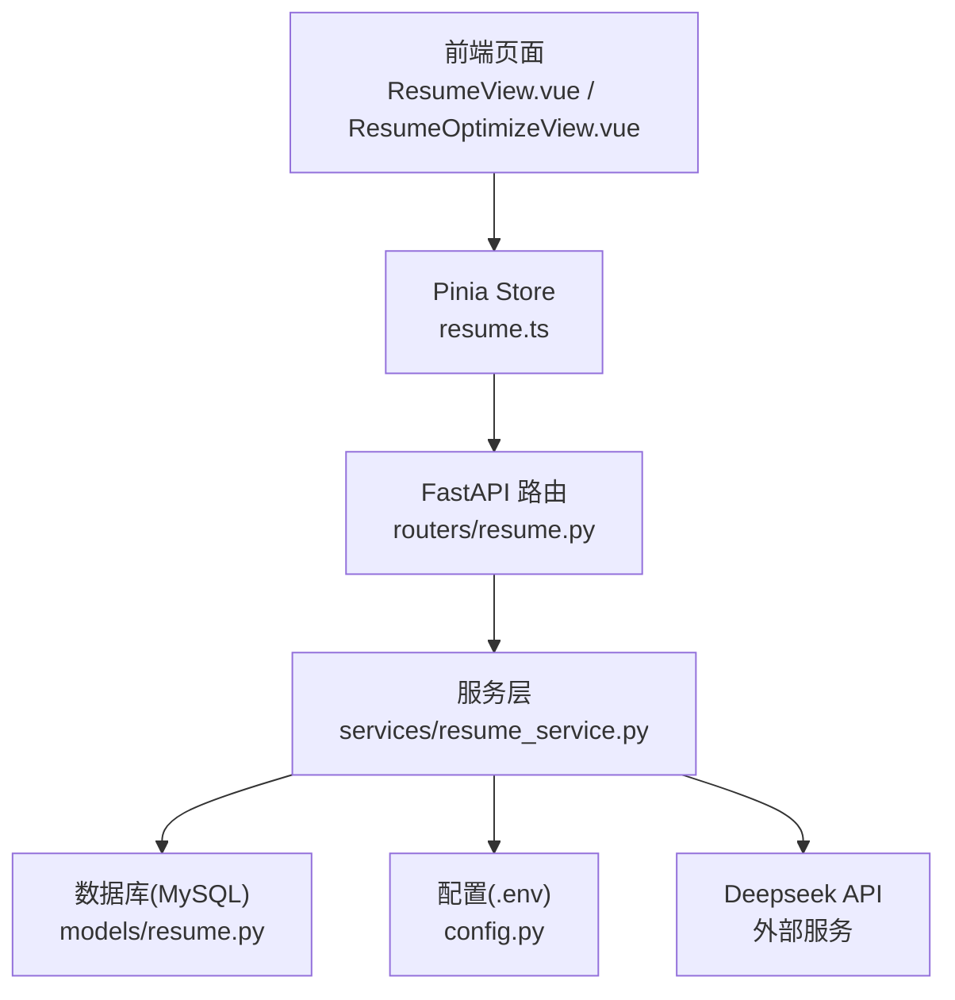
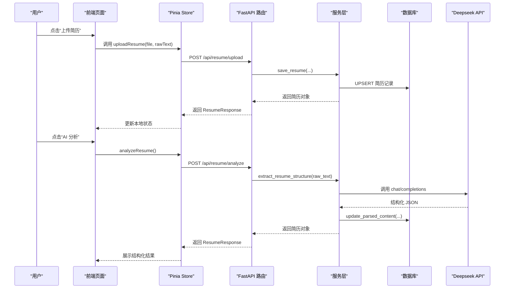
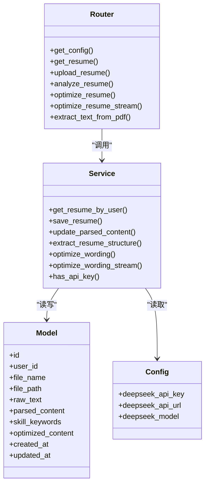

# 简历管理接口

<cite>
**本文引用的文件**   
- [backEnd/app/routers/resume.py](file://backEnd/app/routers/resume.py)
- [backEnd/app/schemas/resume.py](file://backEnd/app/schemas/resume.py)
- [backEnd/app/models/resume.py](file://backEnd/app/models/resume.py)
- [backEnd/app/services/resume_service.py](file://backEnd/app/services/resume_service.py)
- [backEnd/app/config.py](file://backEnd/app/config.py)
- [frontEnd/src/stores/resume.ts](file://frontEnd/src/stores/resume.ts)
- [frontEnd/src/views/ResumeView.vue](file://frontEnd/src/views/ResumeView.vue)
- [frontEnd/src/views/ResumeOptimizeView.vue](file://frontEnd/src/views/ResumeOptimizeView.vue)
</cite>

## 目录
1. [简介](#简介)
2. [项目结构](#项目结构)
3. [核心组件](#核心组件)
4. [架构总览](#架构总览)
5. [详细接口说明](#详细接口说明)
6. [依赖关系分析](#依赖关系分析)
7. [性能与可用性](#性能与可用性)
8. [故障排查指南](#故障排查指南)
9. [结论](#结论)
10. [附录：数据模型与字段定义](#附录数据模型与字段定义)

## 简介
本文件为 HR XF 系统“简历优化服务”的 API 接口文档，覆盖以下能力：
- 简历上传、解析与存储（支持 PDF、Word）
- 智能内容提取（个人信息识别、工作经历解析、技能标签提取、教育背景分析等）
- 简历措辞优化建议生成（含缓存与流式输出）
- 简历预览与导出（PDF 在线预览、Word 下载）
- 版本管理与历史记录查询（当前实现为每用户一条最新简历，提供覆盖更新语义）

## 项目结构
后端采用 FastAPI + SQLAlchemy 异步 ORM，前端使用 Vue 3 + Pinia。简历相关代码主要分布在如下模块：
- 路由层：处理 HTTP 请求与响应
- 服务层：封装业务逻辑与外部 AI 调用
- 模型层：定义数据库表结构与字段
- 配置层：读取 .env 环境变量（如 Deepseek API Key）
- 前端 Store：统一发起 API 请求、维护状态与 SSE 流式处理

图表来源
- [backEnd/app/routers/resume.py:1-215](file://backEnd/app/routers/resume.py#L1-L215)
- [backEnd/app/services/resume_service.py:1-285](file://backEnd/app/services/resume_service.py#L1-L285)
- [backEnd/app/models/resume.py:1-67](file://backEnd/app/models/resume.py#L1-L67)
- [backEnd/app/config.py:1-71](file://backEnd/app/config.py#L1-L71)
- [frontEnd/src/stores/resume.ts:1-244](file://frontEnd/src/stores/resume.ts#L1-L244)
- [frontEnd/src/views/ResumeView.vue:1-530](file://frontEnd/src/views/ResumeView.vue#L1-L530)
- [frontEnd/src/views/ResumeOptimizeView.vue:1-277](file://frontEnd/src/views/ResumeOptimizeView.vue#L1-L277)

章节来源
- [backEnd/app/routers/resume.py:1-215](file://backEnd/app/routers/resume.py#L1-L215)
- [backEnd/app/services/resume_service.py:1-285](file://backEnd/app/services/resume_service.py#L1-L285)
- [backEnd/app/models/resume.py:1-67](file://backEnd/app/models/resume.py#L1-L67)
- [backEnd/app/config.py:1-71](file://backEnd/app/config.py#L1-L71)
- [frontEnd/src/stores/resume.ts:1-244](file://frontEnd/src/stores/resume.ts#L1-L244)
- [frontEnd/src/views/ResumeView.vue:1-530](file://frontEnd/src/views/ResumeView.vue#L1-L530)
- [frontEnd/src/views/ResumeOptimizeView.vue:1-277](file://frontEnd/src/views/ResumeOptimizeView.vue#L1-L277)

## 核心组件
- 路由层
  - 提供简历配置、获取、上传、AI 分析、措辞优化（同步与流式）、PDF 文本提取等接口
- 服务层
  - 封装 CRUD、Deepseek API 调用（结构化提取与措辞优化）、流式解析与缓存写入
- 模型层
  - 定义简历实体与 JSON 字段（结构化结果、技能关键词、优化缓存）
- 配置层
  - 从 .env 加载 Deepseek API Key、URL、模型名等
- 前端 Store
  - 统一封装请求、SSE 流式消费、错误提示与状态管理

章节来源
- [backEnd/app/routers/resume.py:1-215](file://backEnd/app/routers/resume.py#L1-L215)
- [backEnd/app/services/resume_service.py:1-285](file://backEnd/app/services/resume_service.py#L1-L285)
- [backEnd/app/models/resume.py:1-67](file://backEnd/app/models/resume.py#L1-L67)
- [backEnd/app/config.py:1-71](file://backEnd/app/config.py#L1-L71)
- [frontEnd/src/stores/resume.ts:1-244](file://frontEnd/src/stores/resume.ts#L1-L244)

## 架构总览
整体流程：前端通过 Store 调用后端路由；路由校验权限并委托服务层；服务层进行数据库操作或调用 Deepseek API；结果返回给前端渲染。

图表来源
- [backEnd/app/routers/resume.py:47-97](file://backEnd/app/routers/resume.py#L47-L97)
- [backEnd/app/services/resume_service.py:72-177](file://backEnd/app/services/resume_service.py#L72-L177)
- [backEnd/app/models/resume.py:11-67](file://backEnd/app/models/resume.py#L11-L67)
- [frontEnd/src/stores/resume.ts:114-147](file://frontEnd/src/stores/resume.ts#L114-L147)
- [frontEnd/src/views/ResumeView.vue:421-427](file://frontEnd/src/views/ResumeView.vue#L421-L427)

## 详细接口说明

### 通用约定
- 基础路径：/api/resume
- 鉴权：所有接口均要求携带 Bearer Token（Authorization 头），由路由依赖注入校验
- 字符集：UTF-8
- 错误格式：HTTP 状态码 + JSON detail 字段

章节来源
- [backEnd/app/routers/resume.py:1-20](file://backEnd/app/routers/resume.py#L1-L20)
- [frontEnd/src/stores/resume.ts:63-78](file://frontEnd/src/stores/resume.ts#L63-L78)

### 获取配置
- 方法：GET
- 路径：/api/resume/config
- 功能：返回是否已配置 Deepseek API Key
- 成功响应：{ has_api_key: boolean }
- 失败：鉴权失败或内部错误

章节来源
- [backEnd/app/routers/resume.py:25-32](file://backEnd/app/routers/resume.py#L25-L32)
- [backEnd/app/services/resume_service.py:28-29](file://backEnd/app/services/resume_service.py#L28-L29)
- [backEnd/app/config.py:34-37](file://backEnd/app/config.py#L34-L37)
- [frontEnd/src/stores/resume.ts:92-100](file://frontEnd/src/stores/resume.ts#L92-L100)

### 获取当前用户简历
- 方法：GET
- 路径：/api/resume/
- 功能：返回当前用户的最新简历（每用户仅一条）
- 成功响应：ResumeResponse
- 失败：404 表示暂无简历

章节来源
- [backEnd/app/routers/resume.py:35-44](file://backEnd/app/routers/resume.py#L35-L44)
- [backEnd/app/schemas/resume.py:18-28](file://backEnd/app/schemas/resume.py#L18-L28)
- [backEnd/app/models/resume.py:11-67](file://backEnd/app/models/resume.py#L11-L67)
- [frontEnd/src/stores/resume.ts:102-112](file://frontEnd/src/stores/resume.ts#L102-L112)

### 上传/覆盖简历
- 方法：POST
- 路径：/api/resume/upload
- 表单字段：
  - file: 文件（必填）
  - raw_text: 原始文本（可选，若为空则尝试服务端解析）
- 支持格式：
  - PDF：推荐通过前端调用 /api/resume/extract-text 提取文本后上传
  - Word（DOCX）：前端可使用 mammoth 提取文本后上传
- 文件大小限制：前端 UI 提示最大 10MB（实际以服务器配置为准）
- 行为：
  - 保存原始文件到 uploads/resumes
  - 保存/覆盖当前用户简历记录
  - 若已配置 API Key 且提供了 raw_text，自动触发结构化提取并更新 parsed_content 与 skill_keywords
- 成功响应：ResumeResponse
- 失败：400/404/500 等

章节来源
- [backEnd/app/routers/resume.py:47-77](file://backEnd/app/routers/resume.py#L47-L77)
- [backEnd/app/services/resume_service.py:40-83](file://backEnd/app/services/resume_service.py#L40-L83)
- [backEnd/app/models/resume.py:11-67](file://backEnd/app/models/resume.py#L11-L67)
- [frontEnd/src/views/ResumeView.vue:414-458](file://frontEnd/src/views/ResumeView.vue#L414-L458)
- [frontEnd/src/stores/resume.ts:114-135](file://frontEnd/src/stores/resume.ts#L114-L135)

### 手动触发 AI 结构化分析
- 方法：POST
- 路径：/api/resume/analyze
- 功能：对当前用户简历的 raw_text 执行结构化提取，更新 parsed_content 与 skill_keywords
- 前置条件：必须已配置 Deepseek API Key
- 成功响应：ResumeResponse
- 失败：400（未配置 Key）、404（无简历）、500（AI 调用异常）

章节来源
- [backEnd/app/routers/resume.py:80-97](file://backEnd/app/routers/resume.py#L80-L97)
- [backEnd/app/services/resume_service.py:174-177](file://backEnd/app/services/resume_service.py#L174-L177)
- [frontEnd/src/stores/resume.ts:137-147](file://frontEnd/src/stores/resume.ts#L137-L147)
- [frontEnd/src/views/ResumeView.vue:521-528](file://frontEnd/src/views/ResumeView.vue#L521-L528)

### AI 措辞优化（同步）
- 方法：POST
- 路径：/api/resume/optimize
- 功能：基于 raw_text 生成优化对比项与统计信息，命中缓存直接返回
- 成功响应：ResumeOptimizeResponse
- 失败：400（未配置 Key）、404（无简历）、500（AI 调用异常）

章节来源
- [backEnd/app/routers/resume.py:100-137](file://backEnd/app/routers/resume.py#L100-L137)
- [backEnd/app/schemas/resume.py:31-35](file://backEnd/app/schemas/resume.py#L31-L35)
- [backEnd/app/services/resume_service.py:180-183](file://backEnd/app/services/resume_service.py#L180-L183)
- [frontEnd/src/stores/resume.ts:149-159](file://frontEnd/src/stores/resume.ts#L149-L159)

### AI 措辞优化（流式 SSE）
- 方法：POST
- 路径：/api/resume/optimize/stream
- 功能：边生成边推送优化条目与统计，命中缓存则直接推送缓存
- 事件类型：
  - start：连接建立
  - item：单条优化对比（original/optimized）
  - done：完成并附带 stats
- 成功响应：text/event-stream
- 失败：400（未配置 Key）、404（无简历）、500（AI 调用异常）

章节来源
- [backEnd/app/routers/resume.py:140-192](file://backEnd/app/routers/resume.py#L140-L192)
- [backEnd/app/services/resume_service.py:186-284](file://backEnd/app/services/resume_service.py#L186-L284)
- [frontEnd/src/stores/resume.ts:161-207](file://frontEnd/src/stores/resume.ts#L161-L207)
- [frontEnd/src/views/ResumeOptimizeView.vue:215-260](file://frontEnd/src/views/ResumeOptimizeView.vue#L215-L260)

### 服务端 PDF 文本提取
- 方法：POST
- 路径：/api/resume/extract-text
- 表单字段：file（PDF）
- 功能：使用 PyMuPDF 在服务端提取 PDF 文本，避免前端解析差异
- 成功响应：{ raw_text: string }
- 失败：400（非 PDF）、500（解析异常）

章节来源
- [backEnd/app/routers/resume.py:195-214](file://backEnd/app/routers/resume.py#L195-L214)
- [frontEnd/src/stores/resume.ts:209-225](file://frontEnd/src/stores/resume.ts#L209-L225)
- [frontEnd/src/views/ResumeView.vue:414-427](file://frontEnd/src/views/ResumeView.vue#L414-L427)

### 简历预览与导出
- 预览（PDF）：通过 iframe 访问 /api/{file_path} 在线预览
- 导出（Word）：前端构造链接 /api/{file_path} 并触发下载
- 注意：file_path 为相对路径，形如 uploads/resumes/xxx.ext

章节来源
- [backEnd/app/routers/resume.py:56-67](file://backEnd/app/routers/resume.py#L56-L67)
- [frontEnd/src/views/ResumeView.vue:492-519](file://frontEnd/src/views/ResumeView.vue#L492-L519)

### 版本管理与历史记录
- 当前策略：每用户仅保留一条最新简历（user_id 唯一约束）
- 上传新简历将覆盖旧记录，同时清空结构化与优化缓存
- 如需完整历史版本，可在现有模型基础上扩展版本字段与列表接口（当前未实现）

章节来源
- [backEnd/app/models/resume.py:19-25](file://backEnd/app/models/resume.py#L19-L25)
- [backEnd/app/services/resume_service.py:40-69](file://backEnd/app/services/resume_service.py#L40-L69)

## 依赖关系分析
- 路由依赖
  - get_db：异步数据库会话
  - get_current_user：鉴权依赖
- 服务依赖
  - config.get_settings：读取 .env 中的 Deepseek 配置
  - httpx.AsyncClient：调用 Deepseek API（同步与流式）
- 前端依赖
  - fetch/SSE Reader：发起请求与流式消费
  - mammoth：前端 DOCX 文本提取
  - PyMuPDF：后端 PDF 文本提取

图表来源
- [backEnd/app/routers/resume.py:1-215](file://backEnd/app/routers/resume.py#L1-L215)
- [backEnd/app/services/resume_service.py:1-285](file://backEnd/app/services/resume_service.py#L1-L285)
- [backEnd/app/models/resume.py:1-67](file://backEnd/app/models/resume.py#L1-L67)
- [backEnd/app/config.py:1-71](file://backEnd/app/config.py#L1-L71)

章节来源
- [backEnd/app/routers/resume.py:1-215](file://backEnd/app/routers/resume.py#L1-L215)
- [backEnd/app/services/resume_service.py:1-285](file://backEnd/app/services/resume_service.py#L1-L285)
- [backEnd/app/models/resume.py:1-67](file://backEnd/app/models/resume.py#L1-L67)
- [backEnd/app/config.py:1-71](file://backEnd/app/config.py#L1-L71)

## 性能与可用性
- 结构化提取与优化
  - 首次调用会访问外部 LLM，存在网络延迟；后续命中缓存可秒级返回
  - 流式优化提升用户体验，减少首屏等待时间
- 文件处理
  - PDF 文本提取在后端使用 PyMuPDF，稳定性优于前端 pdf.js
  - Word 文本提取在前端使用 mammoth，适合纯文本场景
- 并发与超时
  - 服务层使用 httpx.AsyncClient，设置合理超时（同步 60s，流式 120s）
- 存储
  - 文件落盘至 uploads/resumes，便于预览与下载

[本节为通用指导，不直接分析具体文件]

## 故障排查指南
- 未配置 Deepseek API Key
  - 现象：/api/resume/config 返回 has_api_key=false；分析/优化接口报 400
  - 处理：在 .env 中设置 DEEPSEEK_API_KEY、DEEPSEEK_API_URL、DEEPSEEK_MODEL
- 无简历
  - 现象：GET /api/resume/ 返回 404
  - 处理：先调用上传接口
- PDF 文本提取失败
  - 现象：/api/resume/extract-text 返回 500
  - 处理：检查 PDF 是否损坏或受保护；查看后端日志
- 流式优化中断
  - 现象：前端 SSE 连接断开
  - 处理：检查网络与代理；确认后端 StreamingResponse 正常返回 text/event-stream
- 文件过大
  - 现象：上传失败
  - 处理：遵循前端提示（最大 10MB），必要时调整服务器上传大小限制

章节来源
- [backEnd/app/routers/resume.py:80-97](file://backEnd/app/routers/resume.py#L80-L97)
- [backEnd/app/routers/resume.py:100-137](file://backEnd/app/routers/resume.py#L100-L137)
- [backEnd/app/routers/resume.py:195-214](file://backEnd/app/routers/resume.py#L195-L214)
- [backEnd/app/config.py:34-37](file://backEnd/app/config.py#L34-L37)

## 结论
本服务围绕“上传—解析—优化—预览/导出”的主链路构建，结合 Deepseek 大模型实现结构化提取与措辞优化，并通过缓存与流式输出提升体验。当前版本聚焦于单用户单简历的最新版本管理，未来可扩展多版本历史与模板管理等功能。

[本节为总结性内容，不直接分析具体文件]

## 附录：数据模型与字段定义

### 数据库模型（resumes）
- id：主键 UUID
- user_id：用户 ID（唯一，每用户仅一条）
- file_name：文件名
- file_path：文件相对路径（uploads/resumes/...）
- raw_text：原始文本
- parsed_content：JSON，结构化提取结果
- skill_keywords：JSON，技能关键词数组
- optimized_content：JSON，优化结果缓存
- created_at/updated_at：时间戳

章节来源
- [backEnd/app/models/resume.py:11-67](file://backEnd/app/models/resume.py#L11-L67)

### 结构化提取结果（parsed_content）
- skills：字符串数组
- experiences：对象数组，包含 role、company、period、duration、description
- education：对象数组，包含 school、degree、period
- summary：一句话总结
- score：综合评分（0-100）
- suggestions：建议数组，包含 title、desc、type（warning|success|info）
- skill_categories：分类数组，包含 name、keywords、percent

章节来源
- [backEnd/app/services/resume_service.py:88-113](file://backEnd/app/services/resume_service.py#L88-L113)
- [frontEnd/src/stores/resume.ts:17-51](file://frontEnd/src/stores/resume.ts#L17-L51)

### 优化结果（optimized_content）
- original：原文分段数组，每项包含 text、type=removed
- optimized：优化后分段数组，每项包含 text、type=added
- stats：统计信息，包含 total_optimized、professionalism_improvement、quantified_metrics_added、overall_rating

章节来源
- [backEnd/app/schemas/resume.py:31-35](file://backEnd/app/schemas/resume.py#L31-L35)
- [backEnd/app/services/resume_service.py:115-138](file://backEnd/app/services/resume_service.py#L115-L138)