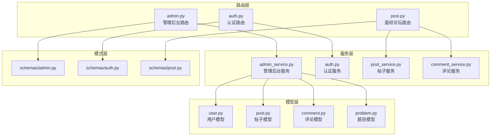
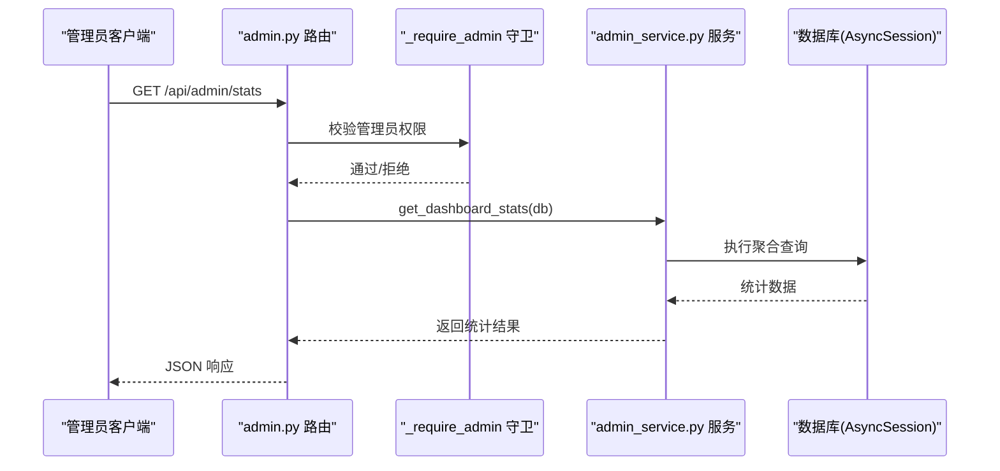
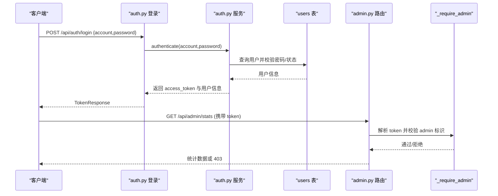
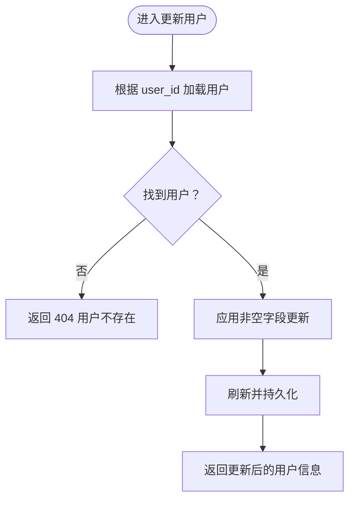
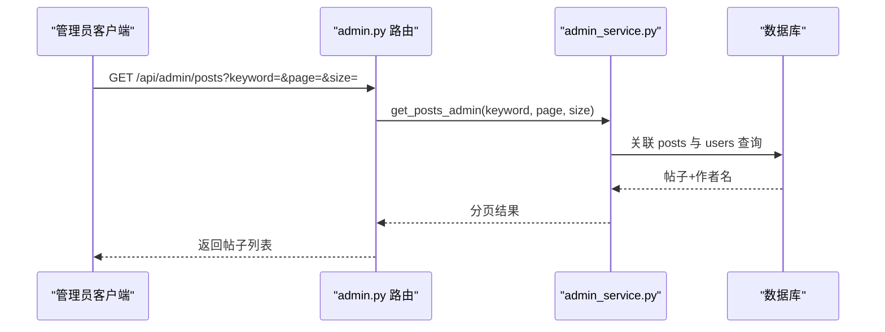
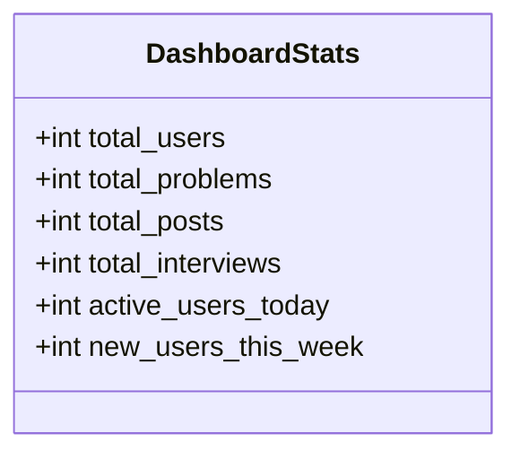
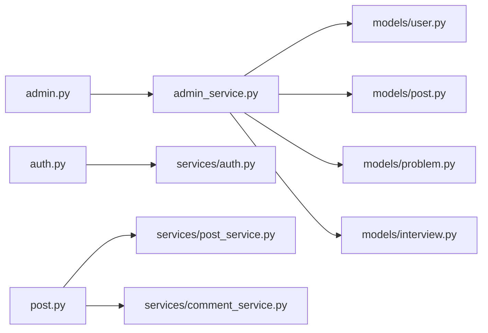

# 管理员接口

<cite>
**本文引用的文件**
- [backEnd/app/routers/admin.py](file://backEnd/app/routers/admin.py)
- [backEnd/app/schemas/admin.py](file://backEnd/app/schemas/admin.py)
- [backEnd/app/services/admin_service.py](file://backEnd/app/services/admin_service.py)
- [backEnd/app/models/user.py](file://backEnd/app/models/user.py)
- [backEnd/app/models/post.py](file://backEnd/app/models/post.py)
- [backEnd/app/models/comment.py](file://backEnd/app/models/comment.py)
- [backEnd/app/routers/auth.py](file://backEnd/app/routers/auth.py)
- [backEnd/app/schemas/auth.py](file://backEnd/app/schemas/auth.py)
- [backEnd/app/services/auth.py](file://backEnd/app/services/auth.py)
- [backEnd/app/routers/post.py](file://backEnd/app/routers/post.py)
- [backEnd/app/schemas/post.py](file://backEnd/app/schemas/post.py)
</cite>

## 目录
1. [简介](#简介)
2. [项目结构](#项目结构)
3. [核心组件](#核心组件)
4. [架构总览](#架构总览)
5. [详细组件分析](#详细组件分析)
6. [依赖关系分析](#依赖关系分析)
7. [性能考虑](#性能考虑)
8. [故障排查指南](#故障排查指南)
9. [结论](#结论)
10. [附录](#附录)

## 简介
本文件为 HR XF 系统“管理后台”的 API 接口文档，聚焦以下能力：
- 管理员登录认证与权限校验流程
- 用户管理（查看、编辑、禁用、删除）
- 内容审核（帖子列表与删除；评论管理能力说明）
- 数据统计与分析（仪表盘指标）
- 题目管理（创建、更新、删除、分页查询）
- 日志查询与监控告警（当前未实现）
- 数据备份与恢复（当前未实现）
- 管理员角色分级与操作审计（当前未实现）

说明：
- 已实现的接口以实际代码为准。
- 未实现的接口在文档中明确标注“暂未实现”，并给出建议设计方向。

## 项目结构
后端采用 FastAPI + SQLAlchemy 异步 ORM 的分层架构：
- routers：HTTP 路由定义（控制器）
- services：业务逻辑封装（服务层）
- schemas：请求/响应模型（Pydantic）
- models：数据库实体（SQLAlchemy）
- utils：安全工具（JWT、密码哈希等）

图表来源
- [backEnd/app/routers/admin.py:1-198](file://backEnd/app/routers/admin.py#L1-L198)
- [backEnd/app/services/admin_service.py:1-224](file://backEnd/app/services/admin_service.py#L1-L224)
- [backEnd/app/models/user.py:1-45](file://backEnd/app/models/user.py#L1-L45)
- [backEnd/app/models/post.py:1-65](file://backEnd/app/models/post.py#L1-L65)
- [backEnd/app/models/comment.py:1-53](file://backEnd/app/models/comment.py#L1-L53)
- [backEnd/app/models/problem.py:1-88](file://backEnd/app/models/problem.py#L1-L88)
- [backEnd/app/schemas/admin.py:1-123](file://backEnd/app/schemas/admin.py#L1-L123)
- [backEnd/app/schemas/auth.py:1-119](file://backEnd/app/schemas/auth.py#L1-L119)
- [backEnd/app/schemas/post.py:1-91](file://backEnd/app/schemas/post.py#L1-L91)

章节来源
- [backEnd/app/routers/admin.py:1-198](file://backEnd/app/routers/admin.py#L1-L198)
- [backEnd/app/services/admin_service.py:1-224](file://backEnd/app/services/admin_service.py#L1-L224)
- [backEnd/app/models/user.py:1-45](file://backEnd/app/models/user.py#L1-L45)
- [backEnd/app/models/post.py:1-65](file://backEnd/app/models/post.py#L1-L65)
- [backEnd/app/models/comment.py:1-53](file://backEnd/app/models/comment.py#L1-L53)
- [backEnd/app/models/problem.py:1-88](file://backEnd/app/models/problem.py#L1-L88)
- [backEnd/app/schemas/admin.py:1-123](file://backEnd/app/schemas/admin.py#L1-L123)
- [backEnd/app/schemas/auth.py:1-119](file://backEnd/app/schemas/auth.py#L1-L119)
- [backEnd/app/schemas/post.py:1-91](file://backEnd/app/schemas/post.py#L1-L91)

## 核心组件
- 管理员鉴权守卫：基于当前用户的邮箱或用户名包含“admin”进行简易权限判断。
- 仪表盘统计：聚合用户、题目、帖子、面试会话数量及活跃/新增用户数。
- 用户管理：分页查询、按关键字搜索、启用/禁用、昵称修改、删除。
- 题目管理：分页查询、筛选难度、创建、更新、删除。
- 帖子管理：分页查询、关键字搜索、删除。
- 评论管理：提供评论列表接口（公开），但管理端评论删除/审核接口暂未实现。

章节来源
- [backEnd/app/routers/admin.py:24-34](file://backEnd/app/routers/admin.py#L24-L34)
- [backEnd/app/services/admin_service.py:14-42](file://backEnd/app/services/admin_service.py#L14-L42)
- [backEnd/app/services/admin_service.py:47-101](file://backEnd/app/services/admin_service.py#L47-L101)
- [backEnd/app/services/admin_service.py:106-170](file://backEnd/app/services/admin_service.py#L106-L170)
- [backEnd/app/services/admin_service.py:175-223](file://backEnd/app/services/admin_service.py#L175-L223)
- [backEnd/app/routers/post.py:201-215](file://backEnd/app/routers/post.py#L201-L215)

## 架构总览
管理后台整体调用链：客户端 -> 路由层 -> 服务层 -> 数据库模型。

图表来源
- [backEnd/app/routers/admin.py:39-46](file://backEnd/app/routers/admin.py#L39-L46)
- [backEnd/app/services/admin_service.py:14-42](file://backEnd/app/services/admin_service.py#L14-L42)

## 详细组件分析

### 管理员登录与权限验证
- 登录流程：使用通用认证接口获取 JWT，后续访问管理接口需携带该令牌。
- 权限判定：在管理路由中使用自定义守卫，检查当前用户邮箱或用户名是否包含“admin”。

图表来源
- [backEnd/app/routers/auth.py:69-80](file://backEnd/app/routers/auth.py#L69-L80)
- [backEnd/app/services/auth.py:85-96](file://backEnd/app/services/auth.py#L85-L96)
- [backEnd/app/routers/admin.py:26-34](file://backEnd/app/routers/admin.py#L26-L34)

章节来源
- [backEnd/app/routers/auth.py:69-80](file://backEnd/app/routers/auth.py#L69-L80)
- [backEnd/app/services/auth.py:85-96](file://backEnd/app/services/auth.py#L85-L96)
- [backEnd/app/routers/admin.py:26-34](file://backEnd/app/routers/admin.py#L26-L34)

### 用户管理接口
- 列出用户
  - 方法路径：GET /api/admin/users
  - 查询参数：keyword（用户名/邮箱/昵称）、page、size
  - 响应：分页的用户列表与总数
- 更新用户
  - 方法路径：PUT /api/admin/users/{user_id}
  - 请求体：is_active（启用/禁用）、nickname（昵称）
  - 行为：仅更新非空字段
- 删除用户
  - 方法路径：DELETE /api/admin/users/{user_id}
  - 保护：禁止删除自己
  - 响应：成功消息

图表来源
- [backEnd/app/services/admin_service.py:75-91](file://backEnd/app/services/admin_service.py#L75-L91)
- [backEnd/app/routers/admin.py:70-83](file://backEnd/app/routers/admin.py#L70-L83)

章节来源
- [backEnd/app/routers/admin.py:50-99](file://backEnd/app/routers/admin.py#L50-L99)
- [backEnd/app/services/admin_service.py:47-101](file://backEnd/app/services/admin_service.py#L47-L101)
- [backEnd/app/schemas/admin.py:21-43](file://backEnd/app/schemas/admin.py#L21-L43)

### 内容审核（帖子与评论）
- 帖子管理
  - 列出帖子：GET /api/admin/posts（支持 keyword、分页）
  - 删除帖子：DELETE /api/admin/posts/{post_id}
- 评论管理
  - 公开接口：GET /api/posts/{post_id}/comments（评论列表）
  - 管理端评论删除/审核：暂未实现

图表来源
- [backEnd/app/routers/admin.py:167-184](file://backEnd/app/routers/admin.py#L167-L184)
- [backEnd/app/services/admin_service.py:175-213](file://backEnd/app/services/admin_service.py#L175-L213)

章节来源
- [backEnd/app/routers/admin.py:167-197](file://backEnd/app/routers/admin.py#L167-L197)
- [backEnd/app/services/admin_service.py:175-223](file://backEnd/app/services/admin_service.py#L175-L223)
- [backEnd/app/routers/post.py:201-215](file://backEnd/app/routers/post.py#L201-L215)

### 数据统计与分析（仪表盘）
- 接口：GET /api/admin/stats
- 指标：
  - total_users：用户总数
  - total_problems：题目总数
  - total_posts：帖子总数
  - total_interviews：面试会话总数
  - active_users_today：当日新增用户（作为活跃度代理）
  - new_users_this_week：本周新增用户

图表来源
- [backEnd/app/schemas/admin.py:7-16](file://backEnd/app/schemas/admin.py#L7-L16)
- [backEnd/app/services/admin_service.py:14-42](file://backEnd/app/services/admin_service.py#L14-L42)

章节来源
- [backEnd/app/routers/admin.py:39-46](file://backEnd/app/routers/admin.py#L39-L46)
- [backEnd/app/services/admin_service.py:14-42](file://backEnd/app/services/admin_service.py#L14-L42)
- [backEnd/app/schemas/admin.py:7-16](file://backEnd/app/schemas/admin.py#L7-L16)

### 题目管理接口
- 列出题目：GET /api/admin/problems（支持 keyword、difficulty、分页）
- 创建题目：POST /api/admin/problems
- 更新题目：PUT /api/admin/problems/{problem_id}
- 删除题目：DELETE /api/admin/problems/{problem_id}

章节来源
- [backEnd/app/routers/admin.py:104-162](file://backEnd/app/routers/admin.py#L104-L162)
- [backEnd/app/services/admin_service.py:106-170](file://backEnd/app/services/admin_service.py#L106-L170)
- [backEnd/app/schemas/admin.py:47-98](file://backEnd/app/schemas/admin.py#L47-L98)

### 日志查询与监控告警（暂未实现）
- 现状：仓库中未发现日志查询与监控告警相关路由或服务。
- 建议设计：
  - 日志查询：GET /api/admin/logs（支持时间范围、级别、模块、关键字过滤）
  - 告警规则：POST/PUT/DELETE /api/admin/alerts（阈值、通知渠道、生效状态）
  - 指标采集：定时任务收集 CPU/内存/队列长度等，暴露 GET /api/admin/metrics

[本节为概念性说明，不直接分析具体文件]

### 数据备份与恢复（暂未实现）
- 现状：仓库中未发现备份/恢复相关路由或服务。
- 建议设计：
  - 触发备份：POST /api/admin/backup（可选增量/全量）
  - 下载备份：GET /api/admin/backup/{id}
  - 恢复数据：POST /api/admin/restore（含校验与回滚策略）
  - 备份历史：GET /api/admin/backup/history

[本节为概念性说明，不直接分析具体文件]

### 管理员角色分级与操作审计（暂未实现）
- 现状：当前管理员判定为“邮箱或用户名包含 admin”的简单规则，无细粒度权限与审计。
- 建议设计：
  - 角色与权限：引入 RBAC（角色、资源、动作），如 admin/editor/moderator
  - 操作审计：记录关键操作的主体、对象、时间、IP、变更前后值
  - 审计查询：GET /api/admin/audit（支持按操作类型、时间范围、目标对象过滤）

[本节为概念性说明，不直接分析具体文件]

## 依赖关系分析
- 路由与服务耦合：admin 路由强依赖 admin_service；认证路由依赖 auth 服务。
- 模型依赖：admin_service 对 User、Post、Problem、InterviewSession 进行聚合查询。
- 外部依赖：FastAPI、SQLAlchemy 异步驱动、Pydantic 模型校验。

图表来源
- [backEnd/app/routers/admin.py:1-198](file://backEnd/app/routers/admin.py#L1-L198)
- [backEnd/app/services/admin_service.py:1-224](file://backEnd/app/services/admin_service.py#L1-L224)
- [backEnd/app/models/user.py:1-45](file://backEnd/app/models/user.py#L1-L45)
- [backEnd/app/models/post.py:1-65](file://backEnd/app/models/post.py#L1-L65)
- [backEnd/app/models/problem.py:1-88](file://backEnd/app/models/problem.py#L1-L88)
- [backEnd/app/models/interview.py:1-114](file://backEnd/app/models/interview.py#L1-L114)

章节来源
- [backEnd/app/routers/admin.py:1-198](file://backEnd/app/routers/admin.py#L1-L198)
- [backEnd/app/services/admin_service.py:1-224](file://backEnd/app/services/admin_service.py#L1-L224)
- [backEnd/app/models/user.py:1-45](file://backEnd/app/models/user.py#L1-L45)
- [backEnd/app/models/post.py:1-65](file://backEnd/app/models/post.py#L1-L65)
- [backEnd/app/models/problem.py:1-88](file://backEnd/app/models/problem.py#L1-L88)
- [backEnd/app/models/interview.py:1-114](file://backEnd/app/models/interview.py#L1-L114)

## 性能考虑
- 分页与索引：用户、帖子、题目均支持分页，建议在常用过滤字段（如 created_at、status、difficulty）建立索引以提升查询性能。
- 聚合统计：仪表盘统计使用 count 聚合，避免拉取全量数据；可考虑缓存热点指标（如每日统计）。
- 连接池：异步 Session 应合理配置连接池大小，避免在高并发下阻塞。
- 大文本字段：帖子内容与评论为 Text 类型，列表接口应避免返回全文，按需加载详情。

[本节为通用指导，不直接分析具体文件]

## 故障排查指南
- 403 无管理员权限：确认当前用户邮箱或用户名是否包含“admin”，且已成功登录并携带有效 token。
- 404 资源不存在：检查用户/帖子/题目 ID 是否正确，或确认资源已被删除。
- 400 自删保护：尝试删除自己的账号会失败，请使用其他管理员账号操作。
- 认证失败：检查账号是否存在、密码是否正确、账号是否被禁用（is_active=false）。

章节来源
- [backEnd/app/routers/admin.py:26-34](file://backEnd/app/routers/admin.py#L26-L34)
- [backEnd/app/routers/admin.py:86-99](file://backEnd/app/routers/admin.py#L86-L99)
- [backEnd/app/services/auth.py:85-96](file://backEnd/app/services/auth.py#L85-L96)

## 结论
HR XF 管理后台已实现基础的管理能力：管理员鉴权、用户管理、帖子与题目管理、仪表盘统计。评论管理仅提供公开列表，尚未提供管理端的审核与删除能力。日志、监控、备份恢复、RBAC 与审计等高级功能暂未实现，可按建议逐步扩展。

[本节为总结性内容，不直接分析具体文件]

## 附录

### 接口清单（管理后台）
- 认证与鉴权
  - POST /api/auth/login
  - GET /api/admin/stats（需管理员）
- 用户管理
  - GET /api/admin/users
  - PUT /api/admin/users/{user_id}
  - DELETE /api/admin/users/{user_id}
- 题目管理
  - GET /api/admin/problems
  - POST /api/admin/problems
  - PUT /api/admin/problems/{problem_id}
  - DELETE /api/admin/problems/{problem_id}
- 帖子管理
  - GET /api/admin/posts
  - DELETE /api/admin/posts/{post_id}
- 评论管理（公开）
  - GET /api/posts/{post_id}/comments

章节来源
- [backEnd/app/routers/auth.py:69-80](file://backEnd/app/routers/auth.py#L69-L80)
- [backEnd/app/routers/admin.py:39-197](file://backEnd/app/routers/admin.py#L39-L197)
- [backEnd/app/routers/post.py:201-215](file://backEnd/app/routers/post.py#L201-L215)