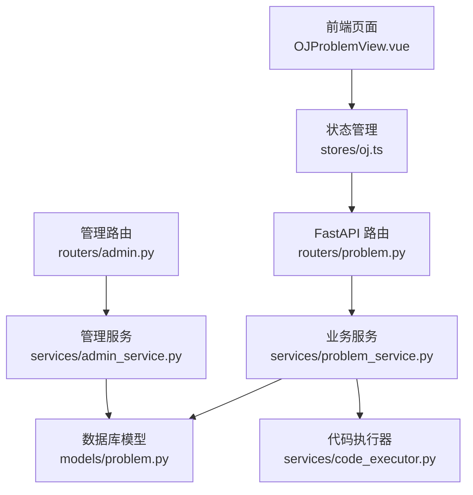
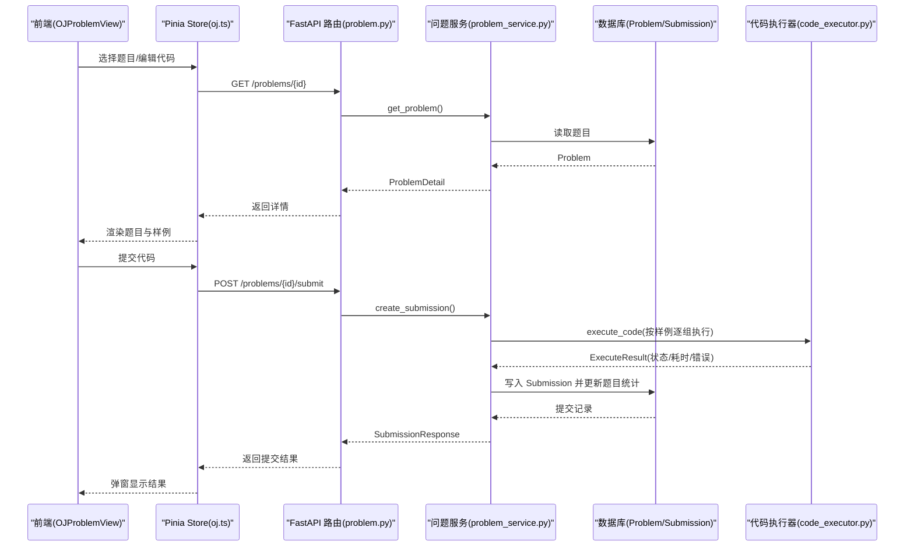
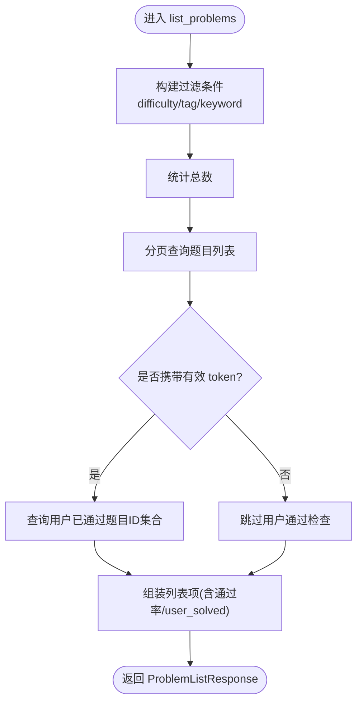
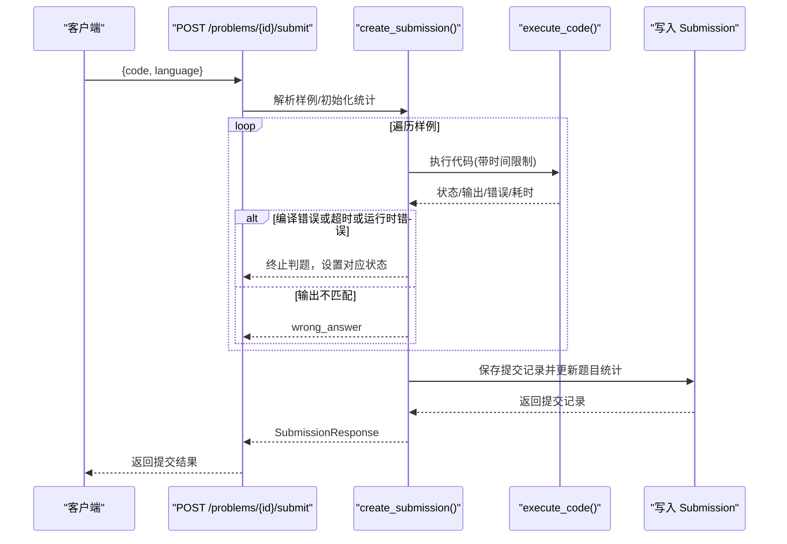
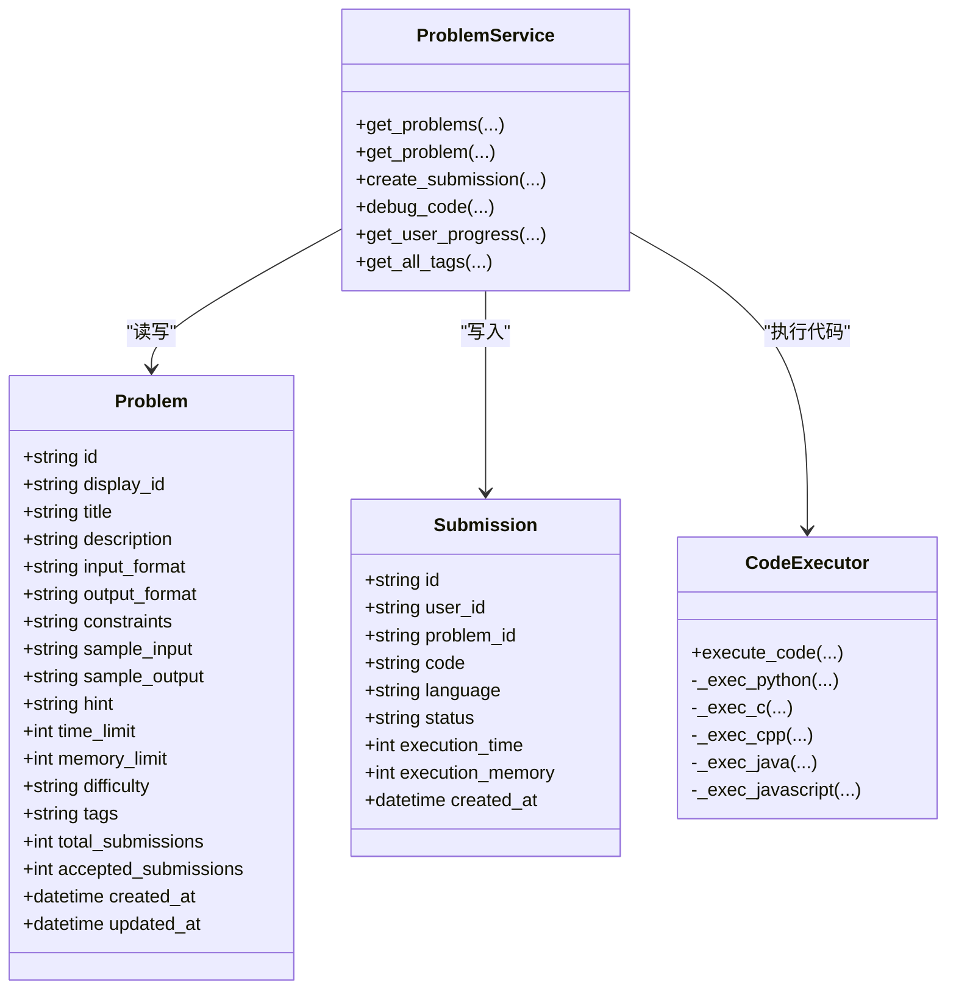

# 编程题目接口

<cite>
**本文引用的文件**   
- [backEnd/app/routers/problem.py](file://backEnd/app/routers/problem.py)
- [backEnd/app/schemas/problem.py](file://backEnd/app/schemas/problem.py)
- [backEnd/app/models/problem.py](file://backEnd/app/models/problem.py)
- [backEnd/app/services/problem_service.py](file://backEnd/app/services/problem_service.py)
- [backEnd/app/services/code_executor.py](file://backEnd/app/services/code_executor.py)
- [backEnd/app/routers/admin.py](file://backEnd/app/routers/admin.py)
- [backEnd/app/schemas/admin.py](file://backEnd/app/schemas/admin.py)
- [backEnd/app/services/admin_service.py](file://backEnd/app/services/admin_service.py)
- [frontEnd/src/views/OJProblemView.vue](file://frontEnd/src/views/OJProblemView.vue)
- [frontEnd/src/stores/oj.ts](file://frontEnd/src/stores/oj.ts)
</cite>

## 目录
1. [简介](#简介)
2. [项目结构](#项目结构)
3. [核心组件](#核心组件)
4. [架构总览](#架构总览)
5. [详细组件分析](#详细组件分析)
6. [依赖关系分析](#依赖关系分析)
7. [性能与安全考量](#性能与安全考量)
8. [故障排查指南](#故障排查指南)
9. [结论](#结论)
10. [附录：API 规范与数据模型](#附录api-规范与数据模型)

## 简介
本文件为 HR XF 系统在线编程平台（OJ）的“编程题目接口”完整文档，覆盖以下能力：
- 题目的浏览、搜索、筛选（难度、标签、关键词）、分页
- 题目详情获取（含通过率、样例、限制等）
- 代码提交与判题流程（多语言支持、沙箱安全机制、执行结果返回格式）
- 测试用例验证流程（输入输出对比、性能指标统计、内存使用监控）
- 提交记录查询与管理（历史提交、通过率统计、用户进度）
- 代码编辑器集成与实时调试
- 题目管理的后台接口与批量操作能力

## 项目结构
后端采用 FastAPI + SQLAlchemy 异步 ORM，前端基于 Vue 3 + Pinia。与 OJ 相关的核心模块如下：
- 路由层：/api/problems 提供题目相关 API；/api/admin 提供管理端题目管理
- 服务层：problem_service 封装业务逻辑（列表、详情、提交、调试、进度统计）
- 执行器：code_executor 负责代码编译/运行、安全拦截、超时控制
- 数据模型：Problem、Submission 定义数据库表结构与关系
- 前端：OJProblemView 展示题目与编辑器，oj.ts 封装 API 调用

图表来源
- [backEnd/app/routers/problem.py:1-175](file://backEnd/app/routers/problem.py#L1-L175)
- [backEnd/app/services/problem_service.py:1-442](file://backEnd/app/services/problem_service.py#L1-L442)
- [backEnd/app/services/code_executor.py:1-444](file://backEnd/app/services/code_executor.py#L1-L444)
- [backEnd/app/models/problem.py:1-88](file://backEnd/app/models/problem.py#L1-L88)
- [backEnd/app/routers/admin.py:1-198](file://backEnd/app/routers/admin.py#L1-L198)
- [backEnd/app/services/admin_service.py:1-224](file://backEnd/app/services/admin_service.py#L1-L224)
- [frontEnd/src/views/OJProblemView.vue:1-500](file://frontEnd/src/views/OJProblemView.vue#L1-L500)
- [frontEnd/src/stores/oj.ts:1-268](file://frontEnd/src/stores/oj.ts#L1-L268)

章节来源
- [backEnd/app/routers/problem.py:1-175](file://backEnd/app/routers/problem.py#L1-L175)
- [backEnd/app/services/problem_service.py:1-442](file://backEnd/app/services/problem_service.py#L1-L442)
- [backEnd/app/services/code_executor.py:1-444](file://backEnd/app/services/code_executor.py#L1-L444)
- [backEnd/app/models/problem.py:1-88](file://backEnd/app/models/problem.py#L1-L88)
- [backEnd/app/routers/admin.py:1-198](file://backEnd/app/routers/admin.py#L1-L198)
- [backEnd/app/services/admin_service.py:1-224](file://backEnd/app/services/admin_service.py#L1-L224)
- [frontEnd/src/views/OJProblemView.vue:1-500](file://frontEnd/src/views/OJProblemView.vue#L1-L500)
- [frontEnd/src/stores/oj.ts:1-268](file://frontEnd/src/stores/oj.ts#L1-L268)

## 核心组件
- 路由层
  - GET /api/problems：题目列表（支持难度、标签、关键词、分页）
  - GET /api/problems/tags/options：获取所有可选标签
  - GET /api/problems/{id}：题目详情
  - POST /api/problems/{id}/submit：提交代码并判题
  - POST /api/problems/{id}/debug：调试代码（仅执行，不持久化）
  - GET /api/problems/progress：用户进度统计
- 服务层
  - 列表/详情构建、提交判题、调试执行、进度统计、标签聚合
- 执行器
  - 多语言执行（Python3/C/C++/Java/JavaScript），安全黑名单拦截，子进程隔离，超时控制
- 数据模型
  - Problem：题目元数据、样例、限制、通过率统计
  - Submission：用户提交记录、状态、耗时、内存占用
- 管理端
  - /api/admin/problems：题目 CRUD（创建、更新、删除、分页查询）

章节来源
- [backEnd/app/routers/problem.py:47-175](file://backEnd/app/routers/problem.py#L47-L175)
- [backEnd/app/services/problem_service.py:24-442](file://backEnd/app/services/problem_service.py#L24-L442)
- [backEnd/app/services/code_executor.py:270-444](file://backEnd/app/services/code_executor.py#L270-L444)
- [backEnd/app/models/problem.py:17-88](file://backEnd/app/models/problem.py#L17-L88)
- [backEnd/app/routers/admin.py:104-163](file://backEnd/app/routers/admin.py#L104-L163)
- [backEnd/app/services/admin_service.py:104-171](file://backEnd/app/services/admin_service.py#L104-L171)

## 架构总览
下图展示了从前端到后端的请求链路，以及判题执行的安全沙箱流程。

图表来源
- [backEnd/app/routers/problem.py:102-151](file://backEnd/app/routers/problem.py#L102-L151)
- [backEnd/app/services/problem_service.py:95-179](file://backEnd/app/services/problem_service.py#L95-L179)
- [backEnd/app/services/code_executor.py:270-340](file://backEnd/app/services/code_executor.py#L270-L340)
- [backEnd/app/models/problem.py:57-88](file://backEnd/app/models/problem.py#L57-L88)
- [frontEnd/src/views/OJProblemView.vue:378-416](file://frontEnd/src/views/OJProblemView.vue#L378-L416)
- [frontEnd/src/stores/oj.ts:181-198](file://frontEnd/src/stores/oj.ts#L181-L198)

## 详细组件分析

### 题目浏览与筛选接口
- 接口
  - GET /api/problems
    - 查询参数
      - difficulty: easy|medium|hard（可选）
      - tag: 字符串（模糊匹配 tags 字段）
      - keyword: 标题或描述模糊匹配
      - page: 页码（默认 1）
      - size: 每页条数（默认 20，最大 100）
    - 响应体
      - problems: 列表项数组（包含 id、display_id、title、difficulty、tags、total_submissions、accepted_submissions、acceptance_rate、user_solved）
      - total/page/size
  - GET /api/problems/tags/options
    - 响应体
      - tags: 字符串数组（从题目 tags 字段解析去重排序）
- 实现要点
  - 列表查询通过 SQL 条件组合（难度精确匹配、标签模糊匹配、关键词对标题/描述模糊匹配）
  - 若携带认证 token，会额外查询当前用户已通过的题目 ID 集合，用于填充 user_solved 标记
  - 通过率计算：accepted_submissions / total_submissions * 100（保留一位小数）

图表来源
- [backEnd/app/routers/problem.py:47-83](file://backEnd/app/routers/problem.py#L47-L83)
- [backEnd/app/services/problem_service.py:24-64](file://backEnd/app/services/problem_service.py#L24-L64)
- [backEnd/app/services/problem_service.py:387-407](file://backEnd/app/services/problem_service.py#L387-L407)

章节来源
- [backEnd/app/routers/problem.py:47-90](file://backEnd/app/routers/problem.py#L47-L90)
- [backEnd/app/services/problem_service.py:24-64](file://backEnd/app/services/problem_service.py#L24-L64)
- [backEnd/app/services/problem_service.py:370-381](file://backEnd/app/services/problem_service.py#L370-L381)
- [backEnd/app/services/problem_service.py:387-407](file://backEnd/app/services/problem_service.py#L387-L407)

### 题目详情接口
- 接口
  - GET /api/problems/{problem_id}
  - 响应体
    - 包含题目描述、输入/输出格式、约束、样例、提示、时间/内存限制、难度、标签、通过率、用户是否已通过、创建/更新时间等
- 实现要点
  - 根据 problem_id 查询题目
  - 若携带 token，则判断该用户是否已通过本题

章节来源
- [backEnd/app/routers/problem.py:102-118](file://backEnd/app/routers/problem.py#L102-L118)
- [backEnd/app/services/problem_service.py:67-80](file://backEnd/app/services/problem_service.py#L67-L80)
- [backEnd/app/services/problem_service.py:410-441](file://backEnd/app/services/problem_service.py#L410-L441)

### 代码提交与判题接口
- 接口
  - POST /api/problems/{problem_id}/submit
  - 请求体
    - code: 提交的代码文本
    - language: 编程语言（python3/python/c/cpp/java/javascript）
  - 响应体
    - id、problem_id、code、language、status、execution_time、execution_memory、error_detail、created_at
- 判题流程
  - 解析题目样例输入/输出（JSON 数组）
  - 对每组样例依次执行代码，比较输出（统一换行符、去除首尾空白、逐行对比）
  - 状态判定优先级：编译错误 > 超时 > 运行时错误 > 答案正确性
  - 将提交记录写入数据库，并更新题目总提交数与通过数
- 支持语言
  - Python3、C、C++、Java、JavaScript
- 安全机制
  - 危险关键词黑名单（跨语言通用 + 各语言特定模式）
  - 子进程隔离执行，临时目录隔离，超时控制
  - 编译器路径可配置，未找到时回退 PATH 检测

图表来源
- [backEnd/app/routers/problem.py:121-151](file://backEnd/app/routers/problem.py#L121-L151)
- [backEnd/app/services/problem_service.py:95-179](file://backEnd/app/services/problem_service.py#L95-L179)
- [backEnd/app/services/code_executor.py:270-340](file://backEnd/app/services/code_executor.py#L270-L340)
- [backEnd/app/models/problem.py:57-88](file://backEnd/app/models/problem.py#L57-L88)

章节来源
- [backEnd/app/routers/problem.py:121-151](file://backEnd/app/routers/problem.py#L121-L151)
- [backEnd/app/services/problem_service.py:95-179](file://backEnd/app/services/problem_service.py#L95-L179)
- [backEnd/app/services/code_executor.py:154-167](file://backEnd/app/services/code_executor.py#L154-L167)
- [backEnd/app/services/code_executor.py:270-340](file://backEnd/app/services/code_executor.py#L270-L340)
- [backEnd/app/models/problem.py:57-88](file://backEnd/app/models/problem.py#L57-L88)

### 调试接口（实时运行）
- 接口
  - POST /api/problems/{problem_id}/debug
  - 请求体
    - code、language、input_data（自定义输入，默认空）
  - 响应体
    - stdout、stderr、exit_code、execution_time、status
- 用途
  - 在编辑器中快速运行代码，查看标准输出/错误与执行状态，便于调试
- 前端集成
  - 使用题目第一组样例作为默认输入，展示执行时间与状态

章节来源
- [backEnd/app/routers/problem.py:154-175](file://backEnd/app/routers/problem.py#L154-L175)
- [backEnd/app/services/problem_service.py:182-201](file://backEnd/app/services/problem_service.py#L182-L201)
- [frontEnd/src/views/OJProblemView.vue:418-459](file://frontEnd/src/views/OJProblemView.vue#L418-L459)
- [frontEnd/src/stores/oj.ts:200-218](file://frontEnd/src/stores/oj.ts#L200-L218)

### 用户进度与提交记录
- 接口
  - GET /api/problems/progress（需登录）
  - 响应体
    - total_submissions、total_accepted、total_problems_attempted、total_problems_solved
    - by_difficulty：按难度统计（总题数/已解决/已尝试）
    - by_tag：按标签统计（总题数/已解决）
    - recent_submissions：最近提交记录（最多 10 条）
- 提交记录查询
  - 服务层提供 get_user_submissions(user_id, problem_id?, limit=20)，供内部使用
- 通过率统计
  - 题目维度：accepted_submissions / total_submissions
  - 用户维度：by_difficulty/by_tag 中的 solved/total 比例

章节来源
- [backEnd/app/routers/problem.py:93-99](file://backEnd/app/routers/problem.py#L93-L99)
- [backEnd/app/services/problem_service.py:249-367](file://backEnd/app/services/problem_service.py#L249-L367)
- [backEnd/app/services/problem_service.py:204-223](file://backEnd/app/services/problem_service.py#L204-L223)
- [backEnd/app/services/problem_service.py:387-407](file://backEnd/app/services/problem_service.py#L387-L407)

### 代码编辑器集成与实时调试
- 编辑器
  - 前端使用 textarea 作为简易编辑器，内置多语言模板占位符
  - 支持切换语言（python3/c/cpp/java/javascript）
- 调试
  - 点击“运行”调用 debug 接口，自动取第一组样例输入
  - 展示 stdout/stderr、执行时间、状态
- 提交
  - 点击“提交代码”调用 submit 接口，弹窗显示结果（通过/失败及错误详情）
  - 首次通过后本地缓存代码片段，下次打开自动恢复

章节来源
- [frontEnd/src/views/OJProblemView.vue:161-222](file://frontEnd/src/views/OJProblemView.vue#L161-L222)
- [frontEnd/src/views/OJProblemView.vue:378-416](file://frontEnd/src/views/OJProblemView.vue#L378-L416)
- [frontEnd/src/views/OJProblemView.vue:418-459](file://frontEnd/src/views/OJProblemView.vue#L418-L459)
- [frontEnd/src/stores/oj.ts:181-218](file://frontEnd/src/stores/oj.ts#L181-L218)

### 题目管理后台接口
- 鉴权
  - 管理员校验：用户名或邮箱包含 “admin”
- 接口
  - GET /api/admin/problems：分页+搜索（标题/display_id）、难度筛选
  - POST /api/admin/problems：创建题目
  - PUT /api/admin/problems/{id}：更新题目
  - DELETE /api/admin/problems/{id}：删除题目
- 说明
  - 创建/更新字段包括 display_id、title、description、input_format、output_format、constraints、sample_input、sample_output、hint、time_limit、memory_limit、difficulty、tags
  - 列表返回基础信息（id、display_id、title、difficulty、tags、提交统计、创建时间）

章节来源
- [backEnd/app/routers/admin.py:104-163](file://backEnd/app/routers/admin.py#L104-L163)
- [backEnd/app/services/admin_service.py:104-171](file://backEnd/app/services/admin_service.py#L104-L171)
- [backEnd/app/schemas/admin.py:47-98](file://backEnd/app/schemas/admin.py#L47-L98)

## 依赖关系分析
- 路由与服务
  - routers/problem.py 依赖 services/problem_service.py 完成业务编排
  - routers/admin.py 依赖 services/admin_service.py 完成管理端逻辑
- 服务与模型
  - problem_service.py 使用 models/problem.py 的 Problem、Submission 进行读写
  - admin_service.py 同样访问 Problem 模型
- 服务与执行器
  - problem_service.py 调用 services/code_executor.py 执行代码
- 前端与后端
  - OJProblemView.vue 通过 stores/oj.ts 发起 HTTP 请求至 /api/problems 与 /api/admin

图表来源
- [backEnd/app/models/problem.py:17-88](file://backEnd/app/models/problem.py#L17-L88)
- [backEnd/app/services/problem_service.py:24-442](file://backEnd/app/services/problem_service.py#L24-L442)
- [backEnd/app/services/code_executor.py:270-444](file://backEnd/app/services/code_executor.py#L270-L444)

章节来源
- [backEnd/app/models/problem.py:17-88](file://backEnd/app/models/problem.py#L17-L88)
- [backEnd/app/services/problem_service.py:24-442](file://backEnd/app/services/problem_service.py#L24-L442)
- [backEnd/app/services/code_executor.py:270-444](file://backEnd/app/services/code_executor.py#L270-L444)

## 性能与安全考量
- 性能
  - 列表查询使用索引字段（display_id、difficulty）提升检索效率
  - 分页查询避免一次性加载大量数据
  - 判题过程按样例顺序执行，遇到错误立即终止，减少不必要执行
  - 执行器使用线程池并发执行子进程，提高吞吐
- 安全
  - 代码安全检查：危险关键词正则匹配（跨语言通用 + 语言特定）
  - 子进程隔离：每个执行在独立临时目录，避免文件系统污染
  - 超时控制：通过 subprocess.run(timeout) 强制终止长时间运行的程序
  - 编译器路径可配置，未安装时回退 PATH 检测，降低部署风险
- 资源限制
  - 题目维度 time_limit/memory_limit 控制执行环境
  - 执行器统一超时阈值，防止恶意代码占用资源

章节来源
- [backEnd/app/services/code_executor.py:154-167](file://backEnd/app/services/code_executor.py#L154-L167)
- [backEnd/app/services/code_executor.py:220-267](file://backEnd/app/services/code_executor.py#L220-L267)
- [backEnd/app/services/problem_service.py:95-179](file://backEnd/app/services/problem_service.py#L95-L179)
- [backEnd/app/models/problem.py:36-43](file://backEnd/app/models/problem.py#L36-L43)

## 故障排查指南
- 常见错误状态
  - compilation_error：编译失败，检查语法与头文件引用
  - runtime_error：运行时异常，检查数组越界、空指针、除零等
  - time_limit_exceeded：算法复杂度过高或死循环，优化时间复杂度
  - wrong_answer：输出不匹配，检查格式化与边界情况
- 定位方法
  - 使用调试接口查看 stderr 与退出码
  - 检查题目样例输入/输出格式是否与期望一致
  - 确认语言模板与输入读取方式匹配（如 Java 类名 Main、Node.js 读取 stdin）
- 权限与认证
  - 提交/调试需要有效 token；无 token 或无效将被拒绝
  - 管理端接口需管理员账号（用户名或邮箱包含 “admin”）

章节来源
- [backEnd/app/routers/problem.py:24-44](file://backEnd/app/routers/problem.py#L24-L44)
- [backEnd/app/routers/admin.py:24-34](file://backEnd/app/routers/admin.py#L24-L34)
- [backEnd/app/services/problem_service.py:130-159](file://backEnd/app/services/problem_service.py#L130-L159)
- [backEnd/app/services/code_executor.py:270-340](file://backEnd/app/services/code_executor.py#L270-L340)

## 结论
本 OJ 系统围绕“题目浏览—详情—提交—判题—调试—统计—管理”形成闭环。后端以 FastAPI 提供 RESTful 接口，服务层组织业务逻辑，执行器保障安全与性能，前端提供直观的编辑器与调试体验。通过严格的黑名单与子进程隔离，系统在多语言环境下具备较好的安全性与稳定性。后续可扩展更多语言、增强内存监控、引入更细粒度的评测策略与排行榜功能。

## 附录：API 规范与数据模型

### 接口清单
- 题目
  - GET /api/problems
    - 查询参数：difficulty、tag、keyword、page、size
    - 响应：{problems:[], total, page, size}
  - GET /api/problems/tags/options
    - 响应：{tags:[]}
  - GET /api/problems/{id}
    - 响应：ProblemDetail
  - POST /api/problems/{id}/submit
    - 请求体：{code, language}
    - 响应：SubmissionResponse
  - POST /api/problems/{id}/debug
    - 请求体：{code, language, input_data}
    - 响应：DebugResponse
  - GET /api/problems/progress
    - 响应：UserProgressResponse
- 管理
  - GET /api/admin/problems
    - 查询参数：keyword、difficulty、page、size
    - 响应：AdminProblemListResponse
  - POST /api/admin/problems
    - 请求体：AdminProblemCreate
    - 响应：AdminProblemItem
  - PUT /api/admin/problems/{id}
    - 请求体：AdminProblemUpdate
    - 响应：AdminProblemItem
  - DELETE /api/admin/problems/{id}
    - 响应：{message}

章节来源
- [backEnd/app/routers/problem.py:47-175](file://backEnd/app/routers/problem.py#L47-L175)
- [backEnd/app/routers/admin.py:104-163](file://backEnd/app/routers/admin.py#L104-L163)

### 数据模型
- Problem
  - 字段：id、display_id、title、description、input_format、output_format、constraints、sample_input、sample_output、hint、time_limit、memory_limit、difficulty、tags、total_submissions、accepted_submissions、created_at、updated_at
- Submission
  - 字段：id、user_id、problem_id、code、language、status、execution_time、execution_memory、created_at

章节来源
- [backEnd/app/models/problem.py:17-88](file://backEnd/app/models/problem.py#L17-L88)

### 请求/响应示例（路径引用）
- 列表响应结构参考：[schemas/problem.py:24-29](file://backEnd/app/schemas/problem.py#L24-L29)
- 详情响应结构参考：[schemas/problem.py:31-53](file://backEnd/app/schemas/problem.py#L31-L53)
- 提交请求/响应参考：[schemas/problem.py:59-103](file://backEnd/app/schemas/problem.py#L59-L103)
- 调试请求/响应参考：[schemas/problem.py:71-90](file://backEnd/app/schemas/problem.py#L71-L90)
- 进度响应参考：[schemas/problem.py:122-130](file://backEnd/app/schemas/problem.py#L122-L130)
- 管理端创建/更新/列表参考：[schemas/admin.py:47-98](file://backEnd/app/schemas/admin.py#L47-L98)