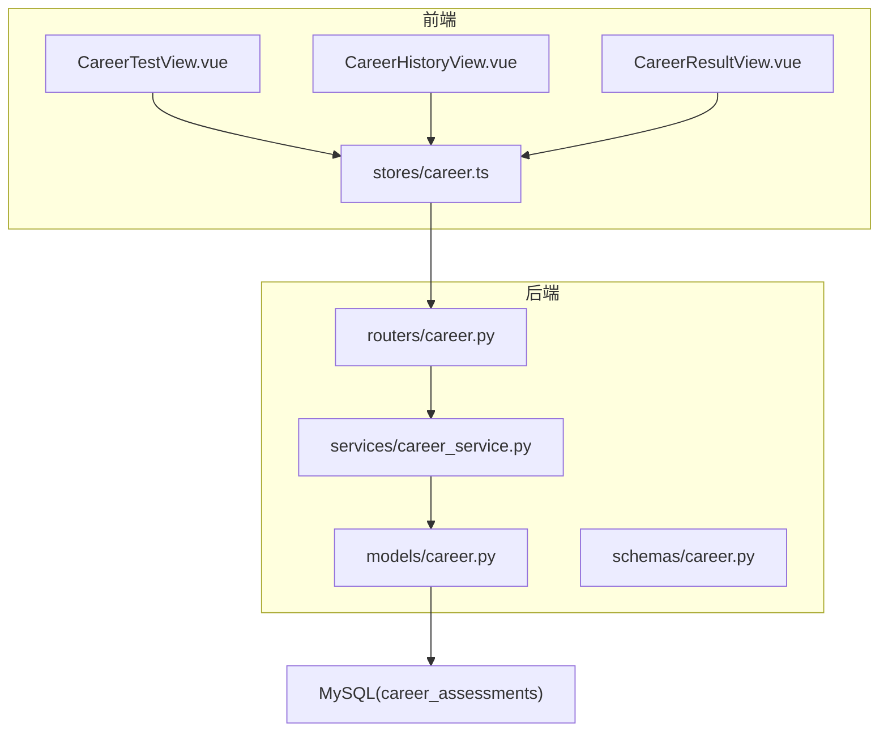
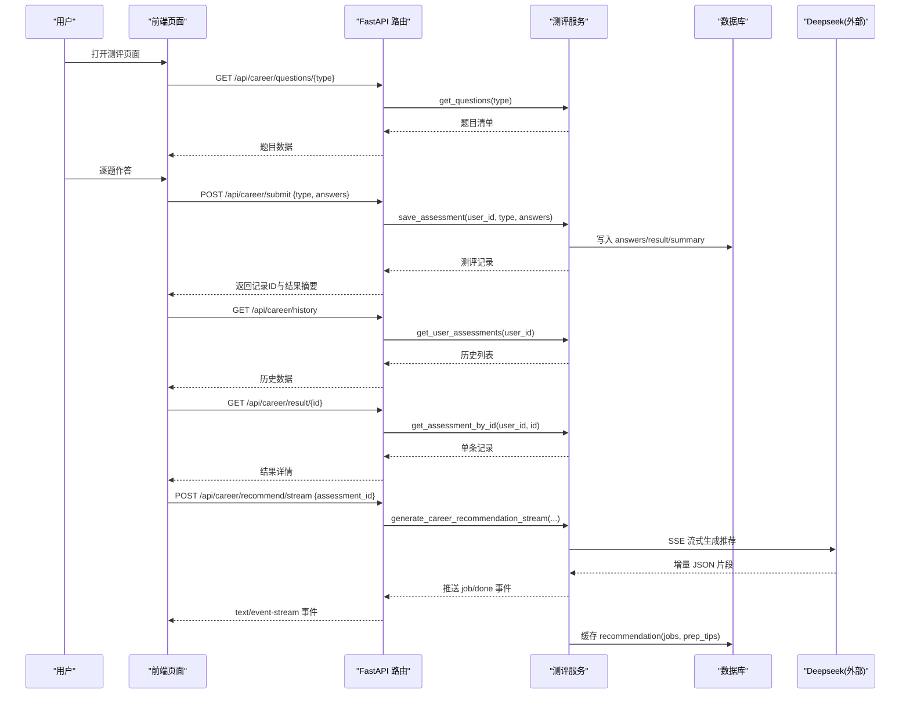
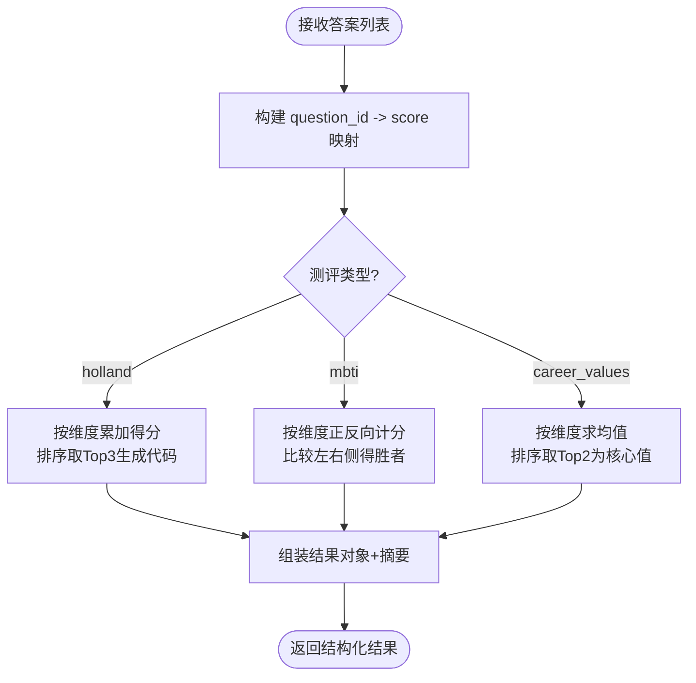
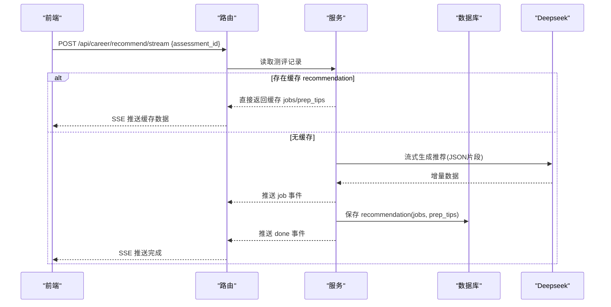
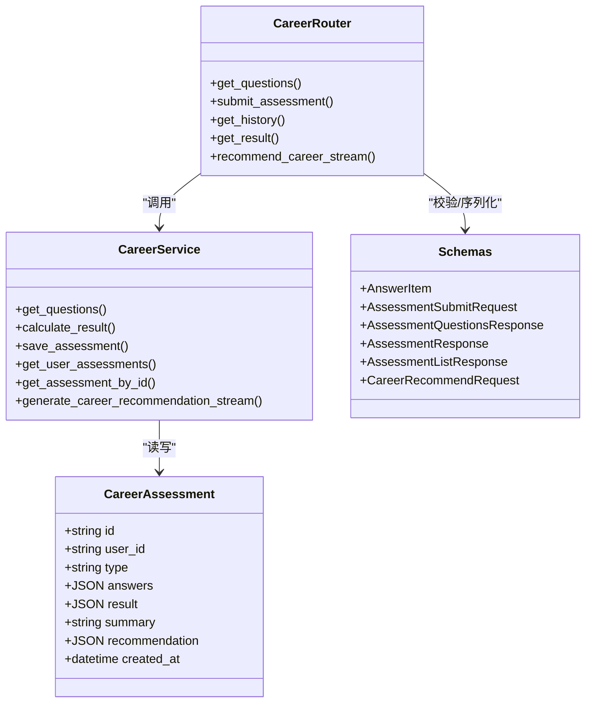

# 职业发展测评接口

<cite>
**本文引用的文件**
- [career.py](file://backEnd/app/routers/career.py)
- [career_service.py](file://backEnd/app/services/career_service.py)
- [career.py](file://backEnd/app/models/career.py)
- [career.py](file://backEnd/app/schemas/career.py)
- [career.ts](file://frontEnd/src/stores/career.ts)
- [CareerTestView.vue](file://frontEnd/src/views/CareerTestView.vue)
- [CareerHistoryView.vue](file://frontEnd/src/views/CareerHistoryView.vue)
- [CareerResultView.vue](file://frontEnd/src/views/CareerResultView.vue)
- [hr_interview.sql](file://hr_interview.sql)
</cite>

## 目录
1. [简介](#简介)
2. [项目结构](#项目结构)
3. [核心组件](#核心组件)
4. [架构总览](#架构总览)
5. [详细组件分析](#详细组件分析)
6. [依赖关系分析](#依赖关系分析)
7. [性能与扩展性](#性能与扩展性)
8. [故障排查指南](#故障排查指南)
9. [结论](#结论)
10. [附录：接口规范与数据模型](#附录接口规范与数据模型)

## 简介
本文件为 HR XF 系统“职业发展测评模块”的 API 接口文档，覆盖以下能力：
- MBTI 性格测试、Holland RIASEC 职业兴趣测评、职业价值观测评的题目获取与提交
- 答题数据结构、提交格式、结果计算算法说明
- 测评历史查询与管理（列表、详情）
- 测评结果可视化数据返回格式（雷达图、双向条形图、环形图/词云等）
- AI 岗位匹配推荐（SSE 流式），含面试准备建议
- 测评进度跟踪与断点续测的实现方式
- 测评模板管理与自定义测评扩展方法

## 项目结构
后端采用 FastAPI + SQLAlchemy 异步 ORM，前端使用 Vue 3 + Pinia。测评相关代码主要分布在：
- 路由层：/api/career/*
- 服务层：题库定义、评分算法、数据库 CRUD、AI 推荐
- 模型与 Schema：数据库表映射与请求/响应校验
- 前端 Store 与视图：题目加载、答题交互、结果展示、SSE 流式推荐

图表来源
- [career.py:1-158](file://backEnd/app/routers/career.py#L1-L158)
- [career_service.py:1-669](file://backEnd/app/services/career_service.py#L1-L669)
- [career.py:1-56](file://backEnd/app/models/career.py#L1-L56)
- [career.ts:1-223](file://frontEnd/src/stores/career.ts#L1-L223)
- [CareerTestView.vue:1-226](file://frontEnd/src/views/CareerTestView.vue#L1-L226)
- [CareerHistoryView.vue:1-152](file://frontEnd/src/views/CareerHistoryView.vue#L1-L152)
- [CareerResultView.vue:1-561](file://frontEnd/src/views/CareerResultView.vue#L1-L561)

章节来源
- [career.py:1-158](file://backEnd/app/routers/career.py#L1-L158)
- [career_service.py:1-669](file://backEnd/app/services/career_service.py#L1-L669)
- [career.py:1-56](file://backEnd/app/models/career.py#L1-L56)
- [career.ts:1-223](file://frontEnd/src/stores/career.ts#L1-L223)
- [CareerTestView.vue:1-226](file://frontEnd/src/views/CareerTestView.vue#L1-L226)
- [CareerHistoryView.vue:1-152](file://frontEnd/src/views/CareerHistoryView.vue#L1-L152)
- [CareerResultView.vue:1-561](file://frontEnd/src/views/CareerResultView.vue#L1-L561)

## 核心组件
- 路由层 /api/career
  - GET /questions/{assessment_type}：获取指定类型测评题目（无需认证）
  - POST /submit：提交答案并计算结果（需认证）
  - GET /history：获取当前用户测评历史（需认证）
  - GET /result/{assessment_id}：获取单个测评详情（需认证）
  - POST /recommend/stream：基于测评结果的 AI 岗位匹配推荐（SSE 流式，需认证）

- 服务层 career_service
  - 题库元信息与题目清单：holland、mbti、career_values
  - 评分算法：score_holland、score_mbti、score_career_values
  - 数据库操作：save_assessment、get_user_assessments、get_assessment_by_id
  - AI 推荐：generate_career_recommendation_stream（Deepseek SSE）

- 数据模型与 Schema
  - CareerAssessment：测评记录表映射
  - AnswerItem、AssessmentSubmitRequest、AssessmentQuestionsResponse、AssessmentResponse、AssessmentListResponse、CareerRecommendRequest：请求/响应结构

- 前端
  - stores/career.ts：统一封装 API 调用、SSE 解析、状态管理
  - 视图：题目作答、历史记录、结果可视化、AI 推荐展示

章节来源
- [career.py:1-158](file://backEnd/app/routers/career.py#L1-L158)
- [career_service.py:1-669](file://backEnd/app/services/career_service.py#L1-L669)
- [career.py:1-56](file://backEnd/app/models/career.py#L1-L56)
- [career.py:1-59](file://backEnd/app/schemas/career.py#L1-L59)
- [career.ts:1-223](file://frontEnd/src/stores/career.ts#L1-L223)
- [CareerTestView.vue:1-226](file://frontEnd/src/views/CareerTestView.vue#L1-L226)
- [CareerHistoryView.vue:1-152](file://frontEnd/src/views/CareerHistoryView.vue#L1-L152)
- [CareerResultView.vue:1-561](file://frontEnd/src/views/CareerResultView.vue#L1-L561)

## 架构总览

图表来源
- [career.py:1-158](file://backEnd/app/routers/career.py#L1-L158)
- [career_service.py:429-669](file://backEnd/app/services/career_service.py#L429-L669)
- [career.py:1-56](file://backEnd/app/models/career.py#L1-L56)

## 详细组件分析

### 接口规范与数据模型

- 获取题目
  - 路径：GET /api/career/questions/{assessment_type}
  - 参数：assessment_type ∈ {holland, mbti, career_values}
  - 响应体：AssessmentQuestionsResponse
    - type: string
    - title: string
    - description: string
    - questions: QuestionItem[]
      - id: string
      - dimension: string
      - text: string
      - options: QuestionOption[]
        - label: string
        - value: number (1-5)

- 提交测评
  - 路径：POST /api/career/submit
  - 请求体：AssessmentSubmitRequest
    - type: string (holland|mbti|career_values)
    - answers: AnswerItem[]
      - question_id: string
      - score: number (1-5)
  - 响应体：AssessmentResponse
    - id: string
    - type: string
    - result: dict (按类型不同)
    - summary: string | null
    - created_at: datetime

- 测评历史
  - 路径：GET /api/career/history
  - 响应体：AssessmentListResponse
    - total: int
    - items: AssessmentResponse[]

- 测评详情
  - 路径：GET /api/career/result/{assessment_id}
  - 响应体：AssessmentResponse

- AI 岗位匹配推荐（SSE）
  - 路径：POST /api/career/recommend/stream
  - 请求体：CareerRecommendRequest
    - assessment_id: string
  - 响应：text/event-stream
    - data: {"type":"job","index":n,"data":{"title","match","reason","salary_range"}}
    - data: {"type":"done","prep_tips":[...],"total_jobs":n}

章节来源
- [career.py:20-158](file://backEnd/app/routers/career.py#L20-L158)
- [career.py:1-59](file://backEnd/app/schemas/career.py#L1-L59)

### 评分算法与结果结构

- Holland RIASEC
  - 维度：R/I/A/S/E/C，各维度累加得分
  - 输出：scores、holland_code（Top3 拼接）、top3（含名称/描述/分数/推荐职业）、summary
  - 参考实现路径：[career_service.py:319-343](file://backEnd/app/services/career_service.py#L319-L343)

- MBTI
  - 维度：EI、SN、TF、JP；正向/反向题计分，取左右侧高分字母组成类型
  - 输出：type、dimensions（每维左右分与胜者）、type_info（名称/描述/优势/职业/认知功能）、summary
  - 参考实现路径：[career_service.py:346-393](file://backEnd/app/services/career_service.py#L346-L393)

- 职业价值观
  - 维度：achievement、compensation、independence、altruism、relationships、lifestyle
  - 输出：scores（维度均分）、dimensions（排序后的维度详情，标注核心维度）、core_values（Top2）、summary
  - 参考实现路径：[career_service.py:396-422](file://backEnd/app/services/career_service.py#L396-L422)

图表来源
- [career_service.py:319-422](file://backEnd/app/services/career_service.py#L319-L422)

章节来源
- [career_service.py:319-422](file://backEnd/app/services/career_service.py#L319-L422)

### 数据库模型与存储

- 表：career_assessments
  - id: UUID 主键
  - user_id: 外键关联 users.id
  - type: 枚举型字符串（holland/mbti/career_values）
  - answers: JSON（原始答案数组）
  - result: JSON（结构化结果）
  - summary: TEXT（摘要文本）
  - recommendation: JSON（AI 推荐缓存：jobs、prep_tips）
  - created_at: 创建时间

- 索引：user_id、type

章节来源
- [career.py:1-56](file://backEnd/app/models/career.py#L1-L56)
- [hr_interview.sql:35-51](file://hr_interview.sql#L35-L51)

### 前端交互与可视化

- 题目加载与作答
  - 通过 store.fetchQuestions 拉取题目，支持自动跳转下一题与回退
  - 提交时构造 answers 列表并调用 submitAssessment

- 历史记录与详情
  - fetchHistory 获取列表，fetchResult 获取详情

- 结果可视化
  - Holland：SVG 雷达图（六维度）
  - MBTI：ECharts 双向条形图（四维度倾向百分比）
  - 价值观：SVG 环形图 + 词云（按维度均分权重）

- AI 推荐（SSE）
  - fetchRecommendation 建立 SSE 连接，解析 data: 行，逐步渲染岗位卡片与准备建议

章节来源
- [career.ts:94-207](file://frontEnd/src/stores/career.ts#L94-L207)
- [CareerTestView.vue:1-226](file://frontEnd/src/views/CareerTestView.vue#L1-L226)
- [CareerHistoryView.vue:1-152](file://frontEnd/src/views/CareerHistoryView.vue#L1-L152)
- [CareerResultView.vue:1-561](file://frontEnd/src/views/CareerResultView.vue#L1-L561)

### 测评报告与可视化数据

- 报告内容
  - 摘要：summary（由评分函数生成）
  - 结构化结果：result（按类型包含多维分数、类型信息、核心维度等）
  - 可视化数据：前端根据 result 渲染 SVG/ECharts 图形

- 可视化数据返回格式
  - 服务端仅返回结构化 result 与 summary，前端自行转换为可视化数据
  - 示例字段：
    - Holland：scores、holland_code、top3[].{code,name,desc,score,careers}
    - MBTI：type、dimensions.{left,right,winner}、type_info.{name,desc,strengths,careers,...}
    - 价值观：scores、dimensions[].{code,name,desc,avg_score,is_core}、core_values

章节来源
- [career_service.py:319-422](file://backEnd/app/services/career_service.py#L319-L422)
- [CareerResultView.vue:293-542](file://frontEnd/src/views/CareerResultView.vue#L293-L542)

### AI 岗位匹配推荐流程

图表来源
- [career.py:96-158](file://backEnd/app/routers/career.py#L96-L158)
- [career_service.py:568-669](file://backEnd/app/services/career_service.py#L568-L669)

章节来源
- [career.py:96-158](file://backEnd/app/routers/career.py#L96-L158)
- [career_service.py:568-669](file://backEnd/app/services/career_service.py#L568-L669)

### 测评进度跟踪与断点续测

- 进度跟踪
  - 前端维护 answers 字典与 currentIndex，实时显示进度百分比与已答数量
  - 支持上一题回退与自动跳转下一题

- 断点续测
  - 当前实现未在后端持久化中间答案；如需断点续测，可新增接口：
    - PATCH /api/career/progress/{assessment_type}：保存/更新当前用户的临时答案
    - GET /api/career/progress/{assessment_type}：恢复当前用户的临时答案
  - 建议在数据库中增加一张临时表或复用现有表增加 status 字段（如 draft/completed）以区分草稿与正式提交

章节来源
- [CareerTestView.vue:136-207](file://frontEnd/src/views/CareerTestView.vue#L136-L207)
- [career.ts:94-121](file://frontEnd/src/stores/career.ts#L94-L121)

### 测评模板管理与自定义测评扩展

- 模板管理
  - 题库元信息集中在 ASSESSMENT_META，包含标题、描述与题目清单
  - 新增测评类型需在 ASSESSMENT_META 中注册，并在 calculate_result 中添加对应分支

- 自定义扩展步骤
  - 在 career_service.py 中：
    - 新增题目清单（QuestionItem[]）
    - 新增评分函数（如 score_xxx）
    - 在 calculate_result 中接入新类型
    - 可选：新增类型描述与职业建议常量
  - 在 schemas 中确保 AnswerItem 与提交结构兼容
  - 在前端路由与 Store 中暴露新的 type 入口

章节来源
- [career_service.py:191-207](file://backEnd/app/services/career_service.py#L191-L207)
- [career_service.py:441-450](file://backEnd/app/services/career_service.py#L441-L450)
- [career.py:16-18](file://backEnd/app/schemas/career.py#L16-L18)

## 依赖关系分析

图表来源
- [career.py:1-158](file://backEnd/app/routers/career.py#L1-L158)
- [career_service.py:429-669](file://backEnd/app/services/career_service.py#L429-L669)
- [career.py:1-56](file://backEnd/app/models/career.py#L1-L56)
- [career.py:1-59](file://backEnd/app/schemas/career.py#L1-L59)

章节来源
- [career.py:1-158](file://backEnd/app/routers/career.py#L1-L158)
- [career_service.py:429-669](file://backEnd/app/services/career_service.py#L429-L669)
- [career.py:1-56](file://backEnd/app/models/career.py#L1-L56)
- [career.py:1-59](file://backEnd/app/schemas/career.py#L1-L59)

## 性能与扩展性
- 评分算法复杂度
  - Holland/MBTI/价值观均为 O(n) 遍历题目集合，n 为题目数（固定规模），开销极低
- 数据库访问
  - 历史查询按 user_id 降序排序，已有索引优化
- AI 推荐
  - 首次调用 Deepseek 流式生成，后续命中缓存直接返回，降低延迟与成本
- 可扩展性
  - 新增测评类型仅需在服务层注册模板与评分逻辑，不影响既有接口契约

## 故障排查指南
- 常见错误
  - 不支持的测评类型：检查 assessment_type 是否为 holland/mbti/career_values
  - 未配置 Deepseek API Key：POST /recommend/stream 会返回 400，需在环境变量设置 DEEPSEEK_API_KEY
  - 测评记录不存在：GET /result/{id} 返回 404，确认 assessment_id 归属当前用户
- 定位建议
  - 查看路由层异常抛出位置与服务层 ValueError 提示
  - 检查 SSE 流是否成功推送 job/done 事件
  - 确认数据库 recommendation 字段是否存在（迁移脚本已添加）

章节来源
- [career.py:20-158](file://backEnd/app/routers/career.py#L20-L158)
- [career_service.py:429-450](file://backEnd/app/services/career_service.py#L429-L450)
- [career_service.py:568-669](file://backEnd/app/services/career_service.py#L568-L669)

## 结论
本模块提供完整的职业发展测评能力，涵盖三类主流测评工具的题目、评分与结果呈现，并通过 SSE 流式对接 AI 进行岗位匹配与面试准备建议。系统具备良好的扩展性与清晰的职责分层，便于后续新增测评类型与增强可视化表现。

## 附录：接口规范与数据模型

### 请求/响应模型速查
- AnswerItem
  - question_id: string
  - score: number (1-5)
- AssessmentSubmitRequest
  - type: string (holland|mbti|career_values)
  - answers: AnswerItem[]
- AssessmentQuestionsResponse
  - type: string
  - title: string
  - description: string
  - questions: QuestionItem[]
- AssessmentResponse
  - id: string
  - type: string
  - result: dict
  - summary: string | null
  - created_at: datetime
- AssessmentListResponse
  - total: int
  - items: AssessmentResponse[]
- CareerRecommendRequest
  - assessment_id: string

章节来源
- [career.py:1-59](file://backEnd/app/schemas/career.py#L1-L59)

### 数据库表结构（career_assessments）
- 字段：id、user_id、type、answers、result、summary、recommendation、created_at
- 索引：user_id、type
- 约束：user_id 外键关联 users.id

章节来源
- [career.py:1-56](file://backEnd/app/models/career.py#L1-L56)
- [hr_interview.sql:35-51](file://hr_interview.sql#L35-L51)