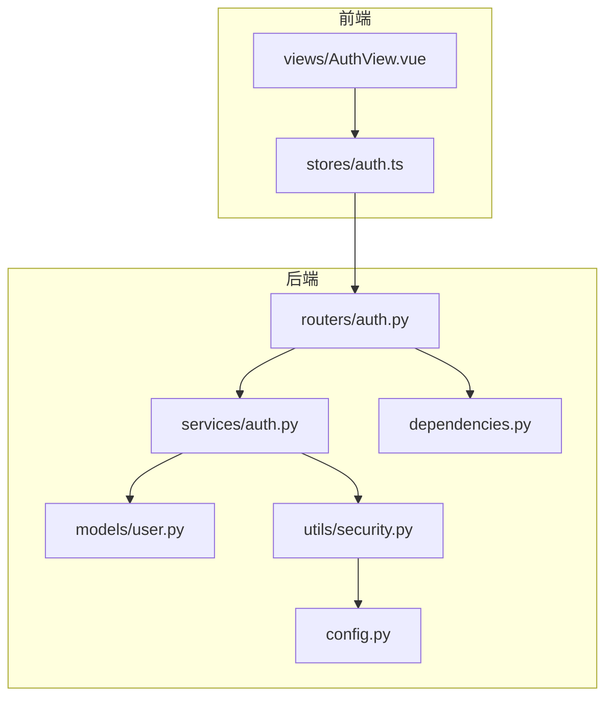
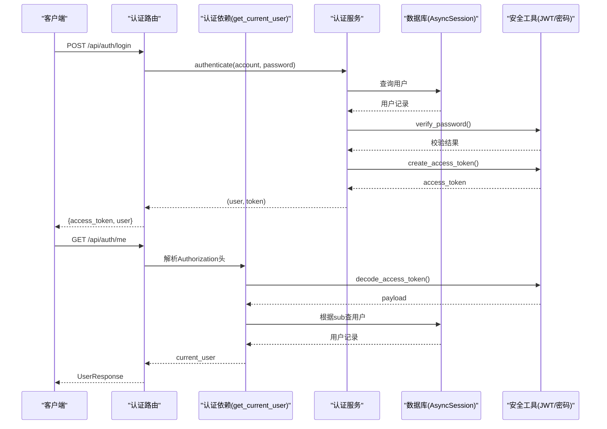
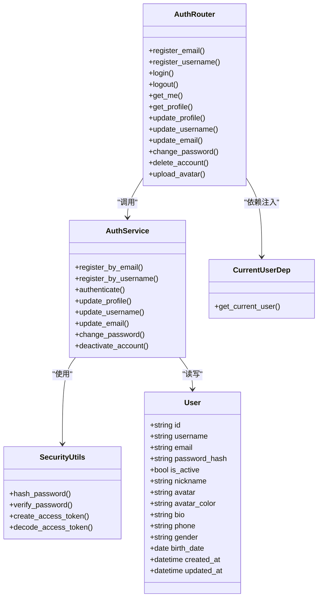

# 认证接口

<cite>
**本文引用的文件**   
- [backEnd/app/routers/auth.py](file://backEnd/app/routers/auth.py)
- [backEnd/app/schemas/auth.py](file://backEnd/app/schemas/auth.py)
- [backEnd/app/services/auth.py](file://backEnd/app/services/auth.py)
- [backEnd/app/models/user.py](file://backEnd/app/models/user.py)
- [backEnd/app/utils/security.py](file://backEnd/app/utils/security.py)
- [backEnd/app/dependencies.py](file://backEnd/app/dependencies.py)
- [backEnd/app/config.py](file://backEnd/app/config.py)
- [frontEnd/src/stores/auth.ts](file://frontEnd/src/stores/auth.ts)
- [frontEnd/src/views/AuthView.vue](file://frontEnd/src/views/AuthView.vue)
</cite>

## 目录
1. [简介](#简介)
2. [项目结构](#项目结构)
3. [核心组件](#核心组件)
4. [架构总览](#架构总览)
5. [详细接口说明](#详细接口说明)
6. [依赖关系分析](#依赖关系分析)
7. [性能与安全考虑](#性能与安全考虑)
8. [故障排查指南](#故障排查指南)
9. [结论](#结论)
10. [附录：请求与响应示例](#附录请求与响应示例)

## 简介
本文件为 HR XF 系统“认证模块”的完整 API 文档，覆盖用户注册（邮箱/用户名）、登录、登出、获取当前用户信息、更新个人资料、修改用户名/邮箱/密码、注销账号以及头像上传等所有认证相关接口。文档包含每个接口的 HTTP 方法、URL 路径、请求参数格式、响应数据结构、状态码含义、JWT 令牌获取与使用方式、错误处理场景、头像上传限制，以及认证中间件的使用方法与权限控制机制。

## 项目结构
认证模块后端基于 FastAPI，采用路由层（routers）—服务层（services）—数据模型（models）—安全工具（utils）的分层设计；前端通过 Pinia store 封装统一请求与错误处理，并在需要时直接调用上传接口。

图表来源
- [backEnd/app/routers/auth.py:1-217](file://backEnd/app/routers/auth.py#L1-L217)
- [backEnd/app/services/auth.py:1-174](file://backEnd/app/services/auth.py#L1-L174)
- [backEnd/app/models/user.py:1-45](file://backEnd/app/models/user.py#L1-L45)
- [backEnd/app/utils/security.py:1-48](file://backEnd/app/utils/security.py#L1-L48)
- [backEnd/app/dependencies.py:1-41](file://backEnd/app/dependencies.py#L1-L41)
- [backEnd/app/config.py:1-71](file://backEnd/app/config.py#L1-L71)
- [frontEnd/src/stores/auth.ts:1-314](file://frontEnd/src/stores/auth.ts#L1-L314)
- [frontEnd/src/views/AuthView.vue:1-418](file://frontEnd/src/views/AuthView.vue#L1-L418)

章节来源
- [backEnd/app/routers/auth.py:1-217](file://backEnd/app/routers/auth.py#L1-L217)
- [backEnd/app/services/auth.py:1-174](file://backEnd/app/services/auth.py#L1-L174)
- [backEnd/app/models/user.py:1-45](file://backEnd/app/models/user.py#L1-L45)
- [backEnd/app/utils/security.py:1-48](file://backEnd/app/utils/security.py#L1-L48)
- [backEnd/app/dependencies.py:1-41](file://backEnd/app/dependencies.py#L1-L41)
- [backEnd/app/config.py:1-71](file://backEnd/app/config.py#L1-L71)
- [frontEnd/src/stores/auth.ts:1-314](file://frontEnd/src/stores/auth.ts#L1-L314)
- [frontEnd/src/views/AuthView.vue:1-418](file://frontEnd/src/views/AuthView.vue#L1-L418)

## 核心组件
- 路由层（routers/auth.py）：定义认证相关的所有 RESTful 端点，负责参数校验、异常转换与响应组装。
- 服务层（services/auth.py）：实现注册、登录、资料更新、密码修改、账号注销等业务逻辑，并返回领域对象或抛出业务异常。
- 数据模型（models/user.py）：用户实体映射，包含基础信息与个人资料字段。
- 安全工具（utils/security.py）：密码哈希/校验、JWT 签发与解码。
- 依赖注入（dependencies.py）：HTTP Bearer 鉴权中间件，解析 Token 并返回当前用户。
- 配置（config.py）：JWT 密钥、算法、过期时间等配置项。
- 前端存储（stores/auth.ts）：统一封装请求、自动附加 Authorization 头、持久化 token 与用户信息。

章节来源
- [backEnd/app/routers/auth.py:1-217](file://backEnd/app/routers/auth.py#L1-L217)
- [backEnd/app/services/auth.py:1-174](file://backEnd/app/services/auth.py#L1-L174)
- [backEnd/app/models/user.py:1-45](file://backEnd/app/models/user.py#L1-L45)
- [backEnd/app/utils/security.py:1-48](file://backEnd/app/utils/security.py#L1-L48)
- [backEnd/app/dependencies.py:1-41](file://backEnd/app/dependencies.py#L1-L41)
- [backEnd/app/config.py:1-71](file://backEnd/app/config.py#L1-L71)
- [frontEnd/src/stores/auth.ts:1-314](file://frontEnd/src/stores/auth.ts#L1-L314)

## 架构总览
认证流程的关键交互如下：客户端发起请求 → FastAPI 路由接收 → 可选的认证中间件验证 JWT → 服务层执行业务逻辑 → 返回结构化响应。

图表来源
- [backEnd/app/routers/auth.py:69-91](file://backEnd/app/routers/auth.py#L69-L91)
- [backEnd/app/services/auth.py:85-96](file://backEnd/app/services/auth.py#L85-L96)
- [backEnd/app/dependencies.py:13-41](file://backEnd/app/dependencies.py#L13-L41)
- [backEnd/app/utils/security.py:26-47](file://backEnd/app/utils/security.py#L26-L47)

## 详细接口说明

### 通用约定
- 基础路径：/api/auth
- 内容类型：application/json（除头像上传外）
- 认证方式：Bearer Token，请求头 Authorization: Bearer <token>
- 成功响应：JSON 体，具体见各接口
- 失败响应：JSON 体，包含 detail 字段描述错误原因
- 常见状态码：
  - 200：成功
  - 201：创建成功（注册）
  - 400：请求参数错误或业务校验失败
  - 401：未认证或凭据无效
  - 404：资源不存在（如用户不存在）
  - 5xx：服务端异常

章节来源
- [backEnd/app/routers/auth.py:1-217](file://backEnd/app/routers/auth.py#L1-L217)
- [backEnd/app/schemas/auth.py:1-119](file://backEnd/app/schemas/auth.py#L1-L119)
- [backEnd/app/dependencies.py:1-41](file://backEnd/app/dependencies.py#L1-L41)

### 1) 邮箱注册
- 方法：POST
- 路径：/api/auth/register/email
- 请求体：
  - email: string（邮箱格式）
  - password: string（长度≥6）
- 成功响应（201）：
  - access_token: string
  - token_type: "bearer"
  - user: UserResponse
- 失败响应（400）：
  - detail: string（如“该邮箱已被注册”、“密码至少需要6位”）

章节来源
- [backEnd/app/routers/auth.py:41-52](file://backEnd/app/routers/auth.py#L41-L52)
- [backEnd/app/schemas/auth.py:9-18](file://backEnd/app/schemas/auth.py#L9-L18)
- [backEnd/app/services/auth.py:38-62](file://backEnd/app/services/auth.py#L38-L62)

### 2) 用户名注册
- 方法：POST
- 路径：/api/auth/register/username
- 请求体：
  - username: string（3~50字符，仅字母、数字、下划线和中文）
  - password: string（长度≥6）
- 成功响应（201）：同上
- 失败响应（400）：
  - detail: string（如“该用户名已被注册”、“用户名只能包含字母、数字、下划线和中文”、“密码至少需要6位”）

章节来源
- [backEnd/app/routers/auth.py:55-66](file://backEnd/app/routers/auth.py#L55-L66)
- [backEnd/app/schemas/auth.py:21-30](file://backEnd/app/schemas/auth.py#L21-L30)
- [backEnd/app/services/auth.py:65-82](file://backEnd/app/services/auth.py#L65-L82)

### 3) 登录（邮箱/用户名）
- 方法：POST
- 路径：/api/auth/login
- 请求体：
  - account: string（邮箱或用户名）
  - password: string
- 成功响应（200）：
  - access_token: string
  - token_type: "bearer"
  - user: UserResponse
- 失败响应（401/400）：
  - detail: string（如“账号或密码错误”、“账号已被禁用”）

章节来源
- [backEnd/app/routers/auth.py:69-80](file://backEnd/app/routers/auth.py#L69-L80)
- [backEnd/app/schemas/auth.py:33-36](file://backEnd/app/schemas/auth.py#L33-L36)
- [backEnd/app/services/auth.py:85-96](file://backEnd/app/services/auth.py#L85-L96)

### 4) 登出（无状态）
- 方法：POST
- 路径：/api/auth/logout
- 认证：需要
- 成功响应（200）：
  - message: "登出成功"
- 说明：服务端不维护会话，客户端应丢弃本地 token。

章节来源
- [backEnd/app/routers/auth.py:83-86](file://backEnd/app/routers/auth.py#L83-L86)

### 5) 获取当前用户信息
- 方法：GET
- 路径：/api/auth/me
- 认证：需要
- 成功响应（200）：UserResponse
- 失败响应（401）：
  - detail: string（如“无效的认证凭据”、“用户不存在或已被禁用”）

章节来源
- [backEnd/app/routers/auth.py:89-91](file://backEnd/app/routers/auth.py#L89-L91)
- [backEnd/app/dependencies.py:13-41](file://backEnd/app/dependencies.py#L13-L41)

### 6) 获取完整个人资料
- 方法：GET
- 路径：/api/auth/profile
- 认证：需要
- 成功响应（200）：UserResponse（含 created_at 等）
- 失败响应（401）：同上

章节来源
- [backEnd/app/routers/auth.py:97-100](file://backEnd/app/routers/auth.py#L97-L100)

### 7) 更新个人资料
- 方法：PUT
- 路径：/api/auth/profile
- 认证：需要
- 请求体（全部可选）：
  - nickname: string（≤50）
  - avatar_color: string（≤20）
  - bio: string（≤500）
  - phone: string（≤20）
  - gender: enum("male","female","other") 或空字符串转为 null
  - birth_date: date
- 成功响应（200）：UserResponse
- 失败响应（400）：
  - detail: string（如“性别只能是 male、female 或 other”）

章节来源
- [backEnd/app/routers/auth.py:103-114](file://backEnd/app/routers/auth.py#L103-L114)
- [backEnd/app/schemas/auth.py:72-85](file://backEnd/app/schemas/auth.py#L72-L85)
- [backEnd/app/services/auth.py:99-108](file://backEnd/app/services/auth.py#L99-L108)

### 8) 修改用户名
- 方法：PUT
- 路径：/api/auth/username
- 认证：需要
- 请求体：
  - username: string（3~50，仅字母、数字、下划线和中文）
- 成功响应（200）：TokenResponse（包含新 token 与用户信息）
- 失败响应（400）：
  - detail: string（如“该用户名已被占用”、“用户名只能包含字母、数字、下划线和中文”）

章节来源
- [backEnd/app/routers/auth.py:117-130](file://backEnd/app/routers/auth.py#L117-L130)
- [backEnd/app/schemas/auth.py:90-98](file://backEnd/app/schemas/auth.py#L90-L98)
- [backEnd/app/services/auth.py:114-128](file://backEnd/app/services/auth.py#L114-L128)

### 9) 修改邮箱
- 方法：PUT
- 路径：/api/auth/email
- 认证：需要
- 请求体：
  - email: string（邮箱格式）
- 成功响应（200）：TokenResponse
- 失败响应（400）：
  - detail: string（如“该邮箱已被占用”）

章节来源
- [backEnd/app/routers/auth.py:133-146](file://backEnd/app/routers/auth.py#L133-L146)
- [backEnd/app/schemas/auth.py:101-102](file://backEnd/app/schemas/auth.py#L101-L102)
- [backEnd/app/services/auth.py:131-145](file://backEnd/app/services/auth.py#L131-L145)

### 10) 修改密码
- 方法：PUT
- 路径：/api/auth/password
- 认证：需要
- 请求体：
  - old_password: string（≥1）
  - new_password: string（≥6）
- 成功响应（200）：MessageResponse（message="密码修改成功"）
- 失败响应（400）：
  - detail: string（如“旧密码错误”、“密码至少需要6位”）

章节来源
- [backEnd/app/routers/auth.py:149-161](file://backEnd/app/routers/auth.py#L149-L161)
- [backEnd/app/schemas/auth.py:105-114](file://backEnd/app/schemas/auth.py#L105-L114)
- [backEnd/app/services/auth.py:148-160](file://backEnd/app/services/auth.py#L148-L160)

### 11) 注销账号（软删除）
- 方法：DELETE
- 路径：/api/auth/account
- 认证：需要
- 请求体：
  - password: string（用于二次确认）
- 成功响应（200）：MessageResponse（message="账号已注销"）
- 失败响应（400）：
  - detail: string（如“用户不存在”、“密码错误”）

章节来源
- [backEnd/app/routers/auth.py:164-176](file://backEnd/app/routers/auth.py#L164-L176)
- [backEnd/app/schemas/auth.py:117-118](file://backEnd/app/schemas/auth.py#L117-L118)
- [backEnd/app/services/auth.py:163-174](file://backEnd/app/services/auth.py#L163-L174)

### 12) 上传头像
- 方法：POST
- 路径：/api/auth/avatar
- 认证：需要
- 请求体：multipart/form-data
  - file: 图片文件
- 文件限制：
  - 允许类型：image/jpeg、image/png、image/webp、image/gif
  - 最大大小：5MB
- 成功响应（200）：UserResponse（avatar 字段更新为新相对路径）
- 失败响应（400）：
  - detail: string（如“仅支持 JPG / PNG / WebP / GIF 格式”、“图片大小不能超过 5MB”）

章节来源
- [backEnd/app/routers/auth.py:182-216](file://backEnd/app/routers/auth.py#L182-L216)

## 依赖关系分析

### 类与依赖关系图

图表来源
- [backEnd/app/models/user.py:10-45](file://backEnd/app/models/user.py#L10-L45)
- [backEnd/app/routers/auth.py:25-216](file://backEnd/app/routers/auth.py#L25-L216)
- [backEnd/app/services/auth.py:1-174](file://backEnd/app/services/auth.py#L1-L174)
- [backEnd/app/utils/security.py:1-48](file://backEnd/app/utils/security.py#L1-L48)
- [backEnd/app/dependencies.py:10-41](file://backEnd/app/dependencies.py#L10-L41)

章节来源
- [backEnd/app/models/user.py:1-45](file://backEnd/app/models/user.py#L1-L45)
- [backEnd/app/routers/auth.py:1-217](file://backEnd/app/routers/auth.py#L1-L217)
- [backEnd/app/services/auth.py:1-174](file://backEnd/app/services/auth.py#L1-L174)
- [backEnd/app/utils/security.py:1-48](file://backEnd/app/utils/security.py#L1-L48)
- [backEnd/app/dependencies.py:1-41](file://backEnd/app/dependencies.py#L1-L41)

## 性能与安全考虑
- 密码安全：使用 bcrypt 进行哈希与校验，超长明文会被截断至 72 字节以兼容算法限制。
- JWT 安全：HS256 算法，默认 24 小时过期，secret_key 应从环境变量加载，生产环境务必更换。
- 并发与异步：数据库访问使用 AsyncSession，避免阻塞 I/O。
- 文件大小限制：头像上传限制 5MB，建议在前端也做校验以减少无效请求。
- 跨域：CORS 源可通过配置指定，便于前后端联调。

章节来源
- [backEnd/app/utils/security.py:1-48](file://backEnd/app/utils/security.py#L1-L48)
- [backEnd/app/config.py:20-32](file://backEnd/app/config.py#L20-L32)
- [backEnd/app/routers/auth.py:27-31](file://backEnd/app/routers/auth.py#L27-L31)

## 故障排查指南
- 401 未认证：检查请求头是否携带 Authorization: Bearer <token>，确认 token 未过期且未被篡改。
- 400 参数错误：核对字段长度、格式与枚举值（如 gender），关注 detail 中的具体提示。
- 404 资源不存在：用户 ID 无效或用户已被注销（is_active=false）。
- 头像上传失败：确认文件类型与大小是否符合限制，确保表单字段名为 file。
- 登录失败：确认 account 是邮箱或用户名之一，密码正确且账号未被禁用。

章节来源
- [backEnd/app/dependencies.py:13-41](file://backEnd/app/dependencies.py#L13-L41)
- [backEnd/app/routers/auth.py:41-216](file://backEnd/app/routers/auth.py#L41-L216)
- [backEnd/app/services/auth.py:38-174](file://backEnd/app/services/auth.py#L38-L174)

## 结论
认证模块提供完整的用户生命周期管理接口，采用无状态 JWT 鉴权，前后端职责清晰、分层明确。通过统一的依赖注入中间件保障受保护接口的安全性，结合严格的参数校验与错误提示，具备良好的可维护性与可扩展性。

## 附录：请求与响应示例

### 登录（邮箱/用户名）
- 请求
  - 方法：POST
  - 路径：/api/auth/login
  - 头部：Content-Type: application/json
  - 主体：{"account": "邮箱或用户名", "password": "密码"}
- 成功响应（200）
  - {"access_token": "...", "token_type": "bearer", "user": {...}}
- 失败响应（401/400）
  - {"detail": "账号或密码错误"}

章节来源
- [backEnd/app/routers/auth.py:69-80](file://backEnd/app/routers/auth.py#L69-L80)
- [backEnd/app/services/auth.py:85-96](file://backEnd/app/services/auth.py#L85-L96)

### 获取当前用户信息
- 请求
  - 方法：GET
  - 路径：/api/auth/me
  - 头部：Authorization: Bearer <token>
- 成功响应（200）
  - {"id":"...","username":"...","email":"...","nickname":"...","avatar":"...","avatar_color":"...","bio":"...","phone":"...","gender":"...","birth_date":"...","created_at":"..."}
- 失败响应（401）
  - {"detail": "无效的认证凭据"}

章节来源
- [backEnd/app/routers/auth.py:89-91](file://backEnd/app/routers/auth.py#L89-L91)
- [backEnd/app/dependencies.py:13-41](file://backEnd/app/dependencies.py#L13-L41)

### 更新个人资料
- 请求
  - 方法：PUT
  - 路径：/api/auth/profile
  - 头部：Authorization: Bearer <token>, Content-Type: application/json
  - 主体：{"nickname":"昵称","bio":"个人简介","gender":"male"}
- 成功响应（200）
  - UserResponse
- 失败响应（400）
  - {"detail": "性别只能是 male、female 或 other"}

章节来源
- [backEnd/app/routers/auth.py:103-114](file://backEnd/app/routers/auth.py#L103-L114)
- [backEnd/app/schemas/auth.py:72-85](file://backEnd/app/schemas/auth.py#L72-L85)

### 修改用户名
- 请求
  - 方法：PUT
  - 路径：/api/auth/username
  - 头部：Authorization: Bearer <token>, Content-Type: application/json
  - 主体：{"username": "新用户名"}
- 成功响应（200）
  - TokenResponse（包含新 token 与用户信息）
- 失败响应（400）
  - {"detail": "该用户名已被占用"}

章节来源
- [backEnd/app/routers/auth.py:117-130](file://backEnd/app/routers/auth.py#L117-L130)
- [backEnd/app/services/auth.py:114-128](file://backEnd/app/services/auth.py#L114-L128)

### 修改邮箱
- 请求
  - 方法：PUT
  - 路径：/api/auth/email
  - 头部：Authorization: Bearer <token>, Content-Type: application/json
  - 主体：{"email": "新邮箱"}
- 成功响应（200）
  - TokenResponse
- 失败响应（400）
  - {"detail": "该邮箱已被占用"}

章节来源
- [backEnd/app/routers/auth.py:133-146](file://backEnd/app/routers/auth.py#L133-L146)
- [backEnd/app/services/auth.py:131-145](file://backEnd/app/services/auth.py#L131-L145)

### 修改密码
- 请求
  - 方法：PUT
  - 路径：/api/auth/password
  - 头部：Authorization: Bearer <token>, Content-Type: application/json
  - 主体：{"old_password": "旧密码", "new_password": "新密码"}
- 成功响应（200）
  - {"message": "密码修改成功"}
- 失败响应（400）
  - {"detail": "旧密码错误"}

章节来源
- [backEnd/app/routers/auth.py:149-161](file://backEnd/app/routers/auth.py#L149-L161)
- [backEnd/app/services/auth.py:148-160](file://backEnd/app/services/auth.py#L148-L160)

### 注销账号
- 请求
  - 方法：DELETE
  - 路径：/api/auth/account
  - 头部：Authorization: Bearer <token>, Content-Type: application/json
  - 主体：{"password": "确认密码"}
- 成功响应（200）
  - {"message": "账号已注销"}
- 失败响应（400）
  - {"detail": "密码错误"}

章节来源
- [backEnd/app/routers/auth.py:164-176](file://backEnd/app/routers/auth.py#L164-L176)
- [backEnd/app/services/auth.py:163-174](file://backEnd/app/services/auth.py#L163-L174)

### 上传头像
- 请求
  - 方法：POST
  - 路径：/api/auth/avatar
  - 头部：Authorization: Bearer <token>
  - 主体：multipart/form-data，字段名 file
- 成功响应（200）
  - UserResponse（avatar 更新）
- 失败响应（400）
  - {"detail": "仅支持 JPG / PNG / WebP / GIF 格式"}
  - {"detail": "图片大小不能超过 5MB"}

章节来源
- [backEnd/app/routers/auth.py:182-216](file://backEnd/app/routers/auth.py#L182-L216)

### JWT 令牌获取与使用
- 获取：登录或注册成功后从响应中获取 access_token
- 使用：在后续受保护接口请求头中添加 Authorization: Bearer <token>
- 失效：token 过期或被篡改将触发 401 错误，需重新登录

章节来源
- [backEnd/app/utils/security.py:26-47](file://backEnd/app/utils/security.py#L26-L47)
- [backEnd/app/dependencies.py:13-41](file://backEnd/app/dependencies.py#L13-L41)
- [frontEnd/src/stores/auth.ts:37-61](file://frontEnd/src/stores/auth.ts#L37-L61)

### 认证中间件与权限控制
- 中间件：HTTPBearer 方案，通过 get_current_user 依赖注入到需要认证的接口
- 权限控制：所有需要认证的接口均声明 Depends(get_current_user)，未携带有效 token 或用户被禁用将返回 401
- 扩展：可在中间件中增加角色/权限判断以实现更细粒度的访问控制

章节来源
- [backEnd/app/dependencies.py:10-41](file://backEnd/app/dependencies.py#L10-L41)
- [backEnd/app/routers/auth.py:83-176](file://backEnd/app/routers/auth.py#L83-L176)