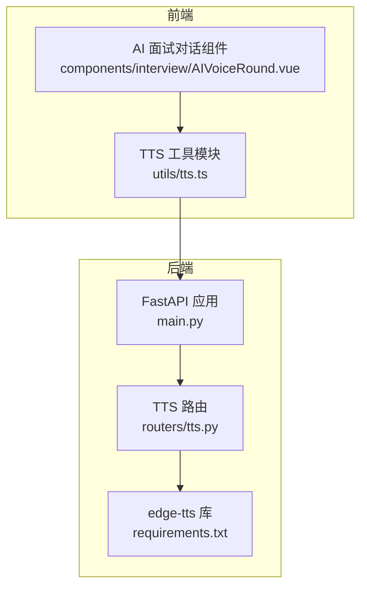
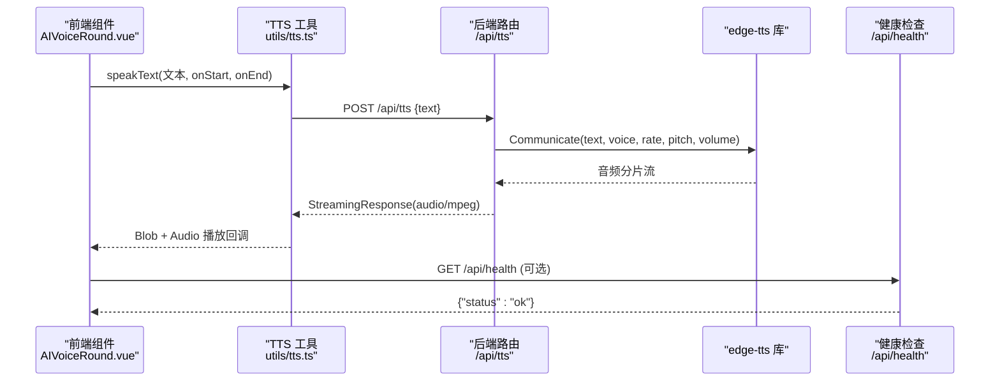
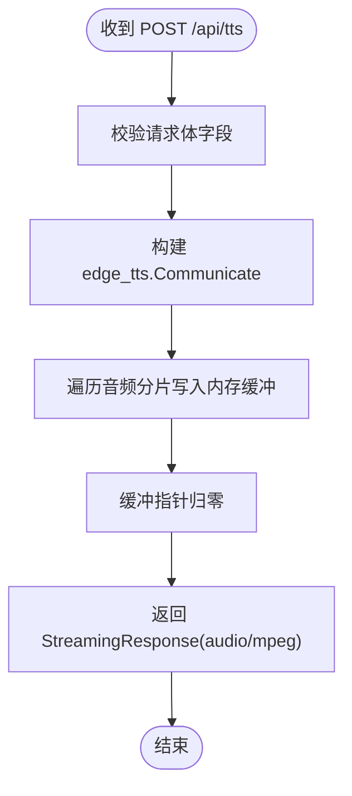
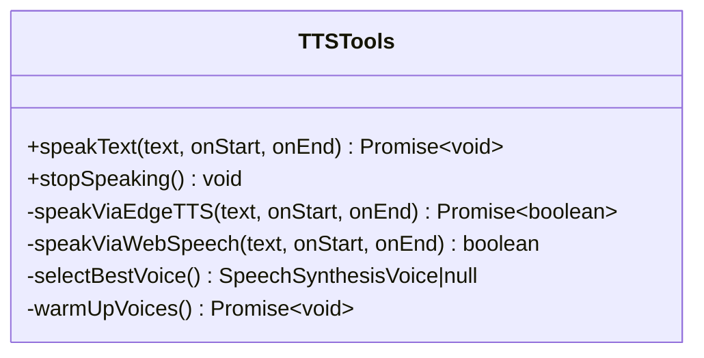
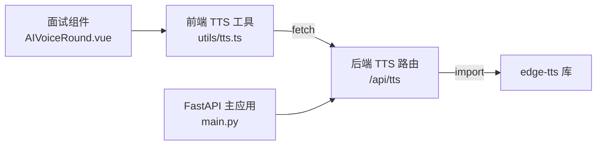

# 语音合成接口

<cite>
**本文引用的文件列表**
- [backEnd/app/routers/tts.py](file://backEnd/app/routers/tts.py)
- [backEnd/app/main.py](file://backEnd/app/main.py)
- [backEnd/requirements.txt](file://backEnd/requirements.txt)
- [frontEnd/src/utils/tts.ts](file://frontEnd/src/utils/tts.ts)
- [frontEnd/src/components/interview/AIVoiceRound.vue](file://frontEnd/src/components/interview/AIVoiceRound.vue)
</cite>

## 目录
1. [简介](#简介)
2. [项目结构](#项目结构)
3. [核心组件](#核心组件)
4. [架构总览](#架构总览)
5. [详细组件分析](#详细组件分析)
6. [依赖关系分析](#依赖关系分析)
7. [性能与扩展建议](#性能与扩展建议)
8. [故障排查指南](#故障排查指南)
9. [结论](#结论)
10. [附录：API 规范](#附录api-规范)

## 简介
本文件为 HR XF 系统的“文本转语音（TTS）”服务提供完整接口文档，覆盖以下方面：
- 文本转语音的接口规范：支持的文本格式、语言选项、语音风格等参数配置
- 音频文件的生成与返回格式：MP3 流式响应及前端播放方式
- 实时语音交互的实现方式：请求-响应流程、播放控制、音量调节
- 质量参数设置：语速、音调、情感表达等个性化选项
- 缓存与复用机制：当前实现说明与可扩展方案
- 状态监控与错误处理：健康检查、异常处理策略
- 前端集成与最佳实践：与面试对话组件的协作方式

## 项目结构
后端采用 FastAPI 路由组织功能，TTS 相关逻辑集中在独立路由模块；前端通过工具模块封装 TTS 调用，并在面试对话组件中消费。

图表来源
- [backEnd/app/main.py:44-68](file://backEnd/app/main.py#L44-L68)
- [backEnd/app/routers/tts.py:10-10](file://backEnd/app/routers/tts.py#L10-L10)
- [backEnd/requirements.txt:25-26](file://backEnd/requirements.txt#L25-L26)
- [frontEnd/src/utils/tts.ts:22-26](file://frontEnd/src/utils/tts.ts#L22-L26)
- [frontEnd/src/components/interview/AIVoiceRound.vue:146-147](file://frontEnd/src/components/interview/AIVoiceRound.vue#L146-L147)

章节来源
- [backEnd/app/main.py:44-68](file://backEnd/app/main.py#L44-L68)
- [backEnd/app/routers/tts.py:10-10](file://backEnd/app/routers/tts.py#L10-L10)
- [backEnd/requirements.txt:25-26](file://backEnd/requirements.txt#L25-L26)
- [frontEnd/src/utils/tts.ts:22-26](file://frontEnd/src/utils/tts.ts#L22-L26)
- [frontEnd/src/components/interview/AIVoiceRound.vue:146-147](file://frontEnd/src/components/interview/AIVoiceRound.vue#L146-L147)

## 核心组件
- 后端 TTS 路由
  - 提供文本转语音接口，默认使用高质量中文神经网络语音，支持语速、音调、音量等参数
  - 提供列出可用中文语音的查询接口
- 前端 TTS 工具模块
  - 优先调用后端 Edge TTS 接口，失败时自动降级到浏览器内置 Web Speech API
  - 管理音频播放生命周期、停止与资源释放
- 面试对话组件
  - 在 AI 回答生成后触发朗读，并维护说话状态与界面反馈

章节来源
- [backEnd/app/routers/tts.py:19-50](file://backEnd/app/routers/tts.py#L19-L50)
- [frontEnd/src/utils/tts.ts:151-167](file://frontEnd/src/utils/tts.ts#L151-L167)
- [frontEnd/src/components/interview/AIVoiceRound.vue:204-219](file://frontEnd/src/components/interview/AIVoiceRound.vue#L204-L219)

## 架构总览
整体数据流：前端发起文本转语音请求 → 后端聚合 edge-tts 生成 MP3 字节流 → 前端以 Blob 形式接收并通过 HTMLAudioElement 播放。同时提供健康检查与健康监控能力。

图表来源
- [frontEnd/src/components/interview/AIVoiceRound.vue:204-219](file://frontEnd/src/components/interview/AIVoiceRound.vue#L204-L219)
- [frontEnd/src/utils/tts.ts:22-56](file://frontEnd/src/utils/tts.ts#L22-L56)
- [backEnd/app/routers/tts.py:27-50](file://backEnd/app/routers/tts.py#L27-L50)
- [backEnd/app/main.py:87-89](file://backEnd/app/main.py#L87-L89)

## 详细组件分析

### 后端 TTS 路由
- 路由前缀：/api/tts
- 主要接口
  - POST /api/tts：文本转语音，返回 MP3 流
  - GET /api/tts/voices：列出可用的中文语音
- 请求体字段（POST）
  - text：待合成的文本（必填）
  - voice：语音名称（可选，默认 zh-CN-XiaoxiaoNeural）
  - rate：语速（可选，默认 -5%）
  - pitch：音调（可选，默认 +5Hz）
  - volume：音量（可选，默认 +0%）
- 响应
  - Content-Type: audio/mpeg
  - 响应体为 MP3 二进制流，可直接用于浏览器 Audio 播放
- 语音列表
  - 仅过滤出 locale 以 zh- 开头的语音，返回 name、gender、locale 三项

图表来源
- [backEnd/app/routers/tts.py:27-50](file://backEnd/app/routers/tts.py#L27-L50)

章节来源
- [backEnd/app/routers/tts.py:10-62](file://backEnd/app/routers/tts.py#L10-L62)

### 前端 TTS 工具模块
- 职责
  - 封装对后端 /api/tts 的调用
  - 管理 HTMLAudioElement 的生命周期（创建、播放、停止、资源释放）
  - 当后端不可用时，自动降级到浏览器 Web Speech API
- 关键函数
  - speakText(text, onStart, onEnd)：统一入口，先尝试后端，失败则降级
  - stopSpeaking()：停止当前播放并清理资源
- 播放控制
  - 每次播放前会停止之前的音频实例，避免并发冲突
  - 通过 onplay/onended/onerror 回调驱动 UI 状态
- 降级策略
  - 预热声线列表，选择优先级较高的中文语音
  - 若后端失败或网络异常，立即回退到本地合成

图表来源
- [frontEnd/src/utils/tts.ts:151-174](file://frontEnd/src/utils/tts.ts#L151-L174)
- [frontEnd/src/utils/tts.ts:13-56](file://frontEnd/src/utils/tts.ts#L13-L56)
- [frontEnd/src/utils/tts.ts:94-147](file://frontEnd/src/utils/tts.ts#L94-L147)

章节来源
- [frontEnd/src/utils/tts.ts:1-174](file://frontEnd/src/utils/tts.ts#L1-174)

### 面试对话组件集成
- 触发时机
  - AI 回答生成完成后，调用 speakText 进行朗读
  - 用户点击“重新朗读”按钮时，再次朗读上次 AI 回复
- 状态联动
  - isSpeaking 控制数字人动画状态
  - 朗读结束后恢复 idle 状态
- 资源清理
  - 组件卸载时调用 stopSpeaking，确保无残留播放任务

章节来源
- [frontEnd/src/components/interview/AIVoiceRound.vue:204-219](file://frontEnd/src/components/interview/AIVoiceRound.vue#L204-L219)
- [frontEnd/src/components/interview/AIVoiceRound.vue:375-383](file://frontEnd/src/components/interview/AIVoiceRound.vue#L375-L383)

## 依赖关系分析
- 后端依赖
  - FastAPI 路由与中间件
  - edge-tts 库用于高质量中文语音合成
- 前端依赖
  - fetch 调用后端接口
  - HTMLAudioElement 播放 MP3
  - Web Speech API 作为降级方案

图表来源
- [frontEnd/src/utils/tts.ts:22-26](file://frontEnd/src/utils/tts.ts#L22-L26)
- [backEnd/app/routers/tts.py:8-10](file://backEnd/app/routers/tts.py#L8-L10)
- [backEnd/app/main.py:60-68](file://backEnd/app/main.py#L60-L68)
- [backEnd/requirements.txt:25-26](file://backEnd/requirements.txt#L25-L26)

章节来源
- [backEnd/app/main.py:60-68](file://backEnd/app/main.py#L60-L68)
- [backEnd/requirements.txt:25-26](file://backEnd/requirements.txt#L25-L26)
- [frontEnd/src/utils/tts.ts:22-26](file://frontEnd/src/utils/tts.ts#L22-L26)
- [frontEnd/src/components/interview/AIVoiceRound.vue:146-147](file://frontEnd/src/components/interview/AIVoiceRound.vue#L146-L147)

## 性能与扩展建议
- 当前实现特点
  - 后端将音频分片收集到内存缓冲后再一次性返回，适合短文本场景
  - 前端以 Blob 方式接收并创建 Object URL，播放结束后及时释放
- 优化方向
  - 流式传输：后端直接以 StreamingResponse 逐块发送音频分片，减少内存占用与首包延迟
  - 服务端缓存：对相同文本+参数的结果进行缓存（如 Redis），降低重复合成开销
  - 并发控制：限制同一会话内并行 TTS 请求数量，避免音频抢占
  - 自适应降级：根据网络状况动态切换合成引擎或采样率
- 注意
  - 当前未实现服务端缓存与流式直传，如需提升性能可按上述建议迭代

[本节为通用性能讨论，不直接分析具体文件]

## 故障排查指南
- 常见问题
  - 后端不可用：前端自动降级到 Web Speech API，可在控制台查看警告信息
  - 浏览器不支持语音识别：录音功能不可用时提示改用文字输入
  - 跨域问题：确认后端 CORS 已允许前端域名
- 健康检查
  - 使用 GET /api/health 验证服务可用性
- 错误处理
  - 后端自定义了请求验证错误处理器，避免二进制内容导致的解码异常
  - 前端捕获 fetch 与播放异常，保证 UI 状态稳定

章节来源
- [backEnd/app/main.py:76-84](file://backEnd/app/main.py#L76-L84)
- [backEnd/app/main.py:87-89](file://backEnd/app/main.py#L87-L89)
- [frontEnd/src/utils/tts.ts:53-56](file://frontEnd/src/utils/tts.ts#L53-L56)
- [frontEnd/src/components/interview/AIVoiceRound.vue:232-236](file://frontEnd/src/components/interview/AIVoiceRound.vue#L232-L236)

## 结论
HR XF 的 TTS 服务在后端基于 edge-tts 提供高质量中文语音合成，在前端通过工具模块统一管理播放与降级策略，并与面试对话组件紧密集成。当前实现简洁可靠，后续可围绕流式传输与服务端缓存进一步提升性能与用户体验。

[本节为总结性内容，不直接分析具体文件]

## 附录：API 规范

### 文本转语音
- 方法：POST
- 路径：/api/tts
- 请求头：Content-Type: application/json
- 请求体
  - text：字符串，必填
  - voice：字符串，可选，默认 zh-CN-XiaoxiaoNeural
  - rate：字符串，可选，默认 -5%
  - pitch：字符串，可选，默认 +5Hz
  - volume：字符串，可选，默认 +0%
- 响应
  - Content-Type: audio/mpeg
  - 响应体：MP3 二进制流
- 示例（概念性描述）
  - 请求体包含 text 字段，其余参数可选
  - 响应为可直接由浏览器 Audio 元素播放的二进制数据

章节来源
- [backEnd/app/routers/tts.py:19-50](file://backEnd/app/routers/tts.py#L19-L50)

### 列出可用中文语音
- 方法：GET
- 路径：/api/tts/voices
- 响应体
  - voices：数组，每项包含 name、gender、locale
- 用途
  - 前端展示可选语音列表，供用户选择不同音色

章节来源
- [backEnd/app/routers/tts.py:53-62](file://backEnd/app/routers/tts.py#L53-L62)

### 健康检查
- 方法：GET
- 路径：/api/health
- 响应体
  - status：字符串，通常为 ok

章节来源
- [backEnd/app/main.py:87-89](file://backEnd/app/main.py#L87-L89)

### 前端集成要点
- 调用入口
  - speakText(text, onStart, onEnd)：统一播放入口
  - stopSpeaking()：停止播放并清理资源
- 播放控制
  - 每次播放前停止上一段音频，避免重叠
  - 通过回调更新 UI 状态（如数字人表情、按钮禁用）
- 降级策略
  - 后端不可用时自动切换到 Web Speech API，保障可用性
- 最佳实践
  - 在页面加载时预热声线列表，减少首次合成延迟
  - 合理设置 rate/pitch/volume，匹配面试官人设风格
  - 长文本建议分段合成与播放，提升交互流畅度

章节来源
- [frontEnd/src/utils/tts.ts:151-174](file://frontEnd/src/utils/tts.ts#L151-L174)
- [frontEnd/src/utils/tts.ts:72-92](file://frontEnd/src/utils/tts.ts#L72-L92)
- [frontEnd/src/components/interview/AIVoiceRound.vue:204-219](file://frontEnd/src/components/interview/AIVoiceRound.vue#L204-L219)