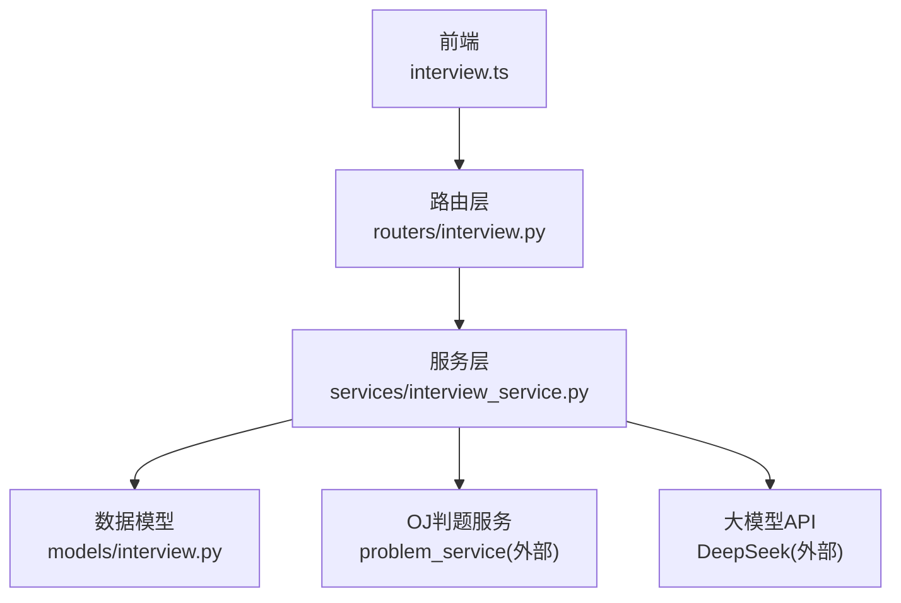
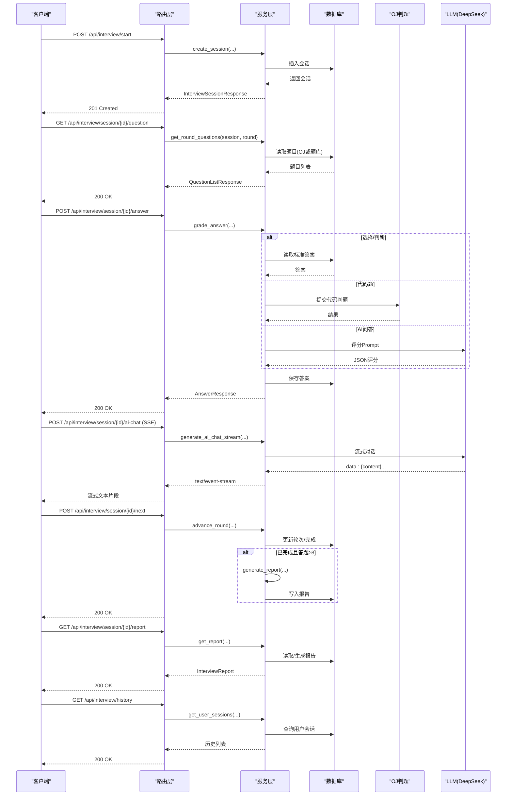
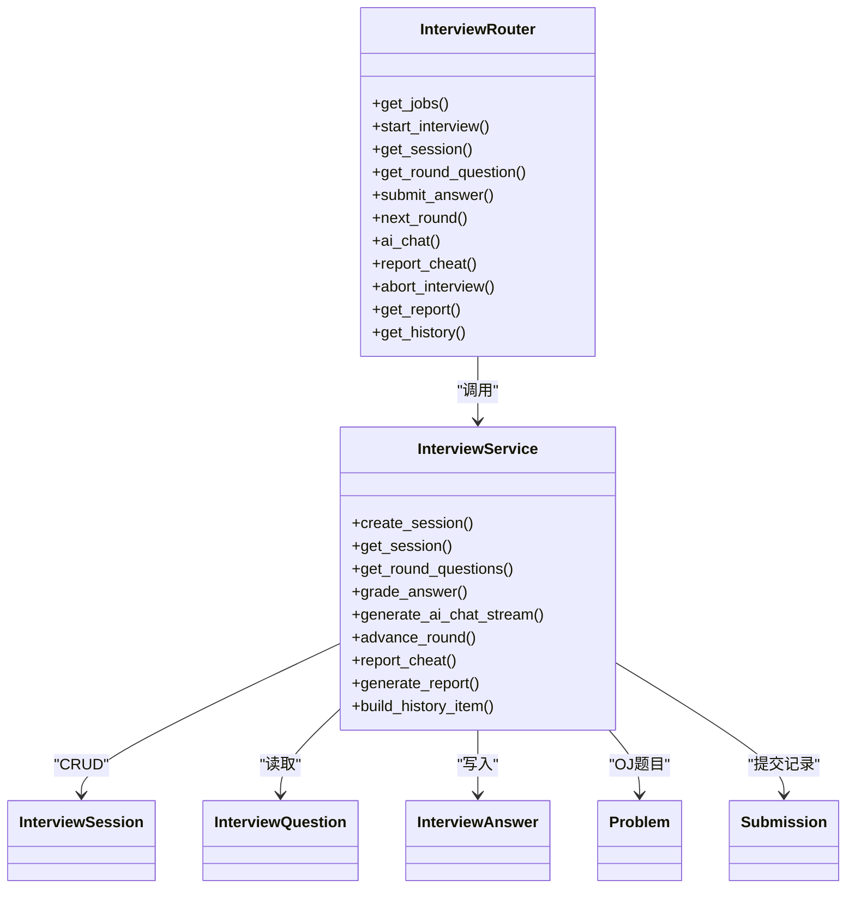

# 面试接口

<cite>
**本文引用的文件**   
- [backEnd/app/routers/interview.py](file://backEnd/app/routers/interview.py)
- [backEnd/app/schemas/interview.py](file://backEnd/app/schemas/interview.py)
- [backEnd/app/models/interview.py](file://backEnd/app/models/interview.py)
- [backEnd/app/services/interview_service.py](file://backEnd/app/services/interview_service.py)
- [frontEnd/src/stores/interview.ts](file://frontEnd/src/stores/interview.ts)
</cite>

## 目录
1. [简介](#简介)
2. [项目结构](#项目结构)
3. [核心组件](#核心组件)
4. [架构总览](#架构总览)
5. [详细接口说明](#详细接口说明)
6. [依赖关系分析](#依赖关系分析)
7. [性能与扩展性](#性能与扩展性)
8. [故障排查指南](#故障排查指南)
9. [结论](#结论)
10. [附录：SSE消息格式与前端用法](#附录sse消息格式与前端用法)

## 简介
本文件为 HR XF 系统“面试模拟模块”的完整 API 接口文档，覆盖以下能力：
- 面试会话生命周期管理：创建、获取状态、进入下一轮、中止/结束、切屏上报
- 多轮次面试流程：综合素质测评、技术面、业务面、AI语音三面、AI综合四面
- 题目生成与提交：选择题/判断题/代码题/开放题
- 实时评分：按题型与轮次计算分数并保存答案记录
- 报告生成与获取：总分、等级、雷达图维度、分轮详情、改进建议、AI综合分析
- SSE 流式 AI 对话：面试官多轮交互
- 历史记录查询：分页总数与列表

## 项目结构
后端采用 FastAPI + SQLAlchemy 异步 ORM，路由层负责请求校验与响应封装，服务层实现业务逻辑（题库、评分、报告、AI 对话），模型层定义数据库表结构。前端通过 Pinia Store 调用后端 REST/SSE 接口。

图表来源
- [backEnd/app/routers/interview.py:1-317](file://backEnd/app/routers/interview.py#L1-L317)
- [backEnd/app/services/interview_service.py:1-1202](file://backEnd/app/services/interview_service.py#L1-L1202)
- [backEnd/app/models/interview.py:1-114](file://backEnd/app/models/interview.py#L1-L114)
- [frontEnd/src/stores/interview.ts:1-313](file://frontEnd/src/stores/interview.ts#L1-L313)

章节来源
- [backEnd/app/routers/interview.py:1-317](file://backEnd/app/routers/interview.py#L1-L317)
- [backEnd/app/services/interview_service.py:1-1202](file://backEnd/app/services/interview_service.py#L1-L1202)
- [backEnd/app/models/interview.py:1-114](file://backEnd/app/models/interview.py#L1-L114)
- [frontEnd/src/stores/interview.ts:1-313](file://frontEnd/src/stores/interview.ts#L1-L313)

## 核心组件
- 路由层：提供 REST 接口与 SSE 流式响应
- 服务层：
  - 岗位分类与题库种子
  - 会话 CRUD、轮次推进、切屏上报
  - 题目获取（按轮次）
  - 答题评分（选择/判断/代码/AI问答）
  - 报告生成（总分、等级、雷达图、分轮详情、建议与分析）
  - AI 对话（SSE 流式转发）
- 数据模型：面试会话、题目、答案
- 前端 Store：统一封装 API 调用、SSE 解析、状态管理

章节来源
- [backEnd/app/routers/interview.py:1-317](file://backEnd/app/routers/interview.py#L1-L317)
- [backEnd/app/services/interview_service.py:1-1202](file://backEnd/app/services/interview_service.py#L1-L1202)
- [backEnd/app/models/interview.py:1-114](file://backEnd/app/models/interview.py#L1-L114)
- [frontEnd/src/stores/interview.ts:1-313](file://frontEnd/src/stores/interview.ts#L1-L313)

## 架构总览

图表来源
- [backEnd/app/routers/interview.py:1-317](file://backEnd/app/routers/interview.py#L1-L317)
- [backEnd/app/services/interview_service.py:1-1202](file://backEnd/app/services/interview_service.py#L1-L1202)
- [backEnd/app/models/interview.py:1-114](file://backEnd/app/models/interview.py#L1-L114)

## 详细接口说明

### 通用约定
- 基础路径：/api/interview
- 鉴权：除明确标注外，所有接口需携带认证头（Authorization: Bearer <token>）
- 错误码：HTTP 400/404/5xx；部分业务错误以 detail 字段描述
- 时间字段：ISO 8601 UTC

### 岗位列表
- 方法：GET
- 路径：/api/interview/jobs
- 权限：需要登录
- 响应：岗位分类数组，每类包含若干岗位对象（id/title/icon/description）

章节来源
- [backEnd/app/routers/interview.py:29-33](file://backEnd/app/routers/interview.py#L29-L33)
- [backEnd/app/services/interview_service.py:75-96](file://backEnd/app/services/interview_service.py#L75-L96)
- [backEnd/app/schemas/interview.py:7-16](file://backEnd/app/schemas/interview.py#L7-L16)

### 开始面试（创建会话）
- 方法：POST
- 路径：/api/interview/start
- 权限：需要登录
- 请求体：
  - job_category: string
  - job_title: string
  - interview_mode: string，默认 full；可选 single
  - target_round: string | null，仅 single 模式有效
- 响应：InterviewSessionResponse
  - id/job_category/job_title/current_round/status/cheat_count/interview_mode/target_round/rounds_progress/started_at
  - rounds_progress：当前轮次进度（pending/active/completed）
- 行为：
  - full 模式从 assessment 开始；single 模式从 target_round 开始
  - 返回 rounds_progress 用于前端展示步骤条

章节来源
- [backEnd/app/routers/interview.py:36-58](file://backEnd/app/routers/interview.py#L36-L58)
- [backEnd/app/services/interview_service.py:489-511](file://backEnd/app/services/interview_service.py#L489-L511)
- [backEnd/app/services/interview_service.py:46-66](file://backEnd/app/services/interview_service.py#L46-L66)
- [backEnd/app/schemas/interview.py:27-46](file://backEnd/app/schemas/interview.py#L27-L46)

### 获取会话状态
- 方法：GET
- 路径：/api/interview/session/{session_id}
- 权限：需要登录
- 响应：InterviewSessionResponse

章节来源
- [backEnd/app/routers/interview.py:61-82](file://backEnd/app/routers/interview.py#L61-L82)
- [backEnd/app/services/interview_service.py:514-519](file://backEnd/app/services/interview_service.py#L514-L519)

### 获取当前轮次题目
- 方法：GET
- 路径：/api/interview/session/{session_id}/question
- 权限：需要登录
- 约束：会话必须处于 in_progress
- 响应：QuestionListResponse
  - round: 当前轮次 key
  - questions: 题目列表
    - question_type: choice/judgment/code/open_ended
    - content: 题目内容（JSON）
    - time_limit: 秒
- 规则：
  - assessment：随机抽取10道综合素质题
  - tech：从 OJ 题库随机抽1题（code）
  - business：优先岗位类别，不足则补充通用题，最多5题
  - ai_voice_3/ai_voice_4：返回首轮引导问题（open_ended）

章节来源
- [backEnd/app/routers/interview.py:85-99](file://backEnd/app/routers/interview.py#L85-L99)
- [backEnd/app/services/interview_service.py:536-621](file://backEnd/app/services/interview_service.py#L536-L621)
- [backEnd/app/schemas/interview.py:51-60](file://backEnd/app/schemas/interview.py#L51-L60)

### 提交答案
- 方法：POST
- 路径：/api/interview/session/{session_id}/answer
- 权限：需要登录
- 约束：会话必须处于 in_progress
- 请求体：AnswerSubmit
  - question_id: string
  - answer: string | dict（选择题选项/开放题文本/代码题{code, language}）
  - duration_seconds: int
- 响应：AnswerResponse
  - correct: bool
  - score: float
  - feedback: string
  - correct_answer: string | dict | null
- 评分逻辑：
  - assessment/business（选择/判断）：与标准答案比较，正确得满分，否则0分
  - tech（代码）：调用 OJ 判题，accepted 得高分，编译错误0分，其他情况中等分
  - ai_voice_3/ai_voice_4（开放）：使用 LLM 评分（0-15分），返回反馈
  - 所有答案均持久化到 InterviewAnswer

章节来源
- [backEnd/app/routers/interview.py:102-119](file://backEnd/app/routers/interview.py#L102-L119)
- [backEnd/app/services/interview_service.py:628-740](file://backEnd/app/services/interview_service.py#L628-L740)
- [backEnd/app/schemas/interview.py:65-76](file://backEnd/app/schemas/interview.py#L65-L76)

### 进入下一轮
- 方法：POST
- 路径：/api/interview/session/{session_id}/next
- 权限：需要登录
- 约束：会话必须处于 in_progress
- 行为：
  - single 模式：完成后直接标记 completed
  - full 模式：按顺序推进至 assessment→tech→business→ai_voice_3→ai_voice_4→completed
  - 若会话变为 completed 且答题数≥3，自动生成报告
- 响应：InterviewSessionResponse

章节来源
- [backEnd/app/routers/interview.py:122-158](file://backEnd/app/routers/interview.py#L122-L158)
- [backEnd/app/services/interview_service.py:851-872](file://backEnd/app/services/interview_service.py#L851-L872)

### AI 多轮对话（SSE 流式）
- 方法：POST
- 路径：/api/interview/session/{session_id}/ai-chat
- 权限：需要登录
- 约束：会话必须处于 in_progress
- 请求体：AIChatRequest
  - messages: list[{role, content}]
  - round: ai_voice_3 或 ai_voice_4
- 响应：text/event-stream
  - 事件行格式：data: {content: "..."}\n\n
  - 结束标志：data: [DONE]\n\n
- 行为：
  - 根据轮次注入 system prompt（含岗位信息）
  - 将消息序列发送给 LLM，逐块转发 content
  - 前端可拼接 content 实现打字机效果

章节来源
- [backEnd/app/routers/interview.py:161-189](file://backEnd/app/routers/interview.py#L161-L189)
- [backEnd/app/services/interview_service.py:797-844](file://backEnd/app/services/interview_service.py#L797-L844)
- [backEnd/app/schemas/interview.py:80-88](file://backEnd/app/schemas/interview.py#L80-L88)

### 上报切屏次数
- 方法：POST
- 路径：/api/interview/session/{session_id}/cheat
- 权限：需要登录
- 请求体：CheatReport
  - cheat_count: int
- 行为：
  - 累计切屏次数
  - 达到阈值时自动中止面试（aborted）
- 响应：InterviewSessionResponse

章节来源
- [backEnd/app/routers/interview.py:192-216](file://backEnd/app/routers/interview.py#L192-L216)
- [backEnd/app/services/interview_service.py:879-886](file://backEnd/app/services/interview_service.py#L879-L886)
- [backEnd/app/schemas/interview.py:92-94](file://backEnd/app/schemas/interview.py#L92-L94)

### 中止面试
- 方法：POST
- 路径：/api/interview/session/{session_id}/abort
- 权限：需要登录
- 行为：
  - 设置状态为 aborted，记录完成时间
  - 若答题数≥3，自动生成报告
- 响应：InterviewSessionResponse

章节来源
- [backEnd/app/routers/interview.py:219-256](file://backEnd/app/routers/interview.py#L219-L256)

### 获取评分报告
- 方法：GET
- 路径：/api/interview/session/{session_id}/report
- 权限：需要登录
- 行为：
  - 若已有报告，直接返回
  - 若答题数<3，返回400提示无法生成
  - 否则生成报告并缓存到会话
- 响应：InterviewReport
  - session_id/job_category/job_title/interview_mode/target_round
  - total_score/max_total/grade
  - radar: {professional, logic, communication, match}
  - round_details: [{round_key, label, score, max_score, answers[]}]
  - suggestions: string[]
  - ai_analysis: string
  - completed_at

章节来源
- [backEnd/app/routers/interview.py:259-303](file://backEnd/app/routers/interview.py#L259-L303)
- [backEnd/app/services/interview_service.py:893-1019](file://backEnd/app/services/interview_service.py#L893-L1019)
- [backEnd/app/schemas/interview.py:98-128](file://backEnd/app/schemas/interview.py#L98-L128)

### 面试历史记录
- 方法：GET
- 路径：/api/interview/history
- 权限：需要登录
- 响应：InterviewHistoryResponse
  - total: int
  - sessions: InterviewHistoryItem[]
    - id/job_category/job_title/status/total_score/grade/cheat_count/interview_mode/target_round/started_at/completed_at

章节来源
- [backEnd/app/routers/interview.py:306-316](file://backEnd/app/routers/interview.py#L306-L316)
- [backEnd/app/services/interview_service.py:1174-1201](file://backEnd/app/services/interview_service.py#L1174-L1201)
- [backEnd/app/schemas/interview.py:133-152](file://backEnd/app/schemas/interview.py#L133-L152)

## 依赖关系分析
- 路由层依赖服务层进行业务编排，服务层依赖模型层读写数据库
- 技术面评分依赖 OJ 判题服务
- AI 相关（对话、评分、建议、分析）依赖外部 LLM（DeepSeek）
- 前端 Store 封装了所有接口调用与 SSE 解析

图表来源
- [backEnd/app/routers/interview.py:1-317](file://backEnd/app/routers/interview.py#L1-L317)
- [backEnd/app/services/interview_service.py:1-1202](file://backEnd/app/services/interview_service.py#L1-L1202)
- [backEnd/app/models/interview.py:1-114](file://backEnd/app/models/interview.py#L1-L114)

章节来源
- [backEnd/app/routers/interview.py:1-317](file://backEnd/app/routers/interview.py#L1-L317)
- [backEnd/app/services/interview_service.py:1-1202](file://backEnd/app/services/interview_service.py#L1-L1202)
- [backEnd/app/models/interview.py:1-114](file://backEnd/app/models/interview.py#L1-L114)

## 性能与扩展性
- 题目获取：assessment/business 使用随机抽样，避免全量加载；tech 使用 OJ 随机抽取
- 评分：选择/判断为本地匹配；代码题走 OJ 异步执行；AI 评分与对话使用流式传输降低首字节延迟
- 报告生成：仅在满足条件时触发，并缓存至会话，避免重复计算
- 可扩展点：
  - 题库支持按岗位类别动态扩展
  - AI Prompt 模板可按行业/岗位定制
  - 评分策略可配置（如难度权重、时间惩罚等）

[本节为通用指导，不直接分析具体文件]

## 故障排查指南
- 404 会话不存在：检查 session_id 是否正确、是否属于当前用户
- 400 面试已结束：确保在 in_progress 状态下操作
- 400 答题数量不足：生成报告前至少提交3题
- SSE 连接中断：检查网络与代理配置，确认服务端返回 data: ... 与 data: [DONE]
- AI 评分异常：服务降级会返回默认评分与提示，检查 LLM 配置与网络连通性

章节来源
- [backEnd/app/routers/interview.py:61-82](file://backEnd/app/routers/interview.py#L61-L82)
- [backEnd/app/routers/interview.py:85-99](file://backEnd/app/routers/interview.py#L85-L99)
- [backEnd/app/routers/interview.py:259-303](file://backEnd/app/routers/interview.py#L259-L303)
- [backEnd/app/services/interview_service.py:743-790](file://backEnd/app/services/interview_service.py#L743-L790)

## 结论
本模块围绕“面试会话”为核心，串联题目生成、答题评分、AI 对话与报告生成，形成完整的模拟面试闭环。通过单轮/全流程两种模式满足不同练习场景，结合 SSE 提升交互体验，并通过多维度评分与可视化报告辅助候选人自我提升。

[本节为总结性内容，不直接分析具体文件]

## 附录：SSE消息格式与前端用法

### SSE 消息格式
- 媒体类型：text/event-stream
- 事件行：data: {content: "..."}\n\n
- 结束标志：data: [DONE]\n\n
- 头部建议：Cache-Control=no-cache; Connection=keep-alive; X-Accel-Buffering=no

章节来源
- [backEnd/app/routers/interview.py:161-189](file://backEnd/app/routers/interview.py#L161-L189)
- [backEnd/app/services/interview_service.py:797-844](file://backEnd/app/services/interview_service.py#L797-L844)

### 前端使用方法（参考）
- 发起请求：POST /api/interview/session/{id}/ai-chat，携带 messages 与 round
- 读取流：使用 fetch + ReadableStream，逐行解析 data: 前缀
- 拼接内容：提取 content 字段并追加显示，遇到 [DONE] 停止
- 错误处理：非 2xx 状态码抛出错误；解析失败跳过无效行

章节来源
- [frontEnd/src/stores/interview.ts:209-253](file://frontEnd/src/stores/interview.ts#L209-L253)