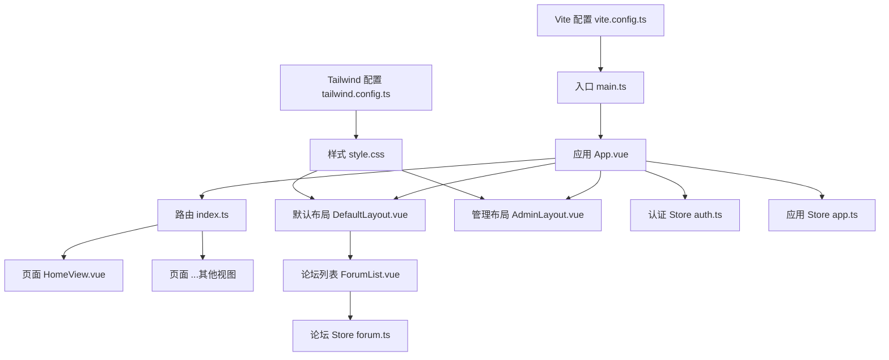
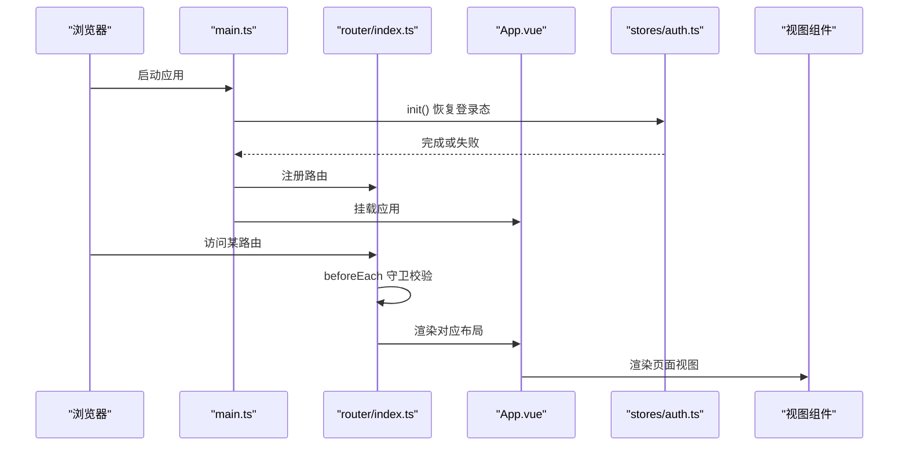
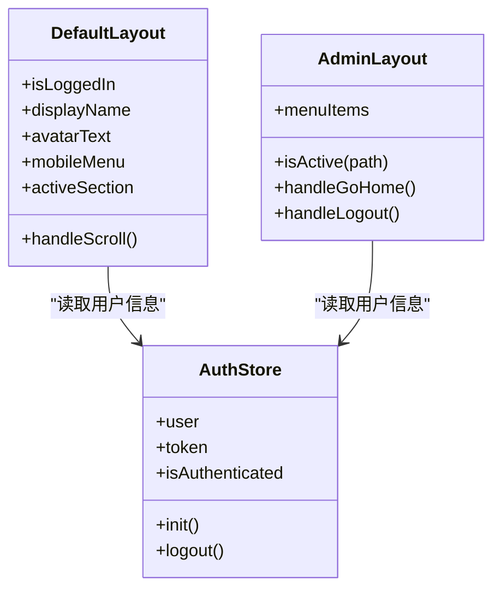
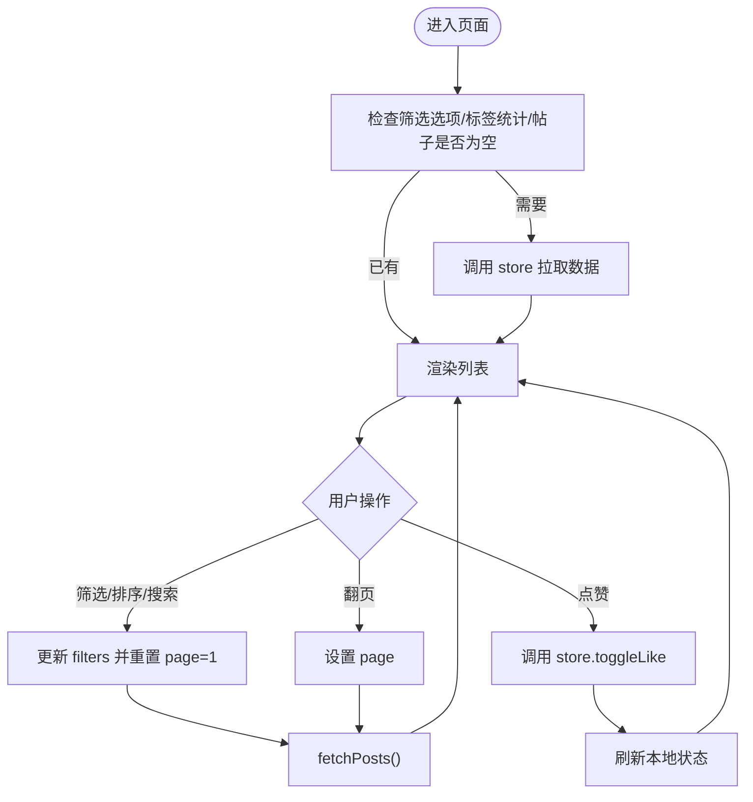
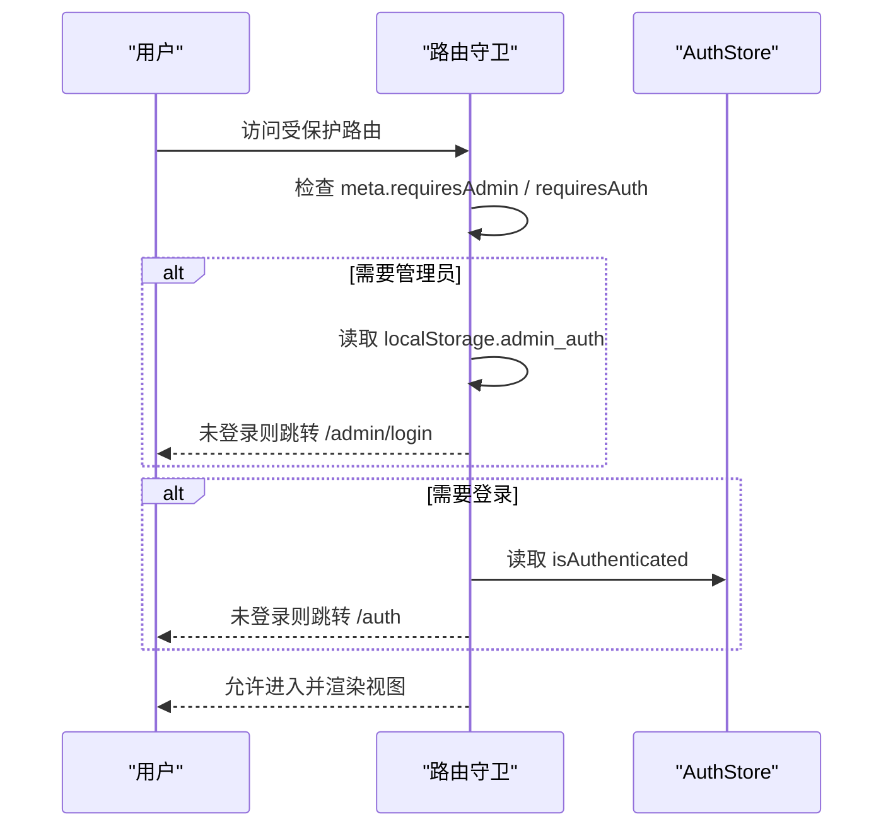
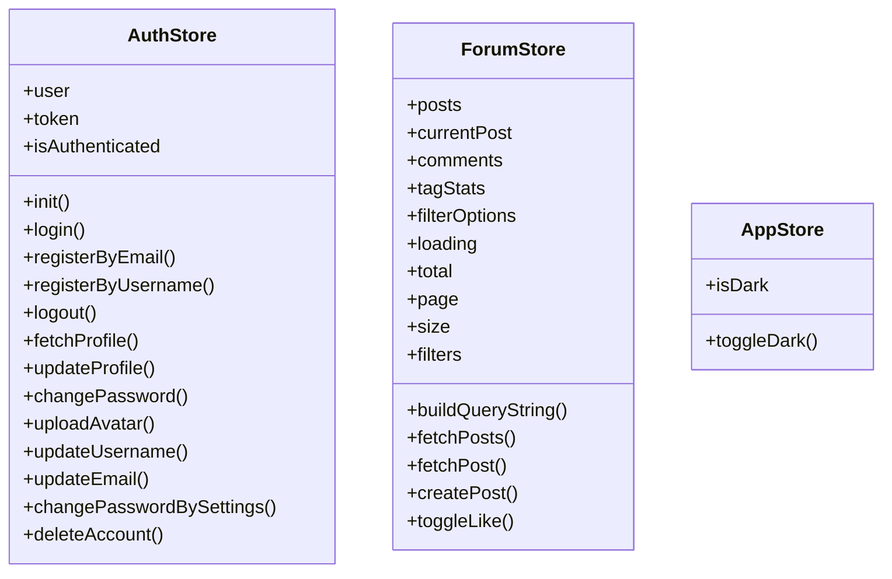
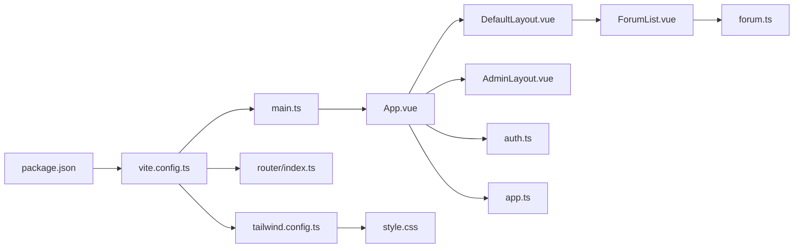

# 前端组件架构

<cite>
**本文引用的文件**   
- [main.ts](file://frontEnd/src/main.ts)
- [App.vue](file://frontEnd/src/App.vue)
- [index.ts](file://frontEnd/src/router/index.ts)
- [auth.ts](file://frontEnd/src/stores/auth.ts)
- [app.ts](file://frontEnd/src/stores/app.ts)
- [forum.ts](file://frontEnd/src/stores/forum.ts)
- [DefaultLayout.vue](file://frontEnd/src/components/DefaultLayout.vue)
- [AdminLayout.vue](file://frontEnd/src/components/AdminLayout.vue)
- [ForumList.vue](file://frontEnd/src/components/forum/ForumList.vue)
- [HomeView.vue](file://frontEnd/src/views/HomeView.vue)
- [style.css](file://frontEnd/src/style.css)
- [tailwind.config.ts](file://frontEnd/tailwind.config.ts)
- [vite.config.ts](file://frontEnd/vite.config.ts)
- [package.json](file://frontEnd/package.json)
</cite>

## 目录
1. [简介](#简介)
2. [项目结构](#项目结构)
3. [核心组件](#核心组件)
4. [架构总览](#架构总览)
5. [详细组件分析](#详细组件分析)
6. [依赖关系分析](#依赖关系分析)
7. [性能与优化](#性能与优化)
8. [故障排查指南](#故障排查指南)
9. [结论](#结论)
10. [附录：开发规范与最佳实践](#附录开发规范与最佳实践)

## 简介
本文件面向HR XF前端项目的开发者与维护者，系统化阐述Vue3 + Pinia + Vue Router + TailwindCSS的组件架构与工程化规范。内容覆盖：
- 组件层次、命名约定与目录组织
- Pinia状态管理（store定义、持久化、模块化）
- 路由配置与守卫（权限控制、懒加载）
- 样式策略与TailwindCSS使用规范
- 组件通信模式与事件处理
- 可复用组件设计模式与最佳实践
- 性能优化技巧与调试方法

## 项目结构
前端采用按“功能域+层级”混合的组织方式：
- src/components：通用布局与业务子模块组件（如论坛、面试等）
- src/views：页面级视图
- src/stores：按领域划分的Pinia store
- src/router：路由定义与全局守卫
- src/utils：工具函数
- src/types：类型声明
- 根级配置文件：vite.config.ts、tailwind.config.ts、package.json、style.css

图表来源
- [main.ts:1-19](file://frontEnd/src/main.ts#L1-L19)
- [App.vue:1-21](file://frontEnd/src/App.vue#L1-L21)
- [index.ts:1-167](file://frontEnd/src/router/index.ts#L1-L167)
- [DefaultLayout.vue:1-139](file://frontEnd/src/components/DefaultLayout.vue#L1-L139)
- [AdminLayout.vue:1-110](file://frontEnd/src/components/AdminLayout.vue#L1-L110)
- [ForumList.vue:1-259](file://frontEnd/src/components/forum/ForumList.vue#L1-L259)
- [auth.ts:1-314](file://frontEnd/src/stores/auth.ts#L1-L314)
- [app.ts:1-18](file://frontEnd/src/stores/app.ts#L1-L18)
- [forum.ts:1-200](file://frontEnd/src/stores/forum.ts#L1-L200)
- [HomeView.vue:1-200](file://frontEnd/src/views/HomeView.vue#L1-L200)
- [style.css:1-147](file://frontEnd/src/style.css#L1-L147)
- [tailwind.config.ts:1-31](file://frontEnd/tailwind.config.ts#L1-L31)
- [vite.config.ts:1-22](file://frontEnd/vite.config.ts#L1-L22)

章节来源
- [main.ts:1-19](file://frontEnd/src/main.ts#L1-L19)
- [App.vue:1-21](file://frontEnd/src/App.vue#L1-L21)
- [index.ts:1-167](file://frontEnd/src/router/index.ts#L1-L167)
- [package.json:1-35](file://frontEnd/package.json#L1-L35)

## 核心组件
- 应用入口与初始化
  - 创建Vue应用、注册Pinia与Router、在挂载前恢复登录态
- 布局组件
  - DefaultLayout：公共导航、移动端菜单、滚动高亮、用户信息展示
  - AdminLayout：侧边栏导航、管理员标签、退出与返回首页
- 页面视图
  - HomeView：首页落地页，包含功能介绍、流程说明、技术栈展示等
- 业务组件
  - ForumList：帖子列表、筛选、分页、点赞、分享等交互

章节来源
- [main.ts:1-19](file://frontEnd/src/main.ts#L1-L19)
- [DefaultLayout.vue:1-139](file://frontEnd/src/components/DefaultLayout.vue#L1-L139)
- [AdminLayout.vue:1-110](file://frontEnd/src/components/AdminLayout.vue#L1-L110)
- [HomeView.vue:1-200](file://frontEnd/src/views/HomeView.vue#L1-L200)
- [ForumList.vue:1-259](file://frontEnd/src/components/forum/ForumList.vue#L1-L259)

## 架构总览
整体采用“单入口 + 多布局 + 多Store + 路由守卫”的前端架构：
- 入口层：main.ts负责应用装配与鉴权初始化
- 路由层：集中式路由表，配合beforeEach实现普通用户与管理端双重守卫
- 布局层：根据meta.layout选择不同布局容器
- 状态层：按领域拆分store，封装API请求与本地持久化
- 视图层：页面级组件组合布局与业务组件
- 样式层：TailwindCSS + 自定义主题与全局样式

图表来源
- [main.ts:1-19](file://frontEnd/src/main.ts#L1-L19)
- [index.ts:1-167](file://frontEnd/src/router/index.ts#L1-L167)
- [App.vue:1-21](file://frontEnd/src/App.vue#L1-L21)
- [auth.ts:1-314](file://frontEnd/src/stores/auth.ts#L1-L314)

## 详细组件分析

### 布局组件体系
- 职责划分
  - DefaultLayout：面向普通用户的顶部导航、移动端菜单、滚动锚点高亮、用户头像与名称展示
  - AdminLayout：管理后台侧边栏、菜单高亮、退出与返回首页
- 交互要点
  - 移动端菜单开关、滚动监听更新当前区块高亮
  - 管理员菜单项动态匹配当前路由路径前缀
- 数据绑定
  - 通过useAuthStore获取用户信息与登录态

图表来源
- [DefaultLayout.vue:1-139](file://frontEnd/src/components/DefaultLayout.vue#L1-L139)
- [AdminLayout.vue:1-110](file://frontEnd/src/components/AdminLayout.vue#L1-L110)
- [auth.ts:1-314](file://frontEnd/src/stores/auth.ts#L1-L314)

章节来源
- [DefaultLayout.vue:1-139](file://frontEnd/src/components/DefaultLayout.vue#L1-L139)
- [AdminLayout.vue:1-110](file://frontEnd/src/components/AdminLayout.vue#L1-L110)

### 论坛列表组件（ForumList）
- 职责
  - 聚合筛选面板、帖子列表、热门标签、分页等
- 数据流
  - 从useForumStore拉取posts、filterOptions、tagStats
  - 触发筛选/排序/搜索后重置页码并重新拉取
- 事件
  - 向上抛出create/detail事件，供父组件处理跳转与新建
- 交互
  - 点赞、复制分享链接、展开/收起热门标签

图表来源
- [ForumList.vue:1-259](file://frontEnd/src/components/forum/ForumList.vue#L1-L259)
- [forum.ts:1-200](file://frontEnd/src/stores/forum.ts#L1-L200)

章节来源
- [ForumList.vue:1-259](file://frontEnd/src/components/forum/ForumList.vue#L1-L259)
- [forum.ts:1-200](file://frontEnd/src/stores/forum.ts#L1-L200)

### 认证与权限（路由守卫）
- 普通用户守卫
  - requiresAuth为true的路由未登录时跳转到登录页
  - 已登录访问登录页则重定向到仪表盘
- 管理员守卫
  - requiresAdmin为true的路由需检查admin_auth标记
  - 已登录管理员访问登录页直接跳转管理后台
- 懒加载
  - 所有路由component均使用动态import实现按需加载

图表来源
- [index.ts:1-167](file://frontEnd/src/router/index.ts#L1-L167)
- [auth.ts:1-314](file://frontEnd/src/stores/auth.ts#L1-L314)

章节来源
- [index.ts:1-167](file://frontEnd/src/router/index.ts#L1-L167)

### 状态管理模式（Pinia）
- 模块化组织
  - auth.ts：用户认证、资料、头像上传、账号设置等
  - forum.ts：帖子、评论、标签统计、筛选与分页
  - app.ts：应用级状态（如暗黑模式）
- 统一API客户端
  - 各store内封装apiRequest，自动注入Authorization头
  - 错误处理返回结构化消息
- 持久化策略
  - 登录态：localStorage中保存auth_token与auth_user
  - 应用启动时调用authStore.init()恢复会话
  - 管理员登录态：localStorage中保存admin_auth

图表来源
- [auth.ts:1-314](file://frontEnd/src/stores/auth.ts#L1-L314)
- [forum.ts:1-200](file://frontEnd/src/stores/forum.ts#L1-L200)
- [app.ts:1-18](file://frontEnd/src/stores/app.ts#L1-L18)

章节来源
- [auth.ts:1-314](file://frontEnd/src/stores/auth.ts#L1-L314)
- [forum.ts:1-200](file://frontEnd/src/stores/forum.ts#L1-L200)
- [app.ts:1-18](file://frontEnd/src/stores/app.ts#L1-L18)

## 依赖关系分析
- 构建与插件
  - Vite + @vitejs/plugin-vue + @tailwindcss/vite
  - 别名@指向src目录
  - 开发代理将/api转发至后端服务
- 运行时依赖
  - vue、vue-router、pinia、echarts、pdfjs-dist、three等
- 样式系统
  - TailwindCSS v4 + 自定义主题色与字体
  - 全局样式定义Memphis风格组件类与滚动条

图表来源
- [package.json:1-35](file://frontEnd/package.json#L1-L35)
- [vite.config.ts:1-22](file://frontEnd/vite.config.ts#L1-L22)
- [tailwind.config.ts:1-31](file://frontEnd/tailwind.config.ts#L1-L31)
- [index.ts:1-167](file://frontEnd/src/router/index.ts#L1-L167)
- [main.ts:1-19](file://frontEnd/src/main.ts#L1-L19)
- [App.vue:1-21](file://frontEnd/src/App.vue#L1-L21)
- [DefaultLayout.vue:1-139](file://frontEnd/src/components/DefaultLayout.vue#L1-L139)
- [AdminLayout.vue:1-110](file://frontEnd/src/components/AdminLayout.vue#L1-L110)
- [ForumList.vue:1-259](file://frontEnd/src/components/forum/ForumList.vue#L1-L259)
- [forum.ts:1-200](file://frontEnd/src/stores/forum.ts#L1-L200)
- [auth.ts:1-314](file://frontEnd/src/stores/auth.ts#L1-L314)
- [app.ts:1-18](file://frontEnd/src/stores/app.ts#L1-L18)
- [style.css:1-147](file://frontEnd/src/style.css#L1-L147)

章节来源
- [package.json:1-35](file://frontEnd/package.json#L1-L35)
- [vite.config.ts:1-22](file://frontEnd/vite.config.ts#L1-L22)
- [tailwind.config.ts:1-31](file://frontEnd/tailwind.config.ts#L1-L31)
- [style.css:1-147](file://frontEnd/src/style.css#L1-L147)

## 性能与优化
- 路由懒加载
  - 所有路由使用动态import，减少首屏体积
- 组件按需加载
  - 大体积第三方库（如ECharts、PDF.js、Three.js）建议结合路由或组件级懒加载
- 网络请求
  - 统一封装apiRequest，避免重复逻辑；必要时增加重试与超时控制
- 列表渲染
  - 大数据量列表考虑虚拟滚动或分页加载
- 样式与主题
  - 使用TailwindCSS原子类，减少自定义CSS；按需生成样式，减小产物
- 构建优化
  - 合理配置Vite分包与缓存策略；生产环境开启压缩与Tree Shaking

[本节为通用指导，不直接分析具体文件]

## 故障排查指南
- 登录态异常
  - 检查localStorage中的auth_token与auth_user是否一致
  - 确认authStore.init()是否成功调用并正确恢复用户信息
- 路由守卫拦截
  - 检查路由meta.requiresAuth与requiresAdmin是否正确设置
  - 确认管理员登录态admin_auth是否被清除或过期
- API请求失败
  - 查看apiRequest的错误分支，确认后端返回detail字段
  - 检查Vite代理配置是否生效（/api转发到后端）
- 样式问题
  - 确认TailwindCSS配置content路径包含所有源文件
  - 检查全局样式是否覆盖了关键类名

章节来源
- [auth.ts:1-314](file://frontEnd/src/stores/auth.ts#L1-L314)
- [index.ts:1-167](file://frontEnd/src/router/index.ts#L1-L167)
- [vite.config.ts:1-22](file://frontEnd/vite.config.ts#L1-L22)
- [tailwind.config.ts:1-31](file://frontEnd/tailwind.config.ts#L1-L31)
- [style.css:1-147](file://frontEnd/src/style.css#L1-L147)

## 结论
本项目以清晰的层次结构与模块化设计为基础，结合Pinia的状态管理与Vue Router的守卫机制，实现了良好的可扩展性与可维护性。通过统一的样式系统与构建配置，保证了视觉一致性与构建效率。遵循本文档的规范与实践，可进一步提升团队协作效率与用户体验。

[本节为总结性内容，不直接分析具体文件]

## 附录：开发规范与最佳实践
- 组件命名与组织
  - 组件文件使用PascalCase，目录按功能域划分（如components/forum、components/interview）
  - 布局组件置于components根目录，业务组件按域分目录
- 状态管理
  - 每个领域一个store，保持单一职责；对外暴露最小必要接口
  - 敏感数据仅存于内存，非敏感配置可持久化
- 路由设计
  - 路由元信息meta用于布局与权限控制；统一守卫逻辑集中在index.ts
  - 页面组件尽量懒加载，复杂页面内部再按需引入重型依赖
- 样式规范
  - 优先使用TailwindCSS原子类；自定义主题在tailwind.config.ts与style.css中集中管理
  - 复用通用样式类（如memphis-btn-primary、memphis-card），避免重复定义
- 组件通信
  - 父子通信：props与emits；跨层级通信：provide/inject或Pinia
  - 事件命名清晰，避免过度耦合
- 可复用组件设计
  - 输入输出明确，行为可配置；提供默认值与边界处理
  - 对复杂交互进行抽象，抽取为独立小组件（如StatusBadge、InfoChip）
- 调试与测试
  - 利用浏览器控制台与Vue Devtools观察状态变化
  - 对关键store与组件编写单元测试与集成测试

[本节为通用指导，不直接分析具体文件]