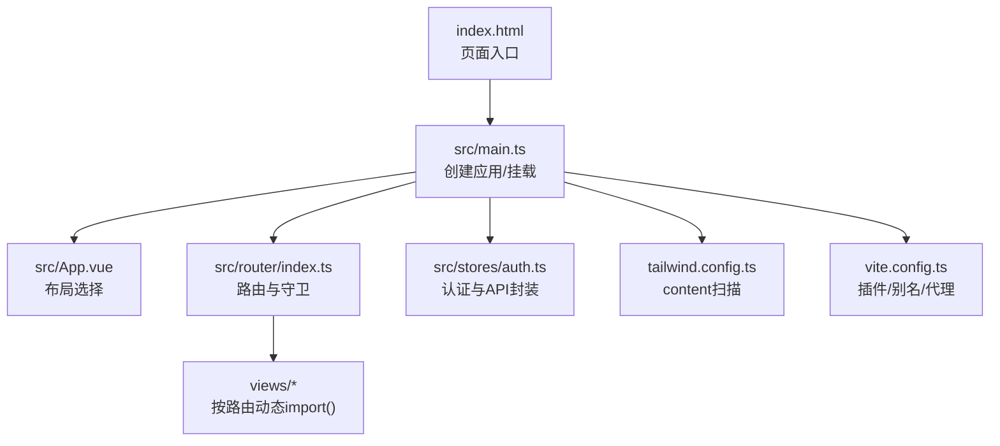
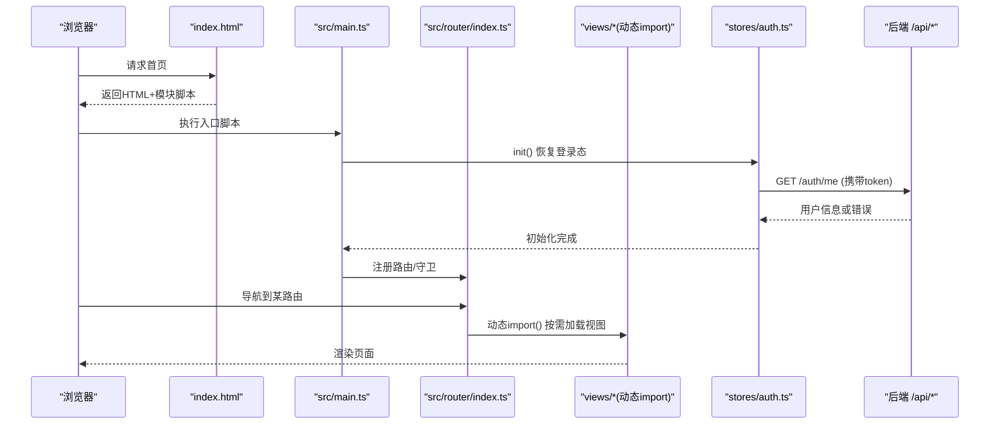
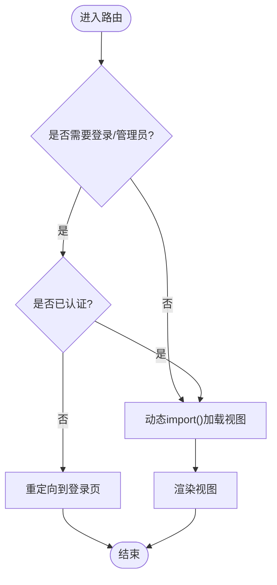
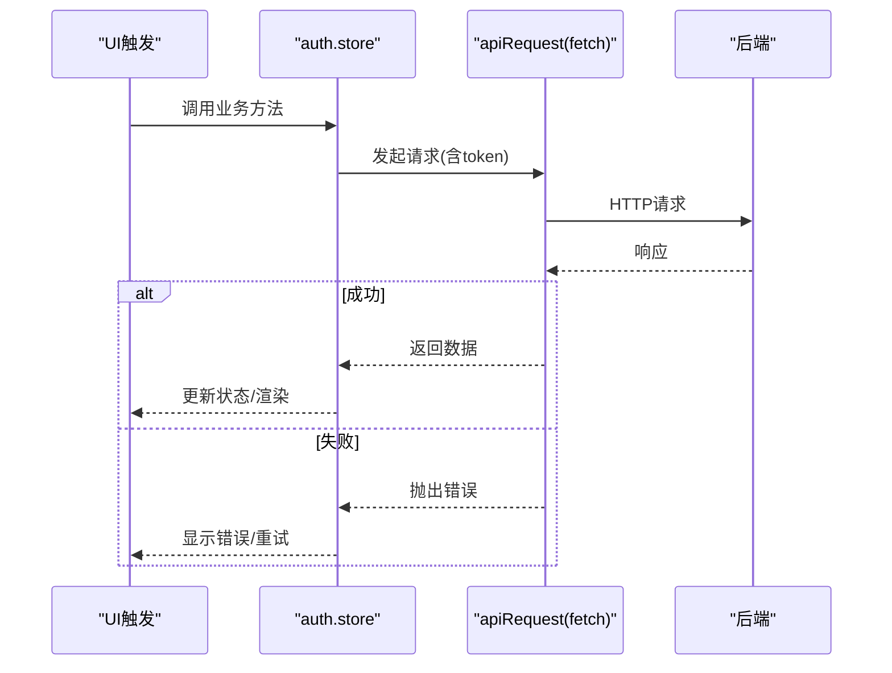
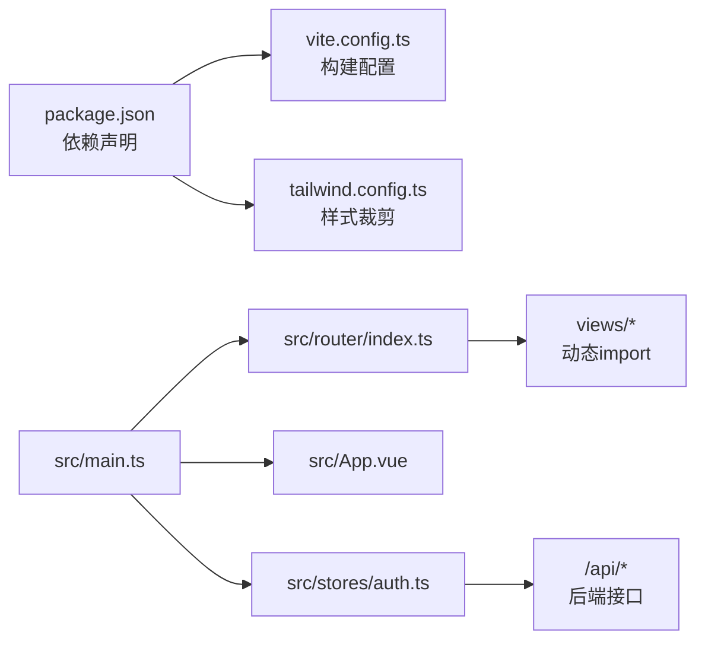

# 性能优化策略

<cite>
**本文引用的文件**   
- [vite.config.ts](file://frontEnd/vite.config.ts)
- [package.json](file://frontEnd/package.json)
- [index.html](file://frontEnd/index.html)
- [tailwind.config.ts](file://frontEnd/tailwind.config.ts)
- [tsconfig.json](file://frontEnd/tsconfig.json)
- [main.ts](file://frontEnd/src/main.ts)
- [App.vue](file://frontEnd/src/App.vue)
- [router/index.ts](file://frontEnd/src/router/index.ts)
- [stores/auth.ts](file://frontEnd/src/stores/auth.ts)
</cite>

## 目录
1. [简介](#简介)
2. [项目结构](#项目结构)
3. [核心组件](#核心组件)
4. [架构总览](#架构总览)
5. [详细组件分析](#详细组件分析)
6. [依赖分析](#依赖分析)
7. [性能考虑](#性能考虑)
8. [故障排查指南](#故障排查指南)
9. [结论](#结论)
10. [附录](#附录)

## 简介
本文件面向HR XF前端项目的性能优化，围绕Vite构建配置、代码分割与懒加载、资源优化、运行时性能、网络请求优化、监控诊断、打包体积与部署优化、基准测试与持续监控等方面提供系统化指导。文档结合仓库现有实现（路由级动态导入、Tailwind内容裁剪、字体预连接等）给出可落地的优化建议与最佳实践。

## 项目结构
前端采用Vue 3 + Vite + TypeScript + TailwindCSS技术栈，入口为index.html，应用初始化在src/main.ts中完成，路由定义位于src/router/index.ts，状态管理使用Pinia，样式由Tailwind处理。

图表来源
- [index.html:1-31](file://frontEnd/index.html#L1-L31)
- [main.ts:1-19](file://frontEnd/src/main.ts#L1-L19)
- [App.vue:1-21](file://frontEnd/src/App.vue#L1-L21)
- [router/index.ts:1-167](file://frontEnd/src/router/index.ts#L1-L167)
- [stores/auth.ts:1-314](file://frontEnd/src/stores/auth.ts#L1-L314)
- [tailwind.config.ts:1-31](file://frontEnd/tailwind.config.ts#L1-L31)
- [vite.config.ts:1-22](file://frontEnd/vite.config.ts#L1-L22)

章节来源
- [index.html:1-31](file://frontEnd/index.html#L1-L31)
- [main.ts:1-19](file://frontEnd/src/main.ts#L1-L19)
- [App.vue:1-21](file://frontEnd/src/App.vue#L1-L21)
- [router/index.ts:1-167](file://frontEnd/src/router/index.ts#L1-L167)
- [tailwind.config.ts:1-31](file://frontEnd/tailwind.config.ts#L1-L31)
- [vite.config.ts:1-22](file://frontEnd/vite.config.ts#L1-L22)

## 核心组件
- 构建与开发服务器：Vite + Vue插件 + Tailwind插件；路径别名；开发代理到后端。
- 路由与权限：基于vue-router的动态import实现路由级代码分割；beforeEach统一鉴权与管理员守卫。
- 状态与网络：Pinia store集中管理用户态；统一的apiRequest封装fetch并注入Authorization头；本地持久化token与用户信息。
- 样式与字体：Tailwind content精准扫描；Google Fonts预连接与按需加载。

章节来源
- [vite.config.ts:1-22](file://frontEnd/vite.config.ts#L1-L22)
- [router/index.ts:1-167](file://frontEnd/src/router/index.ts#L1-L167)
- [stores/auth.ts:1-314](file://frontEnd/src/stores/auth.ts#L1-L314)
- [tailwind.config.ts:1-31](file://frontEnd/tailwind.config.ts#L1-L31)
- [index.html:1-31](file://frontEnd/index.html#L1-L31)

## 架构总览
下图展示从浏览器加载到首屏渲染的关键路径，以及当前已实现的懒加载与缓存点。

图表来源
- [index.html:1-31](file://frontEnd/index.html#L1-L31)
- [main.ts:1-19](file://frontEnd/src/main.ts#L1-L19)
- [router/index.ts:1-167](file://frontEnd/src/router/index.ts#L1-L167)
- [stores/auth.ts:1-314](file://frontEnd/src/stores/auth.ts#L1-L314)

## 详细组件分析

### 构建与Vite配置优化
- 插件与别名：启用@vitejs/plugin-vue与@tailwindcss/vite；通过resolve.alias将'@'映射到src，提升解析效率与可读性。
- 开发代理：server.proxy将/api转发至本地后端，避免跨域问题。
- 建议增强项（未在当前仓库实现，供参考）：
  - 生产环境开启压缩与分包：build.minify、build.rollupOptions.output.manualChunks、build.chunkSizeWarningLimit。
  - 静态资源哈希与长缓存：默认Vite产物带hash，配合CDN缓存策略更佳。
  - 第三方库按需引入：对大依赖（如echarts、three、pdfjs-dist）进行按需引入或外部化，降低主包体积。
  - 构建目标与polyfill：根据目标浏览器设置build.target，减少不必要的兼容代码。

章节来源
- [vite.config.ts:1-22](file://frontEnd/vite.config.ts#L1-L22)
- [package.json:1-35](file://frontEnd/package.json#L1-L35)

### 路由级代码分割与懒加载
- 现状：所有路由的component均使用动态import()，天然形成路由级代码分割，首屏仅加载必要模块。
- 建议：
  - 对超大视图（如OJ题解、面试报告）进一步拆分为子模块，按需加载。
  - 对公共布局组件（AdminLayout、DefaultLayout）保持同步引入，避免二次跳转闪烁。
  - 结合路由元信息requiresAuth与beforeEach守卫，确保未授权时不加载受保护页面。

图表来源
- [router/index.ts:1-167](file://frontEnd/src/router/index.ts#L1-L167)

章节来源
- [router/index.ts:1-167](file://frontEnd/src/router/index.ts#L1-L167)

### 资源优化（图片、字体、静态资源）
- 字体优化：
  - 已在index.html中使用preconnect与display=swap策略，减少字体阻塞与FOIT风险。
  - 建议：优先使用系统字体回退；若必须使用WebFont，考虑自托管并开启HTTP/2多路复用与强缓存。
- 图片与媒体：
  - 建议使用现代格式（WebP/AVIF），并在构建阶段进行压缩与尺寸适配。
  - 大图采用懒加载与占位图，避免首屏阻塞。
- 静态资源缓存：
  - Vite产物自带内容哈希，建议CDN开启长期缓存与版本更新策略。
  - 对非版本化资源（如favicon）谨慎设置缓存，必要时使用独立域名与短缓存。

章节来源
- [index.html:1-31](file://frontEnd/index.html#L1-L31)

### 运行时性能优化（Vue组件、内存、渲染）
- 组件层面：
  - 合理使用computed/watch，避免过度监听；对大数据列表使用虚拟滚动。
  - 大型图表（ECharts）与3D模型（Three/VRM）建议在进入页面时再初始化，离开时销毁实例释放内存。
- 状态管理：
  - Pinia store中避免持有过大对象引用；在登出或页面卸载时清理敏感数据与订阅。
- 渲染优化：
  - 合理使用v-memo、key稳定绑定，减少不必要的重渲染。
  - 复杂表单与长列表分页加载，避免一次性渲染过多节点。

章节来源
- [stores/auth.ts:1-314](file://frontEnd/src/stores/auth.ts#L1-L314)
- [package.json:1-35](file://frontEnd/package.json#L1-L35)

### 网络请求优化（合并、缓存、重试）
- 现状：
  - stores/auth.ts内封装了统一的apiRequest，自动注入Authorization头，并对错误进行统一抛出。
  - 登录态在应用启动时通过init()恢复并校验，减少重复登录。
- 建议增强：
  - 请求去抖与节流：对高频操作（搜索、筛选）增加防抖/节流。
  - 请求合并：对短时间内多次相同请求进行合并，减少冗余网络开销。
  - 缓存策略：对GET类只读接口增加内存缓存或HTTP缓存（ETag/Last-Modified）。
  - 错误重试与降级：对幂等请求实现指数退避重试；失败时提供友好提示与重试按钮。
  - 超时控制：为每个请求设置合理超时时间，避免长时间挂起。

图表来源
- [stores/auth.ts:1-314](file://frontEnd/src/stores/auth.ts#L1-L314)

章节来源
- [stores/auth.ts:1-314](file://frontEnd/src/stores/auth.ts#L1-L314)

### 监控与诊断工具
- 构建期：
  - 使用Vite内置分析插件（如rollup-plugin-visualizer）生成包体积报告，定位大依赖与重复打包。
- 运行期：
  - 使用浏览器Performance面板记录关键指标（FCP/LCP/CLS/TBT/INP）。
  - 使用Memory面板检测内存泄漏（特别是图表/3D实例未释放）。
  - 使用Network面板分析请求耗时、缓存命中与带宽占用。
- 埋点与上报：
  - 在关键路由切换、异步任务完成处上报耗时与错误，建立基线与告警。

[本节为通用方法论，不直接分析具体文件]

### 打包体积优化与部署优化
- 依赖瘦身：
  - 对echarts、three、pdfjs-dist等大依赖进行按需引入或外部化（CDN）。
  - 移除未使用的Tailwind类：已通过tailwind.config.ts的content精确扫描，保持最小CSS。
- 构建优化：
  - 开启gzip/brotli压缩；拆分vendor与业务chunk；限制chunk大小警告阈值。
- 部署优化：
  - 使用HTTP/2或HTTP/3；开启CDN与长缓存；对HTML使用短缓存或无缓存以保证版本更新。
  - 预取与预加载：对首屏关键资源使用preload，对次级资源使用prefetch。

章节来源
- [tailwind.config.ts:1-31](file://frontEnd/tailwind.config.ts#L1-L31)
- [package.json:1-35](file://frontEnd/package.json#L1-L35)

### 性能基准测试与持续监控
- 基准测试：
  - 使用Lighthouse CI或WebPageTest对关键页面进行自动化评测，设定阈值与回归检查。
  - 针对首屏关键路径（Home/Dashboard）建立RUM埋点，收集真实用户指标。
- 持续监控：
  - 将性能指标纳入CI流水线，失败阻断发布；建立趋势看板与告警规则。
  - 定期复测并对比优化前后差异，沉淀优化清单。

[本节为通用方法论，不直接分析具体文件]

## 依赖分析
- 运行时依赖：Vue、Vue Router、Pinia、ECharts、Three/VRM、PDF.js等。
- 构建依赖：Vite、@vitejs/plugin-vue、@tailwindcss/vite、TypeScript与vue-tsc。
- 耦合关系：
  - main.ts负责应用初始化与挂载，依赖router与auth store。
  - router/index.ts通过动态import实现路由级懒加载，并与auth store协作进行鉴权。
  - stores/auth.ts集中处理认证与网络请求，被多处视图与布局间接使用。

图表来源
- [package.json:1-35](file://frontEnd/package.json#L1-L35)
- [vite.config.ts:1-22](file://frontEnd/vite.config.ts#L1-L22)
- [tailwind.config.ts:1-31](file://frontEnd/tailwind.config.ts#L1-L31)
- [main.ts:1-19](file://frontEnd/src/main.ts#L1-L19)
- [App.vue:1-21](file://frontEnd/src/App.vue#L1-L21)
- [router/index.ts:1-167](file://frontEnd/src/router/index.ts#L1-L167)
- [stores/auth.ts:1-314](file://frontEnd/src/stores/auth.ts#L1-L314)

章节来源
- [package.json:1-35](file://frontEnd/package.json#L1-L35)
- [vite.config.ts:1-22](file://frontEnd/vite.config.ts#L1-L22)
- [tailwind.config.ts:1-31](file://frontEnd/tailwind.config.ts#L1-L31)
- [main.ts:1-19](file://frontEnd/src/main.ts#L1-L19)
- [App.vue:1-21](file://frontEnd/src/App.vue#L1-L21)
- [router/index.ts:1-167](file://frontEnd/src/router/index.ts#L1-L167)
- [stores/auth.ts:1-314](file://frontEnd/src/stores/auth.ts#L1-L314)

## 性能考虑
- 首屏体验：利用路由级懒加载与字体预连接，缩短首屏时间；对关键资源使用preload。
- 交互流畅度：避免在主线程执行重型计算，必要时使用Web Worker；对长列表与大数据集采用虚拟化。
- 内存管理：及时销毁图表/3D实例与事件监听器；在路由切换或组件卸载时清理store中的大对象。
- 网络效率：合并请求、缓存只读数据、合理重试与超时控制，降低无效往返。

[本节为通用方法论，不直接分析具体文件]

## 故障排查指南
- 构建问题：
  - 确认Tailwind content路径覆盖所有模板与组件，避免样式缺失。
  - 检查TypeScript编译选项与引用配置，确保类型检查通过。
- 运行时问题：
  - 路由守卫导致无法访问：检查requiresAuth与localStorage中的认证状态。
  - 网络请求失败：查看apiRequest的错误分支与后端返回detail字段，定位权限或参数问题。
- 性能问题：
  - 使用浏览器开发者工具定位慢请求与重渲染；对大依赖进行按需引入或外部化。

章节来源
- [tailwind.config.ts:1-31](file://frontEnd/tailwind.config.ts#L1-L31)
- [tsconfig.json:1-8](file://frontEnd/tsconfig.json#L1-L8)
- [router/index.ts:1-167](file://frontEnd/src/router/index.ts#L1-L167)
- [stores/auth.ts:1-314](file://frontEnd/src/stores/auth.ts#L1-L314)

## 结论
本项目已具备较好的性能基础：路由级懒加载、Tailwind内容裁剪、字体预连接与统一的认证网络封装。在此基础上，建议逐步引入构建期体积分析、运行时性能埋点与自动化基准测试，完善请求层缓存与重试机制，并对大依赖进行按需引入与外部化，以持续提升首屏与交互性能。

[本节为总结性内容，不直接分析具体文件]

## 附录
- 术语说明：
  - 路由级代码分割：按路由维度拆分bundle，按需加载。
  - 懒加载：在需要时才加载资源或组件。
  - 预连接：提前建立与第三方资源的连接以减少延迟。
- 相关配置文件位置：
  - 构建配置：frontEnd/vite.config.ts
  - 依赖与脚本：frontEnd/package.json
  - 页面入口：frontEnd/index.html
  - 样式配置：frontEnd/tailwind.config.ts
  - TypeScript配置：frontEnd/tsconfig.json
  - 应用入口：frontEnd/src/main.ts
  - 根组件：frontEnd/src/App.vue
  - 路由定义：frontEnd/src/router/index.ts
  - 认证与网络：frontEnd/src/stores/auth.ts