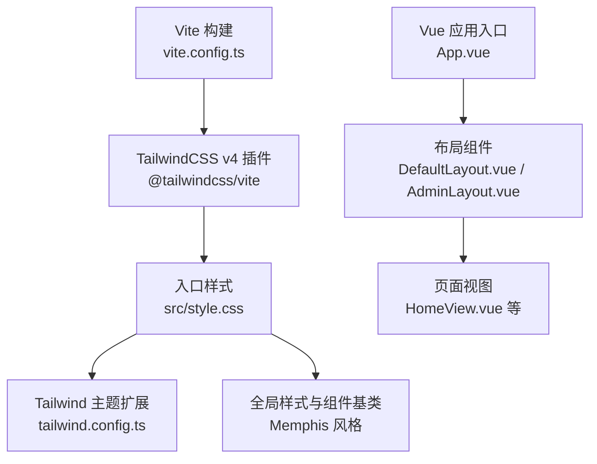
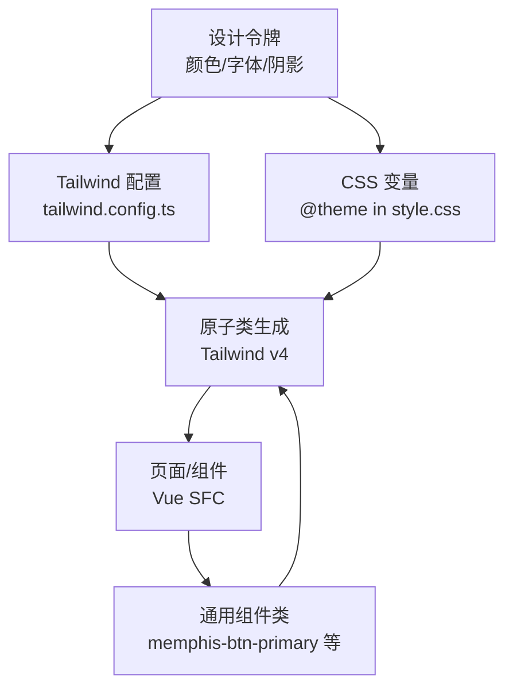
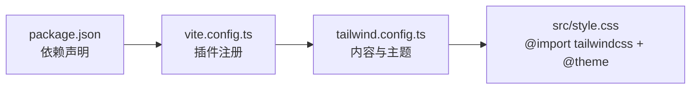

# 样式组织策略

<cite>
**本文引用的文件**   
- [frontEnd/tailwind.config.ts](file://frontEnd/tailwind.config.ts)
- [frontEnd/src/style.css](file://frontEnd/src/style.css)
- [frontEnd/vite.config.ts](file://frontEnd/vite.config.ts)
- [frontEnd/package.json](file://frontEnd/package.json)
- [frontEnd/src/App.vue](file://frontEnd/src/App.vue)
- [frontEnd/src/components/DefaultLayout.vue](file://frontEnd/src/components/DefaultLayout.vue)
- [frontEnd/src/views/HomeView.vue](file://frontEnd/src/views/HomeView.vue)
- [frontEnd/src/stores/app.ts](file://frontEnd/src/stores/app.ts)
</cite>

## 目录
1. [引言](#引言)
2. [项目结构](#项目结构)
3. [核心组件](#核心组件)
4. [架构总览](#架构总览)
5. [详细组件分析](#详细组件分析)
6. [依赖分析](#依赖分析)
7. [性能考虑](#性能考虑)
8. [故障排查指南](#故障排查指南)
9. [结论](#结论)
10. [附录](#附录)

## 引言
本文件系统化梳理 HR XF 前端样式组织策略，围绕 TailwindCSS v4 的使用与配置、样式文件组织结构（全局/组件/页面）、主题与 CSS 变量体系、响应式断点与移动端适配、样式复用与封装、动画与过渡、性能优化、调试工具与兼容性、以及统一的开发规范进行说明。目标是帮助开发者在一致的设计语言下高效协作与迭代。

## 项目结构
前端采用 Vite + Vue 3 + TypeScript 工程化方案，样式层以 TailwindCSS v4 为核心，结合自定义 CSS 变量与少量 Memphis 风格全局类，形成“原子类为主 + 主题变量 + 少量业务级通用类”的混合模式。

图表来源
- [frontEnd/vite.config.ts:1-21](file://frontEnd/vite.config.ts#L1-L21)
- [frontEnd/src/style.css:1-16](file://frontEnd/src/style.css#L1-L16)
- [frontEnd/tailwind.config.ts:1-31](file://frontEnd/tailwind.config.ts#L1-L31)
- [frontEnd/src/App.vue:1-21](file://frontEnd/src/App.vue#L1-L21)
- [frontEnd/src/components/DefaultLayout.vue:1-139](file://frontEnd/src/components/DefaultLayout.vue#L1-L139)
- [frontEnd/src/views/HomeView.vue:1-353](file://frontEnd/src/views/HomeView.vue#L1-L353)

章节来源
- [frontEnd/vite.config.ts:1-21](file://frontEnd/vite.config.ts#L1-L21)
- [frontEnd/src/style.css:1-16](file://frontEnd/src/style.css#L1-L16)
- [frontEnd/tailwind.config.ts:1-31](file://frontEnd/tailwind.config.ts#L1-L31)
- [frontEnd/src/App.vue:1-21](file://frontEnd/src/App.vue#L1-L21)
- [frontEnd/src/components/DefaultLayout.vue:1-139](file://frontEnd/src/components/DefaultLayout.vue#L1-L139)
- [frontEnd/src/views/HomeView.vue:1-353](file://frontEnd/src/views/HomeView.vue#L1-L353)

## 核心组件
- 构建与插件：Vite 集成 @tailwindcss/vite 插件，启用 TailwindCSS v4 能力；内容扫描范围覆盖 index.html 与 src 下所有 Vue/TS/JS 文件。
- 主题与字体：通过 tailwind.config.ts 与 style.css 的 @theme 双通道定义字体族与品牌色集 memphis-*，确保 Tailwind 原子类与 CSS 变量同步生效。
- 全局样式：统一滚动行为、背景色、字体族；提供 Memphis 装饰背景与基础 UI 组件类（按钮、卡片、输入框）；定制滚动条样式；弹窗淡入淡出过渡。
- 布局与页面：默认布局与管理员布局使用一致的边框、阴影、间距与色彩系统；首页作为展示型页面大量使用 Tailwind 原子类组合实现响应式网格与交互态。

章节来源
- [frontEnd/package.json:1-35](file://frontEnd/package.json#L1-L35)
- [frontEnd/vite.config.ts:1-21](file://frontEnd/vite.config.ts#L1-L21)
- [frontEnd/tailwind.config.ts:1-31](file://frontEnd/tailwind.config.ts#L1-L31)
- [frontEnd/src/style.css:1-147](file://frontEnd/src/style.css#L1-L147)
- [frontEnd/src/components/DefaultLayout.vue:1-139](file://frontEnd/src/components/DefaultLayout.vue#L1-L139)
- [frontEnd/src/views/HomeView.vue:1-353](file://frontEnd/src/views/HomeView.vue#L1-L353)

## 架构总览
样式架构遵循“设计令牌 → 原子类 → 通用组件类 → 页面组合”的分层原则：
- 设计令牌：颜色、字体、间距、阴影、圆角等通过 Tailwind 配置与 CSS 变量集中管理。
- 原子类：页面与组件优先使用 Tailwind 原子类快速拼装布局与状态。
- 通用组件类：对高频复用的视觉形态（如 Memphis 按钮、卡片、输入框）抽取为通用类，降低重复代码。
- 页面组合：页面级仅做布局与数据绑定，尽量不新增样式，保持可维护性。

图表来源
- [frontEnd/tailwind.config.ts:1-31](file://frontEnd/tailwind.config.ts#L1-L31)
- [frontEnd/src/style.css:1-16](file://frontEnd/src/style.css#L1-L16)

## 详细组件分析

### 主题系统与颜色体系
- 颜色体系：定义 memphis 系列色板（珊瑚、黄、青、蓝、紫、橙、奶油、黑、白），同时通过 CSS 变量暴露同名 token，供 Tailwind 与原生 CSS 共同消费。
- 字体规范：无衬线体 Noto Sans SC 与等宽体 Space Mono，分别映射到 Tailwind 的 sans 与 mono 族名。
- 使用建议：
  - 文本与强调：优先使用 text-memphis-coral 等原子类。
  - 背景与填充：使用 bg-memphis-cream 等原子类。
  - 边框与阴影：沿用项目内固定 4px 黑边与硬阴影风格，保持 Memphis 视觉一致性。

章节来源
- [frontEnd/tailwind.config.ts:10-26](file://frontEnd/tailwind.config.ts#L10-L26)
- [frontEnd/src/style.css:3-16](file://frontEnd/src/style.css#L3-L16)

### 全局样式与组件基类
- 全局设置：平滑滚动、默认背景与文字色、字体族。
- 装饰背景：点阵、网格、锯齿纹等 Memphis 风格背景类，便于页面区块快速营造风格。
- 组件基类：
  - 按钮：memphis-btn-primary，带粗边框、硬阴影、悬停位移与按压效果。
  - 卡片：memphis-card，统一边框、阴影与背景。
  - 输入框：memphis-input，聚焦时强化阴影反馈。
- 滚动条：跨浏览器定制滚动条外观，提升整体质感。
- 弹窗过渡：modal-fade-enter-active/leave-active 等类用于淡入淡出。

章节来源
- [frontEnd/src/style.css:18-147](file://frontEnd/src/style.css#L18-L147)

### 响应式设计策略
- 断点：基于 Tailwind 内置断点（sm/md/lg/xl/2xl），在布局中广泛使用 md: 前缀控制桌面端增强体验。
- 移动端适配：
  - 导航栏在小屏隐藏主菜单，提供汉堡按钮与折叠菜单。
  - 网格从单列逐步扩展到多列（grid-cols-1 → md:grid-cols-2/3/4）。
  - 字号与间距随屏幕放大（text-sm → md:text-base/lg:text-xl 等）。
- 最佳实践：
  - 先写移动端样式，再叠加 md: 增强。
  - 避免在组件内写死像素值，优先使用 Tailwind spacing 与容器 max-w-screen-2xl。

章节来源
- [frontEnd/src/components/DefaultLayout.vue:1-139](file://frontEnd/src/components/DefaultLayout.vue#L1-L139)
- [frontEnd/src/views/HomeView.vue:1-353](file://frontEnd/src/views/HomeView.vue#L1-L353)

### 样式复用与组件封装
- 原子类优先：布局、间距、排版、颜色、阴影、圆角等尽量用 Tailwind 原子类组合。
- 通用类收敛：将高频样式抽象为 memphis-* 类，减少重复并保证一致性。
- 组件级样式：仅在必要时使用 scoped 或局部样式，避免污染全局命名空间。
- 示例路径：
  - 按钮与卡片：[frontEnd/src/style.css:52-86](file://frontEnd/src/style.css#L52-L86)
  - 导航与页脚布局：[frontEnd/src/components/DefaultLayout.vue:1-139](file://frontEnd/src/components/DefaultLayout.vue#L1-L139)
  - 首页功能卡片与网格：[frontEnd/src/views/HomeView.vue:60-160](file://frontEnd/src/views/HomeView.vue#L60-L160)

章节来源
- [frontEnd/src/style.css:52-86](file://frontEnd/src/style.css#L52-L86)
- [frontEnd/src/components/DefaultLayout.vue:1-139](file://frontEnd/src/components/DefaultLayout.vue#L1-L139)
- [frontEnd/src/views/HomeView.vue:60-160](file://frontEnd/src/views/HomeView.vue#L60-L160)

### 动画与过渡效果
- 过渡：transition-all、duration-200/300/500 等原子类配合 hover/focus/active 状态实现微交互。
- 弹窗淡入淡出：modal-fade-* 类提供统一过渡时长与缓动。
- 自定义滚动条：::-webkit-scrollbar-* 伪元素与 Firefox scrollbar-color 兼容。
- 建议：
  - 优先使用 transition 而非 keyframes，保持声明式与可组合性。
  - 复杂动画拆分为子组件，避免在页面级散落关键帧。

章节来源
- [frontEnd/src/style.css:138-147](file://frontEnd/src/style.css#L138-L147)
- [frontEnd/src/style.css:92-136](file://frontEnd/src/style.css#L92-L136)

### 暗黑模式与主题切换
- 机制：通过 Pinia store 在根节点添加/移除 dark 类，驱动后续暗黑主题扩展。
- 建议：
  - 在 Tailwind 中使用 dark: 前缀定义暗色变体。
  - 将明/暗配色集中在 @theme 或配置中，避免散落的硬编码色值。

章节来源
- [frontEnd/src/stores/app.ts:1-17](file://frontEnd/src/stores/app.ts#L1-L17)

## 依赖分析
- 构建与插件：
  - vite.config.ts 引入 @tailwindcss/vite 插件，使 Tailwind v4 在 Vite 管线中生效。
  - package.json 锁定 tailwindcss 与 @tailwindcss/vite 版本，确保团队一致性。
- 样式入口：
  - src/style.css 使用 @import "tailwindcss" 引入 Tailwind，并通过 @theme 注入设计令牌。
- 内容扫描：
  - tailwind.config.ts 的 content 指向 index.html 与 src 下常见前端文件类型，确保按需生成原子类。

图表来源
- [frontEnd/package.json:1-35](file://frontEnd/package.json#L1-L35)
- [frontEnd/vite.config.ts:1-21](file://frontEnd/vite.config.ts#L1-L21)
- [frontEnd/tailwind.config.ts:1-31](file://frontEnd/tailwind.config.ts#L1-L31)
- [frontEnd/src/style.css:1-16](file://frontEnd/src/style.css#L1-L16)

章节来源
- [frontEnd/package.json:1-35](file://frontEnd/package.json#L1-L35)
- [frontEnd/vite.config.ts:1-21](file://frontEnd/vite.config.ts#L1-L21)
- [frontEnd/tailwind.config.ts:1-31](file://frontEnd/tailwind.config.ts#L1-L31)
- [frontEnd/src/style.css:1-16](file://frontEnd/src/style.css#L1-L16)

## 性能考虑
- 按需生成：Tailwind v4 基于内容扫描自动裁剪未使用的原子类，显著减小产物体积。
- 构建优化：
  - 使用 Vite 生产构建（npm run build）开启压缩与 Tree-shaking。
  - 合理配置 content 路径，避免扫描无关目录。
- 资源加载：
  - 字体与图标按需引入，避免全量加载。
  - 图片与 SVG 使用懒加载与合适的格式（WebP/SVG）。
- 运行时开销：
  - 谨慎使用复杂滤镜与重绘属性，优先 transform 与 opacity。
  - 动画时长控制在 200-300ms，避免长耗时动画影响交互流畅度。

## 故障排查指南
- 样式未生效
  - 检查 tailwind.config.ts 的 content 是否包含当前文件路径。
  - 确认 src/style.css 已正确 import tailwindcss 且被应用入口引入。
- 主题变量无效
  - 确认 @theme 中的变量名与 Tailwind 配置保持一致。
  - 检查浏览器控制台是否存在 CSS 解析错误。
- 移动端布局异常
  - 核对断点前缀是否正确（md:、lg: 等）。
  - 检查父容器是否限制了宽度或高度导致子元素溢出。
- 滚动条样式不一致
  - WebKit 与 Firefox 使用不同属性，需同时覆盖。
- 暗黑模式未切换
  - 确认 store 中 dark 类是否正确添加到根节点。

章节来源
- [frontEnd/tailwind.config.ts:4-7](file://frontEnd/tailwind.config.ts#L4-L7)
- [frontEnd/src/style.css:1-16](file://frontEnd/src/style.css#L1-L16)
- [frontEnd/src/style.css:92-136](file://frontEnd/src/style.css#L92-L136)
- [frontEnd/src/stores/app.ts:1-17](file://frontEnd/src/stores/app.ts#L1-L17)

## 结论
本项目以 TailwindCSS v4 为核心，结合 CSS 变量与少量 Memphis 风格通用类，形成了清晰、可扩展、易维护的样式体系。通过严格的断点策略、统一的组件基类与动画规范，既保证了视觉一致性，也提升了开发效率。建议在后续迭代中持续沉淀通用组件类、完善暗黑主题覆盖，并定期评估构建产物体积与渲染性能。

## 附录

### 常用 Tailwind 原子类速查（节选）
- 布局：flex、grid、gap-*、max-w-screen-2xl、min-h-screen
- 排版：font-sans、font-mono、text-xs~text-7xl、tracking-tight/wide
- 颜色：bg-memphis-*、text-memphis-*、border-memphis-*
- 边框与阴影：border-4 border-black、shadow-[x_y_0px_0px_rgba(0,0,0,1)]
- 响应式：md:、lg:、xl:、2xl: 前缀
- 交互：hover:、focus:、active:、disabled:

### 开发规范清单
- 优先使用 Tailwind 原子类，禁止手写冗余 CSS。
- 新增颜色/字体必须同步更新 tailwind.config.ts 与 @theme。
- 通用 UI 形态抽取为 memphis-* 类，并在文档中登记。
- 响应式遵循“移动优先”，在 md: 及以上增强。
- 动画与过渡统一使用 transition-* 与 duration-*，避免随意 keyframes。
- 提交前运行构建脚本，确认产物体积与样式完整性。