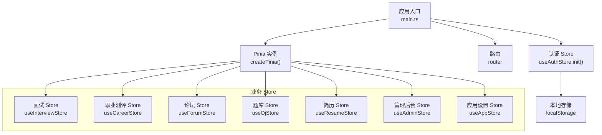
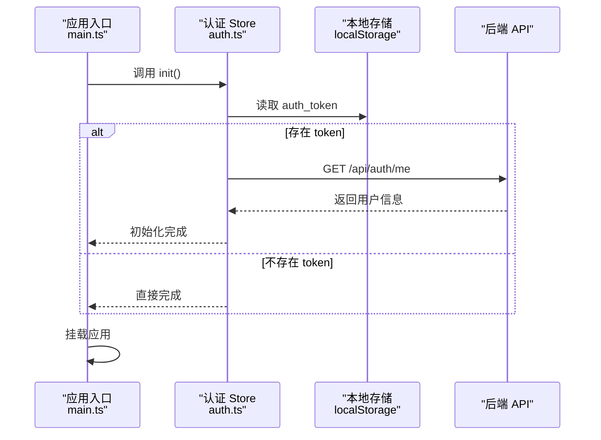
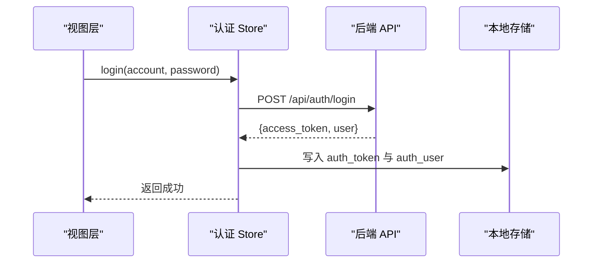
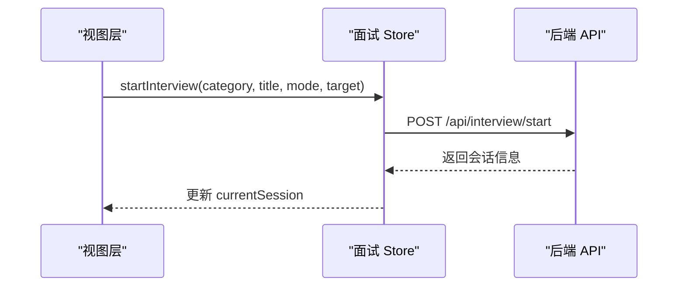
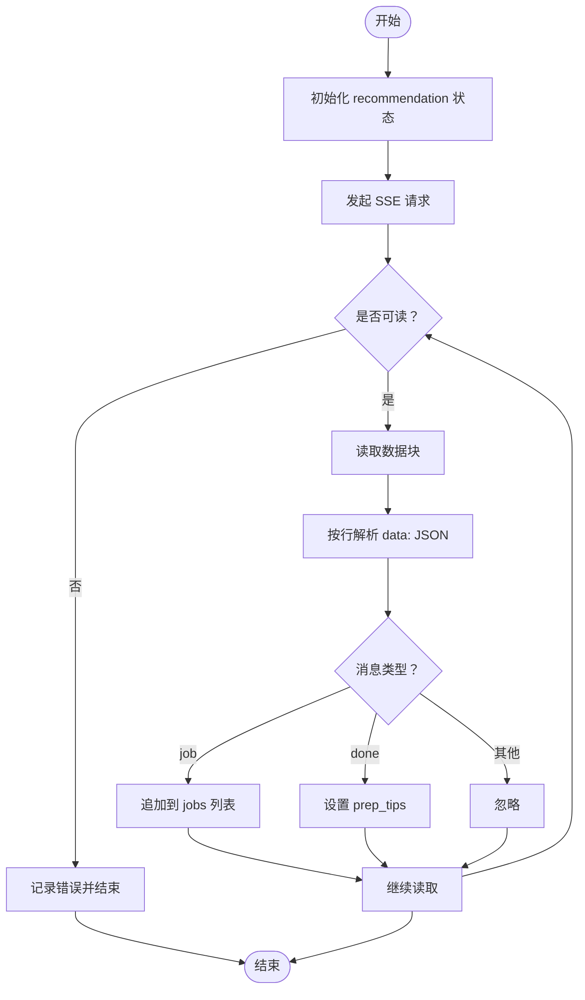
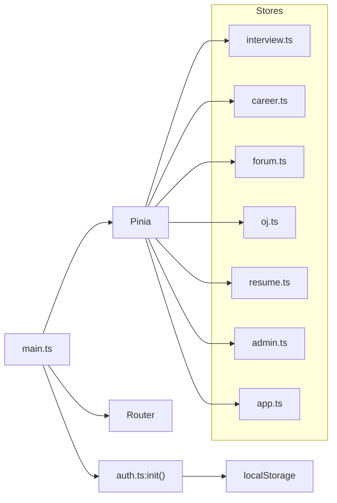

# 状态管理模式

<cite>
**本文引用的文件列表**
- [main.ts](file://frontEnd/src/main.ts)
- [auth.ts](file://frontEnd/src/stores/auth.ts)
- [interview.ts](file://frontEnd/src/stores/interview.ts)
- [career.ts](file://frontEnd/src/stores/career.ts)
- [app.ts](file://frontEnd/src/stores/app.ts)
- [admin.ts](file://frontEnd/src/stores/admin.ts)
- [forum.ts](file://frontEnd/src/stores/forum.ts)
- [oj.ts](file://frontEnd/src/stores/oj.ts)
- [resume.ts](file://frontEnd/src/stores/resume.ts)
- [package.json](file://frontEnd/package.json)
</cite>

## 目录
1. [简介](#简介)
2. [项目结构](#项目结构)
3. [核心组件](#核心组件)
4. [架构总览](#架构总览)
5. [详细组件分析](#详细组件分析)
6. [依赖关系分析](#依赖关系分析)
7. [性能考虑](#性能考虑)
8. [故障排查指南](#故障排查指南)
9. [结论](#结论)
10. [附录：开发规范与最佳实践](#附录开发规范与最佳实践)

## 简介
本文件系统化梳理 HR XF 前端的状态管理模式，围绕 Pinia 的使用、store 模块职责划分、状态持久化策略、异步操作处理、跨组件共享、调试与优化、错误处理与异常恢复、以及迁移与版本管理进行说明。目标是帮助开发者在统一规范下高效维护状态，提升可维护性与用户体验。

## 项目结构
前端采用 Vue 3 + TypeScript + Vite 技术栈，使用 Pinia 作为全局状态管理库。应用入口初始化 Pinia 并在启动时恢复认证态，随后挂载应用。各业务领域按功能拆分为独立 store 模块，每个 store 封装自身的数据、计算属性与动作（actions），并通过统一的 API 客户端访问后端接口。

图表来源
- [main.ts:1-19](file://frontEnd/src/main.ts#L1-L19)
- [auth.ts:65-83](file://frontEnd/src/stores/auth.ts#L65-L83)

章节来源
- [main.ts:1-19](file://frontEnd/src/main.ts#L1-L19)
- [package.json:11-24](file://frontEnd/package.json#L11-L24)

## 核心组件
- 认证 Store（auth.ts）
  - 负责用户登录/注册、个人资料获取与更新、头像上传、密码修改、账号注销等。
  - 提供 init 方法在应用启动时恢复本地 token 并校验有效性。
  - 通过 localStorage 持久化 auth_token 与 auth_user。
- 面试 Store（interview.ts）
  - 管理面试岗位、面试会话、题目、AI 对话流、作弊上报、报告与历史。
  - 支持 SSE 流式 AI 对话，实时更新消息内容。
- 职业测评 Store（career.ts）
  - 管理测评题目、提交结果、历史记录、推荐结果（SSE 流式推送）。
- 论坛 Store（forum.ts）
  - 管理帖子、评论、标签统计、筛选条件与分页。
- 题库 Store（oj.ts）
  - 管理题目列表、详情、提交与调试、用户进度与标签选项。
- 简历 Store（resume.ts）
  - 管理简历数据、解析与优化（含流式优化）、PDF 文本提取、配置项。
- 管理后台 Store（admin.ts）
  - 管理仪表盘统计、用户/题目/帖子的增删改查与过滤分页。
- 应用设置 Store（app.ts）
  - 管理主题切换（深色模式）等轻量全局状态。

章节来源
- [auth.ts:65-313](file://frontEnd/src/stores/auth.ts#L65-L313)
- [interview.ts:128-312](file://frontEnd/src/stores/interview.ts#L128-L312)
- [career.ts:82-221](file://frontEnd/src/stores/career.ts#L82-L221)
- [forum.ts:115-314](file://frontEnd/src/stores/forum.ts#L115-L314)
- [oj.ts:123-267](file://frontEnd/src/stores/oj.ts#L123-L267)
- [resume.ts:82-243](file://frontEnd/src/stores/resume.ts#L82-L243)
- [admin.ts:69-249](file://frontEnd/src/stores/admin.ts#L69-L249)
- [app.ts:4-17](file://frontEnd/src/stores/app.ts#L4-L17)

## 架构总览
整体采用“按领域拆分”的 store 设计，每个 store 自包含类型定义、API 客户端与业务逻辑。认证流程在应用启动阶段完成，确保后续请求携带有效令牌。部分长耗时或实时性强的交互采用 SSE 流式响应，store 内部解析并增量更新状态。

图表来源
- [main.ts:14-18](file://frontEnd/src/main.ts#L14-L18)
- [auth.ts:72-83](file://frontEnd/src/stores/auth.ts#L72-L83)

## 详细组件分析

### 认证 Store（auth.ts）
- 职责边界
  - 用户生命周期：注册、登录、登出、注销账号。
  - 资料管理：获取与更新个人资料、修改用户名/邮箱/密码、上传头像。
  - 会话恢复：应用启动时从本地存储恢复 token 并验证。
- 关键状态与方法
  - user、token、isAuthenticated
  - init、registerByEmail、registerByUsername、login、logout
  - fetchProfile、updateProfile、changePassword、uploadAvatar
  - updateUsername、updateEmail、changePasswordBySettings、deleteAccount
- 持久化策略
  - 使用 localStorage 保存 auth_token 与 auth_user。
  - 登录/注册成功后写入；登出/注销后清理。
- 错误处理
  - 统一将后端 detail 或 HTTP 状态转换为 Error 抛出。
  - 对敏感操作（如注销）失败时保持当前状态不变。
- 典型调用序列（登录）

图表来源
- [auth.ts:119-134](file://frontEnd/src/stores/auth.ts#L119-L134)
- [auth.ts:288-293](file://frontEnd/src/stores/auth.ts#L288-L293)

章节来源
- [auth.ts:33-61](file://frontEnd/src/stores/auth.ts#L33-L61)
- [auth.ts:65-313](file://frontEnd/src/stores/auth.ts#L65-L313)

### 面试 Store（interview.ts）
- 职责边界
  - 岗位与分类加载、创建面试会话、拉取题目、提交答案、下一轮、作弊上报、中止面试。
  - 生成与展示面试报告、查看历史。
  - 支持 AI 对话流式输出。
- 关键状态与方法
  - jobCategories、currentSession、currentQuestions、aiMessages、report、historyItems、loading
  - fetchJobs、startInterview、fetchSession、fetchQuestions、submitAnswer、nextRound
  - sendAIChat、reportCheat、abortInterview、fetchReport、fetchHistory、resetSession
- 流式处理（AI 对话）
  - 使用 ReadableStream 与 TextDecoder 逐块解码，解析 data: JSON 行，回调 onChunk 实现实时显示。
- 典型调用序列（开始面试）

图表来源
- [interview.ts:149-171](file://frontEnd/src/stores/interview.ts#L149-L171)
- [interview.ts:209-253](file://frontEnd/src/stores/interview.ts#L209-L253)

章节来源
- [interview.ts:101-124](file://frontEnd/src/stores/interview.ts#L101-L124)
- [interview.ts:128-312](file://frontEnd/src/stores/interview.ts#L128-L312)

### 职业测评 Store（career.ts）
- 职责边界
  - 拉取测评题目、提交答案、查询历史与结果。
  - 基于测评结果获取职位推荐与准备建议（SSE 流式推送）。
- 关键状态与方法
  - currentQuestions、history、loading、error、recommendation
  - fetchQuestions、submitAssessment、fetchHistory、fetchResult、fetchRecommendation
- 流式处理（推荐结果）
  - 解析 SSE data: 行，增量追加 jobs，完成后填充 prep_tips。
- 流程图（推荐结果流式解析）

图表来源
- [career.ts:148-207](file://frontEnd/src/stores/career.ts#L148-L207)

章节来源
- [career.ts:1-21](file://frontEnd/src/stores/career.ts#L1-L21)
- [career.ts:82-221](file://frontEnd/src/stores/career.ts#L82-L221)

### 论坛 Store（forum.ts）
- 职责边界
  - 帖子列表与详情、评论、点赞、删除、标签统计、筛选与分页。
- 关键状态与方法
  - posts、currentPost、comments、tagStats、filterOptions、filters、page、size、total、loading
  - fetchPosts、fetchPost、createPost、toggleLike、fetchComments、createComment、deletePost、deleteComment、fetchTagStats、fetchFilterOptions、resetFilters、setPage
- 设计要点
  - 使用 reactive 对象集中管理 filters，buildQueryString 统一拼接查询参数。
  - 局部乐观更新：点赞/评论数变更先更新本地状态，再根据服务端返回修正。

章节来源
- [forum.ts:77-100](file://frontEnd/src/stores/forum.ts#L77-L100)
- [forum.ts:115-314](file://frontEnd/src/stores/forum.ts#L115-L314)

### 题库 Store（oj.ts）
- 职责边界
  - 题目列表与详情、代码提交与调试、用户进度统计、标签选项。
- 关键状态与方法
  - problems、currentProblem、userProgress、allTags、filters、page、size、total、loading
  - fetchProblems、fetchProblem、submitCode、debugCode、fetchProgress、fetchAllTags、resetFilters、setPage
- 设计要点
  - 与论坛类似，使用 reactive filters 与 buildQueryString 构建查询。

章节来源
- [oj.ts:90-113](file://frontEnd/src/stores/oj.ts#L90-L113)
- [oj.ts:123-267](file://frontEnd/src/stores/oj.ts#L123-L267)

### 简历 Store（resume.ts）
- 职责边界
  - 获取/上传/解析简历、AI 优化（同步与流式）、PDF 文本提取、后端配置检查。
- 关键状态与方法
  - resume、loading、analyzing、optimizing、hasApiKey、hasResume、hasParsedContent
  - fetchConfig、fetchResume、uploadResume、analyzeResume、optimizeText、optimizeTextStream、extractPdfText
- 流式处理（优化文本）
  - 解析 SSE data: JSON，按 type 分发 start/item/done，回调 onItem/onDone/onStart。

章节来源
- [resume.ts:59-78](file://frontEnd/src/stores/resume.ts#L59-L78)
- [resume.ts:82-243](file://frontEnd/src/stores/resume.ts#L82-L243)

### 管理后台 Store（admin.ts）
- 职责边界
  - 仪表盘统计、用户/题目/帖子管理（增删改查）、过滤与分页。
- 关键状态与方法
  - stats、users、problems、posts 及其 loading 与 total
  - fetchStats、fetchUsers、toggleUserStatus、deleteUser、fetchProblems、createProblem、updateProblem、deleteProblem、fetchPosts、deletePost
- 设计要点
  - 针对资源操作后即时更新本地列表与总数，减少二次请求。

章节来源
- [admin.ts:48-65](file://frontEnd/src/stores/admin.ts#L48-L65)
- [admin.ts:69-249](file://frontEnd/src/stores/admin.ts#L69-L249)

### 应用设置 Store（app.ts）
- 职责边界
  - 管理深色模式开关，动态切换根节点 class。
- 关键状态与方法
  - isDark、toggleDark

章节来源
- [app.ts:4-17](file://frontEnd/src/stores/app.ts#L4-L17)

## 依赖关系分析
- 外部依赖
  - Vue 3、Vue Router、Pinia、Vite、TailwindCSS、ECharts 等。
- 运行时依赖
  - 所有 store 均依赖浏览器环境提供的 localStorage、fetch、ReadableStream、TextDecoder。
- 模块耦合
  - main.ts 仅依赖 Pinia 与认证 store 的 init，避免循环依赖。
  - 各 store 之间无直接相互引用，通过路由与组件组合间接协作，符合低耦合高内聚原则。

图表来源
- [main.ts:1-12](file://frontEnd/src/main.ts#L1-L12)
- [auth.ts:65-83](file://frontEnd/src/stores/auth.ts#L65-L83)

章节来源
- [package.json:11-24](file://frontEnd/package.json#L11-L24)
- [main.ts:1-19](file://frontEnd/src/main.ts#L1-L19)

## 性能考虑
- 流式渲染
  - interview.ts 与 career.ts、resume.ts 中广泛使用 SSE 流式处理，降低首屏等待时间，提升交互体验。
- 局部更新
  - forum.ts 与 admin.ts 在点赞、评论、删除等操作后进行局部乐观更新，减少不必要的重渲染与网络往返。
- 分页与过滤
  - forum.ts、oj.ts、admin.ts 使用统一的 filters 与分页参数构建查询，避免全量拉取。
- 计算属性
  - auth.ts 使用 computed 派生 isAuthenticated，避免重复判断。
- 建议
  - 对大列表渲染结合虚拟滚动或按需加载。
  - 对频繁触发的搜索输入增加防抖。
  - 对 SSE 连接增加重试与超时控制。

[本节为通用指导，不直接分析具体文件]

## 故障排查指南
- 常见错误定位
  - 网络错误：各 store 的 apiRequest 会将非 2xx 响应体中的 detail 或 HTTP 状态码包装为 Error，可在控制台查看堆栈。
  - 认证失效：auth.ts 的 init 会在 /auth/me 失败时执行 logout，清除本地状态。
  - 流式解析异常：interview.ts、career.ts、resume.ts 中对 SSE 行解析做了 try/catch 容错，忽略畸形片段。
- 调试建议
  - 使用浏览器开发者工具 Network 面板观察请求头 Authorization 是否正确携带。
  - 在 store 方法前后添加 console.log 或使用 Vue Devtools 的 Pinia 插件查看状态变化。
  - 对于 SSE 场景，关注 Console 中是否有解析错误或断流提示。
- 异常恢复
  - 对幂等读操作（如 fetchProfile、fetchHistory）失败时保持现有状态，避免界面闪烁。
  - 写操作失败时返回结构化结果（success/message），由上层 UI 决定提示与回滚。

章节来源
- [auth.ts:72-83](file://frontEnd/src/stores/auth.ts#L72-L83)
- [interview.ts:113-124](file://frontEnd/src/stores/interview.ts#L113-L124)
- [career.ts:148-207](file://frontEnd/src/stores/career.ts#L148-L207)
- [resume.ts:162-207](file://frontEnd/src/stores/resume.ts#L162-L207)

## 结论
本项目以 Pinia 为核心，采用按领域划分的 store 架构，清晰分离认证、面试、测评、论坛、题库、简历与管理后台等职责。通过统一的 API 客户端与一致的异步处理模式，配合 SSE 流式能力与 localStorage 持久化，实现了良好的用户体验与可维护性。建议在后续迭代中引入更完善的错误上报、缓存策略与状态迁移机制，进一步提升系统健壮性与扩展性。

[本节为总结性内容，不直接分析具体文件]

## 附录：开发规范与最佳实践
- 命名与组织
  - 每个 store 对应一个文件，导出 useXxxStore 函数，内部包含 ref/reactive 状态、computed 派生值与 actions。
  - 类型定义与 store 同文件，便于维护与复用。
- 状态持久化
  - 仅在必要时持久化（如认证信息、用户偏好），避免污染 localStorage。
  - 持久化键名需语义化且唯一，避免冲突。
- 异步操作
  - 使用 try/catch 包裹网络请求，统一错误转换与返回结构。
  - 对长时间任务使用 loading/error 状态，避免阻塞 UI。
  - 对 SSE 流式接口，做好分片解析与异常容错。
- 跨组件共享
  - 通过 Pinia 的 store 在任意组件中使用，避免 props 透传与事件冒泡的过度嵌套。
  - 复杂页面可使用多个 store 组合，保持单一职责。
- 调试与监控
  - 使用 Vue Devtools 的 Pinia 插件跟踪状态变更。
  - 对关键路径埋点日志，便于问题定位。
- 错误处理与恢复
  - 区分可恢复错误与不可恢复错误，提供重试与降级策略。
  - 对写操作失败进行本地回滚或提示用户。
- 迁移与版本管理
  - 对持久化数据结构进行版本标记，升级时执行迁移脚本。
  - 对 API 契约变更进行兼容处理，避免破坏旧客户端。
- 性能优化
  - 合理使用 computed 与 watch，避免不必要的重渲染。
  - 对大数据集采用分页、懒加载与虚拟列表。
  - 对高频操作进行节流/防抖。

[本节为通用指导，不直接分析具体文件]