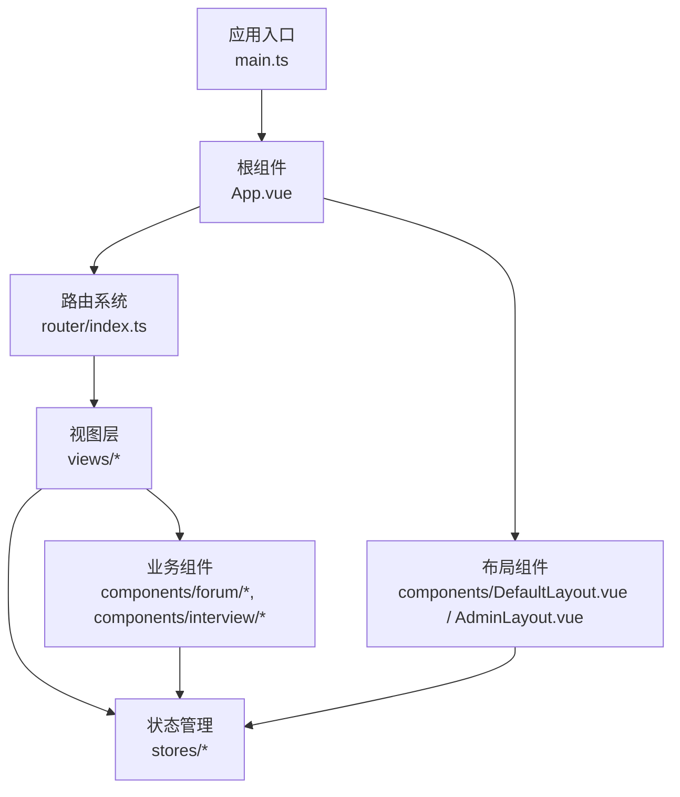
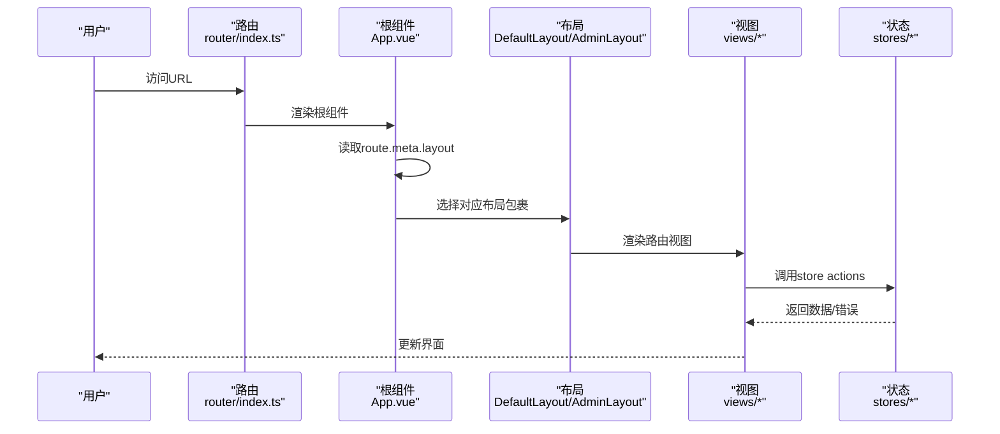
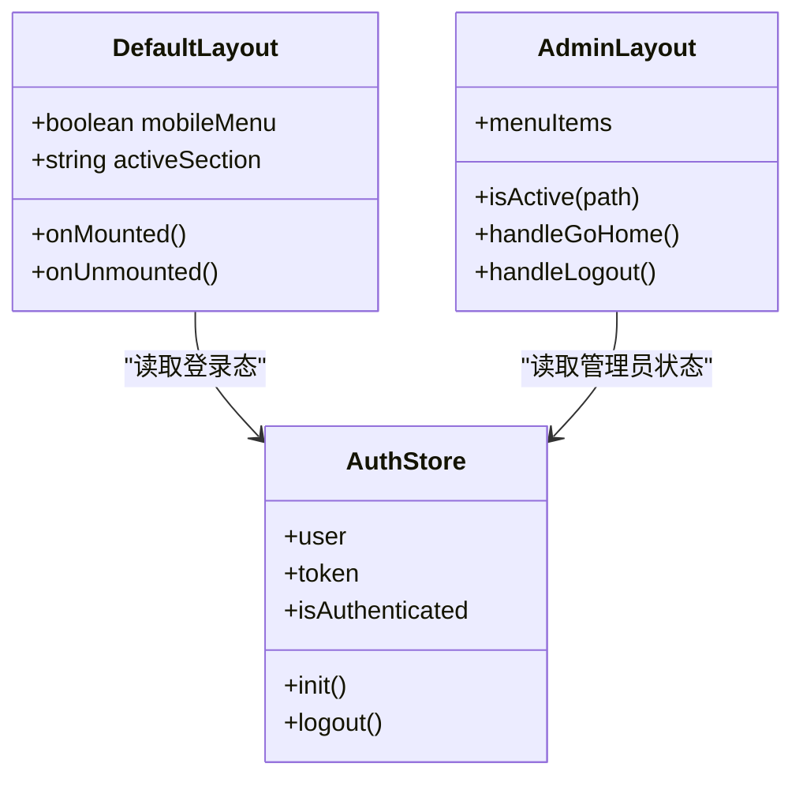
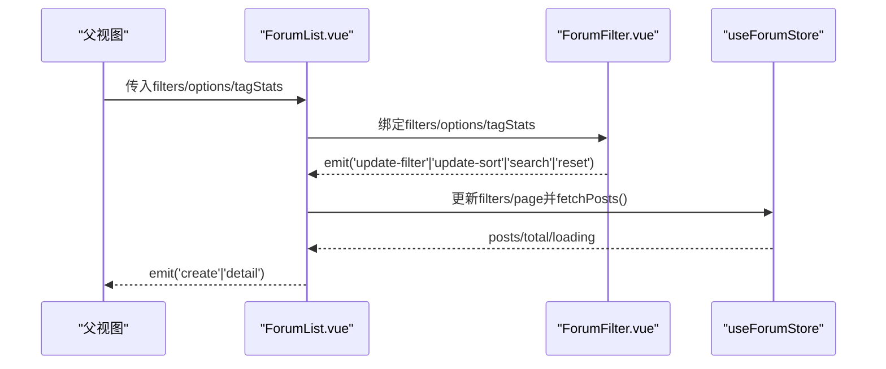
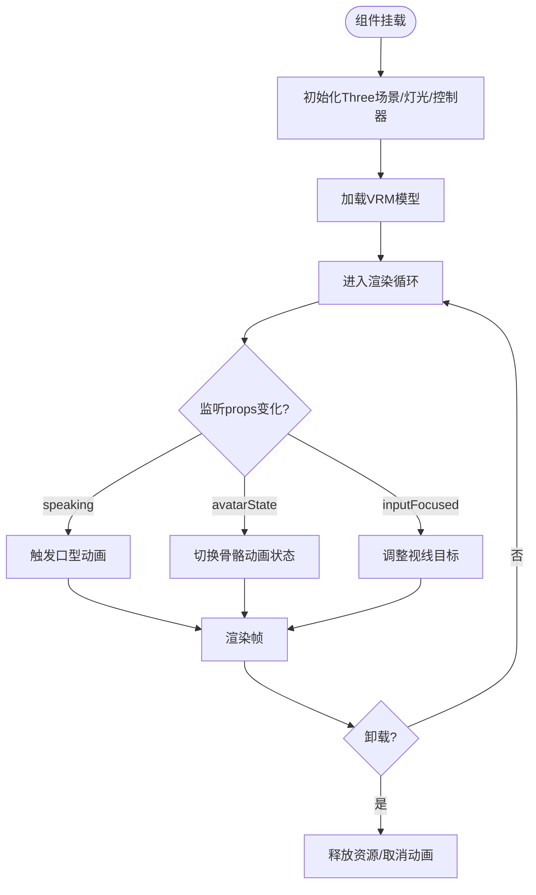
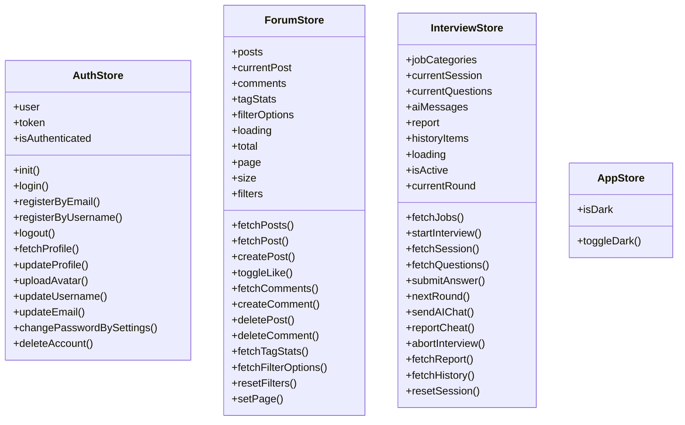
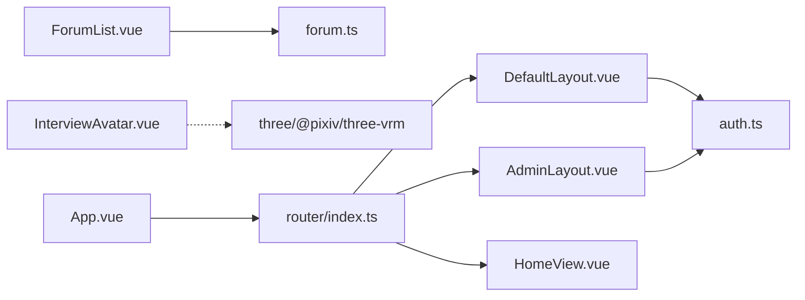

# 组件设计规范

<cite>
**本文引用的文件**   
- [main.ts](file://frontEnd/src/main.ts)
- [App.vue](file://frontEnd/src/App.vue)
- [index.ts](file://frontEnd/src/router/index.ts)
- [DefaultLayout.vue](file://frontEnd/src/components/DefaultLayout.vue)
- [AdminLayout.vue](file://frontEnd/src/components/AdminLayout.vue)
- [auth.ts](file://frontEnd/src/stores/auth.ts)
- [app.ts](file://frontEnd/src/stores/app.ts)
- [forum.ts](file://frontEnd/src/stores/forum.ts)
- [interview.ts](file://frontEnd/src/stores/interview.ts)
- [ForumList.vue](file://frontEnd/src/components/forum/ForumList.vue)
- [ForumFilter.vue](file://frontEnd/src/components/forum/ForumFilter.vue)
- [InterviewAvatar.vue](file://frontEnd/src/components/interview/InterviewAvatar.vue)
- [HomeView.vue](file://frontEnd/src/views/HomeView.vue)
- [tailwind.config.ts](file://frontEnd/tailwind.config.ts)
</cite>

## 目录
1. [引言](#引言)
2. [项目结构](#项目结构)
3. [核心组件与模式](#核心组件与模式)
4. [架构总览](#架构总览)
5. [详细组件分析](#详细组件分析)
6. [依赖关系分析](#依赖关系分析)
7. [性能考量](#性能考量)
8. [故障排查指南](#故障排查指南)
9. [结论](#结论)
10. [附录](#附录)

## 引言
本规范面向HR XF前端（Vue3 + TypeScript + Pinia + Vue Router + TailwindCSS）的组件开发，目标是建立统一的组件设计、组织与通信标准，覆盖以下要点：
- Vue3组合式API开发模式：setup语法、响应式数据管理、生命周期钩子使用
- 目录组织结构：components、views、stores等职责划分
- 命名约定与文件组织规范
- 组件间通信模式：props传递、事件发射、provide/inject（如适用）
- 可复用组件设计原则：单一职责、高内聚低耦合
- 布局组件设计模式：DashboardLayout、AdminLayout等基础布局实现
- 测试策略与调试技巧
- 统一的标准与最佳实践

## 项目结构
前端采用按“功能域+层次”混合的组织方式：
- src/components：通用与业务组件，按领域细分（如 forum、interview），以及全局布局（DefaultLayout、AdminLayout）
- src/views：页面级视图，通常由路由直接挂载
- src/stores：基于Pinia的状态管理，按业务域拆分（auth、forum、interview、app等）
- src/router：路由定义与守卫逻辑
- src/utils：工具函数（如TTS）
- tailwind.config.ts：主题与样式扩展

图表来源
- [main.ts:1-19](file://frontEnd/src/main.ts#L1-L19)
- [App.vue:1-21](file://frontEnd/src/App.vue#L1-L21)
- [index.ts:1-167](file://frontEnd/src/router/index.ts#L1-L167)
- [DefaultLayout.vue:1-139](file://frontEnd/src/components/DefaultLayout.vue#L1-L139)
- [AdminLayout.vue:1-110](file://frontEnd/src/components/AdminLayout.vue#L1-L110)

章节来源
- [main.ts:1-19](file://frontEnd/src/main.ts#L1-L19)
- [App.vue:1-21](file://frontEnd/src/App.vue#L1-L21)
- [index.ts:1-167](file://frontEnd/src/router/index.ts#L1-L167)

## 核心组件与模式
- 组合式API与setup语法
  - 所有组件均使用<script setup lang="ts">，以声明式方式组织模板与逻辑
  - 通过ref/reactive定义响应式数据，computed派生状态，watch监听变化
  - 生命周期钩子onMounted/onUnmounted用于资源初始化与清理
- 状态管理（Pinia）
  - 每个业务域一个store，暴露state、actions与computed
  - 在组件中通过useXxxStore()获取实例，集中处理异步请求与副作用
- 路由与布局
  - App.vue根据route.meta.layout动态选择布局容器
  - router/index.ts集中定义路由元信息（layout、requiresAuth、requiresAdmin）并实现前置守卫
- 样式体系
  - 基于TailwindCSS，自定义Memphis色彩与字体族，统一视觉风格

章节来源
- [App.vue:1-21](file://frontEnd/src/App.vue#L1-L21)
- [index.ts:1-167](file://frontEnd/src/router/index.ts#L1-L167)
- [auth.ts:1-314](file://frontEnd/src/stores/auth.ts#L1-L314)
- [forum.ts:1-315](file://frontEnd/src/stores/forum.ts#L1-L315)
- [interview.ts:1-313](file://frontEnd/src/stores/interview.ts#L1-L313)
- [tailwind.config.ts:1-31](file://frontEnd/tailwind.config.ts#L1-L31)

## 架构总览
整体采用“视图-布局-状态-服务”的分层：
- 视图层（views）：负责页面组装与用户交互
- 布局层（components/*Layout.vue）：提供全局导航、侧边栏、页脚等骨架
- 状态层（stores）：封装业务状态与网络请求
- 路由层（router）：控制页面切换、权限校验与布局注入

图表来源
- [index.ts:1-167](file://frontEnd/src/router/index.ts#L1-L167)
- [App.vue:1-21](file://frontEnd/src/App.vue#L1-L21)
- [DefaultLayout.vue:1-139](file://frontEnd/src/components/DefaultLayout.vue#L1-L139)
- [AdminLayout.vue:1-110](file://frontEnd/src/components/AdminLayout.vue#L1-L110)

## 详细组件分析

### 布局组件：DefaultLayout与AdminLayout
- DefaultLayout
  - 职责：顶部导航、移动端菜单、滚动锚点高亮、页脚
  - 关键模式：
    - 使用ref维护mobileMenu与activeSection
    - onMounted注册scroll事件，onUnmounted移除，避免内存泄漏
    - computed派生登录态与头像首字母
- AdminLayout
  - 职责：左侧导航、管理员标签、退出与返回首页
  - 关键模式：
    - 使用useRoute/useRouter进行当前路由匹配与跳转
    - 通过localStorage维护admin_auth，配合路由守卫完成权限控制

图表来源
- [DefaultLayout.vue:1-139](file://frontEnd/src/components/DefaultLayout.vue#L1-L139)
- [AdminLayout.vue:1-110](file://frontEnd/src/components/AdminLayout.vue#L1-L110)
- [auth.ts:1-314](file://frontEnd/src/stores/auth.ts#L1-L314)

章节来源
- [DefaultLayout.vue:1-139](file://frontEnd/src/components/DefaultLayout.vue#L1-L139)
- [AdminLayout.vue:1-110](file://frontEnd/src/components/AdminLayout.vue#L1-L110)

### 论坛列表组件：ForumList与筛选器：ForumFilter
- ForumList
  - 职责：展示帖子列表、分页、点赞、分享、搜索与创建入口
  - 通信模式：
    - 通过defineEmits向上抛出create/detail事件
    - 通过props接收筛选条件与选项，转发给ForumFilter
    - 使用useForumStore驱动数据加载与操作
- ForumFilter
  - 职责：关键词搜索、公司/岗位/年份/状态/面试类型/标签筛选、排序
  - 通信模式：
    - 通过defineProps接收filters/options/tagStats
    - 通过defineEmits向父组件发出update-filter/update-sort/search/reset事件

图表来源
- [ForumList.vue:1-259](file://frontEnd/src/components/forum/ForumList.vue#L1-L259)
- [ForumFilter.vue:1-186](file://frontEnd/src/components/forum/ForumFilter.vue#L1-L186)
- [forum.ts:1-315](file://frontEnd/src/stores/forum.ts#L1-L315)

章节来源
- [ForumList.vue:1-259](file://frontEnd/src/components/forum/ForumList.vue#L1-L259)
- [ForumFilter.vue:1-186](file://frontEnd/src/components/forum/ForumFilter.vue#L1-L186)
- [forum.ts:1-315](file://frontEnd/src/stores/forum.ts#L1-L315)

### 面试官虚拟人组件：InterviewAvatar
- 职责：Three.js + VRM驱动的面试官形象，支持表情、视线、口型、眨眼与状态动画
- 关键模式：
  - 使用ref持有canvas/container引用，onMounted初始化Three场景、灯光、控制器与ResizeObserver
  - watch监听speaking/avatarState/inputFocused等props，驱动不同动画分支
  - defineExpose对外暴露setMood/lookAtInput/switchModel等方法供父组件控制
  - onUnmounted清理动画帧、控制器、观察者及VRM资源，防止内存泄漏

图表来源
- [InterviewAvatar.vue:1-694](file://frontEnd/src/components/interview/InterviewAvatar.vue#L1-L694)

章节来源
- [InterviewAvatar.vue:1-694](file://frontEnd/src/components/interview/InterviewAvatar.vue#L1-L694)

### 首页视图：HomeView
- 职责：营销落地页，包含Hero区、功能特色、使用流程、技术架构、定价方案与CTA
- 关键模式：
  - 纯展示型视图，少量交互（滚动定位）
  - 通过$router.push进行导航
  - 使用Tailwind类名构建Memphis风格UI

章节来源
- [HomeView.vue:1-353](file://frontEnd/src/views/HomeView.vue#L1-L353)

### 状态管理：auth、forum、interview、app
- auth
  - 管理用户登录态、个人资料、头像上传、账号设置等
  - 提供init恢复本地token，login/register/logout/fetchProfile/updateProfile等actions
- forum
  - 管理帖子、评论、标签统计、筛选选项与分页
  - 提供fetchPosts/createPost/toggleLike/fetchComments/deletePost等actions
- interview
  - 管理面试会话、题目、AI对话流式输出、报告与历史
  - 提供startInterview/sendAIChat/fetchReport等actions
- app
  - 管理全局主题开关（暗黑模式）

图表来源
- [auth.ts:1-314](file://frontEnd/src/stores/auth.ts#L1-L314)
- [forum.ts:1-315](file://frontEnd/src/stores/forum.ts#L1-L315)
- [interview.ts:1-313](file://frontEnd/src/stores/interview.ts#L1-L313)
- [app.ts:1-18](file://frontEnd/src/stores/app.ts#L1-L18)

章节来源
- [auth.ts:1-314](file://frontEnd/src/stores/auth.ts#L1-L314)
- [forum.ts:1-315](file://frontEnd/src/stores/forum.ts#L1-L315)
- [interview.ts:1-313](file://frontEnd/src/stores/interview.ts#L1-L313)
- [app.ts:1-18](file://frontEnd/src/stores/app.ts#L1-L18)

## 依赖关系分析
- 组件到Store
  - ForumList.vue依赖useForumStore进行数据获取与操作
  - DefaultLayout.vue与AdminLayout.vue依赖useAuthStore显示用户信息与鉴权状态
  - InterviewAvatar.vue为独立可视化组件，不直接依赖业务store
- 路由到布局与视图
  - App.vue根据route.meta.layout选择DefaultLayout或AdminLayout，再渲染router-view
  - router/index.ts集中定义路由与守卫，确保未登录/非管理员的访问控制
- 样式依赖
  - tailwind.config.ts扩展了memphis色系与字体，被各组件广泛使用

图表来源
- [ForumList.vue:1-259](file://frontEnd/src/components/forum/ForumList.vue#L1-L259)
- [forum.ts:1-315](file://frontEnd/src/stores/forum.ts#L1-L315)
- [DefaultLayout.vue:1-139](file://frontEnd/src/components/DefaultLayout.vue#L1-L139)
- [AdminLayout.vue:1-110](file://frontEnd/src/components/AdminLayout.vue#L1-L110)
- [auth.ts:1-314](file://frontEnd/src/stores/auth.ts#L1-L314)
- [App.vue:1-21](file://frontEnd/src/App.vue#L1-L21)
- [index.ts:1-167](file://frontEnd/src/router/index.ts#L1-L167)
- [HomeView.vue:1-353](file://frontEnd/src/views/HomeView.vue#L1-L353)

章节来源
- [ForumList.vue:1-259](file://frontEnd/src/components/forum/ForumList.vue#L1-L259)
- [DefaultLayout.vue:1-139](file://frontEnd/src/components/DefaultLayout.vue#L1-L139)
- [AdminLayout.vue:1-110](file://frontEnd/src/components/AdminLayout.vue#L1-L110)
- [App.vue:1-21](file://frontEnd/src/App.vue#L1-L21)
- [index.ts:1-167](file://frontEnd/src/router/index.ts#L1-L167)

## 性能考量
- 事件监听与资源清理
  - 在onMounted添加window事件监听，在onUnmounted移除，避免内存泄漏（参考DefaultLayout与InterviewAvatar）
- 按需加载与懒加载
  - 路由组件使用动态import，减少首屏体积
- 计算属性与响应式优化
  - 使用computed派生状态，减少重复计算
- 大对象与数组更新
  - 在store中对列表进行增量更新（如点赞、评论计数），避免全量替换
- 3D渲染优化
  - InterviewAvatar使用ResizeObserver适配容器尺寸，合理设置像素比与阴影映射类型

[本节为通用指导，无需具体文件分析]

## 故障排查指南
- 登录态异常
  - 检查auth.ts的init是否正确从localStorage恢复token并验证/me接口
  - 确认路由守卫对requiresAuth与requiresAdmin的处理是否一致
- 网络请求失败
  - 检查apiRequest的错误处理与detail字段解析
  - 确认Authorization头是否正确携带
- 布局不生效
  - 核对route.meta.layout值与App.vue中的判断分支
- 3D模型加载失败
  - 检查public/models路径下是否存在avatar.vrm，关注loadError与isLoading状态
- 筛选与分页异常
  - 检查forum.ts的buildQueryString参数拼接与分页状态同步

章节来源
- [auth.ts:1-314](file://frontEnd/src/stores/auth.ts#L1-L314)
- [index.ts:1-167](file://frontEnd/src/router/index.ts#L1-L167)
- [forum.ts:1-315](file://frontEnd/src/stores/forum.ts#L1-L315)
- [InterviewAvatar.vue:1-694](file://frontEnd/src/components/interview/InterviewAvatar.vue#L1-L694)

## 结论
本规范总结了HR XF前端的组件设计与开发标准，涵盖组合式API模式、目录组织、命名约定、通信机制、布局模式、性能与排错建议。遵循这些标准有助于提升代码一致性、可维护性与团队协作效率。

[本节为总结性内容，无需具体文件分析]

## 附录

### 目录与职责划分
- components
  - 通用布局：DefaultLayout.vue、AdminLayout.vue
  - 业务组件：forum/*、interview/*等
- views
  - 页面级视图：HomeView、DashboardView、ProfileView等
- stores
  - 按业务域拆分：auth、forum、interview、app等
- router
  - 路由定义与守卫：index.ts
- utils
  - 工具函数：tts.ts等

### 命名约定
- 组件文件：PascalCase（如DefaultLayout.vue、ForumList.vue）
- Store文件：小写驼峰（如auth.ts、forum.ts）
- 路由name：PascalCase（如Home、Dashboard）
- 变量与方法：小驼峰（如handleScroll、fetchPosts）
- 常量与枚举：大写蛇形（如MOUTH_SHAPES）

### 组件通信模式
- props向下传递：如ForumFilter接收filters/options/tagStats
- 事件向上冒泡：如ForumList通过emit触发create/detail
- provide/inject：本项目未直接使用，可在跨层级共享配置时考虑引入

### 布局组件设计模式
- 通过route.meta.layout在App.vue中选择布局容器
- 布局组件仅负责骨架与全局交互，具体内容通过slot注入

### 测试策略与调试技巧
- 单元测试
  - 针对store actions编写用例，断言状态变更与错误处理
  - 对复杂算法（如筛选参数构建）进行边界测试
- 组件测试
  - 使用mount/shallowMount模拟props与emits，验证渲染结果与交互行为
- 调试技巧
  - 利用浏览器控制台查看store状态与网络请求
  - 在关键路径添加console日志，注意生产环境关闭冗余日志

[本节为通用指导，无需具体文件分析]