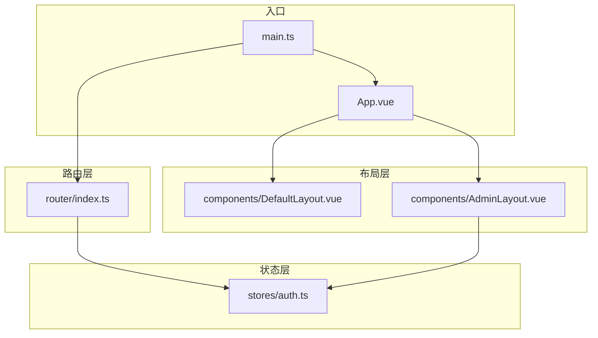
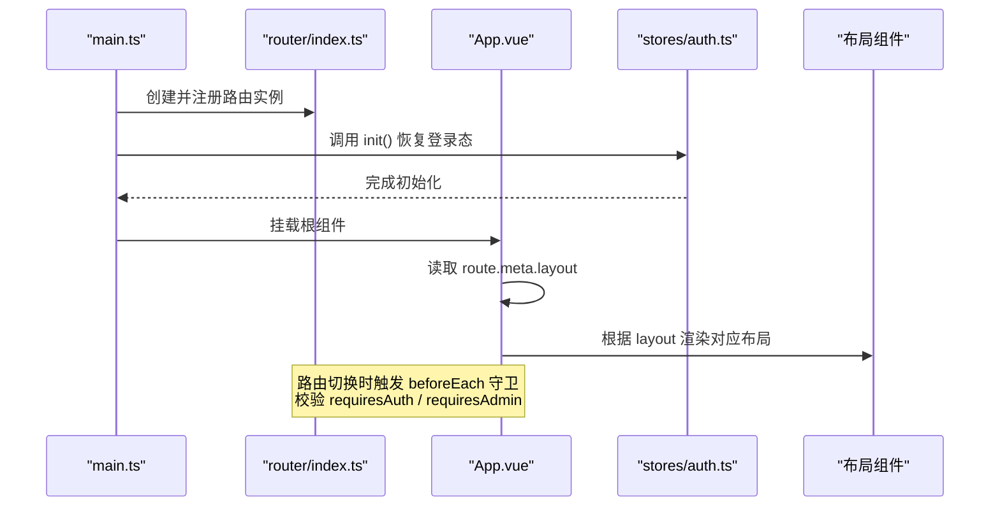
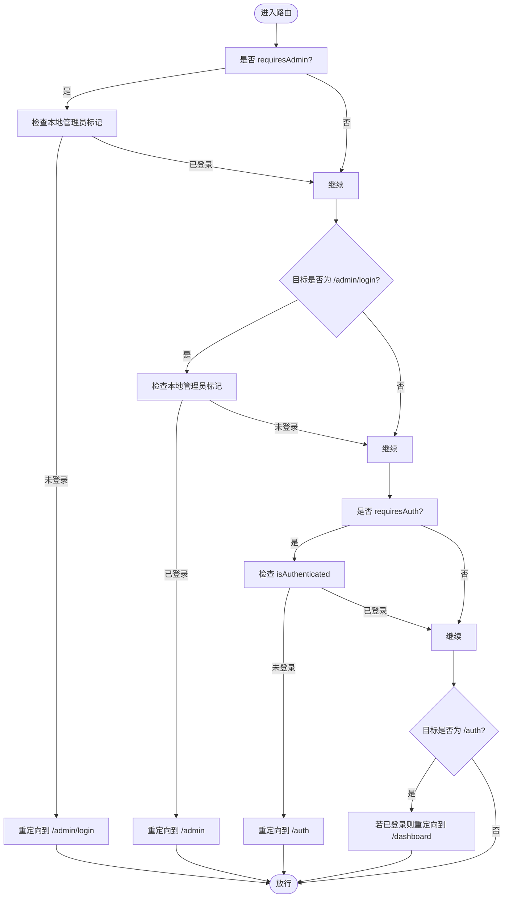
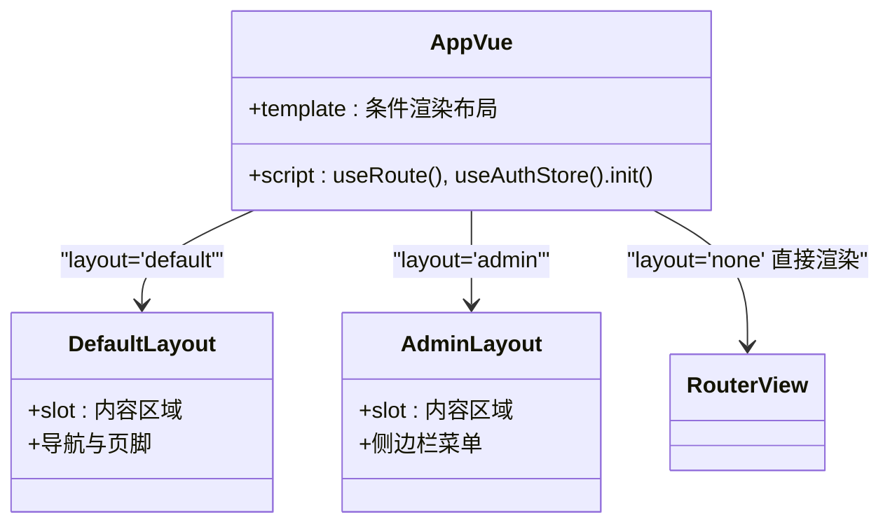
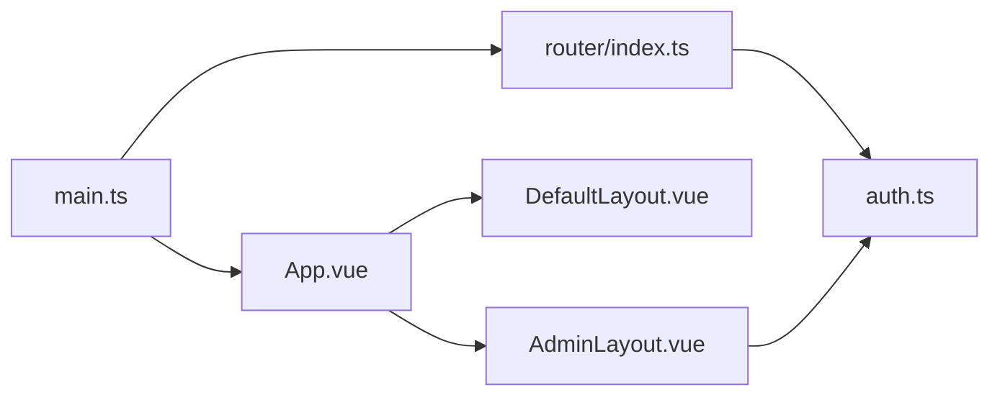

# 路由配置管理

<cite>
**本文引用的文件**
- [frontEnd/src/router/index.ts](file://frontEnd/src/router/index.ts)
- [frontEnd/src/App.vue](file://frontEnd/src/App.vue)
- [frontEnd/src/main.ts](file://frontEnd/src/main.ts)
- [frontEnd/src/stores/auth.ts](file://frontEnd/src/stores/auth.ts)
- [frontEnd/src/components/AdminLayout.vue](file://frontEnd/src/components/AdminLayout.vue)
- [frontEnd/src/components/DefaultLayout.vue](file://frontEnd/src/components/DefaultLayout.vue)
</cite>

## 目录
1. [简介](#简介)
2. [项目结构](#项目结构)
3. [核心组件](#核心组件)
4. [架构总览](#架构总览)
5. [详细组件分析](#详细组件分析)
6. [依赖关系分析](#依赖关系分析)
7. [性能与优化](#性能与优化)
8. [故障排查指南](#故障排查指南)
9. [结论](#结论)
10. [附录：开发规范与实践](#附录开发规范与实践)

## 简介
本文件面向 HR XF 前端的路由配置与管理，系统性梳理 Vue Router 的配置、组织方式、守卫机制、权限控制、懒加载、元信息使用、编程式导航以及性能优化策略。文档以仓库实际实现为依据，帮助开发者快速理解并扩展路由体系。

## 项目结构
前端采用单页应用（SPA）架构，路由定义集中于 router 模块，布局通过 App.vue 根据路由元信息进行动态切换，登录态与管理员状态分别由 Pinia store 与本地存储维护。

图示来源
- [frontEnd/src/main.ts:1-19](file://frontEnd/src/main.ts#L1-L19)
- [frontEnd/src/App.vue:1-21](file://frontEnd/src/App.vue#L1-L21)
- [frontEnd/src/router/index.ts:1-166](file://frontEnd/src/router/index.ts#L1-L166)
- [frontEnd/src/components/DefaultLayout.vue:1-139](file://frontEnd/src/components/DefaultLayout.vue#L1-L139)
- [frontEnd/src/components/AdminLayout.vue:1-110](file://frontEnd/src/components/AdminLayout.vue#L1-L110)
- [frontEnd/src/stores/auth.ts:1-314](file://frontEnd/src/stores/auth.ts#L1-L314)

章节来源
- [frontEnd/src/main.ts:1-19](file://frontEnd/src/main.ts#L1-L19)
- [frontEnd/src/App.vue:1-21](file://frontEnd/src/App.vue#L1-L21)
- [frontEnd/src/router/index.ts:1-166](file://frontEnd/src/router/index.ts#L1-L166)

## 核心组件
- 路由定义与全局守卫：集中定义所有路由记录、滚动行为与前置守卫逻辑，统一处理普通用户与管理端访问控制。
- 布局选择器：在根组件中依据路由 meta.layout 动态渲染不同布局容器。
- 认证状态管理：基于 Pinia 的认证 Store，负责 token 恢复、鉴权判断与登出清理。
- 布局组件：默认布局与管理后台布局，内部包含导航与跳转逻辑。

章节来源
- [frontEnd/src/router/index.ts:1-166](file://frontEnd/src/router/index.ts#L1-L166)
- [frontEnd/src/App.vue:1-21](file://frontEnd/src/App.vue#L1-L21)
- [frontEnd/src/stores/auth.ts:1-314](file://frontEnd/src/stores/auth.ts#L1-L314)
- [frontEnd/src/components/DefaultLayout.vue:1-139](file://frontEnd/src/components/DefaultLayout.vue#L1-L139)
- [frontEnd/src/components/AdminLayout.vue:1-110](file://frontEnd/src/components/AdminLayout.vue#L1-L110)

## 架构总览
下图展示了从应用启动到页面渲染的关键流程，包括路由初始化、守卫执行、布局选择与认证状态恢复。

图示来源
- [frontEnd/src/main.ts:1-19](file://frontEnd/src/main.ts#L1-L19)
- [frontEnd/src/router/index.ts:122-164](file://frontEnd/src/router/index.ts#L122-L164)
- [frontEnd/src/App.vue:1-21](file://frontEnd/src/App.vue#L1-L21)
- [frontEnd/src/stores/auth.ts:72-83](file://frontEnd/src/stores/auth.ts#L72-L83)

## 详细组件分析

### 路由定义与组织结构
- 路由模式：使用 History 模式，便于部署与 SEO。
- 路由组织：扁平化定义，按功能域划分路径前缀（如 /admin、/career、/interview、/resume、/oj）。
- 动态路由：多处使用参数段（如 :id、:type），用于详情与结果页。
- 懒加载：组件均采用函数式 import 实现按需加载，减少首屏体积。
- 滚动行为：支持 hash 锚点平滑滚动，否则回到顶部或恢复上次位置。

章节来源
- [frontEnd/src/router/index.ts:1-134](file://frontEnd/src/router/index.ts#L1-L134)

#### 路由表概览（节选）
- 首页与公共页：/、/auth
- 用户中心：/dashboard、/profile、/settings
- 简历相关：/resume、/resume/optimize
- OJ 题目：/oj/problem/:id
- 职业测评：/career/test/:type、/career/result/:id、/career/history
- 面试相关：/interview/session/:id、/interview/report/:id、/interview/history
- 管理后台：/admin/login、/admin、/admin/users、/admin/problems、/admin/posts

章节来源
- [frontEnd/src/router/index.ts:5-120](file://frontEnd/src/router/index.ts#L5-L120)

### 路由守卫与权限控制
- 全局前置守卫：
  - 管理端守卫：当路由 meta.requiresAdmin 为真时，检查本地管理员标记；未登录则重定向至管理登录页；已登录访问登录页则直接跳往管理后台。
  - 普通用户守卫：当路由 meta.requiresAuth 为真且未登录，重定向至登录页；已登录访问登录页则重定向至仪表盘。
- 权限数据源：
  - 普通用户：通过 Pinia 认证 Store 的 isAuthenticated 计算属性判定。
  - 管理员：通过 localStorage 中的特定键值进行判定。

图示来源
- [frontEnd/src/router/index.ts:138-164](file://frontEnd/src/router/index.ts#L138-L164)
- [frontEnd/src/stores/auth.ts:69-83](file://frontEnd/src/stores/auth.ts#L69-L83)

章节来源
- [frontEnd/src/router/index.ts:136-164](file://frontEnd/src/router/index.ts#L136-L164)
- [frontEnd/src/stores/auth.ts:69-83](file://frontEnd/src/stores/auth.ts#L69-L83)

### 布局切换与元信息
- 元信息约定：meta.layout 支持 'default'、'admin'、'none' 三种布局策略。
- 根组件逻辑：根据当前路由的 meta.layout 条件渲染 DefaultLayout 或 AdminLayout；当为 'none' 时不包裹任何布局。
- 典型用法：
  - 公共落地页使用 'default' 布局。
  - 管理后台页面使用 'admin' 布局。
  - 登录页等全屏页面使用 'none' 布局。

图示来源
- [frontEnd/src/App.vue:1-21](file://frontEnd/src/App.vue#L1-L21)
- [frontEnd/src/components/DefaultLayout.vue:1-139](file://frontEnd/src/components/DefaultLayout.vue#L1-L139)
- [frontEnd/src/components/AdminLayout.vue:1-110](file://frontEnd/src/components/AdminLayout.vue#L1-L110)

章节来源
- [frontEnd/src/App.vue:1-21](file://frontEnd/src/App.vue#L1-L21)
- [frontEnd/src/components/DefaultLayout.vue:1-139](file://frontEnd/src/components/DefaultLayout.vue#L1-L139)
- [frontEnd/src/components/AdminLayout.vue:1-110](file://frontEnd/src/components/AdminLayout.vue#L1-L110)

### 编程式导航与最佳实践
- 管理后台退出与返回首页：在 AdminLayout 中通过 useRouter.push 进行跳转，并在跳转前清理本地管理员标记。
- 推荐实践：
  - 优先使用命名路由进行跳转，避免硬编码路径。
  - 需要携带参数时使用 params，注意配合路由守卫与页面内参数校验。
  - 跳转前尽量在守卫层做权限校验，组件内仅关注业务逻辑。

章节来源
- [frontEnd/src/components/AdminLayout.vue:96-108](file://frontEnd/src/components/AdminLayout.vue#L96-L108)

### 嵌套路由与动态路由
- 动态路由：多处使用 :id、:type 等参数段，适用于详情、报告、结果类页面。
- 嵌套路由：当前路由表为扁平结构，未显式使用 children 嵌套。如需构建多级菜单或共享布局，可在后续演进中引入嵌套路由以提升可维护性。

章节来源
- [frontEnd/src/router/index.ts:37-89](file://frontEnd/src/router/index.ts#L37-L89)

### 路由懒加载与性能优化
- 懒加载：所有视图组件均通过函数式 import 实现按需加载，降低首屏资源体积。
- 建议优化：
  - 对大型第三方库进一步拆分与按需引入。
  - 结合浏览器缓存与 CDN 提升静态资源加载速度。
  - 对长列表或复杂页面考虑虚拟滚动与分页加载。

章节来源
- [frontEnd/src/router/index.ts:5-120](file://frontEnd/src/router/index.ts#L5-L120)

### 路由元信息的扩展建议
- 当前元信息字段：
  - layout：用于布局切换。
  - requiresAuth：用于普通用户鉴权。
  - requiresAdmin：用于管理端鉴权。
- 可扩展字段（建议在后续迭代中逐步完善）：
  - title：页面标题，配合 document.title 更新。
  - breadcrumb：面包屑数组，用于导航展示。
  - keepAlive：是否需要缓存页面状态。
  - roles：角色白名单，用于更细粒度的权限控制。

[本节为概念性建议，不直接分析具体代码文件]

## 依赖关系分析
- 入口依赖：main.ts 注入 Pinia 与 Router，并在认证初始化完成后挂载应用。
- 根组件依赖：App.vue 依赖路由与布局组件，并根据路由元信息选择布局。
- 路由依赖：router/index.ts 依赖认证 Store 进行鉴权判断。
- 布局依赖：AdminLayout 与 DefaultLayout 依赖路由与认证 Store 提供导航与用户信息。

图示来源
- [frontEnd/src/main.ts:1-19](file://frontEnd/src/main.ts#L1-L19)
- [frontEnd/src/App.vue:1-21](file://frontEnd/src/App.vue#L1-L21)
- [frontEnd/src/router/index.ts:1-166](file://frontEnd/src/router/index.ts#L1-L166)
- [frontEnd/src/components/DefaultLayout.vue:1-139](file://frontEnd/src/components/DefaultLayout.vue#L1-L139)
- [frontEnd/src/components/AdminLayout.vue:1-110](file://frontEnd/src/components/AdminLayout.vue#L1-L110)
- [frontEnd/src/stores/auth.ts:1-314](file://frontEnd/src/stores/auth.ts#L1-L314)

章节来源
- [frontEnd/src/main.ts:1-19](file://frontEnd/src/main.ts#L1-L19)
- [frontEnd/src/App.vue:1-21](file://frontEnd/src/App.vue#L1-L21)
- [frontEnd/src/router/index.ts:1-166](file://frontEnd/src/router/index.ts#L1-L166)
- [frontEnd/src/stores/auth.ts:1-314](file://frontEnd/src/stores/auth.ts#L1-L314)

## 性能与优化
- 路由级懒加载：已在路由层全面启用，有效降低首屏包体。
- 滚动体验：支持 hash 锚点平滑滚动，提升长页面浏览体验。
- 建议：
  - 对大组件进一步拆分为子组件并按需加载。
  - 结合 KeepAlive 与路由元信息缓存高频访问页面。
  - 对图片与静态资源启用压缩与 CDN。

[本节提供通用指导，不直接分析具体代码文件]

## 故障排查指南
- 登录后仍被重定向到登录页：
  - 检查认证 Store 的初始化是否成功，确认 token 是否正确写入与读取。
  - 确认路由 meta.requiresAuth 设置是否符合预期。
- 管理后台无法进入或被重定向：
  - 检查本地管理员标记是否存在且值为 true。
  - 确认路由 meta.requiresAdmin 设置是否正确。
- 页面布局异常：
  - 检查路由 meta.layout 的值是否与根组件的条件匹配。
- 滚动行为不符合预期：
  - 检查目标路由是否包含 hash，或保存的位置是否可用。

章节来源
- [frontEnd/src/stores/auth.ts:72-83](file://frontEnd/src/stores/auth.ts#L72-L83)
- [frontEnd/src/router/index.ts:138-164](file://frontEnd/src/router/index.ts#L138-L164)
- [frontEnd/src/App.vue:1-21](file://frontEnd/src/App.vue#L1-L21)

## 结论
本项目的前端路由体系清晰、职责明确：路由定义集中、守卫统一、布局按元信息切换、懒加载全面启用。在此基础上，建议逐步完善元信息模型（title、breadcrumb、keepAlive、roles），并引入嵌套路由与更细粒度的权限控制，以提升可维护性与扩展性。

[本节为总结性内容，不直接分析具体代码文件]

## 附录：开发规范与实践
- 路由命名与路径
  - 使用语义化的 path 与 name，避免过深层级。
  - 动态参数统一使用小写与短横线风格（如 :user-id）。
- 元信息规范
  - layout：'default' | 'admin' | 'none'
  - requiresAuth：boolean
  - requiresAdmin：boolean
  - 建议新增：title、breadcrumb、keepAlive、roles
- 守卫编写
  - 将鉴权逻辑集中在 beforeEach，组件内只做业务校验。
  - 对管理员与普通用户分别维护独立的鉴权数据源。
- 懒加载
  - 所有视图组件必须使用函数式 import。
  - 对大型组件进一步拆分并按需加载。
- 编程式导航
  - 优先使用命名路由与 params。
  - 跳转前确保必要的权限与参数校验。

[本节为通用规范，不直接分析具体代码文件]