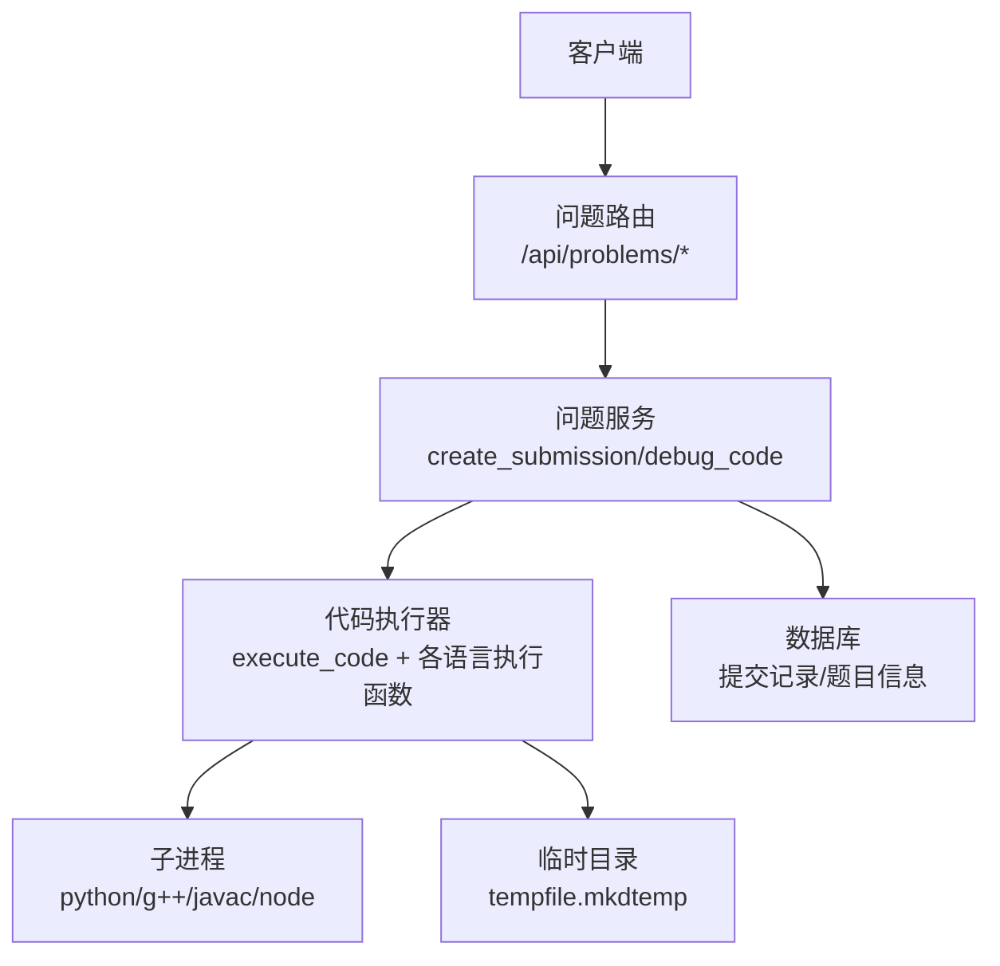
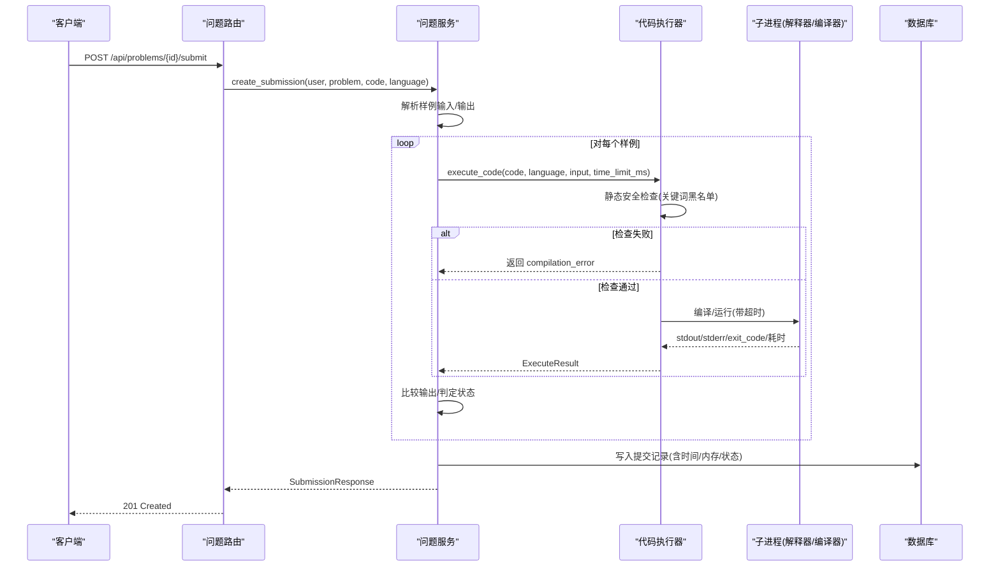
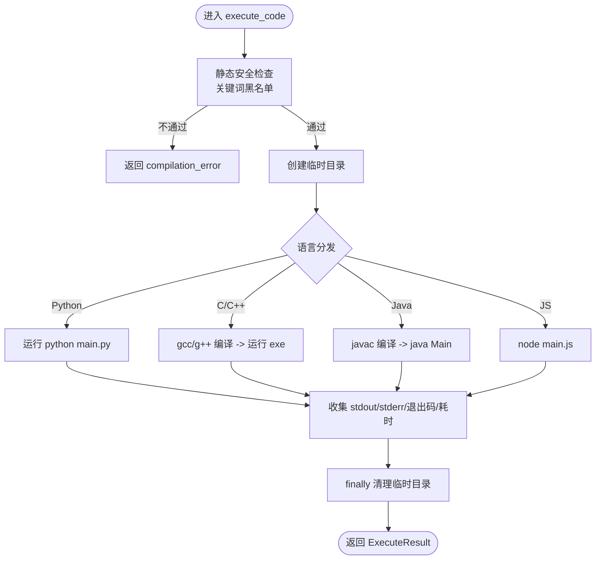
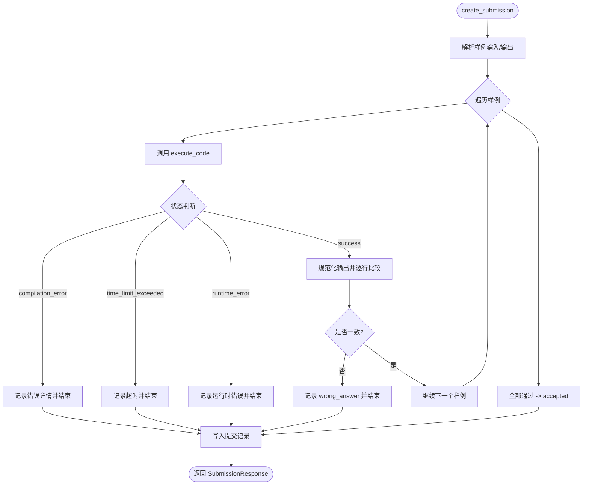
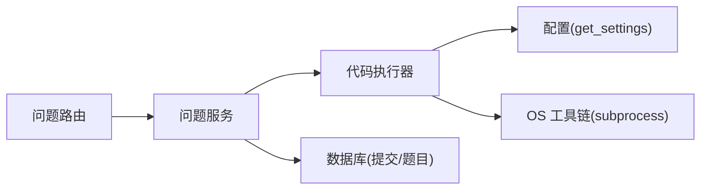

# 代码执行沙箱

<cite>
**本文引用的文件**   
- [code_executor.py](file://backEnd/app/services/code_executor.py)
- [problem_service.py](file://backEnd/app/services/problem_service.py)
- [problem.py](file://backEnd/app/models/problem.py)
- [problem.py（路由）](file://backEnd/app/routers/problem.py)
- [problem.py（模式定义）](file://backEnd/app/schemas/problem.py)
- [config.py](file://backEnd/app/config.py)
- [main.py](file://backEnd/app/main.py)
</cite>

## 目录
1. [简介](#简介)
2. [项目结构](#项目结构)
3. [核心组件](#核心组件)
4. [架构总览](#架构总览)
5. [详细组件分析](#详细组件分析)
6. [依赖关系分析](#依赖关系分析)
7. [性能与并发](#性能与并发)
8. [故障排查指南](#故障排查指南)
9. [结论](#结论)
10. [附录：配置与安全加固建议](#附录配置与安全加固建议)

## 简介
本技术文档聚焦于 HR XF 在线编程平台的“代码执行沙箱”实现，围绕安全隔离、资源限制、执行流程、错误处理、并发优化与可观测性等方面展开。当前实现基于 Python 的 subprocess 调用外部解释器/编译器，在进程级运行用户代码，并通过关键词黑名单进行静态安全检查；同时提供线程池异步包装以提升并发能力。

## 项目结构
与代码执行沙箱直接相关的后端模块主要位于 backEnd/app 下：
- 服务层：问题提交与判题逻辑、调试接口
- 执行器：子进程调度、语言分发、超时控制、临时目录管理
- 模型与模式：题目与提交记录的数据结构与字段约束
- 路由：HTTP 入口，接收提交与调试请求
- 配置：编译器路径与环境变量加载

图表来源
- [problem.py（路由）:121-175](file://backEnd/app/routers/problem.py#L121-L175)
- [problem_service.py:95-202](file://backEnd/app/services/problem_service.py#L95-L202)
- [code_executor.py:270-444](file://backEnd/app/services/code_executor.py#L270-L444)

章节来源
- [main.py:44-68](file://backEnd/app/main.py#L44-L68)
- [problem.py（路由）:121-175](file://backEnd/app/routers/problem.py#L121-L175)
- [problem_service.py:95-202](file://backEnd/app/services/problem_service.py#L95-L202)
- [code_executor.py:270-444](file://backEnd/app/services/code_executor.py#L270-L444)

## 核心组件
- 代码执行器（code_executor.py）
  - 负责语言识别、静态安全检查、编译/运行、超时控制、结果封装
  - 支持语言：python3、c、cpp、java、javascript
  - 使用 ThreadPoolExecutor 将阻塞式子进程调用异步化
- 问题服务（problem_service.py）
  - 解析样例输入输出，循环执行并比对结果，生成提交记录
  - 提供调试接口，返回执行输出与状态
- 路由（routers/problem.py）
  - 暴露提交与调试 API，校验认证与参数
- 模型与模式（models/problem.py, schemas/problem.py）
  - 定义题目与提交的字段，包含 time_limit、memory_limit 等
- 配置（config.py）
  - 通过 .env 或环境变量注入编译器路径，未设置则从 PATH 自动检测

章节来源
- [code_executor.py:1-170](file://backEnd/app/services/code_executor.py#L1-L170)
- [problem_service.py:95-202](file://backEnd/app/services/problem_service.py#L95-L202)
- [problem.py（路由）:121-175](file://backEnd/app/routers/problem.py#L121-L175)
- [problem.py（模型）:17-88](file://backEnd/app/models/problem.py#L17-L88)
- [problem.py（模式）:59-103](file://backEnd/app/schemas/problem.py#L59-L103)
- [config.py:39-46](file://backEnd/app/config.py#L39-L46)

## 架构总览
下图展示了从 HTTP 请求到子进程执行的完整链路，以及关键的安全与资源控制点。

图表来源
- [problem.py（路由）:121-175](file://backEnd/app/routers/problem.py#L121-L175)
- [problem_service.py:95-202](file://backEnd/app/services/problem_service.py#L95-L202)
- [code_executor.py:270-444](file://backEnd/app/services/code_executor.py#L270-L444)

## 详细组件分析

### 代码执行器（安全与执行）
- 安全策略
  - 关键词黑名单：按语言维护危险模式集合，匹配后拒绝执行并返回错误详情
  - 覆盖范围：系统命令、文件系统破坏、进程/网络、动态执行、反射/类加载、敏感环境变量等
- 执行流程
  - 创建临时目录，写入源码
  - 根据语言选择编译器/解释器路径（优先 .env 配置，否则 PATH 自动检测）
  - 编译阶段（C/C++/Java）与运行阶段分别以子进程执行，统一超时控制
  - 捕获超时与异常，标准化为 ExecuteResult
- 并发与资源
  - 使用固定大小的线程池（默认 4）承载阻塞式子进程调用
  - 超时由子进程级别 timeout 控制，避免长时间占用线程
- 清理
  - finally 中删除临时目录，降低残留风险

图表来源
- [code_executor.py:154-170](file://backEnd/app/services/code_executor.py#L154-L170)
- [code_executor.py:270-444](file://backEnd/app/services/code_executor.py#L270-L444)

章节来源
- [code_executor.py:21-170](file://backEnd/app/services/code_executor.py#L21-L170)
- [code_executor.py:270-444](file://backEnd/app/services/code_executor.py#L270-L444)

### 问题服务（判题与调试）
- 判题流程
  - 读取题目的 sample_input/sample_output（JSON 数组）
  - 逐组样例调用 execute_code，累计最大执行时间
  - 若出现编译错误、运行时错误或超时，立即终止并记录错误详情
  - 正常情况按行规范化后对比输出，不一致标记 wrong_answer
- 调试接口
  - 直接执行并返回 stdout/stderr/退出码/耗时/状态，便于前端调试
- 数据持久化
  - 写入 Submission 记录，包含 status、execution_time、execution_memory（当前实现未采集实际内存）

图表来源
- [problem_service.py:95-202](file://backEnd/app/services/problem_service.py#L95-L202)

章节来源
- [problem_service.py:95-202](file://backEnd/app/services/problem_service.py#L95-L202)

### 路由与模式（API 契约）
- 路由
  - POST /api/problems/{id}/submit：提交代码并触发判题
  - POST /api/problems/{id}/debug：调试执行，返回原始输出
- 模式
  - 语言白名单校验：仅允许 python3/python/c/cpp/java/javascript
  - 响应字段包含 execution_time、execution_memory、error_detail 等

章节来源
- [problem.py（路由）:121-175](file://backEnd/app/routers/problem.py#L121-L175)
- [problem.py（模式）:59-103](file://backEnd/app/schemas/problem.py#L59-L103)

### 模型与配置（数据结构与环境）
- 模型
  - Problem：包含 time_limit、memory_limit 等字段
  - Submission：记录 user_id、problem_id、code、language、status、execution_time、execution_memory
- 配置
  - 编译器路径可通过 .env 覆盖，未设置时从 PATH 自动检测
  - 提供统一的 get_settings() 缓存获取

章节来源
- [problem.py（模型）:17-88](file://backEnd/app/models/problem.py#L17-L88)
- [config.py:39-46](file://backEnd/app/config.py#L39-L46)

## 依赖关系分析
- 模块耦合
  - 路由依赖服务层；服务层依赖执行器与数据库；执行器依赖配置与操作系统工具链
- 外部依赖
  - 子进程：python、gcc/g++、javac/java、node
  - 标准库：subprocess、tempfile、concurrent.futures、re、shutil
- 潜在循环依赖
  - 当前未见循环导入；执行器仅依赖配置与服务层无反向依赖

图表来源
- [problem.py（路由）:121-175](file://backEnd/app/routers/problem.py#L121-L175)
- [problem_service.py:95-202](file://backEnd/app/services/problem_service.py#L95-L202)
- [code_executor.py:17-170](file://backEnd/app/services/code_executor.py#L17-L170)
- [config.py:68-71](file://backEnd/app/config.py#L68-L71)

章节来源
- [problem.py（路由）:121-175](file://backEnd/app/routers/problem.py#L121-L175)
- [problem_service.py:95-202](file://backEnd/app/services/problem_service.py#L95-L202)
- [code_executor.py:17-170](file://backEnd/app/services/code_executor.py#L17-L170)
- [config.py:68-71](file://backEnd/app/config.py#L68-L71)

## 性能与并发
- 线程池
  - 使用 ThreadPoolExecutor(max_workers=4) 承载阻塞式子进程，避免事件循环被阻塞
- 超时控制
  - 子进程级别 timeout 防止无限等待；超时统一转换为 time_limit_exceeded
- I/O 与磁盘
  - 每次执行创建独立临时目录，完成后清理；注意高并发下的磁盘 I/O 开销
- 扩展建议
  - 根据负载调整线程池大小
  - 引入队列与优先级，限制并发执行数，避免资源争用

[本节为通用指导，无需特定文件引用]

## 故障排查指南
- 常见错误类型
  - 编译错误：C/C++/Java 编译失败，stderr 中包含编译器输出
  - 运行时错误：程序崩溃或抛出异常，exit_code != 0
  - 超时：子进程超过 time_limit_ms，返回 time_limit_exceeded
  - 安全拦截：命中关键词黑名单，直接拒绝执行
- 定位方法
  - 查看 DebugResponse 中的 stderr 与 exit_code
  - 检查日志中“Code rejected”警告，确认具体匹配的危险片段
  - 确认编译器路径是否正确（.env 或 PATH），必要时显式配置
- 恢复措施
  - 修正代码语法/逻辑
  - 优化算法复杂度以降低执行时间
  - 移除危险操作或重构为安全替代方案

章节来源
- [problem_service.py:130-159](file://backEnd/app/services/problem_service.py#L130-L159)
- [code_executor.py:154-170](file://backEnd/app/services/code_executor.py#L154-L170)
- [problem.py（模式）:84-103](file://backEnd/app/schemas/problem.py#L84-L103)

## 结论
当前沙箱通过“静态安全检查 + 子进程隔离 + 超时控制 + 临时目录隔离”的组合，实现了基础安全的代码执行环境。其优势在于实现简洁、易于部署；不足在于缺乏更严格的系统级隔离（如容器/命名空间）、细粒度资源限制（CPU/内存/IO）与网络访问控制。建议在后续迭代中引入容器化与 cgroups 等机制，进一步提升安全性与可控性。

[本节为总结性内容，无需特定文件引用]

## 附录：配置与安全加固建议

- 配置项（来自配置文件）
  - 编译器路径：python_bin、gcc_bin、gpp_bin、java_bin、javac_bin、node_bin（可选，未设置则从 PATH 自动检测）
  - 其他：数据库、JWT、CORS、MinIO、Deepseek 等（与沙箱间接相关）

章节来源
- [config.py:39-46](file://backEnd/app/config.py#L39-L46)

- 安全加固最佳实践
  - 进程隔离：使用容器（Docker/LXC）或 Linux 命名空间/沙箱工具（firejail、bubblewrap）隔离用户进程
  - 资源限制：通过 cgroups 限制 CPU、内存、文件描述符、网络带宽与 IO 速率
  - 文件系统：只读根文件系统，挂载最小必要目录，严格白名单访问
  - 网络：禁用出站连接或仅允许受限域名/IP，关闭回环外网访问
  - 内核参数：禁用危险系统调用，限制权限位（noexec、nosuid、nodev）
  - 代码审查：持续更新关键词黑名单，结合 AST/字节码分析减少误报/漏报
  - 审计与告警：记录所有执行上下文（语言、时间、资源消耗、错误），建立监控与告警

- 性能监控与调试
  - 指标采集：执行耗时、退出码、错误类型分布、并发度、线程池利用率
  - 日志规范：结构化日志，包含 trace_id、user_id、problem_id、language、time_limit_ms
  - 调试工具：启用 Debug 接口快速验证；在生产环境保留最小化日志，避免泄露敏感信息

[本节为通用指导，无需特定文件引用]