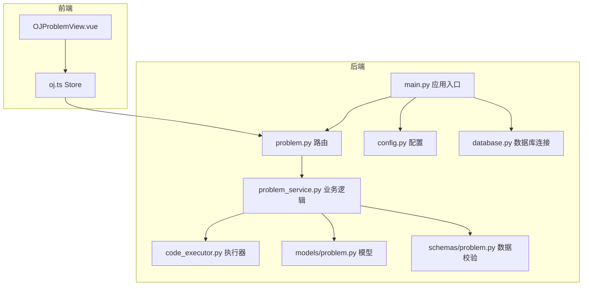
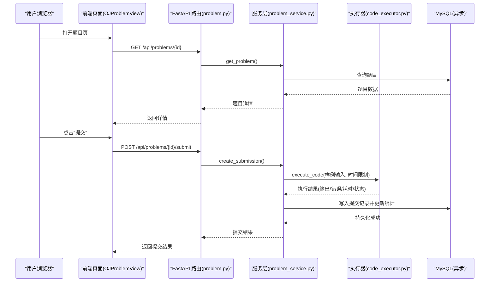
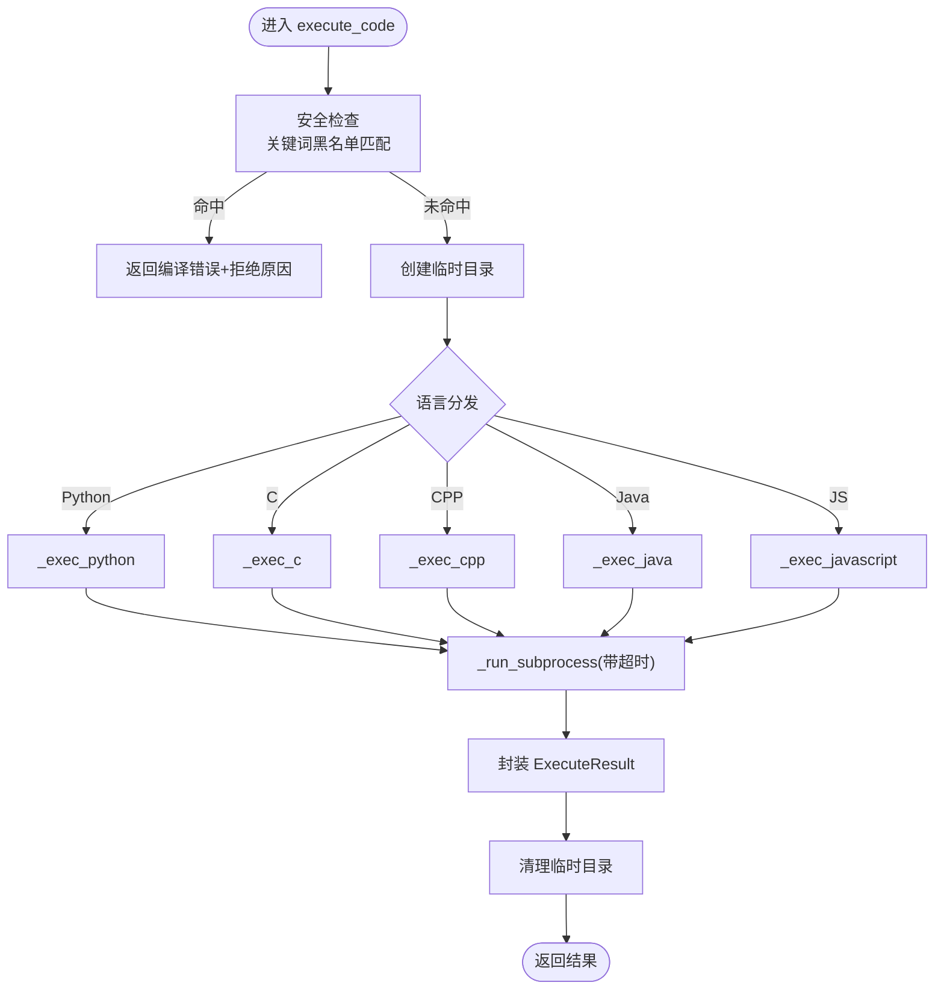
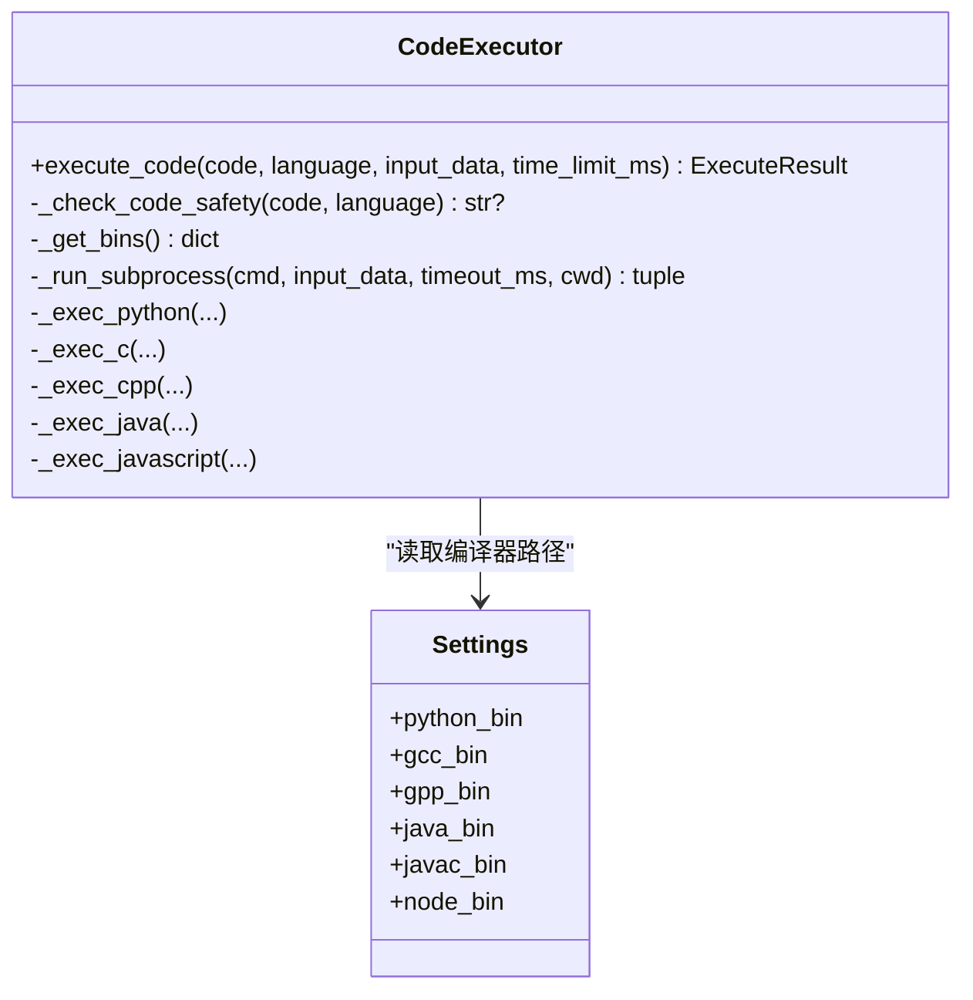
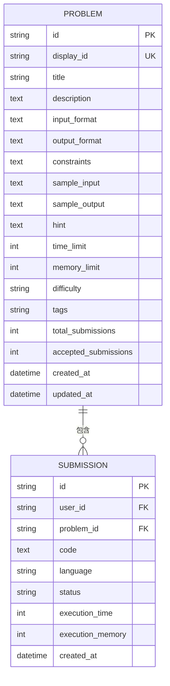
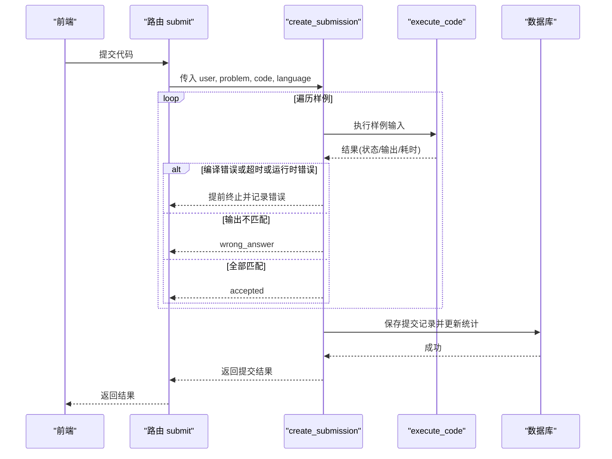
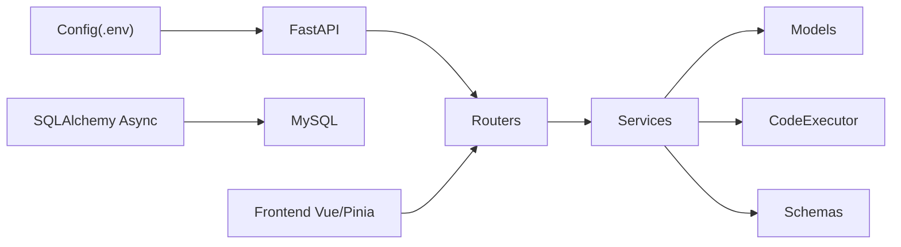

# 在线编程平台

<cite>
**本文引用的文件列表**
- [backEnd/app/main.py](file://backEnd/app/main.py)
- [backEnd/app/config.py](file://backEnd/app/config.py)
- [backEnd/app/database.py](file://backEnd/app/database.py)
- [backEnd/app/dependencies.py](file://backEnd/app/dependencies.py)
- [backEnd/app/models/problem.py](file://backEnd/app/models/problem.py)
- [backEnd/app/routers/problem.py](file://backEnd/app/routers/problem.py)
- [backEnd/app/schemas/problem.py](file://backEnd/app/schemas/problem.py)
- [backEnd/app/services/code_executor.py](file://backEnd/app/services/code_executor.py)
- [backEnd/app/services/problem_service.py](file://backEnd/app/services/problem_service.py)
- [frontEnd/src/views/OJProblemView.vue](file://frontEnd/src/views/OJProblemView.vue)
- [frontEnd/src/stores/oj.ts](file://frontEnd/src/stores/oj.ts)
- [backEnd/requirements.txt](file://backEnd/requirements.txt)
</cite>

## 目录
1. [简介](#简介)
2. [项目结构](#项目结构)
3. [核心组件](#核心组件)
4. [架构总览](#架构总览)
5. [详细组件分析](#详细组件分析)
6. [依赖关系分析](#依赖关系分析)
7. [性能与并发优化](#性能与并发优化)
8. [故障排查指南](#故障排查指南)
9. [结论](#结论)
10. [附录：扩展指南](#附录扩展指南)

## 简介
本技术文档面向 HR XF 在线编程平台（OJ）的开发者与维护者，系统性阐述以下主题：
- 代码执行沙箱的安全隔离机制与资源限制策略
- 多编程语言支持的具体实现（编译器配置、运行时环境、语言特定优化）
- 题目管理系统设计（分类、难度标签、测试用例管理）
- 提交、编译执行、结果判定的完整流程
- 性能分析与进度跟踪功能实现
- 前端代码编辑器集成方案与自定义配置
- 并发执行优化与错误处理策略
- 新增编程语言与问题类型的扩展指导

## 项目结构
后端采用 FastAPI + SQLAlchemy 异步 ORM + MySQL 的技术栈；前端基于 Vue 3 + Pinia。核心 OJ 能力集中在后端服务层与执行器模块，前端通过 API 完成题目浏览、调试与提交。

图表来源
- [backEnd/app/main.py:44-68](file://backEnd/app/main.py#L44-L68)
- [backEnd/app/routers/problem.py:1-20](file://backEnd/app/routers/problem.py#L1-L20)
- [backEnd/app/services/problem_service.py:1-20](file://backEnd/app/services/problem_service.py#L1-L20)
- [backEnd/app/services/code_executor.py:1-20](file://backEnd/app/services/code_executor.py#L1-L20)
- [backEnd/app/models/problem.py:17-55](file://backEnd/app/models/problem.py#L17-L55)
- [backEnd/app/schemas/problem.py:1-20](file://backEnd/app/schemas/problem.py#L1-L20)
- [backEnd/app/config.py:1-20](file://backEnd/app/config.py#L1-L20)
- [backEnd/app/database.py:31-43](file://backEnd/app/database.py#L31-L43)

章节来源
- [backEnd/app/main.py:44-68](file://backEnd/app/main.py#L44-L68)
- [backEnd/app/config.py:1-71](file://backEnd/app/config.py#L1-L71)
- [backEnd/app/database.py:31-57](file://backEnd/app/database.py#L31-L57)

## 核心组件
- 应用入口与中间件：注册路由、CORS、静态文件挂载、健康检查与全局异常处理
- 配置中心：集中管理数据库、JWT、CORS、编译器路径等
- 数据库层：异步引擎、会话工厂、Base 元数据、迁移适配
- 认证依赖：Bearer Token 解析与用户获取
- 题目模型与提交记录：ORM 映射、索引与统计字段
- 路由层：题目列表/详情、提交、调试、进度、标签选项
- 服务层：题目查询、提交判定、调试执行、进度统计、种子数据初始化
- 执行器：安全扫描、子进程执行、超时控制、临时目录清理
- 前端视图与状态：题目展示、代码编辑、调试运行、提交弹窗、最近提交记录

章节来源
- [backEnd/app/main.py:44-90](file://backEnd/app/main.py#L44-L90)
- [backEnd/app/config.py:7-71](file://backEnd/app/config.py#L7-L71)
- [backEnd/app/database.py:31-57](file://backEnd/app/database.py#L31-L57)
- [backEnd/app/dependencies.py:10-40](file://backEnd/app/dependencies.py#L10-L40)
- [backEnd/app/models/problem.py:17-88](file://backEnd/app/models/problem.py#L17-L88)
- [backEnd/app/routers/problem.py:47-175](file://backEnd/app/routers/problem.py#L47-L175)
- [backEnd/app/services/problem_service.py:95-202](file://backEnd/app/services/problem_service.py#L95-L202)
- [backEnd/app/services/code_executor.py:270-321](file://backEnd/app/services/code_executor.py#L270-L321)
- [frontEnd/src/views/OJProblemView.vue:289-500](file://frontEnd/src/views/OJProblemView.vue#L289-L500)
- [frontEnd/src/stores/oj.ts:123-268](file://frontEnd/src/stores/oj.ts#L123-L268)

## 架构总览
系统采用前后端分离架构。前端通过 RESTful API 调用后端 OJ 能力。后端以 FastAPI 为 Web 框架，使用 SQLAlchemy 异步访问 MySQL，并通过子进程执行用户代码。

图表来源
- [backEnd/app/routers/problem.py:121-175](file://backEnd/app/routers/problem.py#L121-L175)
- [backEnd/app/services/problem_service.py:95-179](file://backEnd/app/services/problem_service.py#L95-L179)
- [backEnd/app/services/code_executor.py:270-321](file://backEnd/app/services/code_executor.py#L270-L321)
- [backEnd/app/models/problem.py:57-88](file://backEnd/app/models/problem.py#L57-L88)

## 详细组件分析

### 代码执行沙箱与安全隔离
- 关键词黑名单：针对 Python/C/C++/Java/JavaScript 分别定义危险模式集合，覆盖系统命令、文件系统破坏、进程创建、网络监听、动态导入、eval/exec 等高危操作
- 预检拦截：在执行前对源码进行正则匹配，命中则直接拒绝并返回错误信息
- 子进程隔离：通过 subprocess 在独立进程中运行用户代码，设置超时，捕获 stdout/stderr 与退出码
- 临时目录：每次执行使用独立临时目录，执行后清理
- 线程池并发：使用 ThreadPoolExecutor 将阻塞的子进程调用放入线程池，避免阻塞事件循环

图表来源
- [backEnd/app/services/code_executor.py:154-167](file://backEnd/app/services/code_executor.py#L154-L167)
- [backEnd/app/services/code_executor.py:270-321](file://backEnd/app/services/code_executor.py#L270-L321)
- [backEnd/app/services/code_executor.py:220-267](file://backEnd/app/services/code_executor.py#L220-L267)

章节来源
- [backEnd/app/services/code_executor.py:25-151](file://backEnd/app/services/code_executor.py#L25-L151)
- [backEnd/app/services/code_executor.py:169-198](file://backEnd/app/services/code_executor.py#L169-L198)
- [backEnd/app/services/code_executor.py:270-321](file://backEnd/app/services/code_executor.py#L270-L321)

### 多编程语言支持与编译器配置
- 支持语言：python3、c、cpp、java、javascript
- 编译器路径解析：优先从 .env 配置读取，否则自动从 PATH 检测
- 语言特定编译参数：
  - C/C++：启用 -O2 优化，链接数学库 -lm
  - Java：显式指定 UTF-8 编码，避免 Windows GBK 导致编译错误
  - JavaScript：通过 Node.js 运行
- 统一执行接口：execute_code 根据语言分发到对应执行函数

图表来源
- [backEnd/app/services/code_executor.py:173-207](file://backEnd/app/services/code_executor.py#L173-L207)
- [backEnd/app/services/code_executor.py:323-443](file://backEnd/app/services/code_executor.py#L323-L443)
- [backEnd/app/config.py:39-46](file://backEnd/app/config.py#L39-L46)

章节来源
- [backEnd/app/services/code_executor.py:173-207](file://backEnd/app/services/code_executor.py#L173-L207)
- [backEnd/app/services/code_executor.py:323-443](file://backEnd/app/services/code_executor.py#L323-L443)
- [backEnd/app/config.py:39-46](file://backEnd/app/config.py#L39-L46)

### 题目管理系统设计
- 数据模型：
  - Problem：包含显示ID、标题、描述、输入/输出格式、约束、样例、提示、时间/内存限制、难度、标签、提交统计等
  - Submission：记录用户提交代码、语言、状态、执行时间与内存、创建时间
- 筛选与分页：支持按难度、标签、关键字筛选，返回总数与分页信息
- 标签体系：标签以逗号分隔字符串存储，提供“所有标签选项”接口用于前端筛选
- 通过率计算：基于 total_submissions 与 accepted_submissions 计算百分比

图表来源
- [backEnd/app/models/problem.py:17-88](file://backEnd/app/models/problem.py#L17-L88)

章节来源
- [backEnd/app/models/problem.py:17-88](file://backEnd/app/models/problem.py#L17-L88)
- [backEnd/app/routers/problem.py:47-90](file://backEnd/app/routers/problem.py#L47-L90)
- [backEnd/app/services/problem_service.py:370-382](file://backEnd/app/services/problem_service.py#L370-L382)

### 提交、编译执行与结果判定流程
- 提交入口：POST /api/problems/{id}/submit
- 服务层处理：
  - 解析样例输入/输出（JSON 数组）
  - 逐组样例调用执行器，比较输出（标准化换行、去除空白、逐行对比）
  - 判定状态：accepted/wrong_answer/runtime_error/time_limit_exceeded/compilation_error
  - 写入提交记录，更新题目统计
- 调试接口：POST /api/problems/{id}/debug，仅执行并返回输出与状态

图表来源
- [backEnd/app/routers/problem.py:121-151](file://backEnd/app/routers/problem.py#L121-L151)
- [backEnd/app/services/problem_service.py:95-179](file://backEnd/app/services/problem_service.py#L95-L179)
- [backEnd/app/services/code_executor.py:270-321](file://backEnd/app/services/code_executor.py#L270-L321)

章节来源
- [backEnd/app/routers/problem.py:121-175](file://backEnd/app/routers/problem.py#L121-L175)
- [backEnd/app/services/problem_service.py:95-202](file://backEnd/app/services/problem_service.py#L95-L202)

### 性能分析与进度跟踪
- 进度统计：
  - 总提交数、通过数、尝试题目数、通过题目数
  - 按难度统计：easy/medium/hard 的题目总数、已尝试、已通过
  - 按标签统计：最多返回前15个标签的总数与已通过数
  - 最近提交记录：限制最近10条，代码片段截断
- 前端展示：
  - 通过 store 拉取进度数据，渲染图表与列表
  - 提交成功后更新本地最近提交列表

章节来源
- [backEnd/app/services/problem_service.py:249-367](file://backEnd/app/services/problem_service.py#L249-L367)
- [frontEnd/src/stores/oj.ts:220-235](file://frontEnd/src/stores/oj.ts#L220-L235)
- [frontEnd/src/views/OJProblemView.vue:225-243](file://frontEnd/src/views/OJProblemView.vue#L225-L243)

### 前端代码编辑器集成与自定义配置
- 编辑器：使用原生 textarea 作为简易代码编辑器，支持多语言模板占位符
- 语言选择：下拉框切换 python3/c/cpp/java/javascript
- 调试运行：调用 debug 接口，显示标准输出、错误、执行时间与状态
- 提交交互：提交后弹出结果弹窗，显示状态与错误详情
- 本地缓存：首次通过的代码保存到 localStorage，下次进入自动恢复

章节来源
- [frontEnd/src/views/OJProblemView.vue:161-244](file://frontEnd/src/views/OJProblemView.vue#L161-L244)
- [frontEnd/src/views/OJProblemView.vue:378-459](file://frontEnd/src/views/OJProblemView.vue#L378-L459)
- [frontEnd/src/views/OJProblemView.vue:465-498](file://frontEnd/src/views/OJProblemView.vue#L465-L498)
- [frontEnd/src/stores/oj.ts:181-218](file://frontEnd/src/stores/oj.ts#L181-L218)

## 依赖关系分析
- 后端依赖：
  - FastAPI、Uvicorn、Pydantic Settings
  - SQLAlchemy 异步、aiomysql/pymysql、Alembic
  - JWT、密码哈希、HTTPX、PDF 提取、TTS
- 前端依赖：
  - Vue 3、Pinia、TypeScript、Vite、Tailwind

图表来源
- [backEnd/requirements.txt:1-27](file://backEnd/requirements.txt#L1-L27)
- [backEnd/app/main.py:44-68](file://backEnd/app/main.py#L44-L68)
- [backEnd/app/config.py:7-71](file://backEnd/app/config.py#L7-L71)

章节来源
- [backEnd/requirements.txt:1-27](file://backEnd/requirements.txt#L1-L27)
- [backEnd/app/main.py:44-68](file://backEnd/app/main.py#L44-L68)

## 性能与并发优化
- 执行器并发：
  - 使用 ThreadPoolExecutor(max_workers=4) 将阻塞的子进程执行放入线程池，避免阻塞事件循环
  - 每个语言执行函数均通过 _run_subprocess 异步包装，保证高并发下的响应性
- 超时控制：
  - 统一通过 _run_subprocess 的 timeout 参数限制执行时间，防止无限运行
- 编译优化：
  - C/C++ 使用 -O2 优化级别，提升运行效率
  - Java 强制 UTF-8 编码，减少跨平台编译失败
- 数据库连接池：
  - 配置 pool_size 与 max_overflow，提高并发读写能力
- 建议优化方向：
  - 增加执行器线程池大小与队列长度，结合压测调整
  - 引入任务队列（如 Celery/RQ）将判题异步化，避免请求阻塞
  - 对大输入/输出进行流式处理与限流，降低内存占用
  - 增加执行结果缓存（相同代码+输入），减少重复执行

章节来源
- [backEnd/app/services/code_executor.py:169-170](file://backEnd/app/services/code_executor.py#L169-L170)
- [backEnd/app/services/code_executor.py:220-267](file://backEnd/app/services/code_executor.py#L220-L267)
- [backEnd/app/services/code_executor.py:352-368](file://backEnd/app/services/code_executor.py#L352-L368)
- [backEnd/app/database.py:31-37](file://backEnd/app/database.py#L31-L37)

## 故障排查指南
- 验证错误处理：
  - 全局异常处理器过滤二进制内容导致的 UnicodeDecodeError，返回安全的 JSON 错误
- 常见错误定位：
  - 编译错误：查看 stderr 中的编译器输出，确认语法与头文件
  - 运行时错误：检查数组越界、空指针、除零等
  - 超时：评估算法复杂度，考虑更优数据结构或剪枝
  - 答案错误：核对输出格式（换行、空格）、边界条件
- 日志与调试：
  - 执行器对危险关键词匹配进行警告日志记录，便于审计
  - 前端调试接口返回 stdout/stderr/exit_code/status，辅助定位问题

章节来源
- [backEnd/app/main.py:76-84](file://backEnd/app/main.py#L76-L84)
- [backEnd/app/services/code_executor.py:154-167](file://backEnd/app/services/code_executor.py#L154-L167)
- [backEnd/app/services/problem_service.py:130-156](file://backEnd/app/services/problem_service.py#L130-L156)

## 结论
HR XF 在线编程平台实现了较为完整的 OJ 能力：安全可控的代码执行、多语言支持、题目管理与提交判定、进度统计与前端集成。当前实现以子进程执行与线程池并发为基础，具备可扩展性与可维护性。后续可通过任务队列、容器化沙箱、更细粒度的资源限制进一步提升安全性与吞吐能力。

## 附录：扩展指南

### 新增编程语言支持
- 步骤概览：
  - 在 schemas/problem.py 中扩展 VALID_LANGUAGES 白名单
  - 在 services/code_executor.py 中添加语言映射与危险模式集合
  - 实现对应语言的执行函数（参考 _exec_python/_exec_c/_exec_cpp/_exec_java/_exec_javascript）
  - 在 config.py 中新增编译器路径配置项（可选）
  - 在前端 OJProblemView.vue 的语言下拉框中添加新语言选项
- 注意事项：
  - 为新语言编写严格的安全规则，避免系统调用与敏感模块
  - 确保编译器路径正确且可执行，必要时在 .env 中显式配置
  - 为语言特定的编译/运行参数进行调优（如优化级别、编码、库链接）

章节来源
- [backEnd/app/schemas/problem.py:4-82](file://backEnd/app/schemas/problem.py#L4-L82)
- [backEnd/app/services/code_executor.py:144-207](file://backEnd/app/services/code_executor.py#L144-L207)
- [backEnd/app/services/code_executor.py:323-443](file://backEnd/app/services/code_executor.py#L323-L443)
- [backEnd/app/config.py:39-46](file://backEnd/app/config.py#L39-L46)
- [frontEnd/src/views/OJProblemView.vue:167-176](file://frontEnd/src/views/OJProblemView.vue#L167-L176)

### 新增问题类型与扩展
- 若需扩展题目类型（如多文件、交互式、图形化），可在 models/problem.py 中新增字段，并在 service 层调整判题逻辑
- 对于需要外部工具链的问题类型，建议在 services/problem_service.py 中新增专用执行分支，复用执行器的安全与超时机制
- 前端需同步更新展示与交互逻辑，确保用户能正确理解新的输入/输出格式与限制

章节来源
- [backEnd/app/models/problem.py:17-55](file://backEnd/app/models/problem.py#L17-L55)
- [backEnd/app/services/problem_service.py:95-179](file://backEnd/app/services/problem_service.py#L95-L179)