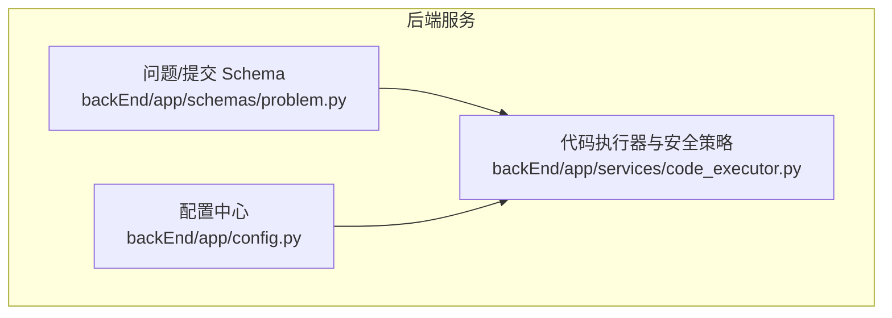
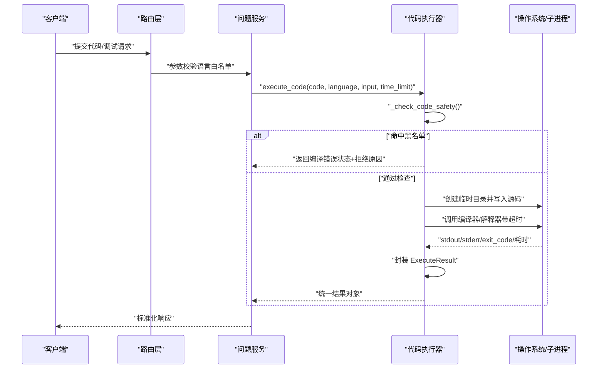
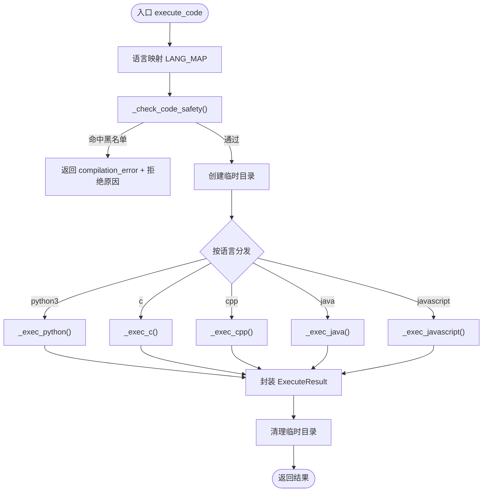
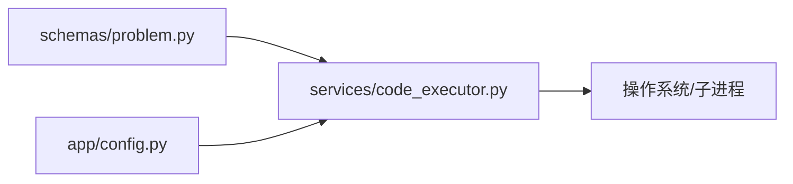

# 多语言支持

<cite>
**本文引用的文件**
- [code_executor.py](file://backEnd/app/services/code_executor.py)
- [config.py](file://backEnd/app/config.py)
- [problem.py](file://backEnd/app/schemas/problem.py)
</cite>

## 目录
1. [简介](#简介)
2. [项目结构](#项目结构)
3. [核心组件](#核心组件)
4. [架构总览](#架构总览)
5. [详细组件分析](#详细组件分析)
6. [依赖关系分析](#依赖关系分析)
7. [性能与优化](#性能与优化)
8. [故障排查指南](#故障排查指南)
9. [结论](#结论)
10. [附录：新增语言扩展指南](#附录新增语言扩展指南)

## 简介
本技术文档面向 HR XF 在线编程平台的多语言支持系统，聚焦于已实现的编程语言、编译器/解释器配置、运行时环境与安全策略、统一输出格式、跨语言比较方案以及新语言扩展流程。当前系统通过子进程方式执行用户代码，内置安全黑名单拦截危险操作，并提供统一的执行结果模型，便于前端展示与评测。

## 项目结构
多语言支持相关代码主要位于后端服务中，关键文件如下：
- 代码执行器与安全策略：backEnd/app/services/code_executor.py
- 运行环境与编译器路径配置：backEnd/app/config.py
- 问题提交与调试请求的输入校验（含支持语言白名单）：backEnd/app/schemas/problem.py

图表来源
- [problem.py:1-130](file://backEnd/app/schemas/problem.py#L1-L130)
- [config.py:1-71](file://backEnd/app/config.py#L1-L71)
- [code_executor.py:1-444](file://backEnd/app/services/code_executor.py#L1-L444)

章节来源
- [problem.py:1-130](file://backEnd/app/schemas/problem.py#L1-L130)
- [config.py:1-71](file://backEnd/app/config.py#L1-L71)
- [code_executor.py:1-444](file://backEnd/app/services/code_executor.py#L1-L444)

## 核心组件
- 支持的语言与版本
  - Python3：通过 python 或 python3 解释器执行
  - C：通过 gcc 编译并执行
  - C++：通过 g++ 编译并执行
  - Java：通过 javac 编译并通过 java 运行
  - JavaScript：通过 node 解释执行
- 编译器/解释器路径解析
  - 优先从 .env 环境变量读取具体路径；若未设置则自动从 PATH 检测
  - 配置项包括：python_bin、gcc_bin、gpp_bin、java_bin、javac_bin、node_bin
- 安全策略
  - 基于正则表达式的安全黑名单，覆盖通用危险命令与各语言特定危险 API
  - 在代码执行前进行静态扫描，命中即拒绝并返回错误信息
- 统一执行结果模型
  - 包含标准输出、标准错误、退出码、执行时间（毫秒）、近似内存占用（KB）、状态等字段
  - 状态枚举：success、compilation_error、runtime_error、time_limit_exceeded

章节来源
- [code_executor.py:1-444](file://backEnd/app/services/code_executor.py#L1-L444)
- [config.py:1-71](file://backEnd/app/config.py#L1-L71)
- [problem.py:1-130](file://backEnd/app/schemas/problem.py#L1-L130)

## 架构总览
下图展示了从请求到执行的端到端流程，涵盖输入校验、安全检查、编译器/解释器调用、超时控制与结果封装。

图表来源
- [problem.py:59-81](file://backEnd/app/schemas/problem.py#L59-L81)
- [code_executor.py:270-321](file://backEnd/app/services/code_executor.py#L270-L321)
- [code_executor.py:220-267](file://backEnd/app/services/code_executor.py#L220-L267)

## 详细组件分析

### 代码执行器与安全策略
- 功能职责
  - 接收代码、语言、输入数据与时间限制
  - 执行前进行安全扫描，拦截危险操作
  - 根据语言选择对应执行函数，统一封装结果
- 安全黑名单
  - 通用规则：Windows 系统命令、注册表、计划任务、网络配置等
  - 语言特定规则：Python 文件系统/进程/动态导入/网络/eval/exec；C/C++ system/popen/exec/WinAPI；Java Runtime/ProcessBuilder/IO/反射/网络；JavaScript require/import child_process/fs/os/net/http 等
- 执行流程
  - 解析语言映射（兼容 python/python3）
  - 创建临时目录，写入源码
  - 调用对应语言的执行函数（编译/运行），捕获 stdout/stderr/退出码/耗时
  - 清理临时目录
- 超时处理
  - 使用线程池异步包装子进程执行，超过时间限制返回“Time Limit Exceeded”

图表来源
- [code_executor.py:270-321](file://backEnd/app/services/code_executor.py#L270-L321)
- [code_executor.py:322-444](file://backEnd/app/services/code_executor.py#L322-L444)

章节来源
- [code_executor.py:1-444](file://backEnd/app/services/code_executor.py#L1-L444)

### 配置与环境变量
- 配置文件位置
  - 默认加载 backEnd/.env 文件，编码 UTF-8
- 编译器路径配置项
  - python_bin、gcc_bin、gpp_bin、java_bin、javac_bin、node_bin
  - 若未设置，则通过 shutil.which 自动从 PATH 检测
- 其他配置
  - 数据库连接、JWT、CORS、MinIO、Deepseek API 等（与本模块无直接耦合）

章节来源
- [config.py:1-71](file://backEnd/app/config.py#L1-L71)
- [code_executor.py:173-197](file://backEnd/app/services/code_executor.py#L173-L197)

### 输入校验与统一输出格式
- 支持语言白名单
  - VALID_LANGUAGES = {"python3", "python", "c", "cpp", "java", "javascript"}
  - 提交与调试请求均对 language 字段进行小写化与白名单校验
- 统一输出格式
  - DebugResponse 与 SubmissionResponse 定义 stdout、stderr、exit_code、execution_time、status 等字段
  - 执行器内部 ExecuteResult 与上述字段保持一致，便于前后端对接

章节来源
- [problem.py:1-130](file://backEnd/app/schemas/problem.py#L1-L130)
- [code_executor.py:210-218](file://backEnd/app/services/code_executor.py#L210-L218)

## 依赖关系分析
- 模块内依赖
  - code_executor.py 依赖 config.py 获取编译器路径
  - problem.py 提供语言白名单与统一响应模型
- 外部依赖
  - 操作系统提供的编译器/解释器（gcc/g++/java/javac/node/python）
  - Python 标准库：subprocess、tempfile、shutil、re、asyncio、concurrent.futures

图表来源
- [problem.py:1-130](file://backEnd/app/schemas/problem.py#L1-L130)
- [config.py:1-71](file://backEnd/app/config.py#L1-L71)
- [code_executor.py:1-444](file://backEnd/app/services/code_executor.py#L1-L444)

章节来源
- [problem.py:1-130](file://backEnd/app/schemas/problem.py#L1-L130)
- [config.py:1-71](file://backEnd/app/config.py#L1-L71)
- [code_executor.py:1-444](file://backEnd/app/services/code_executor.py#L1-L444)

## 性能与优化
- 并发与资源隔离
  - 使用线程池执行子进程，避免阻塞事件循环
  - 每个请求在独立临时目录执行，避免文件冲突
- 超时控制
  - 统一通过 subprocess.run(timeout=...) 实现，防止长时间占用
- 编译优化
  - C/C++ 使用 -O2 优化级别，提升运行效率
- 可扩展性建议
  - 引入沙箱机制（如容器化或 seccomp）增强隔离
  - 增加内存限制（ulimit/cgroups）与 CPU 配额
  - 缓存常用依赖包（如 Node.js 模块、Python 第三方库）减少冷启动开销

[本节为通用指导，不直接分析具体文件]

## 故障排查指南
- 常见问题
  - 编译器/解释器未安装或不在 PATH：检查 .env 中的路径配置或确保系统 PATH 正确
  - 编码问题（Java 注释/字符串乱码）：编译时指定 -encoding UTF-8
  - 权限不足：确认执行用户对临时目录有读写权限
  - 超时：检查算法复杂度与时间限制是否匹配
- 日志定位
  - 安全拦截会记录匹配到的危险片段上下文，便于快速定位问题
  - 编译器未找到时会输出警告日志

章节来源
- [code_executor.py:173-197](file://backEnd/app/services/code_executor.py#L173-L197)
- [code_executor.py:154-167](file://backEnd/app/services/code_executor.py#L154-L167)

## 结论
HR XF 的多语言支持系统以简洁清晰的架构实现了主流语言的执行与安全控制，通过统一的结果模型与输入校验，保证了前后端交互的一致性。当前实现满足基础 OJ 场景需求，后续可通过沙箱、资源限制与依赖缓存进一步提升安全性与性能。

[本节为总结性内容，不直接分析具体文件]

## 附录：新增语言扩展指南
以下流程用于在现有系统中添加新的编程语言支持（例如 Go、Rust）。请遵循以下步骤并确保所有变更可测试、可回滚。

- 步骤一：更新语言白名单
  - 在 schemas/problem.py 的 VALID_LANGUAGES 中添加新语言标识（保持小写）
  - 确保提交与调试请求的 validator 能接受该语言
- 步骤二：配置编译器/解释器路径
  - 在 config.py 的 Settings 类中新增对应环境变量字段（如 go_bin、rustc_bin）
  - 在 code_executor.py 的 _get_bins() 中注册新二进制名称，使其可从配置或 PATH 解析
- 步骤三：实现语言执行函数
  - 在 code_executor.py 中新增 _exec_xxx() 函数，完成源码写入、编译（如需）、运行、超时与错误处理
  - 在 execute_code() 的分发逻辑中增加对新语言的分支调用
- 步骤四：完善安全策略
  - 在 code_executor.py 中为新语言添加对应的危险模式列表，并加入 _DANGEROUS_PATTERNS 映射
  - 验证正则不会误杀正常语法，必要时调整匹配范围
- 步骤五：统一输出与状态
  - 确保新语言执行结果符合 ExecuteResult 字段约定（stdout、stderr、exit_code、execution_time、status）
  - 前端无需改动即可消费统一格式
- 步骤六：测试与回归
  - 编写单元测试覆盖：编译错误、运行时错误、超时、安全拦截、正常输出
  - 在不同环境下验证 PATH 自动检测与 .env 覆盖行为
- 最佳实践
  - 保持临时目录最小化，避免持久化中间产物
  - 严格限制 I/O 与网络访问，遵循安全黑名单原则
  - 为每种语言提供典型样例用例，纳入自动化测试套件

章节来源
- [problem.py:1-130](file://backEnd/app/schemas/problem.py#L1-L130)
- [config.py:1-71](file://backEnd/app/config.py#L1-L71)
- [code_executor.py:173-197](file://backEnd/app/services/code_executor.py#L173-L197)
- [code_executor.py:270-321](file://backEnd/app/services/code_executor.py#L270-L321)
- [code_executor.py:144-167](file://backEnd/app/services/code_executor.py#L144-L167)