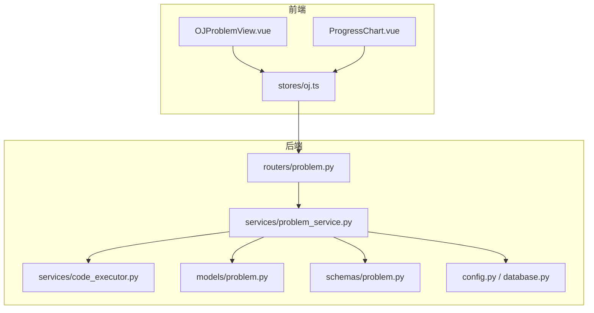
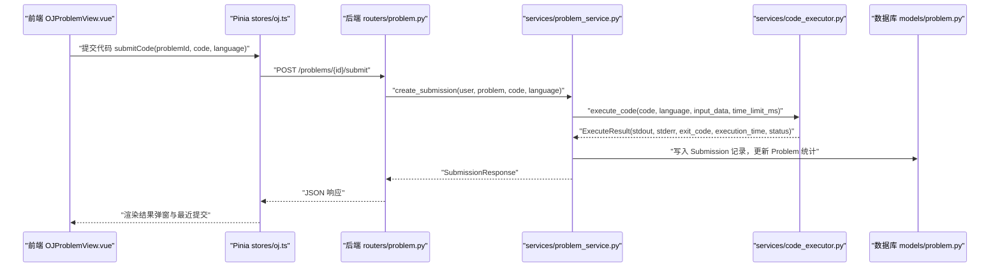
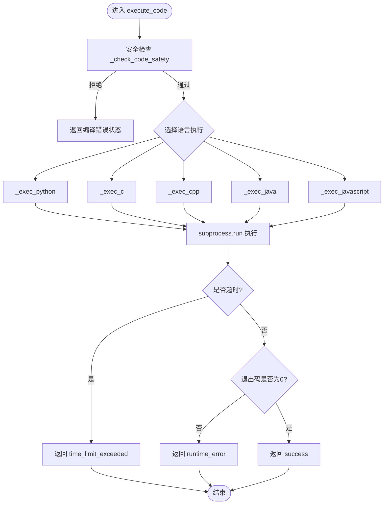
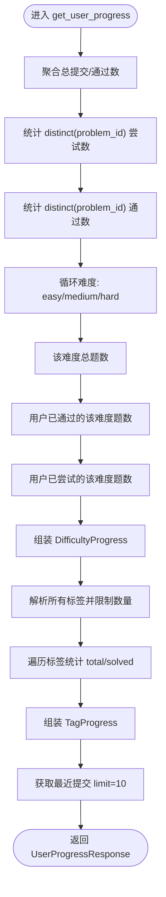
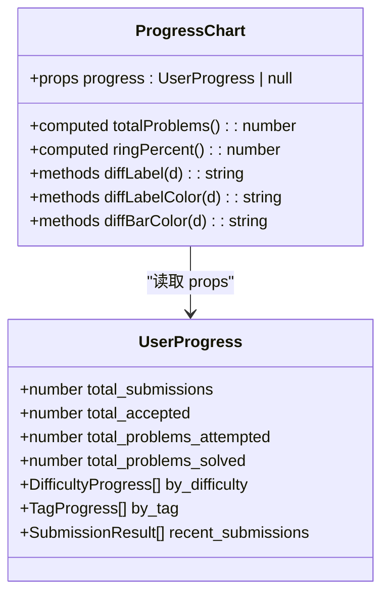
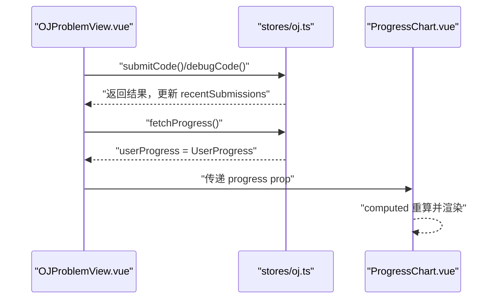
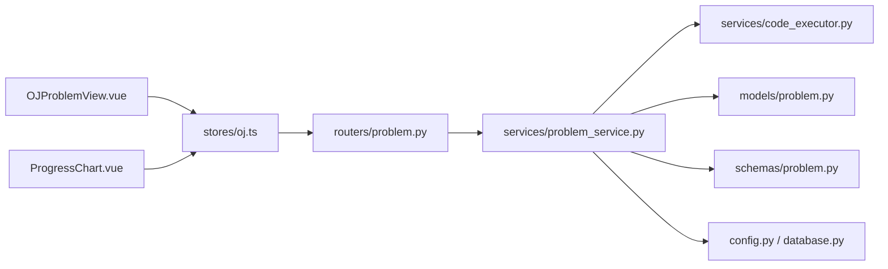

# 性能分析与进度跟踪

<cite>
**本文引用的文件**   
- [ProgressChart.vue](file://frontEnd/src/components/oj/ProgressChart.vue)
- [oj.ts](file://frontEnd/src/stores/oj.ts)
- [OJProblemView.vue](file://frontEnd/src/views/OJProblemView.vue)
- [problem.py（路由）](file://backEnd/app/routers/problem.py)
- [problem_service.py](file://backEnd/app/services/problem_service.py)
- [code_executor.py](file://backEnd/app/services/code_executor.py)
- [problem.py（模型）](file://backEnd/app/models/problem.py)
- [problem.py（Schemas）](file://backEnd/app/schemas/problem.py)
- [config.py](file://backEnd/app/config.py)
- [database.py](file://backEnd/app/database.py)
</cite>

## 目录
1. [简介](#简介)
2. [项目结构](#项目结构)
3. [核心组件](#核心组件)
4. [架构总览](#架构总览)
5. [详细组件分析](#详细组件分析)
6. [依赖关系分析](#依赖关系分析)
7. [性能考量](#性能考量)
8. [故障排查指南](#故障排查指南)
9. [结论](#结论)
10. [附录](#附录)

## 简介
本技术文档围绕 HR XF 在线编程平台的“性能分析与进度跟踪”能力，系统性阐述以下方面：
- 代码执行性能指标收集与分析机制（执行时间、内存使用、CPU占用等）
- 进度跟踪的数据结构设计（用户解题进度、正确率统计、学习曲线分析）
- 前端图表组件 ProgressChart.vue 的实现与可视化展示
- 实时数据更新与状态同步机制
- 性能数据的存储策略与查询优化
- 个性化学习建议与问题推荐算法的实现思路
- 性能监控告警与异常检测的配置方法

## 项目结构
本项目采用前后端分离架构。前端基于 Vue 3 + TypeScript + Pinia，后端基于 FastAPI + SQLAlchemy 异步 ORM。与性能分析和进度跟踪相关的核心模块分布如下：
- 前端
  - 视图层：OJProblemView.vue（题目详情、提交与调试交互）
  - 组件层：ProgressChart.vue（刷题进度可视化）
  - 状态管理：stores/oj.ts（题库、提交、进度、标签等全局状态与 API 调用）
- 后端
  - 路由层：routers/problem.py（题目列表、详情、提交、调试、进度接口）
  - 服务层：services/problem_service.py（业务逻辑、判题流程、进度聚合）
  - 执行器：services/code_executor.py（多语言代码执行、安全拦截、超时控制）
  - 数据模型：models/problem.py（题目、提交记录）
  - 请求/响应模式：schemas/problem.py（Pydantic 校验与序列化）
  - 配置与数据库：config.py、database.py

**图示来源** 
- [OJProblemView.vue:1-500](file://frontEnd/src/views/OJProblemView.vue#L1-L500)
- [ProgressChart.vue:1-154](file://frontEnd/src/components/oj/ProgressChart.vue#L1-L154)
- [oj.ts:1-268](file://frontEnd/src/stores/oj.ts#L1-L268)
- [problem.py（路由）:1-175](file://backEnd/app/routers/problem.py#L1-L175)
- [problem_service.py:1-800](file://backEnd/app/services/problem_service.py#L1-L800)
- [code_executor.py:1-444](file://backEnd/app/services/code_executor.py#L1-L444)
- [problem.py（模型）:1-88](file://backEnd/app/models/problem.py#L1-L88)
- [problem.py（Schemas）:1-130](file://backEnd/app/schemas/problem.py#L1-L130)
- [config.py:1-71](file://backEnd/app/config.py#L1-L71)
- [database.py:1-58](file://backEnd/app/database.py#L1-L58)

**章节来源**
- [OJProblemView.vue:1-500](file://frontEnd/src/views/OJProblemView.vue#L1-L500)
- [ProgressChart.vue:1-154](file://frontEnd/src/components/oj/ProgressChart.vue#L1-L154)
- [oj.ts:1-268](file://frontEnd/src/stores/oj.ts#L1-L268)
- [problem.py（路由）:1-175](file://backEnd/app/routers/problem.py#L1-L175)
- [problem_service.py:1-800](file://backEnd/app/services/problem_service.py#L1-L800)
- [code_executor.py:1-444](file://backEnd/app/services/code_executor.py#L1-L444)
- [problem.py（模型）:1-88](file://backEnd/app/models/problem.py#L1-L88)
- [problem.py（Schemas）:1-130](file://backEnd/app/schemas/problem.py#L1-L130)
- [config.py:1-71](file://backEnd/app/config.py#L1-L71)
- [database.py:1-58](file://backEnd/app/database.py#L1-L58)

## 核心组件
- 代码执行器（code_executor.py）
  - 支持 Python3、C、C++、Java、JavaScript 多语言执行
  - 通过子进程隔离运行，具备关键词黑名单安全检查
  - 统一返回 ExecuteResult，包含 stdout/stderr、退出码、execution_time(ms)、status
  - 超时控制通过 subprocess.run(timeout=...) 实现；内存使用在现有实现中未直接采集
- 判题服务（problem_service.py）
  - create_submission：解析样例输入输出，逐组执行并比较结果，累计最大 execution_time，写入 Submission 表
  - debug_code：单次执行并返回 DebugResponse
  - get_user_progress：聚合用户提交统计、按难度/标签的通过率、最近提交记录
- 路由层（routers/problem.py）
  - GET /api/problems：分页筛选题目列表
  - GET /api/problems/{id}：题目详情
  - POST /api/problems/{id}/submit：提交代码并执行判题
  - POST /api/problems/{id}/debug：调试运行
  - GET /api/problems/progress：获取用户进度统计
- 前端 Store（stores/oj.ts）
  - 封装 apiRequest，统一鉴权头与错误处理
  - 提供 fetchProblems/fetchProblem/submitCode/debugCode/fetchProgress 等方法
- 前端视图（OJProblemView.vue）
  - 题目信息展示、代码编辑、提交与调试交互、弹窗显示判题结果
- 前端图表（ProgressChart.vue）
  - 环形图展示总完成度，柱状图展示难度分布，标签进度列表

**章节来源**
- [code_executor.py:1-444](file://backEnd/app/services/code_executor.py#L1-L444)
- [problem_service.py:1-800](file://backEnd/app/services/problem_service.py#L1-L800)
- [problem.py（路由）:1-175](file://backEnd/app/routers/problem.py#L1-L175)
- [oj.ts:1-268](file://frontEnd/src/stores/oj.ts#L1-L268)
- [OJProblemView.vue:1-500](file://frontEnd/src/views/OJProblemView.vue#L1-L500)
- [ProgressChart.vue:1-154](file://frontEnd/src/components/oj/ProgressChart.vue#L1-L154)

## 架构总览
下图展示了从前端到后端的完整提交流程，包括性能指标采集与进度聚合的关键路径。

**图示来源** 
- [OJProblemView.vue:378-416](file://frontEnd/src/views/OJProblemView.vue#L378-L416)
- [oj.ts:181-198](file://frontEnd/src/stores/oj.ts#L181-L198)
- [problem.py（路由）:121-151](file://backEnd/app/routers/problem.py#L121-L151)
- [problem_service.py:95-179](file://backEnd/app/services/problem_service.py#L95-L179)
- [code_executor.py:270-340](file://backEnd/app/services/code_executor.py#L270-L340)
- [problem.py（模型）:57-88](file://backEnd/app/models/problem.py#L57-L88)

## 详细组件分析

### 代码执行与性能指标采集
- 执行流程
  - 入口：execute_code 根据语言分发至具体执行函数（Python/C/C++/Java/JS）
  - 安全检查：_check_code_safety 使用正则黑名单拦截危险操作
  - 子进程执行：_run_subprocess/_run_subprocess_sync 使用 subprocess.run 并设置 timeout
  - 结果封装：ExecuteResult 包含 execution_time(ms)、status、stdout/stderr、exit_code
- 关键指标
  - 执行时间：由 time.perf_counter() 计算毫秒级耗时，跨语言一致
  - 内存使用：当前实现未直接采集，字段存在但固定为 0；可通过系统工具或语言运行时扩展采集
  - CPU 占用：未直接采集；可在容器/进程层面通过 cgroup/psutil 等方案补充
- 错误与状态
  - compilation_error/runtime_error/time_limit_exceeded/success 四类状态
  - 超时判定：当 rc == -1 且 stderr 包含 "Time Limit Exceeded" 时标记超时

**图示来源** 
- [code_executor.py:270-444](file://backEnd/app/services/code_executor.py#L270-L444)

**章节来源**
- [code_executor.py:154-167](file://backEnd/app/services/code_executor.py#L154-L167)
- [code_executor.py:220-267](file://backEnd/app/services/code_executor.py#L220-L267)
- [code_executor.py:270-340](file://backEnd/app/services/code_executor.py#L270-L340)

### 判题流程与进度聚合
- 判题流程（create_submission）
  - 解析 sample_input/sample_output（JSON 数组）
  - 逐组执行代码，比较标准化后的输出行序列
  - 累计最大 execution_time，记录 submission 状态与错误详情
  - 更新 Problem.total_submissions 与 accepted_submissions
- 进度聚合（get_user_progress）
  - 总提交数与通过数：对 Submission 表聚合
  - 尝试/通过题目数：distinct(problem_id) 计数
  - 按难度统计：遍历 easy/medium/hard，分别统计 total_problems、solved、attempted
  - 按标签统计：解析 Problem.tags 逗号分隔集合，限制最多 15 个标签
  - 最近提交：limit=10 的倒序查询

**图示来源** 
- [problem_service.py:249-367](file://backEnd/app/services/problem_service.py#L249-L367)

**章节来源**
- [problem_service.py:95-179](file://backEnd/app/services/problem_service.py#L95-L179)
- [problem_service.py:249-367](file://backEnd/app/services/problem_service.py#L249-L367)
- [problem.py（模型）:17-54](file://backEnd/app/models/problem.py#L17-L54)
- [problem.py（模型）:57-88](file://backEnd/app/models/problem.py#L57-L88)

### 前端进度图表组件 ProgressChart.vue
- 功能要点
  - 环形图：基于 SVG stroke-dasharray 动态绘制总完成度百分比
  - 难度分布：按 difficulty 维度渲染进度条，颜色区分简单/中等/困难
  - 标签进度：滚动列表展示 top 标签的 solved/total
  - 数据来源：props.progress（UserProgress），由 oj.ts 的 fetchProgress 拉取
- 计算属性
  - totalProblems：by_difficulty 的 total_problems 求和
  - ringPercent：total_problems_solved / totalProblems * 100

**图示来源** 
- [ProgressChart.vue:118-154](file://frontEnd/src/components/oj/ProgressChart.vue#L118-L154)
- [oj.ts:74-82](file://frontEnd/src/stores/oj.ts#L74-L82)

**章节来源**
- [ProgressChart.vue:1-154](file://frontEnd/src/components/oj/ProgressChart.vue#L1-L154)
- [oj.ts:120-134](file://frontEnd/src/stores/oj.ts#L120-L134)

### 实时数据更新与状态同步
- 提交与调试
  - 前端 OJProblemView.vue 调用 store.submitCode/store.debugCode
  - 成功后将结果插入 recentSubmissions 列表，并弹出结果弹窗
- 进度刷新
  - 页面可调用 store.fetchProgress 拉取最新 UserProgress
  - ProgressChart.vue 通过 props 接收最新数据并自动重绘
- 本地持久化
  - 首次通过保存代码与语言到 localStorage，下次进入恢复

**图示来源** 
- [OJProblemView.vue:378-459](file://frontEnd/src/views/OJProblemView.vue#L378-L459)
- [oj.ts:220-226](file://frontEnd/src/stores/oj.ts#L220-L226)
- [ProgressChart.vue:118-154](file://frontEnd/src/components/oj/ProgressChart.vue#L118-L154)

**章节来源**
- [OJProblemView.vue:465-498](file://frontEnd/src/views/OJProblemView.vue#L465-L498)
- [oj.ts:220-235](file://frontEnd/src/stores/oj.ts#L220-L235)

### 性能数据的存储策略与查询优化
- 存储设计
  - Submission 表记录 user_id、problem_id、language、status、execution_time、execution_memory、created_at
  - Problem 表维护 total_submissions、accepted_submissions 用于快速计算通过率
- 查询优化
  - 使用索引：Submission.user_id、Submission.problem_id、Submission.status、Problem.difficulty、Problem.display_id
  - 聚合查询：count、sum(if_)、distinct 组合减少应用层计算
  - 标签统计限制：仅取前 15 个标签，避免全量扫描
- 潜在改进
  - 引入 Redis 缓存热点进度（如用户近 10 次提交、难度分布快照）
  - 增量统计：提交完成后异步更新汇总表，降低主链路压力

**章节来源**
- [problem.py（模型）:17-54](file://backEnd/app/models/problem.py#L17-L54)
- [problem.py（模型）:57-88](file://backEnd/app/models/problem.py#L57-L88)
- [problem_service.py:249-367](file://backEnd/app/services/problem_service.py#L249-L367)

### 个性化学习建议与问题推荐算法（实现思路）
- 现状
  - 平台已具备 AI 推荐能力（职业测评场景），可复用流式 SSE 推送与提示词工程
- 建议方向
  - 基于薄弱知识点推荐：结合 by_tag 与 by_difficulty 的低完成率标签/难度，优先推荐相关题目
  - 自适应难度：根据最近提交的 execution_time 与通过率动态调整难度梯度
  - 间隔重复：对易错题型进行周期性推送，提升记忆巩固
  - 冷启动策略：新用户默认推荐 easy 标签的基础题，逐步过渡 medium/hard
- 实现要点
  - 数据源：UserProgressResponse 中的 by_tag/by_difficulty/recent_submissions
  - 规则引擎：权重评分（完成率、最近失败次数、平均执行时间）
  - 候选集生成：Problem 表按 tags/difficulty 过滤，排序后分页返回
  - 反馈闭环：用户点击/完成行为回写，持续优化推荐权重

[本节为概念性说明，不直接分析具体文件]

### 性能监控告警与异常检测（配置方法）
- 后端日志
  - code_executor.py 使用 logging.warning 记录安全拦截与编译器缺失警告
  - 建议在生产环境接入集中日志系统（ELK/云日志），并配置关键字告警（如 Time Limit Exceeded、compilation_error 激增）
- 指标采集
  - 执行时间：已有 execution_time 字段，可定时聚合 P95/P99 耗时
  - 内存使用：当前未采集，建议通过系统命令或语言运行时扩展（如 Python tracemalloc、Node.js v8.getHeapStatistics）
  - CPU 占用：在容器环境通过 cgroup 或进程监控（psutil）采集
- 告警阈值
  - 超时率 > 5% 触发告警
  - 编译错误率突增（同一时间段内）触发告警
  - 单用户高频失败（如 10 分钟内 5 次 wrong_answer）触发限流或提示
- 配置位置
  - 编译器路径与环境变量：config.py 的 python_bin/gcc_bin/gpp_bin/java_bin/javac_bin/node_bin
  - 数据库连接池：database.py 的 pool_size/max_overflow/pool_pre_ping

**章节来源**
- [code_executor.py:164-184](file://backEnd/app/services/code_executor.py#L164-L184)
- [config.py:39-46](file://backEnd/app/config.py#L39-L46)
- [database.py:31-37](file://backEnd/app/database.py#L31-L37)

## 依赖关系分析
- 前端依赖
  - OJProblemView.vue 依赖 stores/oj.ts 提供的 API 方法与状态
  - ProgressChart.vue 依赖 stores/oj.ts 的 UserProgress 类型与数据
- 后端依赖
  - routers/problem.py 依赖 services/problem_service.py 的业务方法
  - problem_service.py 依赖 services/code_executor.py 的执行能力与 models/problem.py 的数据模型
  - schemas/problem.py 定义前后端交互契约
  - config.py 与 database.py 提供运行时配置与数据库会话

**图示来源** 
- [OJProblemView.vue:1-500](file://frontEnd/src/views/OJProblemView.vue#L1-L500)
- [oj.ts:1-268](file://frontEnd/src/stores/oj.ts#L1-L268)
- [problem.py（路由）:1-175](file://backEnd/app/routers/problem.py#L1-L175)
- [problem_service.py:1-800](file://backEnd/app/services/problem_service.py#L1-L800)
- [code_executor.py:1-444](file://backEnd/app/services/code_executor.py#L1-L444)
- [problem.py（模型）:1-88](file://backEnd/app/models/problem.py#L1-L88)
- [problem.py（Schemas）:1-130](file://backEnd/app/schemas/problem.py#L1-L130)
- [config.py:1-71](file://backEnd/app/config.py#L1-L71)
- [database.py:1-58](file://backEnd/app/database.py#L1-L58)

**章节来源**
- [oj.ts:94-113](file://frontEnd/src/stores/oj.ts#L94-L113)
- [problem.py（路由）:1-175](file://backEnd/app/routers/problem.py#L1-L175)
- [problem_service.py:1-800](file://backEnd/app/services/problem_service.py#L1-L800)

## 性能考量
- 执行器并发
  - ThreadPoolExecutor(max_workers=4) 限制并发子进程数，避免系统过载
  - 建议根据服务器资源调优 max_workers，并结合队列限流
- 数据库连接池
  - pool_size=10、max_overflow=20，适合中等并发；高并发场景需评估连接上限与慢查询
- 查询复杂度
  - 进度聚合涉及多次 count 与 distinct，建议对常用维度建立覆盖索引
  - 标签统计限制 top 15，避免全量扫描
- 前端渲染
  - ProgressChart.vue 使用 computed 与条件渲染，数据量较小时无明显瓶颈
  - 若后续增加历史趋势图，建议使用虚拟滚动或分页加载

[本节提供通用指导，不直接分析具体文件]

## 故障排查指南
- 常见错误
  - 编译错误：检查语言版本与编译器路径（config.py 环境变量）
  - 运行时错误：查看 stderr 与 error_detail，定位空指针/越界等问题
  - 超时：确认 time_limit_ms 与算法复杂度，必要时放宽限制或优化代码
  - 安全拦截：黑名单匹配导致拒绝，修改代码规避危险模式
- 定位步骤
  - 前端：查看 OJProblemView.vue 的弹窗与最近提交记录
  - 后端：检查 logs 中 code_executor.py 的 warning 与 service 层的错误详情
  - 数据库：核对 Submission 与 Problem 表的统计一致性
- 配置检查
  - 编译器路径是否正确（python/gcc/g++/java/javac/node）
  - 数据库连接是否正常（pool_pre_ping、认证信息）

**章节来源**
- [OJProblemView.vue:247-285](file://frontEnd/src/views/OJProblemView.vue#L247-L285)
- [code_executor.py:154-167](file://backEnd/app/services/code_executor.py#L154-L167)
- [config.py:39-46](file://backEnd/app/config.py#L39-L46)
- [database.py:31-37](file://backEnd/app/database.py#L31-L37)

## 结论
HR XF 在线编程平台在性能分析与进度跟踪方面已形成较为完整的闭环：
- 后端通过子进程执行与安全拦截保障稳定性，并采集执行时间与状态
- 服务层聚合用户进度并按难度/标签维度输出结构化数据
- 前端以简洁直观的图表呈现学习进展，并通过 Store 实现状态同步
- 未来可在内存/CPU 指标采集、缓存与告警体系上进一步演进，以提升用户体验与运维效率

[本节为总结性内容，不直接分析具体文件]

## 附录
- API 参考（节选）
  - GET /api/problems：题目列表（支持 difficulty/tag/keyword/page/size）
  - GET /api/problems/{id}：题目详情
  - POST /api/problems/{id}/submit：提交代码
  - POST /api/problems/{id}/debug：调试运行
  - GET /api/problems/progress：用户进度统计
- 数据结构（节选）
  - UserProgressResponse：包含 total_submissions、total_accepted、by_difficulty、by_tag、recent_submissions
  - SubmissionResponse：包含 id、problem_id、language、status、execution_time、execution_memory、error_detail、created_at

**章节来源**
- [problem.py（路由）:47-175](file://backEnd/app/routers/problem.py#L47-L175)
- [problem.py（Schemas）:106-130](file://backEnd/app/schemas/problem.py#L106-L130)