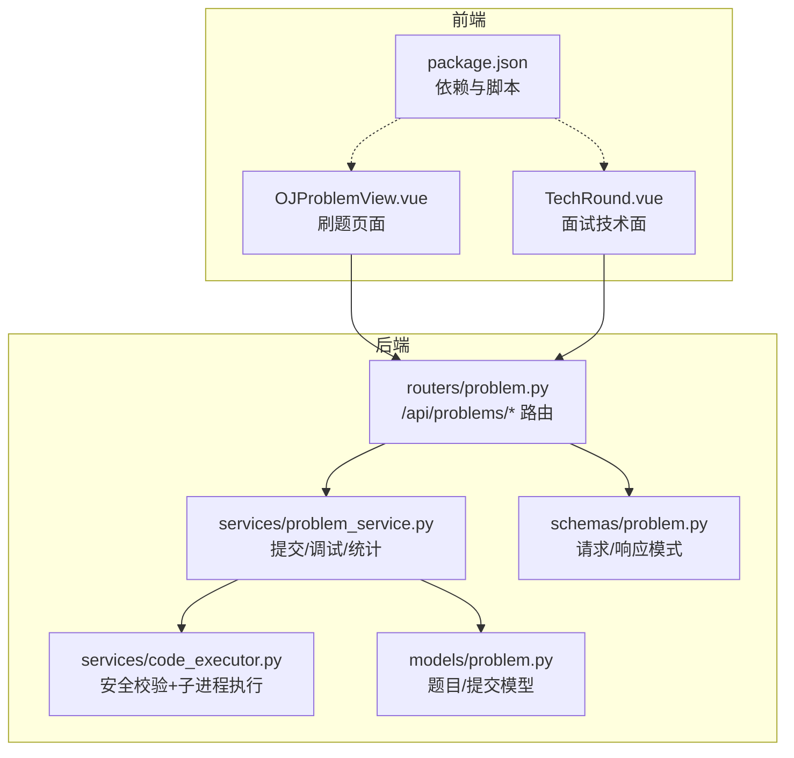
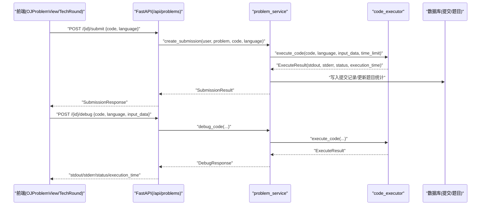
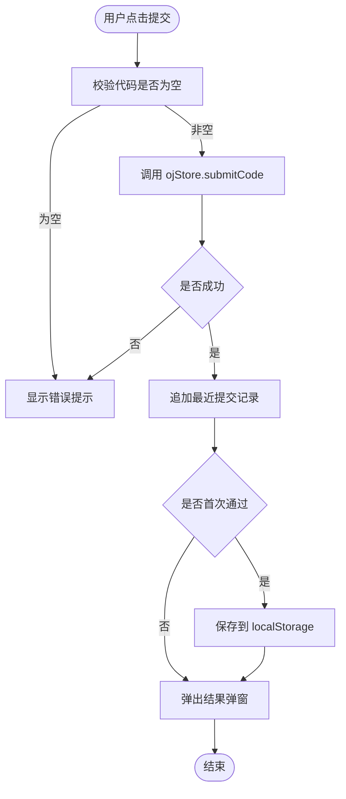
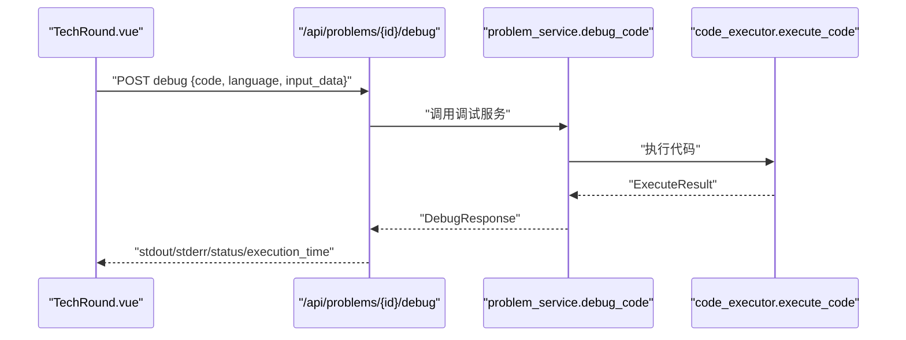
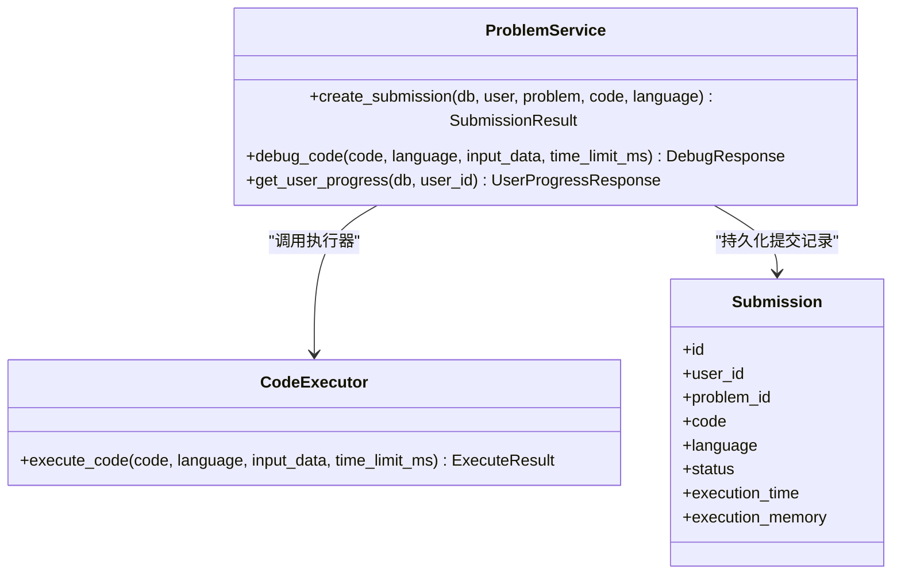
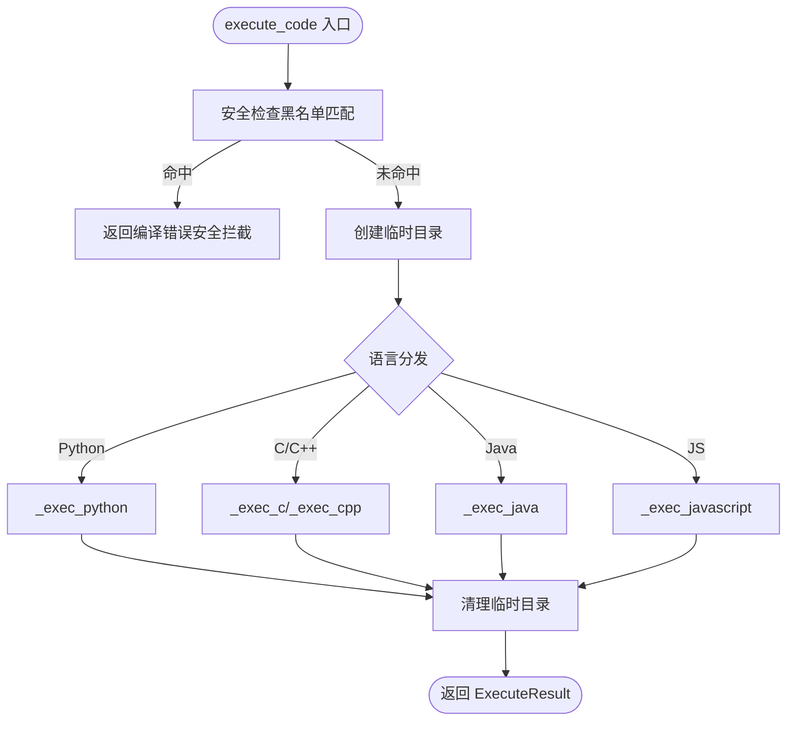
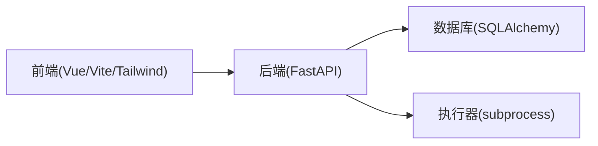

# 编辑器集成

<cite>
**本文引用的文件**   
- [OJProblemView.vue](file://frontEnd/src/views/OJProblemView.vue)
- [TechRound.vue](file://frontEnd/src/components/interview/TechRound.vue)
- [problem.py（路由）](file://backEnd/app/routers/problem.py)
- [problem_service.py](file://backEnd/app/services/problem_service.py)
- [code_executor.py](file://backEnd/app/services/code_executor.py)
- [problem.py（模型）](file://backEnd/app/models/problem.py)
- [problem.py（模式定义）](file://backEnd/app/schemas/problem.py)
- [package.json](file://frontEnd/package.json)
</cite>

## 目录
1. [简介](#简介)
2. [项目结构](#项目结构)
3. [核心组件](#核心组件)
4. [架构总览](#架构总览)
5. [详细组件分析](#详细组件分析)
6. [依赖分析](#依赖分析)
7. [性能考虑](#性能考虑)
8. [故障排查指南](#故障排查指南)
9. [结论](#结论)
10. [附录](#附录)

## 简介
本技术文档围绕 HR XF 在线编程平台的“编辑器集成”展开，聚焦于当前代码编辑器的选型与实现、前后端通信机制、调试与提交流程、主题与样式配置、快捷键与用户体验优化、版本管理与历史记录、插件扩展机制、移动端适配与无障碍访问支持，以及大数据量代码处理与性能优化策略。文档基于仓库现有实现进行梳理，并给出可操作的改进建议与架构图示。

## 项目结构
前端采用 Vue 3 + Vite + TypeScript 构建，使用 Tailwind CSS 进行样式设计；后端采用 FastAPI + SQLAlchemy 异步数据库访问，提供 OJ 题目列表、详情、提交判题与调试接口。编辑器在当前项目中以原生 textarea 为基础，结合语言选择器与模板占位符，配合后端执行器完成运行与判题。

**图示来源**
- [OJProblemView.vue:1-500](file://frontEnd/src/views/OJProblemView.vue#L1-L500)
- [TechRound.vue:1-427](file://frontEnd/src/components/interview/TechRound.vue#L1-L427)
- [problem.py（路由）:1-175](file://backEnd/app/routers/problem.py#L1-L175)
- [problem_service.py:96-206](file://backEnd/app/services/problem_service.py#L96-L206)
- [code_executor.py:1-444](file://backEnd/app/services/code_executor.py#L1-L444)
- [problem.py（模型）:38-78](file://backEnd/app/models/problem.py#L38-L78)
- [problem.py（模式定义）:86-129](file://backEnd/app/schemas/problem.py#L86-L129)
- [package.json:1-35](file://frontEnd/package.json#L1-L35)

**章节来源**
- [OJProblemView.vue:1-500](file://frontEnd/src/views/OJProblemView.vue#L1-L500)
- [TechRound.vue:1-427](file://frontEnd/src/components/interview/TechRound.vue#L1-L427)
- [problem.py（路由）:1-175](file://backEnd/app/routers/problem.py#L1-L175)
- [problem_service.py:96-206](file://backEnd/app/services/problem_service.py#L96-L206)
- [code_executor.py:1-444](file://backEnd/app/services/code_executor.py#L1-L444)
- [problem.py（模型）:38-78](file://backEnd/app/models/problem.py#L38-L78)
- [problem.py（模式定义）:86-129](file://backEnd/app/schemas/problem.py#L86-L129)
- [package.json:1-35](file://frontEnd/package.json#L1-L35)

## 核心组件
- 前端编辑器视图
  - OJProblemView.vue：刷题页面的主视图，包含题目信息展示、代码编辑区（textarea）、语言选择、提交与调试按钮、最近提交记录与结果弹窗。
  - TechRound.vue：面试技术面模块，复用 OJ 风格布局，提供计时器、调试与提交逻辑，调用后端调试接口进行本地样例验证。
- 后端服务
  - routers/problem.py：暴露 /api/problems/{id}（详情）、/submit（提交）、/debug（调试）等接口，负责鉴权、参数校验与服务层调用。
  - services/problem_service.py：封装判题流程，解析样例输入输出，循环执行代码并汇总结果，持久化提交记录，更新题目统计。
  - services/code_executor.py：实现多语言执行器，包含安全黑名单检查、编译器路径解析、子进程执行与超时控制，返回统一执行结果。
- 数据模型与模式
  - models/problem.py：定义 Problem 与 Submission 表结构及关系。
  - schemas/problem.py：定义 DebugRequest/DebugResponse、SubmissionCreate/SubmissionResponse 等请求/响应模式。

**章节来源**
- [OJProblemView.vue:158-207](file://frontEnd/src/views/OJProblemView.vue#L158-L207)
- [TechRound.vue:129-175](file://frontEnd/src/components/interview/TechRound.vue#L129-L175)
- [problem.py（路由）:121-175](file://backEnd/app/routers/problem.py#L121-L175)
- [problem_service.py:96-206](file://backEnd/app/services/problem_service.py#L96-L206)
- [code_executor.py:270-321](file://backEnd/app/services/code_executor.py#L270-L321)
- [problem.py（模型）:38-78](file://backEnd/app/models/problem.py#L38-L78)
- [problem.py（模式定义）:86-129](file://backEnd/app/schemas/problem.py#L86-L129)

## 架构总览
下图展示了从前端编辑器到后端执行器的完整交互链路，包括提交与调试两种主要流程。

**图示来源**
- [problem.py（路由）:121-175](file://backEnd/app/routers/problem.py#L121-L175)
- [problem_service.py:96-206](file://backEnd/app/services/problem_service.py#L96-L206)
- [code_executor.py:270-321](file://backEnd/app/services/code_executor.py#L270-L321)
- [OJProblemView.vue:378-459](file://frontEnd/src/views/OJProblemView.vue#L378-L459)
- [TechRound.vue:333-379](file://frontEnd/src/components/interview/TechRound.vue#L333-L379)

## 详细组件分析

### 前端编辑器视图（OJProblemView.vue）
- 编辑器实现
  - 使用原生 textarea 作为代码输入框，绑定 v-model 双向数据流，禁用拼写检查以提升输入体验。
  - 通过下拉选择切换语言（python3/c/cpp/java/javascript），并根据语言动态生成占位模板，帮助快速上手。
- 交互流程
  - 提交：校验非空与题目加载状态后，调用 ojStore.submitCode，成功后将结果加入最近提交记录，并在首次通过时保存至 localStorage。
  - 调试：使用第一组样例输入调用 ojStore.debugCode，显示 stdout/stderr、执行时间与状态。
- 本地持久化
  - 首次通过的代码与语言保存在 localStorage，键名为 oj_saved_{problemId}，下次进入自动恢复。
- 错误提示
  - 提交失败或网络异常时，在调试区域显示错误消息；弹窗集中展示判题结果与错误详情。

**图示来源**
- [OJProblemView.vue:378-416](file://frontEnd/src/views/OJProblemView.vue#L378-L416)
- [OJProblemView.vue:489-498](file://frontEnd/src/views/OJProblemView.vue#L489-L498)

**章节来源**
- [OJProblemView.vue:158-207](file://frontEnd/src/views/OJProblemView.vue#L158-L207)
- [OJProblemView.vue:378-459](file://frontEnd/src/views/OJProblemView.vue#L378-L459)
- [OJProblemView.vue:465-498](file://frontEnd/src/views/OJProblemView.vue#L465-L498)

### 面试技术面编辑器（TechRound.vue）
- 编辑器实现
  - 与 OJ 页面一致的 textarea + 语言选择 + 占位模板。
- 交互流程
  - 调试：直接调用 /api/problems/{id}/debug，传入第一组样例输入，展示执行结果。
  - 提交：调用 store.submitAnswer 记录面试答案与用时，完成后进入下一轮。
- 计时器
  - 根据题目 time_limit 启动倒计时，结束时自动触发提交。

**图示来源**
- [TechRound.vue:333-379](file://frontEnd/src/components/interview/TechRound.vue#L333-L379)
- [problem.py（路由）:154-175](file://backEnd/app/routers/problem.py#L154-L175)
- [problem_service.py:182-201](file://backEnd/app/services/problem_service.py#L182-L201)
- [code_executor.py:270-321](file://backEnd/app/services/code_executor.py#L270-L321)

**章节来源**
- [TechRound.vue:129-175](file://frontEnd/src/components/interview/TechRound.vue#L129-L175)
- [TechRound.vue:333-379](file://frontEnd/src/components/interview/TechRound.vue#L333-L379)
- [TechRound.vue:381-408](file://frontEnd/src/components/interview/TechRound.vue#L381-L408)

### 后端判题与调试服务（problem_service.py）
- 提交判题
  - 解析题目样例输入/输出，逐组执行代码，累计最大执行时间，判定编译错误、运行时错误、超时与答案不匹配等状态。
  - 创建提交记录，更新题目总提交数与通过数。
- 调试执行
  - 仅执行一次并返回 stdout/stderr/退出码/执行时间/状态，用于前端即时反馈。

**图示来源**
- [problem_service.py:96-206](file://backEnd/app/services/problem_service.py#L96-L206)
- [problem.py（模型）:57-78](file://backEnd/app/models/problem.py#L57-L78)
- [code_executor.py:270-321](file://backEnd/app/services/code_executor.py#L270-L321)

**章节来源**
- [problem_service.py:96-206](file://backEnd/app/services/problem_service.py#L96-L206)

### 代码执行器与安全策略（code_executor.py）
- 安全策略
  - 针对 Python/C/C++/Java/JavaScript 维护危险关键词与模块黑名单，拦截系统命令、文件系统破坏、网络与反射等高风险操作。
- 执行流程
  - 解析编译器路径（优先 .env 配置，否则 PATH 检测）。
  - 为每种语言编写临时源文件，分别执行编译与运行步骤，捕获 stdout/stderr 与退出码。
  - 超时控制：子进程超时返回特定错误信息，上层统一映射为 time_limit_exceeded。
- 资源清理
  - 每次执行结束后删除临时目录，避免残留文件。

**图示来源**
- [code_executor.py:154-167](file://backEnd/app/services/code_executor.py#L154-L167)
- [code_executor.py:270-321](file://backEnd/app/services/code_executor.py#L270-L321)
- [code_executor.py:323-443](file://backEnd/app/services/code_executor.py#L323-L443)

**章节来源**
- [code_executor.py:1-444](file://backEnd/app/services/code_executor.py#L1-L444)

### 路由与模式定义（routers/problem.py, schemas/problem.py）
- 路由
  - GET /api/problems/{id}：获取题目详情，可选认证以标记已解决状态。
  - POST /api/problems/{id}/submit：提交代码，返回提交记录与错误详情。
  - POST /api/problems/{id}/debug：调试代码，返回执行输出与状态。
- 模式
  - DebugRequest/DebugResponse：调试请求与响应结构。
  - SubmissionCreate/SubmissionResponse：提交请求与响应结构，包含执行时间与内存占用。

**章节来源**
- [problem.py（路由）:102-175](file://backEnd/app/routers/problem.py#L102-L175)
- [problem.py（模式定义）:86-129](file://backEnd/app/schemas/problem.py#L86-L129)

## 依赖分析
- 前端依赖
  - Vue 3、Vue Router、Pinia、TailwindCSS、Vite 构建工具链。
  - 当前未引入第三方代码编辑器库（如 Monaco Editor、CodeMirror），编辑器能力由原生 textarea 与业务逻辑组合实现。
- 后端依赖
  - FastAPI、SQLAlchemy 异步驱动、subprocess 执行器、线程池隔离执行。

**图示来源**
- [package.json:1-35](file://frontEnd/package.json#L1-L35)
- [problem.py（路由）:1-20](file://backEnd/app/routers/problem.py#L1-L20)
- [code_executor.py:1-18](file://backEnd/app/services/code_executor.py#L1-L18)

**章节来源**
- [package.json:1-35](file://frontEnd/package.json#L1-L35)
- [problem.py（路由）:1-20](file://backEnd/app/routers/problem.py#L1-L20)
- [code_executor.py:1-18](file://backEnd/app/services/code_executor.py#L1-L18)

## 性能考虑
- 前端
  - 当前使用 textarea，渲染开销低，适合大段文本输入；如需语法高亮与智能补全，可考虑引入轻量级编辑器（如 CodeMirror 6）并进行按需加载与虚拟滚动。
  - 调试与提交请求应做防抖与节流，避免重复提交；对大文件输入可进行分块上传与增量校验。
- 后端
  - 执行器使用线程池并发执行子进程，注意 max_workers 与队列长度，防止资源耗尽。
  - 超时控制已在执行器中实现，建议结合 Redis 缓存热点题目的样例与常见错误，减少重复计算。
  - 日志与审计：对危险代码拦截与执行耗时进行结构化日志记录，便于监控与告警。

[本节为通用指导，无需具体文件引用]

## 故障排查指南
- 常见问题
  - 提交失败：检查前端是否正确携带 token 与问题 ID；查看后端路由与模式定义是否一致。
  - 调试无输出：确认题目存在且样例输入格式正确；检查执行器黑名单是否误拦截。
  - 超时错误：核对题目 time_limit 与执行器超时设置是否匹配；优化算法复杂度。
- 定位方法
  - 前端：打开浏览器控制台查看 fetch 请求与响应；检查 localStorage 中 oj_saved_{id} 的存储内容。
  - 后端：查看 FastAPI 日志与执行器日志，关注安全拦截信息与子进程返回码。

**章节来源**
- [OJProblemView.vue:378-459](file://frontEnd/src/views/OJProblemView.vue#L378-L459)
- [TechRound.vue:333-379](file://frontEnd/src/components/interview/TechRound.vue#L333-L379)
- [problem.py（路由）:121-175](file://backEnd/app/routers/problem.py#L121-L175)
- [code_executor.py:154-167](file://backEnd/app/services/code_executor.py#L154-L167)

## 结论
当前编辑器集成以原生 textarea 为核心，配合后端执行器实现了稳定的提交与调试能力，具备完善的安全策略与错误反馈。若需进一步提升开发体验，可在前端引入专业编辑器组件以实现语法高亮、自动补全与格式化；在后端增加更丰富的诊断信息与历史版本管理，同时强化移动端适配与无障碍访问支持。

[本节为总结性内容，无需具体文件引用]

## 附录

### 编辑器功能现状与扩展建议
- 语法高亮与自动补全
  - 现状：未启用第三方编辑器库，依赖原生 textarea。
  - 建议：引入 CodeMirror 6 或 Monaco Editor，按语言加载对应语言包与补全规则；使用懒加载与 Web Worker 降低首屏压力。
- 代码格式化
  - 现状：未内置格式化能力。
  - 建议：集成 Prettier（JS/TS）、Black（Python）、clang-format（C/C++）、google-java-format（Java）等，通过后端格式化接口或前端 Worker 执行。
- 实时保存
  - 现状：仅在首次通过时保存到 localStorage。
  - 建议：实现增量自动保存（debounce），将草稿同步至后端，支持断点续编与多设备同步。
- 错误提示
  - 现状：提交与调试错误集中在调试区域与弹窗。
  - 建议：引入 LSP（Language Server Protocol）与 ESLint/Pylint 等静态检查，实时标注错误与警告行号。
- 主题定制与样式配置
  - 现状：使用 Tailwind 自定义配色与阴影风格。
  - 建议：抽象主题变量（字体、字号、行高、背景色、边框），支持明暗主题切换与用户偏好持久化。
- 快捷键支持与用户体验优化
  - 现状：未定义专用快捷键。
  - 建议：支持 Ctrl/Cmd+S 保存、Ctrl/Cmd+Enter 提交、Tab 缩进、自动闭合括号与引号；提供键盘导航与屏幕阅读器标签。
- 版本管理与历史记录
  - 现状：最近提交记录在前端内存中保留，首次通过代码本地持久化。
  - 建议：后端持久化所有提交版本，提供 diff 对比、回滚与分享链接。
- 插件开发与扩展机制
  - 现状：无插件体系。
  - 建议：定义插件接口（钩子、事件总线、扩展点），允许社区贡献语言包、格式化器与检查器。
- 移动端适配与无障碍访问
  - 现状：界面为桌面优先布局。
  - 建议：响应式网格与触控优化；添加 aria-label、role 与焦点管理；支持语音输入与读屏。
- 大数据量代码处理
  - 现状：textarea 直接承载全文。
  - 建议：虚拟滚动、分片加载与增量渲染；后端限制单次提交大小并提供分页下载。

[本节为概念性内容，无需具体文件引用]