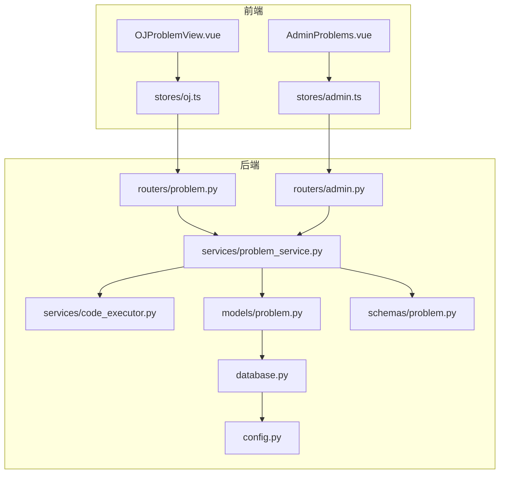
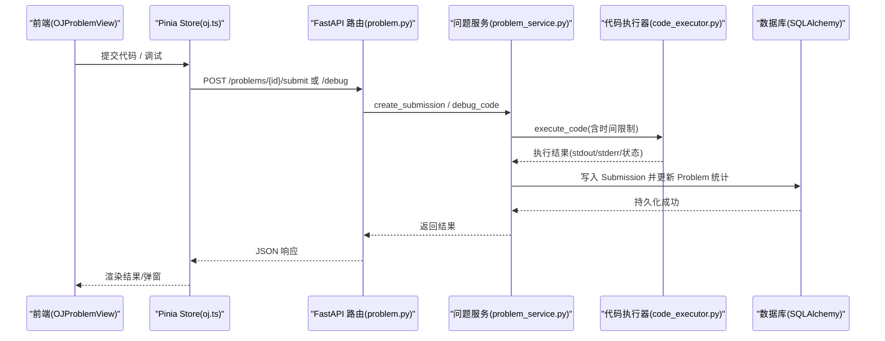
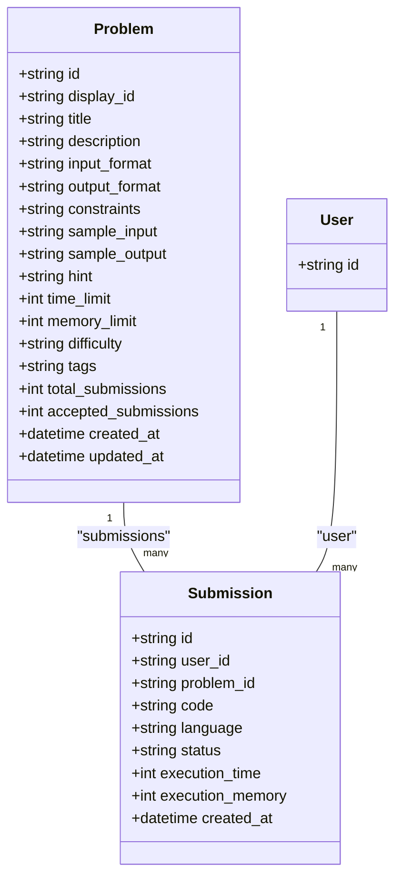
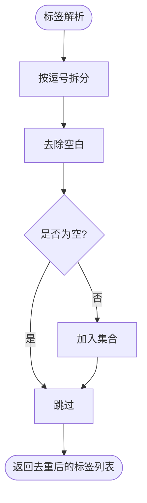
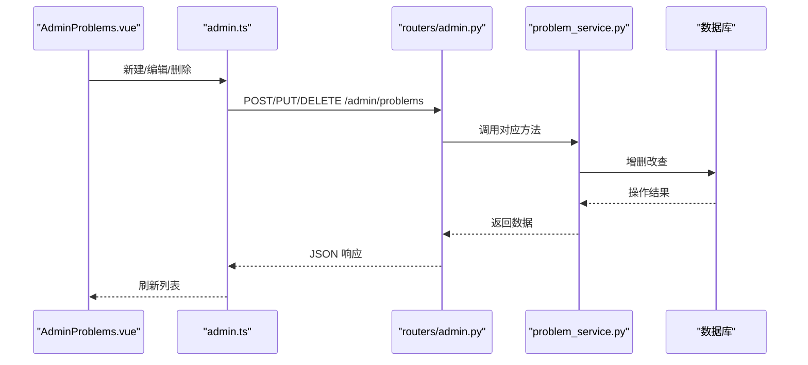
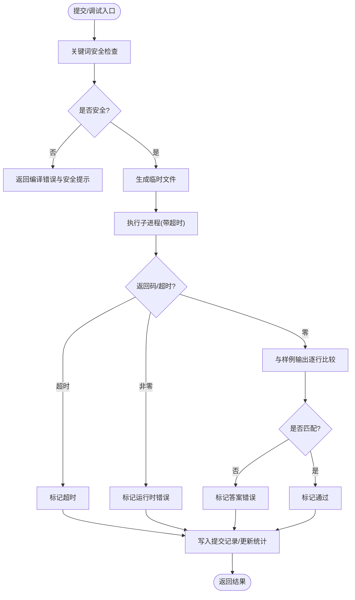
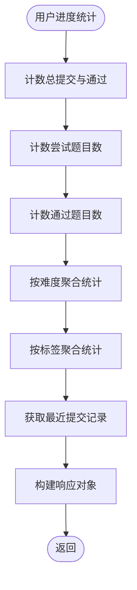
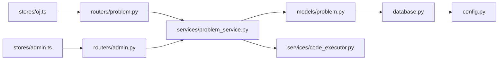

# 题目管理系统

<cite>
**本文引用的文件列表**
- [backEnd/app/models/problem.py](file://backEnd/app/models/problem.py)
- [backEnd/app/routers/problem.py](file://backEnd/app/routers/problem.py)
- [backEnd/app/schemas/problem.py](file://backEnd/app/schemas/problem.py)
- [backEnd/app/services/problem_service.py](file://backEnd/app/services/problem_service.py)
- [backEnd/app/services/code_executor.py](file://backEnd/app/services/code_executor.py)
- [backEnd/app/database.py](file://backEnd/app/database.py)
- [backEnd/app/config.py](file://backEnd/app/config.py)
- [frontEnd/src/views/OJProblemView.vue](file://frontEnd/src/views/OJProblemView.vue)
- [frontEnd/src/stores/oj.ts](file://frontEnd/src/stores/oj.ts)
- [backEnd/app/routers/admin.py](file://backEnd/app/routers/admin.py)
- [frontEnd/src/views/admin/AdminProblems.vue](file://frontEnd/src/views/admin/AdminProblems.vue)
- [frontEnd/src/stores/admin.ts](file://frontEnd/src/stores/admin.ts)
</cite>

## 目录
1. [引言](#引言)
2. [项目结构](#项目结构)
3. [核心组件](#核心组件)
4. [架构总览](#架构总览)
5. [详细组件分析](#详细组件分析)
6. [依赖关系分析](#依赖关系分析)
7. [性能与索引策略](#性能与索引策略)
8. [故障排查指南](#故障排查指南)
9. [结论](#结论)
10. [附录：API 定义与管理流程](#附录api-定义与管理流程)

## 引言
本技术文档围绕 HR XF 在线编程平台的“题目管理系统”展开，聚焦于题目数据模型（Problem、Submission）设计、分类与标签体系、CRUD 接口与业务逻辑、判题与调试机制、统计指标计算与维护、以及前端交互与优化策略。文档旨在帮助开发者快速理解系统实现并指导后续扩展与优化。

## 项目结构
后端采用 FastAPI + SQLAlchemy 异步 ORM，按领域分层组织：models（数据模型）、schemas（请求/响应校验）、routers（路由）、services（业务逻辑）、utils（工具）。前端使用 Vue 3 + Pinia，包含用户刷题页面与管理员题库管理界面。

图表来源
- [backEnd/app/routers/problem.py:1-175](file://backEnd/app/routers/problem.py#L1-L175)
- [backEnd/app/routers/admin.py:136-165](file://backEnd/app/routers/admin.py#L136-L165)
- [backEnd/app/services/problem_service.py:1-442](file://backEnd/app/services/problem_service.py#L1-L442)
- [backEnd/app/services/code_executor.py:1-444](file://backEnd/app/services/code_executor.py#L1-L444)
- [backEnd/app/models/problem.py:17-88](file://backEnd/app/models/problem.py#L17-L88)
- [backEnd/app/schemas/problem.py:1-130](file://backEnd/app/schemas/problem.py#L1-L130)
- [backEnd/app/database.py:1-58](file://backEnd/app/database.py#L1-L58)
- [backEnd/app/config.py:1-71](file://backEnd/app/config.py#L1-L71)
- [frontEnd/src/views/OJProblemView.vue:1-500](file://frontEnd/src/views/OJProblemView.vue#L1-L500)
- [frontEnd/src/stores/oj.ts:1-268](file://frontEnd/src/stores/oj.ts#L1-L268)
- [frontEnd/src/views/admin/AdminProblems.vue:1-340](file://frontEnd/src/views/admin/AdminProblems.vue#L1-L340)
- [frontEnd/src/stores/admin.ts:1-250](file://frontEnd/src/stores/admin.ts#L1-L250)

章节来源
- [backEnd/app/routers/problem.py:1-175](file://backEnd/app/routers/problem.py#L1-L175)
- [backEnd/app/routers/admin.py:136-165](file://backEnd/app/routers/admin.py#L136-L165)
- [backEnd/app/services/problem_service.py:1-442](file://backEnd/app/services/problem_service.py#L1-L442)
- [backEnd/app/services/code_executor.py:1-444](file://backEnd/app/services/code_executor.py#L1-L444)
- [backEnd/app/models/problem.py:17-88](file://backEnd/app/models/problem.py#L17-L88)
- [backEnd/app/schemas/problem.py:1-130](file://backEnd/app/schemas/problem.py#L1-L130)
- [backEnd/app/database.py:1-58](file://backEnd/app/database.py#L1-L58)
- [backEnd/app/config.py:1-71](file://backEnd/app/config.py#L1-L71)
- [frontEnd/src/views/OJProblemView.vue:1-500](file://frontEnd/src/views/OJProblemView.vue#L1-L500)
- [frontEnd/src/stores/oj.ts:1-268](file://frontEnd/src/stores/oj.ts#L1-L268)
- [frontEnd/src/views/admin/AdminProblems.vue:1-340](file://frontEnd/src/views/admin/AdminProblems.vue#L1-L340)
- [frontEnd/src/stores/admin.ts:1-250](file://frontEnd/src/stores/admin.ts#L1-L250)

## 核心组件
- 数据模型层：Problem、Submission 实体定义字段、关系与索引。
- 服务层：题目查询、提交判题、调试执行、用户进度统计、标签聚合等。
- 路由层：面向用户的 OJ 接口与面向管理员的 CRUD 接口。
- 代码执行器：多语言安全沙箱式执行、编译与运行、超时与错误处理。
- 前端：用户刷题页与管理员题库管理页，状态管理与 API 调用封装。

章节来源
- [backEnd/app/models/problem.py:17-88](file://backEnd/app/models/problem.py#L17-L88)
- [backEnd/app/services/problem_service.py:24-442](file://backEnd/app/services/problem_service.py#L24-L442)
- [backEnd/app/routers/problem.py:47-175](file://backEnd/app/routers/problem.py#L47-L175)
- [backEnd/app/routers/admin.py:136-165](file://backEnd/app/routers/admin.py#L136-L165)
- [backEnd/app/services/code_executor.py:270-444](file://backEnd/app/services/code_executor.py#L270-L444)
- [frontEnd/src/views/OJProblemView.vue:1-500](file://frontEnd/src/views/OJProblemView.vue#L1-L500)
- [frontEnd/src/stores/oj.ts:123-268](file://frontEnd/src/stores/oj.ts#L123-L268)
- [frontEnd/src/views/admin/AdminProblems.vue:1-340](file://frontEnd/src/views/admin/AdminProblems.vue#L1-L340)
- [frontEnd/src/stores/admin.ts:144-191](file://frontEnd/src/stores/admin.ts#L144-L191)

## 架构总览
系统采用前后端分离架构。前端通过 RESTful API 与后端交互；后端基于 FastAPI 提供路由，调用服务层完成业务逻辑，并通过 SQLAlchemy 异步会话访问数据库。代码执行器以子进程方式运行用户代码，配合关键词黑名单进行基础安全防护。

图表来源
- [backEnd/app/routers/problem.py:121-175](file://backEnd/app/routers/problem.py#L121-L175)
- [backEnd/app/services/problem_service.py:95-202](file://backEnd/app/services/problem_service.py#L95-L202)
- [backEnd/app/services/code_executor.py:270-444](file://backEnd/app/services/code_executor.py#L270-L444)
- [backEnd/app/models/problem.py:57-88](file://backEnd/app/models/problem.py#L57-L88)
- [frontEnd/src/views/OJProblemView.vue:378-459](file://frontEnd/src/views/OJProblemView.vue#L378-L459)
- [frontEnd/src/stores/oj.ts:181-218](file://frontEnd/src/stores/oj.ts#L181-L218)

## 详细组件分析

### 数据模型与关系映射
- Problem 表字段包括唯一显示 ID、标题、描述、输入输出格式、约束、样例、提示、时限、内存限、难度、标签、提交统计、创建与更新时间等。display_id 与 difficulty 建立索引以提升筛选与排序效率。
- Submission 表记录用户提交代码、语言、状态、执行时间与内存、创建时间，并外键关联 User 与 Problem，便于统计与回溯。
- 关系：Submission.problem 与 Problem.submissions 双向关联，lazy 策略在列表场景避免 N+1 查询。

图表来源
- [backEnd/app/models/problem.py:17-88](file://backEnd/app/models/problem.py#L17-L88)

章节来源
- [backEnd/app/models/problem.py:17-88](file://backEnd/app/models/problem.py#L17-L88)

### 分类体系、难度标签与知识点标记
- 难度：枚举字符串 easy/medium/hard，用于筛选与统计。
- 标签：以逗号分隔的字符串存储，支持模糊匹配与聚合去重，提供“获取所有标签选项”接口。
- 知识点：通过标签语义表达（如“数组,哈希表”），当前未引入独立 Tag 实体与多对多关系，属于轻量方案。

图表来源
- [backEnd/app/services/problem_service.py:370-381](file://backEnd/app/services/problem_service.py#L370-L381)

章节来源
- [backEnd/app/services/problem_service.py:370-381](file://backEnd/app/services/problem_service.py#L370-L381)

### 题目 CRUD 与业务逻辑
- 列表查询：支持难度、标签、关键词筛选与分页，返回总数与条目。
- 详情查询：根据内部 ID 获取完整信息，并在可选认证下附加“是否已通过”。
- 提交判题：解析样例输入输出，逐组执行并比较输出，更新提交记录与题目通过率。
- 调试执行：不持久化提交，仅返回执行输出与状态。
- 管理员接口：创建、更新、删除题目，受管理员权限保护。

图表来源
- [backEnd/app/routers/admin.py:136-165](file://backEnd/app/routers/admin.py#L136-L165)
- [frontEnd/src/views/admin/AdminProblems.vue:293-322](file://frontEnd/src/views/admin/AdminProblems.vue#L293-L322)
- [frontEnd/src/stores/admin.ts:169-191](file://frontEnd/src/stores/admin.ts#L169-L191)

章节来源
- [backEnd/app/routers/problem.py:47-119](file://backEnd/app/routers/problem.py#L47-L119)
- [backEnd/app/services/problem_service.py:24-81](file://backEnd/app/services/problem_service.py#L24-L81)
- [backEnd/app/routers/admin.py:136-165](file://backEnd/app/routers/admin.py#L136-L165)
- [frontEnd/src/views/admin/AdminProblems.vue:293-322](file://frontEnd/src/views/admin/AdminProblems.vue#L293-L322)
- [frontEnd/src/stores/admin.ts:169-191](file://frontEnd/src/stores/admin.ts#L169-L191)

### 判题与调试机制
- 安全检查：基于语言相关正则黑名单拦截危险操作（文件系统、网络、进程控制等）。
- 执行环境：为每种语言生成临时源文件，使用线程池异步执行子进程，设置超时与捕获标准输出/错误。
- 结果判定：编译错误、运行时错误、超时、答案正确性对比（统一换行与空白后逐行比较）。
- 统计更新：每次提交累加总提交数，若通过则累加通过数。

图表来源
- [backEnd/app/services/code_executor.py:154-167](file://backEnd/app/services/code_executor.py#L154-L167)
- [backEnd/app/services/code_executor.py:270-444](file://backEnd/app/services/code_executor.py#L270-L444)
- [backEnd/app/services/problem_service.py:95-179](file://backEnd/app/services/problem_service.py#L95-L179)

章节来源
- [backEnd/app/services/code_executor.py:154-167](file://backEnd/app/services/code_executor.py#L154-L167)
- [backEnd/app/services/code_executor.py:270-444](file://backEnd/app/services/code_executor.py#L270-L444)
- [backEnd/app/services/problem_service.py:95-179](file://backEnd/app/services/problem_service.py#L95-L179)

### 测试用例管理机制
- 样例数据：题目包含 JSON 数组形式的样例输入与输出，服务端解析后逐组执行并比对。
- 边界条件：统一换行符与首尾空白，忽略空行后进行逐行比较，提升鲁棒性。
- 性能测试：通过 time_limit 控制单组样例最大执行时间，累计取最大值作为提交耗时。

章节来源
- [backEnd/app/services/problem_service.py:103-179](file://backEnd/app/services/problem_service.py#L103-L179)

### 题目统计信息的计算与维护
- 提交次数与通过率：每次提交增加 total_submissions，accepted 时增加 accepted_submissions；通过率由两者计算得到。
- 用户进度：统计总提交、总通过、尝试题目数、通过题目数，并按难度与标签维度聚合。
- 最近提交：按时间倒序返回最近若干条记录。

图表来源
- [backEnd/app/services/problem_service.py:249-367](file://backEnd/app/services/problem_service.py#L249-L367)

章节来源
- [backEnd/app/services/problem_service.py:249-367](file://backEnd/app/services/problem_service.py#L249-L367)

### 批量导入导出与模板管理
- 现状：当前仓库未提供专门的批量导入/导出与模板管理接口。
- 建议方案：
  - 导入：新增 /admin/problems/import 接口，接收 JSON/CSV 批量数据，校验必填字段与样例格式，事务内批量插入，失败回滚并返回错误明细。
  - 导出：新增 /admin/problems/export 接口，按筛选条件导出 CSV/JSON，支持分页流式读取以降低内存占用。
  - 模板：提供 /admin/problems/template 接口返回标准模板结构，便于前端或脚本填充。
  - 并发与幂等：导入任务可异步队列化，重复导入通过 display_id 去重。

[本节为概念性建议，不涉及具体源码]

### 搜索、筛选与排序优化策略
- 现有能力：
  - 难度过滤：精确匹配 difficulty 字段。
  - 标签筛选：使用 ilike 模糊匹配 tags 字段。
  - 关键词搜索：对 title 与 description 进行 ilike 模糊匹配。
  - 排序：默认按 display_id 升序。
- 优化建议：
  - 全文检索：对 title/description 启用 MySQL 全文索引或使用搜索引擎（如 Elasticsearch）提升模糊匹配性能。
  - 标签规范化：将逗号分隔标签拆分为独立表与多对多关系，利用索引加速筛选与聚合。
  - 缓存热点：对热门题目列表与标签选项做短期缓存（Redis），降低数据库压力。
  - 分页游标：当数据量增长时，考虑基于 display_id 的游标分页替代 offset/limit。

章节来源
- [backEnd/app/services/problem_service.py:24-64](file://backEnd/app/services/problem_service.py#L24-L64)
- [backEnd/app/routers/problem.py:47-90](file://backEnd/app/routers/problem.py#L47-L90)

## 依赖关系分析
- 路由到服务：problem 路由依赖 problem_service，admin 路由同样复用 problem_service 完成题目管理。
- 服务到模型与执行器：problem_service 依赖 models（Problem、Submission）与 code_executor（execute_code）。
- 数据库配置：database.py 提供异步引擎与会话工厂，config.py 提供数据库 URL 与编译器路径配置。
- 前端到后端：oj.ts 与 admin.ts 分别封装用户侧与管理侧 API 调用。

图表来源
- [backEnd/app/routers/problem.py:1-175](file://backEnd/app/routers/problem.py#L1-L175)
- [backEnd/app/routers/admin.py:136-165](file://backEnd/app/routers/admin.py#L136-L165)
- [backEnd/app/services/problem_service.py:1-442](file://backEnd/app/services/problem_service.py#L1-L442)
- [backEnd/app/models/problem.py:17-88](file://backEnd/app/models/problem.py#L17-L88)
- [backEnd/app/services/code_executor.py:1-444](file://backEnd/app/services/code_executor.py#L1-L444)
- [backEnd/app/database.py:1-58](file://backEnd/app/database.py#L1-L58)
- [backEnd/app/config.py:1-71](file://backEnd/app/config.py#L1-L71)
- [frontEnd/src/stores/oj.ts:1-268](file://frontEnd/src/stores/oj.ts#L1-L268)
- [frontEnd/src/stores/admin.ts:1-250](file://frontEnd/src/stores/admin.ts#L1-L250)

章节来源
- [backEnd/app/routers/problem.py:1-175](file://backEnd/app/routers/problem.py#L1-L175)
- [backEnd/app/routers/admin.py:136-165](file://backEnd/app/routers/admin.py#L136-L165)
- [backEnd/app/services/problem_service.py:1-442](file://backEnd/app/services/problem_service.py#L1-L442)
- [backEnd/app/models/problem.py:17-88](file://backEnd/app/models/problem.py#L17-L88)
- [backEnd/app/services/code_executor.py:1-444](file://backEnd/app/services/code_executor.py#L1-L444)
- [backEnd/app/database.py:1-58](file://backEnd/app/database.py#L1-L58)
- [backEnd/app/config.py:1-71](file://backEnd/app/config.py#L1-L71)
- [frontEnd/src/stores/oj.ts:1-268](file://frontEnd/src/stores/oj.ts#L1-L268)
- [frontEnd/src/stores/admin.ts:1-250](file://frontEnd/src/stores/admin.ts#L1-L250)

## 性能与索引策略
- 索引现状：
  - problems.display_id 唯一索引，利于展示 ID 查询。
  - problems.difficulty 索引，利于难度筛选。
  - submissions.user_id、submissions.problem_id、submissions.status 索引，利于用户提交与状态查询。
- 潜在瓶颈：
  - 标签模糊匹配与关键词搜索使用 ilike，数据量大时可能全表扫描。
  - 用户进度统计涉及多次聚合与子查询，需关注慢查询。
- 优化建议：
  - 对 title/description 添加全文索引或引入搜索引擎。
  - 将标签规范化为独立表与多对多关系，提高筛选与聚合效率。
  - 对高频统计结果进行缓存（如标签选项、热门标签、用户进度摘要）。
  - 使用连接池参数 pool_size/max_overflow 合理配置，避免高并发下连接不足。

章节来源
- [backEnd/app/models/problem.py:25-40](file://backEnd/app/models/problem.py#L25-L40)
- [backEnd/app/models/problem.py:65-80](file://backEnd/app/models/problem.py#L65-L80)
- [backEnd/app/database.py:31-43](file://backEnd/app/database.py#L31-L43)
- [backEnd/app/services/problem_service.py:24-64](file://backEnd/app/services/problem_service.py#L24-L64)
- [backEnd/app/services/problem_service.py:249-367](file://backEnd/app/services/problem_service.py#L249-L367)

## 故障排查指南
- 判题失败常见原因：
  - 编译错误：检查语言环境与编译器路径配置（python/g++/javac/node）。
  - 运行时错误：检查数组越界、空指针、除零等逻辑错误。
  - 超时：算法复杂度过高或死循环，需优化。
  - 答案错误：输出格式不一致（换行/空格），确认比较逻辑。
- 安全拦截：
  - 代码包含禁止操作会被拒绝，查看 stderr 中的安全提示。
- 数据库连接：
  - 连接池 ping 兼容性问题已在 database.py 中打补丁，确保 aiomysql 版本与驱动一致。
- 前端错误：
  - 网络请求失败会抛出 detail 消息，检查后端日志与 CORS 配置。

章节来源
- [backEnd/app/services/code_executor.py:154-167](file://backEnd/app/services/code_executor.py#L154-L167)
- [backEnd/app/services/code_executor.py:270-444](file://backEnd/app/services/code_executor.py#L270-L444)
- [backEnd/app/database.py:10-24](file://backEnd/app/database.py#L10-L24)
- [backEnd/app/config.py:39-45](file://backEnd/app/config.py#L39-L45)
- [frontEnd/src/stores/oj.ts:94-113](file://frontEnd/src/stores/oj.ts#L94-L113)

## 结论
题目管理系统已具备完整的题目建模、判题执行、统计分析与前后端交互能力。当前采用轻量标签方案与 SQL 模糊匹配，适合中小规模题库。未来可通过标签规范化、全文检索与缓存策略进一步提升性能与可扩展性，同时补充批量导入导出与模板管理能力，完善平台生态。

## 附录：API 定义与管理流程

### 面向用户的 OJ 接口
- GET /api/problems
  - 功能：获取题目列表（支持难度、标签、关键词筛选与分页）
  - 参数：difficulty、tag、keyword、page、size
  - 响应：{ problems[], total, page, size }
- GET /api/problems/tags/options
  - 功能：获取所有可选标签
  - 响应：{ tags[] }
- GET /api/problems/progress
  - 功能：获取用户进度统计
  - 响应：UserProgressResponse
- GET /api/problems/{problem_id}
  - 功能：获取题目详情
  - 响应：ProblemDetail
- POST /api/problems/{problem_id}/submit
  - 功能：提交代码（实际执行判题）
  - 请求体：{ code, language }
  - 响应：SubmissionResponse
- POST /api/problems/{problem_id}/debug
  - 功能：调试代码（执行并返回输出）
  - 请求体：{ code, language, input_data }
  - 响应：DebugResponse

章节来源
- [backEnd/app/routers/problem.py:47-175](file://backEnd/app/routers/problem.py#L47-L175)
- [backEnd/app/schemas/problem.py:10-130](file://backEnd/app/schemas/problem.py#L10-L130)

### 面向管理员的题目管理接口
- POST /api/admin/problems
  - 功能：创建题目
  - 权限：管理员
- PUT /api/admin/problems/{problem_id}
  - 功能：更新题目
  - 权限：管理员
- DELETE /api/admin/problems/{problem_id}
  - 功能：删除题目
  - 权限：管理员

章节来源
- [backEnd/app/routers/admin.py:136-165](file://backEnd/app/routers/admin.py#L136-L165)
- [frontEnd/src/views/admin/AdminProblems.vue:293-322](file://frontEnd/src/views/admin/AdminProblems.vue#L293-L322)
- [frontEnd/src/stores/admin.ts:169-191](file://frontEnd/src/stores/admin.ts#L169-L191)