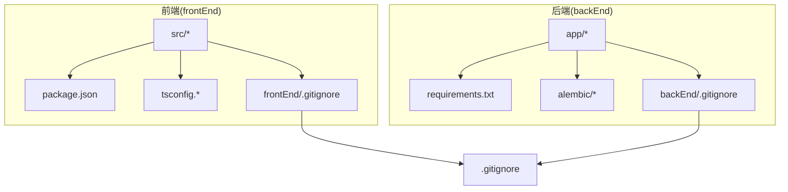
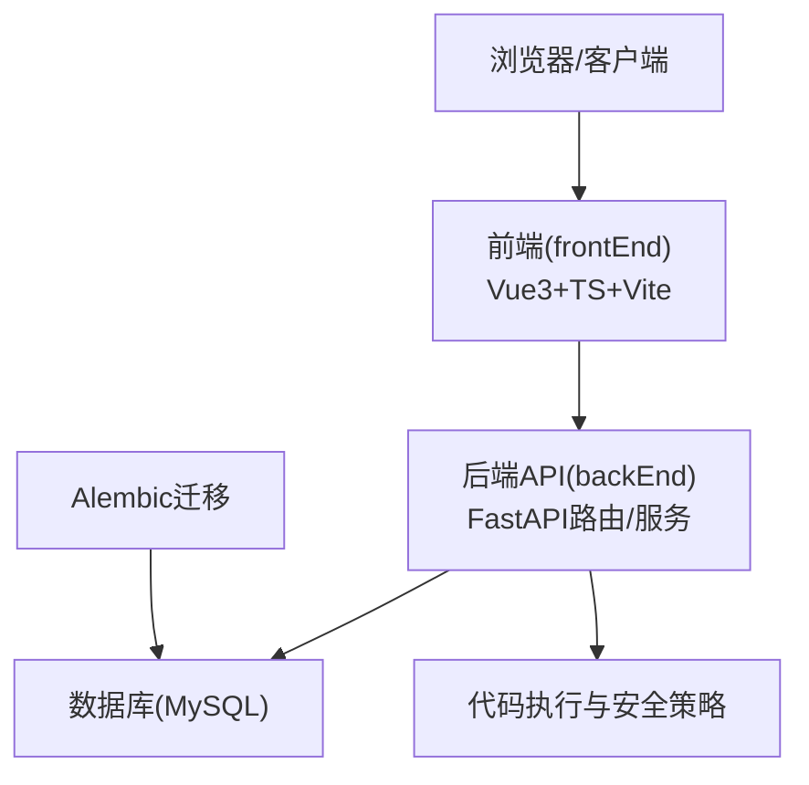
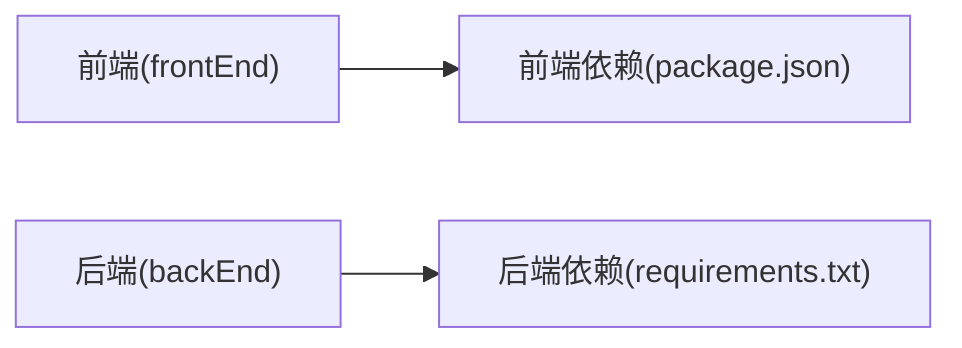

# 代码贡献规范

<cite>
**本文引用的文件**   
- [backEnd/requirements.txt](file://backEnd/requirements.txt)
- [frontEnd/package.json](file://frontEnd/package.json)
- [frontEnd/tsconfig.app.json](file://frontEnd/tsconfig.app.json)
- [frontEnd/tsconfig.node.json](file://frontEnd/tsconfig.node.json)
- [frontEnd/.gitignore](file://frontEnd/.gitignore)
- [backEnd/.gitignore](file://backEnd/.gitignore)
- [.gitignore](file://.gitignore)
- [backEnd/app/routers/admin.py](file://backEnd/app/routers/admin.py)
- [backEnd/app/services/code_executor.py](file://backEnd/app/services/code_executor.py)
- [backEnd/alembic/script.py.mako](file://backEnd/alembic/script.py.mako)
</cite>

## 目录
1. [简介](#简介)
2. [项目结构](#项目结构)
3. [核心组件](#核心组件)
4. [架构总览](#架构总览)
5. [详细组件分析](#详细组件分析)
6. [依赖分析](#依赖分析)
7. [性能考虑](#性能考虑)
8. [故障排查指南](#故障排查指南)
9. [结论](#结论)
10. [附录](#附录)

## 简介
本规范面向 HR XF 项目的全体贡献者，统一 Git 分支管理、提交信息、代码审查与前后端编码风格，明确新功能开发与现有功能维护流程，确保团队协作高效、稳定、可追溯。

## 项目结构
HR XF 为前后端分离项目：
- 后端：Python + FastAPI，使用 SQLAlchemy 异步 ORM、Alembic 迁移、Pydantic 校验等。
- 前端：Vue 3 + TypeScript + Vite，使用 Pinia、Tailwind CSS 等。

图表来源
- [frontEnd/package.json:1-35](file://frontEnd/package.json#L1-L35)
- [frontEnd/tsconfig.app.json:1-17](file://frontEnd/tsconfig.app.json#L1-L17)
- [frontEnd/tsconfig.node.json:1-23](file://frontEnd/tsconfig.node.json#L1-L23)
- [frontEnd/.gitignore:1-25](file://frontEnd/.gitignore#L1-L25)
- [backEnd/requirements.txt:1-27](file://backEnd/requirements.txt#L1-L27)
- [backEnd/alembic/script.py.mako:1-25](file://backEnd/alembic/script.py.mako#L1-L25)
- [backEnd/.gitignore:1-20](file://backEnd/.gitignore#L1-L20)
- [.gitignore:1-25](file://.gitignore#L1-L25)

章节来源
- [frontEnd/package.json:1-35](file://frontEnd/package.json#L1-L35)
- [frontEnd/tsconfig.app.json:1-17](file://frontEnd/tsconfig.app.json#L1-L17)
- [frontEnd/tsconfig.node.json:1-23](file://frontEnd/tsconfig.node.json#L1-L23)
- [frontEnd/.gitignore:1-25](file://frontEnd/.gitignore#L1-L25)
- [backEnd/requirements.txt:1-27](file://backEnd/requirements.txt#L1-L27)
- [backEnd/alembic/script.py.mako:1-25](file://backEnd/alembic/script.py.mako#L1-L25)
- [backEnd/.gitignore:1-20](file://backEnd/.gitignore#L1-L20)
- [.gitignore:1-25](file://.gitignore#L1-L25)

## 核心组件
- 后端服务层（FastAPI）：路由、服务、模型、数据库连接、配置与依赖注入。
- 前端应用（Vue 3 + TS）：视图、组件、状态管理、路由与构建配置。
- 数据迁移（Alembic）：版本化数据库变更。
- 安全与执行器：代码执行安全检查与环境路径解析。

章节来源
- [backEnd/app/routers/admin.py:70-102](file://backEnd/app/routers/admin.py#L70-L102)
- [backEnd/app/services/code_executor.py:149-181](file://backEnd/app/services/code_executor.py#L149-L181)
- [backEnd/alembic/script.py.mako:1-25](file://backEnd/alembic/script.py.mako#L1-L25)

## 架构总览
下图展示前后端交互与关键模块关系，便于理解贡献点与影响范围。

图表来源
- [frontEnd/package.json:1-35](file://frontEnd/package.json#L1-L35)
- [backEnd/app/routers/admin.py:70-102](file://backEnd/app/routers/admin.py#L70-L102)
- [backEnd/app/services/code_executor.py:149-181](file://backEnd/app/services/code_executor.py#L149-L181)
- [backEnd/alembic/script.py.mako:1-25](file://backEnd/alembic/script.py.mako#L1-L25)

## 详细组件分析

### Git 分支管理与合并流程
- 主分支
  - main：受保护，仅允许通过合并请求进入，需通过 CI 检查与至少一名审查者批准。
- 开发分支
  - develop：集成日常开发成果，作为功能分支的合并目标。
- 功能分支
  - 命名：feature/<短描述>（如 feature/user-avatar）
  - 从 develop 切出，完成后发起 PR 至 develop。
- 修复分支
  - 命名：fix/<短描述>（如 fix/login-timeout）
  - 若为紧急修复，可从 main 切出 hotfix/<短描述>，合并回 main 与 develop。
- 发布分支
  - 命名：release/vX.Y.Z，用于冻结与回归测试，合并回 main 并打 tag。
- 合并流程
  - 先同步最新 develop/main，解决冲突后提交；PR 必须包含变更说明与自测结果；通过后由维护者合并。

章节来源
- [frontEnd/.gitignore:1-25](file://frontEnd/.gitignore#L1-L25)
- [backEnd/.gitignore:1-20](file://backEnd/.gitignore#L1-L20)
- [.gitignore:1-25](file://.gitignore#L1-L25)

### 提交信息规范（Commit Message）
- 格式：type(scope): subject
- type 建议
  - feat: 新功能
  - fix: 缺陷修复
  - docs: 文档更新
  - style: 代码格式（不影响逻辑）
  - refactor: 重构
  - perf: 性能优化
  - test: 测试相关
  - chore: 构建/工具链变更
- scope 可选：模块或子域（如 admin、interview、resume、forum）
- subject 简明扼要，动词开头，中文或英文均可，全仓库保持一致
- 示例（仅示意）
  - feat(admin): 新增用户启用/禁用接口
  - fix(interview): 修复面试记录分页异常
  - docs: 补充贡献规范
  - chore(deps): 升级 fastapi 到 0.115.12

章节来源
- [backEnd/requirements.txt:1-27](file://backEnd/requirements.txt#L1-L27)

### 代码审查流程与标准
- 提交流程
  - 本地完成 lint/build/test 后推送，创建 Pull Request。
- 审查清单
  - 需求对齐：是否覆盖需求与边界条件
  - 正确性：逻辑正确、错误处理完备
  - 安全性：敏感信息、权限校验、输入校验
  - 可维护性：可读性、模块化、注释充分
  - 兼容性：向后兼容、迁移脚本正确
  - 性能：无显著退化，避免 N+1 查询与阻塞 I/O
- 质量要求
  - 前端：TypeScript 严格模式开启，无未使用变量/参数
  - 后端：Pydantic 校验、异常返回码清晰、日志合理
  - 数据库：Alembic 迁移幂等且可回滚
- 模板与检查
  - PR 模板应包含：变更概述、影响范围、自测步骤、截图/日志（如有）
  - 建议在 CI 中集成类型检查与基础规则检查

章节来源
- [frontEnd/tsconfig.app.json:1-17](file://frontEnd/tsconfig.app.json#L1-L17)
- [frontEnd/tsconfig.node.json:1-23](file://frontEnd/tsconfig.node.json#L1-L23)
- [backEnd/app/routers/admin.py:70-102](file://backEnd/app/routers/admin.py#L70-L102)
- [backEnd/alembic/script.py.mako:1-25](file://backEnd/alembic/script.py.mako#L1-L25)

### Python 代码风格指南（后端）
- 命名约定
  - 模块/包：小写加下划线
  - 类名：大驼峰
  - 函数/方法/变量：小写加下划线
  - 常量：大写加下划线
- 文件组织
  - app/routers：HTTP 路由
  - app/services：业务逻辑
  - app/models：ORM 模型
  - app/schemas：请求/响应模型
  - app/utils：通用工具
- 注释规范
  - 公共接口与方法提供 docstring
  - 复杂逻辑添加行内注释解释“为什么”
- 错误处理
  - 使用明确的 HTTP 状态码与 detail 消息
  - 对非法操作进行前置校验并返回友好提示
- 参考实现位置
  - 管理员用户更新/删除接口示例：[admin.py:70-102](file://backEnd/app/routers/admin.py#L70-L102)

章节来源
- [backEnd/app/routers/admin.py:70-102](file://backEnd/app/routers/admin.py#L70-L102)

### TypeScript/Vue 代码风格指南（前端）
- 命名约定
  - 组件：大驼峰文件名与大驼峰组件名
  - 变量/函数：小驼峰
  - 类型/接口：大驼峰
- 文件组织
  - src/components：可复用组件
  - src/views：页面级组件
  - src/stores：Pinia 状态
  - src/router：路由定义
  - src/utils：工具函数
- 注释规范
  - 对外暴露的函数/接口提供 JSDoc
  - 复杂业务逻辑增加必要注释
- 类型与构建
  - 启用 noUnusedLocals/noUnusedParameters 等严格选项
  - 使用 @/* 路径别名提升可读性
- 参考配置位置
  - 应用 tsconfig：[tsconfig.app.json:1-17](file://frontEnd/tsconfig.app.json#L1-L17)
  - Node 侧 tsconfig：[tsconfig.node.json:1-23](file://frontEnd/tsconfig.node.json#L1-L23)
  - 脚本与依赖：[package.json:1-35](file://frontEnd/package.json#L1-L35)

章节来源
- [frontEnd/tsconfig.app.json:1-17](file://frontEnd/tsconfig.app.json#L1-L17)
- [frontEnd/tsconfig.node.json:1-23](file://frontEnd/tsconfig.node.json#L1-L23)
- [frontEnd/package.json:1-35](file://frontEnd/package.json#L1-L35)

### IDE 配置与开发环境统一
- 根级 .gitignore 排除项
  - 忽略 dist、node_modules、日志、IDE 配置等
- 前端 .gitignore
  - 忽略 node_modules、dist、*.local、编辑器临时文件等
- 后端 .gitignore
  - 忽略 __pycache__、venv、.env、IDE 配置等
- 建议
  - 团队统一 VS Code 插件与设置（可通过 .vscode/settings.json 共享）
  - 禁止将 .env 与 venv/node_modules 提交至仓库

章节来源
- [.gitignore:1-25](file://.gitignore#L1-L25)
- [frontEnd/.gitignore:1-25](file://frontEnd/.gitignore#L1-L25)
- [backEnd/.gitignore:1-20](file://backEnd/.gitignore#L1-L20)

### 新功能开发工作流程
- 从 develop 拉取最新代码
- 新建 feature/<短描述> 分支
- 实现功能并遵循对应语言风格与审查清单
- 本地运行构建与基础检查（前端 build、后端启动）
- 提交 commit，按规范编写 message
- 推送并创建 PR 至 develop，填写变更说明与自测步骤
- 根据审查意见修改，直至合并

### 现有功能维护流程
- 定位问题：查看路由与服务层调用链与错误返回
- 最小改动原则：优先修复而非重写
- 如涉及数据库变更：生成 Alembic 迁移并验证 upgrade/downgrade
- 提交 fix/<短描述> 分支，走相同审查流程

章节来源
- [backEnd/app/routers/admin.py:70-102](file://backEnd/app/routers/admin.py#L70-L102)
- [backEnd/alembic/script.py.mako:1-25](file://backEnd/alembic/script.py.mako#L1-L25)

## 依赖分析
- 后端依赖
  - FastAPI、Uvicorn、Pydantic Settings、SQLAlchemy 异步、Alembic、密码学库、JWT、HTTP 客户端、PDF 提取、TTS 等
- 前端依赖
  - Vue 3、TypeScript、Vite、Pinia、Tailwind、ECharts、Three.js 生态等

图表来源
- [frontEnd/package.json:1-35](file://frontEnd/package.json#L1-L35)
- [backEnd/requirements.txt:1-27](file://backEnd/requirements.txt#L1-L27)

章节来源
- [frontEnd/package.json:1-35](file://frontEnd/package.json#L1-L35)
- [backEnd/requirements.txt:1-27](file://backEnd/requirements.txt#L1-L27)

## 性能考虑
- 后端
  - 避免在热路径执行阻塞 I/O；外部调用（如 TTS、LLM）采用异步与超时控制
  - 合理使用索引与查询优化，避免 N+1 查询
  - 对代码执行器等高风险能力做资源限制与白名单校验
- 前端
  - 按需加载与懒路由，减少首屏体积
  - 列表渲染使用虚拟滚动或分页
  - 图片与静态资源压缩与缓存

## 故障排查指南
- 管理员用户更新/删除接口
  - 关注权限校验、用户存在性与重复操作防护
  - 参考实现位置：[admin.py:70-102](file://backEnd/app/routers/admin.py#L70-L102)
- 代码执行安全策略
  - 危险模式匹配失败会拒绝执行并返回原因
  - 编译器路径解析优先读取环境变量，其次 PATH 检测
  - 参考实现位置：[code_executor.py:149-181](file://backEnd/app/services/code_executor.py#L149-L181)
- 数据库迁移
  - 确认 alembic 模板与版本号、依赖关系正确
  - 参考模板位置：[script.py.mako:1-25](file://backEnd/alembic/script.py.mako#L1-L25)

章节来源
- [backEnd/app/routers/admin.py:70-102](file://backEnd/app/routers/admin.py#L70-L102)
- [backEnd/app/services/code_executor.py:149-181](file://backEnd/app/services/code_executor.py#L149-L181)
- [backEnd/alembic/script.py.mako:1-25](file://backEnd/alembic/script.py.mako#L1-L25)

## 结论
通过统一的分支策略、提交规范、审查流程与前后端编码风格，HR XF 项目可在保证质量的前提下持续提升交付效率。建议将本规范纳入仓库 Wiki 并在 CI 中固化关键检查，持续迭代完善。

## 附录
- 术语
  - PR：Pull Request，合并请求
  - CI：持续集成
  - ORM：对象关系映射
- 快速链接
  - 前端脚本与依赖：[package.json:1-35](file://frontEnd/package.json#L1-L35)
  - 后端依赖清单：[requirements.txt:1-27](file://backEnd/requirements.txt#L1-L27)
  - 前端类型配置：[tsconfig.app.json:1-17](file://frontEnd/tsconfig.app.json#L1-L17)、[tsconfig.node.json:1-23](file://frontEnd/tsconfig.node.json#L1-L23)
  - 忽略规则：根级 [.gitignore:1-25](file://.gitignore#L1-L25)、前端 [frontEnd/.gitignore:1-25](file://frontEnd/.gitignore#L1-L25)、后端 [backEnd/.gitignore:1-20](file://backEnd/.gitignore#L1-L20)