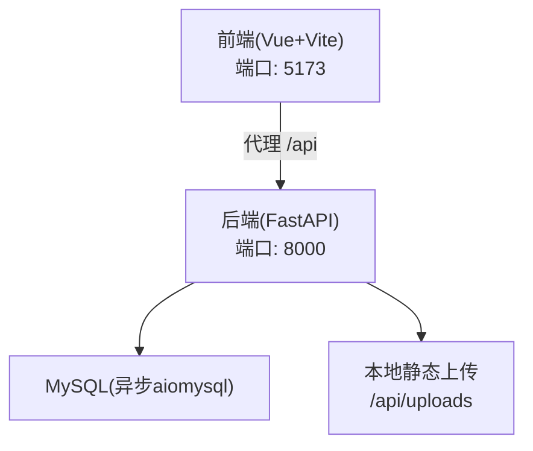
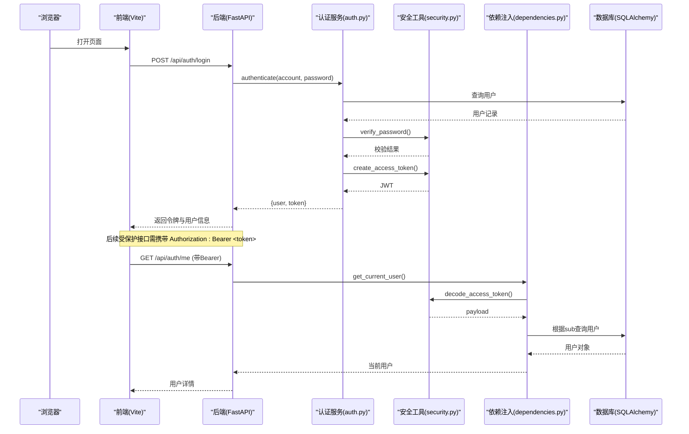
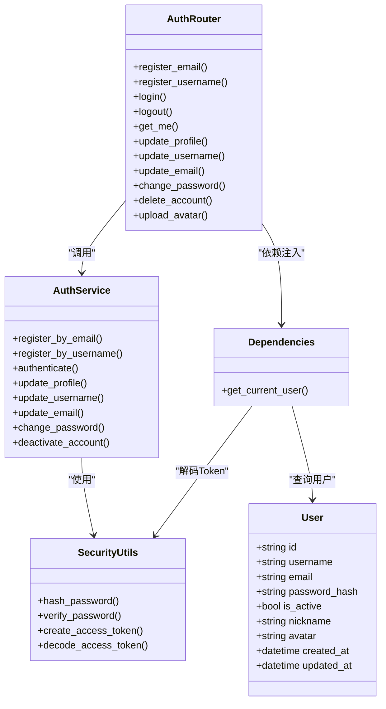
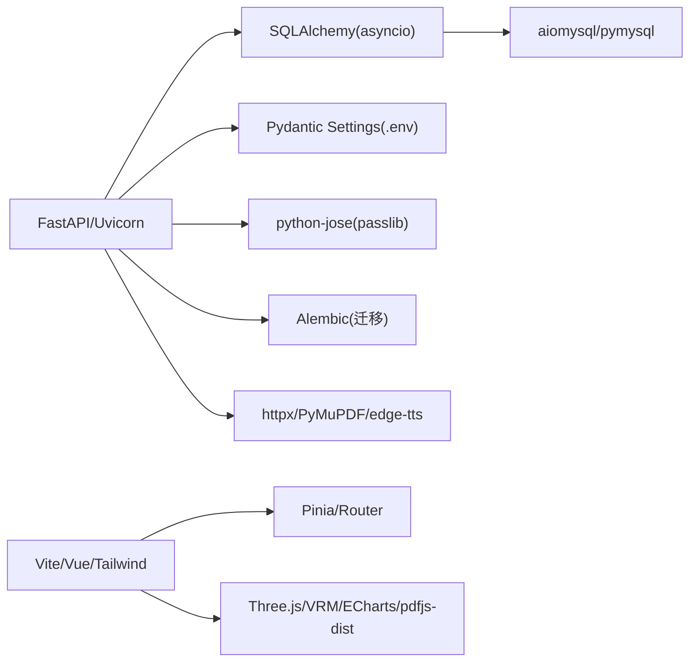

# 常见问题解答

<cite>
**本文引用的文件**   
- [backEnd/requirements.txt](file://backEnd/requirements.txt)
- [frontEnd/package.json](file://frontEnd/package.json)
- [backEnd/app/config.py](file://backEnd/app/config.py)
- [backEnd/app/database.py](file://backEnd/app/database.py)
- [backEnd/app/main.py](file://backEnd/app/main.py)
- [backEnd/app/routers/auth.py](file://backEnd/app/routers/auth.py)
- [backEnd/app/services/auth.py](file://backEnd/app/services/auth.py)
- [backEnd/app/utils/security.py](file://backEnd/app/utils/security.py)
- [backEnd/app/dependencies.py](file://backEnd/app/dependencies.py)
- [backEnd/app/models/user.py](file://backEnd/app/models/user.py)
- [frontEnd/vite.config.ts](file://frontEnd/vite.config.ts)
- [start.cmd](file://start.cmd)
- [backEnd/app/services/code_executor.py](file://backEnd/app/services/code_executor.py)
</cite>

## 目录
1. [简介](#简介)
2. [项目结构](#项目结构)
3. [核心组件](#核心组件)
4. [架构总览](#架构总览)
5. [详细组件分析](#详细组件分析)
6. [依赖关系分析](#依赖关系分析)
7. [性能与内存问题排查](#性能与内存问题排查)
8. [故障排除指南](#故障排除指南)
9. [结论](#结论)
10. [附录：错误代码对照表与排查步骤](#附录错误代码对照表与排查步骤)

## 简介
本指南面向HR XF项目的开发与运维人员，聚焦于开发环境搭建、依赖冲突、构建失败、认证与数据库连接、API调用异常等典型问题的快速定位与解决。文档同时提供调试技巧（Python调试器、浏览器开发者工具、日志分析）、监控与告警建议、性能瓶颈分析与内存泄漏检测方法，以及问题反馈与知识共享机制，帮助新加入的开发者高效排障。

## 项目结构
- 后端采用 FastAPI + SQLAlchemy 异步驱动 + Alembic 迁移；配置通过 pydantic-settings 从 .env 加载；启动脚本统一拉起前后端。
- 前端基于 Vue 3 + Vite + TailwindCSS，使用 Pinia 状态管理，Vite 代理 /api 到后端。
- 关键入口与配置：
  - 后端主应用与生命周期：[backEnd/app/main.py](file://backEnd/app/main.py)
  - 配置中心（数据库、JWT、CORS、编译器路径等）：[backEnd/app/config.py](file://backEnd/app/config.py)
  - 数据库引擎与会话工厂：[backEnd/app/database.py](file://backEnd/app/database.py)
  - 认证路由与服务：[backEnd/app/routers/auth.py](file://backEnd/app/routers/auth.py)、[backEnd/app/services/auth.py](file://backEnd/app/services/auth.py)
  - 安全工具（密码哈希、JWT编解码）：[backEnd/app/utils/security.py](file://backEnd/app/utils/security.py)
  - 鉴权依赖注入：[backEnd/app/dependencies.py](file://backEnd/app/dependencies.py)
  - 用户模型：[backEnd/app/models/user.py](file://backEnd/app/models/user.py)
  - 前端代理配置：[frontEnd/vite.config.ts](file://frontEnd/vite.config.ts)
  - 一键启动脚本：[start.cmd](file://start.cmd)
  - 依赖清单：后端 [backEnd/requirements.txt](file://backEnd/requirements.txt)，前端 [frontEnd/package.json](file://frontEnd/package.json)

**图表来源** 
- [backEnd/app/main.py:44-73](file://backEnd/app/main.py#L44-L73)
- [frontEnd/vite.config.ts:13-21](file://frontEnd/vite.config.ts#L13-L21)

**章节来源**
- [backEnd/app/main.py:44-73](file://backEnd/app/main.py#L44-L73)
- [frontEnd/vite.config.ts:13-21](file://frontEnd/vite.config.ts#L13-L21)

## 核心组件
- 配置与运行期参数
  - 数据库连接串、JWT密钥与算法、CORS白名单、外部API与编译器路径均集中管理，便于切换环境与隔离敏感信息。
- 数据库层
  - 使用异步引擎与会话工厂，内置 pool_pre_ping 健康检查，兼容 aiomysql 版本差异的 ping 签名补丁。
- 认证与安全
  - 支持邮箱/用户名注册、登录、资料更新、头像上传；密码使用 bcrypt 哈希；JWT 无状态鉴权。
- 路由与中间件
  - 统一挂载路由、启用 CORS、静态资源挂载、全局验证错误处理与健康检查接口。
- 前端代理
  - 开发时通过 Vite 将 /api 请求转发至后端，避免跨域问题。

**章节来源**
- [backEnd/app/config.py:7-71](file://backEnd/app/config.py#L7-L71)
- [backEnd/app/database.py:1-58](file://backEnd/app/database.py#L1-L58)
- [backEnd/app/routers/auth.py:25-217](file://backEnd/app/routers/auth.py#L25-L217)
- [backEnd/app/services/auth.py:1-174](file://backEnd/app/services/auth.py#L1-L174)
- [backEnd/app/utils/security.py:1-48](file://backEnd/app/utils/security.py#L1-L48)
- [backEnd/app/dependencies.py:1-41](file://backEnd/app/dependencies.py#L1-L41)
- [backEnd/app/main.py:51-90](file://backEnd/app/main.py#L51-L90)
- [frontEnd/vite.config.ts:13-21](file://frontEnd/vite.config.ts#L13-L21)

## 架构总览
下图展示了从浏览器到后端再到数据库的关键交互路径，涵盖认证流程、数据访问与静态资源访问。

**图表来源** 
- [backEnd/app/routers/auth.py:69-91](file://backEnd/app/routers/auth.py#L69-L91)
- [backEnd/app/services/auth.py:85-96](file://backEnd/app/services/auth.py#L85-L96)
- [backEnd/app/utils/security.py:26-47](file://backEnd/app/utils/security.py#L26-L47)
- [backEnd/app/dependencies.py:13-41](file://backEnd/app/dependencies.py#L13-L41)
- [backEnd/app/database.py:50-58](file://backEnd/app/database.py#L50-L58)

## 详细组件分析

### 认证与鉴权组件
- 功能要点
  - 注册：邮箱或用户名注册，自动处理用户名冲突并生成唯一标识。
  - 登录：支持账号（邮箱或用户名）+ 密码登录，成功后签发JWT。
  - 鉴权：所有受保护接口通过 HTTPBearer 依赖注入解析 Token，校验载荷并获取活跃用户。
  - 账户设置：修改资料、用户名、邮箱、密码、注销账号等。
  - 头像上传：限制类型与大小，旧头像覆盖删除，相对路径持久化。
- 关键实现位置
  - 路由定义与HTTP响应封装：[backEnd/app/routers/auth.py](file://backEnd/app/routers/auth.py)
  - 业务逻辑（注册、登录、资料更新、密码修改、注销）：[backEnd/app/services/auth.py](file://backEnd/app/services/auth.py)
  - 安全工具（bcrypt、JWT）：[backEnd/app/utils/security.py](file://backEnd/app/utils/security.py)
  - 依赖注入（Bearer 校验）：[backEnd/app/dependencies.py](file://backEnd/app/dependencies.py)
  - 用户模型字段：[backEnd/app/models/user.py](file://backEnd/app/models/user.py)

**图表来源** 
- [backEnd/app/routers/auth.py:25-217](file://backEnd/app/routers/auth.py#L25-L217)
- [backEnd/app/services/auth.py:1-174](file://backEnd/app/services/auth.py#L1-L174)
- [backEnd/app/utils/security.py:1-48](file://backEnd/app/utils/security.py#L1-L48)
- [backEnd/app/dependencies.py:1-41](file://backEnd/app/dependencies.py#L1-L41)
- [backEnd/app/models/user.py:10-45](file://backEnd/app/models/user.py#L10-L45)

**章节来源**
- [backEnd/app/routers/auth.py:25-217](file://backEnd/app/routers/auth.py#L25-L217)
- [backEnd/app/services/auth.py:1-174](file://backEnd/app/services/auth.py#L1-L174)
- [backEnd/app/utils/security.py:1-48](file://backEnd/app/utils/security.py#L1-L48)
- [backEnd/app/dependencies.py:1-41](file://backEnd/app/dependencies.py#L1-L41)
- [backEnd/app/models/user.py:10-45](file://backEnd/app/models/user.py#L10-L45)

### 数据库与连接池
- 关键点
  - 异步引擎创建、会话工厂、Base声明式基类。
  - pool_pre_ping 开启连接健康检查，避免长连接失效导致的异常。
  - 针对 aiomysql 0.3.x 的 ping 签名变更进行兼容性补丁，防止 pool_pre_ping 报 TypeError。
- 常见症状
  - 启动时报错“ping() got an unexpected keyword argument 'reconnect'”或连接池健康检查失败。
  - 长时间空闲后首次请求出现连接超时或断开。
- 定位与修复
  - 确认已包含兼容性补丁逻辑与正确导入。
  - 检查数据库凭据与网络连通性。
  - 调整连接池参数（pool_size、max_overflow）以匹配负载。

**章节来源**
- [backEnd/app/database.py:10-25](file://backEnd/app/database.py#L10-L25)
- [backEnd/app/database.py:31-43](file://backEnd/app/database.py#L31-L43)
- [backEnd/app/config.py:47-61](file://backEnd/app/config.py#L47-L61)

### 配置与环境变量
- 关键项
  - 数据库连接（host/port/user/password/name），自动生成异步/同步URL。
  - JWT密钥与算法、令牌过期时间。
  - CORS允许源列表（逗号分隔）。
  - 外部API（Deepseek）与编译器路径（可选，未设置则从PATH自动检测）。
- 常见问题
  - 环境变量未生效或编码问题导致读取失败。
  - CORS未放行前端地址导致跨域拦截。
  - 编译器路径缺失导致代码执行失败。
- 建议
  - 在 .env 中集中维护敏感配置，确保 UTF-8 编码。
  - 生产环境务必更换默认 secret_key 与数据库凭据。
  - 明确配置 cors_origins 与实际前端端口一致。

**章节来源**
- [backEnd/app/config.py:7-71](file://backEnd/app/config.py#L7-L71)

### 启动与代理
- 启动脚本
  - 一键启动后端（uvicorn --reload）与前端（npm run dev），并提示访问地址与API文档。
- 前端代理
  - Vite 将 /api 请求转发到 http://localhost:8000，避免开发阶段跨域问题。
- 常见问题
  - 端口占用或服务未启动导致代理失败。
  - 后端未监听 127.0.0.1:8000 或防火墙阻止。
  - 前端代理 target 配置不正确。

**章节来源**
- [start.cmd:14-31](file://start.cmd#L14-L31)
- [frontEnd/vite.config.ts:13-21](file://frontEnd/vite.config.ts#L13-L21)

## 依赖关系分析
- 后端依赖
  - FastAPI、Uvicorn、Pydantic Settings、SQLAlchemy(asyncio)、aiomysql/pymysql、Alembic、cryptography、python-jose、passlib、httpx、PyMuPDF、edge-tts 等。
- 前端依赖
  - Vue 3、Vue Router、Pinia、TailwindCSS、Vite、TypeScript、Three.js/VRM、ECharts、pdfjs-dist 等。
- 版本与兼容性
  - aiomysql 0.3.x 与 SQLAlchemy 的 ping 签名差异已通过补丁兼容。
  - 编译器路径可通过 .env 显式指定，否则自动从 PATH 检测。

**图表来源** 
- [backEnd/requirements.txt:1-27](file://backEnd/requirements.txt#L1-L27)
- [frontEnd/package.json:11-33](file://frontEnd/package.json#L11-L33)

**章节来源**
- [backEnd/requirements.txt:1-27](file://backEnd/requirements.txt#L1-L27)
- [frontEnd/package.json:11-33](file://frontEnd/package.json#L11-L33)

## 性能与内存问题排查
- 代码执行器（OJ）性能
  - 子进程执行通过线程池并发调度，注意 max_workers 与系统资源限制。
  - 编译型语言（C/C++/Java）存在编译开销，合理设置超时与缓存策略。
  - 临时目录清理在 finally 块中进行，避免磁盘堆积。
- 数据库连接池
  - 观察 pool_size 与 max_overflow 在高并发下的表现，结合 pool_pre_ping 降低断连概率。
- 前端渲染与3D模型
  - VRM/Three.js 资源较大，注意模型体积与纹理压缩，按需加载与懒加载。
- 内存泄漏检测
  - Python侧：使用 tracemalloc 或 memory_profiler 定位热点；关注大对象与循环引用。
  - Node/Vue侧：Chrome DevTools Memory 面板录制堆快照，对比差值查找增长对象。
- 监控与告警建议
  - 后端：接入结构化日志（如 logging + 输出到文件/ELK），对关键操作（认证、数据库、外部API）打点。
  - 前端：上报关键错误与性能指标（首屏、接口耗时），结合 Sentry 或自研埋点。
  - 基础设施：CPU/内存/磁盘/网络监控，数据库慢查询与连接数告警。

**章节来源**
- [backEnd/app/services/code_executor.py:169-197](file://backEnd/app/services/code_executor.py#L169-L197)
- [backEnd/app/services/code_executor.py:270-321](file://backEnd/app/services/code_executor.py#L270-L321)
- [backEnd/app/database.py:31-43](file://backEnd/app/database.py#L31-L43)

## 故障排除指南

### 环境配置问题
- 症状
  - 启动后端报错找不到模块或依赖版本冲突。
  - 前端无法访问后端接口，控制台报跨域错误。
- 排查步骤
  - 确认虚拟环境激活与依赖安装成功：参考 [backEnd/requirements.txt](file://backEnd/requirements.txt)。
  - 检查 .env 是否存在且编码为UTF-8，数据库凭据是否正确：参考 [backEnd/app/config.py](file://backEnd/app/config.py)。
  - 确认前端代理 target 指向正确的后端地址与端口：参考 [frontEnd/vite.config.ts](file://frontEnd/vite.config.ts)。
  - 使用 start.cmd 一键启动，观察两个窗口日志：参考 [start.cmd](file://start.cmd)。

**章节来源**
- [backEnd/requirements.txt:1-27](file://backEnd/requirements.txt#L1-L27)
- [backEnd/app/config.py:7-71](file://backEnd/app/config.py#L7-L71)
- [frontEnd/vite.config.ts:13-21](file://frontEnd/vite.config.ts#L13-L21)
- [start.cmd:14-31](file://start.cmd#L14-L31)

### 依赖冲突
- 症状
  - 安装依赖时报版本不兼容或编译失败（如 aiomysql、pymysql、cryptography）。
- 排查步骤
  - 锁定依赖版本，优先使用 requirements.txt 与 package.json 中的版本。
  - 若出现编译器相关错误，检查系统是否安装 gcc/g++/java/node 并在 PATH 中可用。
  - 必要时升级或降级相关包，保持与 SQLAlchemy 和 aiomysql 的兼容组合。

**章节来源**
- [backEnd/requirements.txt:1-27](file://backEnd/requirements.txt#L1-L27)
- [frontEnd/package.json:11-33](file://frontEnd/package.json#L11-L33)

### 构建失败
- 症状
  - 前端构建失败（TypeScript 或插件版本不兼容）。
  - 后端启动失败（依赖缺失或环境变量错误）。
- 排查步骤
  - 前端：清理 node_modules 与锁文件后重新安装，检查 TypeScript 与 Vite 插件版本：参考 [frontEnd/package.json](file://frontEnd/package.json)。
  - 后端：确认 .venv 激活，安装 requirements.txt 依赖，检查 .env 配置：参考 [backEnd/requirements.txt](file://backEnd/requirements.txt)、[backEnd/app/config.py](file://backEnd/app/config.py)。

**章节来源**
- [frontEnd/package.json:1-35](file://frontEnd/package.json#L1-L35)
- [backEnd/requirements.txt:1-27](file://backEnd/requirements.txt#L1-L27)
- [backEnd/app/config.py:7-71](file://backEnd/app/config.py#L7-L71)

### 认证失败
- 症状
  - 登录返回 401，或受保护接口返回“无效的认证凭据”。
- 排查步骤
  - 检查登录接口返回的 access_token 是否正确保存并在后续请求头中携带。
  - 确认 JWT secret_key 与 algorithm 配置一致：参考 [backEnd/app/config.py](file://backEnd/app/config.py)、[backEnd/app/utils/security.py](file://backEnd/app/utils/security.py)。
  - 查看依赖注入 get_current_user 的错误分支：参考 [backEnd/app/dependencies.py](file://backEnd/app/dependencies.py)。
  - 核对用户是否被禁用或不存在：参考 [backEnd/app/services/auth.py](file://backEnd/app/services/auth.py)。

**章节来源**
- [backEnd/app/routers/auth.py:69-91](file://backEnd/app/routers/auth.py#L69-L91)
- [backEnd/app/services/auth.py:85-96](file://backEnd/app/services/auth.py#L85-L96)
- [backEnd/app/utils/security.py:26-47](file://backEnd/app/utils/security.py#L26-L47)
- [backEnd/app/dependencies.py:13-41](file://backEnd/app/dependencies.py#L13-L41)

### 数据库连接问题
- 症状
  - 启动时报连接失败或健康检查异常。
- 排查步骤
  - 检查 .env 中的 db_host/db_port/db_user/db_password/db_name：参考 [backEnd/app/config.py](file://backEnd/app/config.py)。
  - 确认 MySQL 服务可访问且字符集 utf8mb4 配置正确。
  - 查看数据库初始化与迁移脚本是否执行：参考 [backEnd/app/main.py](file://backEnd/app/main.py)。
  - 若出现 ping 签名错误，确认兼容性补丁已生效：参考 [backEnd/app/database.py](file://backEnd/app/database.py)。

**章节来源**
- [backEnd/app/config.py:47-61](file://backEnd/app/config.py#L47-L61)
- [backEnd/app/main.py:27-42](file://backEnd/app/main.py#L27-L42)
- [backEnd/app/database.py:10-25](file://backEnd/app/database.py#L10-L25)

### API调用异常
- 症状
  - 前端请求后端接口返回 422 验证错误或 5xx 服务端错误。
- 排查步骤
  - 查看全局验证错误处理器输出的 detail 字段：参考 [backEnd/app/main.py](file://backEnd/app/main.py)。
  - 检查路由参数与 Pydantic Schema 是否符合要求。
  - 对于文件上传，确认 content_type 与大小限制：参考 [backEnd/app/routers/auth.py](file://backEnd/app/routers/auth.py)。

**章节来源**
- [backEnd/app/main.py:76-84](file://backEnd/app/main.py#L76-L84)
- [backEnd/app/routers/auth.py:182-217](file://backEnd/app/routers/auth.py#L182-L217)

### 代码执行（OJ）失败
- 症状
  - 提交代码后返回“不支持的语言”、“编译错误”或“运行时错误”。
- 排查步骤
  - 检查 .env 中编译器路径是否配置，或未配置时 PATH 是否包含对应命令：参考 [backEnd/app/config.py](file://backEnd/app/config.py)、[backEnd/app/services/code_executor.py](file://backEnd/app/services/code_executor.py)。
  - 查看安全策略拦截日志，确认是否命中黑名单模式：参考 [backEnd/app/services/code_executor.py](file://backEnd/app/services/code_executor.py)。
  - 针对不同语言的编译与运行流程分别定位错误输出。

**章节来源**
- [backEnd/app/config.py:39-45](file://backEnd/app/config.py#L39-L45)
- [backEnd/app/services/code_executor.py:173-197](file://backEnd/app/services/code_executor.py#L173-L197)
- [backEnd/app/services/code_executor.py:270-321](file://backEnd/app/services/code_executor.py#L270-L321)

## 结论
通过集中化的配置管理、清晰的认证与鉴权链路、健壮的数据库连接与兼容性处理，以及完善的错误处理与日志输出，HR XF项目在开发与生产环境中具备较好的可观测性与可维护性。配合本文提供的排查步骤与监控建议，团队可以快速定位并解决问题，提升交付效率与稳定性。

## 附录：错误代码对照表与排查步骤

- 400 客户端错误
  - 常见原因：参数校验失败、重复注册、用户名/邮箱已被占用、图片格式或大小不符合限制。
  - 排查步骤：检查请求体结构与Schema约束；查看路由中 ValueError 抛出的消息；确认上传文件的类型与大小。
  - 参考位置：[backEnd/app/routers/auth.py:41-66](file://backEnd/app/routers/auth.py#L41-L66)、[backEnd/app/routers/auth.py:182-217](file://backEnd/app/routers/auth.py#L182-L217)

- 401 未授权
  - 常见原因：Token无效、载荷缺少sub、用户不存在或被禁用。
  - 排查步骤：确认登录成功并保存Token；检查Authorization头格式；查看依赖注入 get_current_user 的错误分支；核对用户状态。
  - 参考位置：[backEnd/app/dependencies.py:13-41](file://backEnd/app/dependencies.py#L13-L41)、[backEnd/app/services/auth.py:85-96](file://backEnd/app/services/auth.py#L85-L96)

- 403 权限不足
  - 常见原因：非管理员访问管理接口。
  - 排查步骤：检查角色权限判断逻辑与管理员路由。
  - 参考位置：[backEnd/app/routers/admin.py:32](file://backEnd/app/routers/admin.py#L32-L32)

- 404 资源不存在
  - 常见原因：用户或题目等资源ID不存在。
  - 排查步骤：核对ID有效性；检查数据是否被删除或迁移未执行。
  - 参考位置：[backEnd/app/routers/admin.py:81-97](file://backEnd/app/routers/admin.py#L81-L97)、[backEnd/app/routers/admin.py:147-160](file://backEnd/app/routers/admin.py#L147-L160)

- 422 请求验证错误
  - 常见原因：请求体不符合Pydantic Schema，或二进制内容导致UnicodeDecodeError。
  - 排查步骤：查看全局验证错误处理器输出的detail；修正请求体结构；避免在input字段中包含二进制内容。
  - 参考位置：[backEnd/app/main.py:76-84](file://backEnd/app/main.py#L76-L84)

- 5xx 服务端错误
  - 常见原因：数据库连接失败、外部API调用异常、代码执行器内部错误。
  - 排查步骤：检查数据库连接与迁移；查看外部API配置与网络连通性；审查代码执行器的日志与安全策略拦截信息。
  - 参考位置：[backEnd/app/database.py:31-43](file://backEnd/app/database.py#L31-L43)、[backEnd/app/services/code_executor.py:154-167](file://backEnd/app/services/code_executor.py#L154-L167)