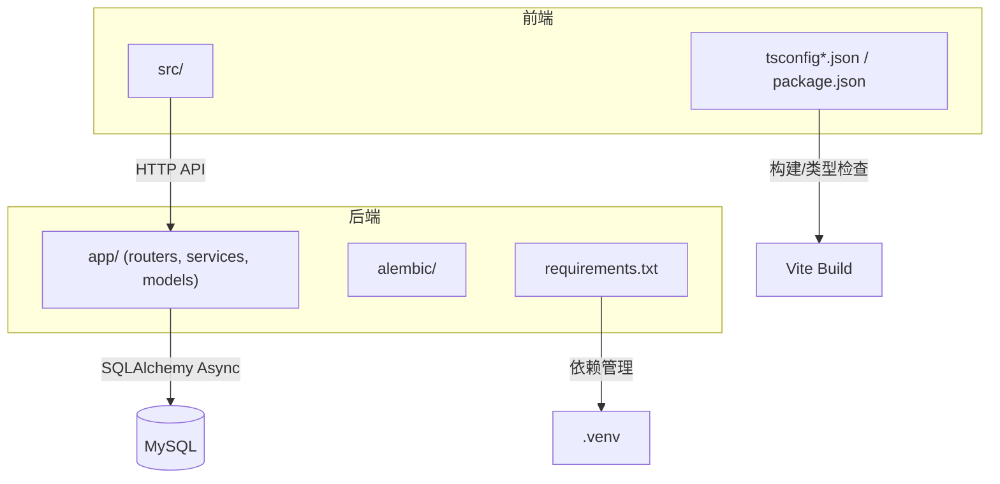
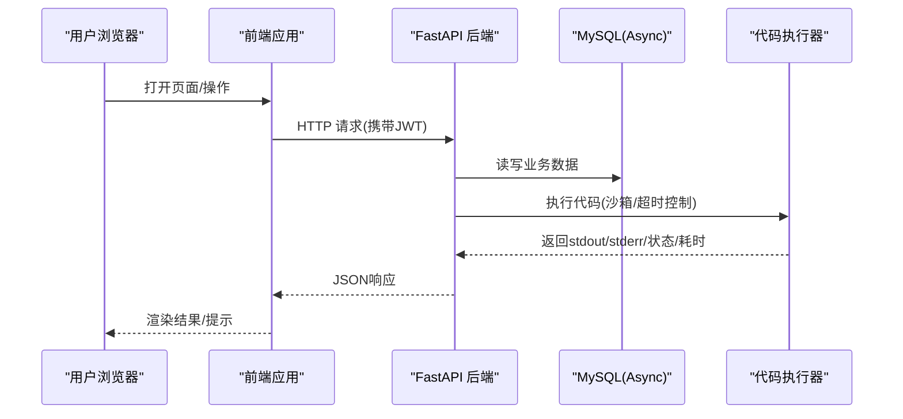
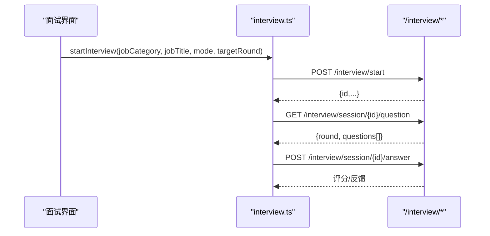
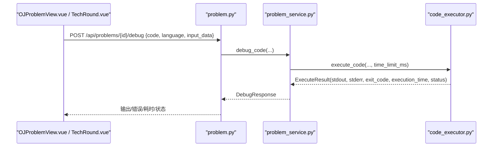
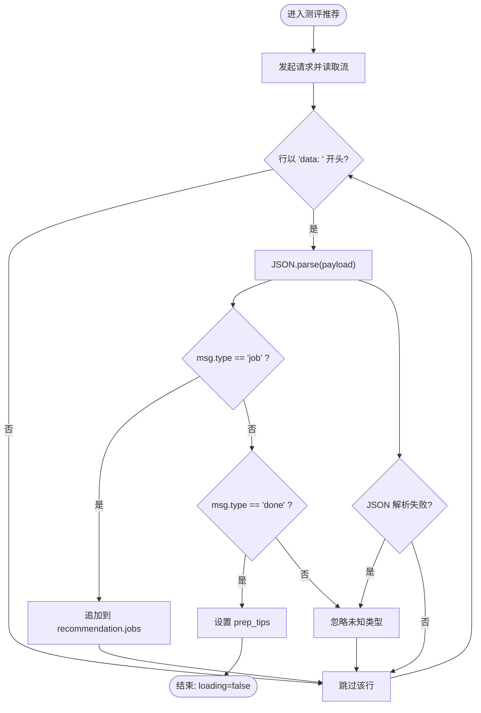
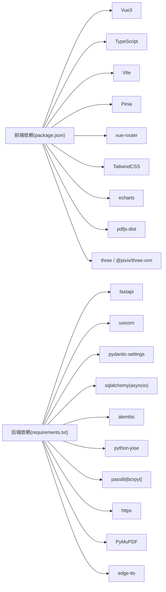

# 开发者指南

<cite>
**本文引用的文件**   
- [backEnd/requirements.txt](file://backEnd/requirements.txt)
- [frontEnd/package.json](file://frontEnd/package.json)
- [start.cmd](file://start.cmd)
- [frontEnd/tsconfig.app.json](file://frontEnd/tsconfig.app.json)
- [frontEnd/tsconfig.node.json](file://frontEnd/tsconfig.node.json)
- [frontEnd/.gitignore](file://frontEnd/.gitignore)
- [backEnd/.gitignore](file://backEnd/.gitignore)
- [frontEnd/src/stores/interview.ts](file://frontEnd/src/stores/interview.ts)
- [frontEnd/src/stores/career.ts](file://frontEnd/src/stores/career.ts)
- [frontEnd/src/components/interview/TechRound.vue](file://frontEnd/src/components/interview/TechRound.vue)
- [frontEnd/src/views/OJProblemView.vue](file://frontEnd/src/views/OJProblemView.vue)
- [backEnd/app/routers/problem.py](file://backEnd/app/routers/problem.py)
- [backEnd/app/services/problem_service.py](file://backEnd/app/services/problem_service.py)
- [backEnd/app/services/code_executor.py](file://backEnd/app/services/code_executor.py)
</cite>

## 目录
1. [简介](#简介)
2. [项目结构](#项目结构)
3. [核心组件](#核心组件)
4. [架构总览](#架构总览)
5. [详细组件分析](#详细组件分析)
6. [依赖分析](#依赖分析)
7. [性能考虑](#性能考虑)
8. [故障排除指南](#故障排除指南)
9. [结论](#结论)
10. [附录](#附录)

## 简介
本指南面向HR XF项目的贡献者与协作者，覆盖开发环境搭建、代码贡献规范、分支与提交约定、测试策略、前后端代码风格与最佳实践、性能优化与调试技巧、第三方依赖管理、常见问题排查以及新成员快速上手路径。目标是建立统一的协作标准，提升交付质量与效率。

## 项目结构
- 后端（Python/FastAPI）：位于 backEnd 目录，包含路由、服务、模型、数据库迁移等。
- 前端（Vue3 + TypeScript + Vite）：位于 frontEnd 目录，包含页面、组件、状态管理、类型配置等。
- 启动脚本：根目录 start.cmd 用于一键启动前后端。

**图表来源** 
- [start.cmd:1-36](file://start.cmd#L1-L36)
- [backEnd/requirements.txt:1-27](file://backEnd/requirements.txt#L1-L27)
- [frontEnd/package.json:1-35](file://frontEnd/package.json#L1-L35)

**章节来源**
- [start.cmd:1-36](file://start.cmd#L1-L36)
- [backEnd/requirements.txt:1-27](file://backEnd/requirements.txt#L1-L27)
- [frontEnd/package.json:1-35](file://frontEnd/package.json#L1-L35)

## 核心组件
- 面试流程与记录：前端通过 Pinia store 发起请求并维护会话状态；后端提供接口创建会话、获取题目、提交答案、生成报告。
- OJ 判题与调试：前端触发“运行/提交”，后端执行代码沙箱，返回输出、耗时与状态。
- 职业测评：前端流式处理 SSE 数据，更新推荐结果与准备建议。

**章节来源**
- [frontEnd/src/stores/interview.ts:139-187](file://frontEnd/src/stores/interview.ts#L139-L187)
- [frontEnd/src/stores/career.ts:185-222](file://frontEnd/src/stores/career.ts#L185-L222)
- [backEnd/app/routers/problem.py:161-174](file://backEnd/app/routers/problem.py#L161-L174)
- [backEnd/app/services/problem_service.py:155-206](file://backEnd/app/services/problem_service.py#L155-L206)

## 架构总览
系统采用前后端分离架构：
- 前端使用 Vue3 + TypeScript + Vite，Pinia 管理状态，TailwindCSS 样式。
- 后端使用 FastAPI + SQLAlchemy 2.0 异步驱动，Alembic 管理迁移，Pydantic Settings 管理配置。
- 鉴权基于 JWT，密码哈希使用 bcrypt。
- 外部能力包括 Deepseek API（httpx）、PDF 解析（PyMuPDF）、TTS（edge-tts）。

**图表来源** 
- [frontEnd/src/stores/interview.ts:139-187](file://frontEnd/src/stores/interview.ts#L139-L187)
- [backEnd/app/routers/problem.py:161-174](file://backEnd/app/routers/problem.py#L161-L174)
- [backEnd/app/services/problem_service.py:155-206](file://backEnd/app/services/problem_service.py#L155-L206)
- [backEnd/app/services/code_executor.py:149-181](file://backEnd/app/services/code_executor.py#L149-L181)
- [backEnd/app/services/code_executor.py:436-443](file://backEnd/app/services/code_executor.py#L436-L443)

## 详细组件分析

### 面试模块（前端 Store 与交互）
- 职责：加载岗位分类、开始面试、拉取题目、提交答案、维护当前会话与问题列表。
- 关键流程：
  - 选择岗位后调用 /interview/start 创建会话。
  - 根据 sessionId 拉取题目并提交答案。
  - 错误与加载态统一在 finally 中清理。

**图表来源** 
- [frontEnd/src/stores/interview.ts:139-187](file://frontEnd/src/stores/interview.ts#L139-L187)

**章节来源**
- [frontEnd/src/stores/interview.ts:139-187](file://frontEnd/src/stores/interview.ts#L139-L187)

### OJ 调试与提交（前后端联动）
- 前端：在题目详情页或技术面环节触发“调试运行”和“提交”。
- 后端：路由接收参数，服务层调用执行器，返回调试信息或判定结果。

**图表来源** 
- [frontEnd/src/views/OJProblemView.vue:206-480](file://frontEnd/src/views/OJProblemView.vue#L206-L480)
- [frontEnd/src/components/interview/TechRound.vue:174-381](file://frontEnd/src/components/interview/TechRound.vue#L174-L381)
- [backEnd/app/routers/problem.py:161-174](file://backEnd/app/routers/problem.py#L161-L174)
- [backEnd/app/services/problem_service.py:182-201](file://backEnd/app/services/problem_service.py#L182-L201)
- [backEnd/app/services/code_executor.py:436-443](file://backEnd/app/services/code_executor.py#L436-L443)

**章节来源**
- [frontEnd/src/views/OJProblemView.vue:206-480](file://frontEnd/src/views/OJProblemView.vue#L206-L480)
- [frontEnd/src/components/interview/TechRound.vue:174-381](file://frontEnd/src/components/interview/TechRound.vue#L174-L381)
- [backEnd/app/routers/problem.py:161-174](file://backEnd/app/routers/problem.py#L161-L174)
- [backEnd/app/services/problem_service.py:155-206](file://backEnd/app/services/problem_service.py#L155-L206)
- [backEnd/app/services/code_executor.py:149-181](file://backEnd/app/services/code_executor.py#L149-L181)
- [backEnd/app/services/code_executor.py:436-443](file://backEnd/app/services/code_executor.py#L436-L443)

### 职业测评（SSE 流式处理）
- 前端监听 data: 行，解析 JSON，按 type 分发到 jobs/prep_tips 等字段，异常块忽略，最终关闭 loading。

**图表来源** 
- [frontEnd/src/stores/career.ts:185-222](file://frontEnd/src/stores/career.ts#L185-L222)

**章节来源**
- [frontEnd/src/stores/career.ts:185-222](file://frontEnd/src/stores/career.ts#L185-L222)

## 依赖分析
- 后端依赖（部分）：FastAPI、uvicorn、pydantic-settings、SQLAlchemy(asyncio)、aiomysql/pymysql、alembic、cryptography、python-jose、passlib、httpx、PyMuPDF、edge-tts。
- 前端依赖（部分）：Vue3、TypeScript、Vite、Pinia、vue-router、TailwindCSS、ECharts、pdfjs-dist、mammoth、three/@pixiv/three-vrm。

**图表来源** 
- [frontEnd/package.json:1-35](file://frontEnd/package.json#L1-L35)
- [backEnd/requirements.txt:1-27](file://backEnd/requirements.txt#L1-L27)

**章节来源**
- [frontEnd/package.json:1-35](file://frontEnd/package.json#L1-L35)
- [backEnd/requirements.txt:1-27](file://backEnd/requirements.txt#L1-L27)

## 性能考虑
- 前端
  - 按需加载与路由懒加载已启用（动态 import），减少首屏体积。
  - 大图表（ECharts）仅在需要时渲染，避免主线程阻塞。
  - 图片/资源缓存与字体内联由构建工具与运行时策略处理。
- 后端
  - 异步 I/O（SQLAlchemy asyncio、httpx）提升并发吞吐。
  - 代码执行使用线程池与子进程隔离，限制时间与内存，避免雪崩。
  - 静态资源与上传目录独立，便于扩展存储与CDN。

[本节为通用指导，不直接分析具体文件]

## 故障排除指南
- 本地无法启动
  - 确认 Python 虚拟环境与依赖安装正确，端口未被占用。
  - 前端依赖安装完成后，再启动开发服务器。
- 鉴权相关错误
  - 检查是否携带 Authorization Bearer Token，Token 过期需重新登录。
- 代码执行失败
  - 检查语言编译器是否在 PATH 中或 .env 配置是否正确。
  - 查看 stderr 与状态码，区分超时、运行时错误与编译错误。
- 数据库迁移
  - 确保 alembic 版本与模型一致，必要时回滚或生成新版本。

**章节来源**
- [start.cmd:1-36](file://start.cmd#L1-L36)
- [backEnd/app/services/code_executor.py:149-181](file://backEnd/app/services/code_executor.py#L149-L181)
- [backEnd/app/services/code_executor.py:436-443](file://backEnd/app/services/code_executor.py#L436-L443)

## 结论
本指南梳理了 HR XF 的架构、关键流程与协作规范。遵循本文的分支与提交约定、代码风格与测试策略，将显著提升团队协作效率与交付质量。建议在迭代中持续完善自动化测试与 CI/CD 流水线，逐步引入覆盖率门禁与安全扫描。

[本节为总结性内容，不直接分析具体文件]

## 附录

### 快速上手
- 启动方式
  - 双击运行 start.cmd，自动拉起后端与前端服务。
  - 后端默认 http://localhost:8000，API 文档 http://localhost:8000/docs。
  - 前端默认 http://localhost:5173。
- 环境要求
  - Python 3.x，Node.js LTS。
  - MySQL 8+，Alembic 迁移可用。
- 常用命令
  - 后端：pip install -r requirements.txt；uvicorn app.main:app --reload
  - 前端：npm run dev / npm run build

**章节来源**
- [start.cmd:1-36](file://start.cmd#L1-L36)
- [backEnd/requirements.txt:1-27](file://backEnd/requirements.txt#L1-L27)
- [frontEnd/package.json:1-35](file://frontEnd/package.json#L1-L35)

### Git 分支管理与提交规范
- 分支策略
  - main：稳定发布分支。
  - develop：集成开发分支。
  - feature/*：功能分支。
  - fix/*：缺陷修复分支。
  - hotfix/*：紧急修复分支。
- 提交信息格式
  - <type>(<scope>): <subject>
  - type 可选：feat、fix、docs、style、refactor、perf、test、build、ci、chore、revert
  - subject 简洁明了，中文或英文均可，避免空提交。
- 合并与审查
  - 所有变更需通过 Pull Request 合并，至少一名 Reviewer 批准。
  - 合并前需通过基础检查（类型检查、构建、必要测试）。

[本节为通用规范，不直接分析具体文件]

### 代码风格与最佳实践
- Python（后端）
  - 使用 pydantic-settings 管理配置，SQLAlchemy 2.0 异步模式。
  - 路由与服务分层清晰，错误统一抛出 HTTPException。
  - 敏感信息通过环境变量注入，避免硬编码。
- TypeScript/Vue（前端）
  - tsconfig.app.json 与 tsconfig.node.json 开启严格选项与路径别名。
  - 使用 Pinia 管理全局状态，组件保持单一职责。
  - 使用 TailwindCSS 原子类，避免重复样式。

**章节来源**
- [frontEnd/tsconfig.app.json:1-17](file://frontEnd/tsconfig.app.json#L1-L17)
- [frontEnd/tsconfig.node.json:1-23](file://frontEnd/tsconfig.node.json#L1-L23)

### 测试策略与实施方法
- 单元测试
  - 后端：对服务层函数进行断言（如判题逻辑、安全校验）。
  - 前端：对 Store 方法与工具函数进行断言。
- 集成测试
  - 后端：使用 TestClient 模拟请求，验证路由与服务链路。
  - 前端：对关键交互流程进行端到端冒烟测试。
- 端到端测试
  - 使用 Playwright/Cypress 覆盖登录、面试、OJ 等核心路径。
- 执行方式
  - 后端：pytest 或 unittest。
  - 前端：vitest 或 jest（若引入）。

[本节为通用指导，不直接分析具体文件]

### 第三方依赖管理与更新策略
- 锁定版本
  - 后端：requirements.txt 固定主要依赖版本。
  - 前端：package.json 与 package-lock.json 锁定依赖树。
- 更新流程
  - 定期审计漏洞与兼容性，先在特性分支升级并回归测试。
  - 重大升级需评估影响范围，必要时分阶段推进。
- 安全与合规
  - 关注许可证与供应链风险，优先选择活跃维护的包。

**章节来源**
- [backEnd/requirements.txt:1-27](file://backEnd/requirements.txt#L1-L27)
- [frontEnd/package.json:1-35](file://frontEnd/package.json#L1-L35)

### 常见开发问题与解决方案
- 端口冲突
  - 修改 start.cmd 中的端口或释放占用进程。
- 编译器未找到
  - 在 .env 指定编译器路径，或将编译器加入系统 PATH。
- 数据库连接失败
  - 检查 DSN、用户名密码与权限，确认 Alembic 迁移已执行。
- 前端构建失败
  - 清理 node_modules 与 dist，重装依赖后重试。

**章节来源**
- [start.cmd:1-36](file://start.cmd#L1-L36)
- [backEnd/app/services/code_executor.py:149-181](file://backEnd/app/services/code_executor.py#L149-L181)

### 新成员快速上手清单
- 克隆仓库并安装依赖
  - 后端：创建虚拟环境并安装 requirements.txt。
  - 前端：npm install。
- 初始化数据库与迁移
  - 配置数据库连接，执行 Alembic upgrade。
- 启动服务
  - 运行 start.cmd，访问前端与 API 文档。
- 熟悉核心流程
  - 阅读面试与 OJ 的关键流程图，定位对应源码位置。
- 提交第一个 PR
  - 遵循分支与提交规范，完成自测与基础检查。

**章节来源**
- [start.cmd:1-36](file://start.cmd#L1-L36)
- [frontEnd/src/stores/interview.ts:139-187](file://frontEnd/src/stores/interview.ts#L139-L187)
- [backEnd/app/routers/problem.py:161-174](file://backEnd/app/routers/problem.py#L161-L174)