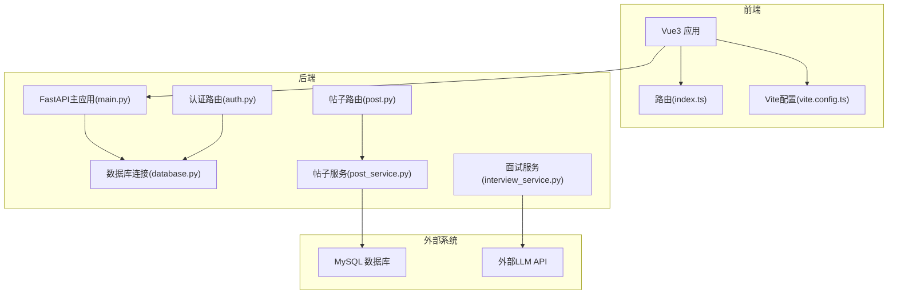
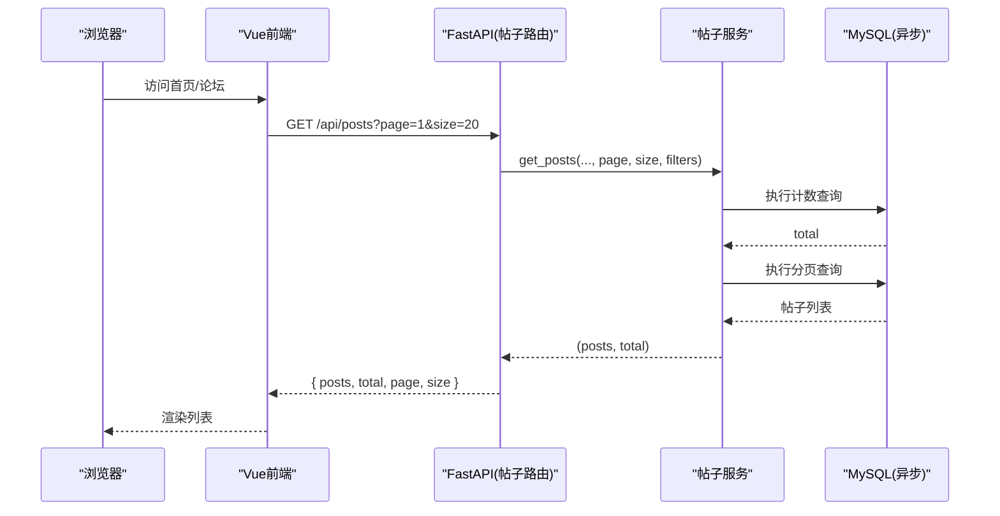
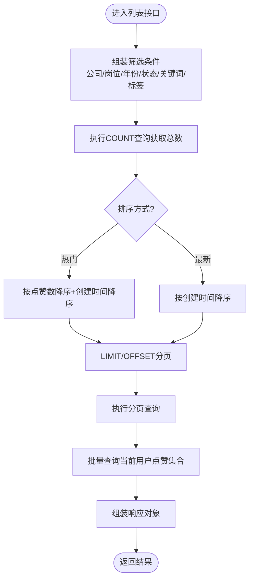
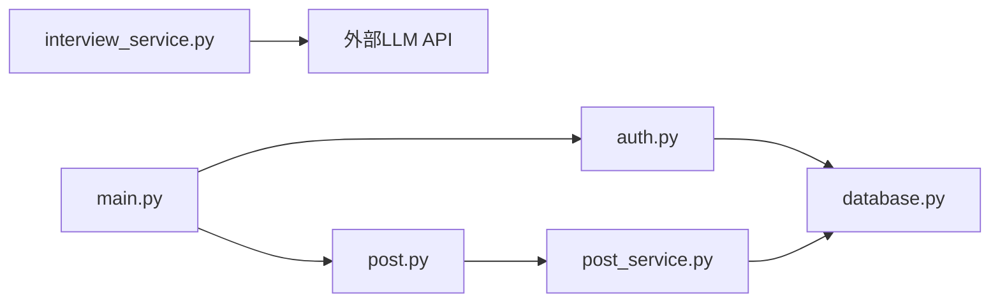

# 性能优化建议

<cite>
**本文引用的文件**   
- [backEnd/app/main.py](file://backEnd/app/main.py)
- [backEnd/app/database.py](file://backEnd/app/database.py)
- [backEnd/app/routers/auth.py](file://backEnd/app/routers/auth.py)
- [backEnd/app/routers/post.py](file://backEnd/app/routers/post.py)
- [backEnd/app/services/post_service.py](file://backEnd/app/services/post_service.py)
- [backEnd/app/services/auth.py](file://backEnd/app/services/auth.py)
- [backEnd/app/services/interview_service.py](file://backEnd/app/services/interview_service.py)
- [frontEnd/vite.config.ts](file://frontEnd/vite.config.ts)
- [frontEnd/package.json](file://frontEnd/package.json)
- [frontEnd/src/router/index.ts](file://frontEnd/src/router/index.ts)
- [frontEnd/src/views/HomeView.vue](file://frontEnd/src/views/HomeView.vue)
</cite>

## 目录
1. [引言](#引言)
2. [项目结构](#项目结构)
3. [核心组件](#核心组件)
4. [架构总览](#架构总览)
5. [详细组件分析](#详细组件分析)
6. [依赖关系分析](#依赖关系分析)
7. [性能考量](#性能考量)
8. [故障排查指南](#故障排查指南)
9. [结论](#结论)
10. [附录](#附录)

## 引言
本指南面向HR XF项目的生产级性能调优，覆盖后端FastAPI、前端Vue3、AI接口调用、内存与垃圾回收、监控指标与分析工具，以及常见问题诊断与解决方案。目标是帮助团队在真实流量下获得更低的延迟、更高的吞吐和更稳定的可用性。

## 项目结构
本项目采用前后端分离：
- 后端：FastAPI + SQLAlchemy异步引擎 + MySQL（通过pymysql/aiomysql）
- 前端：Vue3 + Vite + Vue Router + Pinia
- AI能力：通过httpx异步客户端调用外部LLM服务（SSE流式）

图表来源
- [backEnd/app/main.py:1-90](file://backEnd/app/main.py#L1-L90)
- [backEnd/app/database.py:1-58](file://backEnd/app/database.py#L1-L58)
- [backEnd/app/routers/auth.py:1-217](file://backEnd/app/routers/auth.py#L1-L217)
- [backEnd/app/routers/post.py:1-249](file://backEnd/app/routers/post.py#L1-L249)
- [backEnd/app/services/post_service.py:1-249](file://backEnd/app/services/post_service.py#L1-L249)
- [backEnd/app/services/interview_service.py:776-838](file://backEnd/app/services/interview_service.py#L776-L838)
- [frontEnd/src/router/index.ts:1-167](file://frontEnd/src/router/index.ts#L1-L167)
- [frontEnd/vite.config.ts:1-22](file://frontEnd/vite.config.ts#L1-L22)

章节来源
- [backEnd/app/main.py:1-90](file://backEnd/app/main.py#L1-L90)
- [backEnd/app/database.py:1-58](file://backEnd/app/database.py#L1-L58)
- [frontEnd/src/router/index.ts:1-167](file://frontEnd/src/router/index.ts#L1-L167)
- [frontEnd/vite.config.ts:1-22](file://frontEnd/vite.config.ts#L1-L22)

## 核心组件
- FastAPI应用生命周期与中间件：启动时建表与种子数据，关闭时释放引擎；CORS中间件；静态资源挂载；健康检查。
- 数据库层：异步引擎、会话工厂、连接池参数、ping兼容补丁、请求级会话注入。
- 认证路由：注册、登录、资料更新、头像上传等。
- 帖子路由与服务：复杂筛选、分页、点赞、评论、标签统计、去重选项。
- 面试服务：评分与SSE流式对话，调用外部LLM。
- 前端路由：懒加载、守卫、滚动行为。
- 构建配置：开发代理、别名。

章节来源
- [backEnd/app/main.py:27-49](file://backEnd/app/main.py#L27-L49)
- [backEnd/app/database.py:31-43](file://backEnd/app/database.py#L31-L43)
- [backEnd/app/routers/auth.py:41-86](file://backEnd/app/routers/auth.py#L41-L86)
- [backEnd/app/routers/post.py:63-105](file://backEnd/app/routers/post.py#L63-L105)
- [backEnd/app/services/post_service.py:96-166](file://backEnd/app/services/post_service.py#L96-L166)
- [backEnd/app/services/interview_service.py:797-838](file://backEnd/app/services/interview_service.py#L797-L838)
- [frontEnd/src/router/index.ts:122-166](file://frontEnd/src/router/index.ts#L122-L166)
- [frontEnd/vite.config.ts:6-21](file://frontEnd/vite.config.ts#L6-L21)

## 架构总览
下图展示一次“获取帖子列表”的端到端流程，体现路由到服务再到数据库的关键路径。

图表来源
- [backEnd/app/routers/post.py:63-105](file://backEnd/app/routers/post.py#L63-L105)
- [backEnd/app/services/post_service.py:96-166](file://backEnd/app/services/post_service.py#L96-L166)

## 详细组件分析

### 后端FastAPI性能优化策略
- 数据库连接池与超时
  - 使用异步引擎并开启pool_pre_ping，合理设置pool_size与max_overflow以匹配并发量。
  - 参考位置：[数据库连接与池配置:31-37](file://backEnd/app/database.py#L31-L37)
- 会话生命周期与事务
  - 使用get_db提供请求级AsyncSession，自动提交或回滚，避免长事务。
  - 参考位置：[会话注入与事务处理:50-58](file://backEnd/app/database.py#L50-L58)
- 查询优化
  - 列表页使用条件组合、子查询过滤标签、count+limit分页，减少全表扫描。
  - 参考位置：[帖子列表查询逻辑:96-166](file://backEnd/app/services/post_service.py#L96-L166)
- 响应构造与N+1规避
  - 批量获取用户点赞状态，避免逐条查询。
  - 参考位置：[批量点赞状态查询:212-224](file://backEnd/app/services/post_service.py#L212-L224)
- 异常与验证错误处理
  - 自定义RequestValidationError处理器，避免二进制内容导致的解码异常。
  - 参考位置：[验证错误处理](file://backEnd/app/main.py:76-84)
- 静态资源与CORS
  - 静态目录挂载与CORS白名单，减少跨域开销与重复握手。
  - 参考位置：[CORS与静态挂载](file://backEnd/app/main.py:52-73)

章节来源
- [backEnd/app/database.py:31-58](file://backEnd/app/database.py#L31-L58)
- [backEnd/app/services/post_service.py:96-166](file://backEnd/app/services/post_service.py#L96-L166)
- [backEnd/app/services/post_service.py:212-224](file://backEnd/app/services/post_service.py#L212-L224)
- [backEnd/app/main.py:52-84](file://backEnd/app/main.py#L52-L84)

#### 数据库查询优化流程图

图表来源
- [backEnd/app/services/post_service.py:96-166](file://backEnd/app/services/post_service.py#L96-L166)
- [backEnd/app/services/post_service.py:212-224](file://backEnd/app/services/post_service.py#L212-L224)

### 缓存策略
- 热点数据缓存
  - 热门标签统计、筛选器选项、首页统计数据适合短期缓存（如Redis），降低重复聚合与IO压力。
  - 可结合TTL与失效策略（写后失效）。
- 页面级缓存
  - 对不频繁变化的静态页面启用CDN与浏览器强缓存，缩短首屏时间。
- 接口级缓存
  - 对GET类接口增加ETag/Last-Modified，支持条件请求，减少带宽。

说明：本节为通用策略，未直接分析具体代码文件。

### 异步处理最佳实践
- 外部AI调用使用httpx.AsyncClient，配合合理的timeout与streaming读取，避免阻塞事件循环。
  - 参考位置：[SSE流式对话实现:797-838](file://backEnd/app/services/interview_service.py#L797-L838)
- 大任务异步化
  - 简历解析、报告生成等耗时任务建议放入Celery队列，后端立即返回任务ID，前端轮询或SSE推送进度。
- 并发控制
  - 对外部LLM调用进行限流与重试退避，避免雪崩。

章节来源
- [backEnd/app/services/interview_service.py:797-838](file://backEnd/app/services/interview_service.py#L797-L838)

### 前端Vue3性能优化技巧
- 组件懒加载与路由分割
  - 路由已使用动态import实现按需加载，显著降低首包体积。
  - 参考位置：[路由懒加载定义](file://frontEnd/src/router/index.ts:5-L120)
- 构建与打包
  - 使用Vite构建，开启压缩与Tree Shaking；可按需引入ECharts、Three.js等大型库。
  - 参考位置：[Vite配置与插件](file://frontEnd/vite.config.ts:6-L21)、[依赖清单](file://frontEnd/package.json:11-L33)
- 浏览器缓存策略
  - 静态资源文件名带哈希，启用长期缓存；HTML与入口JS短缓存，保证版本更新及时生效。
- 图片与媒体优化
  - 使用WebP/AVIF格式、响应式尺寸、懒加载；大图分片加载。
- 运行时优化
  - 列表虚拟滚动、防抖节流、增量更新；避免不必要的重渲染。

章节来源
- [frontEnd/src/router/index.ts:5-120](file://frontEnd/src/router/index.ts#L5-L120)
- [frontEnd/vite.config.ts:6-21](file://frontEnd/vite.config.ts#L6-L21)
- [frontEnd/package.json:11-33](file://frontEnd/package.json#L11-L33)

### AI接口调用的性能优化方法
- 请求重试与退避
  - 对LLM调用增加指数退避重试，区分可重试错误（网络抖动、限流）与不可重试错误（参数错误）。
- 超时处理
  - 根据业务场景设置合理超时（如普通调用30s，SSE流式120s），并在前端显示等待反馈。
  - 参考位置：[非流式调用超时](file://backEnd/app/services/interview_service.py:776-L790)、[SSE流式超时](file://backEnd/app/services/interview_service.py:827-L838)
- 连接池配置
  - httpx.AsyncClient复用连接，减少握手开销；在高并发场景下考虑全局单例或连接池管理。
- 降级与兜底
  - 当LLM不可用时返回默认评分或提示，保障用户体验。
  - 参考位置：[异常兜底返回](file://backEnd/app/services/interview_service.py:789-L790)

章节来源
- [backEnd/app/services/interview_service.py:776-790](file://backEnd/app/services/interview_service.py#L776-L790)
- [backEnd/app/services/interview_service.py:827-838](file://backEnd/app/services/interview_service.py#L827-L838)

### 内存管理与垃圾回收最佳实践
- Python侧
  - 避免在请求中持有大对象引用；及时释放临时变量；谨慎使用全局缓存，限制大小与过期时间。
  - 合理使用asyncio任务，避免任务泄漏。
- 前端侧
  - 及时销毁监听器、定时器、WebSocket连接；大对象置空；避免闭包持有DOM引用导致内存泄漏。
  - 使用浏览器Performance面板观察内存快照与堆差异。

说明：本节为通用实践，未直接分析具体代码文件。

### 监控指标收集与性能分析工具
- 后端
  - 接入Prometheus指标：QPS、P95/P99延迟、错误率、数据库连接池使用率、外部API耗时。
  - 结构化日志：请求ID、耗时、关键步骤埋点。
- 前端
  - 采集FCP/LCP/CLS/TTFB等Core Web Vitals；上报至监控平台。
  - 使用Chrome DevTools Performance/Network面板定位瓶颈。
- 链路追踪
  - 为关键请求添加traceId，串联前后端与外部调用。

说明：本节为通用方案，未直接分析具体代码文件。

## 依赖关系分析
- 模块耦合
  - 路由层薄封装，主要逻辑下沉至service层，便于测试与扩展。
  - 数据库依赖集中在database.py，统一配置与注入。
- 外部依赖
  - httpx用于外部LLM调用；SQLAlchemy异步驱动与MySQL交互。
- 潜在风险
  - 若外部LLM限流或延迟升高，需在前端与后端共同做退避与降级。

图表来源
- [backEnd/app/routers/auth.py:1-217](file://backEnd/app/routers/auth.py#L1-L217)
- [backEnd/app/routers/post.py:1-249](file://backEnd/app/routers/post.py#L1-L249)
- [backEnd/app/services/post_service.py:1-249](file://backEnd/app/services/post_service.py#L1-L249)
- [backEnd/app/services/interview_service.py:776-838](file://backEnd/app/services/interview_service.py#L776-L838)
- [backEnd/app/database.py:1-58](file://backEnd/app/database.py#L1-L58)
- [backEnd/app/main.py:1-90](file://backEnd/app/main.py#L1-L90)

章节来源
- [backEnd/app/routers/auth.py:1-217](file://backEnd/app/routers/auth.py#L1-L217)
- [backEnd/app/routers/post.py:1-249](file://backEnd/app/routers/post.py#L1-L249)
- [backEnd/app/services/post_service.py:1-249](file://backEnd/app/services/post_service.py#L1-L249)
- [backEnd/app/services/interview_service.py:776-838](file://backEnd/app/services/interview_service.py#L776-L838)
- [backEnd/app/database.py:1-58](file://backEnd/app/database.py#L1-L58)
- [backEnd/app/main.py:1-90](file://backEnd/app/main.py#L1-L90)

## 性能考量
- 数据库
  - 索引设计：对常用筛选字段（company、position、year、status、interview_type）建立复合索引；标签关联表确保post_id与tag_id索引完善。
  - 分页优化：避免深度分页，必要时使用时间戳游标分页。
  - 读写分离：读多写少场景可引入只读副本。
- 缓存
  - 热点数据（标签统计、筛选选项、首页统计）加入缓存层，TTL按业务调整。
- 异步与并发
  - 外部LLM调用使用连接池与超时保护；SSE流式输出提升感知性能。
- 前端
  - 路由懒加载、按需引入大型库、静态资源强缓存、图片优化与懒加载。
- 部署
  - 使用gunicorn/uvicorn多worker模式；反向代理（Nginx）开启gzip/brotli与HTTP/2。

说明：本节为通用指导，未直接分析具体代码文件。

## 故障排查指南
- 常见症状与定位
  - 列表页慢：检查SQL执行计划与索引命中；确认是否出现N+1查询。
  - 登录失败：核对密码校验与账号状态；查看鉴权中间件与JWT解析。
  - 头像上传失败：检查文件大小与类型限制、磁盘空间与权限。
  - AI对话卡顿：关注外部LLM延迟与限流；检查SSE断连与重试。
- 快速自检
  - 后端健康检查：GET /api/health
  - 数据库连通性：检查连接池使用率与ping结果。
  - 前端网络：查看请求耗时与错误码，确认代理与CORS配置。
- 日志与指标
  - 记录关键步骤耗时与异常堆栈；对比P95/P99趋势变化。

章节来源
- [backEnd/app/main.py:87-90](file://backEnd/app/main.py#L87-L90)
- [backEnd/app/routers/auth.py:182-216](file://backEnd/app/routers/auth.py#L182-L216)
- [backEnd/app/routers/post.py:63-105](file://backEnd/app/routers/post.py#L63-L105)

## 结论
通过数据库查询优化、缓存策略、异步与连接池配置、前端懒加载与资源优化、AI接口容错与降级、完善的监控与排障体系，HR XF可在高并发与复杂AI交互场景下保持稳定与高性能。建议在生产环境逐步落地上述策略，并以指标驱动持续迭代。

## 附录
- 相关视图与功能参考
  - 首页展示与导航：[HomeView](file://frontEnd/src/views/HomeView.vue:1-L353)
  - 构建与代理：[vite.config.ts](file://frontEnd/vite.config.ts:1-L22)
  - 依赖与脚本：[package.json](file://frontEnd/package.json:1-L35)