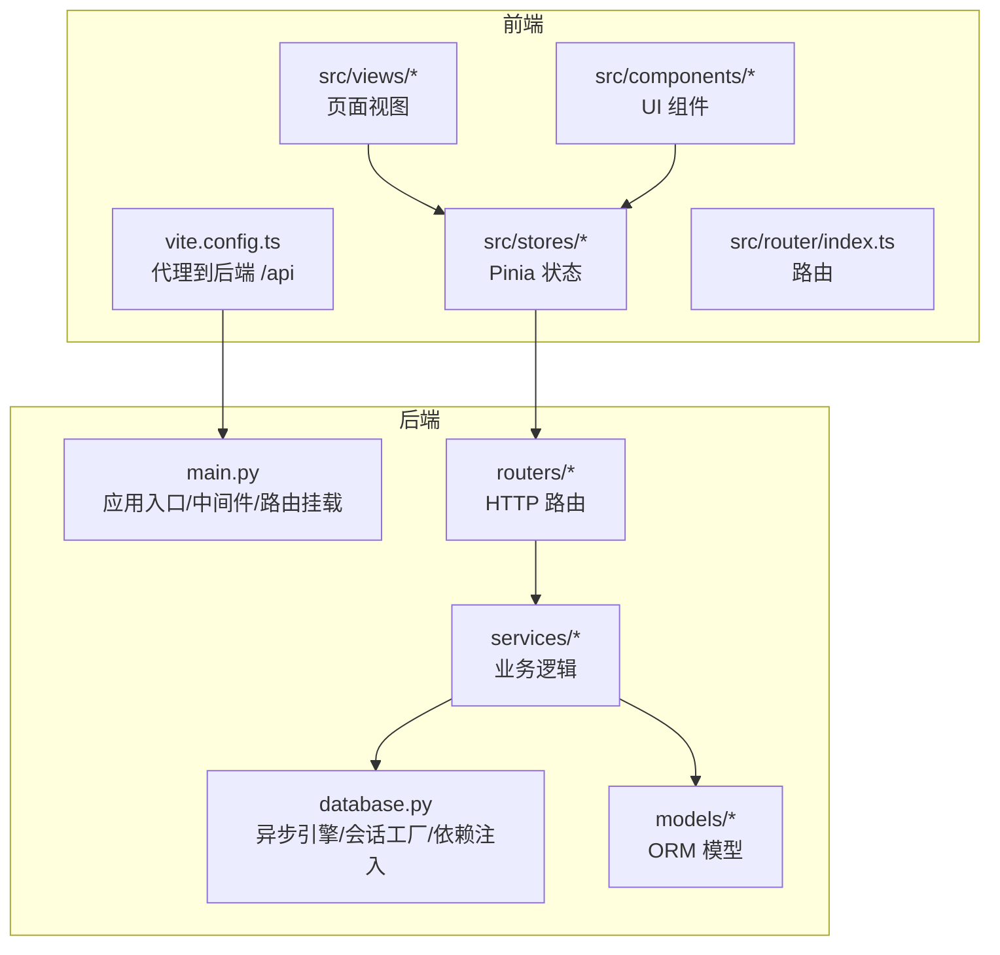
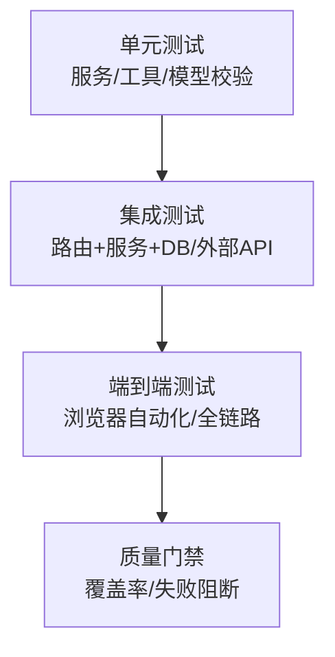
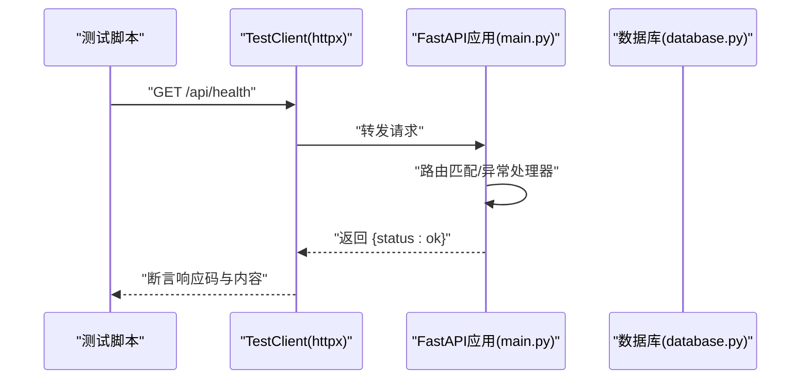
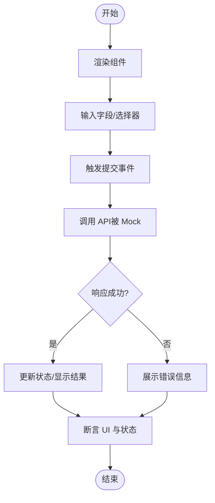
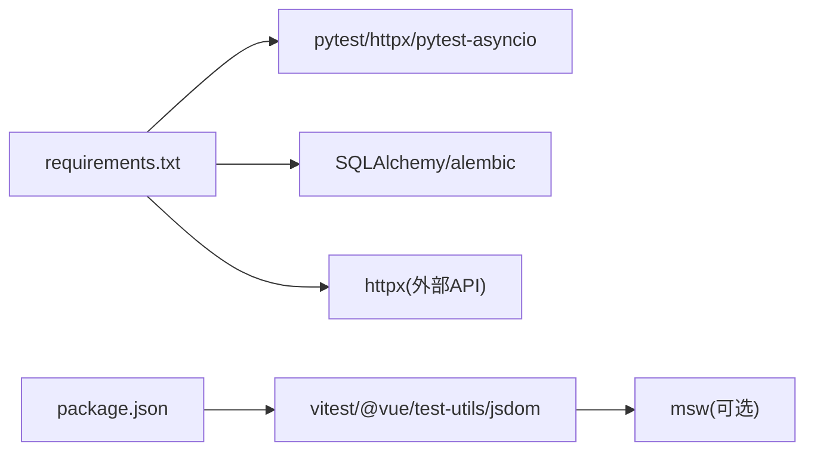

# 测试策略实施

<cite>
**本文引用的文件**   
- [backEnd/app/main.py](file://backEnd/app/main.py)
- [backEnd/app/database.py](file://backEnd/app/database.py)
- [backEnd/requirements.txt](file://backEnd/requirements.txt)
- [frontEnd/vite.config.ts](file://frontEnd/vite.config.ts)
- [frontEnd/package.json](file://frontEnd/package.json)
</cite>

## 目录
1. [简介](#简介)
2. [项目结构](#项目结构)
3. [核心组件](#核心组件)
4. [架构总览](#架构总览)
5. [详细组件分析](#详细组件分析)
6. [依赖分析](#依赖分析)
7. [性能考虑](#性能考虑)
8. [故障排查指南](#故障排查指南)
9. [结论](#结论)
10. [附录](#附录)

## 简介
本文件为 HR XF 项目的测试策略与实施指南，目标是建立可维护、可扩展的测试体系，覆盖后端 Python（FastAPI + SQLAlchemy 异步）与前端 Vue3（Vite + Pinia + Vue Router）。文档围绕测试金字塔展开，明确单元测试、集成测试、端到端测试的职责与范围；提供 pytest 配置建议、Mock 策略与数据库隔离方案；给出前端组件、状态管理、API 调用的测试方法；并补充持续集成流程、质量门禁、性能与安全测试实践，以及 TDD 开发指导。

## 项目结构
本项目采用前后端分离：
- 后端：FastAPI 应用入口、路由、服务层、数据模型、数据库连接与生命周期管理。
- 前端：Vue3 + Vite 构建，包含路由、Pinia 状态管理、业务视图与通用组件。

图表来源
- [backEnd/app/main.py:1-90](file://backEnd/app/main.py#L1-L90)
- [backEnd/app/database.py:1-58](file://backEnd/app/database.py#L1-L58)
- [frontEnd/vite.config.ts:1-22](file://frontEnd/vite.config.ts#L1-L22)

章节来源
- [backEnd/app/main.py:1-90](file://backEnd/app/main.py#L1-L90)
- [backEnd/app/database.py:1-58](file://backEnd/app/database.py#L1-L58)
- [frontEnd/vite.config.ts:1-22](file://frontEnd/vite.config.ts#L1-L22)

## 核心组件
- 后端应用入口与生命周期
  - 启动时创建表结构与种子数据，关闭时释放引擎资源；注册 CORS、静态文件挂载与健康检查接口。
- 数据库连接与会话
  - 使用异步引擎与会话工厂，提供 get_db 依赖注入函数，自动提交或回滚事务。
- 前端代理
  - 本地开发时将 /api 请求代理至后端服务，便于联调与端到端测试。

章节来源
- [backEnd/app/main.py:27-49](file://backEnd/app/main.py#L27-L49)
- [backEnd/app/main.py:51-73](file://backEnd/app/main.py#L51-L73)
- [backEnd/app/main.py:76-89](file://backEnd/app/main.py#L76-L89)
- [backEnd/app/database.py:31-58](file://backEnd/app/database.py#L31-L58)
- [frontEnd/vite.config.ts:13-20](file://frontEnd/vite.config.ts#L13-L20)

## 架构总览
测试金字塔分层如下：
- 单元测试：聚焦纯函数、工具类、服务层无外部依赖分支；快速、稳定、高覆盖率。
- 集成测试：验证路由与服务层、数据库交互、外部 API 调用（通过 Mock）；保证模块间协作正确。
- 端到端测试：模拟真实用户操作，覆盖关键业务流程；用于回归与发布前验收。

[此图为概念性示意，无需图表来源]

## 详细组件分析

### 后端测试策略（pytest + FastAPI + SQLAlchemy 异步）
- 测试框架与依赖
  - 使用 pytest 作为测试运行器；结合 httpx ASGI TestClient 进行路由级测试；使用 pytest-asyncio 支持异步测试。
  - 在 requirements.txt 中新增测试依赖（如 pytest、httpx、pytest-asyncio、pytest-mock、factory-boy、faker、coverage）。
- 配置要点
  - 使用 conftest.py 集中定义测试夹具：异步数据库会话、测试数据库 URL、应用实例、认证头生成等。
  - 通过环境变量切换数据库连接，确保每个测试用例使用独立库或事务回滚。
- Mock 策略
  - 对第三方 HTTP 客户端（如 httpx）使用 pytest-mock 或 unittest.mock.patch 替换网络调用。
  - 对时间、随机数、外部系统（TTS、PDF 解析）进行可控替换，提升稳定性。
- 数据库测试隔离
  - 方案一：每个测试使用独立临时数据库（推荐），通过 alembic 迁移初始化。
  - 方案二：使用事务包裹测试，并在每个用例结束后回滚，避免持久化污染。
- 示例路径参考
  - 应用入口与异常处理：[backEnd/app/main.py:76-89](file://backEnd/app/main.py#L76-L89)
  - 数据库依赖注入：[backEnd/app/database.py:50-58](file://backEnd/app/database.py#L50-L58)

章节来源
- [backEnd/app/main.py:76-89](file://backEnd/app/main.py#L76-L89)
- [backEnd/app/database.py:50-58](file://backEnd/app/database.py#L50-L58)

#### 后端集成测试序列图（以健康检查为例）

图表来源
- [backEnd/app/main.py:87-89](file://backEnd/app/main.py#L87-L89)
- [backEnd/app/database.py:31-43](file://backEnd/app/database.py#L31-L43)

### 前端测试策略（Vue3 + Vite + Pinia + Vue Router）
- 测试框架与依赖
  - 使用 Vitest 作为测试运行器（与 Vite 原生集成），配合 @vue/test-utils 进行组件测试，JSDOM 模拟 DOM。
  - 使用 vitest-fetch-mock 或 vi.fn() 拦截 fetch/XMLHttpRequest，或使用自定义 axios 实例进行 Mock。
  - 在 package.json 的 devDependencies 中添加测试相关包（vitest、@vue/test-utils、jsdom、@testing-library/jest-dom、msw 可选）。
- 组件测试
  - 渲染单个组件，触发事件，断言 UI 变化与输出；对子组件使用 shallowMount 或 stub 减少耦合。
- 状态管理测试（Pinia）
  - 直接调用 store 的 actions/getters，断言 state 变更与副作用；必要时 Mock 异步 API。
- API 调用测试
  - 使用 vi.fn() 或 msw 拦截网络请求，验证请求参数与响应处理逻辑。
- 示例路径参考
  - 代理配置（便于联调与 E2E）：[frontEnd/vite.config.ts:13-20](file://frontEnd/vite.config.ts#L13-L20)
  - 依赖清单（添加测试依赖位置）：[frontEnd/package.json:25-33](file://frontEnd/package.json#L25-L33)

章节来源
- [frontEnd/vite.config.ts:13-20](file://frontEnd/vite.config.ts#L13-L20)
- [frontEnd/package.json:25-33](file://frontEnd/package.json#L25-L33)

#### 前端组件测试流程图（以表单提交为例）

[此图为概念性示意，无需图表来源]

### 端到端测试（E2E）
- 目标：覆盖关键用户旅程（登录、发帖、面试流程、简历上传等），保障跨模块协同。
- 工具建议：Playwright 或 Cypress；针对 Vue3 与 Vite 环境，优先 Playwright（跨浏览器、现代生态）。
- 执行方式：在 CI 中启动后端与前端服务，再运行 E2E 套件；使用固定测试账号与数据准备脚本。
- 报告与截图：失败时自动保存截图/视频，便于定位问题。

[本节为通用实践说明，无需章节来源]

## 依赖分析
- 后端依赖
  - FastAPI、uvicorn、SQLAlchemy 异步、Alembic、PyMySQL/aiomysql、httpx、edge-tts、PyMuPDF 等。
  - 测试需引入 pytest、httpx（ASGI TestClient）、pytest-asyncio、pytest-mock、coverage。
- 前端依赖
  - Vue3、Pinia、Vue Router、Vite、TailwindCSS。
  - 测试需引入 vitest、@vue/test-utils、jsdom、@testing-library/jest-dom、msw（可选）。

图表来源
- [backEnd/requirements.txt:1-27](file://backEnd/requirements.txt#L1-L27)
- [frontEnd/package.json:1-35](file://frontEnd/package.json#L1-L35)

章节来源
- [backEnd/requirements.txt:1-27](file://backEnd/requirements.txt#L1-L27)
- [frontEnd/package.json:1-35](file://frontEnd/package.json#L1-L35)

## 性能考虑
- 后端
  - 使用内存数据库（SQLite in-memory）或轻量 MySQL 实例加速测试；限制并发与数据量。
  - 对耗时外部调用（TTS、PDF 解析）进行 Mock，避免 I/O 瓶颈。
- 前端
  - 组件测试尽量使用 shallowMount 与最小化渲染；避免加载大型资源。
  - 使用虚拟时间与定时器控制（如 jest fake timers 等价能力）加速异步场景。
- 指标与基准
  - 记录关键接口响应时间与吞吐，设置阈值告警；对热点路径进行回归对比。

[本节为通用实践说明，无需章节来源]

## 故障排查指南
- 常见后端问题
  - 数据库连接池 ping 兼容性问题：已在 database.py 中做补丁，若升级驱动需重新验证。
  - 请求体含二进制导致 UnicodeDecodeError：main.py 已实现自定义异常处理器，移除 input 字段以避免解码错误。
- 常见前端问题
  - 代理未生效：检查 vite.config.ts 中的 /api 代理规则与端口。
  - 组件渲染报错：确认 jsdom 环境与 polyfill；对第三方库进行 stub。
- 调试技巧
  - 后端：开启 SQL 日志（仅测试环境），打印请求/响应摘要。
  - 前端：启用测试模式下的额外日志，捕获未处理的 Promise 拒绝。

章节来源
- [backEnd/app/database.py:10-25](file://backEnd/app/database.py#L10-L25)
- [backEnd/app/main.py:76-84](file://backEnd/app/main.py#L76-L84)
- [frontEnd/vite.config.ts:13-20](file://frontEnd/vite.config.ts#L13-L20)

## 结论
通过明确的测试金字塔分工、完善的 pytest 与前端测试栈配置、严格的数据库隔离与 Mock 策略，HR XF 项目可在保持快速反馈的同时，保障关键路径的正确性与稳定性。建议在 CI 中固化测试流程与质量门禁，逐步引入性能与安全测试，形成闭环的质量保障体系。

[本节为总结性内容，无需章节来源]

## 附录

### 测试金字塔职责与覆盖范围
- 单元测试
  - 范围：工具函数、服务层纯逻辑、模型校验、错误处理分支。
  - 目标：高覆盖率、快速执行、强确定性。
- 集成测试
  - 范围：路由与服务层组合、数据库读写、外部 API 调用（Mock）。
  - 目标：验证模块协作与契约。
- 端到端测试
  - 范围：关键用户旅程、跨模块联动、浏览器行为。
  - 目标：回归与发布前验收。

[本节为通用实践说明，无需章节来源]

### 后端 pytest 配置建议
- 配置文件
  - conftest.py：定义异步数据库会话、应用实例、认证头、Mock 夹具。
  - pytest.ini/pyproject.toml：指定测试目录、插件、标记、并行选项。
- 数据库隔离
  - 使用独立测试数据库 URL；或在每个用例内使用事务回滚。
- Mock 策略
  - 使用 pytest-mock 或 unittest.mock.patch 替换 httpx、edge-tts、PyMuPDF 等外部依赖。
- 示例路径参考
  - 应用入口与异常处理：[backEnd/app/main.py:76-89](file://backEnd/app/main.py#L76-L89)
  - 数据库依赖注入：[backEnd/app/database.py:50-58](file://backEnd/app/database.py#L50-L58)

章节来源
- [backEnd/app/main.py:76-89](file://backEnd/app/main.py#L76-L89)
- [backEnd/app/database.py:50-58](file://backEnd/app/database.py#L50-L58)

### 前端 Vue3 测试方案
- 组件测试
  - 使用 @vue/test-utils 渲染与交互；对子组件进行 stub/shallow。
- 状态管理测试
  - 直接操作 Pinia store，断言 state 与副作用；Mock 异步 API。
- API 调用测试
  - 使用 vi.fn() 或 msw 拦截请求，验证请求参数与响应处理。
- 示例路径参考
  - 代理配置：[frontEnd/vite.config.ts:13-20](file://frontEnd/vite.config.ts#L13-L20)
  - 依赖清单：[frontEnd/package.json:25-33](file://frontEnd/package.json#L25-L33)

章节来源
- [frontEnd/vite.config.ts:13-20](file://frontEnd/vite.config.ts#L13-L20)
- [frontEnd/package.json:25-33](file://frontEnd/package.json#L25-L33)

### 测试数据准备与断言规范
- 数据准备
  - 使用 factory-boy/faker 生成后端测试数据；前端使用 fixtures 或工厂函数构造对象。
- 断言方法
  - 后端：断言响应码、JSON 结构、数据库状态；前端：断言 DOM 文本、样式类、store 状态。
- 异步处理
  - 后端使用 pytest-asyncio；前端使用 async/await 与 flushPromises。

[本节为通用实践说明，无需章节来源]

### 持续集成与质量门禁
- 流水线步骤
  - 安装依赖 → 运行单元测试 → 运行集成测试 → 构建前端 → 运行 E2E → 生成覆盖率报告。
- 质量门禁
  - 覆盖率阈值（如后端≥80%、前端≥70%）；关键用例失败即阻断合并。
- 缓存与并行
  - 缓存依赖与构建产物；按模块并行执行测试套件。

[本节为通用实践说明，无需章节来源]

### 性能测试与安全测试
- 性能测试
  - 使用 locust/k6 对关键接口进行压测；在 CI 中设定基线，超阈报警。
- 安全测试
  - 使用 bandit 扫描 Python 代码；前端使用 eslint-plugin-security 与依赖漏洞扫描（npm audit）。
  - 对敏感配置与密钥进行保护，测试环境使用最小权限账户。

[本节为通用实践说明，无需章节来源]

### 测试驱动开发（TDD）实践指导
- 红-绿-重构循环
  - 先写失败的测试用例，再实现最小可用代码，最后重构提升质量。
- 用例设计原则
  - 单一职责、可读性强、命名清晰、关注行为而非实现细节。
- 渐进式扩展
  - 从单元到集成再到 E2E，逐步完善边界条件与异常路径。

[本节为通用实践说明，无需章节来源]