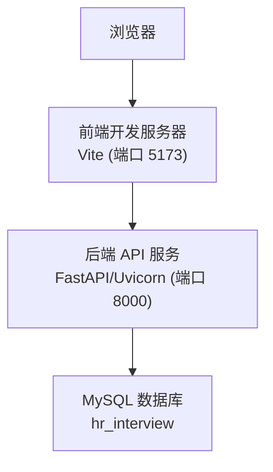
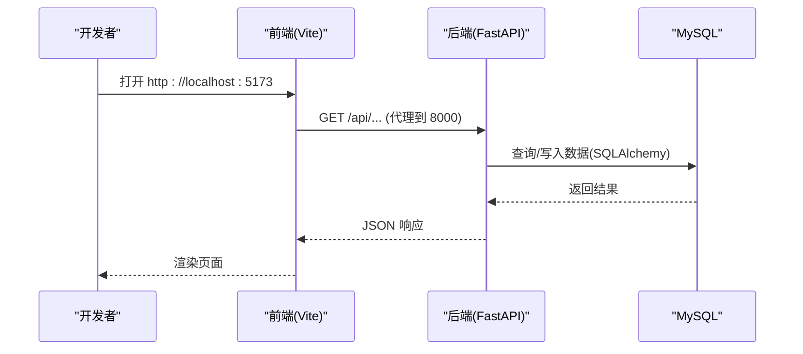
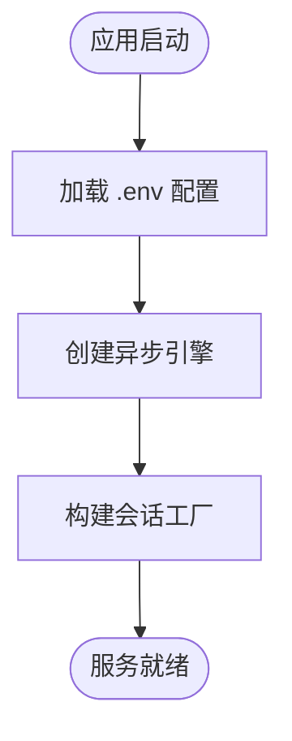
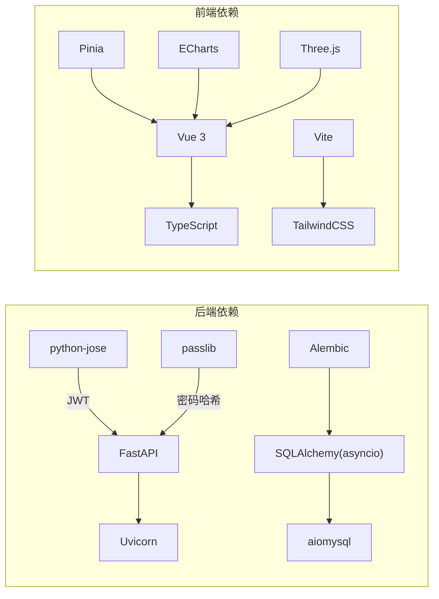

# 快速开始

<cite>
**本文引用的文件列表**
- [start.cmd](file://start.cmd)
- [backEnd/requirements.txt](file://backEnd/requirements.txt)
- [frontEnd/package.json](file://frontEnd/package.json)
- [hr_interview.sql](file://hr_interview.sql)
- [backEnd/app/config.py](file://backEnd/app/config.py)
- [backEnd/.env](file://backEnd/.env)
- [backEnd/alembic.ini](file://backEnd/alembic.ini)
- [backEnd/app/database.py](file://backEnd/app/database.py)
- [frontEnd/vite.config.ts](file://frontEnd/vite.config.ts)
</cite>

## 目录
1. [简介](#简介)
2. [项目结构](#项目结构)
3. [核心组件](#核心组件)
4. [架构总览](#架构总览)
5. [详细组件分析](#详细组件分析)
6. [依赖关系分析](#依赖关系分析)
7. [性能与运行建议](#性能与运行建议)
8. [故障排查指南](#故障排查指南)
9. [结论](#结论)
10. [附录：一键启动与手动启动](#附录一键启动与手动启动)

## 简介
本指南面向首次接触 HR XF 项目的开发者，目标是在 30 分钟内完成本地开发环境搭建并成功运行前后端服务。你将学会：
- 安装 Node.js、Python、MySQL 等前置依赖
- 初始化前后端环境与数据库
- 使用一键脚本或手动方式启动项目
- 验证前端页面与后端 API 是否可用
- 常见问题的定位与解决思路

## 项目结构
HR XF 采用前后端分离架构：
- 后端：FastAPI + SQLAlchemy 异步驱动 + Alembic 迁移 + MySQL
- 前端：Vue 3 + TypeScript + Vite + TailwindCSS
- 根目录提供一键启动脚本 start.cmd，自动拉起后端与前端

图表来源
- [start.cmd:14-31](file://start.cmd#L14-L31)
- [frontEnd/vite.config.ts:13-21](file://frontEnd/vite.config.ts#L13-L21)
- [backEnd/app/config.py:47-65](file://backEnd/app/config.py#L47-L65)

章节来源
- [start.cmd:1-36](file://start.cmd#L1-L36)
- [frontEnd/package.json:1-35](file://frontEnd/package.json#L1-L35)
- [backEnd/requirements.txt:1-27](file://backEnd/requirements.txt#L1-L27)

## 核心组件
- 后端配置与数据库连接
  - 配置加载：从 backEnd/.env 读取环境变量（数据库、JWT、CORS、Deepseek、编译器路径等）
  - 数据库引擎：SQLAlchemy 异步引擎，基于 aiomysql 连接 MySQL
  - Alembic：用于数据库迁移与版本管理
- 前端代理
  - Vite 将 /api 请求代理到后端 8000 端口，避免跨域问题

章节来源
- [backEnd/app/config.py:1-71](file://backEnd/app/config.py#L1-L71)
- [backEnd/.env:1-34](file://backEnd/.env#L1-L34)
- [backEnd/app/database.py:1-58](file://backEnd/app/database.py#L1-L58)
- [backEnd/alembic.ini:1-40](file://backEnd/alembic.ini#L1-L40)
- [frontEnd/vite.config.ts:1-22](file://frontEnd/vite.config.ts#L1-L22)

## 架构总览
下图展示了本地开发时各组件的交互关系：前端通过 Vite 开发服务器提供静态资源与热更新，并将 API 请求转发至后端；后端通过 SQLAlchemy 异步引擎访问 MySQL；Alembic 负责数据库结构变更。

图表来源
- [frontEnd/vite.config.ts:13-21](file://frontEnd/vite.config.ts#L13-L21)
- [backEnd/app/database.py:31-43](file://backEnd/app/database.py#L31-L43)

## 详细组件分析

### 后端配置与环境变量
- 配置文件位置：backEnd/app/config.py
- 环境变量文件：backEnd/.env
- 关键配置项
  - 数据库：host/port/user/password/name
  - JWT：密钥、算法、过期时间
  - CORS：允许的前端域名
  - Deepseek：可选的外部 AI 接口
  - 编译器路径：可选，用于代码执行功能

章节来源
- [backEnd/app/config.py:13-45](file://backEnd/app/config.py#L13-L45)
- [backEnd/.env:1-34](file://backEnd/.env#L1-L34)

### 数据库连接与迁移
- 连接方式：SQLAlchemy 异步引擎，使用 aiomysql 驱动
- 会话工厂：提供 AsyncSession 生命周期管理
- 迁移工具：Alembic，配置文件在 backEnd/alembic.ini

图表来源
- [backEnd/app/config.py:47-65](file://backEnd/app/config.py#L47-L65)
- [backEnd/app/database.py:31-43](file://backEnd/app/database.py#L31-L43)

章节来源
- [backEnd/app/database.py:1-58](file://backEnd/app/database.py#L1-L58)
- [backEnd/alembic.ini:1-40](file://backEnd/alembic.ini#L1-L40)

### 前端开发与代理
- 开发服务器：Vite，默认端口 5173
- 代理规则：/api 转发到 http://localhost:8000
- 包管理与脚本：package.json 中定义 dev/build/preview

章节来源
- [frontEnd/vite.config.ts:13-21](file://frontEnd/vite.config.ts#L13-L21)
- [frontEnd/package.json:6-10](file://frontEnd/package.json#L6-L10)

## 依赖关系分析
- 后端依赖（部分）
  - FastAPI、Uvicorn、Pydantic Settings
  - SQLAlchemy(asyncio)、aiomysql、pymysql、Alembic
  - python-jose、passlib、python-multipart、email-validator
  - httpx、PyMuPDF、edge-tts
- 前端依赖（部分）
  - Vue 3、TypeScript、Vite、TailwindCSS、Pinia、ECharts、Three.js 生态

图表来源
- [backEnd/requirements.txt:1-27](file://backEnd/requirements.txt#L1-L27)
- [frontEnd/package.json:11-33](file://frontEnd/package.json#L11-L33)

章节来源
- [backEnd/requirements.txt:1-27](file://backEnd/requirements.txt#L1-L27)
- [frontEnd/package.json:1-35](file://frontEnd/package.json#L1-L35)

## 性能与运行建议
- 数据库连接池：当前已设置 pool_size 与 max_overflow，可根据并发需求调整
- 日志与调试：可临时开启 SQLAlchemy echo 以观察 SQL 语句
- 前端代理：确保后端先于前端启动，避免代理失败

[本节为通用建议，不直接分析具体文件]

## 故障排查指南
- 无法连接数据库
  - 检查 backEnd/.env 中的 DB_HOST/DB_PORT/DB_USER/DB_PASSWORD/DB_NAME 是否与本地 MySQL 一致
  - 确认 MySQL 服务已启动且 hr_interview 数据库存在
- 端口占用
  - 后端默认 8000，前端默认 5173，若被占用请修改对应端口后重启
- 跨域错误
  - 检查 backEnd/.env 中 CORS_ORIGINS 是否包含前端地址（如 http://localhost:5173）
- 前端代理无效
  - 确认 vite.config.ts 中 /api 代理 target 指向 http://localhost:8000
- Alembic 迁移失败
  - 检查 alembic.ini 中的 sqlalchemy.url 是否正确指向 hr_interview 库

章节来源
- [backEnd/.env:1-34](file://backEnd/.env#L1-L34)
- [backEnd/app/config.py:31-37](file://backEnd/app/config.py#L31-37)
- [frontEnd/vite.config.ts:13-21](file://frontEnd/vite.config.ts#L13-L21)
- [backEnd/alembic.ini:1-10](file://backEnd/alembic.ini#L1-L10)

## 结论
按照本指南完成前置依赖安装、数据库初始化与前后端启动后，即可在本地完整运行 HR XF 项目。建议使用一键脚本快速启动，遇到问题时可参考故障排查章节逐项定位。

[本节为总结性内容，不直接分析具体文件]

## 附录：一键启动与手动启动

### 前置依赖安装
- Node.js
  - 安装 Node.js（推荐 LTS），并确保命令行可用 node 与 npm
- Python
  - 安装 Python 3.10+，推荐使用虚拟环境
- MySQL
  - 安装并启动 MySQL 服务，创建数据库 hr_interview，字符集 utf8mb4

### 数据库初始化
- 导入初始结构与示例数据
  - 使用 MySQL 客户端执行 hr_interview.sql 完成建库与数据导入
- 可选：使用 Alembic 进行迁移
  - 如需通过迁移管理表结构，请先修正 backEnd/alembic.ini 中的连接字符串，再执行相关迁移命令

章节来源
- [hr_interview.sql:1-200](file://hr_interview.sql#L1-L200)
- [backEnd/alembic.ini:1-10](file://backEnd/alembic.ini#L1-L10)

### 后端环境初始化
- 进入 backEnd 目录，创建并激活 Python 虚拟环境
- 安装依赖
  - 使用 requirements.txt 安装后端依赖
- 配置环境变量
  - 编辑 backEnd/.env，确保数据库、JWT、CORS 等配置正确
- 启动后端
  - 使用 uvicorn 启动 app.main:app，监听 127.0.0.1:8000

章节来源
- [backEnd/requirements.txt:1-27](file://backEnd/requirements.txt#L1-L27)
- [backEnd/.env:1-34](file://backEnd/.env#L1-L34)
- [start.cmd:14-18](file://start.cmd#L14-L18)

### 前端环境初始化
- 进入 frontEnd 目录
- 安装依赖
  - 使用 package.json 中的脚本安装依赖
- 启动前端
  - 运行开发模式，默认端口 5173，并通过代理访问后端

章节来源
- [frontEnd/package.json:6-10](file://frontEnd/package.json#L6-L10)
- [frontEnd/vite.config.ts:13-21](file://frontEnd/vite.config.ts#L13-L21)

### 一键启动
- 在项目根目录双击运行 start.cmd
- 脚本会依次启动后端与前端，并在浏览器中打开前端页面
- 控制台会显示前端与后端地址以及 Swagger 文档地址

章节来源
- [start.cmd:1-36](file://start.cmd#L1-L36)

### 验证安装成功
- 访问前端页面
  - 打开 http://localhost:5173，应能正常加载首页
- 调用后端 API
  - 访问 http://localhost:8000/docs，查看 Swagger 文档是否正常加载
  - 尝试调用一个公开接口（例如健康检查或基础信息接口），确认返回 JSON 响应

章节来源
- [start.cmd:28-31](file://start.cmd#L28-L31)