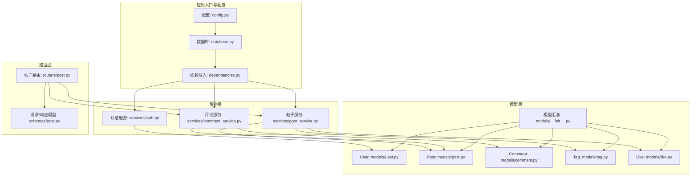
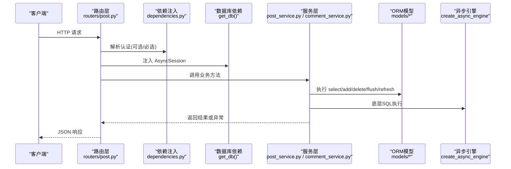
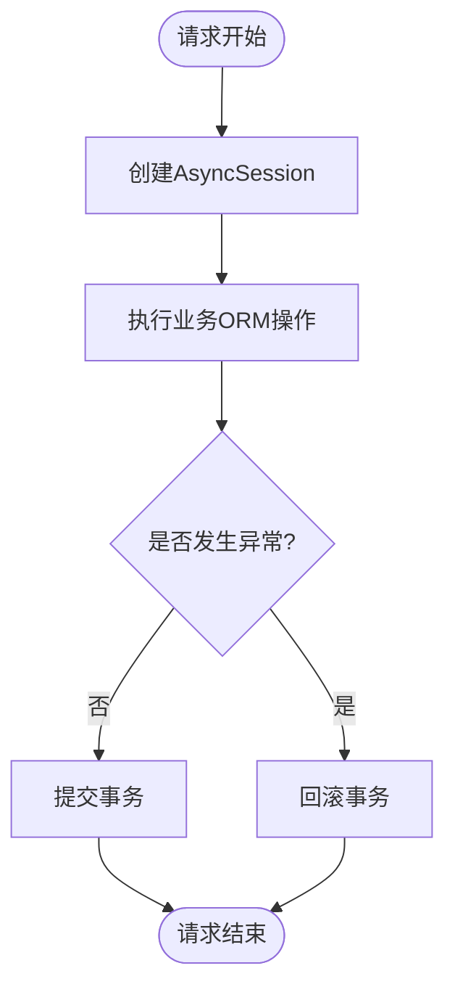
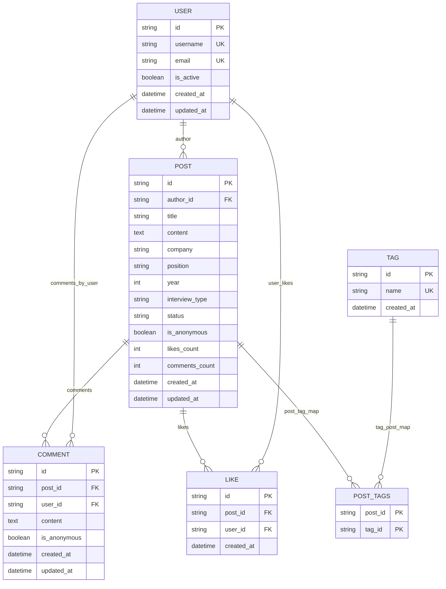
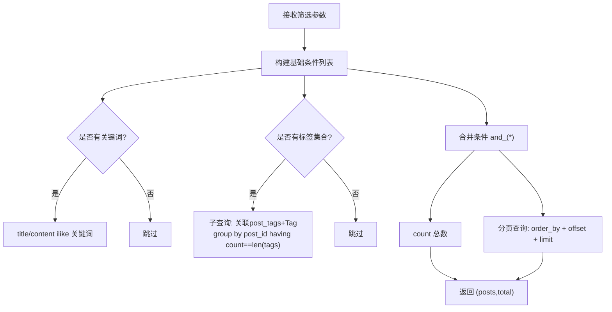
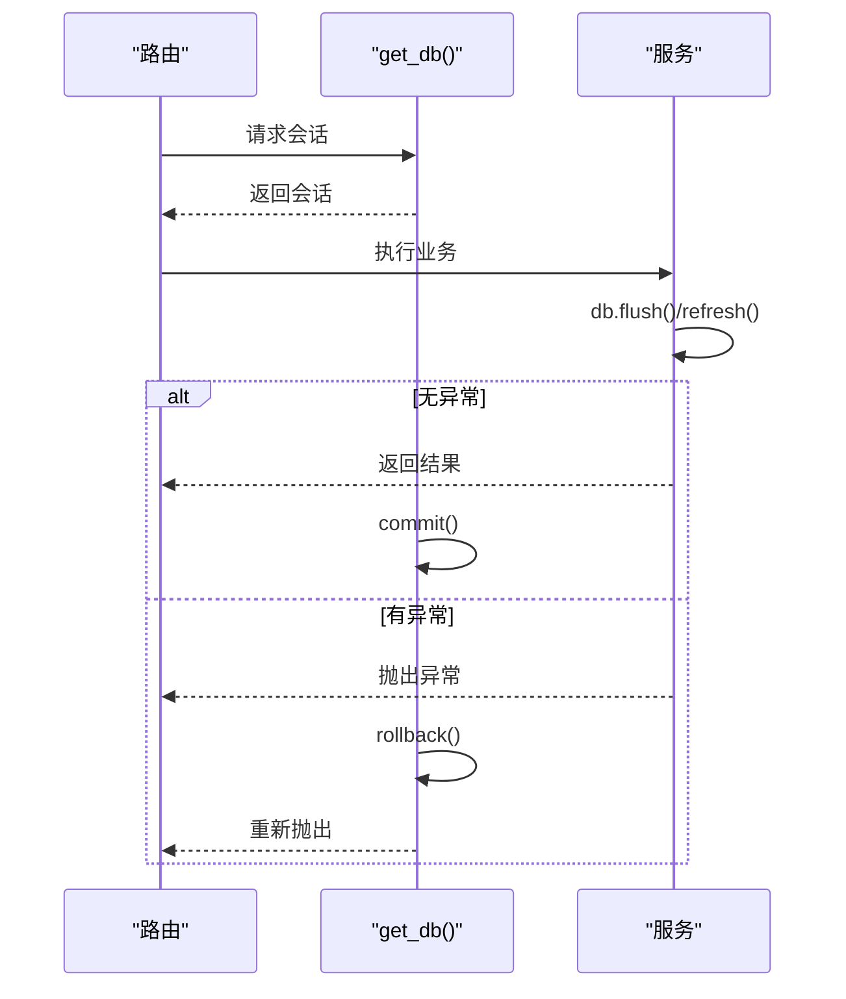
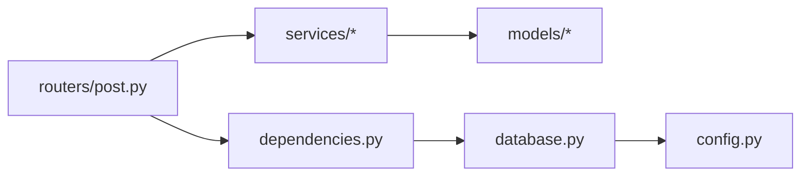

# ORM使用指南

<cite>
**本文引用的文件**   
- [database.py](file://backEnd/app/database.py)
- [config.py](file://backEnd/app/config.py)
- [dependencies.py](file://backEnd/app/dependencies.py)
- [models/__init__.py](file://backEnd/app/models/__init__.py)
- [models/user.py](file://backEnd/app/models/user.py)
- [models/post.py](file://backEnd/app/models/post.py)
- [models/comment.py](file://backEnd/app/models/comment.py)
- [models/tag.py](file://backEnd/app/models/tag.py)
- [models/like.py](file://backEnd/app/models/like.py)
- [services/auth.py](file://backEnd/app/services/auth.py)
- [services/post_service.py](file://backEnd/app/services/post_service.py)
- [services/comment_service.py](file://backEnd/app/services/comment_service.py)
- [routers/post.py](file://backEnd/app/routers/post.py)
- [schemas/post.py](file://backEnd/app/schemas/post.py)
</cite>

## 目录
1. [简介](#简介)
2. [项目结构](#项目结构)
3. [核心组件](#核心组件)
4. [架构总览](#架构总览)
5. [详细组件分析](#详细组件分析)
6. [依赖关系分析](#依赖关系分析)
7. [性能与优化](#性能与优化)
8. [故障排查指南](#故障排查指南)
9. [结论](#结论)
10. [附录：最佳实践清单](#附录最佳实践清单)

## 简介
本指南面向在 HR XF 后端项目中基于 SQLAlchemy 异步 ORM 进行数据访问的开发者。内容覆盖异步数据库连接配置、会话管理策略、模型定义与关系映射、CRUD 操作语法、复杂查询（过滤、排序、分页、聚合）、事务处理与错误恢复、批量操作优化、缓存与查询优化思路，以及常见反模式与规避方法，并附带可落地的最佳实践与示例路径。

## 项目结构
本项目采用分层组织：路由层负责请求解析与响应封装；服务层承载业务逻辑与 ORM 调用；模型层定义表结构与关系；配置与依赖注入提供数据库引擎与会话生命周期管理。

图表来源
- [config.py:47-61](file://backEnd/app/config.py#L47-L61)
- [database.py:31-43](file://backEnd/app/database.py#L31-L43)
- [dependencies.py:13-40](file://backEnd/app/dependencies.py#L13-L40)
- [models/user.py:10-45](file://backEnd/app/models/user.py#L10-L45)
- [models/post.py:18-65](file://backEnd/app/models/post.py#L18-L65)
- [models/comment.py:17-53](file://backEnd/app/models/comment.py#L17-L53)
- [models/tag.py:18-46](file://backEnd/app/models/tag.py#L18-L46)
- [models/like.py:16-47](file://backEnd/app/models/like.py#L16-L47)
- [services/auth.py:13-96](file://backEnd/app/services/auth.py#L13-L96)
- [services/post_service.py:70-166](file://backEnd/app/services/post_service.py#L70-L166)
- [services/comment_service.py:28-105](file://backEnd/app/services/comment_service.py#L28-L105)
- [routers/post.py:52-176](file://backEnd/app/routers/post.py#L52-L176)
- [schemas/post.py:11-91](file://backEnd/app/schemas/post.py#L11-L91)

章节来源
- [config.py:1-71](file://backEnd/app/config.py#L1-71)
- [database.py:1-58](file://backEnd/app/database.py#L1-58)
- [dependencies.py:1-41](file://backEnd/app/dependencies.py#L1-41)
- [models/__init__.py:1-12](file://backEnd/app/models/__init__.py#L1-12)

## 核心组件
- 异步引擎与会话工厂：通过 create_async_engine 创建异步引擎，并使用 async_sessionmaker 生成 AsyncSession 工厂，设置 expire_on_commit=False 避免提交后自动过期导致的二次加载问题。
- 依赖注入 get_db：FastAPI 依赖项，以 async with 方式获取会话，确保异常时回滚，正常时提交。
- 配置中心 Settings：集中管理数据库 URL、CORS、第三方 API 等，提供 database_url 属性用于构建异步连接字符串。
- 模型基类 Base：DeclarativeBase 子类，供所有模型继承。
- 用户、帖子、评论、标签、点赞模型：定义了字段、约束、索引、外键与关系，体现一对多、多对一等关系建模。

章节来源
- [database.py:31-58](file://backEnd/app/database.py#L31-L58)
- [config.py:47-61](file://backEnd/app/config.py#L47-L61)
- [models/user.py:10-45](file://backEnd/app/models/user.py#L10-L45)
- [models/post.py:18-65](file://backEnd/app/models/post.py#L18-L65)
- [models/comment.py:17-53](file://backEnd/app/models/comment.py#L17-L53)
- [models/tag.py:18-46](file://backEnd/app/models/tag.py#L18-L46)
- [models/like.py:16-47](file://backEnd/app/models/like.py#L16-L47)

## 架构总览
下图展示了从 FastAPI 路由到数据库的完整调用链，包括可选认证、会话注入、服务层 ORM 调用与响应转换。

图表来源
- [routers/post.py:52-176](file://backEnd/app/routers/post.py#L52-L176)
- [dependencies.py:13-40](file://backEnd/app/dependencies.py#L13-L40)
- [database.py:50-58](file://backEnd/app/database.py#L50-L58)
- [services/post_service.py:96-166](file://backEnd/app/services/post_service.py#L96-L166)
- [services/comment_service.py:55-105](file://backEnd/app/services/comment_service.py#L55-L105)

## 详细组件分析

### 异步数据库连接与会话管理
- 连接参数：使用 aiomysql 驱动，开启 pool_pre_ping 检测连接健康，设置 pool_size 与 max_overflow 控制连接池规模。
- 会话工厂：expire_on_commit=False 保证提交后仍可读取已持久化对象，减少重复查询。
- 依赖注入 get_db：
  - 进入请求时创建会话；
  - yield 给调用方使用；
  - 成功路径 commit；
  - 异常路径 rollback 并抛出异常，确保事务一致性。

图表来源
- [database.py:31-58](file://backEnd/app/database.py#L31-L58)

章节来源
- [database.py:31-58](file://backEnd/app/database.py#L31-L58)
- [config.py:47-61](file://backEnd/app/config.py#L47-L61)

### 模型定义与关系映射
- User：主键为 UUID 字符串，包含个人资料字段与时间戳；username/email 唯一且建索引。
- Post：外键关联 User，结构化字段 company/position/year/interview_type/status 均建索引；likes_count/comments_count 作为冗余计数字段便于快速展示。
- Comment：外键关联 Post 与 User，支持匿名评论。
- Tag 与 post_tags：多对多中间表，含唯一约束防止重复关联。
- Like：复合唯一约束 (post_id, user_id)，防止重复点赞。

图表来源
- [models/user.py:10-45](file://backEnd/app/models/user.py#L10-L45)
- [models/post.py:18-65](file://backEnd/app/models/post.py#L18-L65)
- [models/comment.py:17-53](file://backEnd/app/models/comment.py#L17-53)
- [models/tag.py:18-46](file://backEnd/app/models/tag.py#L18-46)
- [models/like.py:16-47](file://backEnd/app/models/like.py#L16-47)

章节来源
- [models/user.py:10-45](file://backEnd/app/models/user.py#L10-L45)
- [models/post.py:18-65](file://backEnd/app/models/post.py#L18-L65)
- [models/comment.py:17-53](file://backEnd/app/models/comment.py#L17-53)
- [models/tag.py:18-46](file://backEnd/app/models/tag.py#L18-46)
- [models/like.py:16-47](file://backEnd/app/models/like.py#L16-47)

### CRUD 操作与ORM语法
- 创建实例：构造模型对象，db.add() 加入会话，db.flush() 写入数据库并回填ID，db.refresh() 刷新状态。
- 更新实例：直接修改属性后 flush/refresh，或使用 model_dump(exclude_unset=True) 动态更新。
- 删除实例：db.delete(obj) 后 flush。
- 查询单条：select(Model).where(...) + db.execute + scalar_one_or_none()。
- 查询列表：select(Model).where(...).order_by(...).offset(...).limit(...) + scalars().all()。
- 计数与聚合：func.count(...) 配合 group_by/having/order_by 实现统计。

章节来源
- [services/auth.py:38-82](file://backEnd/app/services/auth.py#L38-L82)
- [services/auth.py:99-108](file://backEnd/app/services/auth.py#L99-L108)
- [services/post_service.py:70-93](file://backEnd/app/services/post_service.py#L70-L93)
- [services/post_service.py:169-186](file://backEnd/app/services/post_service.py#L169-L186)
- [services/comment_service.py:28-52](file://backEnd/app/services/comment_service.py#L28-52)

### 复杂查询：过滤、排序、分页、聚合
- 组合过滤：将多个条件追加到 conditions 列表，最后用 and_(*conditions) 拼接。
- 模糊搜索：使用 ilike 进行大小写不敏感匹配。
- 多对多筛选：通过子查询 join 中间表，group_by + having count == 期望数量实现“同时具备全部标签”的筛选。
- 排序：latest 按 created_at desc；hottest 按 likes_count desc 再 created_at desc。
- 分页：offset((page-1)*size), limit(size)。
- 聚合统计：按标签分组计数，降序取 Top N。

图表来源
- [services/post_service.py:96-166](file://backEnd/app/services/post_service.py#L96-L166)

章节来源
- [services/post_service.py:96-166](file://backEnd/app/services/post_service.py#L96-L166)
- [services/post_service.py:226-236](file://backEnd/app/services/post_service.py#L226-L236)

### 事务处理与错误恢复
- 会话级事务：get_db 中 try/except 包裹 yield，异常时 rollback 并向上抛出，保证原子性。
- 显式 flush/refresh：在需要立即获取自增ID或触发 onupdate/server_default 时使用。
- 业务异常：如权限不足、资源不存在等，在服务层抛出 ValueError/PermissionError，路由层转换为 HTTP 状态码。

图表来源
- [database.py:50-58](file://backEnd/app/database.py#L50-L58)
- [routers/post.py:147-176](file://backEnd/app/routers/post.py#L147-L176)

章节来源
- [database.py:50-58](file://backEnd/app/database.py#L50-L58)
- [routers/post.py:147-176](file://backEnd/app/routers/post.py#L147-L176)

### 批量操作与性能优化技巧
- 批量插入：多次 db.add() 后统一 db.flush()，减少往返次数。
- 预加载关系：relationship(lazy="selectin") 避免 N+1 查询；按需使用 lazy="noload" 降低无关负载。
- 只读优化：expire_on_commit=False 避免提交后再次加载导致额外查询。
- 索引设计：对外键、常用筛选字段建立索引（company/position/year/status 等）。
- 聚合与去重：使用 func.count/group_by/distinct 减少应用层计算。
- 大对象懒加载：comments/likes 默认 noload，仅在详情时按需加载。

章节来源
- [models/post.py:60-65](file://backEnd/app/models/post.py#L60-L65)
- [models/comment.py:50-53](file://backEnd/app/models/comment.py#L50-53)
- [models/like.py:16-47](file://backEnd/app/models/like.py#L16-47)
- [database.py:39-43](file://backEnd/app/database.py#L39-L43)

### 缓存策略与查询优化方法
- 应用层缓存：对热点数据（如筛选器选项、热门标签）增加内存缓存或外部缓存（Redis），降低数据库压力。
- 查询裁剪：仅选择必要字段，避免 SELECT *。
- 预计算字段：likes_count/comments_count 冗余字段提升列表页性能。
- 分库分表与读写分离：随数据量增长考虑水平拆分与只读副本。

[本节为通用建议，不直接分析具体文件]

### 常见ORM反模式与避免方法
- N+1 查询：循环内逐条查询关联对象。避免：使用 selectin/noload 或 JOIN 子查询。
- 过度 eager loading：对所有关系都 selectin，导致单次查询过大。避免：按需加载。
- 未使用索引：频繁筛选字段未建索引。避免：为高频条件列加索引。
- 在事务中做耗时IO：阻塞会话。避免：将网络IO移出事务或在事务外完成。
- 忘记 flush/refresh：未获取到自增ID或 server_default 值。避免：必要时显式 flush/refresh。

[本节为通用建议，不直接分析具体文件]

## 依赖关系分析
- 路由依赖 get_current_user 与 get_db，前者校验JWT并返回当前用户，后者提供会话。
- 服务层依赖模型与 Pydantic Schema，负责组装查询与业务规则。
- 配置模块提供数据库URL，数据库模块创建引擎与会话工厂。

图表来源
- [routers/post.py:1-21](file://backEnd/app/routers/post.py#L1-L21)
- [dependencies.py:1-41](file://backEnd/app/dependencies.py#L1-41)
- [database.py:1-58](file://backEnd/app/database.py#L1-58)
- [config.py:1-71](file://backEnd/app/config.py#L1-71)

章节来源
- [routers/post.py:1-21](file://backEnd/app/routers/post.py#L1-L21)
- [dependencies.py:1-41](file://backEnd/app/dependencies.py#L1-41)
- [database.py:1-58](file://backEnd/app/database.py#L1-58)
- [config.py:1-71](file://backEnd/app/config.py#L1-71)

## 性能与优化
- 连接池：合理设置 pool_size 与 max_overflow，结合 pool_pre_ping 保障稳定性。
- 查询优化：优先使用索引列过滤，避免函数包裹列名导致索引失效；合理使用 ilike 并注意前缀通配符的影响。
- 关系加载：根据场景选择 selectin/noload/joinedload，避免不必要的关联加载。
- 分页：限制 size 上限，避免一次性拉取过多数据。
- 聚合：尽量在数据库侧完成统计，减少应用层计算。

[本节为通用建议，不直接分析具体文件]

## 故障排查指南
- 连接异常：检查数据库URL、账号密码、端口与防火墙；确认 pool_pre_ping 生效。
- 会话未提交：确认 get_db 的异常分支是否正确 rollback；业务异常是否被捕获并正确传播。
- 权限错误：删除接口需作者本人，注意 PermissionError 的处理与HTTP状态码映射。
- 资源不存在：查询结果为空时返回 404，避免返回空对象导致前端误判。
- 重复操作：点赞与标签关联存在唯一约束，注意冲突时的处理逻辑。

章节来源
- [routers/post.py:147-176](file://backEnd/app/routers/post.py#L147-L176)
- [services/post_service.py:176-209](file://backEnd/app/services/post_service.py#L176-L209)
- [services/comment_service.py:82-105](file://backEnd/app/services/comment_service.py#L82-L105)

## 结论
HR XF 的 ORM 使用遵循清晰的层次划分与良好的异步会话管理实践。通过合理的索引设计、关系加载策略与聚合查询，系统在可读性与性能之间取得平衡。建议在后续迭代中引入更完善的缓存层与监控指标，进一步提升高并发下的稳定性与响应速度。

[本节为总结性内容，不直接分析具体文件]

## 附录：最佳实践清单
- 使用 async_sessionmaker 并设置 expire_on_commit=False。
- 通过 get_db 依赖注入会话，确保异常时回滚。
- 对外键与高频筛选字段建立索引。
- 使用 selectin/noload 控制关系加载，避免 N+1。
- 在路由层将业务异常映射为合适的 HTTP 状态码。
- 对热点数据进行应用层缓存，减轻数据库压力。
- 使用 Pydantic Schema 明确输入输出结构，提高可维护性。

[本节为通用建议，不直接分析具体文件]