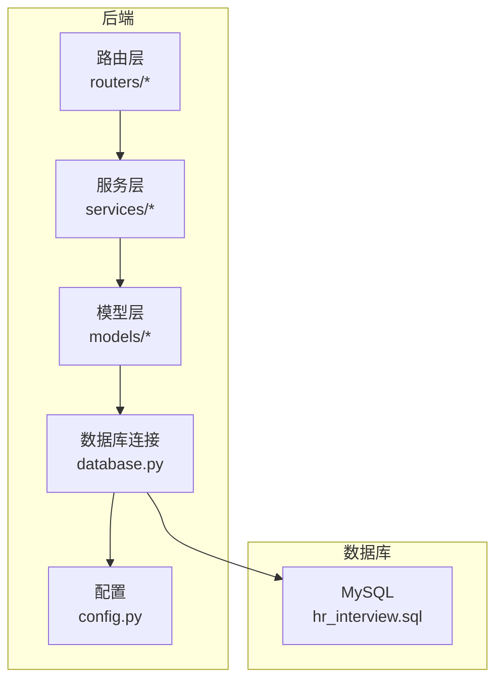
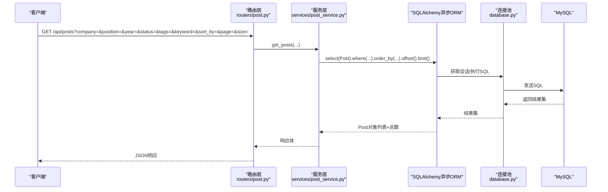
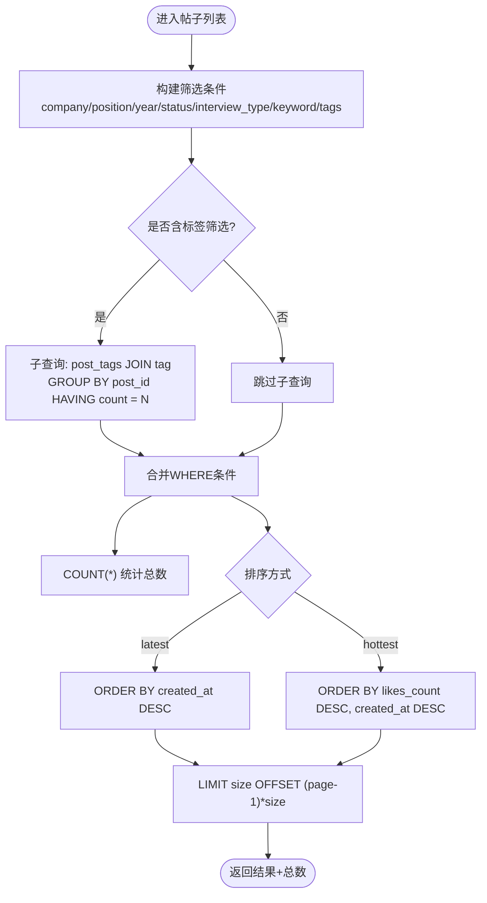
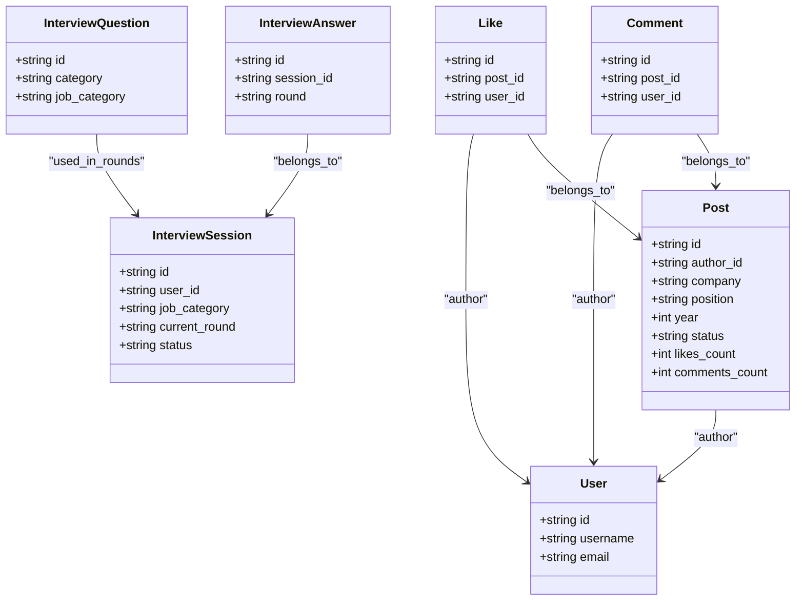

# 性能优化策略

<cite>
**本文引用的文件列表**
- [database.py](file://backEnd/app/database.py)
- [config.py](file://backEnd/app/config.py)
- [hr_interview.sql](file://hr_interview.sql)
- [models/__init__.py](file://backEnd/app/models/__init__.py)
- [models/user.py](file://backEnd/app/models/user.py)
- [models/post.py](file://backEnd/app/models/post.py)
- [models/comment.py](file://backEnd/app/models/comment.py)
- [models/like.py](file://backEnd/app/models/like.py)
- [models/interview.py](file://backEnd/app/models/interview.py)
- [routers/post.py](file://backEnd/app/routers/post.py)
- [services/post_service.py](file://backEnd/app/services/post_service.py)
- [services/interview_service.py](file://backEnd/app/services/interview_service.py)
</cite>

## 目录
1. [引言](#引言)
2. [项目结构](#项目结构)
3. [核心组件](#核心组件)
4. [架构总览](#架构总览)
5. [详细组件分析](#详细组件分析)
6. [依赖关系分析](#依赖关系分析)
7. [性能考量与调优建议](#性能考量与调优建议)
8. [故障排查指南](#故障排查指南)
9. [结论](#结论)
10. [附录](#附录)

## 引言
本文件面向HR XF项目的数据库性能优化，围绕索引设计与优化、查询分析与慢查询治理、连接池配置与资源管理、大数据量分页与查询优化、缓存策略（应用层与数据库层）、分库分表考虑、监控指标与工具使用等方面提供系统化实践指南。文档基于仓库现有代码与SQL定义进行分析，并给出可落地的优化建议与图示说明。

## 项目结构
后端采用FastAPI + SQLAlchemy异步ORM + MySQL的架构。数据模型集中在app/models下，服务逻辑在app/services，路由在app/routers，数据库连接与引擎在app/database，配置在app/config。数据库DDL与初始数据在hr_interview.sql中。

图表来源
- [database.py:31-37](file://backEnd/app/database.py#L31-L37)
- [config.py:47-61](file://backEnd/app/config.py#L47-L61)
- [hr_interview.sql:1-120](file://hr_interview.sql#L1-L120)

章节来源
- [database.py:1-58](file://backEnd/app/database.py#L1-L58)
- [config.py:1-71](file://backEnd/app/config.py#L1-L71)
- [hr_interview.sql:1-120](file://hr_interview.sql#L1-L120)

## 核心组件
- 数据库连接与连接池：通过create_async_engine创建异步引擎，设置pool_size、max_overflow、pool_pre_ping等参数；提供get_db依赖注入会话生命周期。
- 配置中心：集中管理数据库URL、字符集等，支持同步/异步两种URL生成。
- 数据模型：用户、帖子、评论、点赞、面试会话/题目/答案等，均定义了主键、外键及必要索引。
- 服务与路由：帖子列表接口实现多条件筛选、标签组合过滤、排序与分页；面试服务包含题库、评分、AI对话等复杂流程。

章节来源
- [database.py:31-58](file://backEnd/app/database.py#L31-L58)
- [config.py:47-61](file://backEnd/app/config.py#L47-L61)
- [models/user.py:10-45](file://backEnd/app/models/user.py#L10-L45)
- [models/post.py:18-65](file://backEnd/app/models/post.py#L18-L65)
- [models/comment.py:17-53](file://backEnd/app/models/comment.py#L17-L53)
- [models/like.py:16-47](file://backEnd/app/models/like.py#L16-L47)
- [models/interview.py:19-114](file://backEnd/app/models/interview.py#L19-L114)
- [routers/post.py:63-105](file://backEnd/app/routers/post.py#L63-L105)
- [services/post_service.py:96-166](file://backEnd/app/services/post_service.py#L96-L166)

## 架构总览
从请求到数据库的关键路径如下：

图表来源
- [routers/post.py:63-105](file://backEnd/app/routers/post.py#L63-L105)
- [services/post_service.py:96-166](file://backEnd/app/services/post_service.py#L96-L166)
- [database.py:31-58](file://backEnd/app/database.py#L31-L58)

## 详细组件分析

### 索引设计与优化策略
- 单列索引
  - 用户表：username、email已建唯一索引，适合登录与账号查找。
  - 帖子表：company、position、year、status、author_id均有索引，利于按公司/岗位/年份/状态/作者筛选。
  - 评论表：post_id、user_id有索引，便于按帖子或用户聚合。
  - 点赞表：post_id、user_id有索引，且存在(post_id, user_id)唯一约束，避免重复点赞。
  - 面试相关：interview_sessions.user_id、status；interview_questions.category、job_category；interview_answers.session_id均有索引。
- 复合索引
  - 点赞表已有(post_id, user_id)唯一索引，天然覆盖“是否点赞过”的查询。
  - 建议为高频组合查询增加复合索引，例如：
    - posts(status, created_at)用于“热门/最新”排序下的状态过滤。
    - posts(company, position, year)用于常见筛选组合。
    - comments(post_id, created_at)用于按帖子分页评论。
- 全文索引
  - 当前关键词搜索使用LIKE %keyword%（不命中普通B+树索引），建议在title/content上建立全文索引以加速模糊匹配。
- 选择原则
  - 优先为高选择性字段和常用WHERE/JOIN/ORDER BY字段加索引。
  - 控制索引数量，避免写放大；对频繁更新的列谨慎加索引。
  - 利用覆盖索引减少回表。

章节来源
- [hr_interview.sql:1-200](file://hr_interview.sql#L1-L200)
- [models/post.py:36-44](file://backEnd/app/models/post.py#L36-L44)
- [models/comment.py:25-36](file://backEnd/app/models/comment.py#L25-L36)
- [models/like.py:18-38](file://backEnd/app/models/like.py#L18-L38)
- [models/interview.py:31-42](file://backEnd/app/models/interview.py#L31-L42)
- [models/interview.py:72-74](file://backEnd/app/models/interview.py#L72-L74)
- [models/interview.py:96-101](file://backEnd/app/models/interview.py#L96-L101)

### 查询性能分析与慢查询优化方法
- 帖子列表查询
  - 多条件筛选：company/position/year/status/interview_type/tag_names/keyword。
  - 标签筛选通过子查询+HAVING COUNT等于标签数，确保“同时具备所有标签”。
  - 排序：latest按created_at desc；hottest按likes_count desc再created_at desc。
  - 分页：offset/limit。
- 优化建议
  - 将status与排序字段组合为复合索引，如(status, created_at)，提升过滤+排序性能。
  - 对热门排序likes_count+created_at建立复合索引，避免文件排序。
  - 关键词搜索改用全文索引或引入搜索引擎（如Elasticsearch）。
  - 标签筛选的IN+GROUP BY+HAVING在高基数时开销较大，可考虑物化标签统计或预计算。
  - 大偏移分页（deep pagination）建议使用游标分页（基于id或时间戳）替代offset/limit。

图表来源
- [services/post_service.py:96-166](file://backEnd/app/services/post_service.py#L96-L166)

章节来源
- [routers/post.py:63-105](file://backEnd/app/routers/post.py#L63-L105)
- [services/post_service.py:96-166](file://backEnd/app/services/post_service.py#L96-L166)

### 连接池配置与资源管理策略
- 连接池参数
  - pool_size=10：基础连接数。
  - max_overflow=20：最大溢出连接数。
  - pool_pre_ping=True：每次使用前探测连接有效性，兼容aiomysql ping签名差异。
- 会话管理
  - async_sessionmaker配置expire_on_commit=False，减少不必要的刷新。
  - get_db依赖注入确保每个请求拥有独立会话，异常时自动回滚。
- 调优建议
  - 根据并发QPS与CPU核数调整pool_size与max_overflow。
  - 针对长事务或批量写入场景适当提高连接上限。
  - 监控连接等待与超时，结合慢查询日志定位瓶颈。

章节来源
- [database.py:31-58](file://backEnd/app/database.py#L31-L58)
- [config.py:47-61](file://backEnd/app/config.py#L47-L61)

### 大数据量场景下的分页与查询优化技巧
- 游标分页：用last_id或last_time作为起点，避免深分页带来的OFFSET开销。
- 只取必要字段：在服务层明确select列，减少网络传输与ORM映射成本。
- 预聚合与冗余计数：likes_count、comments_count已冗余，避免实时COUNT。
- 热点数据缓存：帖子列表、标签统计、筛选选项可缓存至Redis。
- 读写分离：读多写少场景可引入只读副本，降低主库压力。

章节来源
- [services/post_service.py:226-249](file://backEnd/app/services/post_service.py#L226-L249)
- [models/post.py:47-48](file://backEnd/app/models/post.py#L47-L48)

### 缓存策略的实现（应用层与数据库层）
- 应用层缓存
  - 推荐缓存项：热门标签统计、筛选器选项、帖子列表首屏、用户点赞状态集合。
  - 缓存键设计：按筛选维度+分页参数+用户ID（点赞态）组合。
  - 失效策略：发布/删除/点赞变更时主动失效或TTL过期。
- 数据库层缓存
  - InnoDB Buffer Pool：合理设置innodb_buffer_pool_size，使热点表与索引常驻内存。
  - 查询缓存：MySQL 8.0已移除查询缓存，不建议启用。
  - 预加载与延迟加载：按需加载关联数据，避免N+1问题。

章节来源
- [services/post_service.py:226-249](file://backEnd/app/services/post_service.py#L226-L249)
- [routers/post.py:108-128](file://backEnd/app/routers/post.py#L108-L128)

### 数据库分库分表的考虑因素
- 垂直拆分：按业务域拆库（如论坛、面试、OJ），降低单库复杂度。
- 水平拆分：按用户ID哈希或范围分片，解决单表膨胀与热点访问。
- 全局ID：继续使用UUID，但注意其随机性导致索引碎片，可考虑雪花算法或有序前缀。
- 跨分片查询：尽量避免跨库JOIN，使用应用层聚合或宽表冗余。
- 迁移与一致性：使用双写+灰度切换，保证平滑迁移与数据一致性。

[本节为概念性内容，无需源码引用]

## 依赖关系分析
- 路由层依赖服务层，服务层依赖模型层与数据库连接。
- 模型间关系：Post-Comment、Post-Like、InterviewSession-InterviewAnswer等，均通过外键与索引支撑高效查询。
- 潜在循环依赖：模型__init__.py统一导出，避免直接循环导入。

图表来源
- [models/user.py:10-45](file://backEnd/app/models/user.py#L10-L45)
- [models/post.py:18-65](file://backEnd/app/models/post.py#L18-L65)
- [models/comment.py:17-53](file://backEnd/app/models/comment.py#L17-L53)
- [models/like.py:16-47](file://backEnd/app/models/like.py#L16-L47)
- [models/interview.py:19-114](file://backEnd/app/models/interview.py#L19-L114)

章节来源
- [models/__init__.py:1-12](file://backEnd/app/models/__init__.py#L1-L12)

## 性能考量与调优建议
- 索引层面
  - 为posts(status, created_at)、posts(company, position, year)等高频组合添加复合索引。
  - 为comments(post_id, created_at)建立复合索引，优化评论分页。
  - 关键词搜索引入全文索引或外部搜索引擎。
- 查询层面
  - 避免SELECT *，仅选取必要字段。
  - 使用覆盖索引减少回表。
  - 大偏移分页改为游标分页。
- 连接池与资源
  - 根据压测结果调整pool_size与max_overflow。
  - 开启pool_pre_ping保障连接健康。
- 缓存层面
  - 热点数据（标签统计、筛选选项、帖子列表首屏）缓存至Redis。
  - 合理设置TTL与失效策略。
- 架构层面
  - 读写分离、分库分表、消息队列削峰等策略按需引入。

[本节为通用指导，无需源码引用]

## 故障排查指南
- 连接池相关问题
  - 现象：连接超时、连接泄漏。
  - 排查：检查pool_size/max_overflow是否过小；确认get_db是否正确释放会话；观察pool_pre_ping是否生效。
- 慢查询定位
  - 现象：接口RT升高。
  - 排查：开启MySQL慢查询日志；使用EXPLAIN分析关键SQL；关注全表扫描与临时表/文件排序。
- 标签筛选性能
  - 现象：带多个标签时查询变慢。
  - 排查：评估子查询+GROUP BY+HAVING的成本；考虑预计算标签热度或引入搜索引擎。
- 点赞冲突与一致性
  - 现象：重复点赞或计数不一致。
  - 排查：确认唯一约束(uq_like_post_user)生效；检查toggle_like逻辑的事务边界。

章节来源
- [database.py:31-58](file://backEnd/app/database.py#L31-L58)
- [services/post_service.py:189-224](file://backEnd/app/services/post_service.py#L189-L224)
- [hr_interview.sql:1-200](file://hr_interview.sql#L1-L200)

## 结论
通过对索引设计、查询模式、连接池与缓存的综合优化，HR XF可在中等规模数据量下获得稳定性能。随着数据增长，应逐步引入全文检索、读写分离与分库分表等架构能力，并结合监控与压测持续迭代优化。

[本节为总结性内容，无需源码引用]

## 附录
- 关键SQL与索引清单（节选）
  - posts：主键id；索引company、position、year、status、author_id。
  - comments：主键id；索引post_id、user_id。
  - likes：主键id；唯一约束(post_id, user_id)；索引post_id、user_id。
  - interview_sessions：主键id；索引user_id、status。
  - interview_questions：主键id；索引category、job_category。
  - interview_answers：主键id；索引session_id。
- 建议新增索引
  - posts(status, created_at)
  - posts(company, position, year)
  - comments(post_id, created_at)
  - posts(title, content)全文索引（或引入ES）

章节来源
- [hr_interview.sql:1-200](file://hr_interview.sql#L1-L200)