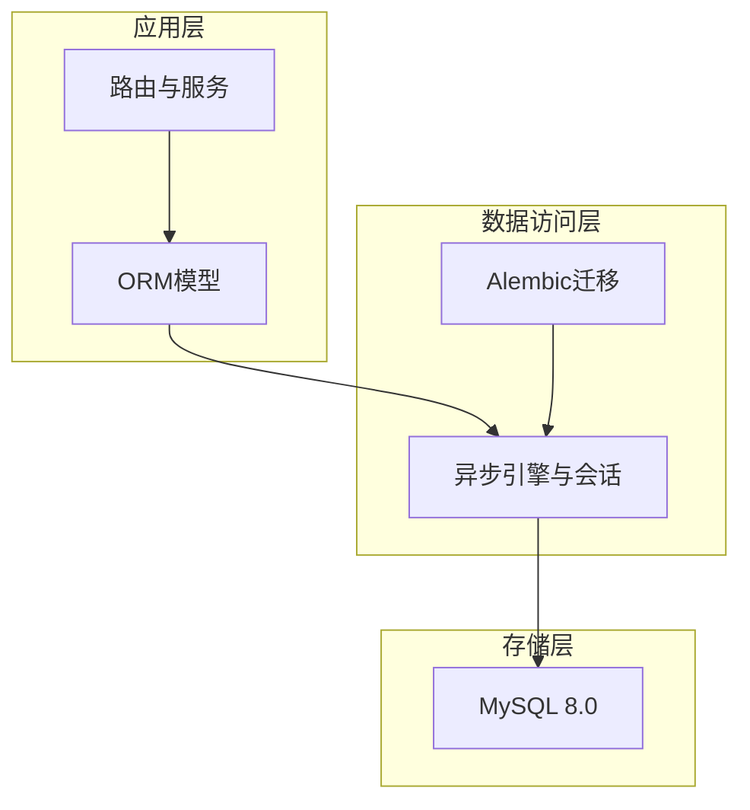
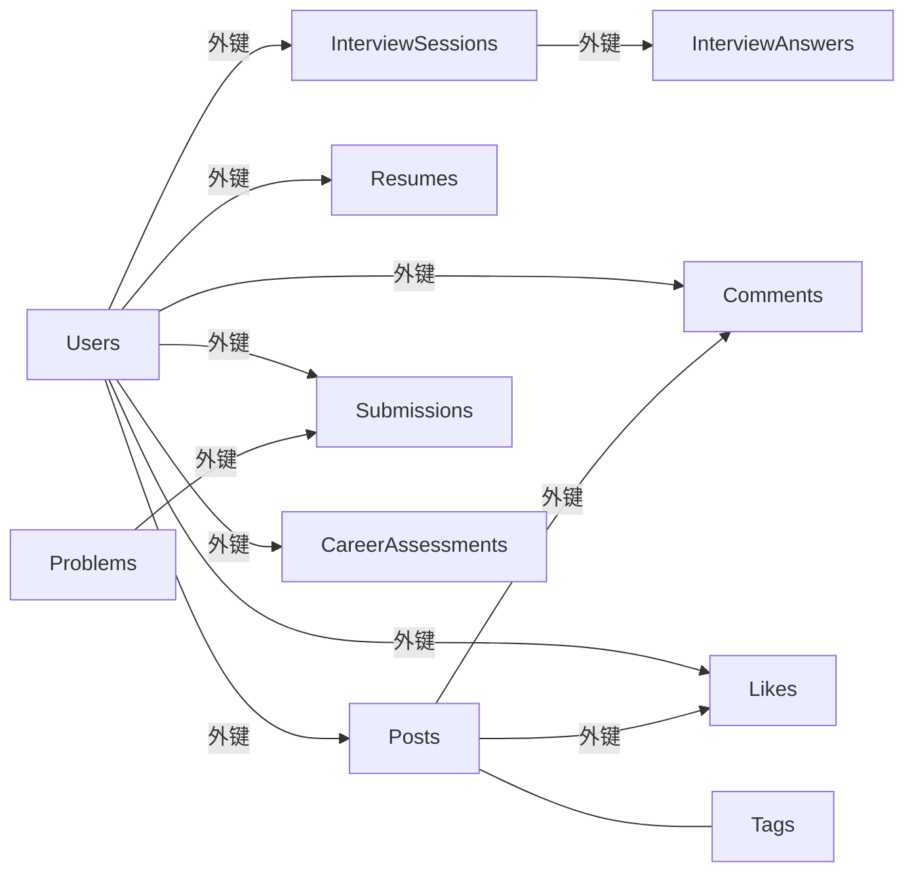
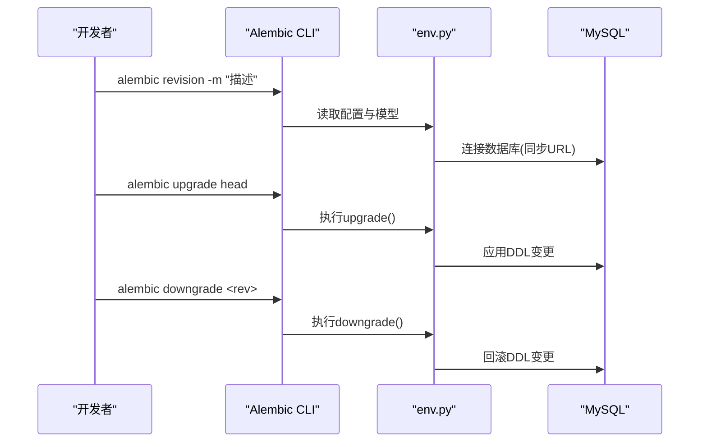

# 数据库设计

<cite>
**本文引用的文件**   
- [backEnd/app/database.py](file://backEnd/app/database.py)
- [backEnd/alembic.ini](file://backEnd/alembic.ini)
- [backEnd/alembic/env.py](file://backEnd/alembic/env.py)
- [backEnd/alembic/versions/01c4bed47451_add_interview_mode_and_target_round_to_.py](file://backEnd/alembic/versions/01c4bed47451_add_interview_mode_and_target_round_to_.py)
- [backEnd/alembic/versions/15585e6a3708_add_recommendation_to_career_assessments.py](file://backEnd/alembic/versions/15585e6a3708_add_recommendation_to_career_assessments.py)
- [backEnd/app/models/user.py](file://backEnd/app/models/user.py)
- [backEnd/app/models/interview.py](file://backEnd/app/models/interview.py)
- [backEnd/app/models/problem.py](file://backEnd/app/models/problem.py)
- [backEnd/app/models/resume.py](file://backEnd/app/models/resume.py)
- [backEnd/app/models/post.py](file://backEnd/app/models/post.py)
- [backEnd/app/models/career.py](file://backEnd/app/models/career.py)
- [backEnd/app/models/comment.py](file://backEnd/app/models/comment.py)
- [backEnd/app/models/like.py](file://backEnd/app/models/like.py)
- [backEnd/app/models/tag.py](file://backEnd/app/models/tag.py)
- [hr_interview.sql](file://hr_interview.sql)
</cite>

## 目录
1. [引言](#引言)
2. [项目结构](#项目结构)
3. [核心组件](#核心组件)
4. [架构总览](#架构总览)
5. [详细组件分析](#详细组件分析)
6. [依赖关系分析](#依赖关系分析)
7. [性能考虑](#性能考虑)
8. [故障排查指南](#故障排查指南)
9. [结论](#结论)
10. [附录](#附录)

## 引言
本文件面向HR XF项目的后端数据库设计与实现，聚焦数据模型、实体关系映射、约束与索引策略、SQLAlchemy ORM使用模式、Alembic迁移机制、性能优化、备份恢复与灾难恢复、数据安全与隐私保护，以及扩展与维护指导。文档以代码级事实为依据，结合SQL导出脚本与ORM模型进行交叉验证，确保读者既能理解整体架构，也能落地到具体表结构与字段定义。

## 项目结构
后端采用FastAPI + SQLAlchemy异步引擎 + Alembic的架构：
- 数据库连接与会话管理：在数据库模块中创建异步引擎、会话工厂与依赖注入函数。
- 数据模型：按领域划分在models目录下，每个模型对应一张或多张表。
- 迁移：通过Alembic管理DDL变更，版本脚本位于alembic/versions下。
- SQL导出：提供完整建库脚本用于初始化或灾备恢复。



图表来源
- [backEnd/app/database.py:31-43](file://backEnd/app/database.py#L31-L43)
- [backEnd/alembic/env.py:16-20](file://backEnd/alembic/env.py#L16-L20)
- [hr_interview.sql:1-40](file://hr_interview.sql#L1-L40)

章节来源
- [backEnd/app/database.py:1-58](file://backEnd/app/database.py#L1-L58)
- [backEnd/alembic/env.py:1-54](file://backEnd/alembic/env.py#L1-L54)
- [backEnd/alembic.ini:1-40](file://backEnd/alembic.ini#L1-L40)

## 核心组件
本节梳理核心实体及其职责：
- 用户（User）：系统身份与基础资料，唯一性约束保障账号安全。
- 面试会话（InterviewSession）：记录一次面试的全流程状态、轮次、得分与报告。
- 面试题目（InterviewQuestion）：题库，支持多种题型与难度，JSON承载题目与答案。
- 面试答题（InterviewAnswer）：每次作答记录，关联会话与题目。
- 简历（Resume）：用户简历文件与结构化解析结果缓存。
- 帖子（Post）、评论（Comment）、点赞（Like）、标签（Tag）：社区面经内容生态。
- 职业测评（CareerAssessment）：Holland/MBTI/价值观等测评记录与结果。
- 题目（Problem）与提交（Submission）：OJ刷题相关实体。

章节来源
- [backEnd/app/models/user.py:10-45](file://backEnd/app/models/user.py#L10-L45)
- [backEnd/app/models/interview.py:19-114](file://backEnd/app/models/interview.py#L19-L114)
- [backEnd/app/models/resume.py:11-67](file://backEnd/app/models/resume.py#L11-L67)
- [backEnd/app/models/post.py:18-65](file://backEnd/app/models/post.py#L18-L65)
- [backEnd/app/models/comment.py:17-53](file://backEnd/app/models/comment.py#L17-L53)
- [backEnd/app/models/like.py:16-47](file://backEnd/app/models/like.py#L16-L47)
- [backEnd/app/models/tag.py:28-46](file://backEnd/app/models/tag.py#L28-L46)
- [backEnd/app/models/career.py:11-56](file://backEnd/app/models/career.py#L11-L56)
- [backEnd/app/models/problem.py:17-88](file://backEnd/app/models/problem.py#L17-L88)

## 架构总览
下图展示核心实体间的关系与关键约束，包括主外键、唯一性与索引策略。

```mermaid
erDiagram
USERS {
varchar id PK
varchar username UK
varchar email UK
string password_hash
boolean is_active
datetime created_at
datetime updated_at
}
INTERVIEW_SESSIONS {
varchar id PK
varchar user_id FK
varchar job_category
varchar job_title
varchar current_round
varchar status
int cheat_count
varchar interview_mode
varchar target_round
float total_score
json report
datetime started_at
datetime completed_at
}
INTERVIEW_QUESTIONS {
varchar id PK
varchar category
varchar job_category
varchar question_type
json content
json answer
varchar difficulty
}
INTERVIEW_ANSWERS {
varchar id PK
varchar session_id FK
varchar question_id
varchar round
text answer_text
float score
text feedback
int duration_seconds
datetime created_at
}
RESUMES {
varchar id PK
varchar user_id FK UK
string file_name
string file_path
text raw_text
json parsed_content
json skill_keywords
json optimized_content
datetime created_at
datetime updated_at
}
POSTS {
varchar id PK
varchar author_id FK
string title
text content
string company
string position
int year
string interview_type
string status
boolean is_anonymous
int likes_count
int comments_count
datetime created_at
datetime updated_at
}
COMMENTS {
varchar id PK
varchar post_id FK
varchar user_id FK
text content
boolean is_anonymous
datetime created_at
datetime updated_at
}
LIKES {
varchar id PK
varchar post_id FK
varchar user_id FK
datetime created_at
}
TAGS {
varchar id PK
string name UK
datetime created_at
}
POST_TAGS {
varchar post_id PK
varchar tag_id PK
}
CAREER_ASSESSMENTS {
varchar id PK
varchar user_id FK
varchar type
json answers
json result
text summary
json recommendation
datetime created_at
}
PROBLEMS {
varchar id PK
string display_id UK
string title
text description
text input_format
text output_format
text constraints
text sample_input
text sample_output
text hint
int time_limit
int memory_limit
string difficulty
string tags
int total_submissions
int accepted_submissions
datetime created_at
datetime updated_at
}
SUBMISSIONS {
varchar id PK
varchar user_id FK
varchar problem_id FK
text code
string language
string status
int execution_time
int execution_memory
datetime created_at
}
USERS ||--o{ INTERVIEW_SESSIONS : "拥有"
USERS ||--o{ RESUMES : "持有"
USERS ||--o{ POSTS : "发布"
USERS ||--o{ COMMENTS : "发表"
USERS ||--o{ LIKES : "点赞"
USERS ||--o{ SUBMISSIONS : "提交"
INTERVIEW_SESSIONS ||--o{ INTERVIEW_ANSWERS : "包含"
POSTS ||--o{ COMMENTS : "被评论"
POSTS ||--o{ LIKES : "被点赞"
POSTS }o..o{ TAGS : "多对多"
USERS ||--o{ CAREER_ASSESSMENTS : "完成"
PROBLEMS ||--o{ SUBMISSIONS : "被提交"
```

图表来源
- [backEnd/app/models/user.py:10-45](file://backEnd/app/models/user.py#L10-L45)
- [backEnd/app/models/interview.py:19-114](file://backEnd/app/models/interview.py#L19-L114)
- [backEnd/app/models/resume.py:11-67](file://backEnd/app/models/resume.py#L11-L67)
- [backEnd/app/models/post.py:18-65](file://backEnd/app/models/post.py#L18-L65)
- [backEnd/app/models/comment.py:17-53](file://backEnd/app/models/comment.py#L17-L53)
- [backEnd/app/models/like.py:16-47](file://backEnd/app/models/like.py#L16-L47)
- [backEnd/app/models/tag.py:18-46](file://backEnd/app/models/tag.py#L18-L46)
- [backEnd/app/models/career.py:11-56](file://backEnd/app/models/career.py#L11-L56)
- [backEnd/app/models/problem.py:17-88](file://backEnd/app/models/problem.py#L17-L88)
- [hr_interview.sql:1-450](file://hr_interview.sql#L1-L450)

## 详细组件分析

### 用户（User）
- 主键：UUID字符串，全局唯一。
- 唯一性：用户名与邮箱均唯一，避免重复注册。
- 索引：username、email建立索引加速登录与查询。
- 时间戳：created_at/updated_at由服务器默认值维护。
- 关系：作为posts、comments、likes、resumes、interview_sessions、submissions的外键目标。

章节来源
- [backEnd/app/models/user.py:10-45](file://backEnd/app/models/user.py#L10-L45)
- [hr_interview.sql:1-120](file://hr_interview.sql#L1-L120)

### 面试会话（InterviewSession）
- 主键：UUID；外键：user_id→users.id，级联删除。
- 状态机：status为in_progress/completed/aborted；current_round标识当前轮次。
- 模式：interview_mode区分全流程与单轮练习；target_round限定练习轮次。
- 评分：total_score与report(JSON)聚合多维度评分。
- 索引：user_id、status提升列表与筛选效率。

章节来源
- [backEnd/app/models/interview.py:19-57](file://backEnd/app/models/interview.py#L19-L57)
- [backEnd/alembic/versions/01c4bed47451_add_interview_mode_and_target_round_to_.py:20-27](file://backEnd/alembic/versions/01c4bed47451_add_interview_mode_and_target_round_to_.py#L20-L27)
- [hr_interview.sql:250-360](file://hr_interview.sql#L250-L360)

### 面试题目（InterviewQuestion）
- 分类：category（轮次）、job_category（岗位类别）。
- 题型：choice/judgment/code/open_ended。
- JSON字段：content与answer分别存储题目与标准答案/评分要点。
- 索引：category、job_category便于按轮次与岗位检索。

章节来源
- [backEnd/app/models/interview.py:59-82](file://backEnd/app/models/interview.py#L59-L82)
- [hr_interview.sql:300-420](file://hr_interview.sql#L300-L420)

### 面试答题（InterviewAnswer）
- 关联：session_id→interview_sessions.id，question_id可选（开放题可为空）。
- 指标：score、feedback、duration_seconds记录评分与耗时。
- 索引：session_id加速按会话聚合。

章节来源
- [backEnd/app/models/interview.py:84-114](file://backEnd/app/models/interview.py#L84-L114)
- [hr_interview.sql:200-260](file://hr_interview.sql#L200-L260)

### 简历（Resume）
- 一对一：user_id唯一，保证每用户仅一条简历。
- 结构化：parsed_content、skill_keywords、optimized_content均为JSON，便于AI处理与缓存。
- 索引：user_id加速定位。

章节来源
- [backEnd/app/models/resume.py:11-67](file://backEnd/app/models/resume.py#L11-L67)
- [hr_interview.sql:420-520](file://hr_interview.sql#L420-L520)

### 帖子（Post）、评论（Comment）、点赞（Like）、标签（Tag）
- Post：作者author_id→users.id；冗余计数likes_count/comments_count减少聚合开销。
- Comment：post_id与user_id外键，支持匿名评论。
- Like：联合唯一约束(post_id, user_id)防止重复点赞。
- Tag：name唯一；post_tags为多对多中间表，复合主键与唯一约束。

章节来源
- [backEnd/app/models/post.py:18-65](file://backEnd/app/models/post.py#L18-L65)
- [backEnd/app/models/comment.py:17-53](file://backEnd/app/models/comment.py#L17-L53)
- [backEnd/app/models/like.py:16-47](file://backEnd/app/models/like.py#L16-L47)
- [backEnd/app/models/tag.py:18-46](file://backEnd/app/models/tag.py#L18-L46)
- [hr_interview.sql:120-220](file://hr_interview.sql#L120-L220)

### 职业测评（CareerAssessment）
- 类型：holland/mbti/career_values。
- JSON：answers原始答案、result结构化结果、recommendation推荐缓存。
- 索引：type、user_id提升查询效率。

章节来源
- [backEnd/app/models/career.py:11-56](file://backEnd/app/models/career.py#L11-L56)
- [backEnd/alembic/versions/15585e6a3708_add_recommendation_to_career_assessments.py:20-25](file://backEnd/alembic/versions/15585e6a3708_add_recommendation_to_career_assessments.py#L20-L25)
- [hr_interview.sql:40-120](file://hr_interview.sql#L40-L120)

### OJ题目（Problem）与提交（Submission）
- Problem：display_id唯一，difficulty与tags辅助筛选。
- Submission：user_id与problem_id外键，status与执行资源统计。
- 关系：问题与提交一对多。

章节来源
- [backEnd/app/models/problem.py:17-88](file://backEnd/app/models/problem.py#L17-L88)
- [hr_interview.sql:520-629](file://hr_interview.sql#L520-L629)

## 依赖关系分析
- 外键约束：所有子表均通过ondelete=CASCADE保持数据一致性，父实体删除时级联清理。
- 唯一性约束：用户名、邮箱、display_id、标签名、点赞组合等，避免数据冲突。
- 索引策略：高频查询字段（如user_id、status、company、position、year、type、category、job_category）均建立索引。
- 冗余字段：likes_count、comments_count降低聚合计算成本。



图表来源
- [backEnd/app/models/interview.py:19-114](file://backEnd/app/models/interview.py#L19-L114)
- [backEnd/app/models/resume.py:11-67](file://backEnd/app/models/resume.py#L11-L67)
- [backEnd/app/models/post.py:18-65](file://backEnd/app/models/post.py#L18-L65)
- [backEnd/app/models/comment.py:17-53](file://backEnd/app/models/comment.py#L17-L53)
- [backEnd/app/models/like.py:16-47](file://backEnd/app/models/like.py#L16-L47)
- [backEnd/app/models/tag.py:18-46](file://backEnd/app/models/tag.py#L18-L46)
- [backEnd/app/models/career.py:11-56](file://backEnd/app/models/career.py#L11-L56)
- [backEnd/app/models/problem.py:17-88](file://backEnd/app/models/problem.py#L17-L88)

章节来源
- [hr_interview.sql:1-450](file://hr_interview.sql#L1-L450)

## 性能考虑
- 连接池配置
  - 异步引擎参数：pool_pre_ping启用健康检查，pool_size与max_overflow控制并发连接数。
  - 建议：根据QPS与CPU核数调优pool_size与max_overflow，避免连接耗尽或过度占用。
- 索引设计
  - 针对高频过滤与排序字段建立合适索引，如status、user_id、company、position、year、type、category、job_category。
  - 复合索引：当存在多条件组合查询时，优先考虑复合索引以减少回表。
- 查询优化
  - 使用selectin/noload按需加载关系，避免N+1与过度加载。
  - 利用冗余计数likes_count、comments_count减少COUNT聚合。
  - JSON字段查询尽量在应用层预处理，必要时增加生成列或物化视图。
- 事务与会话
  - 使用依赖注入获取会话，统一commit/rollback，避免长事务。
  - expire_on_commit=False减少不必要的刷新开销。

章节来源
- [backEnd/app/database.py:31-43](file://backEnd/app/database.py#L31-L43)
- [backEnd/app/models/post.py:46-48](file://backEnd/app/models/post.py#L46-L48)
- [backEnd/app/models/interview.py:56-57](file://backEnd/app/models/interview.py#L56-L57)

## 故障排查指南
- 连接异常
  - 现象：pool_pre_ping报TypeError（aiomysql 0.3.x兼容问题）。
  - 处理：已内置do_ping补丁，若仍报错，检查驱动版本与方言配置。
- 迁移失败
  - 现象：alembic升级/降级失败。
  - 处理：核对env.py中的URL覆盖逻辑与alembic.ini配置；查看版本链与down_revision。
- 外键约束冲突
  - 现象：删除父记录时报外键错误。
  - 处理：确认ondelete=CASCADE是否生效；检查是否存在未迁移的旧约束。

章节来源
- [backEnd/app/database.py:10-25](file://backEnd/app/database.py#L10-L25)
- [backEnd/alembic/env.py:16-20](file://backEnd/alembic/env.py#L16-L20)
- [backEnd/alembic.ini:1-40](file://backEnd/alembic.ini#L1-L40)
- [backEnd/alembic/versions/01c4bed47451_add_interview_mode_and_target_round_to_.py:76-103](file://backEnd/alembic/versions/01c4bed47451_add_interview_mode_and_target_round_to_.py#L76-L103)

## 结论
本项目数据库设计遵循高内聚、低耦合原则，采用UUID主键、合理索引与冗余计数提升查询性能；通过JSON字段灵活承载复杂数据结构；借助Alembic实现可追溯的DDL演进；配合异步连接池与会话管理保障高并发稳定性。建议在后续迭代中持续评估索引命中与慢查询，完善监控与告警，并强化备份与容灾演练。

## 附录

### SQLAlchemy ORM使用模式与最佳实践
- 基类与元数据
  - Base继承DeclarativeBase，集中管理metadata。
- 会话管理
  - async_sessionmaker创建异步会话工厂；get_db依赖注入确保事务边界。
- 关系加载
  - lazy="noload"/"selectin"按需加载，避免N+1与过度加载。
- 时间戳
  - server_default与onupdate自动维护created_at/updated_at。

章节来源
- [backEnd/app/database.py:46-58](file://backEnd/app/database.py#L46-L58)
- [backEnd/app/models/post.py:50-58](file://backEnd/app/models/post.py#L50-L58)
- [backEnd/app/models/interview.py:51-54](file://backEnd/app/models/interview.py#L51-L54)

### Alembic迁移管理与使用
- 配置文件
  - alembic.ini指定脚本位置与数据库URL。
- 环境入口
  - env.py从配置读取URL，覆盖为同步URL供迁移使用，并导入所有模型以注册metadata。
- 版本脚本
  - versions下存放增量迁移，包含upgrade/downgrade方法。



图表来源
- [backEnd/alembic.ini:1-40](file://backEnd/alembic.ini#L1-L40)
- [backEnd/alembic/env.py:16-20](file://backEnd/alembic/env.py#L16-L20)
- [backEnd/alembic/versions/01c4bed47451_add_interview_mode_and_target_round_to_.py:20-27](file://backEnd/alembic/versions/01c4bed47451_add_interview_mode_and_target_round_to_.py#L20-L27)

章节来源
- [backEnd/alembic.ini:1-40](file://backEnd/alembic.ini#L1-L40)
- [backEnd/alembic/env.py:1-54](file://backEnd/alembic/env.py#L1-L54)
- [backEnd/alembic/versions/15585e6a3708_add_recommendation_to_career_assessments.py:20-33](file://backEnd/alembic/versions/15585e6a3708_add_recommendation_to_career_assessments.py#L20-L33)

### 数据备份与恢复及灾难恢复方案
- 全量备份
  - 使用mysqldump导出hr_interview库，定期归档至对象存储。
- 增量备份
  - 开启MySQL binlog，基于时间点恢复（PITR）。
- 恢复流程
  - 先恢复最近全量备份，再回放binlog至目标时间点。
- 灾难恢复
  - 跨可用区复制与异地备份；制定RTO/RPO目标并定期演练。

章节来源
- [hr_interview.sql:1-40](file://hr_interview.sql#L1-L40)

### 数据安全与隐私保护
- 密码存储
  - 使用哈希存储password_hash，禁止明文。
- 敏感信息
  - 简历raw_text与解析结果可能含个人信息，需加密存储与传输（TLS）。
- 访问控制
  - 最小权限原则分配数据库账户；生产环境禁用root直连。
- 审计与脱敏
  - 开启慢查询与访问日志；对外接口返回前脱敏。

章节来源
- [backEnd/app/models/user.py:24-25](file://backEnd/app/models/user.py#L24-L25)
- [backEnd/app/models/resume.py:36-55](file://backEnd/app/models/resume.py#L36-L55)

### 扩展与维护指导
- 新增字段
  - 修改模型后生成迁移：alembic revision -m "描述"，review生成的upgrade/downgrade。
- 索引优化
  - 依据慢查询添加复合索引，避免过度索引影响写入。
- 数据清洗
  - 使用迁移脚本批量修正历史数据，确保一致性。
- 监控与告警
  - 监控连接池、锁等待、慢查询；设置阈值告警。

章节来源
- [backEnd/alembic/versions/01c4bed47451_add_interview_mode_and_target_round_to_.py:20-27](file://backEnd/alembic/versions/01c4bed47451_add_interview_mode_and_target_round_to_.py#L20-L27)
- [backEnd/app/database.py:31-43](file://backEnd/app/database.py#L31-L43)