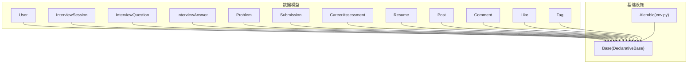
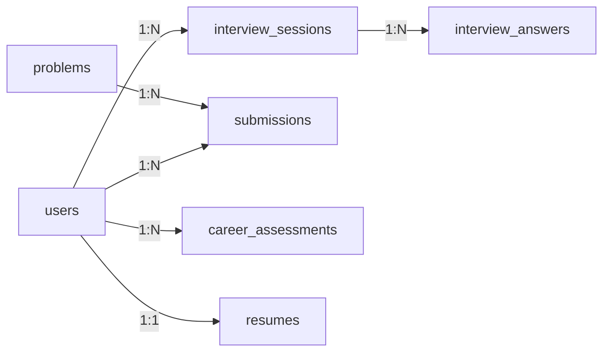

# 数据模型设计

<cite>
**本文引用的文件**   
- [user.py](file://backEnd/app/models/user.py)
- [interview.py](file://backEnd/app/models/interview.py)
- [problem.py](file://backEnd/app/models/problem.py)
- [career.py](file://backEnd/app/models/career.py)
- [resume.py](file://backEnd/app/models/resume.py)
- [post.py](file://backEnd/app/models/post.py)
- [comment.py](file://backEnd/app/models/comment.py)
- [like.py](file://backEnd/app/models/like.py)
- [tag.py](file://backEnd/app/models/tag.py)
- [__init__.py](file://backEnd/app/models/__init__.py)
- [database.py](file://backEnd/app/database.py)
- [env.py](file://backEnd/alembic/env.py)
</cite>

## 目录
1. [简介](#简介)
2. [项目结构](#项目结构)
3. [核心组件](#核心组件)
4. [架构总览](#架构总览)
5. [详细组件分析](#详细组件分析)
6. [依赖关系分析](#依赖关系分析)
7. [性能考虑](#性能考虑)
8. [故障排查指南](#故障排查指南)
9. [结论](#结论)
10. [附录](#附录)

## 简介
本文件面向HR XF后端的数据模型设计与实现，聚焦以下核心实体：用户（User）、面试会话（InterviewSession）、编程题目（Problem）、职业测评（CareerAssessment）、简历（Resume），并补充社区相关实体（帖子、评论、点赞、标签）以完善整体数据视图。文档将逐字段说明数据类型、约束、默认值与业务含义，阐述实体间关系设计原则与命名规范，提供SQLAlchemy模型参考路径与最佳实践，并给出版本管理与向后兼容策略以及扩展新模型的指导。

## 项目结构
数据模型位于 backEnd/app/models 下，采用按领域拆分文件的组织方式；所有模型均继承自数据库基类 Base，并通过 Alembic 进行迁移管理。



图表来源
- [database.py:46-47](file://backEnd/app/database.py#L46-L47)
- [env.py:1-20](file://backEnd/alembic/env.py#L1-L20)

章节来源
- [__init__.py:1-12](file://backEnd/app/models/__init__.py#L1-L12)
- [database.py:46-47](file://backEnd/app/database.py#L46-L47)
- [env.py:1-20](file://backEnd/alembic/env.py#L1-L20)

## 核心组件
本节概述各核心实体的职责与关键字段，便于快速建立整体认知。

- User 用户模型：唯一标识、登录凭据、个人资料、时间戳等。
- InterviewSession 面试会话模型：记录一次完整或单轮练习的面试过程、状态、评分与报告。
- Problem 编程题目模型：题目描述、输入输出格式、限制、样例、难度、统计等。
- CareerAssessment 职业测评模型：测评类型、原始答案、结构化结果、摘要与AI推荐缓存。
- Resume 简历模型：上传文件信息、解析文本、结构化提取、优化缓存等。

章节来源
- [user.py:10-45](file://backEnd/app/models/user.py#L10-L45)
- [interview.py:19-56](file://backEnd/app/models/interview.py#L19-L56)
- [problem.py:17-54](file://backEnd/app/models/problem.py#L17-L54)
- [career.py:11-56](file://backEnd/app/models/career.py#L11-L56)
- [resume.py:11-67](file://backEnd/app/models/resume.py#L11-L67)

## 架构总览
下图展示核心实体之间的关系，包括外键关联、一对一与一对多关系，以及JSON字段承载的结构化数据。

```mermaid
classDiagram
class User {
+id : String(36) PK
+username : String(50) UK
+email : String(255) UK?
+password_hash : String(255)
+is_active : Boolean
+nickname/avatar/bio/phone/gender/birth_date
+created_at/updated_at
}
class InterviewSession {
+id : String(36) PK
+user_id : FK->users.id
+job_category/job_title
+current_round/status
+cheat_count
+interview_mode/target_round
+total_score/report(JSON)
+started_at/completed_at
}
class InterviewQuestion {
+id : String(36) PK
+category/job_category/question_type
+content(JSON)/answer(JSON)
+difficulty
}
class InterviewAnswer {
+id : String(36) PK
+session_id : FK->interview_sessions.id
+question_id
+round/answer_text/score/feedback/duration_seconds
+created_at
}
class Problem {
+id/display_id : String(36/20) UK
+title/description/input_format/output_format/constraints
+sample_input/sample_output/hint
+time_limit/memory_limit
+difficulty/tags
+total_submissions/accepted_submissions
+created_at/updated_at
}
class Submission {
+id : String(36) PK
+user_id : FK->users.id
+problem_id : FK->problems.id
+code/language/status
+execution_time/execution_memory
+created_at
}
class CareerAssessment {
+id : String(36) PK
+user_id : FK->users.id
+type
+answers(JSON)/result(JSON)
+summary/recommendation(JSON)
+created_at
}
class Resume {
+id : String(36) PK
+user_id : FK->users.id UK
+file_name/file_path
+raw_text
+parsed_content(JSON)/skill_keywords(JSON)
+optimized_content(JSON)
+created_at/updated_at
}
User ||--o{ InterviewSession : "拥有多个会话"
InterviewSession ||--o{ InterviewAnswer : "包含多个回答"
User ||--o{ Submission : "有多次提交"
Problem ||--o{ Submission : "被多次提交"
User ||--o{ CareerAssessment : "有多次测评"
User ||--|| Resume : "一对一简历"
```

图表来源
- [user.py:10-45](file://backEnd/app/models/user.py#L10-L45)
- [interview.py:19-114](file://backEnd/app/models/interview.py#L19-L114)
- [problem.py:17-88](file://backEnd/app/models/problem.py#L17-L88)
- [career.py:11-56](file://backEnd/app/models/career.py#L11-L56)
- [resume.py:11-67](file://backEnd/app/models/resume.py#L11-L67)

## 详细组件分析

### User 用户模型
- 主键 id：String(36)，UUID，不可为空。
- 用户名 username：String(50)，唯一且非空，建索引。
- 邮箱 email：String(255)，唯一可空，建索引。
- 密码哈希 password_hash：String(255)，非空。
- 激活状态 is_active：Boolean，默认启用。
- 个人资料 nickname/avatar/avatar_color/bio/phone/gender/birth_date：可空，avatar_color 默认色值。
- 时间戳 created_at/updated_at：自动维护创建与更新时间。

约束与验证建议
- 业务层对 username/email 做唯一性校验与格式校验（如邮箱正则）。
- avatar_color 建议限定为合法十六进制颜色字符串。
- birth_date 建议上限不超过当前日期。

关系
- 与 InterviewSession、Submission、CareerAssessment、Resume 存在一对多或一对一外键关系。

章节来源
- [user.py:10-45](file://backEnd/app/models/user.py#L10-L45)

### InterviewSession 面试会话模型
- 主键 id：String(36)，UUID。
- user_id：外键到 users.id，级联删除，非空，索引。
- job_category/job_title：岗位类别与标题，非空。
- current_round：当前轮次，枚举型字符串，默认 assessment。
- status：in_progress/completed/aborted，默认 in_progress，索引。
- cheat_count：作弊计数，默认0。
- interview_mode：full/single，默认 full。
- target_round：单轮模式指定目标轮次 key，可空。
- total_score：总分，可空。
- report：多维度评分报告 JSON，可空。
- started_at/completed_at：开始与完成时间。

关系
- 与 InterviewAnswer 一对多，通过 answers 关系访问。

章节来源
- [interview.py:19-56](file://backEnd/app/models/interview.py#L19-L56)

### InterviewQuestion 面试题目模型
- 主键 id：String(36)。
- category/job_category/question_type：轮次分类、岗位类别、题型（choice/judgment/code/open_ended）。
- content/answer：JSON 存储题目内容与标准答案/评分要点。
- difficulty：难度等级，默认 medium。

章节来源
- [interview.py:59-82](file://backEnd/app/models/interview.py#L59-L82)

### InterviewAnswer 面试回答模型
- 主键 id：String(36)。
- session_id：外键到 interview_sessions.id，级联删除，索引。
- question_id：可选，关联具体题目。
- round：轮次 key。
- answer_text/score/feedback/duration_seconds：回答内容、得分、反馈、用时。
- created_at：创建时间。

关系
- 与 InterviewSession 反向关系 session。

章节来源
- [interview.py:84-114](file://backEnd/app/models/interview.py#L84-L114)

### Problem 编程题目模型
- 主键 id：String(36)。
- display_id：String(20)，唯一且索引，用于前端显示。
- title/description/input_format/output_format/constraints：题目描述与格式要求。
- sample_input/sample_output/hint：样例与提示。
- time_limit/memory_limit：执行时间与内存限制，默认值合理。
- difficulty/tags：难度与标签集合（逗号分隔字符串）。
- total_submissions/accepted_submissions：提交与通过统计。
- created_at/updated_at：时间戳。

关系
- 与 Submission 一对多。

章节来源
- [problem.py:17-54](file://backEnd/app/models/problem.py#L17-L54)

### Submission 提交记录模型
- 主键 id：String(36)。
- user_id/problem_id：外键到 users.id/problems.id，级联删除，索引。
- code/language/status：代码、语言、状态。
- execution_time/execution_memory：运行耗时与内存占用。
- created_at：创建时间。

关系
- 与 User、Problem 双向关系。

章节来源
- [problem.py:57-88](file://backEnd/app/models/problem.py#L57-L88)

### CareerAssessment 职业测评模型
- 主键 id：String(36)。
- user_id：外键到 users.id，级联删除，索引。
- type：测评类型（holland/mbti/career_values）。
- answers/result：JSON 存储原始答案与计算后的结构化结果。
- summary：结果摘要文本。
- recommendation：AI 岗位推荐缓存 JSON。
- created_at：创建时间。

章节来源
- [career.py:11-56](file://backEnd/app/models/career.py#L11-L56)

### Resume 简历模型
- 主键 id：String(36)。
- user_id：外键到 users.id，唯一约束，确保每用户仅一条简历。
- file_name/file_path：文件名与存储路径。
- raw_text：解析出的纯文本。
- parsed_content/skill_keywords：结构化提取结果与技能关键词 JSON。
- optimized_content：措辞优化结果缓存 JSON。
- created_at/updated_at：时间戳。

章节来源
- [resume.py:11-67](file://backEnd/app/models/resume.py#L11-L67)

### 社区相关实体（补充）
- Post 帖子：作者、标题、内容、公司/职位/年份、面试类型、状态、匿名、计数、时间戳。
- Comment 评论：关联帖子与用户、内容、匿名标记、时间戳。
- Like 点赞：唯一约束（post_id, user_id），避免重复点赞。
- Tag 标签：名称唯一，与帖子多对多通过 post_tags 中间表。

章节来源
- [post.py:18-65](file://backEnd/app/models/post.py#L18-L65)
- [comment.py:17-53](file://backEnd/app/models/comment.py#L17-L53)
- [like.py:16-47](file://backEnd/app/models/like.py#L16-L47)
- [tag.py:18-46](file://backEnd/app/models/tag.py#L18-L46)

## 依赖关系分析
- 外键约束
  - InterviewSession.user_id -> users.id
  - InterviewAnswer.session_id -> interview_sessions.id
  - Submission.user_id -> users.id
  - Submission.problem_id -> problems.id
  - CareerAssessment.user_id -> users.id
  - Resume.user_id -> users.id
- 唯一性与索引
  - users.username/email 唯一
  - problems.display_id 唯一
  - likes(post_id, user_id) 唯一
  - tags.name 唯一
  - resumes.user_id 唯一（一对一）
- 关系加载策略
  - 部分关系使用 lazy="noload"/"selectin" 控制 N+1 查询风险。



图表来源
- [interview.py:19-114](file://backEnd/app/models/interview.py#L19-L114)
- [problem.py:17-88](file://backEnd/app/models/problem.py#L17-L88)
- [career.py:11-56](file://backEnd/app/models/career.py#L11-L56)
- [resume.py:11-67](file://backEnd/app/models/resume.py#L11-L67)

章节来源
- [interview.py:19-114](file://backEnd/app/models/interview.py#L19-L114)
- [problem.py:17-88](file://backEnd/app/models/problem.py#L17-L88)
- [career.py:11-56](file://backEnd/app/models/career.py#L11-L56)
- [resume.py:11-67](file://backEnd/app/models/resume.py#L11-L67)

## 性能考虑
- 索引策略
  - 高频查询字段已建索引（如 users.username/email、interview_sessions.status、problems.difficulty、submissions.status）。
- JSON 字段
  - 大量使用 JSON 存储复杂结构，注意在应用层保证结构稳定与最小化变更，必要时对常用子字段建立生成列或冗余字段以提升查询性能。
- 关系加载
  - 合理使用 selectin/noload 避免 N+1 问题。
- 连接池与引擎
  - 异步引擎配置了 pool_pre_ping、pool_size/max_overflow，提升稳定性与并发能力。

章节来源
- [database.py:31-43](file://backEnd/app/database.py#L31-L43)

## 故障排查指南
- 连接异常
  - 检查数据库 URL 是否正确，engine 配置是否生效。
  - aiomysql 0.3.x 兼容性补丁已在 database.py 中处理 ping() 签名差异。
- 事务回滚
  - get_db 上下文管理器在异常时执行 rollback，确保数据一致性。
- 迁移失败
  - 确认 alembic env.py 正确设置 sqlalchemy.url 指向同步URL，并确保导入所有模型以注册 metadata。

章节来源
- [database.py:10-24](file://backEnd/app/database.py#L10-L24)
- [database.py:50-58](file://backEnd/app/database.py#L50-L58)
- [env.py:16-20](file://backEnd/alembic/env.py#L16-L20)

## 结论
本数据模型围绕 HR 招聘与面试场景构建，采用清晰的实体划分与外键约束，结合 JSON 字段灵活表达复杂结构。通过 Alembic 进行版本化管理，配合合理的索引与关系加载策略，兼顾可读性与性能。建议在后续迭代中持续完善字段校验、统一错误码与日志埋点，并对热点查询进行监控与优化。

## 附录

### 字段定义与业务含义速查
- User
  - username/email/password_hash/is_active：认证与账户状态。
  - nickname/avatar/avatar_color/bio/phone/gender/birth_date：个人档案。
- InterviewSession
  - job_category/job_title/current_round/status/interview_mode/target_round：面试流程控制。
  - total_score/report：评分与报告。
- Problem/Submission
  - 题目元数据与提交记录，支持统计与评测。
- CareerAssessment
  - type/answers/result/summary/recommendation：测评全流程数据。
- Resume
  - file_name/file_path/raw_text/parsed_content/skill_keywords/optimized_content：简历解析与优化。

章节来源
- [user.py:10-45](file://backEnd/app/models/user.py#L10-L45)
- [interview.py:19-114](file://backEnd/app/models/interview.py#L19-L114)
- [problem.py:17-88](file://backEnd/app/models/problem.py#L17-L88)
- [career.py:11-56](file://backEnd/app/models/career.py#L11-L56)
- [resume.py:11-67](file://backEnd/app/models/resume.py#L11-L67)

### 命名规范与设计原则
- 表名与字段名
  - 表名使用复数小写下划线（如 users、interview_sessions）。
  - 字段名使用小写下划线，语义清晰。
- 主键
  - 统一使用 String(36) UUID 作为主键，便于分布式与跨服务拼接。
- 外键与级联
  - 明确 ondelete="CASCADE" 保持数据一致性。
- 唯一性与索引
  - 对外部可见 ID（display_id）与查询热点字段建立唯一/索引。
- JSON 字段
  - 使用 JSON 存储复杂结构，但需约定 schema 并在应用层校验。

章节来源
- [interview.py:19-56](file://backEnd/app/models/interview.py#L19-L56)
- [problem.py:17-54](file://backEnd/app/models/problem.py#L17-L54)
- [like.py:16-47](file://backEnd/app/models/like.py#L16-L47)
- [tag.py:18-46](file://backEnd/app/models/tag.py#L18-L46)

### SQLAlchemy 模型示例与最佳实践
- 参考路径
  - 用户模型：[user.py:10-45](file://backEnd/app/models/user.py#L10-L45)
  - 面试会话与问答：[interview.py:19-114](file://backEnd/app/models/interview.py#L19-L114)
  - 题目与提交：[problem.py:17-88](file://backEnd/app/models/problem.py#L17-L88)
  - 职业测评：[career.py:11-56](file://backEnd/app/models/career.py#L11-L56)
  - 简历：[resume.py:11-67](file://backEnd/app/models/resume.py#L11-L67)
- 最佳实践
  - 使用 mapped_column 与 Mapped 类型注解增强可读性与类型安全。
  - 为频繁过滤/排序字段添加 index=True。
  - 使用 server_default/onupdate 维护时间戳。
  - 谨慎使用懒加载策略，避免 N+1。
  - 对敏感字段（如密码）不在模型层暴露明文。

章节来源
- [user.py:10-45](file://backEnd/app/models/user.py#L10-L45)
- [interview.py:19-114](file://backEnd/app/models/interview.py#L19-L114)
- [problem.py:17-88](file://backEnd/app/models/problem.py#L17-L88)
- [career.py:11-56](file://backEnd/app/models/career.py#L11-L56)
- [resume.py:11-67](file://backEnd/app/models/resume.py#L11-L67)

### 版本管理与向后兼容策略
- 迁移工具
  - 使用 Alembic，env.py 从配置读取同步数据库 URL，并导入所有模型以注册 metadata。
- 向后兼容
  - 新增字段优先设为 nullable=True 并提供默认值。
  - 对 JSON 字段采用渐进式演进，保留旧结构兼容逻辑。
  - 删除字段前评估引用，必要时先弃用再下线。
- 操作建议
  - 每次模型变更后生成迁移脚本并评审。
  - 在测试环境先行验证迁移与回滚。

章节来源
- [env.py:1-20](file://backEnd/alembic/env.py#L1-L20)

### 扩展新数据模型指导
- 步骤
  - 在 app/models 下新建模块文件，定义继承自 Base 的模型类。
  - 在 models/__init__.py 中导出新模型，确保 Alembic 能发现。
  - 使用 Alembic 生成迁移并应用到数据库。
- 注意事项
  - 遵循命名规范与约束策略。
  - 为新模型添加必要索引与唯一约束。
  - 若引入 JSON 字段，制定结构规范并在服务层校验。
  - 更新相关路由与服务层以使用新模型。

章节来源
- [__init__.py:1-12](file://backEnd/app/models/__init__.py#L1-L12)
- [env.py:16-20](file://backEnd/alembic/env.py#L16-L20)