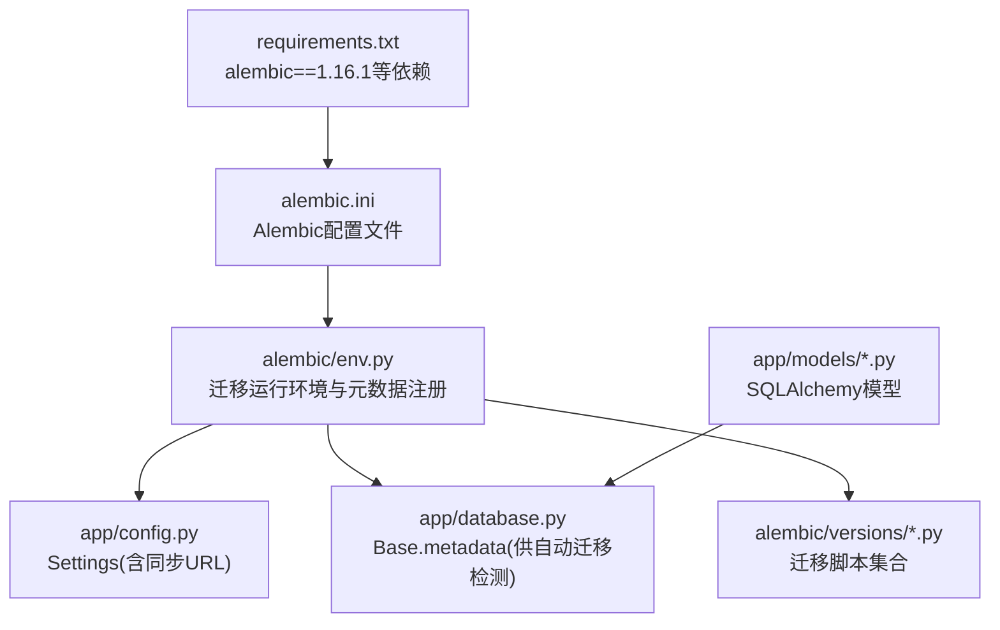
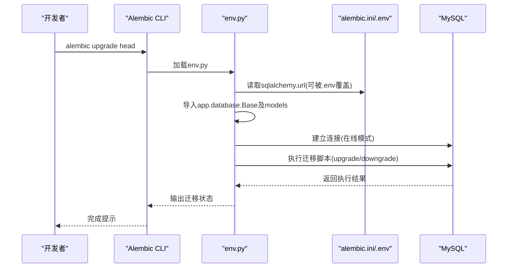
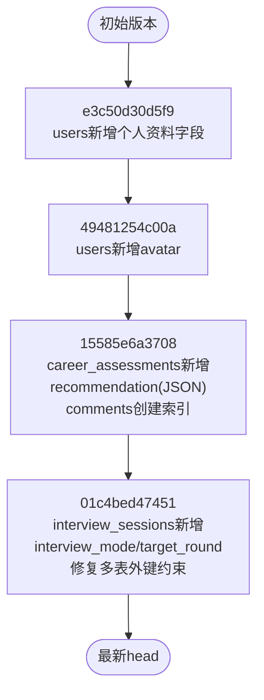
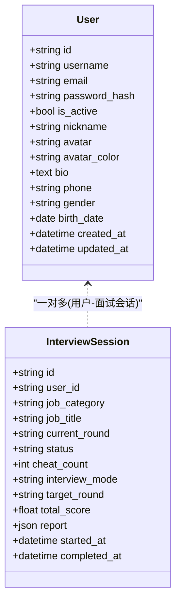
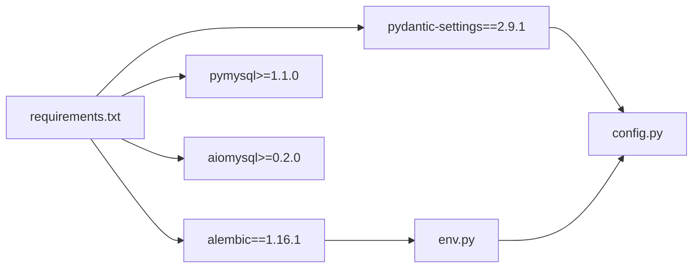

# 数据迁移管理

<cite>
**本文引用的文件**   
- [alembic.ini](file://backEnd/alembic.ini)
- [env.py](file://backEnd/alembic/env.py)
- [config.py](file://backEnd/app/config.py)
- [database.py](file://backEnd/app/database.py)
- [script.py.mako](file://backEnd/alembic/script.py.mako)
- [e3c50d30d5f9_add_profile_fields_to_users.py](file://backEnd/alembic/versions/e3c50d30d5f9_add_profile_fields_to_users.py)
- [49481254c00a_add_avatar_to_users.py](file://backEnd/alembic/versions/49481254c00a_add_avatar_to_users.py)
- [15585e6a3708_add_recommendation_to_career_assessments.py](file://backEnd/alembic/versions/15585e6a3708_add_recommendation_to_career_assessments.py)
- [01c4bed47451_add_interview_mode_and_target_round_to_.py](file://backEnd/alembic/versions/01c4bed47451_add_interview_mode_and_target_round_to_.py)
- [user.py](file://backEnd/app/models/user.py)
- [interview.py](file://backEnd/app/models/interview.py)
- [requirements.txt](file://backEnd/requirements.txt)
</cite>

## 目录
1. [简介](#简介)
2. [项目结构](#项目结构)
3. [核心组件](#核心组件)
4. [架构总览](#架构总览)
5. [详细组件分析](#详细组件分析)
6. [依赖关系分析](#依赖关系分析)
7. [性能与可靠性考虑](#性能与可靠性考虑)
8. [故障排查指南](#故障排查指南)
9. [结论](#结论)
10. [附录：常用命令与最佳实践](#附录常用命令与最佳实践)

## 简介
本文件面向HR XF后端的数据迁移管理，围绕Alembic的配置、使用流程、版本控制、脚本生成与管理、回滚与切换、团队协作冲突解决、生产环境部署注意事项以及最佳实践进行系统化说明。读者可据此建立从本地开发到生产上线的完整迁移工作流。

## 项目结构
后端采用FastAPI + SQLAlchemy 2.0异步ORM，迁移工具为Alembic。迁移配置位于alembic目录，模型定义位于app/models，数据库连接与引擎在app/database中集中管理，配置项通过pydantic-settings加载。

图示来源
- [alembic.ini:1-40](file://backEnd/alembic.ini#L1-L40)
- [env.py:1-54](file://backEnd/alembic/env.py#L1-L54)
- [config.py:47-61](file://backEnd/app/config.py#L47-L61)
- [database.py:46-47](file://backEnd/app/database.py#L46-L47)
- [requirements.txt:10](file://backEnd/requirements.txt#L10)

章节来源
- [alembic.ini:1-40](file://backEnd/alembic.ini#L1-L40)
- [env.py:1-54](file://backEnd/alembic/env.py#L1-L54)
- [config.py:1-71](file://backEnd/app/config.py#L1-L71)
- [database.py:1-58](file://backEnd/app/database.py#L1-L58)
- [requirements.txt:1-27](file://backEnd/requirements.txt#L1-L27)

## 核心组件
- Alembic配置（alembic.ini）
  - 指定脚本位置、日志级别、默认数据库URL（可通过.env覆盖）。
- 迁移运行环境（alembic/env.py）
  - 导入所有模型以注册metadata；从Settings读取同步数据库URL并覆盖到配置；提供离线/在线两种执行模式。
- 配置中心（app/config.py）
  - 基于pydantic-settings加载.env；暴露database_url_sync用于Alembic同步连接。
- 数据库基础（app/database.py）
  - 定义DeclarativeBase，导出Base.metadata供Alembic检测变更；包含异步引擎与会话工厂。
- 迁移模板（alembic/script.py.mako）
  - 生成迁移脚本骨架，包含revision标识与upgrade/downgrade占位。

章节来源
- [alembic.ini:1-40](file://backEnd/alembic.ini#L1-L40)
- [env.py:1-54](file://backEnd/alembic/env.py#L1-L54)
- [config.py:47-61](file://backEnd/app/config.py#L47-L61)
- [database.py:46-47](file://backEnd/app/database.py#L46-L47)
- [script.py.mako:1-26](file://backEnd/alembic/script.py.mako#L1-L26)

## 架构总览
下图展示Alembic在执行迁移时的关键交互：从命令行触发，读取配置与环境，注入数据库URL，加载模型元数据，选择在线或离线模式执行迁移。

图示来源
- [alembic.ini:1-40](file://backEnd/alembic.ini#L1-L40)
- [env.py:1-54](file://backEnd/alembic/env.py#L1-L54)
- [config.py:47-61](file://backEnd/app/config.py#L47-L61)

## 详细组件分析

### Alembic配置与环境设置
- 默认数据库URL在alembic.ini中声明，但env.py会优先从Settings读取同步URL并覆盖，确保多环境一致性。
- env.py显式导入所有模型，使Alembic能基于当前模型定义自动生成差异。
- 支持离线模式（不连库，仅生成SQL）与在线模式（直接执行DDL）。

章节来源
- [alembic.ini:1-40](file://backEnd/alembic.ini#L1-L40)
- [env.py:1-54](file://backEnd/alembic/env.py#L1-L54)
- [config.py:47-61](file://backEnd/app/config.py#L47-L61)

### 迁移脚本生命周期与版本链
现有迁移按时间顺序形成线性版本链，示例如下：
- e3c50d30d5f9：为users表添加个人资料字段
- 49481254c00a：为users表添加avatar字段
- 15585e6a3708：为career_assessments添加JSON字段，并为comments创建索引
- 01c4bed47451：为interview_sessions添加mode/target_round，并批量修复外键约束

图示来源
- [e3c50d30d5f9_add_profile_fields_to_users.py:1-40](file://backEnd/alembic/versions/e3c50d30d5f9_add_profile_fields_to_users.py#L1-L40)
- [49481254c00a_add_avatar_to_users.py:1-30](file://backEnd/alembic/versions/49481254c00a_add_avatar_to_users.py#L1-L30)
- [15585e6a3708_add_recommendation_to_career_assessments.py:1-34](file://backEnd/alembic/versions/15585e6a3708_add_recommendation_to_career_assessments.py#L1-L34)
- [01c4bed47451_add_interview_mode_and_target_round_to_.py:1-103](file://backEnd/alembic/versions/01c4bed47451_add_interview_mode_and_target_round_to_.py#L1-L103)

章节来源
- [e3c50d30d5f9_add_profile_fields_to_users.py:1-40](file://backEnd/alembic/versions/e3c50d30d5f9_add_profile_fields_to_users.py#L1-L40)
- [49481254c00a_add_avatar_to_users.py:1-30](file://backEnd/alembic/versions/49481254c00a_add_avatar_to_users.py#L1-L30)
- [15585e6a3708_add_recommendation_to_career_assessments.py:1-34](file://backEnd/alembic/versions/15585e6a3708_add_recommendation_to_career_assessments.py#L1-L34)
- [01c4bed47451_add_interview_mode_and_target_round_to_.py:1-103](file://backEnd/alembic/versions/01c4bed47451_add_interview_mode_and_target_round_to_.py#L1-L103)

### 模型与迁移映射
- users模型包含昵称、头像、性别、生日等字段，对应早期迁移逐步添加。
- interview_sessions模型包含面试模式与目标轮次字段，由后续迁移补充。

图示来源
- [user.py:10-45](file://backEnd/app/models/user.py#L10-L45)
- [interview.py:19-57](file://backEnd/app/models/interview.py#L19-L57)

章节来源
- [user.py:1-45](file://backEnd/app/models/user.py#L1-L45)
- [interview.py:1-114](file://backEnd/app/models/interview.py#L1-L114)

### 迁移脚本生成与编辑流程
- 生成脚本：修改模型后，使用Alembic命令生成迁移脚本。
- 审查脚本：检查生成的upgrade/downgrade是否满足业务需求，必要时手动修正。
- 提交代码：将迁移脚本纳入版本控制，确保团队一致。

章节来源
- [script.py.mako:1-26](file://backEnd/alembic/script.py.mako#L1-L26)

### 回滚与版本切换
- 回滚至上一版本：执行降级操作，调用对应脚本的downgrade。
- 切换到指定版本：根据revision ID定位目标版本并应用。
- 查看历史：列出已应用的迁移及其依赖关系，便于定位问题。

章节来源
- [env.py:23-53](file://backEnd/alembic/env.py#L23-L53)

### 团队协作中的冲突解决策略
- 分支合并冲突：当多人同时修改同一张表时，可能出现迁移脚本冲突。建议：
  - 先拉取远端最新迁移，再在本地重新生成新迁移。
  - 若无法自动合并，保留双方变更并在同一脚本中统一处理，避免重复DDL。
  - 对破坏性变更（如删除列）谨慎评估影响范围，必要时拆分迁移步骤。
- 版本分歧：若出现分叉版本链，应通过“空迁移”对齐基线，或在评审后重建头指针。

章节来源
- [01c4bed47451_add_interview_mode_and_target_round_to_.py:20-103](file://backEnd/alembic/versions/01c4bed47451_add_interview_mode_and_target_round_to_.py#L20-L103)

### 生产环境迁移部署流程与注意事项
- 部署前准备
  - 确认目标环境数据库连接正确（通过.env覆盖）。
  - 在预发环境验证迁移脚本，包括升级与回滚路径。
- 执行策略
  - 滚动发布：先升级数据库，再启动新版本服务，避免新旧版本并发访问不一致的schema。
  - 幂等性：尽量保证DDL幂等或具备明确的前置条件检查。
  - 备份：执行前对关键表或全库进行快照备份。
- 监控与回滚
  - 记录迁移执行日志与耗时，关注慢DDL。
  - 一旦发现问题，立即回滚至稳定版本并恢复数据备份。

章节来源
- [alembic.ini:1-40](file://backEnd/alembic.ini#L1-L40)
- [env.py:16-18](file://backEnd/alembic/env.py#L16-L18)

## 依赖关系分析
- Alembic版本锁定为1.16.1，确保行为一致。
- 同步驱动pymysql用于Alembic在线模式；异步驱动aiomysql用于运行时。
- pydantic-settings负责环境变量加载，为Alembic提供统一的数据库URL。

图示来源
- [requirements.txt:1-27](file://backEnd/requirements.txt#L1-L27)
- [env.py:1-54](file://backEnd/alembic/env.py#L1-L54)
- [config.py:1-71](file://backEnd/app/config.py#L1-L71)

章节来源
- [requirements.txt:1-27](file://backEnd/requirements.txt#L1-L27)

## 性能与可靠性考虑
- 大表DDL优化
  - 避免在高峰时段执行大表结构变更。
  - 分批调整字段长度或类型，减少锁表时间。
  - 利用MySQL在线DDL特性（如ALGORITHM=INPLACE），结合业务低峰期执行。
- 索引与约束
  - 新建索引建议在空闲时段执行，必要时先建非唯一索引再替换。
  - 外键约束变更需谨慎，避免级联删除导致数据丢失风险。
- 事务与原子性
  - 单个迁移脚本内尽量保持原子性，失败则整体回滚。
  - 复杂数据转换可拆分为多个小迁移，降低单次事务规模。

[本节为通用指导，不直接分析具体文件]

## 故障排查指南
- 连接错误
  - 检查.env中数据库用户名、密码、主机、端口与库名是否正确。
  - 确认pymysql可用且网络可达。
- 元数据未更新
  - 确认env.py已导入所有模型，确保Base.metadata包含最新定义。
- 迁移冲突
  - 对比本地与远端迁移链，必要时合并脚本或重建头指针。
- 日志与调试
  - 提高Alembic日志级别，观察SQL语句与执行过程。
  - 使用离线模式生成SQL预览，人工核对后再在线执行。

章节来源
- [alembic.ini:17-39](file://backEnd/alembic.ini#L17-L39)
- [env.py:1-54](file://backEnd/alembic/env.py#L1-L54)

## 结论
本项目通过Alembic实现了规范的数据库版本管理。借助env.py集中化配置与模型元数据注册，迁移脚本可自动检测变更并安全执行。遵循本文的工作流与最佳实践，可在团队协作与生产环境中稳定推进数据库演进。

[本节为总结性内容，不直接分析具体文件]

## 附录：常用命令与最佳实践
- 常用命令
  - 初始化/升级/降级/查看历史/生成迁移脚本（请在后端目录执行）
    - 初始化：alembic init alembic
    - 升级到最新：alembic upgrade head
    - 回滚一步：alembic downgrade -1
    - 回滚到指定版本：alembic downgrade <revision_id>
    - 查看迁移历史：alembic history --verbose
    - 生成迁移脚本：alembic revision --autogenerate -m "描述信息"
- 最佳实践
  - 每个变更一个迁移，命名清晰，包含业务语义。
  - 始终编写downgrade，确保可回滚。
  - 对破坏性变更增加前置校验与数据迁移步骤。
  - 在CI中加入迁移校验步骤，防止遗漏。
  - 生产环境变更前进行预发演练与备份。

[本节为通用指导，不直接分析具体文件]