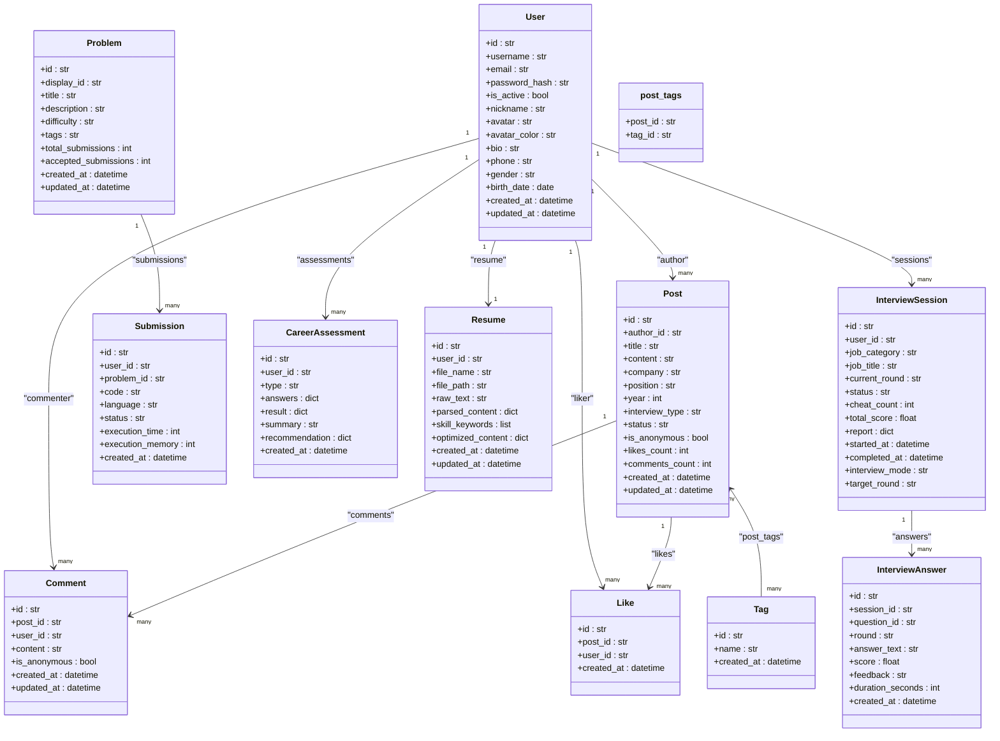
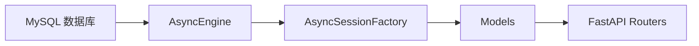

# 表关系映射

<cite>
**本文引用的文件**   
- [models/__init__.py](file://backEnd/app/models/__init__.py)
- [models/user.py](file://backEnd/app/models/user.py)
- [models/post.py](file://backEnd/app/models/post.py)
- [models/tag.py](file://backEnd/app/models/tag.py)
- [models/comment.py](file://backEnd/app/models/comment.py)
- [models/like.py](file://backEnd/app/models/like.py)
- [models/problem.py](file://backEnd/app/models/problem.py)
- [models/career.py](file://backEnd/app/models/career.py)
- [models/resume.py](file://backEnd/app/models/resume.py)
- [models/interview.py](file://backEnd/app/models/interview.py)
- [database.py](file://backEnd/app/database.py)
- [hr_interview.sql](file://hr_interview.sql)
</cite>

## 目录
1. [简介](#简介)
2. [项目结构](#项目结构)
3. [核心组件](#核心组件)
4. [架构总览](#架构总览)
5. [详细组件分析](#详细组件分析)
6. [依赖分析](#依赖分析)
7. [性能考虑](#性能考虑)
8. [故障排查指南](#故障排查指南)
9. [结论](#结论)
10. [附录](#附录)

## 简介
本文件系统化梳理 HR XF 后端的数据模型与表关系映射，覆盖一对一、一对多、多对多的实现方式；外键约束与级联删除策略；复杂查询下的关系加载策略（懒加载、立即加载、选择加载）；中间表设计（如 post_tags）；并提供基于 SQLAlchemy 的关系查询示例路径与性能优化建议。同时总结循环引用处理方案与常见陷阱，帮助读者在设计与维护中避免踩坑。

## 项目结构
后端采用 FastAPI + SQLAlchemy 异步 ORM 的架构，数据模型集中在 app/models 下，通过 Base 元类声明式定义，数据库连接与会话管理位于 database.py。SQL 脚本 hr_interview.sql 反映了实际建表结构与索引、外键约束。

```mermaid
graph TB
subgraph "ORM 层"
U["User"]
P["Post"]
C["Comment"]
Lk["Like"]
Tg["Tag"]
PT["post_tags(关联表)"]
Pr["Problem"]
Sb["Submission"]
CA["CareerAssessment"]
RS["Resume"]
ISes["InterviewSession"]
IAns["InterviewAnswer"]
end
U --> |一对多| P
U --> |一对多| C
U --> |一对多| Lk
U --> |一对多| CA
U --> |一对一| RS
U --> |一对多| ISes
P --> |一对多| C
P --> |一对多| Lk
P <- --> |多对多| Tg
PT --- P
PT --- Tg
Pr --> |一对多| Sb
ISes --> |一对多| IAns
```

图表来源
- [models/user.py:10-45](file://backEnd/app/models/user.py#L10-L45)
- [models/post.py:18-65](file://backEnd/app/models/post.py#L18-L65)
- [models/tag.py:18-46](file://backEnd/app/models/tag.py#L18-L46)
- [models/comment.py:17-53](file://backEnd/app/models/comment.py#L17-L53)
- [models/like.py:16-47](file://backEnd/app/models/like.py#L16-L47)
- [models/problem.py:17-88](file://backEnd/app/models/problem.py#L17-L88)
- [models/career.py:11-56](file://backEnd/app/models/career.py#L11-L56)
- [models/resume.py:11-67](file://backEnd/app/models/resume.py#L11-L67)
- [models/interview.py:19-114](file://backEnd/app/models/interview.py#L19-L114)

章节来源
- [models/__init__.py:1-12](file://backEnd/app/models/__init__.py#L1-L12)
- [database.py:31-58](file://backEnd/app/database.py#L31-L58)
- [hr_interview.sql](file://hr_interview.sql)

## 核心组件
- User：用户主实体，作为多个业务实体的所有者或参与者。
- Post：面经帖子，拥有作者、标签、评论、点赞等关系。
- Tag：标签，与帖子通过中间表 post_tags 建立多对多关系。
- Comment：评论，属于某帖子和某用户。
- Like：点赞，记录用户对帖子的点赞，含唯一约束防止重复。
- Problem/Submission：题目与提交记录，形成一对多关系。
- CareerAssessment：职业测评记录，与用户一对多。
- Resume：简历，与用户一对一（user_id 唯一）。
- InterviewSession/InterviewAnswer：面试会话与答题记录，一对多。

章节来源
- [models/user.py:10-45](file://backEnd/app/models/user.py#L10-L45)
- [models/post.py:18-65](file://backEnd/app/models/post.py#L18-L65)
- [models/tag.py:18-46](file://backEnd/app/models/tag.py#L18-L46)
- [models/comment.py:17-53](file://backEnd/app/models/comment.py#L17-L53)
- [models/like.py:16-47](file://backEnd/app/models/like.py#L16-L47)
- [models/problem.py:17-88](file://backEnd/app/models/problem.py#L17-L88)
- [models/career.py:11-56](file://backEnd/app/models/career.py#L11-L56)
- [models/resume.py:11-67](file://backEnd/app/models/resume.py#L11-L67)
- [models/interview.py:19-114](file://backEnd/app/models/interview.py#L19-L114)

## 架构总览
下图展示各实体间的关系类型、外键方向与级联策略，以及中间表的位置。



图表来源
- [models/user.py:10-45](file://backEnd/app/models/user.py#L10-L45)
- [models/post.py:18-65](file://backEnd/app/models/post.py#L18-L65)
- [models/tag.py:18-46](file://backEnd/app/models/tag.py#L18-L46)
- [models/comment.py:17-53](file://backEnd/app/models/comment.py#L17-L53)
- [models/like.py:16-47](file://backEnd/app/models/like.py#L16-L47)
- [models/problem.py:17-88](file://backEnd/app/models/problem.py#L17-L88)
- [models/career.py:11-56](file://backEnd/app/models/career.py#L11-L56)
- [models/resume.py:11-67](file://backEnd/app/models/resume.py#L11-L67)
- [models/interview.py:19-114](file://backEnd/app/models/interview.py#L19-L114)

## 详细组件分析

### 用户与帖子（一对多）
- 关系定义：Post.author → User，使用 selectin 预取策略，减少 N+1 查询。
- 外键与级联：posts.author_id 引用 users.id，ondelete=CASCADE，删除用户时级联删除其帖子。
- 索引：author_id 已建索引，利于按作者筛选。

章节来源
- [models/post.py:26-31](file://backEnd/app/models/post.py#L26-L31)
- [models/post.py:61](file://backEnd/app/models/post.py#L61)
- [hr_interview.sql](file://hr_interview.sql)

### 帖子与标签（多对多）
- 中间表：post_tags 包含 post_id 与 tag_id 复合主键，并设唯一约束 uq_post_tag。
- 关系定义：Post.tags 与 Tag.posts 通过 secondary=post_tags 双向关联，默认 noload，按需选择加载。
- 级联：删除帖子或标签时，中间表对应行级联删除。

章节来源
- [models/tag.py:19-25](file://backEnd/app/models/tag.py#L19-L25)
- [models/tag.py:45](file://backEnd/app/models/tag.py#L45)
- [models/post.py:62](file://backEnd/app/models/post.py#L62)
- [hr_interview.sql](file://hr_interview.sql)

### 帖子与评论（一对多）
- 关系定义：Comment.post → Post，Comment.user → User。
- 级联：删除帖子或用户时，评论级联删除。
- 加载策略：Post.comments 默认 noload，避免列表页加载过多数据。

章节来源
- [models/comment.py:25-36](file://backEnd/app/models/comment.py#L25-L36)
- [models/comment.py:51-52](file://backEnd/app/models/comment.py#L51-L52)
- [models/post.py:63](file://backEnd/app/models/post.py#L63)
- [hr_interview.sql](file://hr_interview.sql)

### 帖子与点赞（一对多 + 唯一约束）
- 关系定义：Like.post → Post，Like.user → User。
- 唯一约束：uq_like_post_user 保证同一用户对同一帖子仅一次点赞。
- 级联：删除帖子或用户时，点赞记录级联删除。

章节来源
- [models/like.py:18-20](file://backEnd/app/models/like.py#L18-L20)
- [models/like.py:27-38](file://backEnd/app/models/like.py#L27-L38)
- [models/like.py:45-46](file://backEnd/app/models/like.py#L45-L46)
- [hr_interview.sql](file://hr_interview.sql)

### 题目与提交（一对多）
- 关系定义：Submission.problem → Problem，Submission.user → User。
- 加载策略：Problem.submissions 默认 noload，Submission.problem 使用 selectin 预取。

章节来源
- [models/problem.py:54](file://backEnd/app/models/problem.py#L54)
- [models/problem.py:86-87](file://backEnd/app/models/problem.py#L86-L87)

### 职业测评（一对多）
- 关系定义：CareerAssessment.user_id → User.id。
- 存储：answers/result/recommendation 使用 JSON 字段，便于灵活扩展。

章节来源
- [models/career.py:19-50](file://backEnd/app/models/career.py#L19-L50)
- [hr_interview.sql](file://hr_interview.sql)

### 简历（一对一）
- 关系定义：Resume.user_id → User.id，且 user_id 唯一，确保每用户一条简历。
- 存储：parsed_content/skill_keywords/optimized_content 使用 JSON 字段。

章节来源
- [models/resume.py:19-25](file://backEnd/app/models/resume.py#L19-L25)
- [models/resume.py:42-55](file://backEnd/app/models/resume.py#L42-L55)

### 面试会话与答题（一对多）
- 关系定义：InterviewAnswer.session → InterviewSession。
- 存储：InterviewSession.report 为 JSON，保存多维度评分报告。

章节来源
- [models/interview.py:56](file://backEnd/app/models/interview.py#L56)
- [models/interview.py:96-113](file://backEnd/app/models/interview.py#L96-L113)
- [hr_interview.sql](file://hr_interview.sql)

### 关系加载策略说明
- 懒加载（lazy="noload"）：访问属性时不自动发起查询，适合列表场景避免 N+1。
- 立即加载（lazy="select"）：访问属性时立即执行查询，简单但可能产生多次查询。
- 选择加载（lazy="selectin"）：一次性批量加载关联对象，显著降低查询次数，推荐用于频繁访问的关联。
- 当前实现：
  - Post.author 使用 selectin，提升作者信息获取效率。
  - Post.tags 使用 selectin，适合需要标签的场景。
  - Post.comments/likes 使用 noload，列表页默认不加载详情。
  - Comment.user 使用 selectin，评论列表可快速显示评论者信息。
  - Submission.problem 使用 selectin，提交详情可快速加载题目。

章节来源
- [models/post.py:61-64](file://backEnd/app/models/post.py#L61-L64)
- [models/comment.py:52](file://backEnd/app/models/comment.py#L52)
- [models/problem.py:87](file://backEnd/app/models/problem.py#L87)

### 中间表设计与使用（post_tags）
- 设计要点：
  - 复合主键 (post_id, tag_id) 保证唯一性。
  - 唯一约束 uq_post_tag 防止重复关联。
  - 外键 ondelete=CASCADE，删除帖子或标签时自动清理中间表。
- 使用模式：
  - 在创建帖子时插入多条 post_tags 记录。
  - 查询带标签的帖子可通过 join 中间表过滤。
  - 查询某标签下的所有帖子同样通过中间表反向关联。

章节来源
- [models/tag.py:19-25](file://backEnd/app/models/tag.py#L19-L25)
- [hr_interview.sql](file://hr_interview.sql)

### 关系查询示例（路径指引）
以下为常用关系查询的实现位置参考（不包含具体代码内容）：
- 按作者加载帖子（选择加载）：[models/post.py:61](file://backEnd/app/models/post.py#L61)
- 按标签筛选帖子（join 中间表）：[models/tag.py:19-25](file://backEnd/app/models/tag.py#L19-L25), [models/post.py:62](file://backEnd/app/models/post.py#L62)
- 获取帖子评论（懒加载）：[models/post.py:63](file://backEnd/app/models/post.py#L63), [models/comment.py:51](file://backEnd/app/models/comment.py#L51)
- 判断用户是否点赞（唯一约束）：[models/like.py:18-20](file://backEnd/app/models/like.py#L18-L20)
- 获取提交对应的题目（选择加载）：[models/problem.py:87](file://backEnd/app/models/problem.py#L87)
- 获取用户的简历（一对一）：[models/resume.py:19-25](file://backEnd/app/models/resume.py#L19-L25)
- 获取面试会话的答题记录（懒加载）：[models/interview.py:56](file://backEnd/app/models/interview.py#L56)

章节来源
- [models/post.py:61-64](file://backEnd/app/models/post.py#L61-L64)
- [models/tag.py:19-25](file://backEnd/app/models/tag.py#L19-L25)
- [models/like.py:18-20](file://backEnd/app/models/like.py#L18-L20)
- [models/problem.py:87](file://backEnd/app/models/problem.py#L87)
- [models/resume.py:19-25](file://backEnd/app/models/resume.py#L19-L25)
- [models/interview.py:56](file://backEnd/app/models/interview.py#L56)

### 循环引用处理
- 现状：当前模型未出现直接的双向循环引用（例如 A→B 且 B→A 同时 eager 加载），因此不存在典型的循环序列化问题。
- 建议：
  - 若未来引入双向 eager 加载，可在序列化层使用 exclude/back_populates 控制输出字段。
  - 对于深度嵌套关系，优先使用 selectin 或显式 joinedload 指定加载范围，避免无限递归。

章节来源
- [models/post.py:61-64](file://backEnd/app/models/post.py#L61-L64)
- [models/tag.py:45](file://backEnd/app/models/tag.py#L45)

## 依赖分析
- 模块内聚：每个模型文件职责单一，仅声明字段与关系，耦合度低。
- 外部依赖：
  - database.py 提供异步引擎与会话工厂，统一配置 pool_pre_ping、pool_size、max_overflow。
  - SQL 脚本反映真实外键与索引，与 ORM 定义保持一致。
- 潜在风险：
  - 大量 noload 需要在服务层显式选择加载，否则可能出现空值或二次查询。
  - JSON 字段虽灵活，但需关注查询性能与校验逻辑。



图表来源
- [database.py:31-58](file://backEnd/app/database.py#L31-L58)
- [models/__init__.py:1-12](file://backEnd/app/models/__init__.py#L1-L12)

章节来源
- [database.py:31-58](file://backEnd/app/database.py#L31-L58)
- [models/__init__.py:1-12](file://backEnd/app/models/__init__.py#L1-L12)

## 性能考虑
- 选择加载（selectin）：
  - 适用于频繁访问的关联（如 Post.author、Comment.user、Submission.problem），能显著减少 N+1 查询。
- 懒加载（noload）：
  - 适用于大集合（如 Post.comments、Post.likes），在列表页默认不加载，详情页再按需加载。
- 索引优化：
  - 高频查询字段（如 posts.status、posts.company、posts.position、posts.year、comments.post_id、likes.post_id、interview_sessions.status）均已建索引。
- 冗余计数：
  - posts.likes_count、posts.comments_count 用于快速统计，避免聚合计算开销。
- JSON 字段：
  - 适合结构化扩展（如 report、answers、parsed_content），但应避免在 JSON 内部做复杂过滤；必要时拆分为独立表或使用生成列。

章节来源
- [models/post.py:42-48](file://backEnd/app/models/post.py#L42-L48)
- [hr_interview.sql](file://hr_interview.sql)

## 故障排查指南
- 外键约束冲突：
  - 删除父记录时触发 CASCADE，检查是否存在未预期的级联删除影响。
  - 插入子记录前确认父记录存在，避免外键失败。
- 唯一约束冲突：
  - likes.uq_like_post_user 与 post_tags.uq_post_tag 会阻止重复写入，需在应用层去重或捕获异常。
- 懒加载导致空值：
  - 列表接口返回空关联时，检查是否在 service 层显式加载（selectin/joinedload）。
- JSON 字段解析错误：
  - 确保写入格式符合预期，读取侧增加容错与默认值。

章节来源
- [models/like.py:18-20](file://backEnd/app/models/like.py#L18-L20)
- [models/tag.py:19-25](file://backEnd/app/models/tag.py#L19-L25)
- [models/post.py:61-64](file://backEnd/app/models/post.py#L61-L64)

## 结论
HR XF 的表关系设计清晰、职责明确，广泛采用 selectin/noload 组合以平衡性能与灵活性；中间表 post_tags 规范地实现了多对多关系；JSON 字段提升了扩展能力。建议在后续迭代中持续监控 N+1 查询、合理设置加载策略，并对热点查询补充必要索引，以保证系统在高并发下的稳定性与响应速度。

## 附录

### 关系数据库设计最佳实践
- 明确关系类型：一对一、一对多、多对多分别采用合适的外键与中间表。
- 合理使用级联：谨慎使用 ondelete=CASCADE，避免误删重要数据。
- 索引策略：为外键与高频过滤字段建立索引，权衡写入性能。
- 冗余字段：适度冗余（如计数字段）可减少聚合计算，但需保持同步一致性。
- JSON 字段：适合半结构化数据，但应避免在 JSON 内进行复杂查询。

### 常见陷阱
- 过度 eager 加载导致内存膨胀。
- 忽略唯一约束引发重复数据。
- 未为外键建索引导致 JOIN 性能下降。
- 循环引用导致序列化死循环。