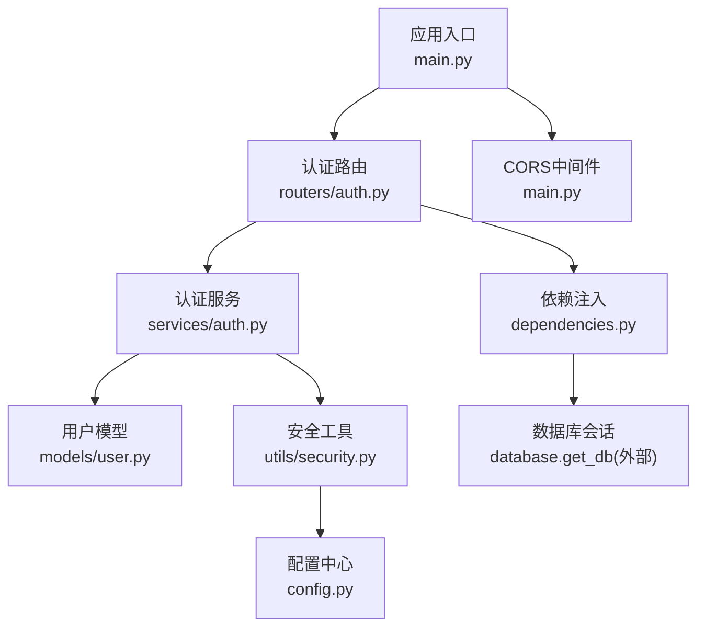
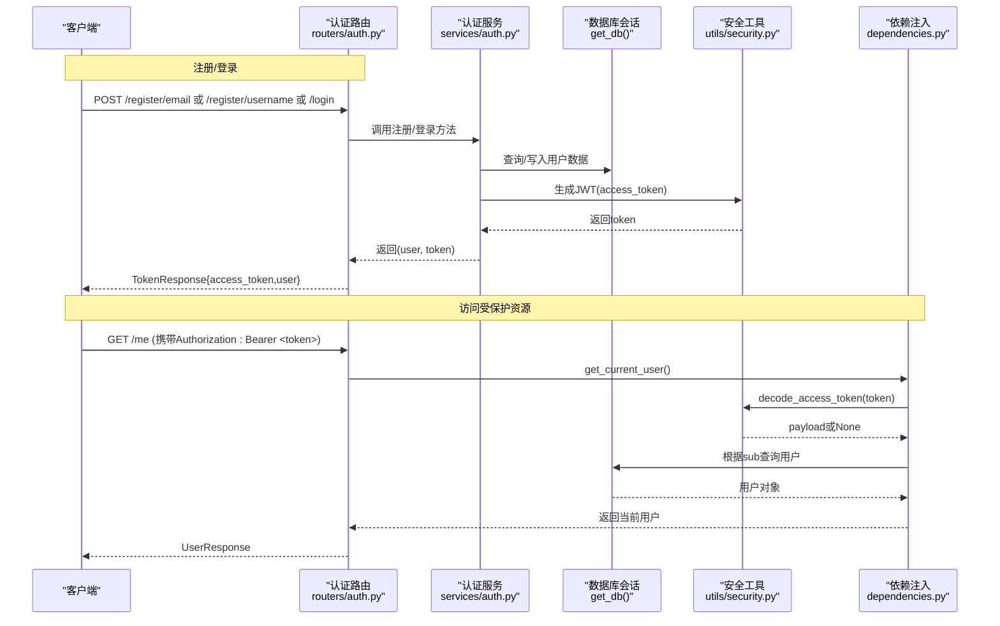
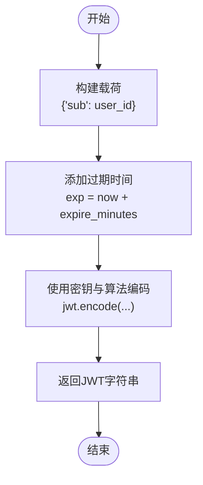
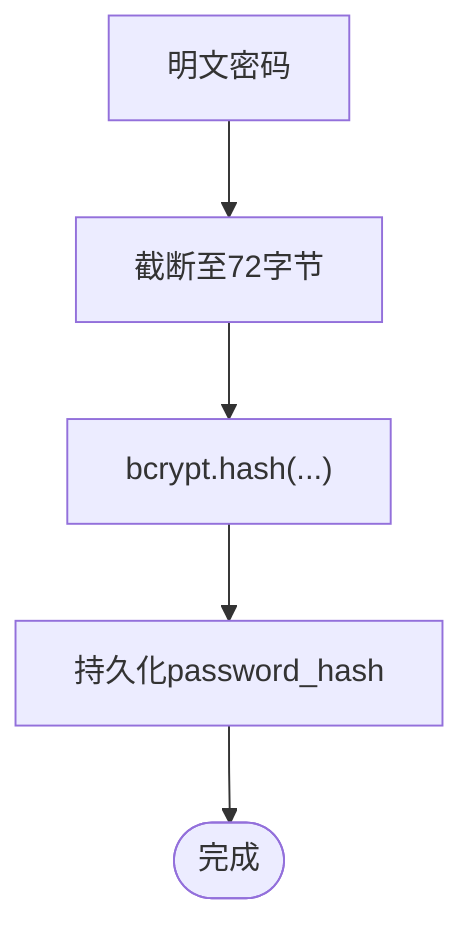
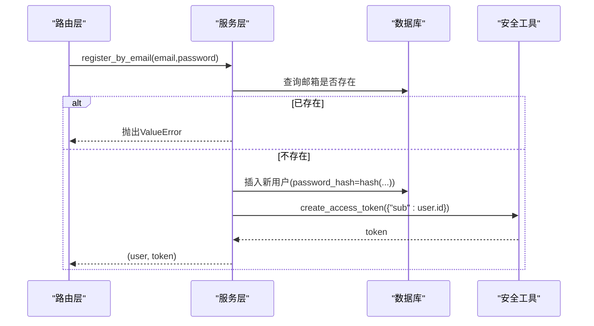
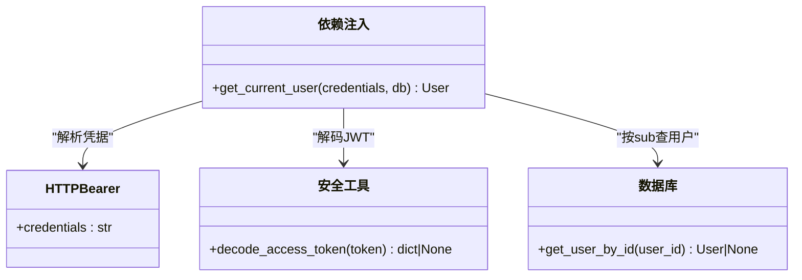
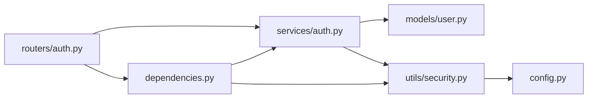

# JWT认证机制

<cite>
**本文引用的文件列表**
- [app/main.py](file://backEnd/app/main.py)
- [app/routers/auth.py](file://backEnd/app/routers/auth.py)
- [app/schemas/auth.py](file://backEnd/app/schemas/auth.py)
- [app/services/auth.py](file://backEnd/app/services/auth.py)
- [app/models/user.py](file://backEnd/app/models/user.py)
- [app/utils/security.py](file://backEnd/app/utils/security.py)
- [app/config.py](file://backEnd/app/config.py)
- [app/dependencies.py](file://backEnd/app/dependencies.py)
</cite>

## 目录
1. [简介](#简介)
2. [项目结构](#项目结构)
3. [核心组件](#核心组件)
4. [架构总览](#架构总览)
5. [详细组件分析](#详细组件分析)
6. [依赖关系分析](#依赖关系分析)
7. [性能与安全考量](#性能与安全考量)
8. [故障排查指南](#故障排查指南)
9. [结论](#结论)
10. [附录：API定义与使用示例](#附录api定义与使用示例)

## 简介
本文件围绕后端服务中的无状态JWT认证机制，系统化说明令牌的签发、验证与刷新策略，用户注册（邮箱/用户名）与登录认证的API实现，密码加密存储（bcrypt），以及基于FastAPI依赖注入的鉴权中间件用法。文档同时给出令牌安全最佳实践与常见异常处理建议，帮助读者快速理解并正确集成该认证体系。

## 项目结构
本项目采用分层组织方式：路由层负责HTTP接口与参数校验；服务层封装业务逻辑；模型层定义数据库实体；工具层提供安全能力（JWT与密码哈希）；配置层集中管理密钥与过期时间等敏感设置；依赖注入层提供统一的当前用户解析器。

图表来源
- [app/main.py:44-73](file://backEnd/app/main.py#L44-L73)
- [app/routers/auth.py:25-91](file://backEnd/app/routers/auth.py#L25-L91)
- [app/services/auth.py:1-96](file://backEnd/app/services/auth.py#L1-L96)
- [app/models/user.py:10-45](file://backEnd/app/models/user.py#L10-L45)
- [app/utils/security.py:1-48](file://backEnd/app/utils/security.py#L1-L48)
- [app/config.py:7-36](file://backEnd/app/config.py#L7-L36)
- [app/dependencies.py:10-41](file://backEnd/app/dependencies.py#L10-L41)

章节来源
- [app/main.py:44-73](file://backEnd/app/main.py#L44-L73)
- [app/routers/auth.py:25-91](file://backEnd/app/routers/auth.py#L25-L91)
- [app/services/auth.py:1-96](file://backEnd/app/services/auth.py#L1-L96)
- [app/models/user.py:10-45](file://backEnd/app/models/user.py#L10-L45)
- [app/utils/security.py:1-48](file://backEnd/app/utils/security.py#L1-L48)
- [app/config.py:7-36](file://backEnd/app/config.py#L7-L36)
- [app/dependencies.py:10-41](file://backEnd/app/dependencies.py#L10-L41)

## 核心组件
- 配置中心：集中管理JWT密钥、算法、过期时间等敏感参数，支持从环境变量或.env加载。
- 安全工具：提供bcrypt密码哈希/校验、JWT签发与解码。
- 用户模型：定义用户表结构与字段约束。
- 认证服务：封装注册、登录、资料更新、密码修改、账号注销等业务逻辑。
- 认证路由：暴露REST API，统一响应格式与错误码。
- 依赖注入：基于HTTPBearer的当前用户解析器，完成令牌校验与用户获取。

章节来源
- [app/config.py:7-36](file://backEnd/app/config.py#L7-L36)
- [app/utils/security.py:1-48](file://backEnd/app/utils/security.py#L1-L48)
- [app/models/user.py:10-45](file://backEnd/app/models/user.py#L10-L45)
- [app/services/auth.py:38-96](file://backEnd/app/services/auth.py#L38-L96)
- [app/routers/auth.py:41-91](file://backEnd/app/routers/auth.py#L41-L91)
- [app/dependencies.py:10-41](file://backEnd/app/dependencies.py#L10-L41)

## 架构总览
下图展示了从客户端发起请求到返回响应的完整调用链，包括注册、登录与受保护接口的鉴权流程。

图表来源
- [app/routers/auth.py:41-91](file://backEnd/app/routers/auth.py#L41-L91)
- [app/services/auth.py:38-96](file://backEnd/app/services/auth.py#L38-L96)
- [app/utils/security.py:26-47](file://backEnd/app/utils/security.py#L26-L47)
- [app/dependencies.py:13-41](file://backEnd/app/dependencies.py#L13-L41)

## 详细组件分析

### 令牌结构与签发/验证
- 载荷结构
  - sub：用户唯一标识（字符串ID）。
  - exp：过期时间（UTC时间戳）。
- 签名算法与密钥
  - 算法：HS256（可配置）。
  - 密钥：secret_key（从配置中心读取）。
- 过期时间
  - access_token_expire_minutes：默认24小时（分钟）。
- 签发流程
  - 将{"sub": user_id}作为基础载荷，附加exp后使用密钥与算法编码为JWT。
- 验证流程
  - 使用相同密钥与算法解码，失败则返回None；成功则返回payload。

图表来源
- [app/utils/security.py:26-36](file://backEnd/app/utils/security.py#L26-L36)
- [app/config.py:20-23](file://backEnd/app/config.py#L20-L23)

章节来源
- [app/utils/security.py:26-47](file://backEnd/app/utils/security.py#L26-L47)
- [app/config.py:20-23](file://backEnd/app/config.py#L20-L23)

### 密码加密存储（bcrypt）
- 哈希函数：bcrypt（通过passlib CryptContext）。
- 长度限制：bcrypt最大支持72字节，超出部分会被截断。
- 用途：注册时对新密码进行哈希存储；登录与改密时对旧密码进行校验。

图表来源
- [app/utils/security.py:13-23](file://backEnd/app/utils/security.py#L13-L23)

章节来源
- [app/utils/security.py:13-23](file://backEnd/app/utils/security.py#L13-L23)

### 用户模型与数据约束
- 主键：UUID字符串。
- 唯一性：username、email唯一索引。
- 激活状态：is_active用于软禁用。
- 个人资料：昵称、头像、性别、生日等可选字段。
- 时间戳：created_at、updated_at由数据库默认值维护。

章节来源
- [app/models/user.py:10-45](file://backEnd/app/models/user.py#L10-L45)

### 认证服务（注册/登录/资料更新/改密/注销）
- 注册（邮箱）
  - 检查邮箱是否已存在；若不存在，自动生成用户名（邮箱前缀，冲突则追加随机后缀）。
  - 保存用户并签发access_token。
- 注册（用户名）
  - 检查用户名是否已存在；若不存在，保存用户并签发access_token。
- 登录
  - 支持邮箱或用户名登录；校验密码与账户状态；成功后签发access_token。
- 资料更新
  - 仅更新非空字段，返回最新用户信息。
- 用户名/邮箱变更
  - 检查目标值是否被占用；更新后重新签发access_token。
- 修改密码
  - 校验旧密码；哈希新密码并保存。
- 注销账号
  - 校验密码后将is_active置为False（软删除）。

图表来源
- [app/services/auth.py:38-62](file://backEnd/app/services/auth.py#L38-L62)
- [app/utils/security.py:26-36](file://backEnd/app/utils/security.py#L26-L36)

章节来源
- [app/services/auth.py:38-96](file://backEnd/app/services/auth.py#L38-L96)

### 认证路由与请求/响应规范
- 注册
  - POST /api/auth/register/email
    - 请求体：EmailRegisterRequest（邮箱、密码，最小长度校验）。
    - 响应：TokenResponse（access_token、token_type、user）。
  - POST /api/auth/register/username
    - 请求体：UsernameRegisterRequest（用户名、密码，正则与长度校验）。
    - 响应：TokenResponse。
- 登录
  - POST /api/auth/login
    - 请求体：LoginRequest（account可为邮箱或用户名、password）。
    - 响应：TokenResponse。
- 登出
  - POST /api/auth/logout
    - 无状态设计，客户端自行丢弃token；服务端返回MessageResponse。
- 受保护接口
  - GET /api/auth/me
    - 需要Bearer Token；返回UserResponse。
- 账户设置
  - PUT /api/auth/profile：更新资料，返回UserResponse。
  - PUT /api/auth/username：更新用户名，成功后重新签发token，返回TokenResponse。
  - PUT /api/auth/email：更新邮箱，成功后重新签发token，返回TokenResponse。
  - PUT /api/auth/password：修改密码，返回MessageResponse。
  - DELETE /api/auth/account：注销账号，返回MessageResponse。
- 头像上传
  - POST /api/auth/avatar：校验类型与大小，保存文件并更新avatar路径，返回UserResponse。

章节来源
- [app/routers/auth.py:41-217](file://backEnd/app/routers/auth.py#L41-L217)
- [app/schemas/auth.py:9-119](file://backEnd/app/schemas/auth.py#L9-L119)

### 依赖注入与鉴权中间件
- HTTPBearer方案
  - 使用HTTPBearer从请求头提取Authorization: Bearer <token>。
- get_current_user解析器
  - 解码token，校验载荷有效性；根据sub查询用户并检查is_active；失败返回401。
- 使用方式
  - 在路由函数中通过Depends(get_current_user)声明依赖，即可自动完成鉴权与用户注入。

图表来源
- [app/dependencies.py:10-41](file://backEnd/app/dependencies.py#L10-L41)
- [app/utils/security.py:39-47](file://backEnd/app/utils/security.py#L39-L47)
- [app/services/auth.py:23-25](file://backEnd/app/services/auth.py#L23-L25)

章节来源
- [app/dependencies.py:10-41](file://backEnd/app/dependencies.py#L10-L41)

## 依赖关系分析
- 路由层依赖服务层与依赖注入解析器。
- 服务层依赖模型与工具层。
- 工具层依赖配置中心。
- 依赖注入层依赖工具层与数据库会话。

图表来源
- [app/routers/auth.py:1-24](file://backEnd/app/routers/auth.py#L1-L24)
- [app/services/auth.py:1-11](file://backEnd/app/services/auth.py#L1-L11)
- [app/utils/security.py:1-8](file://backEnd/app/utils/security.py#L1-L8)
- [app/config.py:1-11](file://backEnd/app/config.py#L1-L11)
- [app/dependencies.py:1-9](file://backEnd/app/dependencies.py#L1-L9)

章节来源
- [app/routers/auth.py:1-24](file://backEnd/app/routers/auth.py#L1-L24)
- [app/services/auth.py:1-11](file://backEnd/app/services/auth.py#L1-L11)
- [app/utils/security.py:1-8](file://backEnd/app/utils/security.py#L1-L8)
- [app/config.py:1-11](file://backEnd/app/config.py#L1-L11)
- [app/dependencies.py:1-9](file://backEnd/app/dependencies.py#L1-L9)

## 性能与安全考量
- 令牌刷新策略
  - 当前实现为单令牌（access_token）模式，未实现refresh_token。建议在后续版本引入双令牌机制：短生命周期access_token配合长生命周期refresh_token，并提供专门的刷新端点。
- 密钥管理
  - secret_key必须从环境变量或安全的配置中心加载，严禁硬编码；生产环境应定期轮换。
- 传输安全
  - 强制HTTPS，避免中间人攻击；前端应在安全Cookie或内存中存储token，避免localStorage长期留存。
- 防重放攻击
  - 可在请求中加入nonce或时间戳+签名，服务端校验时间窗口与一次性标记；对关键操作增加幂等键。
- 速率限制与防爆破
  - 对登录与注册接口实施IP级与用户级限流，防止暴力破解。
- 密码强度与历史
  - 增强密码复杂度校验，记录密码历史，禁止重复使用近期密码。
- 日志与审计
  - 记录认证事件（登录成功/失败、密码修改、账号注销），但避免记录敏感内容（如密码、token）。

[本节为通用指导，不直接分析具体文件]

## 故障排查指南
- 401 无效认证凭据
  - 可能原因：缺少Authorization头、Bearer格式不正确、token损坏或过期。
  - 定位：检查依赖注入层的解码与用户查询逻辑。
- 401 无效的Token载荷
  - 可能原因：token中没有sub字段或载荷结构异常。
  - 定位：检查签发逻辑是否正确写入sub。
- 401 用户不存在或已被禁用
  - 可能原因：用户被软禁用或ID不存在。
  - 定位：检查is_active状态与用户ID映射。
- 400 账号或密码错误
  - 可能原因：账号不存在、密码错误或账户被禁用。
  - 定位：检查登录服务的校验分支。
- 400 该邮箱/用户名已被注册或占用
  - 可能原因：唯一性冲突。
  - 定位：检查注册与更新逻辑的唯一性校验。
- 422 请求体验证失败
  - 可能原因：字段缺失、类型不符、长度不满足、正则不匹配。
  - 定位：查看Pydantic校验规则与自定义validator。

章节来源
- [app/dependencies.py:13-41](file://backEnd/app/dependencies.py#L13-L41)
- [app/services/auth.py:85-96](file://backEnd/app/services/auth.py#L85-L96)
- [app/routers/auth.py:41-176](file://backEnd/app/routers/auth.py#L41-L176)
- [app/schemas/auth.py:9-119](file://backEnd/app/schemas/auth.py#L9-L119)

## 结论
本项目实现了基于JWT的无状态认证，具备清晰的注册/登录流程、严格的参数校验、安全的密码存储与便捷的依赖注入鉴权。当前为单令牌模式，建议后续引入refresh_token以提升用户体验与安全性。生产部署需重点关注密钥管理、HTTPS、限流与审计等安全措施。

[本节为总结，不直接分析具体文件]

## 附录：API定义与使用示例

### 认证相关API一览
- 注册（邮箱）
  - 方法：POST
  - 路径：/api/auth/register/email
  - 请求体：EmailRegisterRequest
  - 响应：TokenResponse
- 注册（用户名）
  - 方法：POST
  - 路径：/api/auth/register/username
  - 请求体：UsernameRegisterRequest
  - 响应：TokenResponse
- 登录
  - 方法：POST
  - 路径：/api/auth/login
  - 请求体：LoginRequest
  - 响应：TokenResponse
- 登出
  - 方法：POST
  - 路径：/api/auth/logout
  - 响应：MessageResponse
- 获取当前用户
  - 方法：GET
  - 路径：/api/auth/me
  - 鉴权：Bearer Token
  - 响应：UserResponse
- 更新资料
  - 方法：PUT
  - 路径：/api/auth/profile
  - 鉴权：Bearer Token
  - 请求体：ProfileUpdateRequest
  - 响应：UserResponse
- 更新用户名
  - 方法：PUT
  - 路径：/api/auth/username
  - 鉴权：Bearer Token
  - 请求体：UpdateUsernameRequest
  - 响应：TokenResponse
- 更新邮箱
  - 方法：PUT
  - 路径：/api/auth/email
  - 鉴权：Bearer Token
  - 请求体：UpdateEmailRequest
  - 响应：TokenResponse
- 修改密码
  - 方法：PUT
  - 路径：/api/auth/password
  - 鉴权：Bearer Token
  - 请求体：ChangePasswordRequest
  - 响应：MessageResponse
- 注销账号
  - 方法：DELETE
  - 路径：/api/auth/account
  - 鉴权：Bearer Token
  - 请求体：DeleteAccountRequest
  - 响应：MessageResponse
- 上传头像
  - 方法：POST
  - 路径：/api/auth/avatar
  - 鉴权：Bearer Token
  - 请求体：multipart/form-data（file）
  - 响应：UserResponse

章节来源
- [app/routers/auth.py:41-217](file://backEnd/app/routers/auth.py#L41-L217)
- [app/schemas/auth.py:9-119](file://backEnd/app/schemas/auth.py#L9-L119)

### 依赖注入使用示例
- 在路由函数中声明依赖：
  - current_user: User = Depends(get_current_user)
- 作用：
  - 自动从请求头解析Bearer Token，校验并返回当前用户对象；失败则返回401。

章节来源
- [app/dependencies.py:13-41](file://backEnd/app/dependencies.py#L13-L41)
- [app/routers/auth.py:89-114](file://backEnd/app/routers/auth.py#L89-L114)