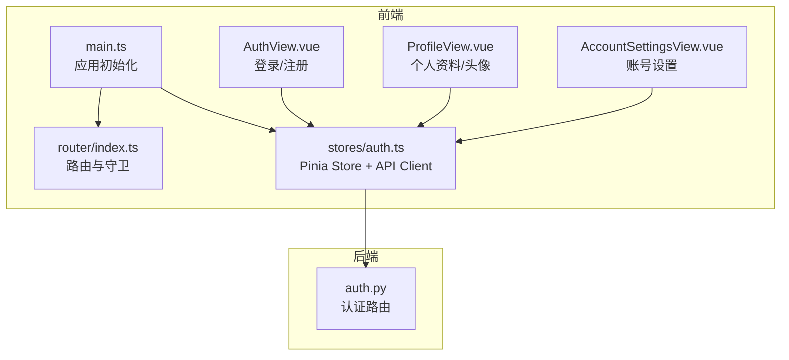
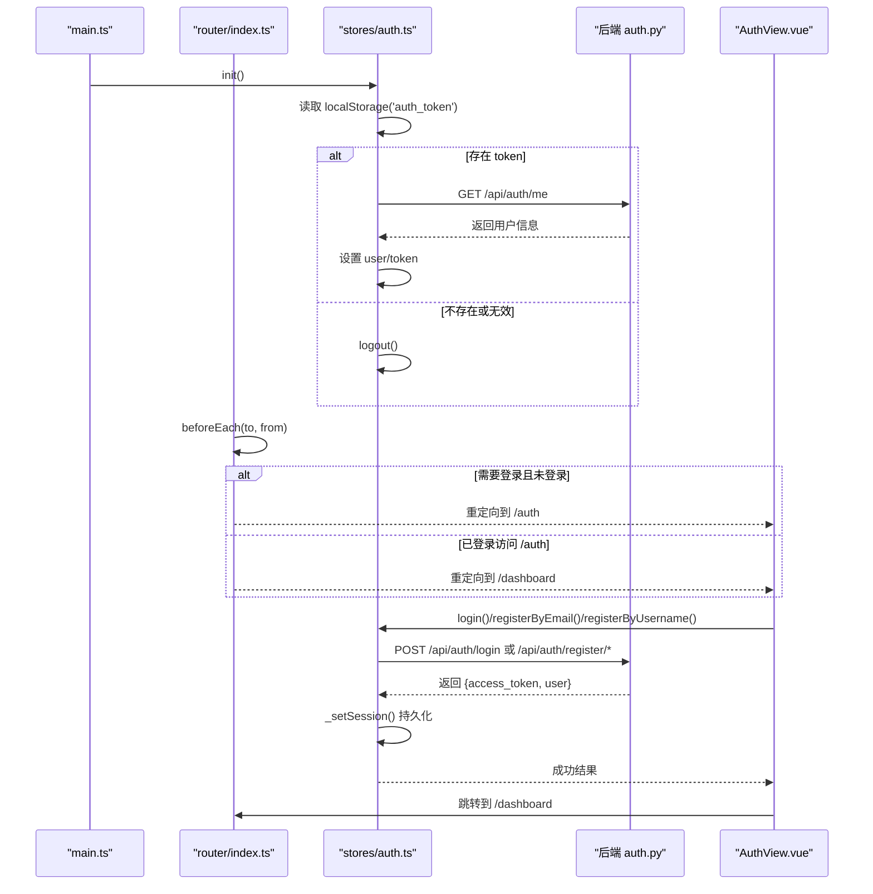
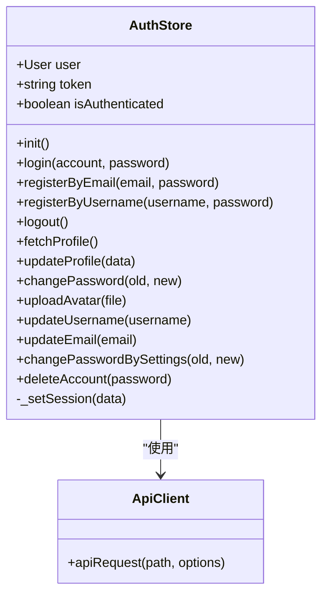
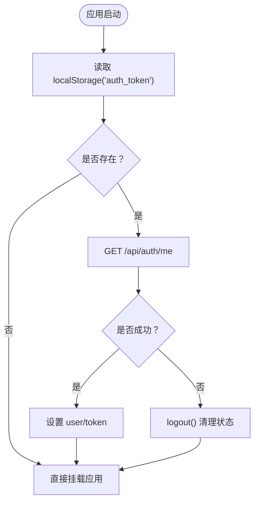
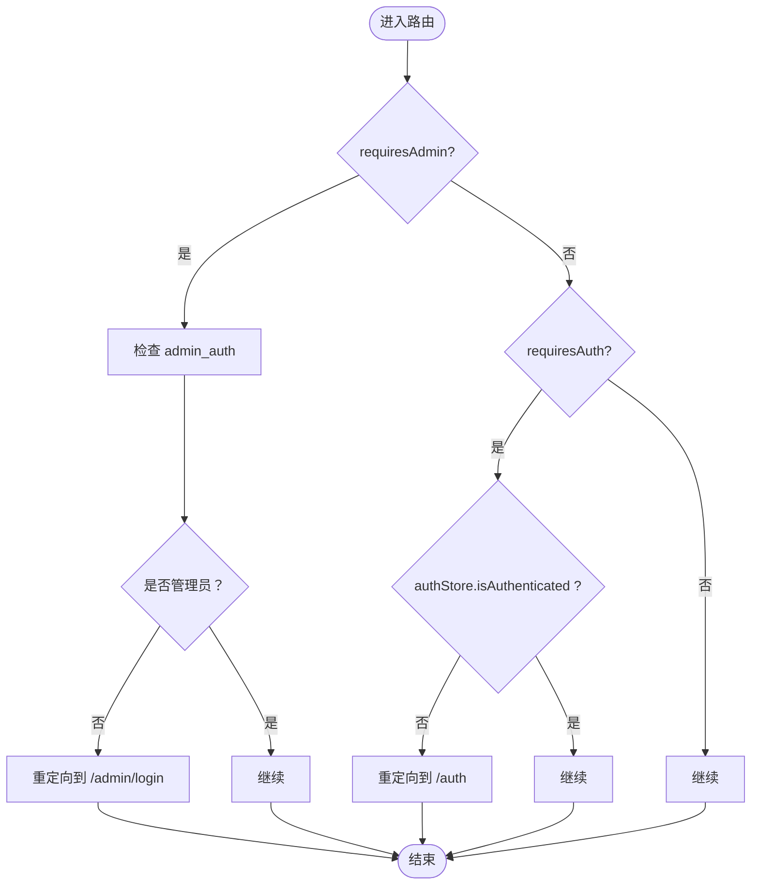
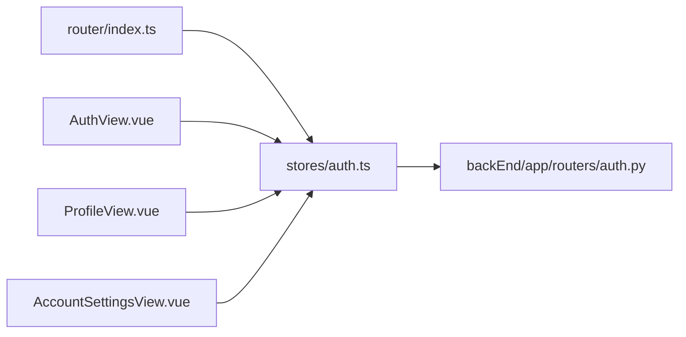

# 前端状态管理

<cite>
**本文引用的文件**
- [frontEnd/src/stores/auth.ts](file://frontEnd/src/stores/auth.ts)
- [frontEnd/src/router/index.ts](file://frontEnd/src/router/index.ts)
- [frontEnd/src/views/AuthView.vue](file://frontEnd/src/views/AuthView.vue)
- [frontEnd/src/views/ProfileView.vue](file://frontEnd/src/views/ProfileView.vue)
- [frontEnd/src/views/AccountSettingsView.vue](file://frontEnd/src/views/AccountSettingsView.vue)
- [frontEnd/src/main.ts](file://frontEnd/src/main.ts)
- [backEnd/app/routers/auth.py](file://backEnd/app/routers/auth.py)
</cite>

## 目录
1. [简介](#简介)
2. [项目结构](#项目结构)
3. [核心组件](#核心组件)
4. [架构总览](#架构总览)
5. [详细组件分析](#详细组件分析)
6. [依赖关系分析](#依赖关系分析)
7. [性能与体验优化](#性能与体验优化)
8. [故障排查指南](#故障排查指南)
9. [结论](#结论)
10. [附录](#附录)

## 简介
本文件聚焦 HR XF 前端认证状态管理，围绕 Pinia store 的设计模式、用户登录态的本地持久化、路由守卫与权限控制、前后端认证同步策略、错误处理与网络异常恢复，以及认证相关 UI 组件的使用模式进行系统化说明。目标是帮助开发者快速理解并扩展认证能力，同时提供可落地的最佳实践建议。

## 项目结构
认证相关的前端代码主要分布在以下位置：
- 状态管理与 API 客户端：stores/auth.ts
- 应用初始化与启动流程：main.ts
- 路由与全局守卫：router/index.ts
- 认证页面与交互：views/AuthView.vue
- 个人资料与头像上传：views/ProfileView.vue
- 账号设置（用户名/邮箱/密码/注销）：views/AccountSettingsView.vue
- 后端认证接口定义（参考）：backEnd/app/routers/auth.py

图表来源
- [frontEnd/src/main.ts:1-19](file://frontEnd/src/main.ts#L1-L19)
- [frontEnd/src/router/index.ts:1-167](file://frontEnd/src/router/index.ts#L1-L167)
- [frontEnd/src/stores/auth.ts:1-314](file://frontEnd/src/stores/auth.ts#L1-L314)
- [frontEnd/src/views/AuthView.vue:1-418](file://frontEnd/src/views/AuthView.vue#L1-L418)
- [frontEnd/src/views/ProfileView.vue:1-610](file://frontEnd/src/views/ProfileView.vue#L1-L610)
- [frontEnd/src/views/AccountSettingsView.vue:1-263](file://frontEnd/src/views/AccountSettingsView.vue#L1-L263)
- [backEnd/app/routers/auth.py:42-157](file://backEnd/app/routers/auth.py#L42-L157)

章节来源
- [frontEnd/src/main.ts:1-19](file://frontEnd/src/main.ts#L1-L19)
- [frontEnd/src/router/index.ts:1-167](file://frontEnd/src/router/index.ts#L1-L167)
- [frontEnd/src/stores/auth.ts:1-314](file://frontEnd/src/stores/auth.ts#L1-L314)

## 核心组件
- Pinia Store（auth.ts）
  - 状态：user、token、isAuthenticated
  - 生命周期：init 在应用启动时恢复本地 token 并校验有效性
  - 异步操作：login/register/* 等统一通过 apiRequest 发起请求，成功后调用 _setSession 持久化
  - 持久化：localStorage 保存 auth_token 与 auth_user
  - 登出清理：logout 清空内存状态与本地存储
- 路由守卫（router/index.ts）
  - requiresAuth：未登录跳转 /auth；已登录访问 /auth 重定向到 /dashboard
  - requiresAdmin：管理员路由需检查 admin_auth 标记
- 认证视图（AuthView.vue）
  - 表单校验、提交后调用 store 方法，成功后导航至 /dashboard
- 资料与设置（ProfileView.vue、AccountSettingsView.vue）
  - 读取/更新 user，头像上传、修改用户名/邮箱/密码、注销账号

章节来源
- [frontEnd/src/stores/auth.ts:65-314](file://frontEnd/src/stores/auth.ts#L65-L314)
- [frontEnd/src/router/index.ts:136-164](file://frontEnd/src/router/index.ts#L136-L164)
- [frontEnd/src/views/AuthView.vue:247-417](file://frontEnd/src/views/AuthView.vue#L247-L417)
- [frontEnd/src/views/ProfileView.vue:337-525](file://frontEnd/src/views/ProfileView.vue#L337-L525)
- [frontEnd/src/views/AccountSettingsView.vue:160-262](file://frontEnd/src/views/AccountSettingsView.vue#L160-L262)

## 架构总览
下图展示了从应用启动到认证状态恢复、路由守卫拦截、用户操作的完整流程。

图表来源
- [frontEnd/src/main.ts:14-18](file://frontEnd/src/main.ts#L14-L18)
- [frontEnd/src/stores/auth.ts:72-83](file://frontEnd/src/stores/auth.ts#L72-L83)
- [frontEnd/src/stores/auth.ts:119-134](file://frontEnd/src/stores/auth.ts#L119-L134)
- [frontEnd/src/stores/auth.ts:85-117](file://frontEnd/src/stores/auth.ts#L85-L117)
- [frontEnd/src/stores/auth.ts:288-293](file://frontEnd/src/stores/auth.ts#L288-L293)
- [frontEnd/src/router/index.ts:136-164](file://frontEnd/src/router/index.ts#L136-L164)
- [frontEnd/src/views/AuthView.vue:384-416](file://frontEnd/src/views/AuthView.vue#L384-L416)
- [backEnd/app/routers/auth.py:69-91](file://backEnd/app/routers/auth.py#L69-L91)

## 详细组件分析

### Pinia Store 设计模式与数据流
- 状态定义
  - user: 当前用户对象
  - token: 当前访问令牌
  - isAuthenticated: 基于 token 与 user 的计算属性
- 初始化与恢复
  - init 在应用启动时读取本地 token，若存在则调用 /auth/me 验证有效性；失败则执行 logout
- 登录/注册
  - login/registerByEmail/registerByUsername 调用统一 apiRequest，成功后通过 _setSession 写入内存与本地存储
- 个人资料与头像
  - fetchProfile/updateProfile/uploadAvatar 均会更新 user 并持久化 auth_user
- 账号设置
  - updateUsername/updateEmail 会返回新 token，_setSession 刷新本地 token
  - changePassword/changePasswordBySettings/deleteAccount 分别对应密码修改与账号注销
- 登出清理
  - logout 清空 user、token 与本地存储

图表来源
- [frontEnd/src/stores/auth.ts:65-314](file://frontEnd/src/stores/auth.ts#L65-L314)

章节来源
- [frontEnd/src/stores/auth.ts:65-314](file://frontEnd/src/stores/auth.ts#L65-L314)

### 用户登录状态的本地存储与恢复
- 存储键
  - auth_token：访问令牌
  - auth_user：用户对象 JSON
- 恢复流程
  - main.ts 中调用 authStore.init()，等待完成后再挂载应用，确保路由守卫能正确判断登录态
- 失效处理
  - init 调用 /auth/me 失败时触发 logout，清除本地存储与内存状态

图表来源
- [frontEnd/src/main.ts:14-18](file://frontEnd/src/main.ts#L14-L18)
- [frontEnd/src/stores/auth.ts:72-83](file://frontEnd/src/stores/auth.ts#L72-L83)
- [frontEnd/src/stores/auth.ts:137-142](file://frontEnd/src/stores/auth.ts#L137-L142)

章节来源
- [frontEnd/src/main.ts:14-18](file://frontEnd/src/main.ts#L14-L18)
- [frontEnd/src/stores/auth.ts:72-83](file://frontEnd/src/stores/auth.ts#L72-L83)
- [frontEnd/src/stores/auth.ts:137-142](file://frontEnd/src/stores/auth.ts#L137-L142)

### 令牌自动刷新机制
- 现状说明
  - 当前实现为无状态 JWT，服务端未提供 refresh token 接口；修改用户名/邮箱时会返回新 token，客户端通过 _setSession 刷新本地 token
- 建议方案（概念性）
  - 引入双令牌模型：access_token 短时效，refresh_token 长时效
  - 在 apiRequest 中捕获 401 响应，尝试调用 /auth/refresh 获取新 access_token，然后重试原请求
  - 刷新失败则执行 logout 并引导重新登录
  - 注意并发请求去抖与队列重试，避免重复刷新

[本节为通用建议，不直接分析具体文件]

### 登出清理逻辑
- 行为
  - 清空 user、token 内存状态
  - 移除 auth_token 与 auth_user 本地存储
- 触发点
  - 手动登出、init 校验失败、注销账号成功

章节来源
- [frontEnd/src/stores/auth.ts:137-142](file://frontEnd/src/stores/auth.ts#L137-L142)
- [frontEnd/src/stores/auth.ts:72-83](file://frontEnd/src/stores/auth.ts#L72-L83)
- [frontEnd/src/stores/auth.ts:270-284](file://frontEnd/src/stores/auth.ts#L270-L284)

### Vue 组件中的认证状态使用模式
- 计算属性
  - ProfileView 使用 computed(() => authStore.user) 将用户信息绑定到模板
- 监听器
  - 可在需要时 watch(authStore.user, ...) 以响应登录态变化（例如切换布局、加载用户专属数据）
- 事件驱动
  - AuthView 在提交后调用 store 的 login/register 方法，根据返回结果导航或提示
- 副作用处理
  - 头像上传成功后，store 更新 user 并持久化，组件无需额外处理即可反映最新状态

章节来源
- [frontEnd/src/views/ProfileView.vue:342-344](file://frontEnd/src/views/ProfileView.vue#L342-L344)
- [frontEnd/src/views/AuthView.vue:384-416](file://frontEnd/src/views/AuthView.vue#L384-L416)

### 路由守卫的实现与页面访问控制
- 普通用户保护
  - requiresAuth：未登录跳转 /auth；已登录访问 /auth 重定向到 /dashboard
- 管理员保护
  - requiresAdmin：检查 localStorage 的 admin_auth 是否为 true，否则跳转 /admin/login
- 已登录管理员访问登录页
  - 直接重定向到 /admin/dashboard

图表来源
- [frontEnd/src/router/index.ts:136-164](file://frontEnd/src/router/index.ts#L136-L164)

章节来源
- [frontEnd/src/router/index.ts:136-164](file://frontEnd/src/router/index.ts#L136-L164)

### 前后端认证状态同步的最佳实践
- 请求头注入
  - apiRequest 自动从 localStorage 读取 auth_token 并附加 Authorization 头
- 错误处理
  - 非 2xx 响应抛出包含 detail 的错误消息，供上层统一处理
- 网络异常恢复
  - 建议在 apiRequest 层增加重试与超时控制，对 401 做刷新/登出分流
- 会话一致性
  - 修改用户名/邮箱后，服务端返回新 token，客户端通过 _setSession 保持前后端一致

章节来源
- [frontEnd/src/stores/auth.ts:37-61](file://frontEnd/src/stores/auth.ts#L37-L61)
- [backEnd/app/routers/auth.py:117-146](file://backEnd/app/routers/auth.py#L117-L146)

### 认证相关的 UI 组件开发指南与交互优化
- 表单校验与反馈
  - AuthView 实现了字段级校验与全局错误/成功消息展示，建议复用该模式
- 密码强度提示
  - 注册时提供实时强度指示与规则说明，提升用户体验
- 头像上传
  - ProfileView 支持预览与上传，上传成功后即时更新用户头像与颜色
- 禁用态与加载态
  - 按钮在提交期间禁用，避免重复提交
- 导航时机
  - 成功登录后延迟短暂时间再跳转，便于用户看到成功提示

章节来源
- [frontEnd/src/views/AuthView.vue:271-382](file://frontEnd/src/views/AuthView.vue#L271-L382)
- [frontEnd/src/views/AuthView.vue:384-416](file://frontEnd/src/views/AuthView.vue#L384-L416)
- [frontEnd/src/views/ProfileView.vue:455-476](file://frontEnd/src/views/ProfileView.vue#L455-L476)

## 依赖关系分析
- 模块耦合
  - router 依赖 auth store 的 isAuthenticated 判断
  - 各视图通过 useAuthStore 访问状态与方法
  - stores/auth.ts 内部封装了 apiRequest，屏蔽底层 fetch 细节
- 外部依赖
  - Pinia 用于状态管理
  - Vue Router 用于导航与守卫
  - 浏览器 localStorage 用于持久化
- 潜在风险
  - 当前未在 apiRequest 中处理 401 刷新逻辑，可能导致部分请求失败后需用户重新登录
  - 管理员登录态与用户登录态分离（admin_auth），需注意跨域与安全性

图表来源
- [frontEnd/src/router/index.ts:1-167](file://frontEnd/src/router/index.ts#L1-167)
- [frontEnd/src/stores/auth.ts:1-314](file://frontEnd/src/stores/auth.ts#L1-314)
- [frontEnd/src/views/AuthView.vue:1-418](file://frontEnd/src/views/AuthView.vue#L1-L418)
- [frontEnd/src/views/ProfileView.vue:1-610](file://frontEnd/src/views/ProfileView.vue#L1-L610)
- [frontEnd/src/views/AccountSettingsView.vue:1-263](file://frontEnd/src/views/AccountSettingsView.vue#L1-L263)
- [backEnd/app/routers/auth.py:42-157](file://backEnd/app/routers/auth.py#L42-L157)

章节来源
- [frontEnd/src/router/index.ts:1-167](file://frontEnd/src/router/index.ts#L1-167)
- [frontEnd/src/stores/auth.ts:1-314](file://frontEnd/src/stores/auth.ts#L1-L314)

## 性能与体验优化
- 减少不必要的请求
  - 仅在必要时调用 fetchProfile，避免频繁拉取
- 合并状态更新
  - 批量更新 profile 时尽量一次提交，减少往返
- 图片上传优化
  - 上传前压缩图片，显示进度与错误提示
- 路由懒加载
  - 现有路由已采用动态导入，有助于首屏性能
- 错误提示友好化
  - 将后端 detail 映射为用户可读提示，并提供重试入口

[本节为通用建议，不直接分析具体文件]

## 故障排查指南
- 常见问题
  - 登录后仍被重定向到 /auth：检查 localStorage 是否包含 auth_token，确认 init 是否成功
  - 修改用户名/邮箱后仍显示旧信息：确认 _setSession 是否被调用，检查后端是否返回新 token
  - 头像上传失败：查看 uploadAvatar 的错误分支，确认服务端返回的 detail
- 定位步骤
  - 打开控制台查看网络请求与响应体
  - 检查 localStorage 的 auth_token 与 auth_user 是否正确
  - 在路由守卫处打印 isAuthenticated 值，确认状态一致性

章节来源
- [frontEnd/src/stores/auth.ts:37-61](file://frontEnd/src/stores/auth.ts#L37-L61)
- [frontEnd/src/stores/auth.ts:189-218](file://frontEnd/src/stores/auth.ts#L189-L218)
- [frontEnd/src/stores/auth.ts:288-293](file://frontEnd/src/stores/auth.ts#L288-L293)
- [frontEnd/src/router/index.ts:136-164](file://frontEnd/src/router/index.ts#L136-L164)

## 结论
当前前端认证体系以 Pinia 为核心，结合路由守卫与 localStorage 实现了基本的登录态恢复与页面访问控制。建议在后续迭代中引入双令牌与统一的 401 刷新策略，增强网络异常恢复能力，并通过更完善的错误提示与加载态提升用户体验。

## 附录
- 关键接口路径（前端调用）
  - /api/auth/login
  - /api/auth/register/email
  - /api/auth/register/username
  - /api/auth/me
  - /api/auth/profile
  - /api/auth/password
  - /api/auth/avatar
  - /api/auth/username
  - /api/auth/email
  - /api/auth/account

章节来源
- [frontEnd/src/stores/auth.ts:85-134](file://frontEnd/src/stores/auth.ts#L85-L134)
- [frontEnd/src/stores/auth.ts:144-218](file://frontEnd/src/stores/auth.ts#L144-L218)
- [frontEnd/src/stores/auth.ts:222-284](file://frontEnd/src/stores/auth.ts#L222-L284)
- [backEnd/app/routers/auth.py:42-157](file://backEnd/app/routers/auth.py#L42-L157)