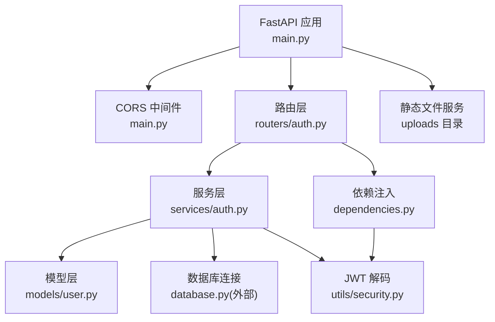
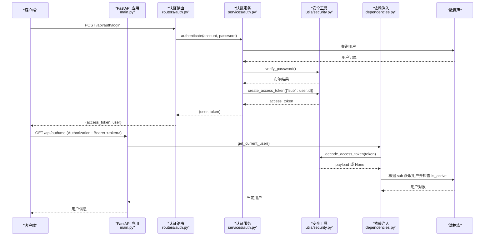
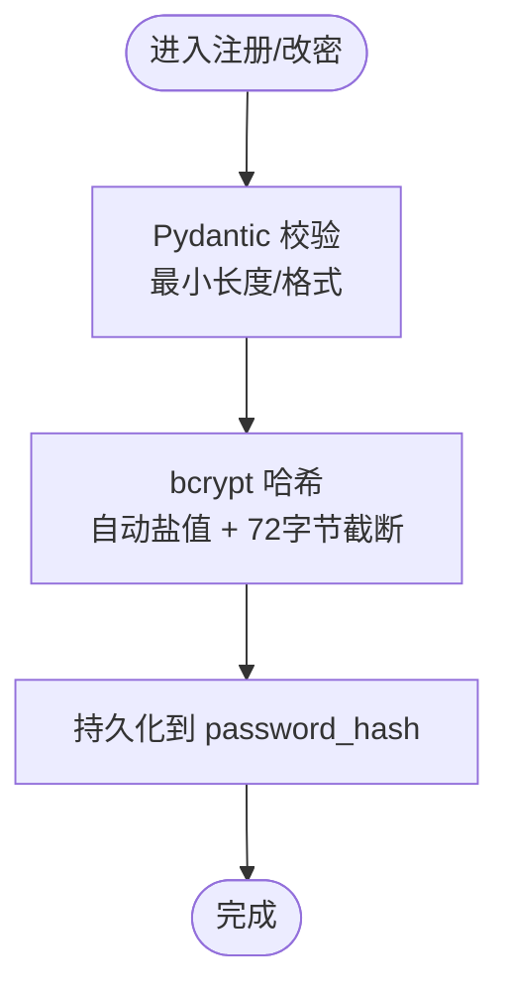
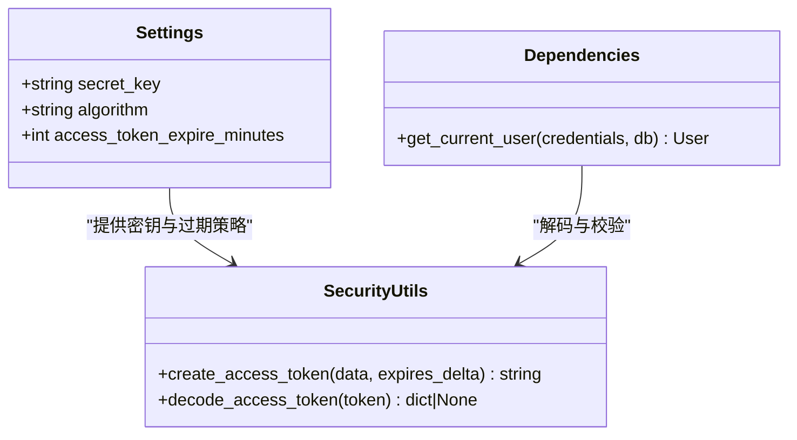
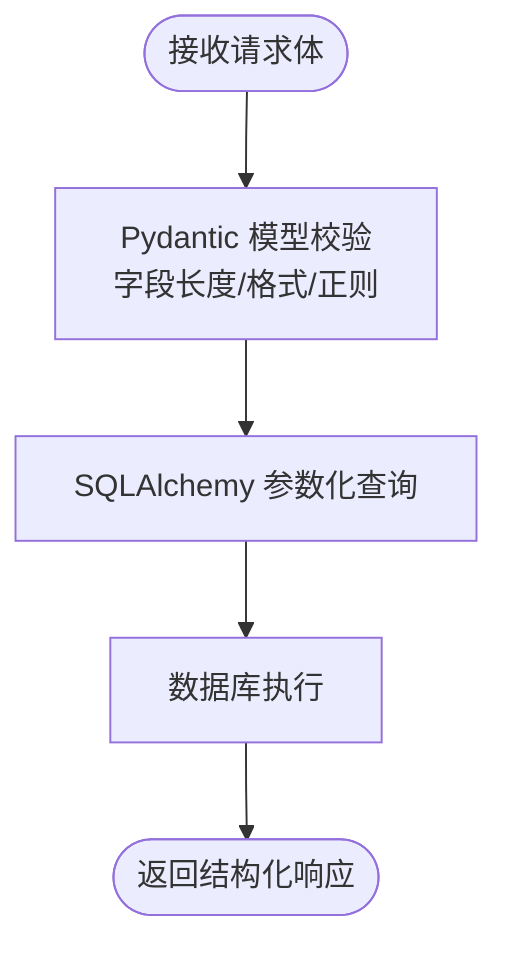
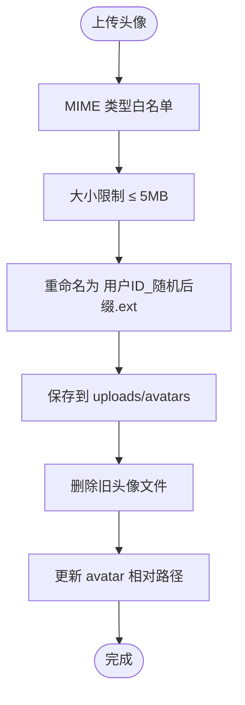
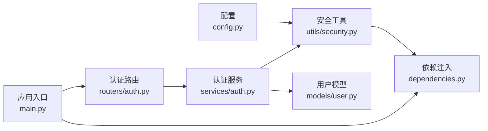

# 安全最佳实践

<cite>
**本文引用的文件**   
- [main.py](file://backEnd/app/main.py)
- [config.py](file://backEnd/app/config.py)
- [dependencies.py](file://backEnd/app/dependencies.py)
- [security.py](file://backEnd/app/utils/security.py)
- [auth.py](file://backEnd/app/routers/auth.py)
- [auth_service.py](file://backEnd/app/services/auth.py)
- [user.py](file://backEnd/app/models/user.py)
- [requirements.txt](file://backEnd/requirements.txt)
</cite>

## 目录
1. [简介](#简介)
2. [项目结构](#项目结构)
3. [核心组件](#核心组件)
4. [架构总览](#架构总览)
5. [详细组件分析](#详细组件分析)
6. [依赖关系分析](#依赖关系分析)
7. [性能与安全权衡](#性能与安全权衡)
8. [故障排查指南](#故障排查指南)
9. [结论](#结论)
10. [附录](#附录)

## 简介
本文件面向 HR XF 认证系统的安全最佳实践，聚焦以下方面：密码安全存储（bcrypt、盐值、强度校验）、JWT 令牌安全配置（密钥管理、过期策略、撤销机制）、输入验证与 SQL 注入防护（Pydantic 校验、参数化查询）、XSS 与 CORS 配置、HTTPS 强制启用、文件上传安全检查、会话劫持与 CSRF 防护、暴力破解防护、安全审计与漏洞扫描建议。文档结合仓库中实际实现进行说明，并给出可操作的改进建议与可视化图示。

## 项目结构
后端采用 FastAPI + SQLAlchemy 异步 ORM，认证相关代码集中在 routers、services、utils、schemas 等模块；CORS 在应用启动时挂载中间件；静态资源通过 StaticFiles 暴露上传目录。

图表来源
- [main.py:50-73](file://backEnd/app/main.py#L50-L73)
- [auth.py:1-217](file://backEnd/app/routers/auth.py#L1-L217)
- [auth_service.py:1-174](file://backEnd/app/services/auth.py#L1-L174)
- [user.py:1-45](file://backEnd/app/models/user.py#L1-L45)
- [security.py:1-48](file://backEnd/app/utils/security.py#L1-L48)
- [dependencies.py:1-41](file://backEnd/app/dependencies.py#L1-L41)

章节来源
- [main.py:44-73](file://backEnd/app/main.py#L44-L73)
- [auth.py:1-217](file://backEnd/app/routers/auth.py#L1-L217)
- [auth_service.py:1-174](file://backEnd/app/services/auth.py#L1-L174)
- [user.py:1-45](file://backEnd/app/models/user.py#L1-L45)
- [security.py:1-48](file://backEnd/app/utils/security.py#L1-L48)
- [dependencies.py:1-41](file://backEnd/app/dependencies.py#L1-L41)

## 核心组件
- 密码安全存储：使用 passlib 的 bcrypt 上下文对密码进行哈希，自动处理盐值生成与算法版本兼容。
- JWT 令牌：基于 python-jose 的 HS256 对称签名，包含 exp 过期时间，载荷仅携带用户标识。
- 输入验证：Pydantic 模型与自定义字段校验器统一约束请求体格式与业务规则。
- 认证依赖：HTTPBearer 方案解析 Authorization 头，解码 JWT 并校验用户状态。
- 跨域控制：CORS 中间件按白名单允许来源、方法与头部。
- 文件上传：头像上传限制类型与大小，旧文件清理，路径规范化。

章节来源
- [security.py:10-24](file://backEnd/app/utils/security.py#L10-L24)
- [security.py:26-47](file://backEnd/app/utils/security.py#L26-L47)
- [dependencies.py:10-41](file://backEnd/app/dependencies.py#L10-L41)
- [main.py:52-58](file://backEnd/app/main.py#L52-L58)
- [auth.py:182-216](file://backEnd/app/routers/auth.py#L182-L216)

## 架构总览
下图展示一次受保护接口的调用流程，包括 JWT 签发、校验与用户状态检查。

图表来源
- [auth.py:69-80](file://backEnd/app/routers/auth.py#L69-L80)
- [auth_service.py:85-96](file://backEnd/app/services/auth.py#L85-L96)
- [security.py:26-47](file://backEnd/app/utils/security.py#L26-L47)
- [dependencies.py:13-41](file://backEnd/app/dependencies.py#L13-L41)

## 详细组件分析

### 密码安全存储（bcrypt）
- 算法与盐值：使用 passlib 的 CryptContext(schemes=["bcrypt"])，每次哈希自动生成随机盐值，无需手动管理。
- 长度截断：为兼容 bcrypt 最大 72 字节限制，对明文进行 UTF-8 编码后截断至 72 字节再哈希。
- 强度校验：注册与修改密码接口通过 Pydantic 字段校验器要求最小长度（至少 6 位），建议后续增强复杂度规则（大小写、数字、特殊字符）。
- 存储字段：User.password_hash 使用 String(255) 存储 bcrypt 输出。

图表来源
- [security.py:13-24](file://backEnd/app/utils/security.py#L13-L24)
- [auth_service.py:52-62](file://backEnd/app/services/auth.py#L52-L62)
- [auth_service.py:148-160](file://backEnd/app/services/auth.py#L148-L160)
- [user.py:24](file://backEnd/app/models/user.py#L24)
- [auth.py:41-52](file://backEnd/app/routers/auth.py#L41-L52)
- [auth.py:149-161](file://backEnd/app/routers/auth.py#L149-L161)

章节来源
- [security.py:10-24](file://backEnd/app/utils/security.py#L10-L24)
- [auth_service.py:52-62](file://backEnd/app/services/auth.py#L52-L62)
- [auth_service.py:148-160](file://backEnd/app/services/auth.py#L148-L160)
- [user.py:24](file://backEnd/app/models/user.py#L24)
- [auth.py:41-52](file://backEnd/app/routers/auth.py#L41-L52)
- [auth.py:149-161](file://backEnd/app/routers/auth.py#L149-L161)

### JWT 令牌安全配置
- 密钥管理：secret_key 与 algorithm 从配置读取，默认使用 HS256。生产环境必须替换为强随机密钥，并通过环境变量或密钥管理服务注入。
- 过期策略：access_token_expire_minutes 控制有效期，默认 24 小时。建议缩短访问令牌有效期并结合刷新令牌机制。
- 载荷设计：仅包含用户标识（sub），避免敏感信息入 Token。
- 撤销机制：当前为无状态 JWT，未实现服务端黑名单或令牌撤销。可通过“禁用用户”软删除（is_active=False）阻断登录，但无法立即使已签发 Token 失效。建议引入 Redis 黑名单或短 TTL + 刷新令牌。
- 依赖校验：get_current_user 在每次请求时解码并校验用户存在且未被禁用。

图表来源
- [config.py:20-24](file://backEnd/app/config.py#L20-L24)
- [security.py:26-47](file://backEnd/app/utils/security.py#L26-L47)
- [dependencies.py:13-41](file://backEnd/app/dependencies.py#L13-L41)

章节来源
- [config.py:20-24](file://backEnd/app/config.py#L20-L24)
- [security.py:26-47](file://backEnd/app/utils/security.py#L26-L47)
- [dependencies.py:13-41](file://backEnd/app/dependencies.py#L13-L41)

### 输入验证与 SQL 注入防护
- 输入验证：所有认证相关请求均通过 Pydantic 模型与自定义字段校验器进行严格校验，如邮箱格式、用户名正则、性别枚举、密码长度等。
- SQL 注入防护：使用 SQLAlchemy 异步 ORM 的参数化查询（select().where(...)），避免字符串拼接，有效防止 SQL 注入。
- 异常处理：全局 RequestValidationError 处理器移除可能包含二进制内容的 input 字段，避免响应中出现不可打印字符。

图表来源
- [auth.py:41-52](file://backEnd/app/routers/auth.py#L41-L52)
- [auth.py:55-66](file://backEnd/app/routers/auth.py#L55-L66)
- [auth.py:69-80](file://backEnd/app/routers/auth.py#L69-L80)
- [auth_service.py:13-35](file://backEnd/app/services/auth.py#L13-L35)
- [main.py:76-84](file://backEnd/app/main.py#L76-L84)

章节来源
- [auth.py:41-80](file://backEnd/app/routers/auth.py#L41-L80)
- [auth_service.py:13-35](file://backEnd/app/services/auth.py#L13-L35)
- [main.py:76-84](file://backEnd/app/main.py#L76-L84)

### XSS 与 CORS 配置
- CORS：应用启动时添加 CORSMiddleware，允许指定来源、携带凭据、方法与头部。生产环境应精确限定 allow_origins，避免使用通配符。
- XSS：后端不直接渲染 HTML，主要风险在前端展示用户输入内容。建议在前后端共同实施输出编码与 CSP 策略，避免将不受信任数据直接插入 DOM。

章节来源
- [main.py:52-58](file://backEnd/app/main.py#L52-L58)

### HTTPS 强制启用
- 现状：当前未在后端强制 HTTPS。
- 建议：在生产部署中使用反向代理（Nginx/Traefik）终止 TLS，并在应用层设置 Strict-Transport-Security 头，同时确保 Cookie 标记为 Secure 与 SameSite=Strict/Lax。

[本节为通用建议，不直接分析具体文件]

### 文件上传安全检查
- 类型与大小：头像上传限制 MIME 类型为 image/jpeg/png/webp/gif，单文件大小不超过 5MB。
- 文件名与路径：使用用户 ID 与随机后缀重命名，避免路径穿越；相对路径写入数据库。
- 旧文件清理：更新头像时删除旧文件，减少残留风险。
- 恶意文件检测：当前未做深度检测（如魔数校验、病毒扫描、图片库二次处理）。建议增加文件头校验、尺寸与像素限制、可选沙箱预览。

图表来源
- [auth.py:182-216](file://backEnd/app/routers/auth.py#L182-L216)

章节来源
- [auth.py:182-216](file://backEnd/app/routers/auth.py#L182-L216)

### 会话劫持与 CSRF 防护
- 会话劫持：当前使用无状态 JWT，不存在服务器端会话。需确保前端仅在 HTTPS 下传输 Token，避免本地存储泄露（建议使用 httpOnly Cookie 或内存存储）。
- CSRF：由于采用 Bearer Token 而非 Cookie 会话，CSRF 风险较低。若未来改用 Cookie 会话，需启用 SameSite 与 CSRF Token 校验。

[本节为通用建议，不直接分析具体文件]

### 暴力破解防护
- 现状：登录接口未实现速率限制与账户锁定。
- 建议：
  - 接入限流中间件（如 slowapi 或网关层限流），对同一 IP/账号短时间多次失败进行降速或临时封禁。
  - 记录登录失败日志，支持告警与风控策略。
  - 考虑引入验证码或二次验证用于高风险操作。

[本节为通用建议，不直接分析具体文件]

### 安全审计与漏洞扫描建议
- 依赖漏洞：定期运行 pip-audit 或 safety check 扫描 requirements.txt 中的已知漏洞。
- 代码质量与安全：使用 bandit 进行静态分析，结合 ruff/flake8 规范代码风格。
- 容器与镜像：若使用 Docker，扫描镜像层漏洞（trivy/skopeo）。
- 运行时防护：部署 WAF 与入侵检测，监控异常访问模式。
- 合规与渗透：定期进行渗透测试与第三方安全评估。

[本节为通用建议，不直接分析具体文件]

## 依赖关系分析
认证相关模块之间的依赖如下：

图表来源
- [config.py:20-24](file://backEnd/app/config.py#L20-L24)
- [security.py:26-47](file://backEnd/app/utils/security.py#L26-L47)
- [dependencies.py:13-41](file://backEnd/app/dependencies.py#L13-L41)
- [auth.py:1-217](file://backEnd/app/routers/auth.py#L1-L217)
- [auth_service.py:1-174](file://backEnd/app/services/auth.py#L1-L174)
- [user.py:1-45](file://backEnd/app/models/user.py#L1-L45)
- [main.py:44-73](file://backEnd/app/main.py#L44-L73)

章节来源
- [config.py:20-24](file://backEnd/app/config.py#L20-L24)
- [security.py:26-47](file://backEnd/app/utils/security.py#L26-L47)
- [dependencies.py:13-41](file://backEnd/app/dependencies.py#L13-L41)
- [auth.py:1-217](file://backEnd/app/routers/auth.py#L1-L217)
- [auth_service.py:1-174](file://backEnd/app/services/auth.py#L1-L174)
- [user.py:1-45](file://backEnd/app/models/user.py#L1-L45)
- [main.py:44-73](file://backEnd/app/main.py#L44-L73)

## 性能与安全权衡
- bcrypt 成本：bcrypt 计算开销较高，合理设置轮次以平衡安全性与性能；在高并发场景下考虑缓存热点用户或异步处理。
- JWT 短 TTL：缩短访问令牌有效期可降低泄露影响面，但会增加刷新频率；配合刷新令牌与短期访问令牌是常见折中方案。
- 文件上传：类型与大小限制能降低风险，但深度检测会带来额外 CPU 与 I/O 开销，可按业务需要选择性启用。

[本节为通用建议，不直接分析具体文件]

## 故障排查指南
- 认证失败：检查 Authorization 头是否携带正确的 Bearer Token；确认 Token 未过期且未被吊销；核对用户是否被禁用。
- 密码错误：确认旧密码正确性；检查密码强度校验规则是否符合预期。
- 上传失败：确认 MIME 类型在白名单内且大小不超过限制；检查目标目录权限与磁盘空间。
- 跨域问题：核对 allow_origins 列表是否包含前端域名；确认是否允许凭据与必要头部。

章节来源
- [dependencies.py:13-41](file://backEnd/app/dependencies.py#L13-L41)
- [auth.py:182-216](file://backEnd/app/routers/auth.py#L182-L216)
- [main.py:52-58](file://backEnd/app/main.py#L52-L58)

## 结论
HR XF 认证系统在密码存储、JWT 签发与校验、输入验证与 ORM 参数化查询等方面具备良好基础。为进一步强化安全，建议完善 JWT 撤销机制、加强密码复杂度策略、实施登录限流与风控、提升文件上传深度检测能力，并在生产环境启用 HTTPS 与严格的 CORS 策略。配合持续的安全审计与漏洞扫描，可有效降低整体安全风险。

[本节为总结性内容，不直接分析具体文件]

## 附录
- 关键依赖版本参考：passlib[bcrypt]==1.7.4、python-jose[cryptography]==3.4.0、fastapi==0.115.12、sqlalchemy[asyncio]==2.0.41。

章节来源
- [requirements.txt:14-16](file://backEnd/requirements.txt#L14-L16)