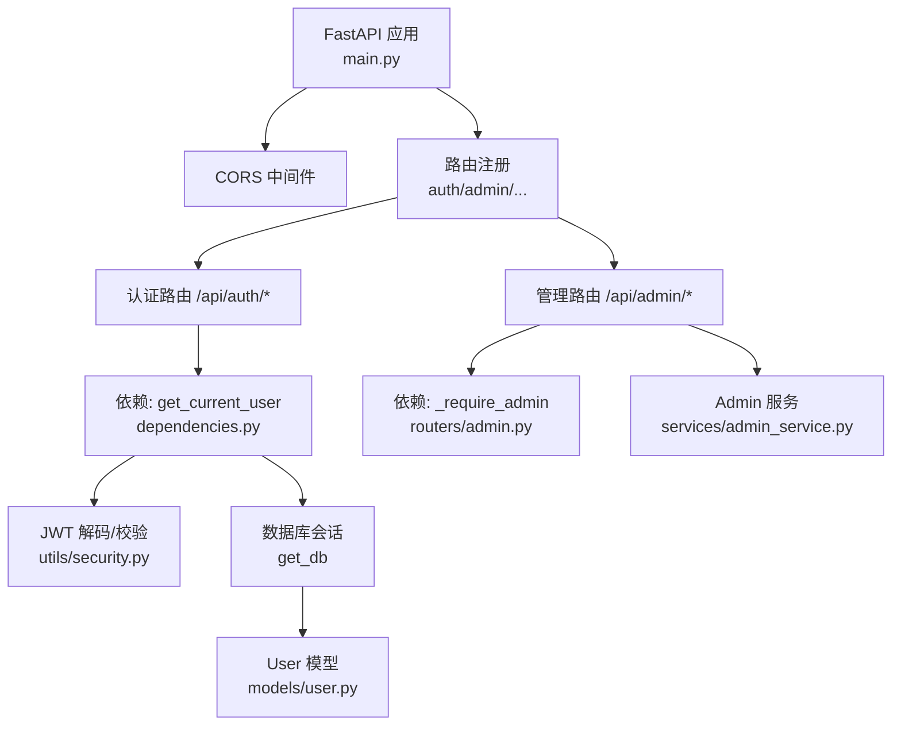
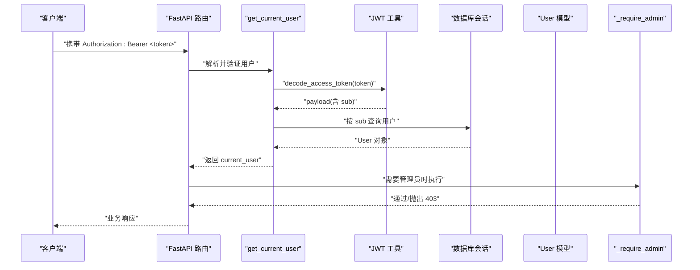
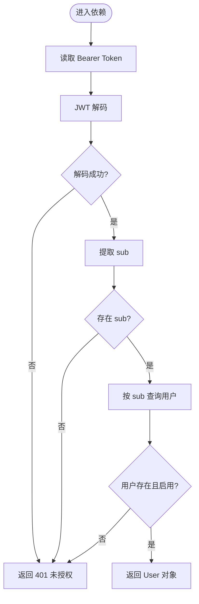
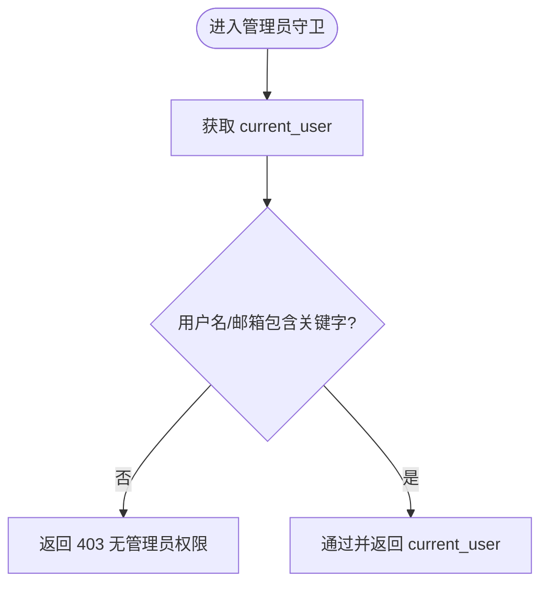
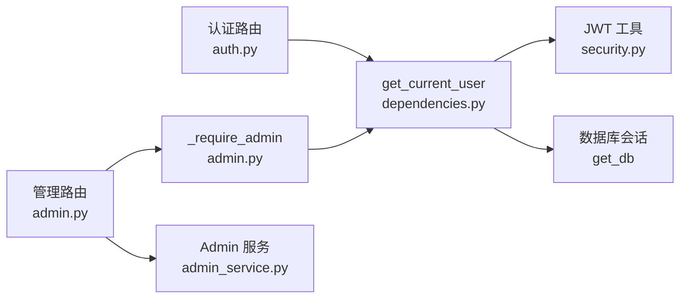

# 权限控制系统

<cite>
**本文引用的文件**   
- [main.py](file://backEnd/app/main.py)
- [dependencies.py](file://backEnd/app/dependencies.py)
- [security.py](file://backEnd/app/utils/security.py)
- [user.py](file://backEnd/app/models/user.py)
- [auth.py](file://backEnd/app/routers/auth.py)
- [admin.py](file://backEnd/app/routers/admin.py)
- [admin_service.py](file://backEnd/app/services/admin_service.py)
- [config.py](file://backEnd/app/config.py)
</cite>

## 目录
1. [简介](#简介)
2. [项目结构](#项目结构)
3. [核心组件](#核心组件)
4. [架构总览](#架构总览)
5. [详细组件分析](#详细组件分析)
6. [依赖关系分析](#依赖关系分析)
7. [性能与扩展性](#性能与扩展性)
8. [故障排查指南](#故障排查指南)
9. [结论](#结论)
10. [附录：最佳实践与常见场景](#附录最佳实践与常见场景)

## 简介
本文件面向 HR XF 系统的权限控制实现，聚焦以下目标：
- 基于角色的访问控制（RBAC）原理与现状说明
- 用户角色定义、权限级别划分、资源访问控制策略
- 管理员权限与普通用户的差异及后台管理保护机制
- FastAPI 依赖注入的认证与授权中间件模式（get_current_user 的使用方式）
- 路由级权限控制方法，如何为不同 API 端点设置访问权限
- 权限检查的最佳实践与常见权限场景示例
- 权限继承、动态权限分配等高级特性的演进建议

## 项目结构
后端采用 FastAPI + SQLAlchemy 异步 ORM 的分层架构。权限相关的关键位置如下：
- 应用入口与全局配置：main.py、config.py
- 认证与鉴权依赖：dependencies.py、utils/security.py
- 用户模型：models/user.py
- 认证路由：routers/auth.py
- 管理后台路由与守卫：routers/admin.py、services/admin_service.py

图表来源
- [main.py:44-68](file://backEnd/app/main.py#L44-L68)
- [dependencies.py:10-41](file://backEnd/app/dependencies.py#L10-L41)
- [security.py:26-47](file://backEnd/app/utils/security.py#L26-L47)
- [user.py:10-45](file://backEnd/app/models/user.py#L10-L45)
- [admin.py:24-35](file://backEnd/app/routers/admin.py#L24-L35)
- [admin_service.py:14-42](file://backEnd/app/services/admin_service.py#L14-L42)

章节来源
- [main.py:44-68](file://backEnd/app/main.py#L44-L68)
- [config.py:20-33](file://backEnd/app/config.py#L20-L33)

## 核心组件
- 认证依赖 get_current_user
  - 从请求头提取 Bearer Token，使用 JWT 工具解码并校验；根据载荷中的 sub 查询用户，若不存在或已禁用则拒绝访问。
- 管理员守卫 _require_admin
  - 在 get_current_user 基础上进行“管理员”判定，当前实现为基于用户名/邮箱包含关键字的简易规则。
- JWT 工具集
  - 提供密码哈希/校验、令牌签发与解码，过期时间由配置项控制。
- 用户模型 User
  - 包含基础身份字段与 is_active 软删除标记，用于登录态与账号状态控制。
- 认证路由 auth
  - 提供注册、登录、个人信息更新、头像上传等接口，受 get_current_user 保护。
- 管理路由 admin
  - 所有管理端点均通过 _require_admin 保护，提供仪表盘统计、用户/题目/帖子管理等能力。

章节来源
- [dependencies.py:13-41](file://backEnd/app/dependencies.py#L13-L41)
- [admin.py:24-35](file://backEnd/app/routers/admin.py#L24-L35)
- [security.py:18-47](file://backEnd/app/utils/security.py#L18-L47)
- [user.py:10-45](file://backEnd/app/models/user.py#L10-L45)
- [auth.py:83-114](file://backEnd/app/routers/auth.py#L83-L114)
- [admin.py:39-100](file://backEnd/app/routers/admin.py#L39-L100)

## 架构总览
下图展示了从客户端发起请求到完成鉴权的完整调用链，以及管理员权限的二次校验流程。

图表来源
- [dependencies.py:13-41](file://backEnd/app/dependencies.py#L13-L41)
- [security.py:39-47](file://backEnd/app/utils/security.py#L39-L47)
- [admin.py:24-35](file://backEnd/app/routers/admin.py#L24-L35)

## 详细组件分析

### 认证依赖 get_current_user
- 职责
  - 从 HTTP 请求中读取 Bearer Token，解码并校验签名与有效期。
  - 依据载荷中的 sub 定位用户，若用户不存在或 is_active 为 False，则拒绝访问。
- 错误处理
  - 无效凭据或载荷缺失：返回 401 未授权。
  - 用户不存在或已禁用：返回 401 未授权。
- 使用模式
  - 在需要认证的端点参数中使用 Depends(get_current_user)，即可自动注入当前用户对象。

图表来源
- [dependencies.py:13-41](file://backEnd/app/dependencies.py#L13-L41)
- [security.py:39-47](file://backEnd/app/utils/security.py#L39-L47)

章节来源
- [dependencies.py:13-41](file://backEnd/app/dependencies.py#L13-L41)

### 管理员守卫 _require_admin
- 职责
  - 在 get_current_user 的基础上进行“管理员”判定。
  - 当前实现为简易规则：用户名或邮箱中包含特定关键字即视为管理员。
- 错误处理
  - 非管理员访问管理端点：返回 403 禁止访问。
- 使用模式
  - 在管理端点参数中使用 Depends(_require_admin)，可快速获得具备管理员身份的 current_user。

图表来源
- [admin.py:24-35](file://backEnd/app/routers/admin.py#L24-L35)

章节来源
- [admin.py:24-35](file://backEnd/app/routers/admin.py#L24-L35)

### JWT 安全工具
- 功能
  - 密码哈希与校验：bcrypt 方案，对超长密码做安全截断。
  - 令牌签发：将用户标识写入 sub，附加 exp 过期时间。
  - 令牌解码：失败统一返回 None，便于上层统一处理。
- 配置
  - secret_key、algorithm、access_token_expire_minutes 来自配置中心。

章节来源
- [security.py:18-47](file://backEnd/app/utils/security.py#L18-L47)
- [config.py:20-23](file://backEnd/app/config.py#L20-L23)

### 用户模型 User
- 关键字段
  - id、username、email、password_hash、is_active 等。
- 权限相关
  - is_active 用于软禁用账号；认证依赖会拒绝已禁用用户。

章节来源
- [user.py:10-45](file://backEnd/app/models/user.py#L10-L45)

### 认证路由（普通用户）
- 典型受保护端点
  - 获取个人信息、修改个人资料、修改用户名/邮箱/密码、注销账号、上传头像等。
- 权限策略
  - 全部依赖 get_current_user，确保仅本人操作。

章节来源
- [auth.py:83-114](file://backEnd/app/routers/auth.py#L83-L114)
- [auth.py:117-176](file://backEnd/app/routers/auth.py#L117-L176)

### 管理路由（管理员）
- 典型端点
  - 仪表盘统计、用户列表/更新/删除、题目列表/创建/更新/删除、帖子列表/删除等。
- 权限策略
  - 全部依赖 _require_admin，确保仅管理员可访问。

章节来源
- [admin.py:39-100](file://backEnd/app/routers/admin.py#L39-L100)
- [admin.py:104-198](file://backEnd/app/routers/admin.py#L104-L198)

## 依赖关系分析
- 模块耦合
  - 路由层依赖依赖注入层（get_current_user、_require_admin）。
  - 依赖注入层依赖安全工具与数据库会话。
  - 管理路由依赖管理服务进行数据操作。
- 外部依赖
  - JWT 库与密码哈希库。
  - 配置中心提供密钥与过期时间。

图表来源
- [auth.py:83-114](file://backEnd/app/routers/auth.py#L83-L114)
- [admin.py:24-35](file://backEnd/app/routers/admin.py#L24-L35)
- [dependencies.py:13-41](file://backEnd/app/dependencies.py#L13-L41)
- [security.py:39-47](file://backEnd/app/utils/security.py#L39-L47)
- [admin_service.py:14-42](file://backEnd/app/services/admin_service.py#L14-L42)

章节来源
- [main.py:60-68](file://backEnd/app/main.py#L60-L68)

## 性能与扩展性
- 性能
  - 认证依赖每次请求都会解码 JWT 并查询一次用户，属于轻量 IO，通常开销可控。
  - 可通过缓存用户信息（如 Redis）减少重复查询，但需考虑令牌刷新与失效一致性。
- 扩展性
  - 当前 RBAC 为“基于用户名/邮箱关键字”的简易角色判断，适合快速起步。
  - 建议逐步引入显式角色表与权限表，支持细粒度资源与动作控制，避免硬编码规则。

[本节为通用指导，不直接分析具体文件]

## 故障排查指南
- 401 未授权
  - 可能原因：缺少/无效的 Bearer Token、JWT 解码失败、用户不存在或已禁用。
  - 排查要点：确认请求头是否正确携带；核对 secret_key 与算法是否一致；检查用户 is_active 状态。
- 403 禁止访问
  - 可能原因：尝试访问管理端点但当前用户不符合管理员规则。
  - 排查要点：确认用户名/邮箱是否符合当前管理员判定规则；必要时调整规则或升级至显式角色体系。
- 配置问题
  - 可能原因：secret_key、algorithm、过期时间配置不正确或不一致。
  - 排查要点：核对配置文件与环境变量加载路径。

章节来源
- [dependencies.py:13-41](file://backEnd/app/dependencies.py#L13-L41)
- [admin.py:24-35](file://backEnd/app/routers/admin.py#L24-L35)
- [config.py:20-23](file://backEnd/app/config.py#L20-L23)

## 结论
- 当前系统实现了基于 JWT 的无状态认证与基于简单规则的“管理员”判定，满足基本 RBAC 需求。
- 通过 FastAPI 依赖注入，认证与授权逻辑清晰、复用性强，易于在路由层按需组合。
- 后续建议引入显式的角色与权限模型，支持更细粒度的资源访问控制与动态权限分配。

[本节为总结，不直接分析具体文件]

## 附录：最佳实践与常见场景

- 最佳实践
  - 始终使用 get_current_user 作为认证依赖，避免在每个路由重复实现鉴权逻辑。
  - 将“管理员”等角色判断封装为独立的依赖（如 _require_admin），保持路由简洁。
  - 对敏感操作增加二次校验（例如删除自己、修改关键资料）。
  - 统一错误码与消息，便于前端友好提示。
- 常见权限场景
  - 仅本人可访问的个人资料接口：使用 get_current_user 并在业务层限定操作范围为 current_user.id。
  - 管理员专属的数据维护接口：使用 _require_admin 保护。
  - 可选用户上下文：对于部分只读接口，可使用可选用户依赖（参考其他路由中的可选用户模式），提升匿名访问体验。
- 权限继承与动态权限（演进建议）
  - 引入 Role 与 Permission 表，支持多角色与多权限的组合。
  - 在依赖注入层实现基于资源的权限检查（如 check_permission(user, resource, action)）。
  - 结合缓存与事件通知，实现权限变更后的即时生效与失效。

[本节为概念性内容，不直接分析具体文件]