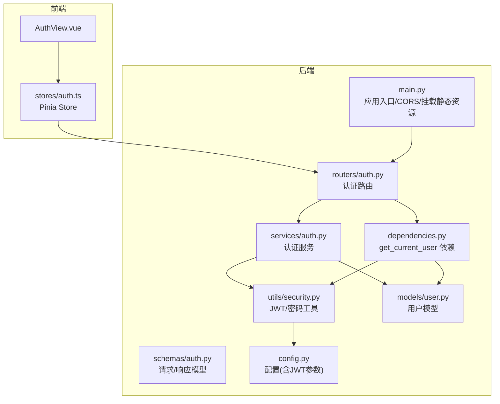
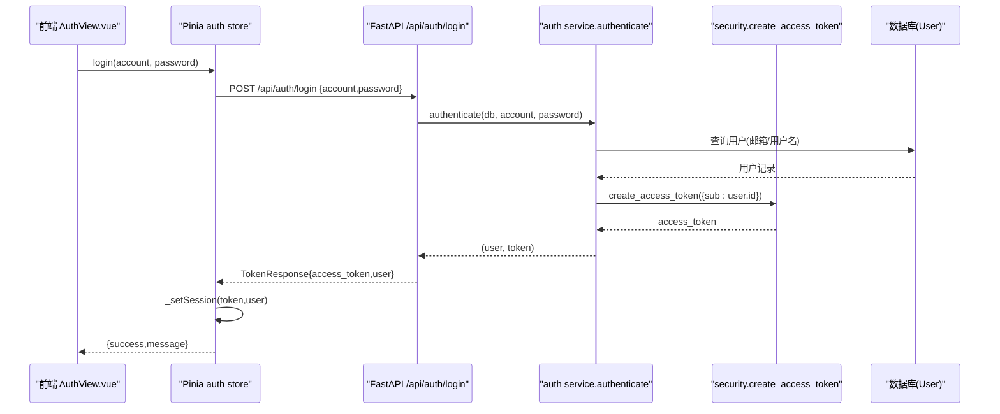
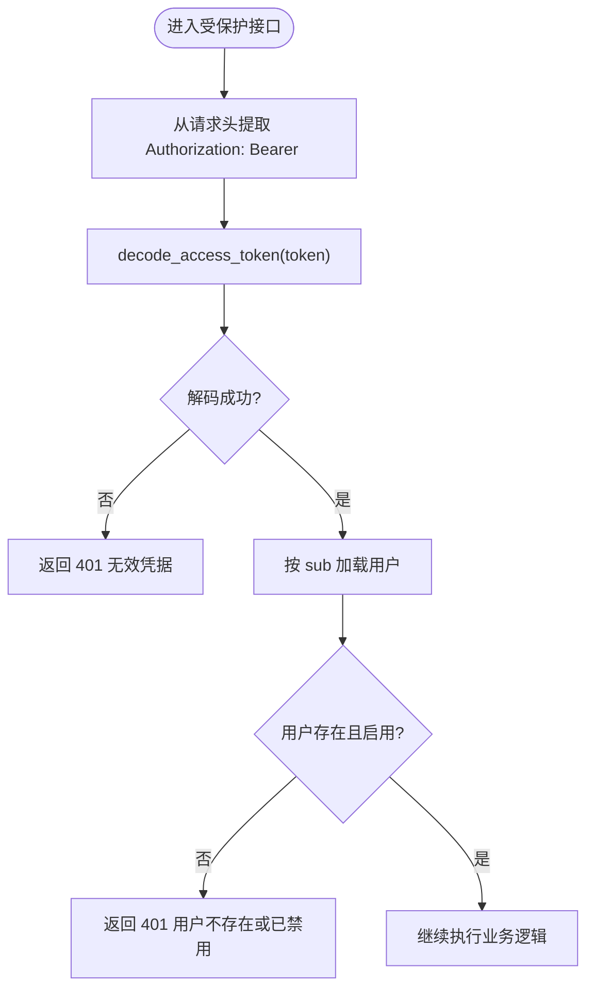
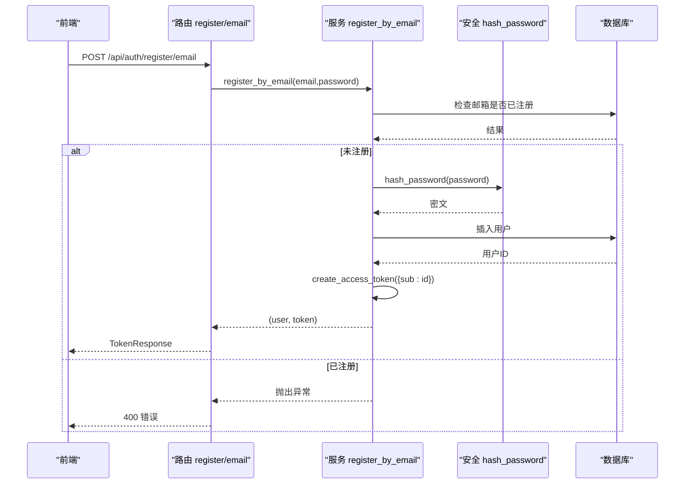
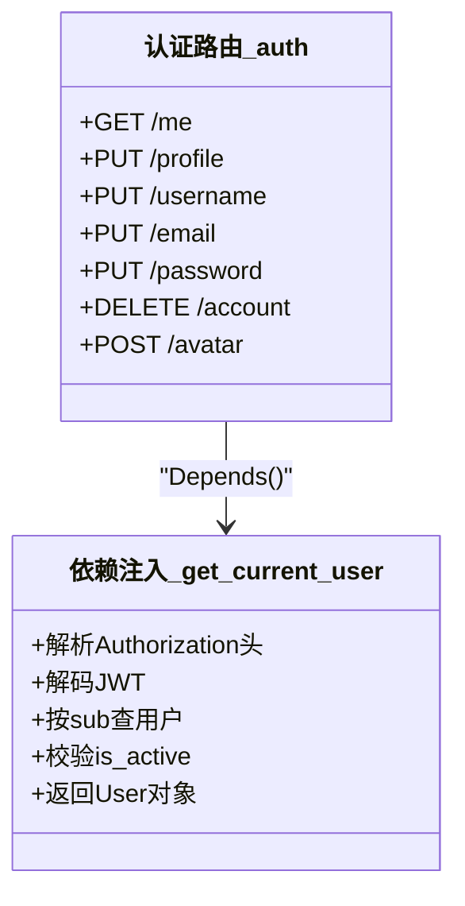
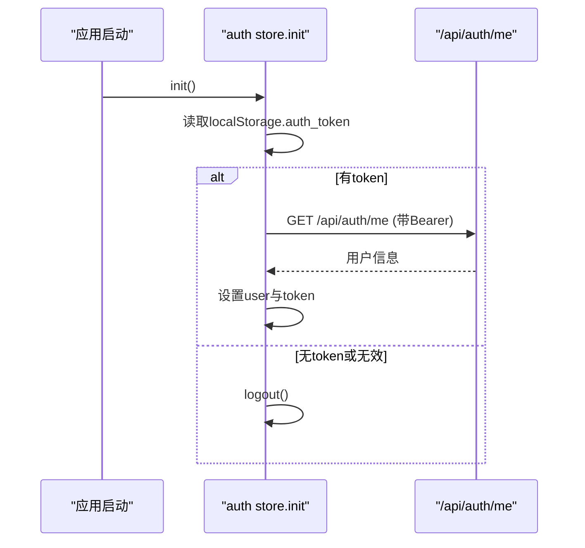
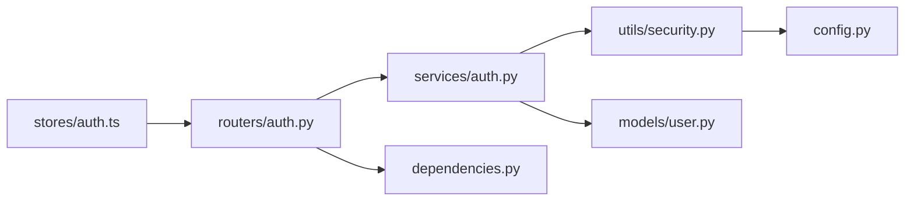

# 用户认证系统

<cite>
**本文引用的文件列表**
- [backEnd/app/routers/auth.py](file://backEnd/app/routers/auth.py)
- [backEnd/app/services/auth.py](file://backEnd/app/services/auth.py)
- [backEnd/app/schemas/auth.py](file://backEnd/app/schemas/auth.py)
- [backEnd/app/utils/security.py](file://backEnd/app/utils/security.py)
- [backEnd/app/models/user.py](file://backEnd/app/models/user.py)
- [backEnd/app/dependencies.py](file://backEnd/app/dependencies.py)
- [backEnd/app/config.py](file://backEnd/app/config.py)
- [backEnd/app/main.py](file://backEnd/app/main.py)
- [frontEnd/src/stores/auth.ts](file://frontEnd/src/stores/auth.ts)
- [frontEnd/src/views/AuthView.vue](file://frontEnd/src/views/AuthView.vue)
</cite>

## 目录
1. [简介](#简介)
2. [项目结构](#项目结构)
3. [核心组件](#核心组件)
4. [架构总览](#架构总览)
5. [详细组件分析](#详细组件分析)
6. [依赖关系分析](#依赖关系分析)
7. [性能与安全考量](#性能与安全考量)
8. [故障排查指南](#故障排查指南)
9. [结论](#结论)
10. [附录：API 接口与错误处理](#附录api-接口与错误处理)

## 简介
本文件系统化梳理 HR XF 项目的用户认证体系，围绕 JWT 无状态认证机制展开，覆盖令牌签发、验证、刷新策略（当前实现为短时效访问令牌），以及完整的注册、登录、权限控制流程。文档同时说明前后端认证状态管理（Pinia store）、密码加密存储、会话管理、安全防护措施、认证中间件配置与使用示例，并提供常见认证场景的实现建议与最佳实践。

## 项目结构
后端采用 FastAPI 分层架构：路由层负责 HTTP 契约，服务层封装业务逻辑，安全工具提供密码哈希与 JWT 编解码，依赖注入用于鉴权；前端基于 Vue + Pinia 管理认证状态，统一通过 API Client 携带 Bearer Token 发起请求。

图表来源
- [backEnd/app/main.py:44-73](file://backEnd/app/main.py#L44-L73)
- [backEnd/app/routers/auth.py:25-217](file://backEnd/app/routers/auth.py#L25-L217)
- [backEnd/app/services/auth.py:1-174](file://backEnd/app/services/auth.py#L1-L174)
- [backEnd/app/schemas/auth.py:1-119](file://backEnd/app/schemas/auth.py#L1-L119)
- [backEnd/app/utils/security.py:1-48](file://backEnd/app/utils/security.py#L1-L48)
- [backEnd/app/dependencies.py:1-41](file://backEnd/app/dependencies.py#L1-L41)
- [backEnd/app/models/user.py:1-45](file://backEnd/app/models/user.py#L1-L45)
- [backEnd/app/config.py:1-71](file://backEnd/app/config.py#L1-L71)
- [frontEnd/src/stores/auth.ts:1-314](file://frontEnd/src/stores/auth.ts#L1-L314)
- [frontEnd/src/views/AuthView.vue:1-418](file://frontEnd/src/views/AuthView.vue#L1-L418)

章节来源
- [backEnd/app/main.py:44-73](file://backEnd/app/main.py#L44-L73)
- [backEnd/app/routers/auth.py:25-217](file://backEnd/app/routers/auth.py#L25-L217)
- [backEnd/app/services/auth.py:1-174](file://backEnd/app/services/auth.py#L1-L174)
- [backEnd/app/schemas/auth.py:1-119](file://backEnd/app/schemas/auth.py#L1-L119)
- [backEnd/app/utils/security.py:1-48](file://backEnd/app/utils/security.py#L1-L48)
- [backEnd/app/dependencies.py:1-41](file://backEnd/app/dependencies.py#L1-L41)
- [backEnd/app/models/user.py:1-45](file://backEnd/app/models/user.py#L1-L45)
- [backEnd/app/config.py:1-71](file://backEnd/app/config.py#L1-L71)
- [frontEnd/src/stores/auth.ts:1-314](file://frontEnd/src/stores/auth.ts#L1-L314)
- [frontEnd/src/views/AuthView.vue:1-418](file://frontEnd/src/views/AuthView.vue#L1-L418)

## 核心组件
- 认证路由层：定义注册、登录、登出、个人信息、头像上传等接口，统一返回 TokenResponse 或 UserResponse。
- 认证服务层：封装账号查找、注册、登录校验、资料更新、密码修改、账号注销等业务逻辑。
- 安全工具：bcrypt 密码哈希与验证；HS256 JWT 签发与解码。
- 依赖注入：HTTPBearer 解析 Authorization 头，解码并校验用户有效性，作为受保护接口的依赖。
- 数据模型：用户实体包含基础信息、个人资料字段及活跃状态。
- 配置中心：集中管理数据库、CORS、JWT 密钥与过期时间等。
- 前端状态管理：Pinia store 维护 token 与用户信息，自动在请求头附加 Bearer Token，并在初始化时恢复本地会话。

章节来源
- [backEnd/app/routers/auth.py:25-217](file://backEnd/app/routers/auth.py#L25-L217)
- [backEnd/app/services/auth.py:1-174](file://backEnd/app/services/auth.py#L1-L174)
- [backEnd/app/utils/security.py:1-48](file://backEnd/app/utils/security.py#L1-L48)
- [backEnd/app/dependencies.py:1-41](file://backEnd/app/dependencies.py#L1-L41)
- [backEnd/app/models/user.py:1-45](file://backEnd/app/models/user.py#L1-L45)
- [backEnd/app/config.py:1-71](file://backEnd/app/config.py#L1-L71)
- [frontEnd/src/stores/auth.ts:1-314](file://frontEnd/src/stores/auth.ts#L1-L314)

## 架构总览
下图展示一次“登录”的端到端调用链，包括前端发起、后端路由、服务层校验、JWT 签发与返回。

图表来源
- [frontEnd/src/views/AuthView.vue:384-416](file://frontEnd/src/views/AuthView.vue#L384-L416)
- [frontEnd/src/stores/auth.ts:119-134](file://frontEnd/src/stores/auth.ts#L119-L134)
- [backEnd/app/routers/auth.py:69-80](file://backEnd/app/routers/auth.py#L69-L80)
- [backEnd/app/services/auth.py:85-96](file://backEnd/app/services/auth.py#L85-L96)
- [backEnd/app/utils/security.py:26-36](file://backEnd/app/utils/security.py#L26-L36)
- [backEnd/app/models/user.py:10-45](file://backEnd/app/models/user.py#L10-L45)

## 详细组件分析

### 1) JWT 无状态认证机制
- 令牌签发
  - 服务层在注册成功或登录成功后，调用安全工具生成 access_token，载荷包含用户标识（sub）。
  - 过期时间由配置项决定，默认 24 小时。
- 令牌验证
  - 依赖注入 get_current_user 从请求头提取 Bearer Token，解码后校验签名与过期时间，再根据 sub 查询用户并检查 is_active。
- 令牌刷新
  - 当前未实现 refresh_token 机制。若需支持长会话，可引入双令牌模式（短期 access_token + 长期 refresh_token），并提供刷新接口。

图表来源
- [backEnd/app/dependencies.py:13-40](file://backEnd/app/dependencies.py#L13-L40)
- [backEnd/app/utils/security.py:39-47](file://backEnd/app/utils/security.py#L39-L47)
- [backEnd/app/services/auth.py:23-25](file://backEnd/app/services/auth.py#L23-L25)

章节来源
- [backEnd/app/utils/security.py:26-47](file://backEnd/app/utils/security.py#L26-L47)
- [backEnd/app/dependencies.py:1-41](file://backEnd/app/dependencies.py#L1-L41)
- [backEnd/app/config.py:20-23](file://backEnd/app/config.py#L20-L23)

### 2) 用户注册与登录
- 注册
  - 支持邮箱注册与用户名注册两种模式，均会校验唯一性并生成初始 access_token。
  - 用户名冲突时自动追加随机后缀以避免重复。
- 登录
  - 支持以邮箱或用户名登录，校验密码与账户状态后签发 access_token。

图表来源
- [backEnd/app/routers/auth.py:41-52](file://backEnd/app/routers/auth.py#L41-L52)
- [backEnd/app/services/auth.py:38-62](file://backEnd/app/services/auth.py#L38-L62)
- [backEnd/app/utils/security.py:18-19](file://backEnd/app/utils/security.py#L18-L19)
- [backEnd/app/models/user.py:10-45](file://backEnd/app/models/user.py#L10-L45)

章节来源
- [backEnd/app/routers/auth.py:41-80](file://backEnd/app/routers/auth.py#L41-L80)
- [backEnd/app/services/auth.py:38-96](file://backEnd/app/services/auth.py#L38-L96)
- [backEnd/app/schemas/auth.py:9-36](file://backEnd/app/schemas/auth.py#L9-L36)

### 3) 权限控制与受保护接口
- 所有需要认证的接口通过依赖注入 get_current_user 进行鉴权。
- 典型受保护接口：获取个人信息、更新资料、修改用户名/邮箱、修改密码、删除账号、上传头像等。
- 管理员相关接口位于独立路由模块，可按角色扩展权限控制。

图表来源
- [backEnd/app/dependencies.py:13-40](file://backEnd/app/dependencies.py#L13-L40)
- [backEnd/app/routers/auth.py:89-176](file://backEnd/app/routers/auth.py#L89-L176)

章节来源
- [backEnd/app/dependencies.py:1-41](file://backEnd/app/dependencies.py#L1-L41)
- [backEnd/app/routers/auth.py:89-176](file://backEnd/app/routers/auth.py#L89-L176)

### 4) 前后端认证状态管理（Pinia）
- 状态持久化
  - 登录成功后将 access_token 与 user 写入 localStorage，并在 store 中同步内存状态。
- 自动恢复
  - 应用启动时 init() 尝试读取本地 token，并调用 /api/auth/me 校验有效性，失败则清除本地状态。
- 统一请求拦截
  - apiRequest 自动在请求头附加 Authorization: Bearer <token>，并对非 2xx 响应抛出结构化错误。
- 常用操作
  - 登录、注册、登出、获取/更新资料、修改密码、上传头像、修改用户名/邮箱、注销账号。

图表来源
- [frontEnd/src/stores/auth.ts:72-83](file://frontEnd/src/stores/auth.ts#L72-L83)
- [frontEnd/src/stores/auth.ts:37-61](file://frontEnd/src/stores/auth.ts#L37-L61)
- [backEnd/app/routers/auth.py:89-91](file://backEnd/app/routers/auth.py#L89-L91)

章节来源
- [frontEnd/src/stores/auth.ts:1-314](file://frontEnd/src/stores/auth.ts#L1-L314)
- [frontEnd/src/views/AuthView.vue:384-416](file://frontEnd/src/views/AuthView.vue#L384-L416)

### 5) 密码加密存储与会话管理
- 密码加密
  - 使用 bcrypt 对密码进行哈希存储，超长明文会被截断至 72 字节以保证兼容。
- 会话管理
  - 无服务端会话，客户端通过 localStorage 保存 token，每次请求附带 Authorization 头。
  - 登出即清除本地 token 与用户信息。

章节来源
- [backEnd/app/utils/security.py:13-23](file://backEnd/app/utils/security.py#L13-L23)
- [frontEnd/src/stores/auth.ts:137-142](file://frontEnd/src/stores/auth.ts#L137-L142)

### 6) 安全防护要点
- CORS 白名单
  - 仅允许配置的源访问，并允许携带凭证。
- 输入校验
  - 使用 Pydantic 严格校验请求体，避免非法输入进入业务层。
- 敏感信息最小暴露
  - 返回的用户响应不包含密码哈希等敏感字段。
- 文件上传限制
  - 头像上传限制类型与大小，旧文件清理避免残留。

章节来源
- [backEnd/app/main.py:52-58](file://backEnd/app/main.py#L52-L58)
- [backEnd/app/schemas/auth.py:9-36](file://backEnd/app/schemas/auth.py#L9-L36)
- [backEnd/app/routers/auth.py:182-216](file://backEnd/app/routers/auth.py#L182-L216)

## 依赖关系分析
- 路由层依赖服务层与依赖注入；服务层依赖安全工具与数据库模型；安全工具依赖配置；前端 store 依赖后端认证路由。

图表来源
- [backEnd/app/routers/auth.py:1-24](file://backEnd/app/routers/auth.py#L1-L24)
- [backEnd/app/services/auth.py:1-11](file://backEnd/app/services/auth.py#L1-L11)
- [backEnd/app/dependencies.py:1-8](file://backEnd/app/dependencies.py#L1-L8)
- [backEnd/app/utils/security.py:1-8](file://backEnd/app/utils/security.py#L1-L8)
- [backEnd/app/models/user.py:1-8](file://backEnd/app/models/user.py#L1-L8)
- [backEnd/app/config.py:1-8](file://backEnd/app/config.py#L1-L8)
- [frontEnd/src/stores/auth.ts:1-10](file://frontEnd/src/stores/auth.ts#L1-L10)

章节来源
- [backEnd/app/routers/auth.py:1-24](file://backEnd/app/routers/auth.py#L1-L24)
- [backEnd/app/services/auth.py:1-11](file://backEnd/app/services/auth.py#L1-L11)
- [backEnd/app/dependencies.py:1-8](file://backEnd/app/dependencies.py#L1-L8)
- [backEnd/app/utils/security.py:1-8](file://backEnd/app/utils/security.py#L1-L8)
- [backEnd/app/models/user.py:1-8](file://backEnd/app/models/user.py#L1-L8)
- [backEnd/app/config.py:1-8](file://backEnd/app/config.py#L1-L8)
- [frontEnd/src/stores/auth.ts:1-10](file://frontEnd/src/stores/auth.ts#L1-L10)

## 性能与安全考量
- 性能
  - JWT 无状态验证无需服务端会话存储，适合水平扩展。
  - bcrypt 哈希计算开销较大，建议在登录/注册路径外缓存必要信息（如用户基本信息），减少重复查询。
- 安全
  - 生产环境务必更换 secret_key，并确保 HTTPS 传输。
  - 建议引入 refresh_token 机制缩短 access_token 有效期，降低泄露风险。
  - 对上传文件做更严格的类型与内容校验，避免恶意文件上传。
  - 考虑增加速率限制与登录失败计数，防止暴力破解。

[本节为通用指导，不直接分析具体文件]

## 故障排查指南
- 401 未授权
  - 检查请求头是否携带正确的 Authorization: Bearer <token>。
  - 确认 token 未被篡改且未过期。
  - 确认用户未被禁用（is_active=false）。
- 400 参数错误
  - 检查注册/登录请求体是否符合 schema 校验规则（邮箱格式、用户名字符集、密码长度等）。
- 422 请求体校验失败
  - 查看全局异常处理器返回的错误详情，定位字段级问题。
- 头像上传失败
  - 检查文件大小与类型限制；确认服务器 uploads 目录可写。

章节来源
- [backEnd/app/dependencies.py:13-40](file://backEnd/app/dependencies.py#L13-L40)
- [backEnd/app/schemas/auth.py:9-36](file://backEnd/app/schemas/auth.py#L9-L36)
- [backEnd/app/main.py:76-84](file://backEnd/app/main.py#L76-L84)
- [backEnd/app/routers/auth.py:182-216](file://backEnd/app/routers/auth.py#L182-L216)

## 结论
本项目实现了基于 JWT 的无状态认证体系，具备完善的注册、登录、资料管理与头像上传能力。前后端协作清晰，依赖注入简化了鉴权接入。当前未实现 refresh_token，建议后续引入以提升安全性与用户体验。配合严格的输入校验、CORS 与文件上传限制，整体安全基线良好。

[本节为总结，不直接分析具体文件]

## 附录：API 接口与错误处理

### 认证相关接口一览
- 注册
  - POST /api/auth/register/email
    - 请求体：EmailRegisterRequest
    - 响应：TokenResponse
  - POST /api/auth/register/username
    - 请求体：UsernameRegisterRequest
    - 响应：TokenResponse
- 登录
  - POST /api/auth/login
    - 请求体：LoginRequest
    - 响应：TokenResponse
- 登出
  - POST /api/auth/logout
    - 响应：MessageResponse
- 个人信息
  - GET /api/auth/me
    - 响应：UserResponse
  - GET /api/auth/profile
    - 响应：UserResponse
  - PUT /api/auth/profile
    - 请求体：ProfileUpdateRequest
    - 响应：UserResponse
- 账号设置
  - PUT /api/auth/username
    - 请求体：UpdateUsernameRequest
    - 响应：TokenResponse
  - PUT /api/auth/email
    - 请求体：UpdateEmailRequest
    - 响应：TokenResponse
  - PUT /api/auth/password
    - 请求体：ChangePasswordRequest
    - 响应：MessageResponse
  - DELETE /api/auth/account
    - 请求体：DeleteAccountRequest
    - 响应：MessageResponse
- 头像上传
  - POST /api/auth/avatar
    - 表单：multipart/form-data，字段 file
    - 响应：UserResponse

章节来源
- [backEnd/app/routers/auth.py:41-216](file://backEnd/app/routers/auth.py#L41-L216)
- [backEnd/app/schemas/auth.py:9-119](file://backEnd/app/schemas/auth.py#L9-L119)

### 错误处理机制
- 业务错误
  - 服务层抛出 ValueError，路由层捕获并转换为 400/401 等 HTTP 错误。
- 请求体验证错误
  - 全局异常处理器将 Pydantic 校验错误规范化为 JSON 响应，避免二进制内容导致编码异常。
- 认证失败
  - 依赖注入在 token 无效、载荷缺失或用户被禁用时返回 401，并附带 WWW-Authenticate: Bearer 头。

章节来源
- [backEnd/app/routers/auth.py:46-80](file://backEnd/app/routers/auth.py#L46-L80)
- [backEnd/app/main.py:76-84](file://backEnd/app/main.py#L76-L84)
- [backEnd/app/dependencies.py:13-40](file://backEnd/app/dependencies.py#L13-L40)

### 常见认证场景与最佳实践
- 角色权限控制
  - 可在依赖注入中扩展角色校验逻辑，或在路由层按需添加自定义依赖。
- 令牌过期处理
  - 前端监听 401 响应，引导用户重新登录；建议引入 refresh_token 提升体验。
- 自动登出
  - 前端在 init() 中校验 /me 失败时执行登出；也可结合心跳检测定期刷新 token。
- 安全最佳实践
  - 生产环境强制 HTTPS、轮换 secret_key、限制登录频率、最小化敏感信息返回、严格校验上传文件。

[本节为通用指导，不直接分析具体文件]