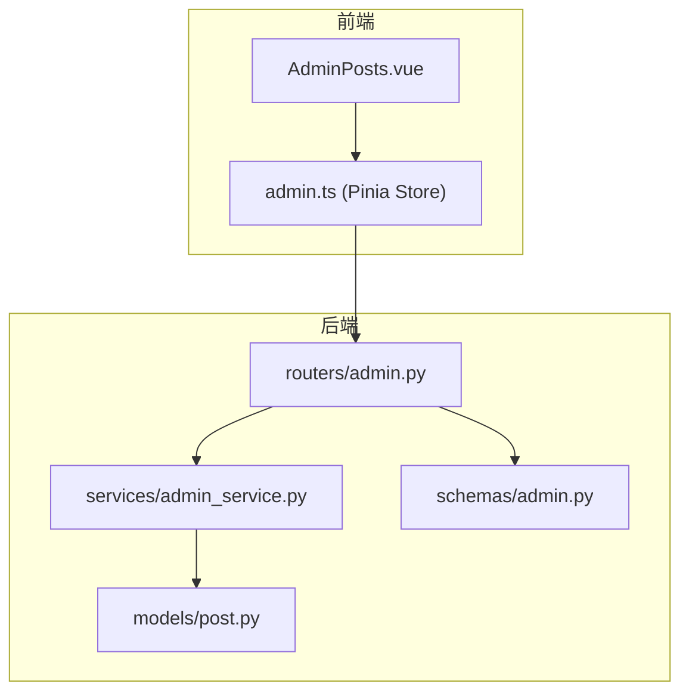
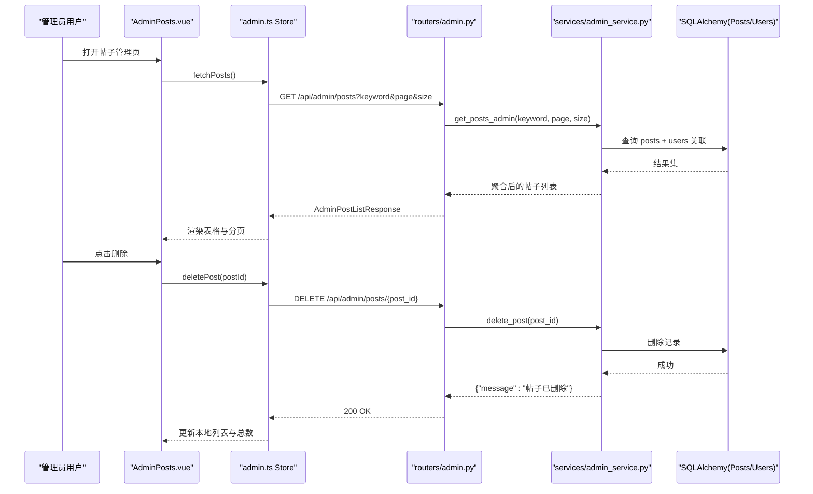
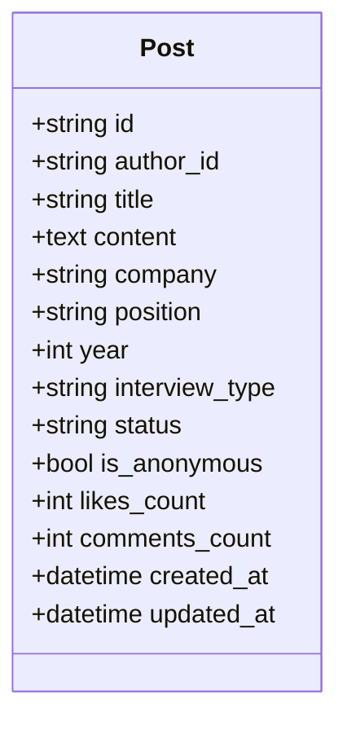
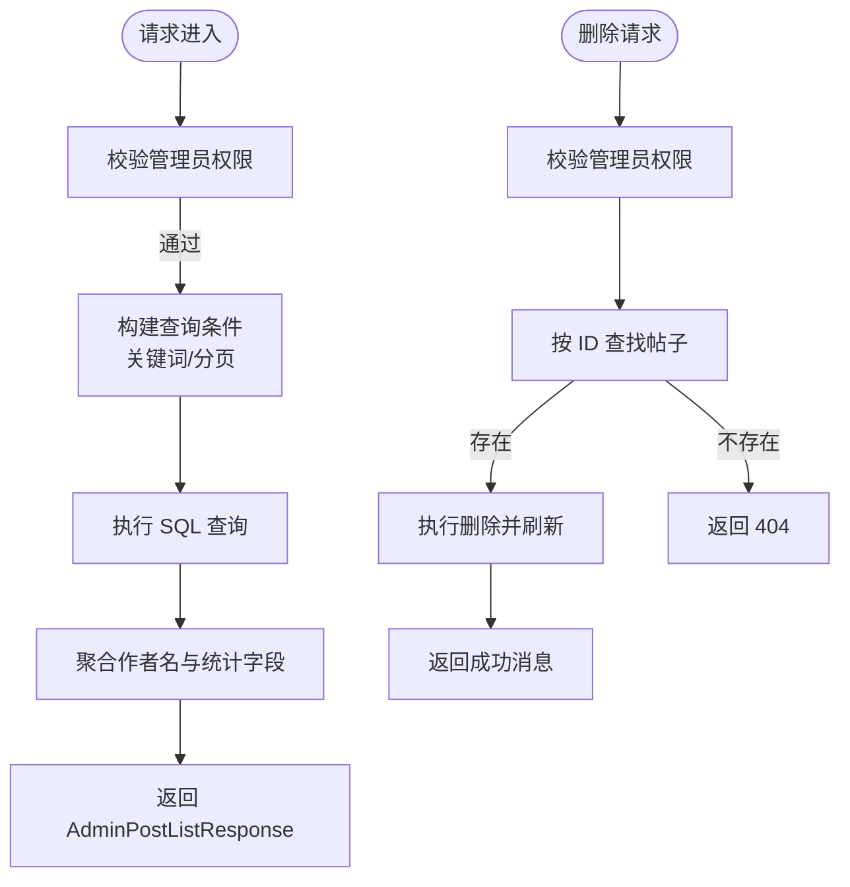
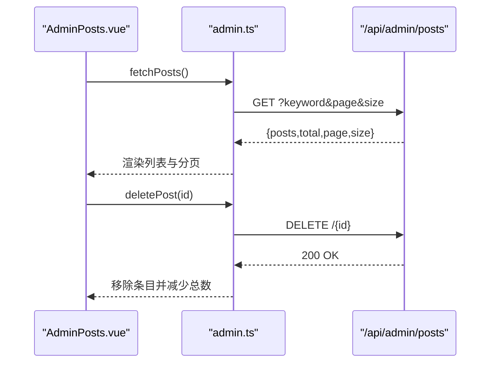
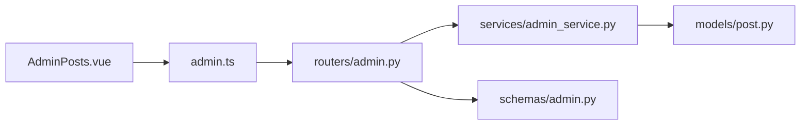

# 内容审核机制

<cite>
**本文引用的文件**
- [backEnd/app/models/post.py](file://backEnd/app/models/post.py)
- [backEnd/app/routers/admin.py](file://backEnd/app/routers/admin.py)
- [backEnd/app/services/admin_service.py](file://backEnd/app/services/admin_service.py)
- [backEnd/app/schemas/admin.py](file://backEnd/app/schemas/admin.py)
- [frontEnd/src/views/admin/AdminPosts.vue](file://frontEnd/src/views/admin/AdminPosts.vue)
- [frontEnd/src/stores/admin.ts](file://frontEnd/src/stores/admin.ts)
</cite>

## 目录
1. [简介](#简介)
2. [项目结构](#项目结构)
3. [核心组件](#核心组件)
4. [架构总览](#架构总览)
5. [详细组件分析](#详细组件分析)
6. [依赖关系分析](#依赖关系分析)
7. [性能与效率优化](#性能与效率优化)
8. [故障排查指南](#故障排查指南)
9. [结论](#结论)
10. [附录](#附录)

## 简介
本技术文档围绕 HR XF 平台的内容审核机制，系统梳理现有实现并给出扩展建议。当前仓库已具备“帖子管理”的后台能力（列表、删除），并在前端展示“待审核/已通过/已拒绝”等状态；但尚未发现完整的自动审核、人工审核工作流、审核队列调度、审计日志与动态规则配置等模块的实现。本文在忠实于源码的基础上，对已有能力进行说明，并提供面向未来的审核体系设计蓝图与落地路径。

## 项目结构
后端采用 FastAPI + SQLAlchemy 异步 ORM，提供管理端 API；前端使用 Vue 3 + TypeScript + Vite，包含管理后台页面与 Pinia Store。与内容审核直接相关的代码集中在：
- 数据模型：帖子实体定义
- 路由层：管理端帖子接口
- 服务层：帖子查询与删除
- Schema：管理端响应结构
- 前端：帖子管理页面与状态展示

**图表来源**
- [backEnd/app/routers/admin.py:1-198](file://backEnd/app/routers/admin.py#L1-L198)
- [backEnd/app/services/admin_service.py:1-224](file://backEnd/app/services/admin_service.py#L1-L224)
- [backEnd/app/schemas/admin.py:1-123](file://backEnd/app/schemas/admin.py#L1-L123)
- [backEnd/app/models/post.py:1-65](file://backEnd/app/models/post.py#L1-L65)
- [frontEnd/src/views/admin/AdminPosts.vue:78-117](file://frontEnd/src/views/admin/AdminPosts.vue#L78-L117)
- [frontEnd/src/stores/admin.ts:193-249](file://frontEnd/src/stores/admin.ts#L193-L249)

**章节来源**
- [backEnd/app/models/post.py:18-65](file://backEnd/app/models/post.py#L18-L65)
- [backEnd/app/routers/admin.py:165-198](file://backEnd/app/routers/admin.py#L165-L198)
- [backEnd/app/services/admin_service.py:173-224](file://backEnd/app/services/admin_service.py#L173-L224)
- [backEnd/app/schemas/admin.py:100-123](file://backEnd/app/schemas/admin.py#L100-L123)
- [frontEnd/src/views/admin/AdminPosts.vue:78-117](file://frontEnd/src/views/admin/AdminPosts.vue#L78-L117)
- [frontEnd/src/stores/admin.ts:193-249](file://frontEnd/src/stores/admin.ts#L193-L249)

## 核心组件
- 帖子数据模型：包含标题、正文、公司、岗位、年份、面试类型、匿名标记、点赞/评论计数、创建/更新时间等字段，以及作者、标签、评论、点赞的关系映射。
- 管理端路由：提供帖子列表与删除接口，支持关键词搜索与分页。
- 管理服务：执行数据库查询与删除操作，返回聚合后的帖子信息（含作者名）。
- 管理端 Schema：定义帖子项与列表响应的数据结构。
- 前端帖子管理页：展示帖子列表、状态、时间、互动数，并提供删除操作。
- 前端 Store：封装帖子列表获取与删除逻辑，维护分页与过滤参数。

**章节来源**
- [backEnd/app/models/post.py:18-65](file://backEnd/app/models/post.py#L18-L65)
- [backEnd/app/routers/admin.py:165-198](file://backEnd/app/routers/admin.py#L165-L198)
- [backEnd/app/services/admin_service.py:173-224](file://backEnd/app/services/admin_service.py#L173-L224)
- [backEnd/app/schemas/admin.py:100-123](file://backEnd/app/schemas/admin.py#L100-L123)
- [frontEnd/src/views/admin/AdminPosts.vue:78-117](file://frontEnd/src/views/admin/AdminPosts.vue#L78-L117)
- [frontEnd/src/stores/admin.ts:193-249](file://frontEnd/src/stores/admin.ts#L193-L249)

## 架构总览
下图展示了从前端到后端的调用链路，以及各层的职责边界。当前实现聚焦于“查看与删除”，未包含审核决策与队列调度。

**图表来源**
- [backEnd/app/routers/admin.py:165-198](file://backEnd/app/routers/admin.py#L165-L198)
- [backEnd/app/services/admin_service.py:173-224](file://backEnd/app/services/admin_service.py#L173-L224)
- [frontEnd/src/stores/admin.ts:193-249](file://frontEnd/src/stores/admin.ts#L193-L249)
- [frontEnd/src/views/admin/AdminPosts.vue:78-117](file://frontEnd/src/views/admin/AdminPosts.vue#L78-L117)

## 详细组件分析

### 数据模型与状态语义
- 帖子模型包含 status 字段，用于表达内容生命周期状态。当前默认值为 in_progress，且公开筛选选项中包含 offer/waitlist/rejected/in_progress 等值。
- 前端帖子管理页将 status 映射为“已通过/待审核/已拒绝”三种显示态，便于管理员快速识别处理进度。

**图表来源**
- [backEnd/app/models/post.py:18-65](file://backEnd/app/models/post.py#L18-L65)

**章节来源**
- [backEnd/app/models/post.py:42-44](file://backEnd/app/models/post.py#L42-L44)
- [backEnd/app/routers/post.py:116-128](file://backEnd/app/routers/post.py#L116-L128)
- [frontEnd/src/views/admin/AdminPosts.vue:81-83](file://frontEnd/src/views/admin/AdminPosts.vue#L81-L83)

### 管理端路由与服务
- 路由层提供帖子列表与删除接口，统一通过依赖注入获取数据库会话与当前用户上下文。
- 服务层负责构建查询、分页、聚合（如作者名）与删除事务。

**图表来源**
- [backEnd/app/routers/admin.py:165-198](file://backEnd/app/routers/admin.py#L165-L198)
- [backEnd/app/services/admin_service.py:173-224](file://backEnd/app/services/admin_service.py#L173-L224)

**章节来源**
- [backEnd/app/routers/admin.py:1-198](file://backEnd/app/routers/admin.py#L1-L198)
- [backEnd/app/services/admin_service.py:1-224](file://backEnd/app/services/admin_service.py#L1-L224)

### 前端交互与状态展示
- 帖子管理页以表格形式展示帖子标题、作者、公司/岗位、互动数、状态、发布时间与操作按钮。
- Store 封装了列表获取与删除逻辑，维护分页与过滤参数，并在成功后更新本地状态。

**图表来源**
- [frontEnd/src/views/admin/AdminPosts.vue:78-117](file://frontEnd/src/views/admin/AdminPosts.vue#L78-L117)
- [frontEnd/src/stores/admin.ts:193-249](file://frontEnd/src/stores/admin.ts#L193-L249)

**章节来源**
- [frontEnd/src/views/admin/AdminPosts.vue:78-117](file://frontEnd/src/views/admin/AdminPosts.vue#L78-L117)
- [frontEnd/src/stores/admin.ts:193-249](file://frontEnd/src/stores/admin.ts#L193-L249)

## 依赖关系分析
- 路由层依赖服务层与 Pydantic Schema，服务层依赖 SQLAlchemy 模型与数据库会话。
- 前端 Store 依赖后端管理端 API，页面组件消费 Store 暴露的方法与状态。

**图表来源**
- [backEnd/app/routers/admin.py:1-198](file://backEnd/app/routers/admin.py#L1-L198)
- [backEnd/app/services/admin_service.py:1-224](file://backEnd/app/services/admin_service.py#L1-L224)
- [backEnd/app/schemas/admin.py:1-123](file://backEnd/app/schemas/admin.py#L1-L123)
- [backEnd/app/models/post.py:1-65](file://backEnd/app/models/post.py#L1-L65)
- [frontEnd/src/views/admin/AdminPosts.vue:78-117](file://frontEnd/src/views/admin/AdminPosts.vue#L78-L117)
- [frontEnd/src/stores/admin.ts:193-249](file://frontEnd/src/stores/admin.ts#L193-L249)

**章节来源**
- [backEnd/app/routers/admin.py:1-198](file://backEnd/app/routers/admin.py#L1-L198)
- [backEnd/app/services/admin_service.py:1-224](file://backEnd/app/services/admin_service.py#L1-L224)
- [backEnd/app/schemas/admin.py:1-123](file://backEnd/app/schemas/admin.py#L1-L123)
- [backEnd/app/models/post.py:1-65](file://backEnd/app/models/post.py#L1-L65)
- [frontEnd/src/views/admin/AdminPosts.vue:78-117](file://frontEnd/src/views/admin/AdminPosts.vue#L78-L117)
- [frontEnd/src/stores/admin.ts:193-249](file://frontEnd/src/stores/admin.ts#L193-L249)

## 性能与效率优化
基于现有实现，可优先从以下方面提升审核效率：
- 批量操作：在后端增加批量删除/批量变更状态的接口，减少往返次数与锁竞争。
- 预筛与索引：针对高频过滤字段（公司、岗位、年份、状态）建立复合索引，提高列表查询性能。
- 分页与懒加载：前端按需加载更多行，避免一次性渲染大量 DOM。
- 缓存策略：对静态筛选选项（公司、岗位、年份）做短期缓存，降低重复查询。
- 任务队列：引入异步任务队列（如 Celery/RQ）处理耗时审核任务，避免阻塞主线程。

[本节为通用指导，不直接分析具体文件]

## 故障排查指南
- 404 错误：当删除或更新对象不存在时，后端会返回 404。请检查 ID 是否正确、是否已被其他流程删除。
- 权限问题：管理端接口要求管理员身份，若返回无权限错误，请确认登录用户满足管理员判定条件。
- 前端状态不同步：删除成功后需确保 Store 正确更新本地列表与总数，必要时刷新页面或重新拉取列表。

**章节来源**
- [backEnd/app/routers/admin.py:187-198](file://backEnd/app/routers/admin.py#L187-L198)
- [backEnd/app/services/admin_service.py:216-224](file://backEnd/app/services/admin_service.py#L216-L224)
- [frontEnd/src/stores/admin.ts:217-221](file://frontEnd/src/stores/admin.ts#L217-L221)

## 结论
当前仓库已具备管理端帖子查看与删除的基础能力，并在前端呈现“待审核/已通过/已拒绝”的状态语义。为实现完整的内容审核机制，建议在现有基础上补充自动审核、人工审核工作流、审核队列调度、审计日志与动态规则配置等模块，以提升审核质量与效率。

[本节为总结性内容，不直接分析具体文件]

## 附录

### 审核体系扩展蓝图（概念性）
以下为面向未来的审核体系设计要点，供后续迭代参考：
- 自动审核
  - 敏感词库管理：支持热更新、权重分级、命中阈值。
  - 正则匹配：对标题、正文、标签进行模式匹配，快速拦截违规内容。
  - AI 语义分析：调用大模型进行语义级风险检测，输出置信度与建议。
- 人工审核与工作流
  - 审核队列：按优先级（新发布、高互动、高风险）排队，支持轮询与抢占。
  - 审核员分配：基于技能组、负载均衡与历史准确率进行智能派单。
  - 审核决策：通过、拒绝、修改建议（带差异对比与模板化回复）。
- 审核日志与审计追踪
  - 操作记录：谁、何时、对哪条内容做了什么决策。
  - 版本对比：保留内容快照，支持前后版本差异展示。
  - 责任追溯：关联账号、设备、IP 等信息，便于合规审计。
- 动态配置与权限管理
  - 规则引擎：可视化配置规则链，支持 A/B 测试与灰度发布。
  - 角色权限：管理员、审核员、观察员等角色细粒度控制。
  - 质量评估：通过率、误判率、平均处理时长等指标看板。

[本节为概念性内容，不直接分析具体文件]