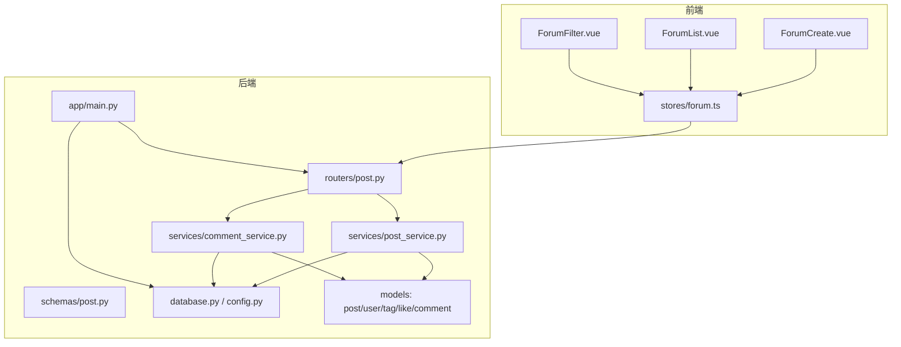
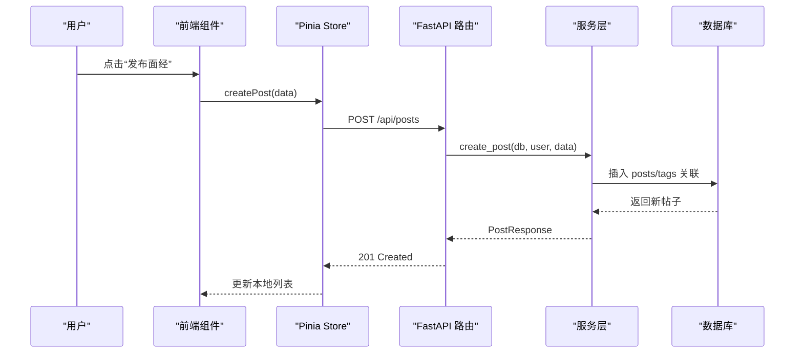
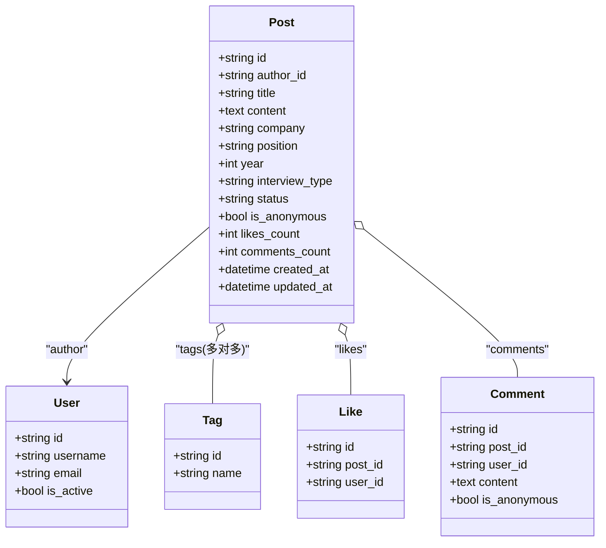
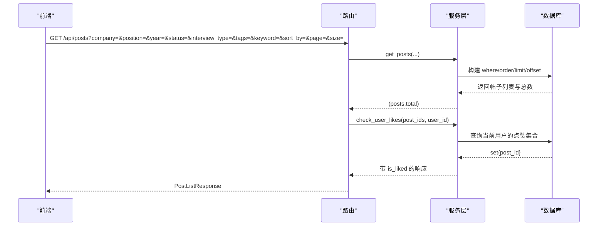
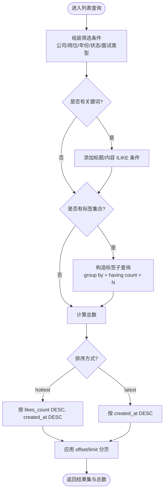
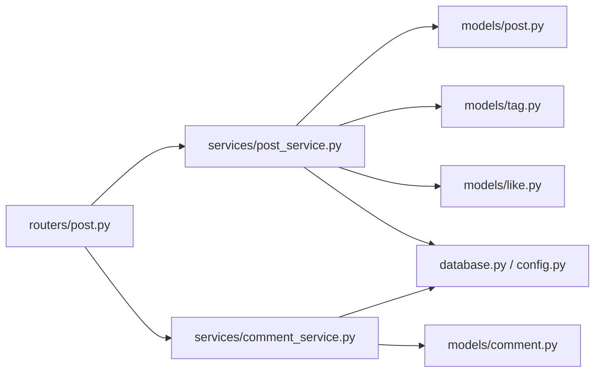

# 帖子管理系统

<cite>
**本文引用的文件**   
- [post.py](file://backEnd/app/models/post.py)
- [user.py](file://backEnd/app/models/user.py)
- [tag.py](file://backEnd/app/models/tag.py)
- [like.py](file://backEnd/app/models/like.py)
- [comment.py](file://backEnd/app/models/comment.py)
- [post.py](file://backEnd/app/routers/post.py)
- [post_service.py](file://backEnd/app/services/post_service.py)
- [comment_service.py](file://backEnd/app/services/comment_service.py)
- [post.py](file://backEnd/app/schemas/post.py)
- [database.py](file://backEnd/app/database.py)
- [config.py](file://backEnd/app/config.py)
- [main.py](file://backEnd/app/main.py)
- [forum.ts](file://frontEnd/src/stores/forum.ts)
- [ForumCreate.vue](file://frontEnd/src/components/forum/ForumCreate.vue)
- [ForumList.vue](file://frontEnd/src/components/forum/ForumList.vue)
- [ForumFilter.vue](file://frontEnd/src/components/forum/ForumFilter.vue)
</cite>

## 目录
1. [简介](#简介)
2. [项目结构](#项目结构)
3. [核心组件](#核心组件)
4. [架构总览](#架构总览)
5. [详细组件分析](#详细组件分析)
6. [依赖关系分析](#依赖关系分析)
7. [性能与索引优化](#性能与索引优化)
8. [故障排查指南](#故障排查指南)
9. [结论](#结论)
10. [附录](#附录)

## 简介
本技术文档面向 HR XF 帖子管理系统的“面经论坛”模块，围绕 Post 数据模型、CRUD 流程、搜索筛选、匿名发帖、状态管理、分页与排序、评论与点赞、以及前端交互进行系统化说明。文档同时给出数据库索引建议、查询复杂度分析与可落地的优化策略，帮助读者快速理解并扩展系统能力。

## 项目结构
后端采用 FastAPI + SQLAlchemy Async 异步 ORM，前后端通过 REST API 通信；前端使用 Vue 3 + Pinia 管理状态，提供筛选、列表、详情、发布等页面组件。

图表来源
- [main.py:44-90](file://backEnd/app/main.py#L44-L90)
- [post.py](file://backEnd/app/routers/post.py)
- [post_service.py](file://backEnd/app/services/post_service.py)
- [comment_service.py](file://backEnd/app/services/comment_service.py)
- [post.py](file://backEnd/app/schemas/post.py)
- [database.py](file://backEnd/app/database.py)
- [config.py](file://backEnd/app/config.py)
- [ForumCreate.vue](file://frontEnd/src/components/forum/ForumCreate.vue)
- [ForumList.vue](file://frontEnd/src/components/forum/ForumList.vue)
- [ForumFilter.vue](file://frontEnd/src/components/forum/ForumFilter.vue)
- [forum.ts](file://frontEnd/src/stores/forum.ts)

章节来源
- [main.py:44-90](file://backEnd/app/main.py#L44-L90)
- [post.py](file://backEnd/app/routers/post.py)
- [post_service.py](file://backEnd/app/services/post_service.py)
- [comment_service.py](file://backEnd/app/services/comment_service.py)
- [post.py](file://backEnd/app/schemas/post.py)
- [database.py](file://backEnd/app/database.py)
- [config.py](file://backEnd/app/config.py)
- [ForumCreate.vue](file://frontEnd/src/components/forum/ForumCreate.vue)
- [ForumList.vue](file://frontEnd/src/components/forum/ForumList.vue)
- [ForumFilter.vue](file://frontEnd/src/components/forum/ForumFilter.vue)
- [forum.ts](file://frontEnd/src/stores/forum.ts)

## 核心组件
- 数据模型层：Post、User、Tag、Like、Comment 定义实体与关联关系，包含结构化字段与时间戳。
- 服务层：post_service 实现帖子创建、查询（多条件组合、标签交集、关键词模糊匹配）、删除、点赞切换、统计与去重选项；comment_service 实现评论的增删查。
- 路由层：FastAPI 路由暴露 REST 接口，统一响应格式，处理可选认证与权限校验。
- 模式层：Pydantic 模型负责请求/响应校验与序列化。
- 前端：Pinia Store 封装 API 调用，Vue 组件负责表单、筛选、列表展示与交互。

章节来源
- [post.py](file://backEnd/app/models/post.py)
- [user.py](file://backEnd/app/models/user.py)
- [tag.py](file://backEnd/app/models/tag.py)
- [like.py](file://backEnd/app/models/like.py)
- [comment.py](file://backEnd/app/models/comment.py)
- [post_service.py](file://backEnd/app/services/post_service.py)
- [comment_service.py](file://backEnd/app/services/comment_service.py)
- [post.py](file://backEnd/app/routers/post.py)
- [post.py](file://backEnd/app/schemas/post.py)
- [forum.ts](file://frontEnd/src/stores/forum.ts)
- [ForumCreate.vue](file://frontEnd/src/components/forum/ForumCreate.vue)
- [ForumList.vue](file://frontEnd/src/components/forum/ForumList.vue)
- [ForumFilter.vue](file://frontEnd/src/components/forum/ForumFilter.vue)

## 架构总览
系统采用分层架构：前端组件通过 Pinia Store 发起 HTTP 请求至 FastAPI 路由，路由将业务逻辑委托给服务层，服务层基于 SQLAlchemy 异步 ORM 访问数据库。模型层定义表结构与关系，模式层约束输入输出。

图表来源
- [ForumCreate.vue](file://frontEnd/src/components/forum/ForumCreate.vue)
- [forum.ts](file://frontEnd/src/stores/forum.ts)
- [post.py](file://backEnd/app/routers/post.py)
- [post_service.py](file://backEnd/app/services/post_service.py)
- [post.py](file://backEnd/app/models/post.py)
- [tag.py](file://backEnd/app/models/tag.py)

## 详细组件分析

### 数据模型与字段语义
- Post 核心字段
  - 公司、岗位、年份、面试类型、状态：用于结构化检索与筛选，支撑按企业/岗位/年份/面试方式/结果状态的组合过滤。
  - 是否匿名：控制作者名显示为“匿名用户”。
  - 点赞数、评论数：计数字段，便于排序与展示。
  - 时间戳：创建与更新时间，支持最新排序。
- 关联关系
  - 作者：User（selectin 加载）。
  - 标签：多对多 Tag（通过 post_tags 中间表）。
  - 评论、点赞：一对多 Comment/Like（noload/selectin 按需加载）。

图表来源
- [post.py](file://backEnd/app/models/post.py)
- [user.py](file://backEnd/app/models/user.py)
- [tag.py](file://backEnd/app/models/tag.py)
- [like.py](file://backEnd/app/models/like.py)
- [comment.py](file://backEnd/app/models/comment.py)

章节来源
- [post.py](file://backEnd/app/models/post.py)
- [user.py](file://backEnd/app/models/user.py)
- [tag.py](file://backEnd/app/models/tag.py)
- [like.py](file://backEnd/app/models/like.py)
- [comment.py](file://backEnd/app/models/comment.py)

### 帖子 CRUD 流程
- 发布
  - 前端 ForumCreate 收集结构化字段与标签，提交到 /api/posts。
  - 路由校验当前用户，服务层创建 Post，若存在标签则获取或创建并建立多对多关系。
  - 返回包含作者名、标签、是否已点赞等信息的响应。
- 列表
  - 支持公司、岗位、年份、状态、面试类型、标签集合（必须全部命中）、关键词（标题/内容模糊）组合筛选。
  - 支持最新/最热排序，默认最新；分页参数 page/size。
  - 批量检查当前用户对帖子的点赞状态，填充 is_liked。
- 详情
  - 根据 ID 获取单条帖子，附带作者名与点赞状态。
- 删除
  - 仅作者可删除，否则返回权限错误。
- 点赞
  - 切换点赞状态，原子更新点赞计数，避免重复点赞。
- 评论
  - 新增评论时校验帖子存在，自动增加帖子评论数；删除评论时回退计数。

图表来源
- [post.py](file://backEnd/app/routers/post.py)
- [post_service.py](file://backEnd/app/services/post_service.py)
- [like.py](file://backEnd/app/models/like.py)

章节来源
- [post.py](file://backEnd/app/routers/post.py)
- [post_service.py](file://backEnd/app/services/post_service.py)
- [comment_service.py](file://backEnd/app/services/comment_service.py)
- [post.py](file://backEnd/app/schemas/post.py)

### 搜索与筛选机制
- 多条件组合
  - 非空条件以 AND 拼接；标签筛选要求“同时包含所有指定标签”，通过子查询 group by + having count = 标签数量实现。
- 全文检索
  - 关键词在标题与正文上进行 ILIKE 模糊匹配（大小写不敏感），适用于轻量级全文检索场景。
- 排序算法
  - latest：按 created_at 降序。
  - hottest：先按 likes_count 降序，再按 created_at 降序。
- 分页
  - 标准 offset/limit 分页，页码从 1 开始，每页大小 1~100。

图表来源
- [post_service.py](file://backEnd/app/services/post_service.py)

章节来源
- [post_service.py](file://backEnd/app/services/post_service.py)

### 匿名发帖与隐私保护
- 发布匿名
  - 前端 ForumCreate 提供“匿名发布”开关，提交 is_anonymous=true。
  - 后端 _build_post_response 在 is_anonymous 为真时将作者名渲染为“匿名用户”，隐藏真实用户名。
- 评论匿名
  - 评论同样支持 is_anonymous 标记，响应中匿名显示作者名。
- 权限控制
  - 发布、删除、点赞等操作需要登录态；删除操作仅允许作者本人执行，否则抛出权限异常并由路由转换为 403。

章节来源
- [ForumCreate.vue](file://frontEnd/src/components/forum/ForumCreate.vue)
- [post_service.py](file://backEnd/app/services/post_service.py)
- [comment_service.py](file://backEnd/app/services/comment_service.py)
- [post.py](file://backEnd/app/routers/post.py)

### 帖子状态管理与流转
- 状态枚举
  - in_progress（进行中）、offer（已获 offer）、waitlist（等待中/备胎）、rejected（被拒/感谢信）。
- 业务含义
  - 用于筛选与可视化展示，前端 StatusBadge 根据状态值渲染不同样式。
- 流转规则
  - 当前未实现服务端强制状态机，由用户在发布或后续编辑时选择状态；建议在后续版本引入状态变更审计与限制。

章节来源
- [post.py](file://backEnd/app/models/post.py)
- [post.py](file://backEnd/app/schemas/post.py)
- [ForumFilter.vue](file://frontEnd/src/components/forum/ForumFilter.vue)
- [ForumList.vue](file://frontEnd/src/components/forum/ForumList.vue)

### 高性能分页与缓存策略
- 分页
  - 使用 offset/limit 分页，配合索引字段提升扫描效率（见“性能与索引优化”）。
- 缓存建议
  - 热点数据（如热门帖子、标签统计、筛选器选项）可使用 Redis 缓存，设置合理过期时间。
  - 列表页可按筛选维度生成缓存键，结合 ETag/Last-Modified 减少重复计算。
  - 点赞状态可在前端乐观更新，服务端异步刷新计数，降低锁竞争。
- 配置方法
  - 可通过环境变量注入缓存地址与 TTL，并在服务层增加缓存读写封装；当前代码未内置缓存，可按需扩展。

[本节为通用指导，不涉及具体文件分析]

### 审核流程与敏感内容检测
- 现状
  - 当前未实现服务端审核与敏感词检测。
- 建议方案
  - 在发布前接入内容安全 API（例如文本分类/敏感词库），失败则拒绝发布或进入人工审核队列。
  - 引入后台审核任务与状态（待审/通过/驳回），管理员可对帖子进行处置。
  - 前端在发布时提示“内容正在审核，稍后生效”。

[本节为通用指导，不涉及具体文件分析]

## 依赖关系分析
- 路由依赖服务，服务依赖模型与数据库会话工厂。
- 多对多标签通过中间表 post_tags 维护，查询时需 join 与聚合。
- 点赞与评论均与用户和帖子建立外键关系，确保数据一致性。

图表来源
- [post.py](file://backEnd/app/routers/post.py)
- [post_service.py](file://backEnd/app/services/post_service.py)
- [comment_service.py](file://backEnd/app/services/comment_service.py)
- [post.py](file://backEnd/app/models/post.py)
- [tag.py](file://backEnd/app/models/tag.py)
- [like.py](file://backEnd/app/models/like.py)
- [comment.py](file://backEnd/app/models/comment.py)
- [database.py](file://backEnd/app/database.py)
- [config.py](file://backEnd/app/config.py)

章节来源
- [post.py](file://backEnd/app/routers/post.py)
- [post_service.py](file://backEnd/app/services/post_service.py)
- [comment_service.py](file://backEnd/app/services/comment_service.py)
- [post.py](file://backEnd/app/models/post.py)
- [tag.py](file://backEnd/app/models/tag.py)
- [like.py](file://backEnd/app/models/like.py)
- [comment.py](file://backEnd/app/models/comment.py)
- [database.py](file://backEnd/app/database.py)
- [config.py](file://backEnd/app/config.py)

## 性能与索引优化
- 现有索引
  - posts.author_id、posts.company、posts.position、posts.year、posts.status 已建索引，利于常见筛选与按作者查询。
  - tags.name 唯一索引，post_tags 联合主键保证唯一性。
  - likes.post_id、likes.user_id 有索引，加速点赞查询与去重。
  - comments.post_id、comments.user_id 有索引，加速评论分页与删除校验。
- 建议索引
  - 复合索引：(company, position, year)、(status, created_at)、(likes_count, created_at) 以提升组合筛选与排序性能。
  - 全文检索：若关键词查询成为瓶颈，可考虑 MySQL 全文索引或引入搜索引擎（如 Elasticsearch）。
- 查询复杂度
  - 列表查询：O(logN) 级别（借助索引）+ O(K) 结果集扫描；标签交集子查询会增加一次聚合开销。
  - 点赞切换：O(logN) 查找 + 常量更新。
  - 评论分页：O(logN) 定位 + O(M) 结果集扫描。
- 其他优化
  - 使用 selectin/noload 控制关联加载，避免 N+1。
  - 大结果集分页建议使用游标分页（基于 last_id）替代深度 offset。
  - 热点数据缓存（Redis）与前端缓存（ETag/If-None-Match）。

章节来源
- [post.py](file://backEnd/app/models/post.py)
- [tag.py](file://backEnd/app/models/tag.py)
- [like.py](file://backEnd/app/models/like.py)
- [comment.py](file://backEnd/app/models/comment.py)
- [post_service.py](file://backEnd/app/services/post_service.py)

## 故障排查指南
- 验证错误
  - 自定义 RequestValidationError 处理器会移除可能包含二进制内容的 input 字段，避免解码异常。
- 权限问题
  - 删除帖子/评论时若非作者，将抛出 PermissionError，路由将其转为 403。
- 资源不存在
  - 删除/点赞/评论时若目标不存在，返回 404。
- 数据库连接
  - 针对 aiomysql 0.3.x ping 签名差异做了兼容补丁，避免 pool_pre_ping 报错。

章节来源
- [main.py:76-84](file://backEnd/app/main.py#L76-L84)
- [post.py](file://backEnd/app/routers/post.py)
- [post_service.py](file://backEnd/app/services/post_service.py)
- [comment_service.py](file://backEnd/app/services/comment_service.py)
- [database.py:14-24](file://backEnd/app/database.py#L14-L24)

## 结论
该帖子管理系统在后端实现了清晰的模型-服务-路由分层，具备结构化筛选、标签交集、关键词模糊检索、分页排序、匿名发布与基础权限控制等能力。前端提供了完善的发布与筛选交互。建议在后续迭代中引入审核流程、敏感内容检测、更高效的全文检索与缓存策略，进一步提升安全性与性能。

## 附录

### API 概览（节选）
- 发布帖子
  - 方法：POST
  - 路径：/api/posts
  - 鉴权：需要
  - 请求体：PostCreate
  - 响应：PostResponse
- 获取帖子列表
  - 方法：GET
  - 路径：/api/posts
  - 查询参数：company、position、year、status、interview_type、tags、keyword、sort_by、page、size
  - 响应：PostListResponse
- 获取帖子详情
  - 方法：GET
  - 路径：/api/posts/{post_id}
  - 响应：PostResponse
- 删除帖子
  - 方法：DELETE
  - 路径：/api/posts/{post_id}
  - 鉴权：需要（仅作者）
- 点赞/取消点赞
  - 方法：POST
  - 路径：/api/posts/{post_id}/like
  - 鉴权：需要
- 评论
  - 新增：POST /api/posts/{post_id}/comments
  - 列表：GET /api/posts/{post_id}/comments
  - 删除：DELETE /api/posts/comments/{comment_id}
- 筛选器选项
  - 方法：GET
  - 路径：/api/posts/filters/options
  - 响应：companies、positions、statuses、interview_types、years
- 热门标签统计
  - 方法：GET
  - 路径：/api/posts/tags/stats
  - 响应：TagStat[]

章节来源
- [post.py](file://backEnd/app/routers/post.py)
- [post.py](file://backEnd/app/schemas/post.py)